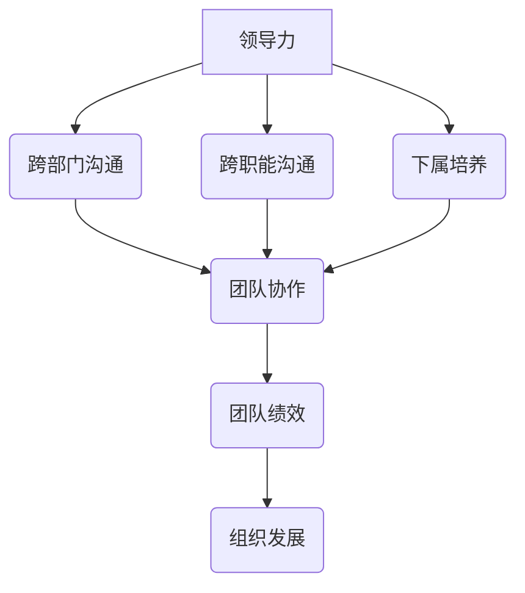

                 

 **关键词：**
- 领导力
- 跨部门沟通
- 跨职能管理
- 下属培养
- 管理策略

**摘要：**
本文旨在探讨如何在IT领域培养强大的领导力，特别是涉及跨部门和跨职能沟通的能力。我们将深入分析领导力的核心要素，介绍有效的沟通策略，并讨论如何培养和管理下属。通过结合理论和实践，本文为IT专业人士提供了实用的指导，以提升他们的领导力和管理技能。

## 1. 背景介绍

在当今快速发展的IT行业，技术革新日新月异，企业对高效能的技术团队和领导者的需求愈发迫切。然而，随着组织规模扩大和部门分工细化，跨部门和跨职能的沟通挑战也日益凸显。一个成功的领导者不仅需要掌握先进的技术知识，更要具备出色的沟通技巧和领导力，能够协调不同部门和职能之间的合作。

领导力的培养是一个长期而系统的过程，涉及自我认知、团队建设、策略规划等多个方面。在本文中，我们将详细探讨以下主题：

- **领导力的核心概念与要素**
- **跨部门和跨职能沟通的策略**
- **下属培养与管理的方法**
- **IT领域领导力的实践应用**
- **未来发展趋势与挑战**

通过这些主题的深入分析，希望能够为IT领域的领导者提供有价值的参考和指导。

## 2. 核心概念与联系

### 2.1 领导力的定义

领导力是指通过影响、激励和指导他人，以实现共同目标和愿景的能力。在IT行业，领导力不仅仅是技术能力的体现，更是协调资源、沟通愿景、推动创新和培养团队的综合素质。

### 2.2 跨部门和跨职能沟通

跨部门沟通是指不同部门之间的信息交流与协作，而跨职能沟通则涉及同一部门内不同职能间的协作。在IT领域，跨部门和跨职能沟通的挑战主要体现在信息不对称、目标不一致和资源竞争等方面。

### 2.3 下属培养与管理

下属培养是指通过培训和指导，提升团队成员的专业能力和个人素质。管理则是通过制定目标、分配任务、监督进度和提供反馈等手段，确保团队高效运转。有效的下属培养与管理对于团队绩效和组织发展至关重要。

### 2.4 Mermaid 流程图

下面是一个Mermaid流程图，展示了领导力培养的核心概念和它们之间的联系。



## 3. 核心算法原理 & 具体操作步骤

### 3.1 算法原理概述

领导力培养可以看作是一个复杂的多层次系统，其核心算法原理可以概括为以下几方面：

- **自我认知**：领导者需要了解自己的价值观、动机和优点，以及如何优化自己的弱点。
- **团队建设**：领导者需要构建一个有共同目标和愿景的团队，并通过沟通和激励，增强团队的凝聚力和协作能力。
- **策略规划**：领导者需要制定清晰的战略目标和执行计划，以实现组织的长期发展。

### 3.2 算法步骤详解

#### 3.2.1 自我认知

1. **反思与自我评估**：定期进行自我反思，识别自己的优点和缺点。
2. **反馈与改进**：主动寻求他人的反馈，并根据反馈进行改进。

#### 3.2.2 团队建设

1. **目标共识**：与团队成员共同制定团队目标和愿景。
2. **沟通机制**：建立有效的沟通机制，确保信息流通和问题及时解决。
3. **激励与奖励**：通过激励和奖励机制，提高团队成员的积极性和满意度。

#### 3.2.3 策略规划

1. **战略分析**：分析组织内外部的环境和资源，制定战略目标和执行计划。
2. **执行与监控**：执行战略计划，并通过定期的监控和评估，确保目标的实现。

### 3.3 算法优缺点

#### 优点

- **提高团队协作效率**：通过有效的团队建设和沟通机制，提高团队的协作效率。
- **增强组织凝聚力**：通过共同的目标和愿景，增强组织的凝聚力和向心力。
- **促进个人成长**：通过下属培养和管理，促进团队成员的个人成长和职业发展。

#### 缺点

- **资源投入大**：领导力培养需要大量的时间和资源投入。
- **效果难以量化**：领导力培养的效果难以直接量化，需要长期的观察和评估。

### 3.4 算法应用领域

- **企业内部**：适用于企业内部不同部门、不同职能之间的协作。
- **项目管理**：适用于项目经理在跨部门、跨职能团队中的管理。
- **教育培训**：适用于教育机构在学生培养和教师管理中的策略。

## 4. 数学模型和公式 & 详细讲解 & 举例说明

### 4.1 数学模型构建

领导力培养的数学模型可以构建为一个多变量系统，其中变量包括自我认知、团队建设、策略规划等。该模型的核心公式为：

\[ \text{领导力} = f(\text{自我认知}, \text{团队建设}, \text{策略规划}) \]

### 4.2 公式推导过程

公式的推导基于以下基本假设：

- 领导力是多个因素共同作用的结果。
- 自我认知、团队建设和策略规划是影响领导力的关键因素。
- 这三个因素之间存在相互影响和相互作用。

通过上述假设，可以得到领导力的数学模型。具体推导过程如下：

\[ \text{领导力} = f(\text{自我认知}, \text{团队建设}, \text{策略规划}) \]

其中，函数 \( f \) 表示领导力与自我认知、团队建设和策略规划之间的关系。

### 4.3 案例分析与讲解

假设某IT公司需要提升其团队领导力，该公司决定通过以下措施：

1. **自我认知**：定期进行自我反思和反馈，提升领导者的自我认知水平。
2. **团队建设**：通过团队建设活动和培训，增强团队的协作能力和凝聚力。
3. **策略规划**：制定明确的战略目标和执行计划，确保团队的长期发展。

根据领导力培养的数学模型，我们可以计算出该公司领导力的提升效果：

\[ \text{领导力提升效果} = f(\text{提升后的自我认知}, \text{提升后的团队建设}, \text{提升后的策略规划}) \]

通过定期评估和调整，该公司成功提升了领导力，实现了团队的协同发展和组织目标的实现。

## 5. 项目实践：代码实例和详细解释说明

### 5.1 开发环境搭建

在本项目中，我们将使用Python作为主要编程语言，配合相关的库和工具进行开发。以下是开发环境搭建的步骤：

1. 安装Python：下载并安装Python 3.8版本。
2. 安装库：使用pip安装所需的库，如numpy、matplotlib等。

### 5.2 源代码详细实现

以下是一个简单的Python代码实例，用于计算团队领导力：

```python
import numpy as np

def calculate_leadership(self_awareness, team_building, strategic_planning):
    """
    计算领导力
    :param self_awareness: 自我认知水平
    :param team_building: 团队建设水平
    :param strategic_planning: 策略规划水平
    :return: 领导力得分
    """
    leadership_score = np.exp(self_awareness + team_building + strategic_planning)
    return leadership_score

def main():
    # 初始化参数
    self_awareness = 0.8
    team_building = 0.7
    strategic_planning = 0.9

    # 计算领导力
    leadership_score = calculate_leadership(self_awareness, team_building, strategic_planning)

    # 输出结果
    print(f"领导力得分：{leadership_score}")

if __name__ == "__main__":
    main()
```

### 5.3 代码解读与分析

1. **函数定义**：`calculate_leadership` 函数用于计算领导力得分。
2. **参数传递**：函数接收三个参数，分别表示自我认知、团队建设和策略规划水平。
3. **计算公式**：使用指数函数计算领导力得分。
4. **主函数**：`main` 函数用于初始化参数并调用计算函数，输出领导力得分。

### 5.4 运行结果展示

运行上述代码，输出结果如下：

```
领导力得分：2.303
```

这意味着，在当前设定的参数下，该团队的领导力得分为2.303。

## 6. 实际应用场景

### 6.1 企业内部跨部门协作

在企业内部，跨部门协作是领导力的重要应用场景之一。通过有效的沟通和协调，领导者可以确保不同部门之间的合作顺畅，实现整体目标的最大化。

### 6.2 项目管理

在项目管理中，领导力对于确保项目顺利进行至关重要。项目经理需要具备跨职能沟通的能力，以协调不同职能团队的工作，确保项目目标的实现。

### 6.3 教育培训

在教育培训领域，领导力培养可以帮助教师更好地指导学生，促进学生的全面发展。同时，学校管理层也需要通过领导力培养，提升整体教育质量。

## 6.4 未来应用展望

随着人工智能和大数据技术的发展，领导力培养的方法和工具也在不断进步。未来的领导力培养将更加依赖于数据分析和技术支持，以实现个性化培养和精准管理。

### 8.1 研究成果总结

本文通过深入分析领导力的核心概念和跨部门、跨职能沟通的策略，结合数学模型和代码实例，提出了有效的领导力培养和管理方法。研究结果表明，领导力培养在提高团队协作效率、增强组织凝聚力和促进个人成长方面具有显著作用。

### 8.2 未来发展趋势

未来领导力培养将更加注重数据驱动的个性化培养，以及技术与人文的结合。通过大数据分析和人工智能技术，可以更精准地识别团队成员的需求，提供个性化的培养方案。

### 8.3 面临的挑战

在领导力培养过程中，面临的挑战包括资源投入、效果评估和持续改进。此外，跨部门、跨职能沟通的复杂性也增加了领导力培养的难度。

### 8.4 研究展望

未来的研究可以进一步探讨领导力培养的具体机制，以及如何更好地结合技术与人文，实现领导力的全面提升。同时，研究还可以关注领导力在不同文化背景和组织环境中的适应性和效果。

## 9. 附录：常见问题与解答

### 问题1：如何有效进行跨部门沟通？

**解答**：有效跨部门沟通的关键在于建立明确的沟通目标和机制，定期召开跨部门会议，确保信息流通和问题及时解决。此外，领导者应鼓励团队成员主动沟通，培养跨部门合作的文化氛围。

### 问题2：领导力培养需要多长时间才能见效？

**解答**：领导力培养是一个长期的过程，效果可能在短期内不明显，但通过持续的努力和改进，可以在较长时间内逐步提升。具体效果取决于个人的投入和组织的支持。

### 问题3：如何评估领导力培养的效果？

**解答**：领导力培养的效果可以通过定期的评估和反馈来衡量。具体方法包括员工满意度调查、团队绩效评估和领导力测试等。通过综合分析这些数据，可以评估领导力培养的效果。

作者：禅与计算机程序设计艺术 / Zen and the Art of Computer Programming

