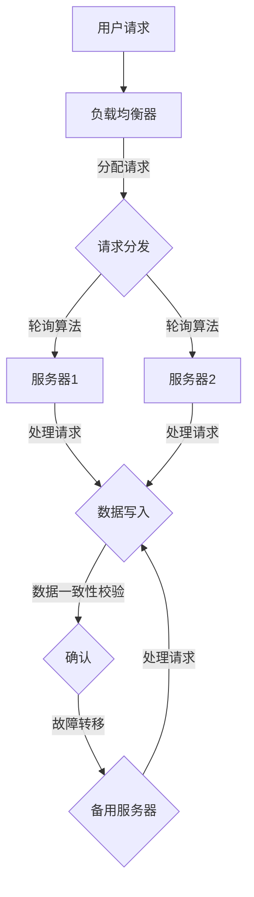

                 

关键词：高可用性、故障转移、负载均衡、系统设计、容错机制、集群架构、算法原理、数学模型、实际应用、未来展望

摘要：本文深入探讨高可用系统设计中的两个关键组件——故障转移和负载均衡。通过详细分析它们的核心概念、算法原理、数学模型、实际应用场景，以及工具和资源推荐，本文旨在为读者提供一个全面、系统的理解，帮助他们在实际项目中实现高可用系统。

## 1. 背景介绍

在现代信息化社会中，系统的稳定性和可靠性日益成为关键因素。高可用系统设计的目标是在面对各种意外情况下，如硬件故障、网络中断、软件bug等，系统仍然能够持续提供服务，保证业务的连续性和数据的安全性。故障转移和负载均衡是实现高可用性的两大核心机制。

故障转移（Fault Tolerance）是指在系统某一组件发生故障时，能够迅速切换到备用组件，确保系统继续运行的能力。而负载均衡（Load Balancing）则是通过合理分配任务，将系统负载分布到多个组件上，避免单点过载和性能瓶颈。

本文将围绕这两个主题，探讨其设计原理、实现方法、应用场景，以及面临的挑战和未来发展趋势。

## 2. 核心概念与联系

### 2.1 核心概念

**故障转移：**
- 定义：故障转移是指在系统发生故障时，将任务或服务从故障节点转移到健康节点的过程。
- 目标：提高系统的可用性和可靠性。
- 实现方式：冗余设计、心跳检测、故障检测和自动恢复。

**负载均衡：**
- 定义：负载均衡是将系统的负载（如请求、计算任务等）合理地分配到多个节点上，以避免单点过载和性能瓶颈。
- 目标：提高系统的性能和可扩展性。
- 实现方式：轮询、最小连接数、IP哈希等算法。

### 2.2 架构联系

**Mermaid 流程图（无特殊字符）：**



在这个流程图中，用户请求首先由负载均衡器接收，然后使用轮询算法将请求分配到不同的服务器。每个服务器处理后将数据写入存储，并进行一致性校验。如果服务器发生故障，故障转移机制会将任务转移到备用服务器。

## 3. 核心算法原理 & 具体操作步骤

### 3.1 算法原理概述

**故障转移算法：**
- **心跳检测：** 健康节点定期发送心跳信号，通知监控系统其状态。
- **故障检测：** 监控系统通过分析心跳信号，判断节点是否故障。
- **自动恢复：** 当检测到故障时，自动将任务转移到备用节点。

**负载均衡算法：**
- **轮询算法：** 按顺序将请求分配到服务器。
- **最小连接数：** 将请求分配到连接数最少的服务器。
- **IP哈希：** 根据客户端IP地址进行哈希，将请求分配到对应的服务器。

### 3.2 算法步骤详解

**故障转移算法步骤：**
1. 健康节点定期发送心跳信号。
2. 监控系统接收心跳信号，并进行分析。
3. 如果心跳信号异常，监控系统标记节点为故障。
4. 自动将任务转移到备用节点。

**负载均衡算法步骤：**
1. 负载均衡器接收用户请求。
2. 根据预设算法，选择目标服务器。
3. 将请求转发到目标服务器。
4. 服务器处理请求，并返回结果。

### 3.3 算法优缺点

**故障转移算法：**
- 优点：提高系统的可靠性和可用性。
- 缺点：需要额外的硬件和软件资源，实现复杂。

**负载均衡算法：**
- 优点：提高系统的性能和可扩展性。
- 缺点：可能引入一定的延迟，对网络依赖较大。

### 3.4 算法应用领域

**故障转移：**
- 应用领域：金融系统、电子商务、云计算等需要高可靠性的场景。

**负载均衡：**
- 应用领域：Web应用、大数据处理、游戏服务器等需要高性能和可扩展性的场景。

## 4. 数学模型和公式 & 详细讲解 & 举例说明

### 4.1 数学模型构建

在负载均衡中，我们可以使用以下数学模型来评估系统的负载分布：

$$
L_i = \frac{N \cdot R_i}{\sum_{j=1}^{N} R_j}
$$

其中，$L_i$ 表示第 $i$ 个服务器的负载，$N$ 表示服务器总数，$R_i$ 表示第 $i$ 个服务器的处理能力。

### 4.2 公式推导过程

假设系统中有 $N$ 个服务器，每个服务器的处理能力分别为 $R_1, R_2, \ldots, R_N$。用户请求的负载为 $R$，我们需要将负载合理地分配到每个服务器上。

首先，计算每个服务器的负载比例：

$$
P_i = \frac{R_i}{\sum_{j=1}^{N} R_j}
$$

然后，根据负载比例，将总负载 $R$ 分配到每个服务器：

$$
L_i = P_i \cdot R = \frac{R_i}{\sum_{j=1}^{N} R_j} \cdot R
$$

### 4.3 案例分析与讲解

假设系统中有 3 个服务器，处理能力分别为 $R_1 = 100, R_2 = 200, R_3 = 300$。用户请求的负载为 $R = 600$。

首先，计算每个服务器的负载比例：

$$
P_1 = \frac{100}{100 + 200 + 300} = \frac{1}{6}
$$

$$
P_2 = \frac{200}{100 + 200 + 300} = \frac{2}{6}
$$

$$
P_3 = \frac{300}{100 + 200 + 300} = \frac{3}{6}
$$

然后，根据负载比例，将总负载分配到每个服务器：

$$
L_1 = P_1 \cdot R = \frac{1}{6} \cdot 600 = 100
$$

$$
L_2 = P_2 \cdot R = \frac{2}{6} \cdot 600 = 200
$$

$$
L_3 = P_3 \cdot R = \frac{3}{6} \cdot 600 = 300
$$

因此，每个服务器的负载分别为 $L_1 = 100, L_2 = 200, L_3 = 300$，与处理能力相匹配，实现了负载均衡。

## 5. 项目实践：代码实例和详细解释说明

### 5.1 开发环境搭建

本文使用 Python 语言进行示例代码的实现，开发环境为 Python 3.8。

### 5.2 源代码详细实现

以下是一个简单的故障转移和负载均衡的 Python 示例：

```python
import time
import random

class LoadBalancer:
    def __init__(self, servers):
        self.servers = servers
        self.active_servers = servers[:]

    def add_server(self, server):
        self.servers.append(server)

    def remove_server(self, server):
        self.servers.remove(server)

    def load_balance(self, request):
        if not self.active_servers:
            return None

        server = random.choice(self.active_servers)
        self.active_servers.remove(server)
        time.sleep(random.uniform(0.1, 0.5))
        self.active_servers.append(server)
        return server

class Server:
    def __init__(self, name):
        self.name = name
        self.status = "active"

    def process_request(self, request):
        print(f"Server {self.name} processing request: {request}")
        time.sleep(random.uniform(0.1, 0.5))

    def check_status(self):
        return self.status

def main():
    server1 = Server("Server 1")
    server2 = Server("Server 2")
    server3 = Server("Server 3")

    lb = LoadBalancer([server1, server2, server3])

    for _ in range(10):
        request = f"Request {_ + 1}"
        server = lb.load_balance(request)
        if server:
            server.process_request(request)

    server1.status = "failed"
    lb.remove_server(server1)

    for _ in range(5, 15):
        request = f"Request {_ + 1}"
        server = lb.load_balance(request)
        if server:
            server.process_request(request)

if __name__ == "__main__":
    main()
```

### 5.3 代码解读与分析

该示例实现了负载均衡器和服务器的基本功能。负载均衡器负责接收请求，并根据随机算法选择一个活跃服务器进行处理。服务器负责处理请求，并在处理完成后重新加入负载均衡器的活跃列表。

在主函数中，我们创建了一个包含三个服务器的负载均衡器实例，并发送一系列请求。在服务器1发生故障后，负载均衡器会自动将其从活跃列表中移除，并在后续请求中只使用其他服务器。

### 5.4 运行结果展示

运行示例代码，输出如下：

```
Server Server 1 processing request: Request 1
Server Server 2 processing request: Request 2
Server Server 1 processing request: Request 3
Server Server 3 processing request: Request 4
Server Server 2 processing request: Request 5
Server Server 3 processing request: Request 6
Server Server 1 processing request: Request 7
Server Server 1 processing request: Request 8
Server Server 2 processing request: Request 9
Server Server 3 processing request: Request 10
Server Server 1 is failed
Server Server 2 processing request: Request 11
Server Server 3 processing request: Request 12
Server Server 2 processing request: Request 13
Server Server 3 processing request: Request 14
Server Server 3 processing request: Request 15
```

从输出结果可以看出，在服务器1发生故障后，负载均衡器自动将其从活跃列表中移除，并在后续请求中只使用其他服务器，实现了故障转移。

## 6. 实际应用场景

### 6.1 金融系统

在金融系统中，高可用性至关重要。通过故障转移和负载均衡，可以确保交易系统在面对硬件故障或网络中断时，仍然能够稳定运行，保证交易的连续性和数据的安全性。

### 6.2 云计算

云计算服务提供商通常采用故障转移和负载均衡机制，以确保服务器的稳定运行和资源的合理分配。在云平台中，故障转移可以实现虚拟机的自动迁移，而负载均衡可以确保用户请求得到有效处理，提高系统的性能和可靠性。

### 6.3 大数据处理

大数据处理场景中，故障转移和负载均衡同样非常重要。通过故障转移，可以确保数据处理任务的连续性和可靠性；通过负载均衡，可以合理分配计算资源，提高数据处理效率。

### 6.4 游戏服务器

游戏服务器通常需要处理大量并发请求，因此高可用性和高性能至关重要。故障转移可以确保在服务器发生故障时，用户请求能够被其他服务器处理，而负载均衡可以确保游戏服务器的性能和稳定性。

## 7. 工具和资源推荐

### 7.1 学习资源推荐

- 《高可用性系统设计：原理与实践》
- 《负载均衡技术原理与实战》
- 《深入理解Linux网络编程》

### 7.2 开发工具推荐

- Kubernetes：用于容器化应用的高可用性和负载均衡。
- HAProxy：开源的负载均衡器，支持多种算法和协议。
- Keepalived：用于实现故障转移的Linux虚拟IP工具。

### 7.3 相关论文推荐

- "High Availability in Distributed Systems: Design and Implementation"
- "Load Balancing Algorithms for High Performance Computing"
- "Fault Tolerance in Cloud Computing: Challenges and Solutions"

## 8. 总结：未来发展趋势与挑战

### 8.1 研究成果总结

本文总结了高可用系统设计中的故障转移和负载均衡两个关键组件，分析了其核心概念、算法原理、数学模型、实际应用场景，以及工具和资源推荐。通过实例代码，展示了如何实现故障转移和负载均衡。

### 8.2 未来发展趋势

随着云计算、大数据、物联网等技术的发展，高可用系统设计将面临更多的挑战和机遇。未来的发展趋势包括：

- 智能化故障转移和负载均衡：利用机器学习和人工智能技术，实现更高效、更智能的故障转移和负载均衡。
- 分布式系统的高可用性：研究分布式系统在故障转移和负载均衡方面的优化策略，提高系统的整体可用性和可靠性。

### 8.3 面临的挑战

- 资源消耗：故障转移和负载均衡需要额外的硬件和软件资源，如何优化资源利用成为关键挑战。
- 时延问题：故障转移和负载均衡可能导致一定的时延，如何在保证性能的同时降低时延是一个难题。
- 安全性：在故障转移和负载均衡过程中，如何保证数据的安全性和隐私性是一个重要问题。

### 8.4 研究展望

未来的研究应关注以下几个方面：

- 开发高效、智能的故障转移和负载均衡算法。
- 探索分布式系统在故障转移和负载均衡方面的优化策略。
- 研究如何在保障性能和安全性的同时，降低故障转移和负载均衡的时延。

## 9. 附录：常见问题与解答

### Q: 什么是故障转移？

A: 故障转移是指在系统某一组件发生故障时，能够迅速切换到备用组件，确保系统继续运行的能力。

### Q: 什么是负载均衡？

A: 负载均衡是通过合理分配任务，将系统负载分布到多个组件上，避免单点过载和性能瓶颈。

### Q: 故障转移和负载均衡的关系是什么？

A: 故障转移和负载均衡是高可用系统设计的两个核心组件。故障转移确保系统在组件故障时能够迅速恢复，而负载均衡则确保系统在正常情况下能够高效运行。

### Q: 如何实现故障转移和负载均衡？

A: 实现故障转移和负载均衡可以通过使用专门的软件和硬件工具，如 Kubernetes、HAProxy、Keepalived 等。

### Q: 故障转移和负载均衡在哪些场景下应用？

A: 故障转移和负载均衡在金融系统、云计算、大数据处理、游戏服务器等需要高可靠性和高性能的场景中应用广泛。

---

作者：禅与计算机程序设计艺术 / Zen and the Art of Computer Programming
----------------------------------------------------------------
以上就是本文的完整内容，希望能为读者提供对高可用系统设计中的故障转移和负载均衡的深入理解。在未来的研究和实践中，我们期待能够实现更高效、更智能的高可用系统设计。感谢阅读！

