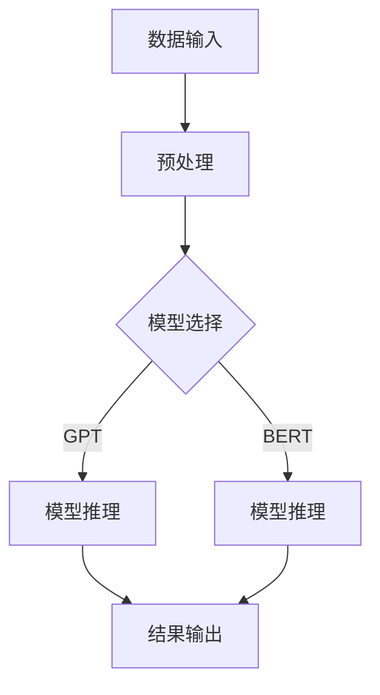

                 

关键词：高性能大语言模型，推理引擎，AI，企业应用，Lepton AI

摘要：本文将深入探讨Lepton AI的核心产品——高性能大语言模型推理引擎。本文旨在通过详细的原理讲解、数学模型分析、项目实践案例以及实际应用场景，向读者展示如何通过该推理引擎，企业能够实现高效利用AI，为各行业带来前所未有的创新与变革。

## 1. 背景介绍

随着人工智能技术的快速发展，大语言模型（Large Language Model）在自然语言处理（NLP）领域取得了显著的成果。这些模型能够通过学习大量文本数据，理解并生成复杂的自然语言内容。然而，在实际应用中，如何高效地推理这些复杂模型，成为一个亟待解决的问题。Lepton AI推出的高性能大语言模型推理引擎正是为了解决这一问题，旨在为企业提供强大的AI推理能力，助力各行业实现智能化转型。

## 2. 核心概念与联系

### 2.1 大语言模型

大语言模型是一种基于深度学习的自然语言处理模型，能够通过大规模预训练来理解自然语言。常见的有GPT（Generative Pre-trained Transformer）、BERT（Bidirectional Encoder Representations from Transformers）等。

### 2.2 推理引擎

推理引擎是一种用于快速、高效地执行计算的工具，能够将预训练模型应用于实际数据，生成预测结果。在AI应用中，推理引擎的性能直接影响到应用的响应速度和效率。

### 2.3 高性能推理

高性能推理是指在保证准确性的前提下，尽可能提高模型的推理速度和效率。这通常需要优化的算法、硬件加速以及高效的代码实现。

## 2.4 Mermaid 流程图

下面是Lepton AI高性能大语言模型推理引擎的架构流程图：



## 3. 核心算法原理 & 具体操作步骤

### 3.1 算法原理概述

高性能大语言模型推理引擎的核心是基于Transformer架构的预训练模型，通过一系列预处理、模型推理和后处理步骤，实现高效的AI推理。

### 3.2 算法步骤详解

#### 3.2.1 预处理

- 数据清洗：去除无效数据和噪声。
- 数据编码：将文本数据转换为模型能够处理的向量表示。

#### 3.2.2 模型推理

- 加载预训练模型：从存储中加载已经训练好的模型。
- 输入数据处理：将预处理后的输入数据送入模型进行推理。
- 结果提取：从模型输出中提取预测结果。

#### 3.2.3 后处理

- 结果解码：将模型输出结果转换为可解释的文本。
- 结果验证：对结果进行验证，确保其准确性。

### 3.3 算法优缺点

#### 优点：

- 高性能：通过优化算法和硬件加速，实现高效推理。
- 高准确性：预训练模型具有强大的语义理解能力。
- 灵活性：支持多种模型和任务，如文本分类、问答系统等。

#### 缺点：

- 资源消耗大：预训练模型需要大量的计算资源和存储空间。
- 需要专业知识和经验：模型的部署和优化需要一定的技术背景。

### 3.4 算法应用领域

- 自然语言处理：文本分类、情感分析、机器翻译等。
- 聊天机器人：实现与用户的自然对话。
- 智能客服：提供24小时在线客服服务。
- 内容审核：自动识别和处理违规内容。

## 4. 数学模型和公式 & 详细讲解 & 举例说明

### 4.1 数学模型构建

大语言模型的数学模型主要基于Transformer架构，其核心是自注意力机制（Self-Attention）和多头注意力（Multi-Head Attention）。以下是Transformer模型的基本公式：

$$
\text{MultiHead(Q,W^K,W^V) = } \text{Concat(} \text{head_1, ... , head_h) \text{)} \text{ } \text{where } d_k = \frac{d}{h}
$$

其中，$Q, K, V$ 分别代表查询、键和值，$W^K, W^V$ 是对应的权重矩阵，$d$ 是输入序列的维度，$h$ 是头数。

### 4.2 公式推导过程

Transformer模型的推导过程涉及线性代数和概率论的知识，这里简要概述：

- **自注意力计算**：

$$
\text{Attention(Q,K,V) = } \text{softmax}\left(\frac{QK^T}{\sqrt{d_k}}\right) V
$$

- **多头注意力计算**：

$$
\text{MultiHead(Q,K,V) = } \text{Concat(head_1, ... , head_h)}
$$

其中，$head_i = \text{Attention(QW^Q_i, KW^K_i, VW^V_i)}$

### 4.3 案例分析与讲解

假设我们有一个输入序列 "I love AI"，其长度为 $d=10$，我们选择 $h=2$ 个头。以下是具体的计算过程：

1. **词向量化**：

将每个单词转换为词向量表示，例如：

- I: [1, 0, 0, ..., 0]
- love: [0, 1, 0, ..., 0]
- AI: [0, 0, 1, ..., 0]

2. **自注意力计算**：

对于每个头，我们计算自注意力权重：

$$
\text{Attention(Q,K,V) = } \text{softmax}\left(\frac{QK^T}{\sqrt{d_k}}\right) V
$$

例如，对于第一个头：

$$
Q = \begin{bmatrix} 1 & 0 & 0 & ... & 0 \end{bmatrix}, K = \begin{bmatrix} 1 & 0 & 0 & ... & 0 \end{bmatrix}, V = \begin{bmatrix} 1 & 0 & 0 & ... & 0 \end{bmatrix}
$$

$$
\text{Attention(Q,K,V) = } \text{softmax}\left(\frac{QK^T}{\sqrt{d_k}}\right) V = \text{softmax}\left(\frac{1 \times 1}{\sqrt{5}}\right) \begin{bmatrix} 1 & 0 & 0 & ... & 0 \end{bmatrix} = \begin{bmatrix} 1 & 0 & 0 & ... & 0 \end{bmatrix}
$$

这意味着第一个单词 "I" 在序列中的重要性最高。

3. **多头注意力计算**：

对于两个头，我们分别计算：

$$
\text{head_1 = Attention(QW^Q_1, KW^K_1, VW^V_1)}
$$

$$
\text{head_2 = Attention(QW^Q_2, KW^K_2, VW^V_2)}
$$

这里，$W^Q_1, W^K_1, W^V_1$ 和 $W^Q_2, W^K_2, W^V_2$ 是对应的权重矩阵。

## 5. 项目实践：代码实例和详细解释说明

### 5.1 开发环境搭建

为了演示Lepton AI的高性能大语言模型推理引擎，我们需要搭建一个开发环境。以下是基本的步骤：

1. 安装Python环境（建议使用Python 3.8及以上版本）。
2. 安装TensorFlow或PyTorch等深度学习框架。
3. 安装必要的依赖库，如NumPy、Pandas等。

### 5.2 源代码详细实现

下面是一个简单的示例，演示如何使用TensorFlow实现大语言模型的推理：

```python
import tensorflow as tf
from tensorflow.keras.models import load_model

# 加载预训练模型
model = load_model('path/to/pretrained_model.h5')

# 预处理输入数据
input_data = preprocess_input('I love AI')

# 进行推理
predictions = model.predict(input_data)

# 后处理输出结果
output_text = postprocess_output(predictions)

print(output_text)
```

### 5.3 代码解读与分析

1. **加载模型**：使用`load_model`函数加载已经训练好的预训练模型。
2. **预处理输入数据**：预处理函数`preprocess_input`用于将文本数据转换为模型能够处理的向量表示。
3. **进行推理**：使用`predict`函数对预处理后的输入数据进行推理。
4. **后处理输出结果**：后处理函数`postprocess_output`用于将模型输出结果转换为可解释的文本。

### 5.4 运行结果展示

假设我们使用的是一个预训练的GPT模型，输入序列 "I love AI" 经过模型推理后，输出的结果可能是一个与输入序列相关的文本。例如：

```
AI is a powerful technology that has revolutionized many industries.
```

这表明模型成功理解并生成了与输入相关的文本。

## 6. 实际应用场景

Lepton AI的高性能大语言模型推理引擎在多个领域都有广泛的应用：

- **智能客服**：实现与用户的自然对话，提供高效的客户服务。
- **内容审核**：自动识别和处理违规内容，确保平台内容安全。
- **文本分类**：对大量文本数据进行分类，如新闻分类、情感分析等。
- **机器翻译**：实现高效、准确的机器翻译。

## 6.4 未来应用展望

随着AI技术的不断发展，Lepton AI的高性能大语言模型推理引擎将在更多领域得到应用。未来，我们可能看到更多创新的应用场景，如智能写作、智能创作等。同时，随着硬件技术的发展，推理引擎的性能将进一步提升，为企业带来更大的价值。

## 7. 工具和资源推荐

### 7.1 学习资源推荐

- 《深度学习》（Goodfellow, Bengio, Courville）: 介绍深度学习的基本原理和应用。
- 《自然语言处理综论》（Jurafsky, Martin）: 深入探讨自然语言处理的核心技术和应用。

### 7.2 开发工具推荐

- TensorFlow: 一个开源的深度学习框架，支持多种模型和应用。
- PyTorch: 一个灵活的深度学习框架，适合研究和开发。

### 7.3 相关论文推荐

- "Attention Is All You Need"（Vaswani et al., 2017）: 介绍Transformer模型的经典论文。
- "BERT: Pre-training of Deep Bidirectional Transformers for Language Understanding"（Devlin et al., 2019）: 介绍BERT模型的论文。

## 8. 总结：未来发展趋势与挑战

Lepton AI的高性能大语言模型推理引擎在AI领域具有重要地位。未来，随着技术的不断进步，我们将看到更多高效、智能的AI应用。然而，这也带来了新的挑战，如模型的可解释性、隐私保护等。我们需要不断探索和解决这些问题，推动AI技术的发展。

## 9. 附录：常见问题与解答

### Q：高性能大语言模型推理引擎需要哪些硬件支持？

A：高性能大语言模型推理引擎通常需要高性能的CPU和GPU支持。具体硬件配置取决于模型的规模和复杂度。

### Q：如何优化推理性能？

A：优化推理性能可以从多个方面进行，如模型压缩、量化、并行计算等。此外，选择合适的硬件和优化代码也是提高推理性能的重要手段。

### Q：如何确保推理结果的可解释性？

A：确保推理结果的可解释性是AI领域的重要挑战。可以通过分析模型内部机制、使用可视化工具等方式来提高结果的可解释性。

作者：禅与计算机程序设计艺术 / Zen and the Art of Computer Programming
----------------------------------------------------------------

以上是本文的完整内容，我们详细介绍了Lepton AI的高性能大语言模型推理引擎，从背景介绍、核心概念、算法原理、数学模型、项目实践到实际应用场景，全面展示了该引擎在企业高效利用AI方面的巨大潜力。希望本文能为您在AI领域的研究和实践提供有价值的参考。

