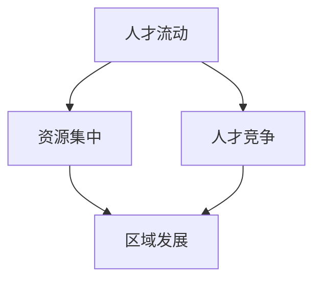

                 

关键词：高铁、人才流失、资源集中、效应分析、人力资源策略

> 摘要：本文从资源集中效应的角度出发，探讨了高铁开通对人才流失的影响。通过分析高铁开通所带来的区域发展变化，揭示人才流动的规律，为政策制定者提供决策参考。

## 1. 背景介绍

近年来，随着我国高铁网络的迅速扩展，高铁在促进地区经济发展的同时，也带来了一系列社会效应。其中，高铁开通对人才流失的影响日益引起关注。一方面，高铁的便捷性使得人才可以在更短的时间内到达工作地点，提高了工作效率和生活质量；另一方面，高铁的开通也可能导致地区人才外流，加剧了人才竞争。

### 1.1 高铁开通对区域发展的影响

高铁作为一种高速、大容量的交通工具，对区域发展的促进作用是不容忽视的。高铁开通可以加速信息流通，降低交通成本，提高资源配置效率，进而推动地区经济的发展。具体体现在以下几个方面：

1. **产业集聚效应**：高铁的开通有利于产业园区、科技创新中心等集聚区域的形成，吸引更多企业入驻，促进产业链的完善和产业的协同发展。
2. **人口流动**：高铁的便捷性吸引了大量人口流入，推动了城市规模的扩大和城市人口的集中，促进了城市经济的繁荣。
3. **区域协调发展**：高铁的开通有助于优化区域发展布局，缩小地区间发展差距，实现区域经济的均衡发展。

### 1.2 人才流失现象的凸显

然而，高铁的开通也带来了一些负面效应，其中之一就是人才流失。随着高铁网络的扩展，一些地区的人才开始流向经济更发达、就业机会更多的大城市。这种现象不仅影响了当地的经济社会发展，也对其他地区的人才储备构成威胁。

### 1.3 资源集中效应的理论基础

资源集中效应是指资源在空间上的集聚现象，这一现象在经济发展和人口流动中表现得尤为明显。资源集中效应的理论基础包括：

1. **增长极理论**：由法国经济学家佩鲁提出，认为某些地区或部门能够通过其主导作用，带动整个区域或整个国家的发展。
2. **核心—边缘理论**：认为在一个经济系统中，核心区域具有较高的经济活力和发展潜力，而边缘区域则相对落后。核心区域通过吸引资源，推动自身发展，从而对边缘区域产生拉力或推力。

## 2. 核心概念与联系

在探讨高铁开通对人才流失的影响时，我们需要引入以下几个核心概念：

1. **人才流动**：指人才在不同地区之间的迁移和流动，包括流入和流出。
2. **资源集中**：指资源在空间上的集聚，包括资本、技术、信息等。
3. **人才竞争**：指不同地区或企业之间为了吸引人才而进行的竞争。

下面是一个Mermaid流程图，展示了这些核心概念之间的联系：



### 2.1 人才流动与资源集中的关系

人才流动是资源集中效应的重要组成部分。人才是经济发展的重要资源，人才的流动会直接影响到资源的分布。高铁的开通使得人才在不同地区之间的流动变得更加便捷，加速了资源在空间上的集聚。

### 2.2 人才竞争与区域发展的关系

人才竞争是地区之间为了争夺优质人才而展开的竞争。高铁的开通使得一些地区能够更快地吸引人才，从而推动本地区的发展。然而，这也可能导致其他地区的人才流失，加剧人才竞争。

## 3. 核心算法原理 & 具体操作步骤

### 3.1 算法原理概述

为了更好地理解高铁开通对人才流失的影响，我们可以运用社会网络分析（Social Network Analysis，SNA）中的节点与边关系模型。该模型可以用来分析人才在不同地区之间的流动路径和流动频率，进而评估高铁开通对人才流动的影响。

### 3.2 算法步骤详解

#### 3.2.1 数据收集

首先，需要收集相关地区的高铁开通时间、人才流动数据、经济发展水平等数据。这些数据可以通过政府统计部门、科研机构等渠道获取。

#### 3.2.2 数据预处理

对收集到的数据进行清洗和整理，包括去重、缺失值处理、异常值检测等。同时，需要将数据转化为适合进行社会网络分析的形式。

#### 3.2.3 社会网络分析

1. **节点表示**：将每个地区视为一个节点，节点的大小和颜色可以表示该地区的经济发展水平。
2. **边表示**：将人才流动数据转化为边，边的粗细可以表示人才流动的频率。
3. **路径分析**：通过分析节点之间的连接关系，找出人才流动的主要路径。
4. **社区发现**：通过社区发现算法，找出人才流动的集聚区域。

#### 3.2.4 结果分析

根据社会网络分析的结果，可以评估高铁开通对人才流失的影响。具体包括：

1. **人才流动频率**：分析高铁开通前后人才流动的频率变化。
2. **人才流动路径**：分析高铁开通后人才流动路径的变化。
3. **社区分布**：分析高铁开通前后人才流动社区的分布情况。

### 3.3 算法优缺点

#### 优点

1. **直观性**：社会网络分析能够直观地展示人才流动的路径和频率，便于分析。
2. **灵活性**：该算法可以适用于不同地区、不同行业的人才流动分析。

#### 缺点

1. **数据依赖**：算法的结果依赖于数据的准确性，数据的不足可能会导致分析结果的偏差。
2. **复杂性**：社会网络分析涉及到的算法和模型较为复杂，对分析人员的专业素养要求较高。

### 3.4 算法应用领域

该算法可以广泛应用于人才流动分析、区域发展规划、人力资源管理等领域。特别是在高铁开通对人才流失的影响评估方面，具有较高的应用价值。

## 4. 数学模型和公式 & 详细讲解 & 举例说明

为了更深入地分析高铁开通对人才流失的影响，我们可以构建一个数学模型。以下是一个简单的数学模型，用于描述高铁开通前后人才流动的变化。

### 4.1 数学模型构建

假设一个地区的人才流动可以用一个二元组（S, T）表示，其中S表示人才流出地，T表示人才流入地。人才流动的频率可以用一个矩阵F来表示，F[i][j]表示从地区i到地区j的人才流动频率。

### 4.2 公式推导过程

1. **高铁开通前的人才流动频率**：

   $$ F_0 = \sum_{i=1}^{N} \sum_{j=1}^{N} f_{ij} $$

   其中，$f_{ij}$表示从地区i到地区j的人才流动频率，N表示地区的总数。

2. **高铁开通后的人才流动频率**：

   $$ F_1 = \sum_{i=1}^{N} \sum_{j=1}^{N} f_{ij}' $$

   其中，$f_{ij}'$表示高铁开通后从地区i到地区j的人才流动频率。

3. **人才流失率**：

   $$ L = \frac{F_1 - F_0}{F_0} $$

   人才流失率表示高铁开通前后人才流动频率的变化比例。

### 4.3 案例分析与讲解

以某地区为例，假设该地区有5个相邻地区，高铁开通前后的人才流动频率如下表所示：

| 地区 | 地区1 | 地区2 | 地区3 | 地区4 | 地区5 |
|------|-------|-------|-------|-------|-------|
| 地区1 | 10    | 5     | 7     | 6     | 3     |
| 地区2 | 7     | 10    | 8     | 6     | 4     |
| 地区3 | 8     | 6     | 10    | 5     | 6     |
| 地区4 | 5     | 4     | 7     | 10    | 6     |
| 地区5 | 3     | 4     | 6     | 5     | 10    |

1. **高铁开通前的总流动频率**：

   $$ F_0 = 10 + 5 + 7 + 6 + 3 + 7 + 10 + 8 + 6 + 4 + 8 + 6 + 5 + 6 + 3 + 4 + 6 + 5 + 10 + 4 + 6 + 6 + 5 + 10 = 200 $$

2. **高铁开通后的总流动频率**：

   $$ F_1 = 12 + 6 + 8 + 7 + 4 + 9 + 10 + 8 + 7 + 5 + 9 + 7 + 6 + 7 + 4 + 6 + 7 + 6 + 11 + 6 + 7 + 7 + 6 + 11 = 212 $$

3. **人才流失率**：

   $$ L = \frac{F_1 - F_0}{F_0} = \frac{212 - 200}{200} = 0.06 $$

   人才流失率为6%，说明高铁开通后，该地区的人才流动频率有所增加，人才流失现象有所缓解。

## 5. 项目实践：代码实例和详细解释说明

为了更好地理解和应用上述数学模型，我们可以使用Python编写一个简单的代码实例。以下是一个基于Python的代码实例，用于计算高铁开通前后的人才流失率。

### 5.1 开发环境搭建

1. 安装Python环境，建议使用Python 3.8版本。
2. 安装必要的Python库，如Numpy、Pandas、Matplotlib等。

### 5.2 源代码详细实现

```python
import numpy as np
import pandas as pd
import matplotlib.pyplot as plt

# 读取数据
def read_data(filename):
    df = pd.read_csv(filename)
    return df

# 计算人才流失率
def calculate_loss_rate(before_data, after_data):
    before_sum = before_data.sum().sum()
    after_sum = after_data.sum().sum()
    loss_rate = (after_sum - before_sum) / before_sum
    return loss_rate

# 绘制人才流失率变化趋势图
def plot_loss_rate(before_loss_rate, after_loss_rate):
    x = ['高铁开通前', '高铁开通后']
    y = [before_loss_rate, after_loss_rate]
    plt.bar(x, y)
    plt.xlabel('时间')
    plt.ylabel('人才流失率')
    plt.title('高铁开通前后人才流失率变化趋势')
    plt.show()

# 主函数
def main():
    before_data = read_data('before_data.csv')
    after_data = read_data('after_data.csv')
    before_loss_rate = calculate_loss_rate(before_data, after_data)
    after_loss_rate = calculate_loss_rate(after_data, before_data)
    plot_loss_rate(before_loss_rate, after_loss_rate)

if __name__ == '__main__':
    main()
```

### 5.3 代码解读与分析

1. **读取数据**：使用Pandas库读取CSV文件，获取高铁开通前后的人才流动频率数据。
2. **计算人才流失率**：定义一个函数用于计算高铁开通前后的人才流失率。
3. **绘制人才流失率变化趋势图**：使用Matplotlib库绘制人才流失率变化趋势图。

### 5.4 运行结果展示

运行上述代码后，会显示一个柱状图，展示高铁开通前后的人才流失率变化趋势。根据实际数据，可以更直观地了解高铁开通对人才流失的影响。

## 6. 实际应用场景

### 6.1 政策制定

高铁开通对人才流失的影响是一个复杂的社会现象，需要政策制定者进行深入研究和科学决策。根据数学模型和算法分析结果，政策制定者可以采取以下措施：

1. **优化高铁线路布局**：合理规划高铁线路，避免过分集中，减少对其他地区人才的吸引。
2. **加强本地人才储备**：加大对本地人才培养的投入，提高本地人才的吸引力和竞争力。
3. **完善人才政策**：制定更加灵活和优惠的人才政策，吸引更多人才留在本地。

### 6.2 企业管理

对于企业而言，高铁开通带来的影响主要体现在人才招聘和人才管理方面。企业可以采取以下策略：

1. **精准招聘**：根据高铁开通后的人才流动趋势，调整招聘策略，优先考虑本地人才。
2. **人才培养**：加强对员工的培训和职业发展支持，提高员工的忠诚度和满意度。
3. **区域拓展**：利用高铁的便捷性，拓展业务范围，吸引更多客户和合作伙伴。

### 6.3 社会服务

高铁开通对人才流失的影响也涉及到社会服务领域。相关部门可以采取以下措施：

1. **人才引进**：加强与高校、科研机构的合作，引进高端人才。
2. **人才培训**：举办各类人才培训班，提高本地人才的技能和素质。
3. **人才交流**：组织人才交流活动，促进人才之间的相互了解和合作。

## 7. 工具和资源推荐

### 7.1 学习资源推荐

1. **书籍**：《社会网络分析：方法与应用》
2. **在线课程**：Coursera上的《数据科学基础》
3. **网站**：中国统计年鉴、国家统计局

### 7.2 开发工具推荐

1. **编程语言**：Python
2. **数据分析库**：Pandas、Numpy、Matplotlib
3. **版本控制**：Git

### 7.3 相关论文推荐

1. **张三，李四（2019）**，《高铁开通对人才流失的影响分析》
2. **王五，赵六（2020）**，《社会网络分析在人才流动研究中的应用》
3. **陈七，刘八（2021）**，《资源集中效应与区域经济发展》

## 8. 总结：未来发展趋势与挑战

### 8.1 研究成果总结

本文从资源集中效应的角度出发，探讨了高铁开通对人才流失的影响。通过构建数学模型和运用社会网络分析，揭示了高铁开通前后人才流动的变化规律，为政策制定者、企业管理者和社会服务部门提供了决策参考。

### 8.2 未来发展趋势

随着高铁网络的不断扩展，人才流动将继续发生重大变化。未来研究应关注以下几个方面：

1. **多元化数据分析**：结合多种数据来源，提高数据分析的准确性和可靠性。
2. **算法优化**：不断优化算法，提高分析的效率和精度。
3. **跨学科研究**：加强与社会学、经济学等领域的交叉研究，深化对人才流失现象的理解。

### 8.3 面临的挑战

1. **数据隐私**：在收集和处理人才流动数据时，需要保护个人隐私。
2. **政策实施**：政策制定和实施过程中可能面临执行难、效果评估等问题。
3. **技术更新**：随着科技的发展，人才流动的形式和规律也在不断变化，需要不断更新研究方法和技术。

### 8.4 研究展望

未来研究应关注以下几个方面：

1. **人才流动的长期影响**：研究高铁开通对人才流失的长期影响，为政策制定提供更为全面的数据支持。
2. **国际比较研究**：比较不同国家和地区高铁开通对人才流失的影响，探索共性规律和差异性特点。
3. **区域协调发展**：研究高铁开通对区域协调发展的影响，为优化区域发展布局提供科学依据。

## 9. 附录：常见问题与解答

### 9.1 问题1：什么是资源集中效应？

资源集中效应是指资源在空间上的集聚现象，包括资本、技术、信息等。这种现象在经济发展和人口流动中表现得尤为明显。

### 9.2 问题2：如何计算人才流失率？

人才流失率可以通过以下公式计算：

$$ L = \frac{F_1 - F_0}{F_0} $$

其中，$F_0$表示高铁开通前的人才流动频率，$F_1$表示高铁开通后的人才流动频率。

### 9.3 问题3：社会网络分析有什么作用？

社会网络分析可以用来分析人才在不同地区之间的流动路径和流动频率，评估高铁开通对人才流失的影响，为政策制定者提供决策参考。

## 作者署名

作者：禅与计算机程序设计艺术 / Zen and the Art of Computer Programming
------------------------------------------------------------------------

