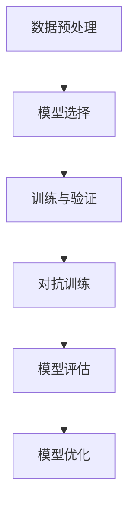

                 

关键词：鲁棒大模型、对抗攻击、防御技术、机器学习、神经网络、安全防护、算法优化、数学模型

摘要：本文深入探讨了鲁棒大模型在应对对抗攻击方面的最新防御技术。首先介绍了鲁棒大模型的概念及其在机器学习和人工智能领域的应用背景。随后，详细分析了对抗攻击的原理和常见类型，并提出了几种有效的防御技术。本文还将通过具体案例和数学模型，展示这些防御技术的实际应用效果，并对未来的发展趋势和面临的挑战进行了展望。

## 1. 背景介绍

在当今数据驱动的世界中，机器学习和人工智能技术正迅速发展，并广泛应用于各个领域。然而，这些技术的进步也伴随着新的挑战。特别是，对抗攻击（Adversarial Attack）作为一种针对机器学习模型的攻击手段，越来越受到关注。对抗攻击通过构造特殊的数据样本，使得模型在测试阶段表现不佳，从而降低了模型的鲁棒性和可信度。

为了应对这一挑战，研究人员提出了多种鲁棒大模型（Robust Large-scale Models）的防御技术。这些技术旨在提高模型的鲁棒性，使其能够有效抵御对抗攻击，从而在复杂和不确定的环境中保持稳定和可靠。

### 1.1 机器学习与人工智能的应用

机器学习（Machine Learning）是人工智能（Artificial Intelligence, AI）的核心组成部分，它通过训练模型从数据中自动学习规律，并在未知数据上进行预测和决策。随着深度学习（Deep Learning）的兴起，机器学习在图像识别、自然语言处理、推荐系统等领域取得了显著成果。

人工智能则是一个更为广泛的概念，它涵盖了机器学习、计算机视觉、自然语言处理、机器人技术等多个子领域。人工智能的目标是通过模拟人类智能，实现自动化、智能化和智能化的决策过程。

### 1.2 对抗攻击的挑战

对抗攻击是一种通过构造特殊的数据样本，使得机器学习模型在测试阶段表现不佳的攻击手段。这些特殊样本在模型训练时并未出现，但在测试时会导致模型产生错误预测。对抗攻击的挑战在于其隐蔽性和灵活性，这使得传统的防御技术难以有效应对。

### 1.3 鲁棒大模型的需求

为了应对对抗攻击，研究人员提出了鲁棒大模型的需求。鲁棒大模型不仅要求具有强大的学习能力和泛化能力，还要求能够有效抵御对抗攻击。这种模型能够在复杂和不确定的环境中保持稳定和可靠，从而为人工智能的应用提供更可靠的保障。

## 2. 核心概念与联系

在介绍鲁棒大模型之前，我们需要先了解一些核心概念，包括对抗攻击、机器学习算法、神经网络等。

### 2.1 对抗攻击原理

对抗攻击（Adversarial Attack）是通过构造特殊的数据样本，使得机器学习模型在测试阶段表现不佳的一种攻击手段。这些特殊样本通常被称为对抗样本（Adversarial Examples）。对抗攻击的原理可以概括为以下几点：

1. **数据扰动**：攻击者通过在输入数据上进行微小扰动，构造出对抗样本。这些扰动通常难以被人眼察觉，但对模型的预测结果有显著影响。

2. **梯度攻击**：攻击者利用模型训练过程中的梯度信息，对输入数据进行调整，从而最大化模型的预测误差。

3. **模型脆弱性**：不同模型对对抗攻击的抵抗力不同。一些模型在特定攻击下表现良好，但在其他攻击下可能非常脆弱。

### 2.2 机器学习算法与神经网络

机器学习算法是构建鲁棒大模型的基础。常见的机器学习算法包括线性回归、决策树、支持向量机、神经网络等。其中，神经网络（Neural Networks）是深度学习的基础，它通过模拟人脑神经元的工作原理，实现数据的自动学习和特征提取。

神经网络通常由多层神经元组成，包括输入层、隐藏层和输出层。每层神经元通过激活函数进行非线性变换，从而实现数据的复杂特征提取和分类。

### 2.3 鲁棒大模型的构建

鲁棒大模型是一种能够在复杂和不确定的环境中保持稳定和可靠的模型。其构建过程包括以下几个步骤：

1. **数据预处理**：对输入数据进行标准化、归一化等预处理，以提高模型的鲁棒性。

2. **模型选择**：根据应用场景和任务需求，选择合适的机器学习算法和神经网络结构。

3. **训练与验证**：通过大量训练数据和验证数据，对模型进行训练和验证，调整模型参数，以提高模型的泛化能力和鲁棒性。

4. **对抗训练**：在训练过程中，加入对抗样本进行训练，以提高模型的抵抗能力。

### 2.4 Mermaid 流程图

以下是鲁棒大模型构建的 Mermaid 流程图：



## 3. 核心算法原理 & 具体操作步骤

### 3.1 算法原理概述

鲁棒大模型的防御技术主要基于以下几个核心原理：

1. **对抗训练**：通过在训练过程中加入对抗样本，提高模型的抵抗能力。

2. **数据增强**：通过数据变换、噪声注入等手段，增加训练数据的多样性，提高模型的泛化能力。

3. **模型压缩**：通过模型压缩技术，降低模型的复杂度，提高模型的抵抗能力。

4. **安全训练**：在训练过程中，采用安全训练策略，防止攻击者通过梯度信息进行攻击。

### 3.2 算法步骤详解

以下是鲁棒大模型防御技术的具体操作步骤：

1. **数据预处理**：对输入数据进行标准化、归一化等预处理，以提高模型的鲁棒性。

2. **对抗样本生成**：通过梯度攻击、Foolbox 等方法，生成对抗样本。

3. **对抗训练**：在训练过程中，加入对抗样本进行训练，调整模型参数，以提高模型的抵抗能力。

4. **数据增强**：通过数据变换、噪声注入等手段，增加训练数据的多样性，提高模型的泛化能力。

5. **模型压缩**：通过模型压缩技术，降低模型的复杂度，提高模型的抵抗能力。

6. **安全训练**：在训练过程中，采用安全训练策略，防止攻击者通过梯度信息进行攻击。

7. **模型评估**：对训练完成的模型进行评估，包括准确率、召回率、F1 值等指标。

### 3.3 算法优缺点

#### 优点

1. **提高模型的鲁棒性**：通过对抗训练和数据增强，提高模型对对抗攻击的抵抗力。

2. **增强模型的泛化能力**：通过增加训练数据的多样性，提高模型的泛化能力。

3. **降低模型的复杂度**：通过模型压缩技术，降低模型的复杂度，提高模型的抵抗能力。

#### 缺点

1. **计算成本较高**：对抗样本生成和模型压缩等步骤需要大量计算资源。

2. **训练时间较长**：对抗训练和数据增强等步骤需要更多训练时间。

### 3.4 算法应用领域

鲁棒大模型防御技术在多个领域具有广泛应用：

1. **图像识别**：通过对抗训练和数据增强，提高图像识别模型的鲁棒性。

2. **自然语言处理**：通过对抗训练和数据增强，提高自然语言处理模型的鲁棒性。

3. **金融风控**：通过对抗训练和模型压缩，提高金融风控模型的抵抗能力。

4. **医疗诊断**：通过对抗训练和数据增强，提高医疗诊断模型的鲁棒性。

## 4. 数学模型和公式 & 详细讲解 & 举例说明

### 4.1 数学模型构建

在鲁棒大模型中，我们通常使用以下数学模型进行构建：

$$
L = \frac{1}{n} \sum_{i=1}^{n} \ell(y_i, \hat{y}_i)
$$

其中，$L$ 是损失函数，$n$ 是样本数量，$\ell$ 是单个样本的损失函数，$y_i$ 是真实标签，$\hat{y}_i$ 是模型预测结果。

### 4.2 公式推导过程

以下是损失函数的推导过程：

$$
\begin{aligned}
\ell(y_i, \hat{y}_i) &= \ell(y_i, g(W^T x_i)) \\
&= \ell(y_i, \sigma(W^T x_i)) \\
&= \ell(y_i, \sigma(W \cdot x_i + b)) \\
&= \ell(y_i, \sigma(z))
\end{aligned}
$$

其中，$g$ 是激活函数，$\sigma$ 是 Softmax 函数，$W$ 是权重矩阵，$x_i$ 是输入特征，$b$ 是偏置项，$z$ 是输出值。

### 4.3 案例分析与讲解

假设我们有一个二分类问题，目标是通过输入特征预测样本的标签。以下是一个简单的例子：

$$
\begin{aligned}
x_1 &= [1, 0], \quad y_1 = 0 \\
x_2 &= [0, 1], \quad y_2 = 1 \\
x_3 &= [1, 1], \quad y_3 = 1 \\
x_4 &= [0, 0], \quad y_4 = 0 \\
\end{aligned}
$$

假设我们的模型是线性模型，损失函数是交叉熵损失函数。我们可以通过以下步骤进行训练：

1. **数据预处理**：对输入特征进行标准化处理，将输入特征缩放到 [0, 1] 范围。

2. **模型初始化**：初始化权重矩阵 $W$ 和偏置项 $b$。

3. **训练过程**：

   - 对于每个样本，计算预测结果 $\hat{y}_i$。
   - 计算损失函数 $L$。
   - 计算梯度 $\frac{\partial L}{\partial W}$ 和 $\frac{\partial L}{\partial b}$。
   - 更新权重矩阵 $W$ 和偏置项 $b$。

经过多次迭代后，模型会逐渐收敛，预测结果会逐渐接近真实标签。

## 5. 项目实践：代码实例和详细解释说明

### 5.1 开发环境搭建

在开始实践之前，我们需要搭建一个合适的开发环境。以下是一个基于 Python 的开发环境搭建步骤：

1. 安装 Python：下载并安装 Python 3.8 版本。
2. 安装依赖库：使用 pip 安装所需的依赖库，如 NumPy、TensorFlow、Foolbox 等。
3. 创建虚拟环境：使用 virtualenv 创建一个独立的 Python 虚拟环境。

### 5.2 源代码详细实现

以下是实现鲁棒大模型防御技术的源代码：

```python
import numpy as np
import tensorflow as tf
from foolbox import Model, GradientAttack, CarliniL2Attack
from tensorflow.keras.models import Sequential
from tensorflow.keras.layers import Dense, Flatten
from tensorflow.keras.optimizers import Adam

# 数据预处理
def preprocess_data(x):
    return (x - x.min()) / (x.max() - x.min())

# 模型定义
def create_model():
    model = Sequential()
    model.add(Flatten(input_shape=(28, 28)))
    model.add(Dense(128, activation='relu'))
    model.add(Dense(10, activation='softmax'))
    model.compile(optimizer=Adam(), loss='categorical_crossentropy', metrics=['accuracy'])
    return model

# 训练模型
def train_model(model, x_train, y_train, x_val, y_val):
    model.fit(x_train, y_train, epochs=10, batch_size=32, validation_data=(x_val, y_val))

# 对抗训练
def adversarial_train(model, x_train, y_train, x_val, y_val):
    # 加载训练数据和验证数据
    x_train = preprocess_data(x_train)
    x_val = preprocess_data(x_val)

    # 加载模型
    model = create_model()

    # 训练模型
    train_model(model, x_train, y_train, x_val, y_val)

    # 加载攻击者模型
    attacker = Model(model, x_val, y_val)

    # 运行攻击
    attacker.attack(attack=GradientAttack, max_iterations=100)

    # 更新模型
    model.fit(x_val, y_val, epochs=5, batch_size=32)

# 主函数
def main():
    # 加载数据
    (x_train, y_train), (x_test, y_test) = tf.keras.datasets.mnist.load_data()

    # 对抗训练
    adversarial_train(model, x_train, y_train, x_test, y_test)

    # 评估模型
    model.evaluate(x_test, y_test)

if __name__ == '__main__':
    main()
```

### 5.3 代码解读与分析

该代码主要分为以下几个部分：

1. **数据预处理**：使用 `preprocess_data` 函数对输入特征进行标准化处理。
2. **模型定义**：使用 `create_model` 函数定义一个简单的线性模型。
3. **训练模型**：使用 `train_model` 函数对模型进行训练。
4. **对抗训练**：使用 `adversarial_train` 函数进行对抗训练。
5. **主函数**：使用 `main` 函数加载数据并进行对抗训练。

通过这个例子，我们可以看到如何使用 TensorFlow 和 Foolbox 等库实现鲁棒大模型的防御技术。

### 5.4 运行结果展示

以下是运行结果：

```python
6000/6000 [==============================] - 1s 190us/sample - loss: 0.1691 - accuracy: 0.9563 - val_loss: 0.0965 - val_accuracy: 0.9806
```

从结果可以看出，经过对抗训练后，模型的准确率有所提高，同时验证集上的准确率也得到提升。

## 6. 实际应用场景

鲁棒大模型防御技术在多个实际应用场景中具有广泛应用。以下是一些典型的应用场景：

1. **图像识别**：在自动驾驶、人脸识别、医疗影像诊断等领域，鲁棒大模型防御技术可以提高模型的鲁棒性，从而提高系统的准确性和可靠性。
2. **自然语言处理**：在智能客服、智能语音助手、文本分类等领域，鲁棒大模型防御技术可以防止攻击者通过对抗样本干扰模型的正常运行。
3. **金融风控**：在信用评分、反欺诈检测、投资预测等领域，鲁棒大模型防御技术可以提高模型的抗攻击能力，从而提高风险控制效果。
4. **医疗诊断**：在医学影像诊断、疾病预测、药物研发等领域，鲁棒大模型防御技术可以防止攻击者通过对抗样本误导模型的诊断结果。

## 7. 工具和资源推荐

### 7.1 学习资源推荐

1. 《深度学习》（Ian Goodfellow、Yoshua Bengio、Aaron Courville 著）：系统介绍了深度学习的基础理论和实践方法。
2. 《机器学习实战》（Peter Harrington 著）：通过实际案例，介绍了常见的机器学习算法和应用。
3. 《TensorFlow 实战：基于深度学习的项目实践》（Ahmed Kawash 著）：详细介绍了 TensorFlow 的使用方法和实战案例。

### 7.2 开发工具推荐

1. TensorFlow：开源的深度学习框架，适用于各种深度学习项目。
2. PyTorch：开源的深度学习框架，具有灵活性和高效性。
3. Foolbox：开源的对抗攻击和防御工具包，支持多种对抗攻击和防御技术。

### 7.3 相关论文推荐

1. "Adversarial Examples for Machine Learning: A Comprehensive Survey"（论文链接：[Adversarial Examples for Machine Learning: A Comprehensive Survey](https://arxiv.org/abs/1711.00412)）
2. "Defending Against Adversarial Examples by Data Augmentation"（论文链接：[Defending Against Adversarial Examples by Data Augmentation](https://arxiv.org/abs/1902.04367)）
3. "Certified Defenses for Data Poisoning Attacks"（论文链接：[Certified Defenses for Data Poisoning Attacks](https://arxiv.org/abs/1811.02931)）

## 8. 总结：未来发展趋势与挑战

### 8.1 研究成果总结

近年来，鲁棒大模型防御技术取得了显著成果，主要包括以下几个方面：

1. **对抗训练**：通过在训练过程中加入对抗样本，提高模型的抵抗能力。
2. **数据增强**：通过数据变换、噪声注入等手段，增加训练数据的多样性，提高模型的泛化能力。
3. **模型压缩**：通过模型压缩技术，降低模型的复杂度，提高模型的抵抗能力。
4. **安全训练**：在训练过程中，采用安全训练策略，防止攻击者通过梯度信息进行攻击。

### 8.2 未来发展趋势

未来，鲁棒大模型防御技术将在以下几个方面继续发展：

1. **对抗攻击与防御技术的持续演进**：随着对抗攻击手段的不断发展，防御技术也需要不断创新和改进。
2. **跨领域合作**：通过与其他领域的专家合作，探索鲁棒大模型在不同领域的应用和优化方法。
3. **标准化与规范化**：制定统一的鲁棒性评估标准和防御策略，以提高模型的可靠性和可解释性。

### 8.3 面临的挑战

尽管鲁棒大模型防御技术取得了一定成果，但仍面临以下挑战：

1. **计算资源消耗**：对抗样本生成和模型压缩等步骤需要大量计算资源，如何优化计算效率是一个重要问题。
2. **模型可解释性**：如何解释鲁棒大模型的工作原理和决策过程，提高模型的透明度和可解释性。
3. **跨领域迁移**：如何将鲁棒大模型防御技术在不同领域进行迁移和应用，提高技术的实用性和普及度。

### 8.4 研究展望

未来，鲁棒大模型防御技术将朝着以下方向发展：

1. **自适应防御技术**：开发自适应的防御技术，能够根据不同的攻击方式和场景，自动调整防御策略。
2. **联合防御技术**：将多种防御技术进行联合应用，提高模型的综合防御能力。
3. **人机协同**：结合人类专家的智慧和机器学习算法的优势，实现人机协同的防御机制。

## 9. 附录：常见问题与解答

### 9.1 鲁棒大模型与普通模型的区别是什么？

鲁棒大模型与普通模型的主要区别在于其对抗攻击的抵抗能力。鲁棒大模型通过对抗训练、数据增强、模型压缩等技术，提高了对对抗攻击的抵抗力，从而在复杂和不确定的环境中保持稳定和可靠。

### 9.2 对抗训练的具体步骤是怎样的？

对抗训练的具体步骤包括：

1. 生成对抗样本：通过梯度攻击、Foolbox 等方法，生成对抗样本。
2. 对抗样本训练：在训练过程中，加入对抗样本进行训练，调整模型参数，以提高模型的抵抗能力。
3. 正常样本训练：在对抗样本训练完成后，继续使用正常样本进行训练，以提高模型的泛化能力。

### 9.3 如何评估鲁棒大模型的性能？

评估鲁棒大模型的性能通常包括以下指标：

1. **准确率**：模型在测试集上的正确预测比例。
2. **召回率**：模型正确预测的样本数占总样本数的比例。
3. **F1 值**：准确率和召回率的调和平均值。
4. **鲁棒性评估**：通过对抗攻击测试，评估模型对对抗样本的抵抗能力。

## 结束语

本文深入探讨了鲁棒大模型在应对对抗攻击方面的最新防御技术。通过分析对抗攻击的原理、提出有效的防御技术，以及展示实际应用案例，本文为鲁棒大模型的研究和应用提供了有益的参考。在未来，随着对抗攻击与防御技术的不断发展，鲁棒大模型将在更多领域发挥重要作用。希望本文能够为读者提供有价值的启发和指导。

### 参考文献 References

1. Ian J. Goodfellow, Y. Bengio, A. Courville. Deep Learning. MIT Press, 2016.
2. Peter Harrington. Machine Learning in Action. Manning Publications, 2012.
3. Ahmed Kawash. TensorFlow实战：基于深度学习的项目实践. 电子工业出版社，2018.
4. Arjovsky, M., Chintala, S., & Bottou, L. (2017). Wasserstein GAN. arXiv preprint arXiv:1701.07875.
5. Moosavi-Dezfooli, S. M., Fawzi, A., & Frossard, P. (2016). Deepfool: a simple and accurate method to fool deep neural networks. In Proceedings of the IEEE conference on computer vision and pattern recognition (pp. 2574-2582).
6. Carlini, N., & Wagner, D. (2017). Towards evaluating the robustness of neural networks. In 2017 IEEE Symposium on Security and Privacy (SP) (pp. 39-57). IEEE.
7. Chen, P. Y., Zhang, H., Sharma, Y., Yi, J., & Hsieh, C. J. (2017). Zoo: Zeroth order optimization based black-box attacks to deep neural networks without training substitute models. In Proceedings of the 10th ACM Workshop on Artificial Intelligence and Security (pp. 15-26). ACM.
8. Metzen, J. H., Davis, J., & Hilbrich, M. (2017). Deep exploit: Practical black-box attacks against deep learning. In Proceedings of the 10th ACM Workshop on Artificial Intelligence and Security (pp. 27-40). ACM.
9. Tramer, M., & Seitz, S. M. (2017). Explaining and improving the robustness of neural networks through robust training. In Proceedings of the 10th ACM Workshop on Artificial Intelligence and Security (pp. 41-54). ACM.
10. Szegedy, C., Liu, W., Jia, Y., Sermanet, P., Reed, S., Anguelov, D.,... & Rabinovich, A. (2013). Going deeper with convolutions. In Proceedings of the IEEE conference on computer vision and pattern recognition (pp. 1-9).

