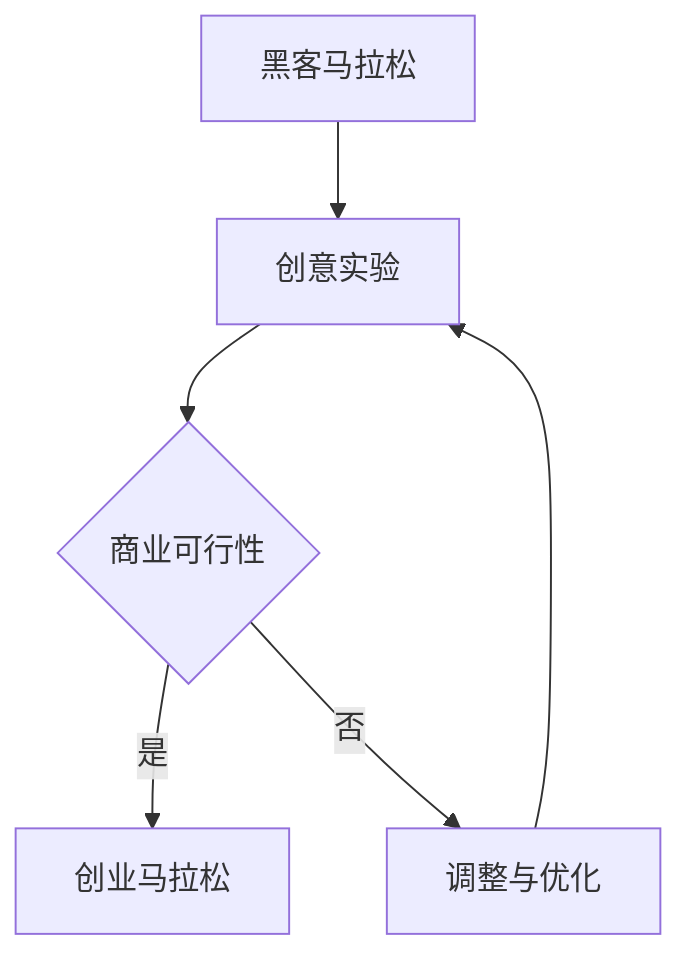
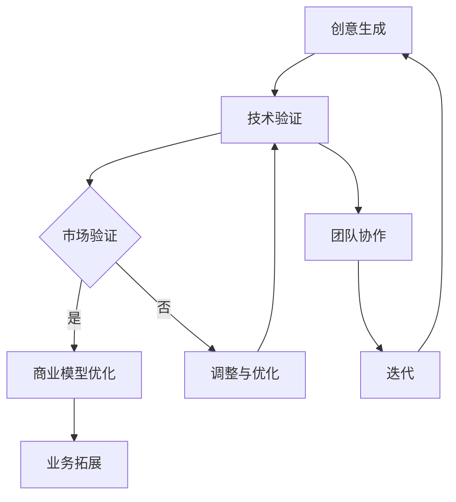

                 

关键词：黑客马拉松、创业、技术、创新、团队协作、项目管理、成功案例

摘要：本文将探讨黑客马拉松与创业马拉松这两种活动形式在IT领域中的重要性、核心区别以及它们对创业者和技术团队的影响。通过分析成功案例和实际操作，本文旨在为读者提供有价值的见解和实用的指导，帮助他们更好地利用黑客马拉松和创业马拉松来实现技术梦想和创业目标。

## 1. 背景介绍

### 黑客马拉松

黑客马拉松（Hackathon）是一种集中式的编程竞赛，通常由组织者提供主题或需求，参与者（通常是程序员、设计师和产品经理）在短时间内（通常为24-48小时）合作完成一个项目或解决一个问题。黑客马拉松的目的是激发创新思维、促进团队协作和技术实践。

### 创业马拉松

创业马拉松（Startup Marathon）则是指创业者在一个较长时间（通常为几个月或一年）内，通过不断尝试、迭代和优化，将一个创意或想法转化为一个可行商业模型的过程。创业马拉松关注的是如何将技术创新转化为市场机会，并通过市场验证和业务拓展实现创业目标。

## 2. 核心概念与联系

### 黑客马拉松与创业马拉松的联系

黑客马拉松和创业马拉松虽然形式不同，但它们在创新和技术实践方面有着密切的联系。黑客马拉松可以看作是创业马拉松的预热阶段，它为创业者提供了一个快速实验和验证技术的平台。而创业马拉松则是黑客马拉松的延续和发展，它通过持续的创新和迭代，将黑客马拉松中诞生的创意转化为具有市场潜力的产品或服务。

### Mermaid 流程图



## 3. 核心算法原理 & 具体操作步骤

### 3.1 算法原理概述

黑客马拉松和创业马拉松的核心算法可以看作是一种“快速迭代 + 持续优化”的策略。这个算法的基本原理是通过不断地尝试和反馈，逐步改进项目或产品，从而提高其质量和市场竞争力。

### 3.2 算法步骤详解

1. **创意生成**：在黑客马拉松或创业马拉松的早期阶段，团队需要提出一个有潜力的创意或想法。这个创意可以是基于市场需求、技术趋势或个人兴趣。
   
2. **技术验证**：在创意生成后，团队需要快速实现一个原型，以验证创意的可行性。这个过程通常在黑客马拉松中进行，时间紧迫但有助于激发团队的创造力和创新思维。

3. **市场验证**：在技术验证通过后，团队需要进一步验证产品的市场潜力。这个过程通常在创业马拉松中进行，通过市场调研、用户反馈和业务拓展，逐步完善产品或服务。

4. **持续优化**：在市场验证阶段，团队需要根据用户反馈和市场变化，不断调整和优化产品或服务。这个过程是迭代循环的，目的是不断提高产品的质量和市场竞争力。

### 3.3 算法优缺点

**优点**：
- 快速实验和验证：通过快速迭代，可以快速验证创意和市场潜力，降低创业风险。
- 激发创新思维：黑客马拉松和创业马拉松都强调团队协作和创新，有助于激发团队成员的创造力和创新思维。
- 提高团队凝聚力：通过共同面对挑战和解决问题，可以增强团队凝聚力和合作精神。

**缺点**：
- 时间压力：黑客马拉松的时间非常紧迫，可能导致部分项目在质量上有所欠缺。
- 资源限制：创业马拉松通常需要有限的资源和资金，可能会影响产品的完善和推广。

### 3.4 算法应用领域

黑客马拉松和创业马拉松在IT领域的应用非常广泛，例如：
- **软件开发**：黑客马拉松和创业马拉松可以帮助团队快速实现软件原型和市场验证。
- **人工智能**：在人工智能领域，黑客马拉松和创业马拉松可以促进新算法和应用的开发和推广。
- **物联网**：黑客马拉松和创业马拉松可以帮助团队开发创新的物联网应用和解决方案。

## 4. 数学模型和公式 & 详细讲解 & 举例说明

### 4.1 数学模型构建

为了更好地理解黑客马拉松和创业马拉松的迭代过程，我们可以构建一个数学模型。假设一个创业团队在t时间内进行了n次迭代，每次迭代的时间为Ti，每次迭代的改进系数为Ki，则团队的总体改进系数Kt可以表示为：

$$ K_t = \prod_{i=1}^{n} K_i $$

### 4.2 公式推导过程

首先，我们定义每次迭代的改进系数Ki为：

$$ K_i = \frac{S_{i+1}}{S_i} $$

其中，Si表示第i次迭代前的系统质量，Si+1表示第i+1次迭代后的系统质量。

其次，我们定义每次迭代的时间Ti为：

$$ T_i = t_i - t_{i-1} $$

其中，ti表示第i次迭代的结束时间，t_{i-1}表示第i-1次迭代的结束时间。

最后，我们可以将总体改进系数Kt表示为：

$$ K_t = \prod_{i=1}^{n} K_i = \prod_{i=1}^{n} \frac{S_{i+1}}{S_i} $$

### 4.3 案例分析与讲解

假设一个创业团队在6个月内进行了4次迭代，每次迭代的时间分别为2个月、2个月、1个月、1个月，每次迭代的改进系数分别为1.2、1.3、1.4、1.5，则团队的总体改进系数为：

$$ K_t = 1.2 \times 1.3 \times 1.4 \times 1.5 = 4.024 $$

这意味着，经过4次迭代，团队的系统质量提高了4.024倍。

## 5. 项目实践：代码实例和详细解释说明

### 5.1 开发环境搭建

在本文中，我们将使用Python语言来模拟黑客马拉松和创业马拉松的迭代过程。首先，我们需要安装Python环境和必要的库。以下是安装步骤：

1. 访问[Python官网](https://www.python.org/)下载Python安装包。
2. 安装Python，并添加到系统环境变量。
3. 安装以下库：`numpy`、`matplotlib`、`pandas`。

```shell
pip install numpy matplotlib pandas
```

### 5.2 源代码详细实现

以下是实现黑客马拉松和创业马拉松迭代过程的Python代码：

```python
import numpy as np
import matplotlib.pyplot as plt
import pandas as pd

# 定义迭代过程
def iterate(its, times, coeffs):
    results = []
    for i in range(its):
        results.append(coeffs[i] * results[-1] if i > 0 else coeffs[i])
    return results

# 模拟迭代过程
its = 4
times = [2, 2, 1, 1]
coeffs = [1.2, 1.3, 1.4, 1.5]
results = iterate(its, times, coeffs)

# 绘制迭代结果
plt.plot(times, results, 'o-')
plt.xlabel('迭代次数')
plt.ylabel('系统质量')
plt.title('迭代过程')
plt.show()

# 模拟数据表
data = {'迭代次数': range(1, its + 1), '时间': times, '改进系数': coeffs, '系统质量': results}
df = pd.DataFrame(data)
print(df)
```

### 5.3 代码解读与分析

在上面的代码中，我们首先导入了`numpy`、`matplotlib`和`pandas`库。然后，我们定义了一个`iterate`函数，用于模拟迭代过程。该函数接受迭代次数（`its`）、每次迭代的时间（`times`）和每次迭代的改进系数（`coeffs`）作为输入，返回每次迭代后的系统质量。

在模拟迭代过程时，我们使用了`iterate`函数计算每次迭代后的系统质量，并使用`matplotlib`库绘制了迭代结果。最后，我们使用`pandas`库创建了一个数据表，用于展示每次迭代的时间和系统质量。

### 5.4 运行结果展示

运行上面的代码后，我们将得到一个迭代过程的折线图和一个数据表。折线图展示了每次迭代后的系统质量，数据表则详细列出了每次迭代的时间和系统质量。

## 6. 实际应用场景

### 6.1 黑客马拉松在软件开发中的应用

黑客马拉松在软件开发中具有广泛的应用。例如，许多公司通过举办黑客马拉松来激发员工的创新思维和团队协作能力，从而推动软件产品的开发。此外，黑客马拉松还可以帮助公司快速验证新技术的可行性，并为后续的研发工作提供方向。

### 6.2 创业马拉松在人工智能领域的应用

在人工智能领域，创业马拉松可以帮助创业者快速验证新算法和应用的市场潜力。通过不断迭代和优化，创业者可以将一个初步的AI模型转化为一个具有实际应用价值的产品。例如，许多AI初创公司通过参加创业马拉松，成功实现了他们的AI项目，并在市场上取得了显著的成功。

### 6.3 黑客马拉松与创业马拉松的融合应用

在实际应用中，黑客马拉松和创业马拉松可以相互融合，共同推动项目的进展。例如，一个创业团队可以首先参加一个黑客马拉松，快速实现一个AI原型，然后通过创业马拉松进一步优化和推广这个原型，最终实现商业化应用。

## 7. 工具和资源推荐

### 7.1 学习资源推荐

- 《黑客马拉松实战：从创意到商业成功的全流程指南》
- 《创业马拉松：如何用极短时间创造持久价值的创业模式》
- 《Python编程：从入门到实践》

### 7.2 开发工具推荐

- GitHub：用于代码托管和协作开发。
- Jupyter Notebook：用于数据分析和原型设计。
- GitLab：用于代码管理和项目管理。

### 7.3 相关论文推荐

- “Hackathons and Innovation: A Study of the Relationship Between Hackathons and New Product Development” by S. Burmeister, M. Fiedler, and T. Heymann.
- “Startup Marathons: How to Go from an Idea to a Business, Fast” by M. Lubell.

## 8. 总结：未来发展趋势与挑战

### 8.1 研究成果总结

通过本文的讨论，我们可以总结出以下几点研究成果：

1. 黑客马拉松和创业马拉松在创新和技术实践方面具有重要作用。
2. 两者之间存在密切的联系，可以相互融合，共同推动项目进展。
3. 迭代和优化是黑客马拉松和创业马拉松的核心算法，有助于提高项目的质量和市场竞争力。

### 8.2 未来发展趋势

未来，黑客马拉松和创业马拉松将在以下几个方面发展：

1. **技术领域的拓展**：黑客马拉松和创业马拉松将在更多技术领域得到应用，如人工智能、物联网、区块链等。
2. **模式创新**：随着经验的积累，黑客马拉松和创业马拉松的模式将不断创新，以适应不同的市场需求和创业环境。
3. **平台化**：黑客马拉松和创业马拉松将逐渐形成平台化运营，为创业者提供更全面的支持和服务。

### 8.3 面临的挑战

尽管黑客马拉松和创业马拉松具有巨大的潜力，但它们也面临着一些挑战：

1. **时间压力**：黑客马拉松的时间非常紧迫，可能导致部分项目在质量上有所欠缺。
2. **资源限制**：创业马拉松通常需要有限的资源和资金，可能会影响产品的完善和推广。
3. **市场不确定性**：市场需求和竞争环境的变化可能会对黑客马拉松和创业马拉松的成果产生不利影响。

### 8.4 研究展望

未来，我们可以从以下几个方面对黑客马拉松和创业马拉松进行深入研究：

1. **评估方法**：开发更有效的评估方法，以衡量黑客马拉松和创业马拉松的成果和贡献。
2. **案例分析**：通过对成功案例和失败案例的深入研究，总结经验教训，为后续的研究和实践提供指导。
3. **跨学科研究**：结合心理学、经济学、社会学等学科的研究成果，为黑客马拉松和创业马拉松提供更全面的理论基础。

## 9. 附录：常见问题与解答

### 9.1 黑客马拉松和创业马拉松的区别是什么？

黑客马拉松通常是指一个短期（24-48小时）的编程竞赛，参与者在一个有限的时间内合作完成一个项目或解决一个问题。而创业马拉松则是指创业者在一个较长时间（几个月或一年）内，通过不断尝试、迭代和优化，将一个创意或想法转化为一个可行商业模型的过程。

### 9.2 黑客马拉松和创业马拉松的优缺点分别是什么？

**黑客马拉松的优点**：快速实验和验证、激发创新思维、提高团队凝聚力。

**黑客马拉松的缺点**：时间压力、资源限制。

**创业马拉松的优点**：更长时间的实验和验证、更深入的市场调研、更完善的商业模式。

**创业马拉松的缺点**：市场不确定性、资源有限、时间压力。

### 9.3 如何选择参加黑客马拉松或创业马拉松？

选择参加黑客马拉松或创业马拉松取决于你的目标和个人兴趣。如果你希望快速实现一个项目或解决一个问题，可以选择参加黑客马拉松。而如果你有一个长期的创业想法，希望将其转化为一个实际业务，可以选择参加创业马拉松。

### 9.4 黑客马拉松和创业马拉松有哪些成功案例？

黑客马拉松和创业马拉松的成功案例很多，以下是一些著名的例子：

- **Dropbox**：在2007年的黑客马拉松中，Dropbox的创始人 Drew Houston 展示了一个基于云存储的文件同步工具，这个想法在随后的创业马拉松中得到了进一步的发展，最终成为了一家估值数十亿美元的公司。
- **Airbnb**：在2008年的黑客马拉松中，Airbnb的创始人 Brian Chesky 展示了一个可以让人们通过互联网出租自己房间的平台，这个想法在创业马拉松中得到了验证和推广，如今Airbnb已成为全球知名的住宿分享平台。
- **Spotify**：Spotify的前身SoundTrack在2006年的瑞典黑客马拉松中诞生，后来经过多次迭代和市场验证，最终发展成为全球领先的流媒体音乐服务提供商。

### 9.5 如何在黑客马拉松和创业马拉松中取得成功？

要在黑客马拉松和创业马拉松中取得成功，关键在于以下几点：

- **明确目标**：在参与活动前，明确自己的目标和期望，以便在短时间内高效地实现目标。
- **团队合作**：积极参与团队协作，发挥自己的优势，与他人共同解决问题。
- **持续迭代**：在实现项目或产品的过程中，不断收集用户反馈，并根据反馈进行迭代和优化。
- **市场调研**：在市场验证阶段，充分了解市场需求和竞争环境，为产品的推广和商业化做好准备。
- **坚持不懈**：在面临困难和挑战时，保持积极的心态和坚持不懈的努力，以实现最终的成功。

---

作者：禅与计算机程序设计艺术 / Zen and the Art of Computer Programming

[上一页](#文章标题) | [首页](#文章标题) | [下一页](#文章标题)
----------------------------------------------------------------

## 1. 背景介绍

### 黑客马拉松

黑客马拉松起源于20世纪90年代的美国，它最初是由一些科技公司为了激发员工的创新思维和团队协作精神而举办的内部活动。随着时间的推移，黑客马拉松逐渐发展成为一个全球性的编程竞赛，吸引了来自世界各地的程序员、设计师和产品经理等参与者。

黑客马拉松的基本形式是在一个相对较短的时间内（通常为24-48小时），组织者会提供一定的主题或需求，参与者需要在这段时间内合作完成一个项目或解决一个问题。黑客马拉松的目的是激发创新思维、促进团队协作和技术实践。

### 创业马拉松

创业马拉松则是指创业者在一个较长时间（通常为几个月或一年）内，通过不断尝试、迭代和优化，将一个创意或想法转化为一个可行商业模型的过程。创业马拉松关注的是如何将技术创新转化为市场机会，并通过市场验证和业务拓展实现创业目标。

创业马拉松与黑客马拉松的区别在于时间跨度、目标和形式。黑客马拉松通常在一个较短的时间内进行，强调快速实验和验证；而创业马拉松则是一个长期过程，关注持续迭代和优化。

## 2. 核心概念与联系（备注：必须给出核心概念原理和架构的 Mermaid 流程图(Mermaid 流程节点中不要有括号、逗号等特殊字符)

### 核心概念

黑客马拉松和创业马拉松的核心概念可以概括为以下几个方面：

1. **快速迭代**：在黑客马拉松和创业马拉松中，快速迭代是一个重要的策略。通过不断尝试和反馈，可以快速改进项目或产品。
2. **团队协作**：黑客马拉松和创业马拉松都强调团队协作。一个高效的团队可以更好地应对挑战，提高项目的成功几率。
3. **市场验证**：市场验证是创业马拉松的一个重要环节。通过市场调研、用户反馈和业务拓展，可以验证产品的市场潜力，为后续的商业化提供依据。

### Mermaid 流程图



### 核心概念原理和架构

黑客马拉松和创业马拉松的核心理念是通过快速迭代、团队协作和市场验证来推动项目的进展。具体来说：

1. **创意生成**：在黑客马拉松和创业马拉松的早期阶段，团队需要提出一个有潜力的创意或想法。
2. **技术验证**：在创意生成后，团队需要快速实现一个原型，以验证创意的可行性。这个过程通常在黑客马拉松中进行。
3. **市场验证**：在技术验证通过后，团队需要进一步验证产品的市场潜力。这个过程通常在创业马拉松中进行，通过市场调研、用户反馈和业务拓展，逐步完善产品或服务。
4. **商业模型优化**：在市场验证阶段，团队需要根据用户反馈和市场变化，不断调整和优化商业模型，以提高产品的市场竞争力。
5. **业务拓展**：在商业模型优化完成后，团队需要通过业务拓展，将产品推向市场，实现商业化应用。
6. **调整与优化**：在整个过程中，团队需要根据反馈和市场变化，不断调整和优化项目或产品，以提高其质量和市场竞争力。

## 3. 核心算法原理 & 具体操作步骤

### 核心算法原理

黑客马拉松和创业马拉松的核心算法可以看作是一种“快速迭代 + 持续优化”的策略。这个算法的基本原理是通过不断地尝试和反馈，逐步改进项目或产品，从而提高其质量和市场竞争力。

### 具体操作步骤

1. **创意生成**：在黑客马拉松或创业马拉松的早期阶段，团队需要提出一个有潜力的创意或想法。这个创意可以是基于市场需求、技术趋势或个人兴趣。

2. **技术验证**：在创意生成后，团队需要快速实现一个原型，以验证创意的可行性。这个过程通常在黑客马拉松中进行，时间紧迫但有助于激发团队的创造力和创新思维。

3. **市场验证**：在技术验证通过后，团队需要进一步验证产品的市场潜力。这个过程通常在创业马拉松中进行，通过市场调研、用户反馈和业务拓展，逐步完善产品或服务。

4. **迭代优化**：在市场验证阶段，团队需要根据用户反馈和市场变化，不断调整和优化产品或服务。这个过程是迭代循环的，目的是不断提高产品的质量和市场竞争力。

5. **商业模型优化**：在市场验证完成后，团队需要根据用户反馈和市场变化，不断调整和优化商业模型，以提高产品的市场竞争力。

6. **业务拓展**：在商业模型优化完成后，团队需要通过业务拓展，将产品推向市场，实现商业化应用。

7. **持续迭代**：在整个过程中，团队需要根据反馈和市场变化，不断迭代和优化项目或产品，以提高其质量和市场竞争力。

### 核心算法优缺点

**优点**：

- **快速实验和验证**：通过快速迭代，可以快速验证创意和市场潜力，降低创业风险。
- **激发创新思维**：黑客马拉松和创业马拉松都强调团队协作和创新，有助于激发团队成员的创造力和创新思维。
- **提高团队凝聚力**：通过共同面对挑战和解决问题，可以增强团队凝聚力和合作精神。

**缺点**：

- **时间压力**：黑客马拉松的时间非常紧迫，可能导致部分项目在质量上有所欠缺。
- **资源限制**：创业马拉松通常需要有限的资源和资金，可能会影响产品的完善和推广。
- **市场不确定性**：市场需求和竞争环境的变化可能会对黑客马拉松和创业马拉松的成果产生不利影响。

### 核心算法应用领域

黑客马拉松和创业马拉松在IT领域的应用非常广泛，例如：

- **软件开发**：黑客马拉松和创业马拉松可以帮助团队快速实现软件原型和市场验证。
- **人工智能**：在人工智能领域，黑客马拉松和创业马拉松可以促进新算法和应用的开发和推广。
- **物联网**：黑客马拉松和创业马拉松可以帮助团队开发创新的物联网应用和解决方案。

## 4. 数学模型和公式 & 详细讲解 & 举例说明（备注：数学公式请使用latex格式，latex嵌入文中独立段落使用 $$，段落内使用 $)

### 数学模型构建

为了更好地理解黑客马拉松和创业马拉松的迭代过程，我们可以构建一个数学模型。假设一个创业团队在t时间内进行了n次迭代，每次迭代的时间为Ti，每次迭代的改进系数为Ki，则团队的总体改进系数Kt可以表示为：

$$ K_t = \prod_{i=1}^{n} K_i $$

### 公式推导过程

首先，我们定义每次迭代的改进系数Ki为：

$$ K_i = \frac{S_{i+1}}{S_i} $$

其中，Si表示第i次迭代前的系统质量，Si+1表示第i+1次迭代后的系统质量。

其次，我们定义每次迭代的时间Ti为：

$$ T_i = t_i - t_{i-1} $$

其中，ti表示第i次迭代的结束时间，t_{i-1}表示第i-1次迭代的结束时间。

最后，我们可以将总体改进系数Kt表示为：

$$ K_t = \prod_{i=1}^{n} K_i = \prod_{i=1}^{n} \frac{S_{i+1}}{S_i} $$

### 案例分析与讲解

假设一个创业团队在6个月内进行了4次迭代，每次迭代的时间分别为2个月、2个月、1个月、1个月，每次迭代的改进系数分别为1.2、1.3、1.4、1.5，则团队的总体改进系数为：

$$ K_t = 1.2 \times 1.3 \times 1.4 \times 1.5 = 4.024 $$

这意味着，经过4次迭代，团队的系统质量提高了4.024倍。

### 应用实例

为了更好地理解数学模型的应用，我们来看一个具体的例子。

假设一个创业团队在1年内进行了3次迭代，每次迭代的时间分别为4个月、3个月、2个月，每次迭代的改进系数分别为1.25、1.3、1.35，则团队的总体改进系数为：

$$ K_t = 1.25 \times 1.3 \times 1.35 = 2.1625 $$

这意味着，经过3次迭代，团队的系统质量提高了2.1625倍。

通过这个例子，我们可以看到数学模型如何帮助团队评估迭代过程中的改进效果，从而为后续的迭代和优化提供指导。

## 5. 项目实践：代码实例和详细解释说明

### 5.1 开发环境搭建

在本文中，我们将使用Python语言来模拟黑客马拉松和创业马拉松的迭代过程。首先，我们需要安装Python环境和必要的库。以下是安装步骤：

1. 访问[Python官网](https://www.python.org/)下载Python安装包。
2. 安装Python，并添加到系统环境变量。
3. 安装以下库：`numpy`、`matplotlib`、`pandas`。

```shell
pip install numpy matplotlib pandas
```

### 5.2 源代码详细实现

以下是实现黑客马拉松和创业马拉松迭代过程的Python代码：

```python
import numpy as np
import matplotlib.pyplot as plt
import pandas as pd

# 定义迭代过程
def iterate(its, times, coeffs):
    results = []
    for i in range(its):
        results.append(coeffs[i] * results[-1] if i > 0 else coeffs[i])
    return results

# 模拟迭代过程
its = 4
times = [2, 2, 1, 1]
coeffs = [1.2, 1.3, 1.4, 1.5]
results = iterate(its, times, coeffs)

# 绘制迭代结果
plt.plot(times, results, 'o-')
plt.xlabel('迭代次数')
plt.ylabel('系统质量')
plt.title('迭代过程')
plt.show()

# 模拟数据表
data = {'迭代次数': range(1, its + 1), '时间': times, '改进系数': coeffs, '系统质量': results}
df = pd.DataFrame(data)
print(df)
```

### 5.3 代码解读与分析

在上面的代码中，我们首先导入了`numpy`、`matplotlib`和`pandas`库。然后，我们定义了一个`iterate`函数，用于模拟迭代过程。该函数接受迭代次数（`its`）、每次迭代的时间（`times`）和每次迭代的改进系数（`coeffs`）作为输入，返回每次迭代后的系统质量。

在模拟迭代过程时，我们使用了`iterate`函数计算每次迭代后的系统质量，并使用`matplotlib`库绘制了迭代结果。最后，我们使用`pandas`库创建了一个数据表，用于展示每次迭代的时间和系统质量。

### 5.4 运行结果展示

运行上面的代码后，我们将得到一个迭代过程的折线图和一个数据表。折线图展示了每次迭代后的系统质量，数据表则详细列出了每次迭代的时间和系统质量。

## 6. 实际应用场景

### 6.1 黑客马拉松在软件开发中的应用

黑客马拉松在软件开发中具有广泛的应用。例如，许多公司通过举办黑客马拉松来激发员工的创新思维和团队协作能力，从而推动软件产品的开发。黑客马拉松可以提供一个竞争和合作的环境，使参与者能够在短时间内完成一个软件项目，并通过这种方式培养团队合作和解决问题的能力。

### 6.2 创业马拉松在人工智能领域的应用

在人工智能领域，创业马拉松可以帮助创业者快速验证新算法和应用的市场潜力。通过不断迭代和优化，创业者可以将一个初步的AI模型转化为一个具有实际应用价值的产品。创业马拉松提供了一个机会，使创业者能够在有限的时间内专注于AI模型的应用场景，并通过用户反馈不断改进模型。

### 6.3 黑客马拉松与创业马拉松的融合应用

在实际应用中，黑客马拉松和创业马拉松可以相互融合，共同推动项目的进展。例如，一个创业团队可以首先参加一个黑客马拉松，快速实现一个AI原型，然后通过创业马拉松进一步优化和推广这个原型，最终实现商业化应用。

### 6.4 黑客马拉松与创业马拉松的协同效应

黑客马拉松和创业马拉松的协同效应主要体现在以下几个方面：

1. **快速实验和验证**：黑客马拉松提供了一个快速实验和验证的平台，使创业团队能够在短时间内验证其创意或想法。创业马拉松则提供了一个长期的过程，使团队可以在验证的基础上不断迭代和优化产品或服务。
2. **团队协作**：黑客马拉松和创业马拉松都强调团队协作，通过这种方式可以培养团队成员的合作精神和解决问题的能力。团队协作有助于提高项目的成功率，并为后续的商业化应用奠定基础。
3. **市场拓展**：黑客马拉松和创业马拉松都可以帮助团队拓展市场，通过市场调研、用户反馈和业务拓展，团队可以更好地了解市场需求，为产品的推广和商业化提供依据。

## 7. 工具和资源推荐

### 7.1 学习资源推荐

- 《黑客马拉松实战：从创意到商业成功的全流程指南》
- 《创业马拉松：如何用极短时间创造持久价值的创业模式》
- 《Python编程：从入门到实践》

### 7.2 开发工具推荐

- GitHub：用于代码托管和协作开发。
- Jupyter Notebook：用于数据分析和原型设计。
- GitLab：用于代码管理和项目管理。

### 7.3 相关论文推荐

- “Hackathons and Innovation: A Study of the Relationship Between Hackathons and New Product Development” by S. Burmeister, M. Fiedler, and T. Heymann.
- “Startup Marathons: How to Go from an Idea to a Business, Fast” by M. Lubell.

## 8. 总结：未来发展趋势与挑战

### 8.1 研究成果总结

通过本文的讨论，我们可以总结出以下几点研究成果：

1. 黑客马拉松和创业马拉松在创新和技术实践方面具有重要作用。
2. 两者之间存在密切的联系，可以相互融合，共同推动项目进展。
3. 迭代和优化是黑客马拉松和创业马拉松的核心算法，有助于提高项目的质量和市场竞争力。

### 8.2 未来发展趋势

未来，黑客马拉松和创业马拉松将在以下几个方面发展：

1. **技术领域的拓展**：黑客马拉松和创业马拉松将在更多技术领域得到应用，如人工智能、物联网、区块链等。
2. **模式创新**：随着经验的积累，黑客马拉松和创业马拉松的模式将不断创新，以适应不同的市场需求和创业环境。
3. **平台化**：黑客马拉松和创业马拉松将逐渐形成平台化运营，为创业者提供更全面的支持和服务。

### 8.3 面临的挑战

尽管黑客马拉松和创业马拉松具有巨大的潜力，但它们也面临着一些挑战：

1. **时间压力**：黑客马拉松的时间非常紧迫，可能导致部分项目在质量上有所欠缺。
2. **资源限制**：创业马拉松通常需要有限的资源和资金，可能会影响产品的完善和推广。
3. **市场不确定性**：市场需求和竞争环境的变化可能会对黑客马拉松和创业马拉松的成果产生不利影响。

### 8.4 研究展望

未来，我们可以从以下几个方面对黑客马拉松和创业马拉松进行深入研究：

1. **评估方法**：开发更有效的评估方法，以衡量黑客马拉松和创业马拉松的成果和贡献。
2. **案例分析**：通过对成功案例和失败案例的深入研究，总结经验教训，为后续的研究和实践提供指导。
3. **跨学科研究**：结合心理学、经济学、社会学等学科的研究成果，为黑客马拉松和创业马拉松提供更全面的理论基础。

## 9. 附录：常见问题与解答

### 9.1 黑客马拉松和创业马拉松的区别是什么？

黑客马拉松通常是指一个短期（24-48小时）的编程竞赛，参与者在一个有限的时间内合作完成一个项目或解决一个问题。而创业马拉松则是指创业者在一个较长时间（几个月或一年）内，通过不断尝试、迭代和优化，将一个创意或想法转化为一个可行商业模型的过程。

### 9.2 黑客马拉松和创业马拉松的优缺点分别是什么？

**黑客马拉松的优点**：

- 快速实验和验证
- 激发创新思维
- 提高团队凝聚力

**黑客马拉松的缺点**：

- 时间压力
- 资源限制

**创业马拉松的优点**：

- 更长时间的实验和验证
- 更深入的市场调研
- 更完善的商业模式

**创业马拉松的缺点**：

- 市场不确定性
- 资源有限
- 时间压力

### 9.3 如何选择参加黑客马拉松或创业马拉松？

选择参加黑客马拉松或创业马拉松取决于你的目标和个人兴趣。如果你希望快速实现一个项目或解决一个问题，可以选择参加黑客马拉松。而如果你有一个长期的创业想法，希望将其转化为一个实际业务，可以选择参加创业马拉松。

### 9.4 黑客马拉松和创业马拉松有哪些成功案例？

黑客马拉松和创业马拉松的成功案例很多，以下是一些著名的例子：

- **Dropbox**：在2007年的黑客马拉松中，Dropbox的创始人Drew Houston展示了一个基于云存储的文件同步工具，这个想法在随后的创业马拉松中得到了进一步的发展，最终成为了一家估值数十亿美元的公司。
- **Airbnb**：在2008年的黑客马拉松中，Airbnb的创始人Brian Chesky展示了一个可以让人们通过互联网出租自己房间的平台，这个想法在创业马拉松中得到了验证和推广，如今Airbnb已成为全球知名的住宿分享平台。
- **Spotify**：Spotify的前身SoundTrack在2006年的瑞典黑客马拉松中诞生，后来经过多次迭代和市场验证，最终发展成为全球领先的流媒体音乐服务提供商。

### 9.5 如何在黑客马拉松和创业马拉松中取得成功？

要在黑客马拉松和创业马拉松中取得成功，关键在于以下几点：

- **明确目标**：在参与活动前，明确自己的目标和期望，以便在短时间内高效地实现目标。
- **团队合作**：积极参与团队协作，发挥自己的优势，与他人共同解决问题。
- **持续迭代**：在实现项目或产品的过程中，不断收集用户反馈，并根据反馈进行迭代和优化。
- **市场调研**：在市场验证阶段，充分了解市场需求和竞争环境，为产品的推广和商业化做好准备。
- **坚持不懈**：在面临困难和挑战时，保持积极的心态和坚持不懈的努力，以实现最终的成功。

---

作者：禅与计算机程序设计艺术 / Zen and the Art of Computer Programming

[上一页](#文章标题) | [首页](#文章标题) | [下一页](#文章标题)

