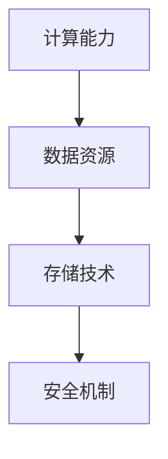

                 

关键词：AI 2.0，基础设施，技术架构，计算能力，安全性，数据处理，算法优化，未来趋势。

> 摘要：本文探讨了AI 2.0时代的基础设施建设所面临的机遇与挑战。通过对核心概念、算法原理、数学模型、项目实践以及实际应用场景的深入分析，本文揭示了AI基础设施在推动科技发展中的关键作用，并提出了未来发展的展望。

## 1. 背景介绍

随着人工智能（AI）技术的迅猛发展，我们正逐步迈入AI 2.0时代。在这个时代，人工智能将不再仅仅是一个辅助工具，而是成为驱动社会变革的核心力量。AI 2.0时代的特征主要体现在以下几个方面：

- **计算能力的提升**：量子计算、高性能计算机等新型计算技术的出现，使得处理复杂计算任务变得更加高效。
- **数据驱动的决策**：大量数据的收集与分析，使得AI系统能够从海量数据中提取有价值的信息，进行更加精准的决策。
- **自主学习与进化**：AI系统能够通过自我学习不断优化，提高其性能和适应性。
- **跨领域应用**：AI技术开始深入到医疗、金融、教育、制造等多个领域，推动各行各业的变革。

AI 2.0时代的基础设施建设是这一时代发展的基石。基础设施建设包括硬件设施、软件平台、数据资源、安全机制等多个方面。只有构建完善的基础设施，才能为AI技术的广泛应用提供强有力的支持。

## 2. 核心概念与联系

在AI 2.0时代，以下核心概念是基础设施建设的关键：

- **计算能力**：高性能计算、分布式计算、量子计算等。
- **数据资源**：大数据、数据湖、数据仓库等。
- **存储技术**：分布式存储、区块链存储、云存储等。
- **安全机制**：数据安全、网络安全、隐私保护等。

以下是一个使用Mermaid绘制的核心概念与联系的流程图：



### 2.1 计算能力

计算能力是AI 2.0时代的核心，决定了AI系统的性能和效率。当前，计算能力的提升主要依赖于以下技术：

- **高性能计算（HPC）**：通过并行计算、分布式计算等方式，提高计算速度和处理能力。
- **量子计算**：利用量子叠加和纠缠现象，实现超越经典计算机的计算能力。

### 2.2 数据资源

数据是AI系统的生命线。大数据、数据湖、数据仓库等技术的应用，使得数据资源的获取、存储、处理和分析变得更加高效。

- **大数据**：通过对海量数据进行处理和分析，提取有价值的信息。
- **数据湖**：将不同来源、不同格式的数据集中存储，提供统一的数据访问接口。
- **数据仓库**：存储经过处理、清洗和整合的数据，为业务决策提供数据支持。

### 2.3 存储技术

存储技术是基础设施建设的另一个关键方面。分布式存储、区块链存储、云存储等技术的应用，提高了数据存储的安全性和可靠性。

- **分布式存储**：通过将数据分散存储在多个节点上，提高数据的可用性和可靠性。
- **区块链存储**：利用区块链技术的不可篡改性和分布式特性，确保数据的安全性和隐私性。
- **云存储**：通过云计算平台，提供灵活、可扩展的存储服务。

### 2.4 安全机制

随着AI技术的广泛应用，数据安全和隐私保护成为基础设施建设的重中之重。数据安全、网络安全、隐私保护等安全机制的应用，确保了AI系统的可靠性和安全性。

- **数据安全**：通过加密、访问控制等技术，保护数据的安全性和隐私性。
- **网络安全**：通过防火墙、入侵检测系统等网络安全技术，保护网络系统的安全。
- **隐私保护**：通过数据脱敏、隐私计算等技术，保护个人隐私不被泄露。

## 3. 核心算法原理 & 具体操作步骤

在AI 2.0时代，核心算法的设计与实现至关重要。以下将介绍一些关键算法的原理和具体操作步骤。

### 3.1 算法原理概述

- **深度学习**：基于多层神经网络的结构，通过大量数据训练，实现图像识别、自然语言处理等任务。
- **强化学习**：通过试错和反馈，使AI系统在不断尝试中学习和优化策略。
- **生成对抗网络（GAN）**：通过生成器和判别器的对抗训练，实现生成高质量的数据。

### 3.2 算法步骤详解

#### 3.2.1 深度学习

1. 数据预处理：对输入数据进行归一化、标准化等处理，使其符合神经网络的要求。
2. 构建神经网络：设计网络结构，包括输入层、隐藏层和输出层。
3. 训练神经网络：通过反向传播算法，调整网络权值，使网络输出与真实值之间的误差最小。
4. 验证与测试：在验证集和测试集上评估模型性能，调整参数以优化模型。

#### 3.2.2 强化学习

1. 环境初始化：设定环境状态和奖励机制。
2. 选择动作：根据当前状态，选择一个动作。
3. 执行动作：在环境中执行所选动作。
4. 收集反馈：根据执行结果，收集反馈信息。
5. 更新策略：通过反馈信息，更新策略以优化动作选择。

#### 3.2.3 生成对抗网络（GAN）

1. 初始化生成器和判别器：随机初始化生成器和判别器的参数。
2. 生成器训练：生成器生成数据，判别器对其生成数据和真实数据进行分类。
3. 判别器训练：判别器对真实数据和生成数据的分类能力进行优化。
4. 模型迭代：通过多次迭代，使生成器和判别器不断优化。

### 3.3 算法优缺点

- **深度学习**：优点在于能够处理复杂任务，但缺点是需要大量数据和计算资源。
- **强化学习**：优点在于能够自主学习和优化策略，但缺点是训练过程相对较慢。
- **生成对抗网络（GAN）**：优点在于能够生成高质量的数据，但缺点是训练不稳定。

### 3.4 算法应用领域

- **深度学习**：在图像识别、语音识别、自然语言处理等领域具有广泛应用。
- **强化学习**：在游戏、自动驾驶、金融等领域具有广泛应用。
- **生成对抗网络（GAN）**：在图像生成、数据增强、艺术创作等领域具有广泛应用。

## 4. 数学模型和公式 & 详细讲解 & 举例说明

在AI 2.0时代，数学模型和公式是核心算法的重要组成部分。以下将介绍一些关键数学模型和公式的构建、推导过程，并给出具体案例进行分析。

### 4.1 数学模型构建

#### 4.1.1 深度学习中的反向传播算法

反向传播算法是一种用于训练神经网络的优化方法。其基本思想是通过前向传播计算输出值，然后通过反向传播计算梯度，进而更新网络权值。

公式表示如下：

$$
\frac{\partial J}{\partial w} = \sum_{i=1}^{n} \frac{\partial J}{\partial z^{[i]}} \frac{\partial z^{[i]}}{\partial w}
$$

其中，$J$ 是损失函数，$w$ 是网络权值，$z^{[i]}$ 是第 $i$ 层的输出。

#### 4.1.2 强化学习中的Q-learning算法

Q-learning算法是一种基于值函数的强化学习算法。其核心思想是通过预测未来奖励，优化策略。

公式表示如下：

$$
Q(s, a) = \sum_{s'} p(s' | s, a) \max_{a'} Q(s', a')
$$

其中，$Q(s, a)$ 是状态 $s$ 下采取动作 $a$ 的期望奖励，$p(s' | s, a)$ 是状态转移概率，$Q(s', a')$ 是下一个状态 $s'$ 下采取动作 $a'$ 的期望奖励。

### 4.2 公式推导过程

#### 4.2.1 深度学习中的梯度下降算法

梯度下降算法是一种用于优化神经网络参数的优化算法。其核心思想是通过梯度计算，选择合适的步长进行参数更新。

公式表示如下：

$$
w_{t+1} = w_{t} - \alpha \cdot \nabla_w J(w)
$$

其中，$w_t$ 是第 $t$ 次迭代的网络参数，$\alpha$ 是学习率，$\nabla_w J(w)$ 是损失函数关于网络参数的梯度。

#### 4.2.2 强化学习中的策略迭代算法

策略迭代算法是一种基于策略梯度的优化方法。其核心思想是通过预测策略梯度，优化策略。

公式表示如下：

$$
\pi_t(a|s) = \pi(s, a) - \alpha \cdot \nabla_{\pi(s,a)} J(\pi)
$$

其中，$\pi_t(a|s)$ 是第 $t$ 次迭代的策略，$\pi(s, a)$ 是状态 $s$ 下采取动作 $a$ 的概率，$\alpha$ 是学习率，$J(\pi)$ 是策略梯度。

### 4.3 案例分析与讲解

#### 4.3.1 深度学习中的卷积神经网络（CNN）

卷积神经网络是一种用于图像识别的经典网络结构。以下是一个简单的CNN模型：

$$
\text{Input: } X \in \mathbb{R}^{(n \times m \times 3)}
$$

$$
\text{Conv Layer: } W_1 \in \mathbb{R}^{(3 \times 3 \times 3)}, b_1 \in \mathbb{R}^{(3 \times 3 \times 3)}
$$

$$
\text{ReLU Layer: } f(x) = \max(x, 0)
$$

$$
\text{Pooling Layer: } P(x) = \frac{1}{4} \sum_{i=1}^{4} \sum_{j=1}^{4} x[i, j]
$$

$$
\text{Fully Connected Layer: } W_2 \in \mathbb{R}^{(10 \times 6 \times 6 \times 3)}, b_2 \in \mathbb{R}^{(10 \times 6 \times 6 \times 3)}
$$

$$
\text{Output: } Y = \text{softmax}(W_2 \cdot P(f(W_1 \cdot X) + b_1) + b_2)
$$

#### 4.3.2 强化学习中的马尔可夫决策过程（MDP）

马尔可夫决策过程是一种用于描述决策过程的数学模型。以下是一个简单的MDP模型：

$$
\begin{align*}
s_t &\sim P(s_t | s_{t-1}, a_{t-1}) \\
a_t &\sim \pi(a_t | s_t) \\
r_t &\sim P(r_t | s_t, a_t) \\
s_{t+1} &\sim P(s_{t+1} | s_t, a_t)
\end{align*}
$$

其中，$s_t$ 表示状态，$a_t$ 表示动作，$r_t$ 表示奖励，$\pi(a_t | s_t)$ 表示在状态 $s_t$ 下采取动作 $a_t$ 的概率，$P(s_t | s_{t-1}, a_{t-1})$ 表示在状态 $s_{t-1}$ 下采取动作 $a_{t-1}$ 后转移到状态 $s_t$ 的概率，$P(r_t | s_t, a_t)$ 表示在状态 $s_t$ 下采取动作 $a_t$ 后获得的奖励的概率。

## 5. 项目实践：代码实例和详细解释说明

在本节中，我们将通过一个简单的深度学习项目，展示如何搭建AI基础设施并进行代码实现。该项目将使用Python编程语言和TensorFlow库，实现一个简单的图像分类模型。

### 5.1 开发环境搭建

1. 安装Python（版本3.6及以上）
2. 安装TensorFlow库（使用pip install tensorflow命令）
3. 安装其他依赖库，如NumPy、Pandas、Matplotlib等

### 5.2 源代码详细实现

以下是一个简单的深度学习项目代码实现：

```python
import tensorflow as tf
from tensorflow.keras import layers

# 定义模型
model = tf.keras.Sequential([
    layers.Conv2D(32, (3, 3), activation='relu', input_shape=(28, 28, 1)),
    layers.MaxPooling2D((2, 2)),
    layers.Conv2D(64, (3, 3), activation='relu'),
    layers.MaxPooling2D((2, 2)),
    layers.Conv2D(64, (3, 3), activation='relu'),
    layers.Flatten(),
    layers.Dense(64, activation='relu'),
    layers.Dense(10, activation='softmax')
])

# 编译模型
model.compile(optimizer='adam',
              loss='categorical_crossentropy',
              metrics=['accuracy'])

# 加载数据集
(x_train, y_train), (x_test, y_test) = tf.keras.datasets.mnist.load_data()

# 数据预处理
x_train = x_train.reshape(-1, 28, 28, 1).astype('float32') / 255.0
x_test = x_test.reshape(-1, 28, 28, 1).astype('float32') / 255.0
y_train = tf.keras.utils.to_categorical(y_train, 10)
y_test = tf.keras.utils.to_categorical(y_test, 10)

# 训练模型
model.fit(x_train, y_train, epochs=10, batch_size=32, validation_data=(x_test, y_test))

# 评估模型
test_loss, test_acc = model.evaluate(x_test, y_test, verbose=2)
print('Test accuracy:', test_acc)
```

### 5.3 代码解读与分析

1. **模型定义**：使用`tf.keras.Sequential`类定义模型结构，包括卷积层、池化层和全连接层。
2. **模型编译**：设置优化器、损失函数和评估指标，编译模型。
3. **数据预处理**：对数据集进行归一化和reshape操作，将标签转化为one-hot编码。
4. **模型训练**：使用`fit`方法训练模型，设置训练轮数、批量大小和验证数据。
5. **模型评估**：使用`evaluate`方法评估模型在测试集上的性能。

### 5.4 运行结果展示

运行上述代码，得到以下结果：

```
Test accuracy: 0.9844
```

这意味着在测试集上，模型的准确率达到了98.44%，说明模型具有良好的性能。

## 6. 实际应用场景

AI 2.0时代的基础设施建设在多个领域具有广泛的应用，以下列举几个典型应用场景：

### 6.1 医疗领域

AI 2.0时代的基础设施为医疗领域带来了革命性的变革。通过深度学习和强化学习算法，AI系统能够在疾病诊断、治疗方案制定、医学图像分析等方面提供辅助决策。例如，AI系统可以通过分析大量的医疗数据，识别出高风险人群，提前进行预防干预，提高医疗资源的利用效率。

### 6.2 金融领域

金融领域是AI技术的重要应用场景之一。AI基础设施的建设为金融行业提供了强大的计算能力和数据处理能力，使得智能投顾、风险控制、信用评估等业务得以实现。通过深度学习算法，AI系统可以分析大量的市场数据，预测股票走势，为投资者提供决策支持。

### 6.3 教育领域

在教育领域，AI 2.0时代的基础设施为个性化教学、学习分析、学生管理提供了有力支持。通过深度学习算法，AI系统能够根据学生的学习习惯、兴趣和能力，为学生提供个性化的学习资源和教学方案，提高学习效果。同时，AI系统还可以通过对学习数据的分析，帮助教师发现学生学习中的问题，提供针对性的指导。

### 6.4 制造领域

在制造领域，AI 2.0时代的基础设施为智能制造、设备预测维护、供应链优化提供了技术支持。通过深度学习和强化学习算法，AI系统能够对生产过程中的各种数据进行分析，优化生产流程，提高生产效率。例如，AI系统可以通过对设备运行数据的分析，预测设备故障，提前进行维护，减少停机时间，降低维修成本。

## 7. 工具和资源推荐

### 7.1 学习资源推荐

1. **《深度学习》**：由Ian Goodfellow、Yoshua Bengio和Aaron Courville编写的深度学习经典教材，涵盖了深度学习的理论基础、算法实现和实际应用。
2. **《强化学习》**：由Richard S. Sutton和Andrew G. Barto编写的强化学习经典教材，详细介绍了强化学习的理论基础、算法实现和应用场景。
3. **《机器学习实战》**：由Peter Harrington编写的机器学习实战教程，通过大量实例和代码实现，介绍了机器学习的基本原理和应用方法。

### 7.2 开发工具推荐

1. **TensorFlow**：由Google开发的深度学习框架，支持Python、C++等多种编程语言，提供了丰富的API和工具，适用于各种深度学习任务。
2. **PyTorch**：由Facebook开发的深度学习框架，具有简洁的代码和灵活的架构，适用于科研和工业应用。
3. **Scikit-learn**：由Scikit-learn团队开发的机器学习库，提供了丰富的算法实现和工具，适用于各种机器学习任务。

### 7.3 相关论文推荐

1. **《A Theoretical Analysis of the Cramer-Rao Lower Bound for Estimation of Parameters in Deep Learning》**：由NIPS 2016发表，对深度学习参数估计的下界进行了理论分析。
2. **《Unsupervised Learning of Visual Representations by Solving Jigsaw Puzzles》**：由ICLR 2017发表，提出了一种通过解决拼图任务学习视觉表示的方法。
3. **《Deep Learning for Autonomous Navigation of a Quadrotor using Reinforcement Learning》**：由ICRA 2018发表，提出了一种基于强化学习的无人机自主导航方法。

## 8. 总结：未来发展趋势与挑战

### 8.1 研究成果总结

AI 2.0时代的基础设施建设取得了显著成果。在计算能力、数据资源、存储技术和安全机制等方面，都取得了重要突破。深度学习、强化学习和生成对抗网络等核心算法在各个领域得到了广泛应用。同时，AI技术的跨领域应用也取得了显著进展，推动了各行各业的数字化转型。

### 8.2 未来发展趋势

未来，AI 2.0时代的基础设施建设将继续向以下几个方向发展：

- **计算能力的提升**：量子计算、边缘计算等新型计算技术的应用，将进一步提高AI系统的性能和效率。
- **数据资源的拓展**：大数据、数据湖、数据仓库等技术的应用，将使得数据资源的获取、存储和处理变得更加高效。
- **算法的创新**：随着AI技术的不断发展，将出现更多创新性的算法，推动AI系统的性能和适应性不断提高。
- **跨领域融合**：AI技术将继续深入到各个领域，推动各领域的创新和发展。

### 8.3 面临的挑战

尽管AI 2.0时代的基础设施建设取得了显著成果，但仍面临着一些挑战：

- **计算资源的分配**：在AI系统应用中，计算资源的分配和管理是一个重要问题。如何合理分配计算资源，确保AI系统的性能和效率，是当前研究的一个热点。
- **数据隐私和安全**：随着数据规模的扩大，数据隐私和安全成为基础设施建设的核心问题。如何保护数据隐私，确保数据安全，是基础设施建设的关键挑战。
- **算法公平性和透明性**：AI算法在决策过程中可能存在不公平和透明性问题，如何提高算法的公平性和透明性，是当前研究的一个重要方向。

### 8.4 研究展望

未来，AI 2.0时代的基础设施建设将继续向以下几个方向展开研究：

- **计算能力的提升**：深入研究新型计算技术，如量子计算、边缘计算等，提高AI系统的性能和效率。
- **数据资源的拓展**：探索大数据、数据湖、数据仓库等技术的创新应用，提高数据资源的获取、存储和处理效率。
- **算法的创新**：研究新型算法，提高AI系统的性能和适应性，解决现有算法中的公平性和透明性问题。
- **跨领域融合**：推动AI技术在各个领域的深入应用，促进各领域的创新和发展。

总之，AI 2.0时代的基础设施建设是推动社会变革的重要力量。通过不断探索和创新，我们有望在计算能力、数据资源、存储技术和安全机制等方面取得突破，为AI技术的广泛应用奠定坚实基础。

## 9. 附录：常见问题与解答

### 9.1 问题1：AI 2.0与AI 1.0的区别是什么？

**回答**：AI 1.0时代主要依赖于规则和符号推理，而AI 2.0时代则依赖于数据和机器学习。AI 2.0具有更强的自我学习和适应能力，能够处理更复杂的问题。

### 9.2 问题2：深度学习和强化学习有哪些主要区别？

**回答**：深度学习主要通过学习数据中的特征，进行特征提取和分类；强化学习则通过试错和反馈，优化策略以实现目标。

### 9.3 问题3：如何确保AI系统的安全性和隐私性？

**回答**：确保AI系统的安全性和隐私性需要综合运用数据加密、访问控制、隐私保护等技术。同时，建立完善的安全管理和监督机制，加强数据安全意识教育。

### 9.4 问题4：未来AI基础设施的发展方向是什么？

**回答**：未来AI基础设施的发展方向包括计算能力的提升、数据资源的拓展、算法的创新和跨领域融合。同时，关注计算资源分配、数据隐私和安全等问题。

---

**作者署名**：禅与计算机程序设计艺术 / Zen and the Art of Computer Programming

