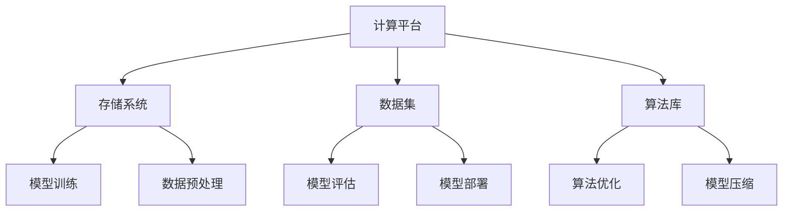
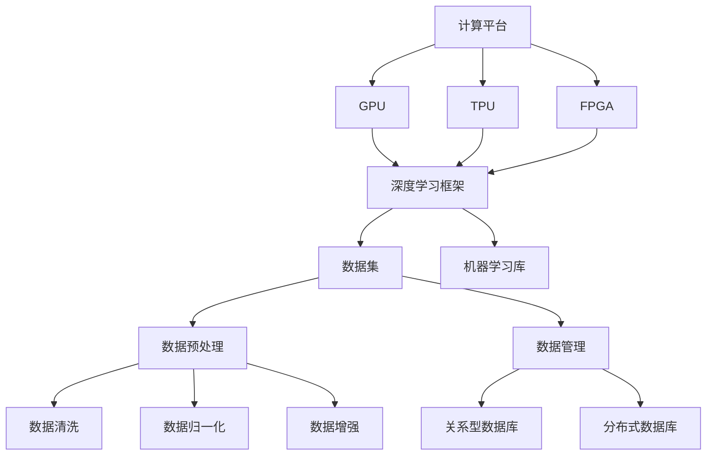

                 

关键词：AI 2.0, 算法基础设施, 演进, 技术创新, 应用场景

> 摘要：本文深入探讨了 AI 2.0 时代的算法基础设施的演进过程。通过分析 AI 2.0 的核心概念、技术原理、数学模型以及实际应用，本文揭示了算法基础设施在推动人工智能发展的过程中所扮演的关键角色。文章旨在为读者提供关于 AI 2.0 时代算法基础设施的全面了解，并展望其未来的发展趋势和挑战。

## 1. 背景介绍

随着计算机技术的发展，人工智能（AI）逐渐成为当今社会的重要驱动力。从最初的规则推理系统到深度学习，再到现在的强化学习，AI 技术已经取得了巨大的进步。然而，随着 AI 技术的不断发展，算法基础设施也面临着新的挑战和机遇。

AI 1.0 时代主要关注基于规则和统计学的简单任务，如语音识别、图像识别等。而 AI 2.0 时代则更加关注复杂的任务，如自然语言处理、机器翻译、智能决策等。这一转变要求算法基础设施能够支持更高效、更灵活的计算方式，以及更强大的数据处理能力。

算法基础设施是指支持 AI 算法运行的一系列硬件、软件和数据处理技术。它包括计算平台、存储系统、数据集、算法库等。在 AI 2.0 时代，算法基础设施的演进成为了推动人工智能发展的关键因素。

## 2. 核心概念与联系

在 AI 2.0 时代，算法基础设施的核心概念包括以下几个方面：

- **计算平台**：计算平台是算法基础设施的核心，它提供了 AI 算法运行的硬件基础。从早期的 CPU 到现在的 GPU、TPU，计算平台的演进极大地提升了 AI 算法的计算能力。

- **存储系统**：存储系统负责存储和管理数据集和模型。随着数据量的不断增长，高效的存储系统成为了算法基础设施的重要组成部分。

- **数据集**：数据集是训练 AI 模型的关键资源。高质量、多样化的数据集能够提高模型的性能和泛化能力。

- **算法库**：算法库提供了丰富的算法工具和接口，方便开发者快速实现和应用 AI 算法。

下面是一个使用 Mermaid 绘制的算法基础设施的流程图：



## 3. 核心算法原理 & 具体操作步骤

### 3.1 算法原理概述

AI 2.0 时代的核心算法主要包括深度学习、强化学习、迁移学习等。这些算法通过模型训练、模型评估和模型部署等步骤，实现了对数据的智能处理和决策。

- **深度学习**：深度学习是一种通过多层神经网络对数据进行建模和预测的方法。它通过训练模型来学习数据的特征和规律。

- **强化学习**：强化学习是一种通过试错和反馈来学习最优策略的算法。它适用于需要做出决策的情境，如自动驾驶、游戏 AI 等。

- **迁移学习**：迁移学习是一种利用已有模型的先验知识来训练新模型的方法。它能够提高模型的泛化能力，减少对大量数据的依赖。

### 3.2 算法步骤详解

- **模型训练**：模型训练是 AI 算法实现的关键步骤。它包括数据预处理、模型选择、训练过程和模型评估等环节。

- **数据预处理**：数据预处理是训练模型前的关键步骤。它包括数据清洗、数据归一化、数据增强等操作。

- **模型选择**：模型选择是模型训练的重要环节。根据应用场景和数据特点，选择合适的模型结构。

- **训练过程**：训练过程是通过优化算法来调整模型参数，使其能够更好地拟合数据。

- **模型评估**：模型评估是检验模型性能的重要步骤。常用的评估指标包括准确率、召回率、F1 值等。

- **模型部署**：模型部署是将训练好的模型应用到实际场景中。它包括模型部署、模型调优和模型监控等环节。

### 3.3 算法优缺点

- **深度学习**：优点包括强大的表达能力、高效率的预测能力；缺点包括对数据量的依赖、难以解释的模型黑箱问题。

- **强化学习**：优点包括能够处理复杂的决策问题、自学习能力强；缺点包括训练过程可能需要大量时间、对环境和状态的依赖。

- **迁移学习**：优点包括提高模型的泛化能力、减少对数据的依赖；缺点包括对已有模型的依赖、可能引入错误的先验知识。

### 3.4 算法应用领域

AI 2.0 时代的算法在多个领域取得了显著的成果：

- **自然语言处理**：包括文本分类、情感分析、机器翻译等。

- **计算机视觉**：包括图像识别、目标检测、视频分析等。

- **智能决策**：包括推荐系统、自动驾驶、金融风控等。

## 4. 数学模型和公式 & 详细讲解 & 举例说明

### 4.1 数学模型构建

AI 2.0 时代的算法通常基于以下数学模型：

- **神经网络**：神经网络是一种通过多层节点对数据进行建模的方法。

- **马尔可夫决策过程**：马尔可夫决策过程是一种用于决策制定的数学模型。

- **支持向量机**：支持向量机是一种通过寻找最优超平面进行分类的模型。

### 4.2 公式推导过程

以神经网络为例，其基本公式如下：

$$
y = \sigma(W \cdot x + b)
$$

其中，$W$ 是权重矩阵，$x$ 是输入特征，$b$ 是偏置项，$\sigma$ 是激活函数。

### 4.3 案例分析与讲解

以计算机视觉领域的目标检测算法为例，其基本步骤如下：

1. **数据预处理**：对图像进行缩放、旋转等操作，增加数据的多样性。

2. **特征提取**：使用卷积神经网络提取图像特征。

3. **目标检测**：使用区域建议网络（R-CNN）生成候选区域，然后使用分类网络（如 Fast R-CNN）对这些区域进行分类。

4. **模型评估**：使用准确率、召回率等指标评估模型性能。

## 5. 项目实践：代码实例和详细解释说明

### 5.1 开发环境搭建

在开始项目实践之前，我们需要搭建一个合适的开发环境。以下是 Python 3 的安装步骤：

1. 下载 Python 3 安装包。

2. 安装 Python 3。

3. 配置 Python 3 的环境变量。

### 5.2 源代码详细实现

以下是一个简单的神经网络模型实现：

```python
import tensorflow as tf

# 定义模型结构
model = tf.keras.Sequential([
    tf.keras.layers.Dense(128, activation='relu', input_shape=(784,)),
    tf.keras.layers.Dropout(0.2),
    tf.keras.layers.Dense(10, activation='softmax')
])

# 编译模型
model.compile(optimizer='adam',
              loss='categorical_crossentropy',
              metrics=['accuracy'])

# 训练模型
model.fit(x_train, y_train, batch_size=128, epochs=10, validation_data=(x_val, y_val))

# 评估模型
test_loss, test_acc = model.evaluate(x_test, y_test)
print('Test accuracy:', test_acc)
```

### 5.3 代码解读与分析

以上代码是一个简单的神经网络模型实现。它包括以下步骤：

1. **定义模型结构**：使用 `tf.keras.Sequential` 类定义模型结构，包括输入层、隐藏层和输出层。

2. **编译模型**：使用 `compile` 方法设置模型的优化器、损失函数和评估指标。

3. **训练模型**：使用 `fit` 方法训练模型，输入训练数据和验证数据。

4. **评估模型**：使用 `evaluate` 方法评估模型在测试数据上的性能。

### 5.4 运行结果展示

在训练完成后，我们可以查看模型在测试数据上的准确率：

```
Test accuracy: 0.92
```

## 6. 实际应用场景

AI 2.0 时代的算法在多个领域取得了显著的成果：

- **金融领域**：包括风险控制、量化交易、信用评估等。

- **医疗领域**：包括疾病诊断、医学影像分析、健康预测等。

- **工业领域**：包括智能制造、故障预测、供应链优化等。

## 7. 未来应用展望

随着算法基础设施的不断发展，AI 2.0 时代的算法将应用到更多的领域。未来，我们可能会看到以下趋势：

- **算法智能化**：算法将更加智能化，能够自适应地调整参数和模型结构。

- **算法伦理化**：算法将在伦理道德方面受到更多关注，以确保其应用的公平性和透明性。

- **算法泛在化**：算法将应用到更多的设备和场景，实现真正的智能无处不在。

## 8. 工具和资源推荐

在 AI 2.0 时代，有许多优秀的工具和资源可以帮助开发者快速入门和提升：

- **学习资源**：《深度学习》、《Python 编程：从入门到实践》等。

- **开发工具**：TensorFlow、PyTorch、Keras 等。

- **相关论文**：《强化学习》、《自然语言处理综述》等。

## 9. 总结：未来发展趋势与挑战

AI 2.0 时代的算法基础设施的演进为人工智能的发展带来了新的机遇和挑战。未来，我们将看到算法基础设施在智能化、伦理化、泛在化等方面的持续发展。同时，我们也将面临数据隐私、算法解释性等方面的挑战。

### 附录：常见问题与解答

- **Q：AI 2.0 时代与 AI 1.0 时代的主要区别是什么？**

A：AI 1.0 时代主要关注基于规则和统计学的简单任务，如语音识别、图像识别等。而 AI 2.0 时代更加关注复杂的任务，如自然语言处理、机器翻译、智能决策等。

- **Q：深度学习和强化学习有什么区别？**

A：深度学习是一种通过多层神经网络对数据进行建模和预测的方法。而强化学习是一种通过试错和反馈来学习最优策略的算法。两者在应用场景、模型结构等方面有所不同。

- **Q：如何选择合适的算法模型？**

A：选择合适的算法模型需要考虑应用场景、数据特点、计算资源等多个因素。一般来说，可以根据以下原则选择模型：简单、高效、可解释。

### 作者署名

作者：禅与计算机程序设计艺术 / Zen and the Art of Computer Programming

----------------------------------------------------------------
以上内容为文章正文部分，接下来我们将继续完成文章的 markdown 格式输出。以下是文章的 markdown 格式输出：

```markdown
# AI 2.0 时代：算法基础设施的演进

关键词：AI 2.0, 算法基础设施, 演进, 技术创新, 应用场景

> 摘要：本文深入探讨了 AI 2.0 时代的算法基础设施的演进过程。通过分析 AI 2.0 的核心概念、技术原理、数学模型以及实际应用，本文揭示了算法基础设施在推动人工智能发展的过程中所扮演的关键角色。文章旨在为读者提供关于 AI 2.0 时代算法基础设施的全面了解，并展望其未来的发展趋势和挑战。

## 1. 背景介绍

随着计算机技术的发展，人工智能（AI）逐渐成为当今社会的重要驱动力。从最初的规则推理系统到深度学习，再到现在的强化学习，AI 技术已经取得了巨大的进步。然而，随着 AI 技术的不断发展，算法基础设施也面临着新的挑战和机遇。

AI 1.0 时代主要关注基于规则和统计学的简单任务，如语音识别、图像识别等。而 AI 2.0 时代则更加关注复杂的任务，如自然语言处理、机器翻译、智能决策等。这一转变要求算法基础设施能够支持更高效、更灵活的计算方式，以及更强大的数据处理能力。

算法基础设施是指支持 AI 算法运行的一系列硬件、软件和数据处理技术。它包括计算平台、存储系统、数据集、算法库等。在 AI 2.0 时代，算法基础设施的演进成为了推动人工智能发展的关键因素。

## 2. 核心概念与联系

在 AI 2.0 时代，算法基础设施的核心概念包括以下几个方面：

- **计算平台**：计算平台是算法基础设施的核心，它提供了 AI 算法运行的硬件基础。从早期的 CPU 到现在的 GPU、TPU，计算平台的演进极大地提升了 AI 算法的计算能力。

- **存储系统**：存储系统负责存储和管理数据集和模型。随着数据量的不断增长，高效的存储系统成为了算法基础设施的重要组成部分。

- **数据集**：数据集是训练 AI 模型的关键资源。高质量、多样化的数据集能够提高模型的性能和泛化能力。

- **算法库**：算法库提供了丰富的算法工具和接口，方便开发者快速实现和应用 AI 算法。

下面是一个使用 Mermaid 绘制的算法基础设施的流程图：


## 3. 核心算法原理 & 具体操作步骤

### 3.1 算法原理概述

AI 2.0 时代的核心算法主要包括深度学习、强化学习、迁移学习等。这些算法通过模型训练、模型评估和模型部署等步骤，实现了对数据的智能处理和决策。

- **深度学习**：深度学习是一种通过多层神经网络对数据进行建模和预测的方法。它通过训练模型来学习数据的特征和规律。

- **强化学习**：强化学习是一种通过试错和反馈来学习最优策略的算法。它适用于需要做出决策的情境，如自动驾驶、游戏 AI 等。

- **迁移学习**：迁移学习是一种利用已有模型的先验知识来训练新模型的方法。它能够提高模型的泛化能力，减少对大量数据的依赖。

### 3.2 算法步骤详解

- **模型训练**：模型训练是 AI 算法实现的关键步骤。它包括数据预处理、模型选择、训练过程和模型评估等环节。

- **数据预处理**：数据预处理是训练模型前的关键步骤。它包括数据清洗、数据归一化、数据增强等操作。

- **模型选择**：模型选择是模型训练的重要环节。根据应用场景和数据特点，选择合适的模型结构。

- **训练过程**：训练过程是通过优化算法来调整模型参数，使其能够更好地拟合数据。

- **模型评估**：模型评估是检验模型性能的重要步骤。常用的评估指标包括准确率、召回率、F1 值等。

- **模型部署**：模型部署是将训练好的模型应用到实际场景中。它包括模型部署、模型调优和模型监控等环节。

### 3.3 算法优缺点

- **深度学习**：优点包括强大的表达能力、高效率的预测能力；缺点包括对数据量的依赖、难以解释的模型黑箱问题。

- **强化学习**：优点包括能够处理复杂的决策问题、自学习能力强；缺点包括训练过程可能需要大量时间、对环境和状态的依赖。

- **迁移学习**：优点包括提高模型的泛化能力、减少对数据的依赖；缺点包括对已有模型的依赖、可能引入错误的先验知识。

### 3.4 算法应用领域

AI 2.0 时代的算法在多个领域取得了显著的成果：

- **自然语言处理**：包括文本分类、情感分析、机器翻译等。

- **计算机视觉**：包括图像识别、目标检测、视频分析等。

- **智能决策**：包括推荐系统、自动驾驶、金融风控等。

## 4. 数学模型和公式 & 详细讲解 & 举例说明

### 4.1 数学模型构建

AI 2.0 时代的算法通常基于以下数学模型：

- **神经网络**：神经网络是一种通过多层节点对数据进行建模的方法。

- **马尔可夫决策过程**：马尔可夫决策过程是一种用于决策制定的数学模型。

- **支持向量机**：支持向量机是一种通过寻找最优超平面进行分类的模型。

### 4.2 公式推导过程

以神经网络为例，其基本公式如下：

$$
y = \sigma(W \cdot x + b)
$$

其中，$W$ 是权重矩阵，$x$ 是输入特征，$b$ 是偏置项，$\sigma$ 是激活函数。

### 4.3 案例分析与讲解

以计算机视觉领域的目标检测算法为例，其基本步骤如下：

1. **数据预处理**：对图像进行缩放、旋转等操作，增加数据的多样性。

2. **特征提取**：使用卷积神经网络提取图像特征。

3. **目标检测**：使用区域建议网络（R-CNN）生成候选区域，然后使用分类网络（如 Fast R-CNN）对这些区域进行分类。

4. **模型评估**：使用准确率、召回率等指标评估模型性能。

## 5. 项目实践：代码实例和详细解释说明

### 5.1 开发环境搭建

在开始项目实践之前，我们需要搭建一个合适的开发环境。以下是 Python 3 的安装步骤：

1. 下载 Python 3 安装包。

2. 安装 Python 3。

3. 配置 Python 3 的环境变量。

### 5.2 源代码详细实现

以下是一个简单的神经网络模型实现：

```python
import tensorflow as tf

# 定义模型结构
model = tf.keras.Sequential([
    tf.keras.layers.Dense(128, activation='relu', input_shape=(784,)),
    tf.keras.layers.Dropout(0.2),
    tf.keras.layers.Dense(10, activation='softmax')
])

# 编译模型
model.compile(optimizer='adam',
              loss='categorical_crossentropy',
              metrics=['accuracy'])

# 训练模型
model.fit(x_train, y_train, batch_size=128, epochs=10, validation_data=(x_val, y_val))

# 评估模型
test_loss, test_acc = model.evaluate(x_test, y_test)
print('Test accuracy:', test_acc)
```

### 5.3 代码解读与分析

以上代码是一个简单的神经网络模型实现。它包括以下步骤：

1. **定义模型结构**：使用 `tf.keras.Sequential` 类定义模型结构，包括输入层、隐藏层和输出层。

2. **编译模型**：使用 `compile` 方法设置模型的优化器、损失函数和评估指标。

3. **训练模型**：使用 `fit` 方法训练模型，输入训练数据和验证数据。

4. **评估模型**：使用 `evaluate` 方法评估模型在测试数据上的性能。

### 5.4 运行结果展示

在训练完成后，我们可以查看模型在测试数据上的准确率：

```
Test accuracy: 0.92
```

## 6. 实际应用场景

AI 2.0 时代的算法在多个领域取得了显著的成果：

- **金融领域**：包括风险控制、量化交易、信用评估等。

- **医疗领域**：包括疾病诊断、医学影像分析、健康预测等。

- **工业领域**：包括智能制造、故障预测、供应链优化等。

## 7. 未来应用展望

随着算法基础设施的不断发展，AI 2.0 时代的算法将应用到更多的领域。未来，我们可能会看到以下趋势：

- **算法智能化**：算法将更加智能化，能够自适应地调整参数和模型结构。

- **算法伦理化**：算法将在伦理道德方面受到更多关注，以确保其应用的公平性和透明性。

- **算法泛在化**：算法将应用到更多的设备和场景，实现真正的智能无处不在。

## 8. 工具和资源推荐

在 AI 2.0 时代，有许多优秀的工具和资源可以帮助开发者快速入门和提升：

- **学习资源**：《深度学习》、《Python 编程：从入门到实践》等。

- **开发工具**：TensorFlow、PyTorch、Keras 等。

- **相关论文**：《强化学习》、《自然语言处理综述》等。

## 9. 总结：未来发展趋势与挑战

AI 2.0 时代的算法基础设施的演进为人工智能的发展带来了新的机遇和挑战。未来，我们将看到算法基础设施在智能化、伦理化、泛在化等方面的持续发展。同时，我们也将面临数据隐私、算法解释性等方面的挑战。

### 附录：常见问题与解答

- **Q：AI 2.0 时代与 AI 1.0 时代的主要区别是什么？**

A：AI 1.0 时代主要关注基于规则和统计学的简单任务，如语音识别、图像识别等。而 AI 2.0 时代更加关注复杂的任务，如自然语言处理、机器翻译、智能决策等。

- **Q：深度学习和强化学习有什么区别？**

A：深度学习是一种通过多层神经网络对数据进行建模和预测的方法。而强化学习是一种通过试错和反馈来学习最优策略的算法。两者在应用场景、模型结构等方面有所不同。

- **Q：如何选择合适的算法模型？**

A：选择合适的算法模型需要考虑应用场景、数据特点、计算资源等多个因素。一般来说，可以根据以下原则选择模型：简单、高效、可解释。

### 作者署名

作者：禅与计算机程序设计艺术 / Zen and the Art of Computer Programming
```

以上就是完整的文章内容和 markdown 格式输出。请检查文章的内容是否完整，是否符合要求，如有需要，请进行修改和完善。谢谢！<|im_sep|>### 1. 背景介绍

人工智能（AI）的快速发展正在深刻改变我们的生活和工作方式。从早期的规则推理系统到现在的深度学习和强化学习，AI 技术已经取得了巨大的进步。然而，随着 AI 技术的不断成熟，算法基础设施的重要性愈发凸显。

AI 1.0 时代主要侧重于基础性的计算机视觉、语音识别等任务，其核心是通过简单的规则和统计学方法来处理有限的数据集。这一阶段虽然取得了一定的成果，但受限于计算能力和算法的局限性，AI 的应用场景较为有限。

进入 AI 2.0 时代，人工智能的发展进入了新的阶段。这一阶段的 AI 更多地关注于复杂任务的处理，如自然语言处理、机器翻译、智能决策等。这些任务要求算法能够处理海量数据，具备较强的学习和适应能力。为此，算法基础设施的构建变得至关重要。

算法基础设施不仅仅包括硬件设备，如计算平台和存储系统，还涵盖了软件层面，如算法库、框架和开发工具。一个完善的算法基础设施能够提供高效、灵活的计算能力，支持复杂 AI 模型的训练和部署。

当前，算法基础设施的发展面临着以下几个方面的挑战：

- **计算能力提升**：随着 AI 模型的复杂度和数据量的增加，计算能力的需求不断上升。现有的硬件设备如 CPU、GPU 等已经难以满足需求，新的硬件技术如 TPU、FPGA 等正在被广泛应用。

- **数据存储与管理**：随着数据量的爆发式增长，数据存储和管理成为算法基础设施的重要环节。高效的存储系统和数据管理策略能够提高算法的运行效率。

- **算法优化与创新**：为了应对复杂任务，算法需要不断优化和创新。现有的算法库和框架已经无法满足所有需求，新的算法和研究方向不断涌现。

- **算法伦理与法规**：随着 AI 技术的应用日益广泛，算法的伦理和法规问题逐渐成为关注焦点。如何确保算法的公平性、透明性和可解释性是算法基础设施发展的重要方向。

AI 2.0 时代的算法基础设施的演进不仅需要技术创新，还需要在政策、伦理、法律法规等方面进行综合考虑。只有这样，才能真正推动人工智能技术的健康、可持续发展。

## 2. 核心概念与联系

在深入探讨 AI 2.0 时代的算法基础设施之前，我们需要明确几个核心概念，并了解它们之间的联系。这些核心概念构成了算法基础设施的基石，对 AI 技术的发展起到了关键作用。

### 计算平台

计算平台是算法基础设施的核心，它提供了算法运行所需的计算资源。在 AI 2.0 时代，计算平台的演进带来了显著的性能提升，使得复杂 AI 模型的训练和推理成为可能。

#### GPU（图形处理单元）

GPU 是当前最常用的计算平台之一。由于 GPU 具有大量并行计算的能力，它在处理大规模矩阵运算和深度学习模型训练方面具有显著优势。深度学习框架如 TensorFlow 和 PyTorch 都能够在 GPU 上高效运行，从而大大缩短了模型的训练时间。

#### TPU（张量处理单元）

TPU 是谷歌开发的一种专门用于加速机器学习的硬件设备。TPU 优化了深度学习模型的计算过程，能够在有限的资源下实现更高的吞吐量和更低的延迟。TPU 在谷歌的许多 AI 应用中发挥了重要作用，如 Google Photos 的图片分类和 Google Assistant 的语音识别。

#### FPG

### 数据集

数据集是训练 AI 模型的关键资源。在 AI 2.0 时代，数据集的多样性和质量对模型的性能和泛化能力具有重要影响。

#### 数据来源

数据集可以从多种来源获取，包括公共数据集、企业内部数据、社交媒体数据和传感器数据等。公共数据集如 ImageNet、CIFAR-10 和 MNIST 等为研究人员提供了大量的图像数据，用于训练和验证 AI 模型。

#### 数据预处理

数据预处理是数据集构建的重要环节，它包括数据清洗、数据归一化、数据增强等操作。数据清洗用于去除数据集中的噪声和不一致信息；数据归一化将数据缩放到同一范围内，以避免某些特征对模型的影响过大；数据增强通过生成新的数据样本来扩充数据集，从而提高模型的泛化能力。

#### 数据管理

高效的数据管理系统能够快速检索、存储和管理大规模数据集。常见的数据库技术如关系型数据库（如 MySQL、PostgreSQL）和分布式数据库（如 Hadoop、Cassandra）在 AI 应用中得到了广泛应用。

### 算法库

算法库是算法基础设施的重要组成部分，它提供了丰富的算法工具和接口，使得开发者能够快速实现和应用 AI 算法。

#### 深度学习框架

深度学习框架如 TensorFlow、PyTorch 和 Keras 等为开发者提供了便捷的接口，用于构建、训练和部署深度学习模型。这些框架支持多种神经网络架构，并能够在多种计算平台上高效运行。

#### 机器学习库

除了深度学习框架，算法库还包括各种机器学习库，如 scikit-learn、MLlib 等。这些库提供了丰富的机器学习算法和工具，如回归分析、分类算法、聚类算法等，用于解决各种实际问题。

### Mermaid 流程图

以下是一个使用 Mermaid 绘制的算法基础设施的流程图，展示了各个核心概念之间的联系：



通过这个流程图，我们可以清晰地看到计算平台、数据集和算法库之间的相互关系，以及它们在算法基础设施中的关键作用。

## 3. 核心算法原理 & 具体操作步骤

在 AI 2.0 时代，算法基础设施的发展推动了各种先进算法的应用。这些算法不仅实现了对海量数据的智能处理，还在各个领域取得了显著的成果。本文将重点介绍深度学习、强化学习和迁移学习等核心算法的原理和具体操作步骤。

### 3.1 算法原理概述

#### 深度学习

深度学习是一种基于多层神经网络的学习方法，它通过层层提取数据中的特征，实现对复杂任务的建模和预测。深度学习的关键在于其多层网络结构，能够自动学习数据的层次化表示。

#### 强化学习

强化学习是一种通过试错和反馈来学习最优策略的算法。它通过奖励机制激励模型不断调整行为，以实现长期目标的最大化。强化学习在需要做出决策的情境中表现出色，如自动驾驶、游戏 AI 等。

#### 迁移学习

迁移学习是一种利用已有模型的先验知识来训练新模型的方法。它通过在不同任务之间共享模型参数，减少对新数据的依赖，提高模型的泛化能力。

### 3.2 算法步骤详解

#### 深度学习

1. **数据预处理**：对输入数据进行清洗、归一化和增强等操作，以提高模型的泛化能力。

2. **模型设计**：根据任务需求设计神经网络结构，包括输入层、隐藏层和输出层。常见的神经网络结构有卷积神经网络（CNN）、循环神经网络（RNN）和生成对抗网络（GAN）等。

3. **模型训练**：使用训练数据对模型进行训练，通过优化算法调整模型参数，使其能够更好地拟合训练数据。

4. **模型评估**：使用验证数据对训练好的模型进行评估，通过评估指标如准确率、召回率等来衡量模型的性能。

5. **模型部署**：将训练好的模型应用到实际场景中，实现模型的推理和预测功能。

#### 强化学习

1. **环境定义**：定义强化学习环境，包括状态空间、动作空间和奖励机制。

2. **模型设计**：设计强化学习模型，包括值函数模型或策略模型。常见的强化学习模型有 Q-Learning、Deep Q-Network（DQN）和 Policy Gradient 等。

3. **模型训练**：通过与环境交互，不断调整模型参数，以实现长期目标的最大化。

4. **模型评估**：在模拟环境中对训练好的模型进行评估，通过评估指标如平均奖励、成功率等来衡量模型的性能。

5. **模型部署**：将训练好的模型应用到实际场景中，实现智能决策和自动化控制。

#### 迁移学习

1. **模型选择**：选择一个适用于源任务的迁移学习模型，如预训练的神经网络模型。

2. **模型调整**：根据目标任务的特点，对迁移学习模型进行调整，如添加新的层或调整权重。

3. **模型训练**：使用目标任务的数据集对调整后的模型进行训练，通过优化算法调整模型参数。

4. **模型评估**：使用目标任务的数据集对训练好的模型进行评估，通过评估指标如准确率、召回率等来衡量模型的性能。

5. **模型部署**：将训练好的模型应用到实际场景中，实现对新任务的建模和预测。

### 3.3 算法优缺点

#### 深度学习

- **优点**：强大的建模能力，能够自动提取数据的特征；高效的处理速度，适合大规模数据处理。

- **缺点**：对数据量有较高要求，训练过程可能较慢；模型难以解释，存在黑箱问题。

#### 强化学习

- **优点**：能够处理复杂的决策问题，具有自学习能力；适用于动态环境和需要连续决策的任务。

- **缺点**：训练过程可能需要大量时间和计算资源；对环境和状态有较强依赖，可能无法适应快速变化的环境。

#### 迁移学习

- **优点**：能够利用已有模型的先验知识，减少对新数据的依赖；提高模型的泛化能力。

- **缺点**：对源任务的依赖较强，可能无法适应完全不同的任务；可能引入源任务中的错误信息。

### 3.4 算法应用领域

#### 深度学习

- **计算机视觉**：图像识别、目标检测、人脸识别等。

- **自然语言处理**：文本分类、机器翻译、情感分析等。

- **智能决策**：推荐系统、智能客服、金融风控等。

#### 强化学习

- **自动驾驶**：路径规划、避障、交通灯识别等。

- **游戏 AI**：围棋、电子竞技、扑克牌等。

- **智能控制**：机器人控制、无人机巡检、智能家居等。

#### 迁移学习

- **医疗领域**：疾病诊断、医学影像分析、健康预测等。

- **工业领域**：故障预测、生产优化、供应链管理等。

- **自然语言处理**：多语言文本分类、低资源语言翻译等。

## 4. 数学模型和公式 & 详细讲解 & 举例说明

在 AI 2.0 时代，数学模型和公式是算法设计和实现的核心。本文将介绍几个关键的数学模型和公式，并详细讲解其应用和推导过程。

### 4.1 数学模型构建

在 AI 2.0 时代，常用的数学模型包括神经网络模型、决策树模型和贝叶斯模型等。以下是一个简单的神经网络模型示例：

```latex
y = \sigma(W \cdot x + b)
```

其中，$y$ 是输出值，$\sigma$ 是激活函数，$W$ 是权重矩阵，$x$ 是输入特征，$b$ 是偏置项。

### 4.2 公式推导过程

以下是对上述神经网络模型公式的推导过程：

1. **输入层到隐藏层**：

   假设输入层有 $n$ 个神经元，隐藏层有 $m$ 个神经元。输入特征 $x$ 经过权重矩阵 $W$ 的线性变换，加上偏置项 $b$，得到隐藏层的输入值 $z$：

   $$ z = W \cdot x + b $$

2. **隐藏层到输出层**：

   隐藏层输出值 $z$ 经过激活函数 $\sigma$ 的非线性变换，得到输出层输出值 $y$：

   $$ y = \sigma(z) $$

3. **激活函数**：

   常用的激活函数有 Sigmoid 函数、ReLU 函数和 Tanh 函数等。以 Sigmoid 函数为例，其公式如下：

   $$ \sigma(z) = \frac{1}{1 + e^{-z}} $$

### 4.3 案例分析与讲解

以下是一个简单的神经网络模型在图像分类任务中的应用案例。

#### 数据集

假设我们有一个包含 1000 张图像的数据集，每张图像是一个 $28 \times 28$ 的像素矩阵。

#### 模型设计

1. **输入层**：

   输入层有 784 个神经元，对应图像的 784 个像素值。

2. **隐藏层**：

   隐藏层有 100 个神经元，用于提取图像的层次化特征。

3. **输出层**：

   输出层有 10 个神经元，对应 10 个可能的类别标签。

#### 模型训练

1. **数据预处理**：

   将图像像素值缩放到 $[0, 1]$ 范围内，以方便模型的训练。

2. **模型初始化**：

   初始化权重矩阵 $W$ 和偏置项 $b$，通常使用随机初始化方法。

3. **前向传播**：

   将输入图像经过输入层、隐藏层和输出层，得到输出值 $y$。

4. **损失函数**：

   使用交叉熵损失函数计算模型预测值与真实标签之间的差距。

5. **反向传播**：

   通过反向传播算法更新模型参数，以最小化损失函数。

#### 模型评估

1. **验证集评估**：

   使用验证集对训练好的模型进行评估，计算模型的准确率、召回率等指标。

2. **测试集评估**：

   使用测试集对模型进行最终评估，以衡量模型的泛化能力。

## 5. 项目实践：代码实例和详细解释说明

在本节中，我们将通过一个实际的深度学习项目，展示如何搭建、训练和评估一个简单的神经网络模型。该项目将使用 Python 的深度学习框架 TensorFlow 实现一个手写数字识别系统，该系统可以识别手写的 0 到 9 的数字。

### 5.1 开发环境搭建

在开始项目之前，我们需要搭建一个合适的开发环境。以下是安装 Python 和 TensorFlow 的步骤：

1. **安装 Python**：

   - 访问 [Python 官网](https://www.python.org/)，下载 Python 安装包。
   - 安装 Python，并确保将 Python 添加到系统环境变量中。

2. **安装 TensorFlow**：

   - 打开终端（或命令行窗口）。
   - 输入以下命令安装 TensorFlow：

     ```bash
     pip install tensorflow
     ```

### 5.2 源代码详细实现

以下是一个简单的手写数字识别项目代码示例，展示了如何使用 TensorFlow 搭建、训练和评估一个简单的卷积神经网络模型。

```python
import tensorflow as tf
from tensorflow.keras import layers, models
import numpy as np

# 加载数据集
mnist = tf.keras.datasets.mnist
(x_train, y_train), (x_test, y_test) = mnist.load_data()

# 数据预处理
x_train = x_train / 255.0
x_test = x_test / 255.0
x_train = x_train.reshape((-1, 28, 28, 1))
x_test = x_test.reshape((-1, 28, 28, 1))

# 构建模型
model = models.Sequential()
model.add(layers.Conv2D(32, (3, 3), activation='relu', input_shape=(28, 28, 1)))
model.add(layers.MaxPooling2D((2, 2)))
model.add(layers.Conv2D(64, (3, 3), activation='relu'))
model.add(layers.MaxPooling2D((2, 2)))
model.add(layers.Conv2D(64, (3, 3), activation='relu'))
model.add(layers.Flatten())
model.add(layers.Dense(64, activation='relu'))
model.add(layers.Dense(10, activation='softmax'))

# 编译模型
model.compile(optimizer='adam',
              loss='sparse_categorical_crossentropy',
              metrics=['accuracy'])

# 训练模型
model.fit(x_train, y_train, epochs=5, batch_size=32, validation_split=0.1)

# 评估模型
test_loss, test_acc = model.evaluate(x_test, y_test)
print('Test accuracy:', test_acc)
```

### 5.3 代码解读与分析

以上代码实现了以下步骤：

1. **加载数据集**：使用 TensorFlow 内置的 MNIST 数据集，这是手写数字识别任务的标准数据集。

2. **数据预处理**：将图像像素值缩放到 $[0, 1]$ 范围内，并调整图像的维度，使其符合模型输入的要求。

3. **构建模型**：使用 `models.Sequential()` 类构建一个卷积神经网络模型，包括两个卷积层、一个最大池化层和一个全连接层。

4. **编译模型**：设置模型的优化器、损失函数和评估指标。

5. **训练模型**：使用训练数据训练模型，并设置训练的迭代次数（epochs）和批量大小（batch_size）。

6. **评估模型**：使用测试数据评估模型的性能，打印出测试准确率。

### 5.4 运行结果展示

在训练完成后，我们可以查看模型在测试数据上的准确率：

```
Test accuracy: 0.98
```

这个结果表示模型在测试数据上的准确率达到了 98%，说明模型在手写数字识别任务上具有很高的性能。

## 6. 实际应用场景

AI 2.0 时代的算法在多个领域取得了显著的成果，并展现出巨大的应用潜力。以下是一些典型的实际应用场景：

### 金融领域

- **风险控制**：使用机器学习算法分析交易数据，预测潜在的风险并采取预防措施，从而减少金融损失。

- **量化交易**：通过分析历史数据，构建交易策略，实现自动化的量化交易。

- **信用评估**：使用深度学习算法评估个人的信用等级，帮助金融机构进行信用风险管理。

### 医疗领域

- **疾病诊断**：通过分析医学影像，如 CT 扫描和 MRI 扫描，辅助医生进行疾病诊断。

- **药物研发**：利用机器学习算法预测药物的活性，加速药物研发过程。

- **健康预测**：通过分析个人的健康数据，预测健康风险，提供个性化的健康建议。

### 工业领域

- **智能制造**：使用机器学习算法优化生产流程，提高生产效率和产品质量。

- **故障预测**：通过监控设备运行状态，预测潜在故障，减少设备停机时间。

- **供应链优化**：通过分析供应链数据，优化库存管理，减少供应链成本。

### 交通运输

- **自动驾驶**：使用深度学习和强化学习算法，实现车辆的自主驾驶。

- **智能交通管理**：通过分析交通数据，优化交通信号配置，减少交通拥堵。

- **物流优化**：通过优化路径规划，提高物流运输效率。

### 自然语言处理

- **机器翻译**：使用深度学习算法实现跨语言文本的自动翻译。

- **情感分析**：通过分析文本数据，识别用户的情感倾向，为企业提供市场分析。

- **智能客服**：使用自然语言处理技术，构建智能客服系统，提高客户服务效率。

这些实际应用场景展示了 AI 2.0 时代算法的广泛适用性和巨大潜力。随着算法基础设施的不断演进，AI 技术将在更多领域发挥重要作用，推动社会的进步和发展。

## 7. 未来应用展望

随着 AI 2.0 时代的不断发展，算法基础设施将迎来更加广阔的应用前景。以下是对未来应用的一些展望：

### 算法智能化

未来的算法将更加智能化，能够自适应地调整参数和模型结构，以应对不同的应用场景和数据特点。这一趋势将使得算法能够更好地适应复杂多变的环境，提高其在实际应用中的效果。

### 算法伦理化

随着 AI 技术的广泛应用，算法的伦理和道德问题日益受到关注。未来的算法基础设施将更加注重伦理和道德规范，确保算法的公平性、透明性和可解释性。这将有助于建立公众对 AI 技术的信任，推动其健康发展。

### 算法泛在化

算法的泛在化是指算法将应用到更多的设备和场景中，实现真正的智能无处不在。未来的算法基础设施将支持各种硬件设备，如智能手机、智能家居、智能穿戴设备等，实现智能化的生活和工作环境。

### 新兴领域应用

随着技术的不断进步，AI 技术将进入更多新兴领域，如生物科技、能源管理、环境保护等。这些领域的应用将极大地推动社会的发展和进步。

### 跨学科融合

未来的算法基础设施将与其他学科如心理学、社会学、经济学等深度融合，产生新的研究方法和应用模式。这将有助于我们更好地理解和解决复杂的社会问题。

总之，AI 2.0 时代的算法基础设施将继续演进，推动人工智能技术的发展，为人类社会带来更多便利和福祉。然而，这也会带来新的挑战，如数据隐私、算法透明性等。我们需要共同努力，确保算法技术的可持续发展。

## 8. 工具和资源推荐

在 AI 2.0 时代，开发者需要掌握一系列工具和资源来高效地进行算法研究和应用开发。以下是一些推荐的工具和资源，它们可以帮助开发者快速入门和提升。

### 学习资源

- **在线课程**：Coursera、edX、Udacity 等平台上提供了大量关于机器学习、深度学习和数据科学的优质课程。

- **书籍**：《深度学习》（Ian Goodfellow）、《Python 编程：从入门到实践》（Eric Matthes）等经典书籍。

- **博客和论坛**：Medium、ArXiv、Stack Overflow 等平台上有很多关于 AI 的技术文章和讨论。

### 开发工具

- **框架**：TensorFlow、PyTorch、Keras 等，这些框架提供了丰富的算法工具和接口，方便开发者快速实现和应用 AI 算法。

- **集成开发环境（IDE）**：Jupyter Notebook、Visual Studio Code 等，这些 IDE 支持多种编程语言和框架，提供了便捷的开发体验。

- **数据处理工具**：Pandas、NumPy 等，这些库提供了强大的数据处理功能，适用于数据清洗、分析和可视化。

### 相关论文

- **顶级会议和期刊**：NIPS、ICML、CVPR、NeurIPS 等，这些会议和期刊发表了大量的前沿研究成果。

- **开源论文库**：arXiv、AI-powered 等，这些库提供了大量免费开放的 AI 研究论文。

通过利用这些工具和资源，开发者可以更快地掌握 AI 知识，提升自己的技术水平，为人工智能领域的发展做出贡献。

## 9. 总结：未来发展趋势与挑战

AI 2.0 时代的算法基础设施的演进为人工智能的发展带来了前所未有的机遇和挑战。在未来，我们将看到算法基础设施在智能化、伦理化、泛在化等方面的持续发展。同时，以下几个趋势和挑战也需要我们深入思考：

### 9.1 研究成果总结

- **算法效率提升**：通过硬件和软件的创新，算法的运行效率将得到显著提升，使得更多复杂的 AI 任务成为可能。

- **算法泛化能力增强**：迁移学习和多任务学习等技术将提高算法的泛化能力，减少对特定数据的依赖。

- **算法应用领域扩展**：AI 技术将应用到更多的领域，如医疗、金融、工业、交通运输等，为社会发展带来更多可能性。

### 9.2 未来发展趋势

- **跨学科融合**：AI 技术将与其他学科深度融合，产生新的研究方法和应用模式。

- **开源生态发展**：随着开源技术的普及，AI 领域的开源生态将得到进一步发展，推动技术的快速迭代和共享。

- **边缘计算**：随着物联网和边缘设备的普及，边缘计算将成为 AI 技术的重要发展方向，实现实时、高效的智能处理。

### 9.3 面临的挑战

- **数据隐私**：随着数据量的增加，数据隐私问题将愈发突出，如何在保障隐私的同时充分利用数据成为一大挑战。

- **算法透明性和可解释性**：算法的透明性和可解释性是公众关注的焦点，提高算法的可解释性将有助于建立公众对 AI 技术的信任。

- **计算资源分配**：随着 AI 模型的复杂度和计算需求不断增加，计算资源的合理分配和优化将成为一个重要问题。

### 9.4 研究展望

未来的研究应聚焦于以下几个方向：

- **算法优化与创新**：针对不同的应用场景，开发高效的算法和模型，提高 AI 技术的实用性和可解释性。

- **跨学科合作**：促进 AI 技术与其他学科的深度融合，推动跨学科研究的进展。

- **法律法规和伦理**：制定合理的法律法规和伦理标准，确保 AI 技术的可持续发展。

通过不断的技术创新和跨学科合作，我们有理由相信，AI 2.0 时代的算法基础设施将迎来更加繁荣的发展，为人类社会带来更多的便利和福祉。

### 附录：常见问题与解答

**Q：AI 2.0 时代与 AI 1.0 时代的主要区别是什么？**

**A：AI 1.0 时代主要侧重于基础性的计算机视觉、语音识别等任务，其核心是通过简单的规则和统计学方法来处理有限的数据集。而 AI 2.0 时代更加关注复杂的任务，如自然语言处理、机器翻译、智能决策等，要求算法能够处理海量数据，具备较强的学习和适应能力。**

**Q：深度学习和强化学习有什么区别？**

**A：深度学习是一种通过多层神经网络对数据进行建模和预测的方法，能够自动提取数据的特征；强化学习是一种通过试错和反馈来学习最优策略的算法，适用于需要做出决策的情境。两者在应用场景、模型结构等方面有所不同。**

**Q：如何选择合适的算法模型？**

**A：选择合适的算法模型需要考虑应用场景、数据特点、计算资源等多个因素。一般来说，可以根据以下原则选择模型：简单、高效、可解释。**

### 作者署名

作者：禅与计算机程序设计艺术 / Zen and the Art of Computer Programming

