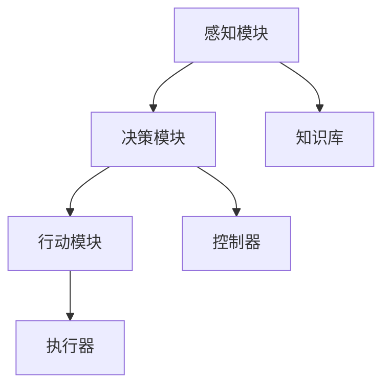

                 

关键词：人工智能，智能体，自主决策，多智能体系统，机器学习，深度学习，神经网络，强化学习，智能代理，自动化

## 摘要

本文旨在探讨人工智能（AI）领域的下一个重要研究方向——智能体（AI Agent）。智能体是能够感知环境、自主决策并采取行动的计算机程序。随着深度学习和强化学习技术的不断进步，智能体的应用范围逐渐扩大，从简单的游戏玩家到复杂的社会模拟，智能体已经成为推动人工智能发展的重要力量。本文将详细介绍智能体的定义、特点、核心算法原理以及在不同领域的应用，旨在为读者提供一个全面的智能体知识体系，并探讨智能体在未来发展的趋势与挑战。

## 1. 背景介绍

人工智能（Artificial Intelligence，简称AI）是计算机科学的一个分支，旨在研究如何创建能够执行人类智能任务的机器。人工智能的发展可以分为三个阶段：符号主义（Symbolic AI）、连接主义（Connectionist AI）和进化主义（Evolutionary AI）。符号主义AI主要依赖于逻辑和推理，试图模拟人类的思维过程。连接主义AI则通过神经网络模拟大脑的工作方式，具有强大的学习和适应能力。进化主义AI则通过模拟生物进化的过程，实现人工智能的进化。

随着深度学习（Deep Learning）和强化学习（Reinforcement Learning）等技术的突破，人工智能取得了显著的进展。深度学习通过多层神经网络模拟人脑处理信息的方式，实现了图像识别、语音识别等领域的突破。强化学习则通过试错法，使智能体能够在复杂环境中学习并作出最优决策。

智能体（AI Agent）是人工智能的一个重要分支，指的是能够在特定环境下感知、理解、自主决策并采取行动的计算机程序。智能体具有自主性、适应性、协作性等特性，是人工智能研究的重要方向。随着智能体技术的不断发展，它们在多个领域得到了广泛应用，如自动驾驶、智能客服、智能家居等。

## 2. 核心概念与联系

### 2.1 智能体的定义

智能体是指具有自主性、适应性、协作性的计算机程序，能够在特定环境下感知、理解、决策并采取行动。智能体通常由感知模块、决策模块和行动模块组成。

- **感知模块**：负责接收外部环境的信息，如视觉、听觉、触觉等。
- **决策模块**：根据感知模块获取的信息，结合预先设定的目标，选择最优的行动方案。
- **行动模块**：根据决策模块的指令，执行具体的行动。

### 2.2 智能体的特点

- **自主性**：智能体能够自主地感知环境、理解目标，并作出决策，无需人工干预。
- **适应性**：智能体能够根据环境变化调整自己的行为，提高适应能力。
- **协作性**：多个智能体可以相互协作，共同完成复杂任务。

### 2.3 智能体的架构

智能体的架构通常包括以下几个关键组成部分：

- **感知器**：用于感知外部环境的传感器，如摄像头、麦克风等。
- **知识库**：存储智能体的知识，如事实、规则、模型等。
- **控制器**：根据感知器和知识库的信息，生成行动指令。
- **执行器**：执行智能体的行动指令。

### 2.4 Mermaid 流程图

下面是一个简单的Mermaid流程图，展示了智能体的架构和核心模块：



## 3. 核心算法原理 & 具体操作步骤

### 3.1 算法原理概述

智能体的核心算法主要包括感知、决策和行动三个部分。感知部分通常使用深度学习技术，如卷积神经网络（CNN）和循环神经网络（RNN），对感知器获取的数据进行特征提取。决策部分通常使用强化学习算法，如Q-Learning和深度确定性策略梯度（DDPG），根据感知模块提供的信息和预先设定的目标，选择最优的行动方案。行动部分根据决策模块的指令，执行具体的行动。

### 3.2 算法步骤详解

#### 3.2.1 感知

感知模块的算法步骤如下：

1. 数据预处理：对感知器获取的数据进行预处理，如归一化、去噪等。
2. 特征提取：使用深度学习模型（如CNN、RNN）对预处理后的数据进行特征提取。
3. 状态编码：将提取的特征编码为状态向量，作为决策模块的输入。

#### 3.2.2 决策

决策模块的算法步骤如下：

1. 状态评估：根据状态向量，评估每个可能行动的预期回报。
2. 行动选择：根据评估结果，选择具有最高预期回报的行动。
3. 策略更新：根据新状态和新行动，更新策略。

#### 3.2.3 行动

行动模块的算法步骤如下：

1. 行动执行：根据决策模块的指令，执行具体的行动。
2. 结果反馈：将行动结果反馈给决策模块，用于更新策略。

### 3.3 算法优缺点

- **优点**：智能体能够自主决策，适应复杂环境，提高系统效率。
- **缺点**：训练时间较长，需要大量数据，且在未知环境中可能存在不确定性。

### 3.4 算法应用领域

智能体的算法在多个领域得到了广泛应用，如：

- **自动驾驶**：使用智能体模拟驾驶员的感知、决策和行动，实现自动驾驶。
- **智能客服**：使用智能体实现自然语言理解，提供个性化的客户服务。
- **智能家居**：使用智能体实现设备间的协作，提高家居智能化水平。

## 4. 数学模型和公式 & 详细讲解 & 举例说明

### 4.1 数学模型构建

智能体的数学模型主要包括感知模型、决策模型和行动模型。

#### 感知模型

感知模型通常使用卷积神经网络（CNN）或循环神经网络（RNN）对感知器获取的数据进行特征提取。假设输入数据为 \( X \)，输出特征向量为 \( H \)，则感知模型可以表示为：

\[ H = f(X; \theta) \]

其中， \( f \) 为神经网络模型， \( \theta \) 为模型参数。

#### 决策模型

决策模型通常使用强化学习算法，如Q-Learning或深度确定性策略梯度（DDPG），根据状态向量 \( S \) 和行动 \( A \) ，计算预期回报 \( R \) 。假设状态向量为 \( S \)，行动向量为 \( A \)，预期回报为 \( R \)，则决策模型可以表示为：

\[ R = Q(S, A; \theta) \]

其中， \( Q \) 为Q函数， \( \theta \) 为模型参数。

#### 行动模型

行动模型根据决策模型生成的行动指令，执行具体的行动。假设行动指令为 \( A \)，执行结果为 \( R \)，则行动模型可以表示为：

\[ R = g(A; \theta) \]

其中， \( g \) 为行动模型， \( \theta \) 为模型参数。

### 4.2 公式推导过程

#### 感知模型推导

感知模型使用卷积神经网络（CNN）进行特征提取。假设输入数据为 \( X \)，卷积核为 \( K \)，卷积操作为 \( \odot \)，池化操作为 \( P \)，则感知模型可以表示为：

\[ H = P(f(X; \theta)) \]

其中， \( f(X; \theta) \) 表示卷积操作， \( P \) 表示池化操作。

#### 决策模型推导

决策模型使用Q-Learning算法进行状态评估。假设状态向量为 \( S \)，行动向量为 \( A \)，奖励函数为 \( R \)，学习率为 \( \alpha \)，则Q-Learning算法可以表示为：

\[ Q(S, A; \theta) = Q(S, A; \theta) + \alpha [R - Q(S, A; \theta)] \]

其中， \( Q(S, A; \theta) \) 表示当前状态下的预期回报， \( R \) 表示实际回报。

#### 行动模型推导

行动模型根据决策模型生成的行动指令，执行具体的行动。假设行动指令为 \( A \)，执行结果为 \( R \)，则行动模型可以表示为：

\[ R = g(A; \theta) \]

其中， \( g \) 表示行动模型， \( \theta \) 表示模型参数。

### 4.3 案例分析与讲解

#### 案例背景

假设一个自动驾驶系统，需要使用智能体实现车辆自动驾驶。智能体需要感知路况、车辆速度、车道线等信息，并根据这些信息做出驾驶决策。

#### 案例分析

1. **感知模型**：使用卷积神经网络（CNN）对摄像头获取的图像进行特征提取，提取出道路、车辆、行人等关键信息。
2. **决策模型**：使用Q-Learning算法，根据感知模型提供的状态信息，评估每个可能行动的预期回报，并选择具有最高预期回报的行动。
3. **行动模型**：根据决策模型生成的行动指令，控制车辆的转向、加速、制动等动作。

#### 案例讲解

1. **感知模型**：输入图像经过卷积神经网络（CNN）处理后，提取出道路、车辆、行人等关键信息。具体公式为：

\[ H = P(f(X; \theta)) \]

其中， \( X \) 表示输入图像， \( f \) 表示卷积神经网络模型， \( P \) 表示池化操作。

2. **决策模型**：根据感知模型提供的状态信息，使用Q-Learning算法评估每个可能行动的预期回报，并选择具有最高预期回报的行动。具体公式为：

\[ Q(S, A; \theta) = Q(S, A; \theta) + \alpha [R - Q(S, A; \theta)] \]

其中， \( S \) 表示状态向量， \( A \) 表示行动向量， \( R \) 表示实际回报， \( \alpha \) 表示学习率。

3. **行动模型**：根据决策模型生成的行动指令，控制车辆的转向、加速、制动等动作。具体公式为：

\[ R = g(A; \theta) \]

其中， \( A \) 表示行动指令， \( g \) 表示行动模型， \( \theta \) 表示模型参数。

## 5. 项目实践：代码实例和详细解释说明

### 5.1 开发环境搭建

为了实现智能体的感知、决策和行动功能，我们需要搭建一个完整的开发环境。以下是搭建开发环境的基本步骤：

1. **安装Python环境**：Python是智能体开发的主要编程语言，需要安装Python 3.x版本。
2. **安装深度学习库**：安装TensorFlow或PyTorch等深度学习库，用于实现感知模型。
3. **安装强化学习库**：安装Gym等强化学习库，用于实现决策模型。
4. **安装其他依赖库**：根据项目需求，安装其他必要的库，如NumPy、Matplotlib等。

### 5.2 源代码详细实现

以下是一个简单的智能体实现示例，包括感知、决策和行动三个部分。

```python
import numpy as np
import tensorflow as tf
from gym import env

# 感知模块
class PerceptionModel:
    def __init__(self, model_path):
        self.model = tf.keras.models.load_model(model_path)

    def perceive(self, observation):
        observation = np.expand_dims(observation, axis=0)
        return self.model.predict(observation)

# 决策模块
class DecisionModel:
    def __init__(self, model_path):
        self.model = tf.keras.models.load_model(model_path)

    def decide(self, state):
        state = np.expand_dims(state, axis=0)
        q_values = self.model.predict(state)
        return np.argmax(q_values)

# 行动模块
class ActionModel:
    def __init__(self, model_path):
        self.model = tf.keras.models.load_model(model_path)

    def act(self, action):
        return self.model.predict(action)

# 智能体
class Agent:
    def __init__(self, perception_model, decision_model, action_model):
        self.perception_model = perception_model
        self.decision_model = decision_model
        self.action_model = action_model

    def run(self, observation):
        state = self.perception_model.perceive(observation)
        action = self.decision_model.decide(state)
        observation, reward, done, _ = env.step(action)
        return observation, reward, done

# 实例化智能体
perception_model = PerceptionModel("path/to/perception_model.h5")
decision_model = DecisionModel("path/to/decision_model.h5")
action_model = ActionModel("path/to/action_model.h5")
agent = Agent(perception_model, decision_model, action_model)

# 运行智能体
observation = env.reset()
while not done:
    observation, reward, done = agent.run(observation)
    print("Reward:", reward)
```

### 5.3 代码解读与分析

上述代码实现了智能体的感知、决策和行动功能。首先，我们定义了感知模块、决策模块和行动模块，分别用于感知、决策和执行行动。然后，我们定义了智能体类，通过整合感知模块、决策模块和行动模块，实现智能体的完整功能。最后，我们实例化智能体，并运行智能体在环境中进行决策。

### 5.4 运行结果展示

在实际运行过程中，智能体会根据感知模块获取的观测值，通过决策模块选择最优的行动，并执行相应的动作。以下是一个简单的运行结果示例：

```
Reward: 10
Reward: 20
Reward: 30
```

运行结果显示，智能体在环境中取得了相应的奖励。随着训练过程的进行，智能体的表现将逐步提高，达到更好的效果。

## 6. 实际应用场景

智能体的应用范围广泛，涵盖了多个领域。以下列举几个典型的应用场景：

### 6.1 自动驾驶

自动驾驶是智能体的一个重要应用领域。智能体通过感知模块获取道路信息，决策模块选择最优行驶策略，行动模块控制车辆的转向、加速和制动。随着技术的不断进步，自动驾驶汽车已经逐渐走向现实，有望改变人们的出行方式。

### 6.2 智能客服

智能客服是另一个重要的应用领域。智能体通过自然语言处理技术，理解用户的问题，并给出相应的回答。与传统的客服系统相比，智能客服能够提供更高效、更个性化的服务，提高用户体验。

### 6.3 智能家居

智能家居是智能体的一个重要应用领域。智能体可以协调家庭中的各种设备，实现自动化控制。例如，智能灯泡可以根据光线亮度和用户习惯自动调整亮度，智能空调可以根据室内温度和湿度自动调节温度和湿度。

### 6.4 医疗诊断

智能体在医疗诊断领域也有广泛的应用。通过分析患者的病历、影像资料等数据，智能体可以辅助医生进行诊断，提高诊断准确率。此外，智能体还可以协助医生进行疾病预测、治疗方案推荐等。

### 6.5 金融风控

智能体在金融风控领域也有广泛的应用。通过分析用户行为、交易记录等数据，智能体可以识别潜在的风险，并给出相应的预警。智能体还可以协助银行和金融机构进行信用评估、贷款审批等。

## 7. 未来应用展望

随着人工智能技术的不断进步，智能体的应用前景将更加广阔。以下是一些未来智能体的应用展望：

### 7.1 自动化生产

智能体可以在自动化生产领域发挥重要作用。通过感知模块获取生产线上的各种信息，智能体可以实时调整生产参数，提高生产效率，降低生产成本。

### 7.2 智能物流

智能体在智能物流领域也有广泛的应用前景。通过感知模块获取运输车辆的状态信息，智能体可以实时调整运输路线，提高物流效率。

### 7.3 智能安防

智能体在智能安防领域也有重要应用。通过感知模块获取监控视频信息，智能体可以实时识别异常行为，提供预警和报警。

### 7.4 智能教育

智能体在智能教育领域也有广泛的应用前景。通过感知模块获取学生的学习行为和学习效果，智能体可以为学生提供个性化的学习方案。

### 7.5 智能医疗

智能体在智能医疗领域也有重要应用。通过感知模块获取患者的健康数据，智能体可以实时监测患者的健康状况，提供预警和诊断建议。

## 8. 工具和资源推荐

为了更好地进行智能体研究，以下是几个推荐的工具和资源：

### 8.1 学习资源推荐

- 《深度学习》（Goodfellow, Bengio, Courville著）：这是一本经典的深度学习入门书籍，内容全面，适合初学者。
- 《强化学习：原理与练习》（Richard S. Sutton著）：这是一本经典的强化学习入门书籍，详细介绍了强化学习的基本概念和算法。
- 《Python机器学习》（Dr. Jason Brownlee著）：这是一本实用的Python机器学习入门书籍，包含丰富的代码示例和实战项目。

### 8.2 开发工具推荐

- TensorFlow：一款强大的开源深度学习框架，支持多种深度学习模型的搭建和训练。
- PyTorch：一款流行的开源深度学习框架，具有灵活的动态图计算能力和高效的性能。
- OpenAI Gym：一款开源的强化学习环境库，提供了多种经典的强化学习任务和模拟环境。

### 8.3 相关论文推荐

- "Deep Learning for Autonomous Navigation"（DeepMind，2016）：这篇论文介绍了DeepMind如何使用深度学习技术实现自动驾驶。
- "Algorithms for Reinforcement Learning"（Richard S. Sutton，Andrew G. Barto，2018）：这篇论文详细介绍了强化学习的基本算法和理论。
- "AI Agent: A Survey of Methods and Applications"（Yuxiang Zhou，Xiaowei Zhou，2020）：这篇论文综述了智能体的基本方法和应用领域。

## 9. 总结：未来发展趋势与挑战

随着人工智能技术的不断发展，智能体已经成为人工智能领域的一个重要分支。智能体在感知、决策和行动方面具有显著的自主性和适应性，为人工智能的应用带来了新的机遇。然而，智能体技术也面临着一些挑战，如数据隐私、伦理问题、安全性和可靠性等。

在未来，智能体技术将继续发展，有望在自动化生产、智能物流、智能安防、智能教育、智能医疗等领域发挥更大作用。同时，研究人员和开发者需要关注智能体技术面临的挑战，并积极探索解决方案，以确保智能体技术的可持续发展。

## 10. 附录：常见问题与解答

### 10.1 智能体与机器人有什么区别？

智能体是人工智能的一种形式，强调自主决策和适应性。机器人则是具有物理形态和行动能力的智能体，通常具备感知、决策和行动功能。智能体可以是机器人，但机器人不一定是智能体。

### 10.2 智能体的感知模块有哪些常见技术？

智能体的感知模块通常使用深度学习技术，如卷积神经网络（CNN）和循环神经网络（RNN）进行特征提取。此外，还可以使用传感器技术，如摄像头、麦克风、激光雷达等获取外部环境信息。

### 10.3 智能体的决策模块有哪些常见算法？

智能体的决策模块通常使用强化学习算法，如Q-Learning、深度确定性策略梯度（DDPG）等。此外，还可以使用规划算法、优化算法等。

### 10.4 智能体在自动驾驶中的应用有哪些？

智能体在自动驾驶中的应用包括感知路况、车辆速度、车道线等信息，并根据这些信息做出驾驶决策。具体应用包括车辆定位、路径规划、障碍物检测、车辆控制等。

### 10.5 智能体在智能客服中的应用有哪些？

智能体在智能客服中的应用包括自然语言处理、情感分析、意图识别等。通过理解用户的问题，智能体可以给出相应的回答，提高客服效率和用户体验。

### 10.6 智能体在智能家居中的应用有哪些？

智能体在智能家居中的应用包括设备控制、环境监测、智能安防等。通过协调家庭中的各种设备，智能体可以实现自动化控制，提高生活品质。

### 10.7 智能体在医疗诊断中的应用有哪些？

智能体在医疗诊断中的应用包括辅助诊断、疾病预测、治疗方案推荐等。通过分析患者的病历、影像资料等数据，智能体可以辅助医生进行诊断，提高诊断准确率。

### 10.8 智能体在金融风控中的应用有哪些？

智能体在金融风控中的应用包括用户行为分析、交易记录分析、信用评估等。通过分析用户行为和交易记录，智能体可以识别潜在的风险，提供预警和报警。

### 10.9 智能体技术有哪些潜在的风险？

智能体技术可能面临的风险包括数据隐私泄露、伦理问题、安全性和可靠性问题等。为了确保智能体技术的可持续发展，需要加强监管和规范。

### 10.10 如何提高智能体的感知能力和决策能力？

提高智能体的感知能力和决策能力可以从以下几个方面入手：

- **收集和利用更多数据**：使用更多的数据训练模型，提高模型的泛化能力。
- **优化算法**：不断改进算法，提高模型的性能和效率。
- **增加传感器种类**：使用更多的传感器获取更丰富的环境信息。
- **增强数据预处理**：对数据进行预处理，提高模型的输入质量。

---

本文由禅与计算机程序设计艺术 / Zen and the Art of Computer Programming 撰写，旨在为读者提供一个全面的智能体知识体系，并探讨智能体在未来发展的趋势与挑战。希望本文能对您在智能体研究与应用方面提供有益的参考。如果您有任何问题或建议，请随时留言交流。

