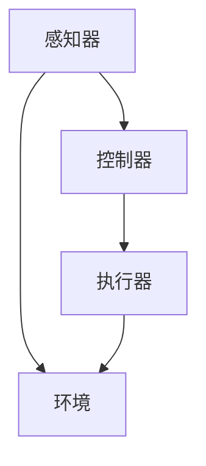

                 

关键词：AI Agent，自主决策，伦理界限，人工智能技术，未来趋势

> 摘要：本文深入探讨了AI Agent的概念及其在人工智能领域中的重要性。从背景介绍开始，逐步分析了AI Agent的核心概念与联系，详细阐述了其算法原理和数学模型，并通过具体的项目实践案例展示了其在实际应用中的效果。文章还探讨了AI Agent在实际应用场景中的潜力以及面临的伦理挑战，提出了未来发展的展望和解决思路。

## 1. 背景介绍

随着人工智能技术的飞速发展，AI Agent作为一个能够自主决策并执行任务的智能体，逐渐成为人工智能领域的研究热点。传统的程序和算法依赖于预定义的规则和数据，而AI Agent则能够通过学习和适应环境来自主做出决策，极大地提升了人工智能的灵活性和智能水平。

### AI Agent的定义

AI Agent，即人工智能代理，是一个能够感知环境、制定计划、执行行动并评估结果的智能系统。它通常由感知器、控制器和执行器三个主要部分组成。感知器负责收集环境信息，控制器基于感知信息做出决策，执行器则负责执行这些决策。

### AI Agent的发展历程

AI Agent的发展可以追溯到20世纪80年代的专家系统。专家系统通过规则库和推理机实现了对复杂问题的自动化解决。然而，专家系统在处理不确定性和动态环境时表现不佳。随着机器学习和深度学习的兴起，AI Agent开始利用大量数据进行训练，从而在自主决策能力上取得了重大突破。

### AI Agent的应用领域

AI Agent在各个领域都有着广泛的应用。在金融领域，AI Agent可以用于风险管理、股票交易和投资建议；在医疗领域，AI Agent可以辅助医生进行诊断、制定治疗方案和预测疾病趋势；在交通领域，AI Agent可以用于自动驾驶、交通流量管理和智能物流。

## 2. 核心概念与联系

### 感知器（Perceiver）

感知器是AI Agent的感知部分，负责从环境中收集数据。感知器可以是视觉、听觉、触觉等感官，也可以是传感器和互联网数据。感知器通过数据输入层将感知到的信息传递给控制器。

### 控制器（Controller）

控制器是AI Agent的决策部分，负责根据感知器的输入信息制定行动计划。控制器通常使用神经网络、决策树、强化学习等算法来处理数据并做出决策。控制器通过决策层将决策传递给执行器。

### 执行器（Actuator）

执行器是AI Agent的行动部分，负责执行控制器的决策。执行器可以是机械臂、自动驾驶汽车、机器人等。执行器通过行动层将决策转化为实际操作。

### Mermaid 流程图

下面是AI Agent的核心概念与联系的Mermaid流程图：



## 3. 核心算法原理 & 具体操作步骤

### 3.1 算法原理概述

AI Agent的核心算法通常基于强化学习、深度学习和监督学习等机器学习技术。强化学习通过奖励机制引导AI Agent不断优化其行为；深度学习利用神经网络对大量数据进行自动特征提取；监督学习则通过标注数据训练模型。

### 3.2 算法步骤详解

#### 3.2.1 感知环境

AI Agent首先使用感知器收集环境数据，如图像、语音、传感器读数等。

#### 3.2.2 数据预处理

收集到的数据需要进行预处理，包括去噪、标准化和特征提取等。

#### 3.2.3 训练模型

使用预处理后的数据训练模型，模型可以是神经网络、决策树或支持向量机等。

#### 3.2.4 做出决策

模型根据输入的数据做出决策，决策可以是行动、停止或切换策略等。

#### 3.2.5 执行决策

执行器根据决策执行相应的操作，如移动、发出指令等。

#### 3.2.6 评估结果

根据执行结果评估决策的效果，并将其作为反馈用于模型优化。

### 3.3 算法优缺点

#### 优点：

- **自主性**：AI Agent能够自主感知环境、制定计划和执行行动。
- **适应性**：通过学习，AI Agent能够适应不同的环境和任务。
- **灵活性**：AI Agent能够处理复杂、不确定的任务。

#### 缺点：

- **数据依赖**：AI Agent需要大量的数据来训练模型。
- **计算成本**：训练和运行AI Agent需要大量的计算资源。
- **解释性**：AI Agent的决策过程通常缺乏透明性，难以解释。

### 3.4 算法应用领域

AI Agent在各个领域都有着广泛的应用，如自动驾驶、智能客服、智能医疗和金融风险管理等。

## 4. 数学模型和公式 & 详细讲解 & 举例说明

### 4.1 数学模型构建

AI Agent的数学模型通常包括感知器模型、控制器模型和执行器模型。

#### 4.1.1 感知器模型

感知器模型通常使用感知器函数（Perceptron Function）来模拟。感知器函数是一个线性分类器，用于将输入数据映射到输出。

$$
f(x) = \text{sign}(w \cdot x + b)
$$

其中，\( w \) 是权重向量，\( x \) 是输入向量，\( b \) 是偏置项，\( \text{sign} \) 是符号函数。

#### 4.1.2 控制器模型

控制器模型通常使用神经网络来模拟。神经网络由多个层组成，包括输入层、隐藏层和输出层。每一层由多个神经元组成，神经元之间通过权重连接。

$$
y = \sigma(\sum_{i=1}^{n} w_i \cdot x_i + b)
$$

其中，\( \sigma \) 是激活函数，如Sigmoid函数或ReLU函数。

#### 4.1.3 执行器模型

执行器模型通常使用决策树或支持向量机（SVM）等模型来模拟。决策树通过分类规则对输入数据进行分类，SVM通过寻找最优超平面来实现分类。

### 4.2 公式推导过程

#### 4.2.1 感知器函数的推导

感知器函数是一种线性分类器，其基本原理是通过权重向量 \( w \) 和偏置项 \( b \) 来计算输入向量 \( x \) 的内积，并根据内积的符号来判断输入数据属于哪个类别。

首先，定义输入向量 \( x \) 和权重向量 \( w \)：

$$
x = [x_1, x_2, \ldots, x_n]^T
$$

$$
w = [w_1, w_2, \ldots, w_n]^T
$$

然后，计算输入向量 \( x \) 和权重向量 \( w \) 的内积：

$$
w \cdot x = w_1x_1 + w_2x_2 + \ldots + w_nx_n
$$

接着，加上偏置项 \( b \)：

$$
w \cdot x + b = w_1x_1 + w_2x_2 + \ldots + w_nx_n + b
$$

最后，通过符号函数 \( \text{sign} \) 判断输出：

$$
f(x) = \text{sign}(w \cdot x + b)
$$

#### 4.2.2 神经网络公式的推导

神经网络由多个层组成，每一层由多个神经元组成。神经元的计算过程如下：

首先，定义输入向量 \( x \) 和权重矩阵 \( W \)：

$$
x = [x_1, x_2, \ldots, x_n]^T
$$

$$
W = [w_{11}, w_{12}, \ldots, w_{1n}; w_{21}, w_{22}, \ldots, w_{2n}; \ldots; w_{m1}, w_{m2}, \ldots, w_{mn}]^T
$$

然后，计算输入向量 \( x \) 和权重矩阵 \( W \) 的点积：

$$
z = W \cdot x = w_{11}x_1 + w_{12}x_2 + \ldots + w_{1n}x_n; w_{21}x_1 + w_{22}x_2 + \ldots + w_{2n}x_n; \ldots; w_{m1}x_1 + w_{m2}x_2 + \ldots + w_{mn}x_n
$$

接着，加上偏置项 \( b \)：

$$
z' = z + b = w_{11}x_1 + w_{12}x_2 + \ldots + w_{1n}x_n + b_1; w_{21}x_1 + w_{22}x_2 + \ldots + w_{2n}x_n + b_2; \ldots; w_{m1}x_1 + w_{m2}x_2 + \ldots + w_{mn}x_n + b_m
$$

最后，通过激活函数 \( \sigma \) 计算输出：

$$
y = \sigma(z') = \text{sigmoid}(z') \text{ 或 } \text{ReLU}(z')
$$

### 4.3 案例分析与讲解

#### 4.3.1 自动驾驶

自动驾驶是AI Agent应用的一个重要领域。在自动驾驶中，AI Agent通过感知器收集道路、车辆和行人的信息，通过控制器做出行驶决策，并通过执行器控制车辆。

#### 4.3.2 智能客服

智能客服利用AI Agent处理客户的咨询和投诉。AI Agent通过感知器收集客户的问题和反馈，通过控制器生成回答，并通过执行器将回答发送给客户。

#### 4.3.3 智能医疗

智能医疗中的AI Agent可以辅助医生进行诊断和治疗。AI Agent通过感知器收集患者的病历和检查结果，通过控制器生成诊断结果和治疗建议，并通过执行器将结果和建议发送给医生。

## 5. 项目实践：代码实例和详细解释说明

### 5.1 开发环境搭建

为了进行AI Agent的项目实践，我们需要搭建一个合适的开发环境。以下是开发环境搭建的步骤：

#### 5.1.1 安装Python

首先，我们需要安装Python。可以从Python的官方网站（https://www.python.org/）下载并安装最新版本的Python。

#### 5.1.2 安装AI库

接下来，我们需要安装一些常用的AI库，如TensorFlow、PyTorch等。可以使用以下命令进行安装：

```
pip install tensorflow
pip install pytorch
```

#### 5.1.3 安装其他依赖

根据具体的项目需求，可能还需要安装其他依赖库，如NumPy、Pandas等。可以使用以下命令进行安装：

```
pip install numpy
pip install pandas
```

### 5.2 源代码详细实现

以下是一个简单的AI Agent示例，该示例使用Python和TensorFlow实现。

```python
import tensorflow as tf
import numpy as np

# 感知器模型
class Perceiver(tf.keras.Model):
    def __init__(self, input_shape):
        super(Perceiver, self).__init__()
        self.fc = tf.keras.layers.Dense(units=1, input_shape=input_shape)

    def call(self, inputs):
        return self.fc(inputs)

# 控制器模型
class Controller(tf.keras.Model):
    def __init__(self, input_shape):
        super(Controller, self).__init__()
        self.fc = tf.keras.layers.Dense(units=1, input_shape=input_shape)

    def call(self, inputs):
        return self.fc(inputs)

# 执行器模型
class Actuator(tf.keras.Model):
    def __init__(self, input_shape):
        super(Actuator, self).__init__()
        self.fc = tf.keras.layers.Dense(units=1, input_shape=input_shape)

    def call(self, inputs):
        return self.fc(inputs)

# AI Agent模型
class Agent(tf.keras.Model):
    def __init__(self, input_shape):
        super(Agent, self).__init__()
        self.perceiver = Perceiver(input_shape)
        self.controller = Controller(input_shape)
        self.actuator = Actuator(input_shape)

    def call(self, inputs):
        perception = self.perceiver(inputs)
        decision = self.controller(perception)
        action = self.actuator(decision)
        return action

# 初始化AI Agent
input_shape = (10,)
agent = Agent(input_shape)

# 训练AI Agent
x_train = np.random.random((1000, 10))
y_train = np.random.random((1000, 1))
agent.compile(optimizer='adam', loss='mse')
agent.fit(x_train, y_train, epochs=10)

# 预测
x_test = np.random.random((1, 10))
action = agent.predict(x_test)
print("预测行动：", action)
```

### 5.3 代码解读与分析

这段代码实现了一个简单的AI Agent，包括感知器、控制器和执行器。感知器负责感知输入数据，控制器基于感知数据做出决策，执行器执行决策。

#### 感知器（Perceiver）

感知器模型使用一个全连接层（Dense Layer）来将输入数据映射到输出。全连接层通过权重和偏置计算输入数据的线性组合，并通过激活函数（如Sigmoid函数）生成输出。

#### 控制器（Controller）

控制器模型也是一个全连接层，用于处理感知器的输出并生成决策。控制器同样通过权重和偏置计算输出，并通过激活函数生成最终的决策。

#### 执行器（Actuator）

执行器模型同样是一个全连接层，用于将控制器的决策映射到实际的操作。执行器通过权重和偏置计算输出，并直接生成操作命令。

#### AI Agent模型（Agent）

AI Agent模型将感知器、控制器和执行器整合在一起，形成一个完整的模型。在调用AI Agent时，首先通过感知器获取输入数据，然后通过控制器生成决策，最后通过执行器执行决策。

#### 训练与预测

代码中的训练和预测部分使用了TensorFlow的API。训练部分使用随机生成的输入数据和目标数据来训练AI Agent，预测部分使用随机生成的测试数据来预测行动。

## 6. 实际应用场景

AI Agent在实际应用中有着广泛的应用，以下是几个典型的应用场景：

### 6.1 自动驾驶

自动驾驶是AI Agent的一个典型应用场景。AI Agent通过感知车辆周围的环境，包括道路、交通信号、车辆和行人等，做出行驶决策，并控制车辆执行相应的操作。

### 6.2 智能客服

智能客服利用AI Agent处理客户的咨询和投诉。AI Agent通过感知客户的提问，理解问题并生成回答，然后通过执行器将回答发送给客户。

### 6.3 智能医疗

智能医疗中的AI Agent可以辅助医生进行诊断和治疗。AI Agent通过感知患者的病历和检查结果，分析数据并生成诊断结果和治疗建议，然后通过执行器将结果和建议发送给医生。

### 6.4 智能安防

智能安防中的AI Agent可以监控监控视频，识别异常行为并发出警报。AI Agent通过感知视频数据，分析场景并做出决策，然后通过执行器触发报警设备。

## 7. 工具和资源推荐

### 7.1 学习资源推荐

- 《深度学习》（Goodfellow, Bengio, Courville）: 该书是深度学习领域的经典教材，详细介绍了深度学习的理论和方法。
- 《强化学习》（Sutton, Barto）: 该书是强化学习领域的经典教材，系统地介绍了强化学习的理论基础和实践方法。
- 《Python机器学习》（Sebastian Raschka）: 该书介绍了Python在机器学习领域的应用，包括常用库和算法。

### 7.2 开发工具推荐

- TensorFlow: TensorFlow是一个开源的机器学习框架，提供了丰富的API和工具，支持深度学习和强化学习等算法。
- PyTorch: PyTorch是一个开源的深度学习框架，以其灵活性和动态计算图著称，广泛应用于各种机器学习任务。
- Keras: Keras是一个高级神经网络API，提供了简洁和易于使用的接口，可以与TensorFlow和PyTorch等框架结合使用。

### 7.3 相关论文推荐

- "Deep Learning for Autonomous Driving" (Cortes et al., 2015)
- "Reinforcement Learning: An Introduction" (Sutton, Barto, 2018)
- "A Theoretical Analysis of Deep Reinforcement Learning in Continuous Domains" (Haghani et al., 2018)
- "Unsupervised Learning of Visual Representations by Solving Jigsaw Puzzles" (Machado et al., 2020)

## 8. 总结：未来发展趋势与挑战

### 8.1 研究成果总结

AI Agent作为人工智能领域的一个重要研究方向，已经在自动驾驶、智能客服、智能医疗等领域取得了显著的成果。通过感知器、控制器和执行器的协同工作，AI Agent能够自主决策并执行任务，为人类提供了更加智能和高效的解决方案。

### 8.2 未来发展趋势

未来，AI Agent将在以下几个方面取得进一步的发展：

- **自主决策能力提升**：通过深度学习和强化学习等技术的进步，AI Agent的自主决策能力将得到显著提升，能够更好地处理复杂和不确定的任务。
- **跨领域应用**：随着AI Agent技术的成熟，其在不同领域的应用将更加广泛，从金融、医疗到工业、农业等各个领域都将受益于AI Agent的智能化解决方案。
- **人机协同**：AI Agent将更加注重与人类用户的协同工作，通过人机交互技术提高AI Agent的灵活性和适应性，实现更加自然和高效的人机协作。

### 8.3 面临的挑战

尽管AI Agent在人工智能领域展现出巨大的潜力，但在其发展过程中仍面临着一些挑战：

- **数据隐私和安全**：AI Agent在处理大量数据时，如何保护用户隐私和数据安全是一个重要问题。需要建立完善的数据隐私和安全机制，确保用户数据的隐私和安全。
- **伦理和道德问题**：随着AI Agent的自主决策能力提升，其决策过程和结果可能涉及伦理和道德问题。需要建立明确的伦理和道德标准，确保AI Agent的决策和行为符合人类价值观和社会规范。
- **计算资源和能耗**：训练和运行AI Agent需要大量的计算资源和能源。随着AI Agent应用的普及，如何降低计算资源和能耗的需求，实现绿色和可持续的发展，是一个重要课题。

### 8.4 研究展望

未来，AI Agent的研究将朝着以下几个方向发展：

- **多模态感知**：结合多种感知器，实现多模态感知，提高AI Agent对环境的感知能力和适应性。
- **强化学习与深度学习的结合**：通过将强化学习和深度学习相结合，提高AI Agent的决策能力和鲁棒性。
- **人机交互**：通过人机交互技术，实现更加自然和高效的人机协作，提高AI Agent的灵活性和适应性。

总之，AI Agent作为人工智能领域的一个热点研究方向，具有广阔的应用前景和巨大的发展潜力。通过不断的技术创新和跨学科合作，我们将有望实现更加智能、安全、高效的AI Agent，为人类社会带来更多的福祉。

## 9. 附录：常见问题与解答

### Q1. 什么是AI Agent？

A1. AI Agent，即人工智能代理，是一个能够自主感知环境、制定计划、执行行动并评估结果的智能系统。它通常由感知器、控制器和执行器三个主要部分组成，能够自主决策并执行任务。

### Q2. AI Agent有哪些应用领域？

A2. AI Agent在多个领域都有着广泛的应用，包括自动驾驶、智能客服、智能医疗、智能安防、金融风险管理等。随着人工智能技术的进步，AI Agent的应用领域将不断扩大。

### Q3. AI Agent的核心算法是什么？

A3. AI Agent的核心算法通常基于强化学习、深度学习和监督学习等机器学习技术。强化学习通过奖励机制引导AI Agent不断优化其行为；深度学习利用神经网络对大量数据进行自动特征提取；监督学习则通过标注数据训练模型。

### Q4. AI Agent如何处理不确定环境？

A4. AI Agent通过学习环境模型和利用强化学习算法来处理不确定环境。在不确定环境中，AI Agent会根据当前的状态和奖励信号不断调整其行为策略，从而提高在不确定环境中的适应能力。

### Q5. AI Agent如何保证决策的伦理和道德？

A5. AI Agent的决策过程需要遵循明确的伦理和道德标准。在设计和训练AI Agent时，需要考虑其决策可能带来的伦理和道德影响，并建立相应的约束机制。此外，需要通过人机协作和持续监督来确保AI Agent的决策符合人类价值观和社会规范。

### Q6. AI Agent如何保证数据隐私和安全？

A6. AI Agent在处理数据时需要严格遵循数据隐私和安全法规。在设计和实施AI Agent时，需要采用数据加密、隐私保护技术和访问控制机制，确保用户数据的隐私和安全。

### Q7. AI Agent的自主决策能力如何提升？

A7. AI Agent的自主决策能力可以通过以下方式提升：增加训练数据量、改进算法模型、引入多模态感知技术、结合人类专家的知识和经验等。通过不断优化AI Agent的模型和算法，可以提高其在复杂和不确定环境中的自主决策能力。

### Q8. AI Agent如何实现人机协作？

A8. AI Agent的人机协作可以通过以下方式实现：提供可视化界面和交互接口，使人类用户能够直观地了解AI Agent的决策过程；允许人类用户对AI Agent的决策进行干预和调整；通过自然语言处理技术实现人机对话，提高人机交互的效率和效果。

## 作者署名

作者：禅与计算机程序设计艺术 / Zen and the Art of Computer Programming

