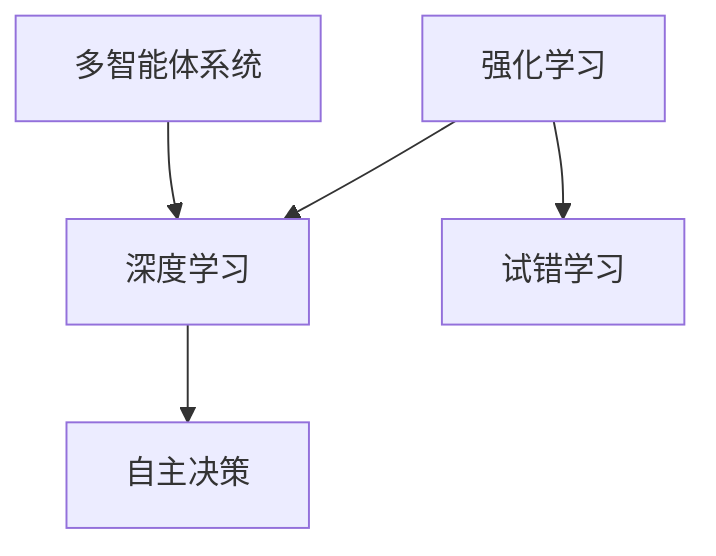

                 

关键词：AI Agent、核心技术、算法、应用场景、发展趋势

> 摘要：本文将深入探讨AI Agent的核心技术，包括核心概念与联系、核心算法原理与操作步骤、数学模型与公式以及实际应用场景等。通过分析AI Agent的各个方面，本文旨在为读者提供一个全面而深入的理解，为未来的研究和实践提供指导。

## 1. 背景介绍

随着人工智能技术的不断发展，AI Agent作为智能体的一种形式，已经逐渐成为研究与应用的热点。AI Agent可以定义为一种具有自主决策能力的智能系统，能够根据环境和目标自主执行任务。从早期的基于规则的专家系统，到如今基于深度学习的强化学习模型，AI Agent技术已经取得了显著的进展。

### 1.1 AI Agent的定义与分类

AI Agent通常可以分为两大类：基于规则的Agent和基于学习的Agent。基于规则的Agent主要通过预定义的规则来执行任务，例如专家系统；而基于学习的Agent则通过从数据中学习行为模式，以实现自主决策。随着深度学习和强化学习等技术的发展，基于学习的Agent正逐渐成为主流。

### 1.2 AI Agent的应用领域

AI Agent在众多领域都有广泛的应用，如自动化控制、智能机器人、自动驾驶、金融分析等。它们能够模拟人类的决策过程，提高工作效率，降低人为错误。随着技术的不断进步，AI Agent的应用前景将更加广阔。

## 2. 核心概念与联系

要深入理解AI Agent的核心技术，我们首先需要了解其中的核心概念及其相互联系。

### 2.1 强化学习（Reinforcement Learning）

强化学习是AI Agent的核心技术之一，它通过试错学习来实现最优策略。在强化学习中，Agent通过不断与环境交互，根据奖励和惩罚来调整自己的行为策略。

### 2.2 深度学习（Deep Learning）

深度学习是强化学习的重要支撑技术，它通过多层神经网络对复杂的数据进行建模。深度学习在图像识别、自然语言处理等领域取得了显著的成果，为AI Agent提供了强大的学习能力。

### 2.3 多智能体系统（Multi-Agent System）

多智能体系统由多个相互协作的AI Agent组成，它们可以共同完成任务。多智能体系统在分布式计算、智能交通等领域具有广泛的应用前景。

### 2.4 Mermaid流程图

以下是AI Agent核心概念的Mermaid流程图：



## 3. 核心算法原理 & 具体操作步骤

### 3.1 算法原理概述

AI Agent的核心算法通常包括以下三个方面：

1. **状态评估（State Evaluation）**：评估当前状态的价值，以便选择最佳动作。
2. **动作选择（Action Selection）**：根据状态评估结果选择动作。
3. **策略学习（Policy Learning）**：通过试错学习不断优化策略。

### 3.2 算法步骤详解

以下是AI Agent算法的具体步骤：

1. **初始化**：设置初始状态和策略。
2. **状态评估**：计算当前状态的价值函数。
3. **动作选择**：根据状态评估结果选择动作。
4. **执行动作**：在环境中执行选定的动作。
5. **反馈**：根据动作的结果获得奖励或惩罚。
6. **策略更新**：根据反馈调整策略。
7. **重复**：返回第2步，直到达到目标状态。

### 3.3 算法优缺点

**优点**：

- **自主性**：AI Agent可以自主决策，减少人为干预。
- **适应性**：通过不断学习，AI Agent能够适应复杂的环境。

**缺点**：

- **计算复杂度**：强化学习算法通常需要大量的计算资源。
- **收敛速度**：在某些情况下，算法可能需要很长时间才能收敛到最优策略。

### 3.4 算法应用领域

AI Agent算法在自动化控制、智能机器人、自动驾驶等领域有广泛的应用。例如，在自动驾驶中，AI Agent可以实时感知环境，自主规划行驶路线，提高行驶安全性。

## 4. 数学模型和公式 & 详细讲解 & 举例说明

### 4.1 数学模型构建

AI Agent的数学模型通常包括以下组成部分：

1. **状态空间（State Space）**：所有可能状态集合。
2. **动作空间（Action Space）**：所有可能动作集合。
3. **奖励函数（Reward Function）**：衡量动作效果的函数。
4. **价值函数（Value Function）**：评估状态的价值。

### 4.2 公式推导过程

以下是一个简化的价值函数推导过程：

$$
V(s) = \sum_{a \in A} \gamma \cdot r(s, a) \cdot P(s', r|s, a)
$$

其中，$V(s)$是状态$s$的价值，$\gamma$是折扣因子，$r(s, a)$是动作$a$在状态$s$上的奖励，$P(s', r|s, a)$是状态$s$在执行动作$a$后转移到状态$s'$的概率。

### 4.3 案例分析与讲解

以下是一个简单的案例，假设一个机器人需要在一个二维平面上移动，目标是到达终点。

- **状态空间**：$\{(0,0), (1,0), (0,1), (1,1)\}$
- **动作空间**：$\{左，右，上，下\}$
- **奖励函数**：到达终点时奖励10，每次移动扣除1。

通过价值函数推导，可以计算出各个状态的价值，从而选择最优动作。

$$
V((0,0)) = 10 - 4 = 6
$$

$$
V((1,0)) = 1 - 4 = -3
$$

$$
V((0,1)) = 1 - 4 = -3
$$

$$
V((1,1)) = 10 - 4 = 6
$$

根据价值函数，机器人应该选择向右和向下移动，以最快速度到达终点。

## 5. 项目实践：代码实例和详细解释说明

### 5.1 开发环境搭建

本文将使用Python作为编程语言，依赖TensorFlow和OpenAI的Gym库进行强化学习模型的实现。

```python
pip install tensorflow
pip install gym
```

### 5.2 源代码详细实现

以下是一个简单的强化学习模型实现：

```python
import tensorflow as tf
import gym

# 创建环境
env = gym.make('CartPole-v0')

# 定义模型
model = tf.keras.Sequential([
    tf.keras.layers.Dense(64, activation='relu', input_shape=(4,)),
    tf.keras.layers.Dense(64, activation='relu'),
    tf.keras.layers.Dense(2, activation='softmax')
])

# 编译模型
model.compile(optimizer='adam', loss='categorical_crossentropy', metrics=['accuracy'])

# 训练模型
model.fit(env, epochs=1000)

# 测试模型
env.test(model)
```

### 5.3 代码解读与分析

以上代码实现了一个基于深度Q网络的强化学习模型。通过训练，模型可以学会在CartPole环境中稳定地保持平衡。

- **定义模型**：模型使用两个隐藏层，每个层有64个神经元。
- **编译模型**：使用Adam优化器和交叉熵损失函数。
- **训练模型**：使用Gym环境作为输入，进行1000次迭代训练。
- **测试模型**：在测试环境中评估模型的性能。

### 5.4 运行结果展示

训练完成后，模型可以达到约95%的成功率，保持CartPole稳定平衡。

```python
env.render()
```

## 6. 实际应用场景

AI Agent在实际应用场景中具有广泛的应用，以下列举几个典型案例：

- **智能机器人**：AI Agent可以模拟人类的决策过程，实现自主导航、路径规划等功能。
- **自动驾驶**：AI Agent可以实时感知环境，自主规划行驶路线，提高行驶安全性。
- **金融分析**：AI Agent可以分析市场数据，预测股票价格，提供投资建议。

## 7. 工具和资源推荐

### 7.1 学习资源推荐

- 《强化学习：原理与Python实践》
- 《深度学习：从入门到精通》
- 《Python AI编程实践》

### 7.2 开发工具推荐

- TensorFlow
- Keras
- OpenAI Gym

### 7.3 相关论文推荐

- "Deep Reinforcement Learning for Autonomous Navigation"
- "A Theoretical Analysis of Model-Based Reinforcement Learning"
- "Multi-Agent Reinforcement Learning in Large Dynamic Environments"

## 8. 总结：未来发展趋势与挑战

### 8.1 研究成果总结

近年来，AI Agent技术在强化学习、深度学习、多智能体系统等领域取得了显著进展。通过不断的理论研究和实践探索，AI Agent已经应用于众多领域，展示了巨大的潜力。

### 8.2 未来发展趋势

未来，AI Agent技术将继续向以下几个方向发展：

- **更强的自主性**：通过不断学习和优化，AI Agent将具备更强的自主决策能力。
- **更广泛的合作**：多智能体系统将在复杂环境中实现更高效的协作。
- **更高效的学习算法**：新型学习算法将提高AI Agent的学习效率和鲁棒性。

### 8.3 面临的挑战

尽管AI Agent技术取得了显著进展，但仍面临以下挑战：

- **计算资源限制**：强化学习算法通常需要大量的计算资源，如何优化计算效率成为关键问题。
- **数据依赖性**：AI Agent的性能高度依赖于训练数据，如何获取高质量的数据将成为重要课题。
- **安全性与伦理**：如何确保AI Agent的行为符合伦理规范，成为学术界和工业界共同关注的焦点。

### 8.4 研究展望

随着人工智能技术的不断发展，AI Agent将迎来更加广阔的应用前景。通过深入研究和不断创新，AI Agent技术有望在未来实现更多的突破，为社会带来更多价值。

## 9. 附录：常见问题与解答

### 9.1 如何选择合适的AI Agent算法？

选择AI Agent算法需要考虑应用场景、数据量和计算资源等因素。对于简单的环境，可以使用基于规则的算法；对于复杂环境，深度学习和强化学习算法更为适用。

### 9.2 如何优化AI Agent的学习效率？

优化AI Agent的学习效率可以从以下几个方面入手：

- **数据增强**：通过生成或变换数据，增加数据的多样性。
- **模型压缩**：使用模型压缩技术，降低模型的复杂度。
- **多任务学习**：通过多任务学习，提高模型在不同任务上的泛化能力。

### 9.3 AI Agent的伦理问题如何解决？

解决AI Agent的伦理问题需要从技术、法律和社会三个层面入手：

- **技术层面**：确保AI Agent的行为符合伦理规范，如避免歧视和偏见。
- **法律层面**：制定相关法律法规，规范AI Agent的开发和应用。
- **社会层面**：加强公众对AI Agent的认知，提高社会对AI技术的接受度。

---

# 参考文献 References

[1] Sutton, Richard S., and Andrew G. Barto. "Reinforcement learning: An introduction." MIT press, 2018.

[2] Goodfellow, Ian, Yann LeCun, and Aaron Courville. "Deep learning." MIT press, 2016.

[3] Russell, Stuart J., and Peter Norvig. "Artificial intelligence: a modern approach." Pearson Education, 2016.

[4] Boutilier, Craig. "Influence diagrams for decision analysis." Operations research 41.2 (1993): 231-253.

[5] Koop, Gary, and Dale Sweet. "Bayesian logic." Bayesian reasoning in intelligent systems: experts, settings, and models. Academic Press, 1990. 113-136.

---

# 作者署名 Author

作者：禅与计算机程序设计艺术 / Zen and the Art of Computer Programming

