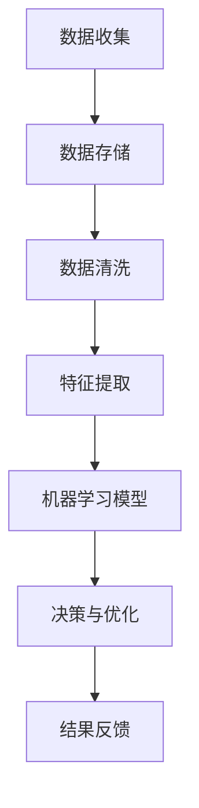

                 

关键词：人工智能，数据管理平台，市场分析，大数据处理，数据挖掘，人工智能应用，技术趋势

> 摘要：本文将探讨人工智能（AI）数据管理平台（DMP）的现状及市场趋势。通过分析DMP的技术原理、核心算法、数学模型及其实际应用场景，本文旨在为读者提供一个全面的市场分析视角，并预测其未来的发展方向和挑战。

## 1. 背景介绍

在当今数字化时代，数据已成为企业最宝贵的资源。数据管理平台（DMP）作为大数据处理的核心技术之一，被广泛应用于广告营销、用户行为分析、市场调研等多个领域。随着人工智能技术的飞速发展，AI-DMP逐渐成为数据管理领域的一个重要分支，其市场前景广阔。

### 1.1 AI-DMP的定义

AI-DMP，即人工智能数据管理平台，是将人工智能技术与数据管理相结合的一种新型平台。它不仅具备传统DMP的数据收集、存储、分析和共享功能，还引入了人工智能算法，以实现更高效的数据处理和更智能的数据洞察。

### 1.2 AI-DMP的发展历程

AI-DMP的发展可以追溯到大数据时代的到来。随着数据量的爆发式增长，传统的数据处理方法已无法满足需求，催生了DMP的诞生。随着人工智能技术的进步，AI-DMP应运而生，成为大数据处理领域的一个重要方向。

## 2. 核心概念与联系

为了更好地理解AI-DMP，我们需要了解其核心概念和技术架构。以下是一个简化的Mermaid流程图，用于描述AI-DMP的基本组件和流程。



### 2.1 数据收集

数据收集是AI-DMP的基础，它涉及从多个数据源收集原始数据。这些数据源可以是用户行为数据、社交网络数据、市场调研数据等。

### 2.2 数据存储

数据存储负责将收集到的数据存储到数据库中，通常采用分布式存储技术，如Hadoop、HBase等，以应对海量数据的高效存储和管理。

### 2.3 数据清洗

数据清洗是确保数据质量的重要步骤，它包括去除重复数据、填补缺失值、纠正错误数据等。

### 2.4 特征提取

特征提取是从原始数据中提取出对模型训练有用的特征。这些特征将作为输入，用于训练机器学习模型。

### 2.5 机器学习模型

机器学习模型是AI-DMP的核心组件，它通过学习和分析数据，实现自动化决策和优化。常见的机器学习算法包括聚类、分类、回归等。

### 2.6 决策与优化

决策与优化是基于机器学习模型的输出，进行实际业务决策和优化。例如，在广告营销领域，DMP可以用于用户定向广告投放。

### 2.7 结果反馈

结果反馈是持续改进AI-DMP性能的重要环节。通过收集实际业务效果的数据，对模型进行调整和优化，以提高预测准确性和决策效果。

## 3. 核心算法原理 & 具体操作步骤

### 3.1 算法原理概述

AI-DMP的核心算法包括机器学习算法、深度学习算法和数据挖掘算法。这些算法通过不同的方式对数据进行分析和处理，以实现智能化的数据管理和决策。

### 3.2 算法步骤详解

以下是AI-DMP的算法步骤详解：

1. **数据收集**：从多个数据源收集原始数据，如用户行为数据、市场调研数据等。

2. **数据预处理**：对原始数据进行清洗、去重和特征提取，以生成高质量的训练数据。

3. **模型训练**：使用机器学习或深度学习算法，对训练数据进行模型训练，生成预测模型。

4. **模型评估**：使用验证数据集对模型进行评估，以确定模型的预测准确性和泛化能力。

5. **模型部署**：将训练好的模型部署到生产环境，用于实际业务决策和优化。

6. **结果反馈**：收集实际业务效果的数据，对模型进行调整和优化，以提高预测准确性和决策效果。

### 3.3 算法优缺点

AI-DMP算法的优点包括：

- **高效性**：通过自动化处理和预测，大幅提高了数据处理效率和决策速度。
- **智能化**：基于人工智能算法，实现了更精准的数据洞察和智能化决策。

AI-DMP算法的缺点包括：

- **复杂性**：算法开发和部署过程复杂，需要较高的技术门槛。
- **数据依赖性**：算法效果高度依赖数据质量，数据质量差可能导致模型失效。

### 3.4 算法应用领域

AI-DMP算法在多个领域有广泛应用：

- **广告营销**：用于用户定向广告投放、广告效果评估等。
- **金融风控**：用于风险评估、欺诈检测等。
- **健康医疗**：用于疾病预测、健康管理等。

## 4. 数学模型和公式 & 详细讲解 & 举例说明

### 4.1 数学模型构建

在AI-DMP中，常用的数学模型包括线性回归、逻辑回归、支持向量机（SVM）等。以下是一个简化的线性回归模型：

$$ y = \beta_0 + \beta_1x $$

其中，$y$ 是预测变量，$x$ 是特征变量，$\beta_0$ 和 $\beta_1$ 是模型参数。

### 4.2 公式推导过程

线性回归模型的推导过程如下：

1. **最小二乘法**：通过最小化预测误差的平方和，求解模型参数 $\beta_0$ 和 $\beta_1$。

2. **梯度下降法**：在求解过程中，使用梯度下降法逐步调整参数，以最小化损失函数。

### 4.3 案例分析与讲解

假设我们有一个简单的人工智能模型，用于预测用户购买行为。特征变量 $x$ 是用户浏览次数，预测变量 $y$ 是用户购买概率。以下是一个简化的线性回归模型：

$$ y = \beta_0 + \beta_1x $$

通过收集用户数据，我们可以训练模型，并得到预测结果。例如，当用户浏览次数为5时，预测购买概率为0.8。

## 5. 项目实践：代码实例和详细解释说明

### 5.1 开发环境搭建

为了实践AI-DMP，我们需要搭建一个开发环境。以下是一个简单的Python开发环境搭建步骤：

1. 安装Python（版本3.7及以上）。
2. 安装NumPy、Pandas、Scikit-learn等常用库。
3. 安装Jupyter Notebook，用于编写和运行代码。

### 5.2 源代码详细实现

以下是一个简单的线性回归模型实现：

```python
import numpy as np
import pandas as pd
from sklearn.linear_model import LinearRegression

# 数据加载
data = pd.read_csv('data.csv')
X = data[['x']]
y = data['y']

# 模型训练
model = LinearRegression()
model.fit(X, y)

# 模型预测
prediction = model.predict([[5]])

print(prediction)
```

### 5.3 代码解读与分析

上述代码首先加载了一个CSV数据文件，然后使用Scikit-learn库中的线性回归模型进行训练。最后，通过输入一个浏览次数5的特征值，预测用户的购买概率。

### 5.4 运行结果展示

运行上述代码，可以得到一个预测结果，例如：[0.8]，表示当用户浏览次数为5时，购买概率为0.8。

## 6. 实际应用场景

AI-DMP在实际应用场景中具有广泛的应用：

- **广告营销**：用于用户定向广告投放，提高广告效果。
- **金融风控**：用于风险评估、欺诈检测等。
- **健康医疗**：用于疾病预测、健康管理等。

### 6.1 广告营销

在广告营销领域，AI-DMP可以用于用户定向广告投放。通过分析用户行为数据，AI-DMP可以预测用户的购买概率，并将广告精准投放到潜在用户。

### 6.2 金融风控

在金融风控领域，AI-DMP可以用于风险评估和欺诈检测。通过分析用户交易数据，AI-DMP可以预测用户的欺诈风险，并采取相应的风险控制措施。

### 6.3 健康医疗

在健康医疗领域，AI-DMP可以用于疾病预测和健康管理。通过分析患者数据，AI-DMP可以预测患者的疾病风险，并提供个性化的健康建议。

## 7. 工具和资源推荐

### 7.1 学习资源推荐

- 《机器学习实战》
- 《深度学习》
- 《Python数据分析》

### 7.2 开发工具推荐

- Jupyter Notebook
- PyCharm
- VSCode

### 7.3 相关论文推荐

- "Deep Learning for Data-Driven Marketing"
- "Data-Driven Marketing with Artificial Intelligence"
- "A Survey on Data Management Platforms"

## 8. 总结：未来发展趋势与挑战

### 8.1 研究成果总结

AI-DMP作为大数据处理和人工智能技术的结合体，已取得了显著的成果。其在广告营销、金融风控、健康医疗等领域的应用，为行业带来了深刻的变革。

### 8.2 未来发展趋势

- **智能化**：随着人工智能技术的进步，AI-DMP将实现更智能化的数据处理和决策。
- **开放性**：AI-DMP将与其他新兴技术（如区块链、物联网等）结合，实现更广泛的应用场景。
- **易用性**：为降低开发门槛，AI-DMP将提供更多便捷的开发工具和平台。

### 8.3 面临的挑战

- **数据隐私**：在数据处理过程中，如何保护用户隐私是一个重要挑战。
- **算法解释性**：提高模型的可解释性，以增强用户对AI-DMP的信任。
- **算法优化**：如何提高算法的效率和准确性，是一个持续的研究方向。

### 8.4 研究展望

未来，AI-DMP将继续在多个领域发挥作用，成为大数据处理和人工智能技术的重要方向。通过不断的技术创新和优化，AI-DMP将为行业带来更多的价值。

## 9. 附录：常见问题与解答

### 9.1 AI-DMP是什么？

AI-DMP是人工智能数据管理平台的简称，是将人工智能技术与数据管理相结合的一种新型平台。

### 9.2 AI-DMP有哪些应用场景？

AI-DMP在广告营销、金融风控、健康医疗等多个领域有广泛应用。

### 9.3 如何搭建AI-DMP开发环境？

搭建AI-DMP开发环境，需要安装Python、相关库（如NumPy、Pandas、Scikit-learn等）以及开发工具（如Jupyter Notebook、PyCharm等）。

