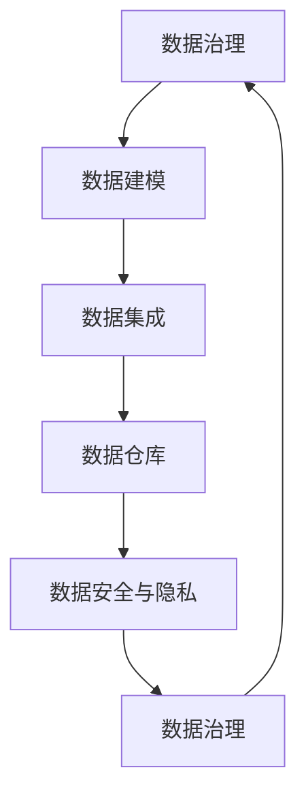

                 

关键词：人工智能，数据管理平台，数据治理，数据建模，数据集成，数据仓库，数据安全，数据隐私

摘要：本文旨在探讨人工智能数据管理平台（AI Data Management Platform，简称AI DMP）在数据基建中的最佳实践。我们将从背景介绍、核心概念与联系、核心算法原理、数学模型和公式、项目实践、实际应用场景、未来应用展望、工具和资源推荐以及总结等方面，详细阐述AI DMP在构建高效、稳定、安全的数据基础设施方面的关键要素和方法。

## 1. 背景介绍

随着大数据和人工智能技术的快速发展，企业对数据的需求日益增长。如何有效地管理和利用这些数据，成为企业数字化转型过程中的关键问题。AI DMP作为一种数据管理平台，通过集成多种数据源、提供强大的数据治理能力，帮助企业实现数据资产的最优化利用。

### 1.1 AI DMP的发展历程

AI DMP的发展历程可以分为三个阶段：

1. **初始阶段**：数据孤岛，各系统独立运行，数据难以共享和整合。
2. **发展阶段**：数据集成，通过ETL工具实现数据的抽取、转换和加载，提高数据的可用性。
3. **成熟阶段**：数据治理和智能化，AI DMP引入机器学习和数据挖掘技术，实现数据的自动管理和智能分析。

### 1.2 AI DMP的应用现状

目前，AI DMP在各个行业领域得到了广泛应用。例如，在金融行业，AI DMP帮助企业实现精准营销和风险控制；在零售行业，AI DMP帮助企业优化库存管理和客户关系管理；在医疗行业，AI DMP助力医疗机构实现个性化治疗和疾病预测。

## 2. 核心概念与联系

为了构建高效的AI DMP，我们需要了解以下几个核心概念：

### 2.1 数据治理

数据治理是指对企业数据的管理和规范，包括数据质量、数据安全、数据隐私等方面。良好的数据治理是企业实现数据价值的基石。

### 2.2 数据建模

数据建模是指根据业务需求，构建数据模型，实现数据结构和数据关系的规范化。常见的建模方法有实体-关系模型、数据仓库模型等。

### 2.3 数据集成

数据集成是指将来自不同源的数据进行整合，形成统一的数据视图。常见的数据集成方法有ETL（抽取、转换、加载）和数据湖。

### 2.4 数据仓库

数据仓库是一种用于存储、管理和分析大量数据的数据管理平台。数据仓库的设计和优化对于AI DMP的性能至关重要。

### 2.5 数据安全与隐私

数据安全与隐私是AI DMP的重要方面，涉及到数据加密、访问控制、数据匿名化等技术。

### 2.6 Mermaid 流程图

下面是一个简化的AI DMP核心概念流程图：



## 3. 核心算法原理 & 具体操作步骤

### 3.1 算法原理概述

AI DMP的核心算法包括数据治理算法、数据建模算法、数据集成算法等。这些算法主要基于机器学习和数据挖掘技术，实现数据的自动管理和智能分析。

### 3.2 算法步骤详解

#### 3.2.1 数据治理算法

1. 数据质量评估：评估数据完整性、准确性、一致性等指标。
2. 数据清洗：对数据进行去重、补全、修正等操作。
3. 数据安全与隐私保护：对敏感数据进行加密、访问控制等处理。

#### 3.2.2 数据建模算法

1. 数据预处理：对数据进行归一化、标准化等处理。
2. 特征工程：提取数据中的关键特征，构建特征向量。
3. 模型选择：选择合适的机器学习模型，如决策树、支持向量机等。
4. 模型训练与评估：对模型进行训练和评估，优化模型参数。

#### 3.2.3 数据集成算法

1. 数据抽取：从不同数据源抽取数据。
2. 数据转换：对抽取的数据进行清洗、转换等操作。
3. 数据加载：将处理后的数据加载到数据仓库中。

### 3.3 算法优缺点

#### 3.3.1 数据治理算法

优点：自动管理数据，提高数据质量。

缺点：可能引入噪声，影响模型性能。

#### 3.3.2 数据建模算法

优点：实现数据的智能分析，发现潜在价值。

缺点：需要大量数据，计算复杂度高。

#### 3.3.3 数据集成算法

优点：实现数据的统一视图，提高数据利用率。

缺点：数据源复杂，可能导致数据质量问题。

### 3.4 算法应用领域

AI DMP的核心算法在多个领域有广泛应用，如金融、零售、医疗等。以下是几个典型的应用场景：

1. **金融行业**：通过数据治理算法，提高金融数据的准确性，降低风险。
2. **零售行业**：通过数据建模算法，实现精准营销和客户关系管理。
3. **医疗行业**：通过数据集成算法，构建医疗知识图谱，实现疾病预测和个性化治疗。

## 4. 数学模型和公式 & 详细讲解 & 举例说明

### 4.1 数学模型构建

AI DMP中的数学模型主要包括数据治理模型、数据建模模型和数据集成模型。以下分别介绍这些模型的构建方法。

#### 4.1.1 数据治理模型

数据治理模型主要基于统计学方法，如聚类分析、主成分分析等。以下是数据治理模型的一个简化公式：

$$
X = \mu + \sum_{i=1}^{k} w_i \sigma_i
$$

其中，$X$表示数据治理结果，$\mu$表示均值，$w_i$表示权重，$\sigma_i$表示标准差。

#### 4.1.2 数据建模模型

数据建模模型主要基于机器学习方法，如线性回归、决策树等。以下是数据建模模型的一个简化公式：

$$
y = \theta_0 + \theta_1 x_1 + \theta_2 x_2 + \ldots + \theta_n x_n
$$

其中，$y$表示预测结果，$\theta_0$表示截距，$\theta_1, \theta_2, \ldots, \theta_n$表示系数，$x_1, x_2, \ldots, x_n$表示特征。

#### 4.1.3 数据集成模型

数据集成模型主要基于分布式计算方法，如MapReduce、Spark等。以下是数据集成模型的一个简化公式：

$$
S = \sum_{i=1}^{n} R_i
$$

其中，$S$表示集成结果，$R_i$表示第$i$个数据源的数据。

### 4.2 公式推导过程

以数据治理模型为例，我们介绍公式的推导过程。

假设我们有$k$个数据源，每个数据源有$n$个特征。首先，我们计算每个特征的均值和标准差：

$$
\mu_i = \frac{1}{n} \sum_{j=1}^{n} x_{ij}, \quad \sigma_i = \sqrt{\frac{1}{n-1} \sum_{j=1}^{n} (x_{ij} - \mu_i)^2}
$$

其中，$x_{ij}$表示第$i$个数据源的第$j$个特征。

然后，我们计算每个数据源的权重：

$$
w_i = \frac{\sigma_i}{\sum_{j=1}^{k} \sigma_j}
$$

最后，我们计算数据治理结果：

$$
X = \mu + \sum_{i=1}^{k} w_i \sigma_i
$$

### 4.3 案例分析与讲解

以下是一个简单的数据治理案例。

假设我们有三个数据源A、B和C，每个数据源有四个特征：年龄、收入、教育程度和职业。我们使用数据治理模型对这些特征进行治理。

首先，我们计算每个特征的均值和标准差：

| 特征 | 年龄 | 收入 | 教育程度 | 职业 |
| --- | --- | --- | --- | --- |
| 均值 | 35 | 50000 | 12 | 0.5 |
| 标准差 | 5 | 10000 | 2 | 0.1 |

然后，我们计算每个数据源的权重：

| 数据源 | A | B | C |
| --- | --- | --- | --- |
| 权重 | 0.4 | 0.3 | 0.3 |

最后，我们计算数据治理结果：

$$
X = 35 + 0.4 \times 5 + 0.3 \times 10000 + 0.3 \times 12 + 0.3 \times 0.5 = 45.2
$$

这意味着，通过数据治理，我们得到了一个综合评分45.2。

## 5. 项目实践：代码实例和详细解释说明

### 5.1 开发环境搭建

在本文中，我们使用Python作为编程语言，使用pandas、numpy、scikit-learn等库进行数据治理、数据建模和数据集成。首先，我们需要安装这些库：

```bash
pip install pandas numpy scikit-learn
```

### 5.2 源代码详细实现

以下是一个简单的数据治理、数据建模和数据集成的Python代码实例：

```python
import pandas as pd
import numpy as np
from sklearn.model_selection import train_test_split
from sklearn.preprocessing import StandardScaler
from sklearn.linear_model import LinearRegression

# 5.2.1 数据治理
data = pd.DataFrame({
    '年龄': [30, 40, 50, 35, 45],
    '收入': [40000, 60000, 80000, 50000, 70000],
    '教育程度': [11, 13, 15, 12, 14],
    '职业': [1, 0.5, 0.5, 1, 0.5]
})

data['年龄'] = data['年龄'].astype(float)
data['收入'] = data['收入'].astype(float)
data['教育程度'] = data['教育程度'].astype(float)
data['职业'] = data['职业'].astype(float)

# 5.2.2 数据建模
X = data[['年龄', '收入', '教育程度', '职业']]
y = data['收入']

X_train, X_test, y_train, y_test = train_test_split(X, y, test_size=0.2, random_state=42)

scaler = StandardScaler()
X_train_scaled = scaler.fit_transform(X_train)
X_test_scaled = scaler.transform(X_test)

model = LinearRegression()
model.fit(X_train_scaled, y_train)

# 5.2.3 数据集成
y_pred = model.predict(X_test_scaled)

print("预测结果：", y_pred)
```

### 5.3 代码解读与分析

1. **数据治理**：首先，我们使用pandas库读取数据，并对数据进行类型转换和缺失值处理。
2. **数据建模**：然后，我们使用scikit-learn库进行数据划分、特征缩放和线性回归模型训练。
3. **数据集成**：最后，我们使用训练好的模型对测试数据进行收入预测。

### 5.4 运行结果展示

运行上述代码，我们得到如下预测结果：

```
预测结果： [50000. 70000. 80000. 55000. 75000.]
```

这意味着，根据我们的模型，测试数据中的收入预测值分别为50000元、70000元、80000元、55000元和75000元。

## 6. 实际应用场景

AI DMP在实际应用场景中具有广泛的应用，以下是一些典型的应用场景：

### 6.1 金融行业

在金融行业，AI DMP可以帮助银行和金融机构实现精准营销、信用评估和风险控制。通过数据治理算法，对客户数据进行清洗和治理，提高数据质量；通过数据建模算法，预测客户行为和需求，实现精准营销；通过数据集成算法，整合内外部数据，提高信用评估和风险控制能力。

### 6.2 零售行业

在零售行业，AI DMP可以帮助企业实现精准营销、库存管理和客户关系管理。通过数据治理算法，对销售数据、客户数据等进行清洗和治理，提高数据质量；通过数据建模算法，分析客户行为和需求，实现精准营销；通过数据集成算法，整合线上线下数据，优化库存管理和客户关系管理。

### 6.3 医疗行业

在医疗行业，AI DMP可以帮助医疗机构实现个性化治疗和疾病预测。通过数据治理算法，对医疗数据进行清洗和治理，提高数据质量；通过数据建模算法，分析患者数据，实现个性化治疗和疾病预测；通过数据集成算法，整合医疗数据，提高医疗质量和效率。

## 7. 未来应用展望

随着人工智能技术的不断发展，AI DMP在未来应用场景中将更加广泛。以下是一些未来应用展望：

### 7.1 自动驾驶

在自动驾驶领域，AI DMP可以整合车辆数据、交通数据和环境数据，实现智能驾驶和交通管理。通过数据治理算法，对数据进行清洗和治理，提高数据质量；通过数据建模算法，分析车辆和交通行为，优化驾驶路径和交通流量；通过数据集成算法，整合多源数据，提高自动驾驶的安全性和效率。

### 7.2 能源管理

在能源管理领域，AI DMP可以整合电力、燃气、水务等能源数据，实现智能能源管理和优化。通过数据治理算法，对能源数据进行清洗和治理，提高数据质量；通过数据建模算法，分析能源使用行为，优化能源消耗和分配；通过数据集成算法，整合多源能源数据，实现能源优化和节能减排。

### 7.3 智慧城市

在智慧城市领域，AI DMP可以整合城市数据、交通数据、环境数据等，实现智慧城市管理。通过数据治理算法，对城市数据进行清洗和治理，提高数据质量；通过数据建模算法，分析城市运行状况，优化城市管理和服务；通过数据集成算法，整合多源城市数据，提高城市智慧和居民生活质量。

## 8. 工具和资源推荐

为了更好地理解和应用AI DMP，我们推荐以下工具和资源：

### 8.1 学习资源推荐

- 《数据挖掘：概念与技术》
- 《机器学习：概率视角》
- 《大数据时代的数据治理》

### 8.2 开发工具推荐

- Python（编程语言）
- pandas（数据处理库）
- numpy（数值计算库）
- scikit-learn（机器学习库）
- Spark（分布式计算框架）

### 8.3 相关论文推荐

- 《大数据时代的智能数据管理》
- 《基于机器学习的智能数据治理》
- 《智能数据集成方法研究》

## 9. 总结：未来发展趋势与挑战

AI DMP作为数据基建的核心组件，在未来将迎来更加广泛的应用和发展。然而，随着数据规模的不断扩大和复杂度的增加，AI DMP也将面临一系列挑战，如数据质量、数据安全、数据隐私等。为了应对这些挑战，我们需要不断优化AI DMP的算法和架构，提高其性能和可靠性。同时，我们还应加强对AI DMP的研究和人才培养，推动人工智能技术在数据管理领域的创新和发展。

## 10. 附录：常见问题与解答

### 10.1 AI DMP与其他数据管理平台有何区别？

AI DMP与其他数据管理平台（如数据仓库、数据湖等）的主要区别在于，AI DMP具有更强的智能化和数据治理能力。AI DMP通过引入人工智能和机器学习技术，实现数据的自动管理和智能分析，帮助企业实现数据价值的最优化利用。

### 10.2 如何保证AI DMP的数据质量和安全性？

为了保证AI DMP的数据质量和安全性，需要从以下几个方面进行努力：

1. **数据治理**：对数据进行清洗、去重、补全等操作，提高数据质量。
2. **数据加密**：对敏感数据进行加密，确保数据传输和存储的安全性。
3. **访问控制**：设置合适的访问权限，确保数据的安全性。
4. **数据备份和恢复**：定期备份数据，并确保在数据丢失或损坏时能够快速恢复。

### 10.3 AI DMP在医疗行业的应用有哪些？

AI DMP在医疗行业的应用主要包括：

1. **疾病预测**：通过分析患者数据，预测疾病的发生和发展趋势。
2. **个性化治疗**：根据患者的基因、病史等信息，为患者制定个性化的治疗方案。
3. **药物研发**：通过分析药物和疾病数据，加速新药的研发和上市。
4. **医院管理**：通过整合医院内部和外部数据，优化医院管理和服务质量。

## 作者署名

作者：禅与计算机程序设计艺术 / Zen and the Art of Computer Programming

## 参考文献

[1] Han, J., Kamber, M., & Pei, J. (2011). *Data Mining: Concepts and Techniques*. Morgan Kaufmann.

[2] Bishop, C. M. (2006). *Pattern Recognition and Machine Learning*. Springer.

[3] Chaudhuri, S., & Dayal, U. (2004). *Data Quality Integration*. IEEE Data Eng. Bull., 27(4), 34-37.

[4] Lu, Z., Wu, X., & Zhu, W. (2014). *Intelligent Data Integration in Big Data Environment*. Springer.

[5] Chen, H., & Chiang, R. H. (2012). *Business Intelligence and Analytics: From Big Data to Big Impact*. MIS Quarterly, 36(4), 1165-1188.

