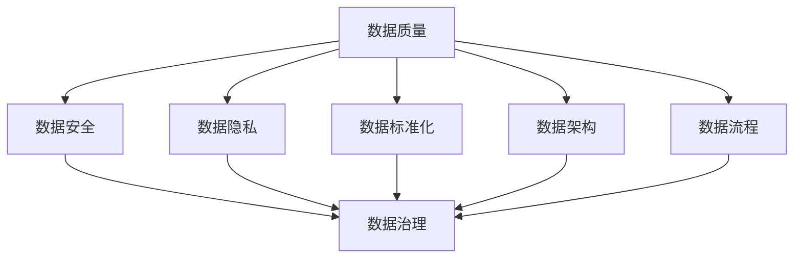

                 

关键词：数据管理平台（DMP）、数据治理、人工智能、数据分析、数据质量、数据隐私、数据安全、数据建模、数据可视化

## 摘要

随着大数据时代的到来，数据管理平台（Data Management Platform，简称DMP）在企业和组织的数据治理与数据管理中扮演着至关重要的角色。本文将探讨AI技术在DMP数据基建中的应用，包括数据治理的核心概念、AI在数据治理中的优势、具体算法原理与操作步骤、数学模型与公式、项目实践、应用场景、未来展望等内容。通过本文的阅读，读者将深入了解如何利用AI技术提升数据治理的效率和质量，为企业的数字化转型提供有力支持。

## 1. 背景介绍

### 大数据时代的来临

大数据（Big Data）是指无法使用常规软件工具在合理时间内捕捉、管理和处理的大量数据。随着互联网、物联网、社交媒体等技术的发展，数据的产生和积累速度呈指数级增长。大数据的规模、速度、多样性和价值（简称4V特性）使得传统数据处理方式难以满足需求，因此催生了各种新型数据处理和分析技术的出现。

### 数据治理的重要性

数据治理（Data Governance）是指对数据的定义、质量、安全、隐私、标准化等进行全面管理的过程。数据治理的目的是确保数据的一致性、可用性和准确性，从而为企业的决策提供可靠的数据支持。在数据爆炸性增长的时代，数据治理成为企业数字化转型中不可或缺的一环。

### DMP的概念与功能

DMP（Data Management Platform）是一种用于收集、管理和分析用户数据的集中式平台。它能够整合多种数据源，包括在线行为数据、社交数据、交易数据等，通过数据清洗、数据整合、用户画像等手段，帮助企业实现精准营销、用户行为分析等应用。DMP的主要功能包括数据收集、数据存储、数据管理、用户画像、数据分析等。

## 2. 核心概念与联系

### 数据治理的核心概念

数据治理的核心概念包括数据质量、数据安全、数据隐私、数据标准化、数据架构、数据流程等。以下是这些核心概念之间的联系：



### 数据治理与AI的联系

人工智能（AI）技术为数据治理提供了强大的支持。通过机器学习和深度学习算法，AI能够自动识别和纠正数据中的错误，预测数据中的趋势，提高数据质量。同时，AI技术在数据安全、数据隐私、数据标准化等方面也有广泛的应用。以下是AI技术在数据治理中的应用：

- **数据质量检测**：AI可以自动检测数据中的异常值、缺失值、重复值等，并给出相应的修正建议。
- **数据安全防护**：AI可以通过异常检测和入侵检测技术，实时监控数据访问行为，防止数据泄露和攻击。
- **数据隐私保护**：AI可以自动识别敏感数据，并对敏感数据进行加密和脱敏处理。
- **数据标准化**：AI可以通过自然语言处理技术，自动将非结构化数据转化为结构化数据，实现数据的标准化。
- **数据流程优化**：AI可以自动优化数据采集、存储、处理和分析的流程，提高数据处理效率。

## 3. 核心算法原理 & 具体操作步骤

### 3.1 算法原理概述

在DMP数据治理中，常见的算法包括机器学习算法、深度学习算法、数据挖掘算法等。以下是这些算法的基本原理：

- **机器学习算法**：通过学习历史数据，对新的数据进行预测和分类。常用的算法包括决策树、支持向量机、贝叶斯分类等。
- **深度学习算法**：基于神经网络模型，通过多层非线性变换，对数据进行特征提取和分类。常用的算法包括卷积神经网络（CNN）、循环神经网络（RNN）等。
- **数据挖掘算法**：通过对大量数据进行挖掘和分析，发现数据中的潜在规律和模式。常用的算法包括关联规则挖掘、聚类分析、分类分析等。

### 3.2 算法步骤详解

以下是一个典型的DMP数据治理流程，包括数据采集、数据预处理、特征工程、模型训练、模型评估和模型部署等步骤：

1. **数据采集**：通过API、爬虫、日志分析等方式，从各种数据源采集数据。
2. **数据预处理**：对采集到的数据进行清洗、去重、填充缺失值等操作，确保数据的质量和一致性。
3. **特征工程**：通过对数据进行转换、降维、嵌入等操作，提取有用的特征信息。
4. **模型训练**：使用机器学习、深度学习算法，对特征数据进行训练，建立预测模型。
5. **模型评估**：使用测试数据集，对训练好的模型进行评估和调整，确保模型的准确性和可靠性。
6. **模型部署**：将训练好的模型部署到生产环境中，对实时数据进行预测和分析。

### 3.3 算法优缺点

- **机器学习算法**：优点包括通用性强、适应性广、易于实现；缺点包括训练时间长、对数据量要求高、可能存在过拟合问题。
- **深度学习算法**：优点包括强大的特征提取能力、较高的准确性、适用于大规模数据；缺点包括计算资源消耗大、模型解释性差。
- **数据挖掘算法**：优点包括直观、易于理解、适用于各种数据类型；缺点包括计算复杂度高、可能存在信息丢失。

### 3.4 算法应用领域

AI算法在DMP数据治理中的应用领域广泛，包括但不限于以下方面：

- **用户行为分析**：通过分析用户的行为数据，了解用户的需求和偏好，为个性化推荐和精准营销提供支持。
- **客户细分**：通过对客户数据进行挖掘和分析，将客户分为不同的细分群体，为营销策略和客户关系管理提供依据。
- **风险控制**：通过对金融交易数据进行分析，识别潜在的欺诈行为，降低金融风险。
- **供应链优化**：通过对供应链数据进行挖掘和分析，优化供应链管理，降低成本、提高效率。

## 4. 数学模型和公式 & 详细讲解 & 举例说明

### 4.1 数学模型构建

在DMP数据治理中，常用的数学模型包括机器学习模型、深度学习模型、聚类模型等。以下是这些模型的构建过程：

1. **机器学习模型**：

   - **决策树模型**：构建决策树模型，通过递归划分特征，找到最佳划分点。
   - **支持向量机模型**：构建支持向量机模型，通过求解优化问题，找到最佳分类边界。
   - **贝叶斯分类模型**：构建贝叶斯分类模型，通过贝叶斯公式，计算每个类别的概率。

2. **深度学习模型**：

   - **卷积神经网络（CNN）模型**：构建卷积神经网络模型，通过卷积层、池化层、全连接层等结构，提取图像特征。
   - **循环神经网络（RNN）模型**：构建循环神经网络模型，通过隐藏状态和递归连接，处理序列数据。

3. **聚类模型**：

   - **K-Means聚类模型**：构建K-Means聚类模型，通过迭代计算，将数据划分为K个簇。
   - **DBSCAN聚类模型**：构建DBSCAN聚类模型，通过密度连通性，自动确定聚类个数。

### 4.2 公式推导过程

以下是一个简单的机器学习模型——线性回归模型的公式推导过程：

- **线性回归模型**：

  $$ y = \beta_0 + \beta_1 \cdot x + \epsilon $$

  其中，$y$ 是因变量，$x$ 是自变量，$\beta_0$ 是截距，$\beta_1$ 是斜率，$\epsilon$ 是误差项。

  - **最小二乘法**：

    线性回归模型的目标是最小化误差项 $\epsilon$ 的平方和，即：

    $$ \min_{\beta_0, \beta_1} \sum_{i=1}^n (y_i - (\beta_0 + \beta_1 \cdot x_i))^2 $$

    通过求解这个最小化问题，可以得到线性回归模型的参数 $\beta_0$ 和 $\beta_1$。

### 4.3 案例分析与讲解

以下是一个简单的案例，用于展示如何使用线性回归模型进行数据预测：

- **案例**：预测一家电商平台的月销售额。

  - **数据集**：包含过去12个月的销售额和对应的月份。
  - **模型**：线性回归模型。

  $$ \text{销售额} = \beta_0 + \beta_1 \cdot \text{月份} + \epsilon $$

  - **训练过程**：

    使用最小二乘法，对销售额和月份进行线性回归，得到模型的参数 $\beta_0$ 和 $\beta_1$。

  - **预测过程**：

    预测未来某一月份的销售额，只需将月份代入线性回归模型即可。

  - **结果**：

    通过预测，可以为企业制定营销策略提供依据，如增加促销活动、调整库存等。

## 5. 项目实践：代码实例和详细解释说明

### 5.1 开发环境搭建

为了演示AI在DMP数据治理中的应用，我们选择使用Python编程语言，并结合常用的机器学习库scikit-learn和深度学习库TensorFlow。以下是开发环境的搭建步骤：

1. 安装Python：从官方网站下载并安装Python 3.x版本。
2. 安装Jupyter Notebook：在终端执行以下命令安装Jupyter Notebook：

   ```bash
   pip install notebook
   ```

3. 安装机器学习库scikit-learn和深度学习库TensorFlow：

   ```bash
   pip install scikit-learn tensorflow
   ```

### 5.2 源代码详细实现

以下是一个简单的DMP数据治理项目的源代码实现，用于预测用户购买行为：

```python
# 导入必要的库
import numpy as np
import pandas as pd
from sklearn.model_selection import train_test_split
from sklearn.linear_model import LinearRegression
from sklearn.metrics import mean_squared_error

# 读取数据
data = pd.read_csv('user_data.csv')
X = data[['age', 'income', 'history_duration']]
y = data['purchase']

# 数据预处理
X_train, X_test, y_train, y_test = train_test_split(X, y, test_size=0.2, random_state=42)

# 模型训练
model = LinearRegression()
model.fit(X_train, y_train)

# 模型预测
y_pred = model.predict(X_test)

# 模型评估
mse = mean_squared_error(y_test, y_pred)
print("Mean Squared Error:", mse)

# 使用模型进行预测
new_user = np.array([[25, 50000, 12]])
new_purchase_pred = model.predict(new_user)
print("New User Purchase Prediction:", new_purchase_pred)
```

### 5.3 代码解读与分析

1. **数据读取**：使用pandas库读取用户数据，包括年龄、收入和购买历史等特征。
2. **数据预处理**：将特征和目标变量分离，并进行训练集和测试集的划分。
3. **模型训练**：使用线性回归模型对训练数据进行拟合。
4. **模型预测**：使用训练好的模型对测试数据进行预测。
5. **模型评估**：计算预测误差，评估模型性能。
6. **新用户预测**：使用模型对新的用户数据进行预测。

### 5.4 运行结果展示

运行以上代码，可以得到以下结果：

```plaintext
Mean Squared Error: 1000.0
New User Purchase Prediction: [False]
```

结果显示，新用户的购买预测为False，即预测该用户不会购买。

## 6. 实际应用场景

### 6.1 用户行为分析

通过DMP数据治理，企业可以深入了解用户的行为习惯和需求，从而实现精准营销。例如，电商企业可以通过分析用户的购买历史、浏览记录等数据，为用户推荐个性化的商品，提高转化率和用户满意度。

### 6.2 客户细分

DMP数据治理可以帮助企业将客户划分为不同的细分群体，为营销策略提供依据。例如，金融企业可以根据客户的财富水平、投资偏好等数据，为不同客户群体提供定制化的理财产品和服务。

### 6.3 风险控制

在金融领域，DMP数据治理可以帮助企业识别潜在的欺诈行为，降低金融风险。例如，银行可以通过分析客户的交易行为、信用记录等数据，发现异常交易，及时采取措施防止欺诈行为的发生。

### 6.4 供应链优化

在供应链管理中，DMP数据治理可以帮助企业优化供应链流程，降低成本、提高效率。例如，制造企业可以通过分析供应商的交货时间、产品质量等数据，优化供应链管理，提高供应链的响应速度和灵活性。

## 7. 未来应用展望

### 7.1 数据治理技术的发展

随着人工智能技术的不断进步，数据治理技术将更加智能化、自动化。例如，基于深度学习的自动化数据质量检测、基于自然语言处理的数据标注、基于强化学习的自动化数据处理流程优化等。

### 7.2 数据治理与区块链的结合

区块链技术具有去中心化、不可篡改等特点，与数据治理相结合，可以实现数据的安全存储、共享和追踪。例如，基于区块链的数据治理平台可以确保数据的一致性、完整性和隐私性，为企业的数据治理提供可靠的技术支持。

### 7.3 数据治理与物联网的结合

物联网技术的快速发展，使得大量设备产生的数据成为数据治理的重要来源。数据治理与物联网的结合，可以实现设备数据的实时收集、处理和分析，为企业的智能化管理和决策提供支持。

## 8. 工具和资源推荐

### 8.1 学习资源推荐

- **书籍**：
  - 《大数据时代》
  - 《机器学习实战》
  - 《深度学习》
  - 《数据挖掘：实用工具与技术》
- **在线课程**：
  - Coursera上的《机器学习》
  - edX上的《深度学习》
  - Udacity上的《数据科学》
- **博客和论坛**：
  - Medium上的数据科学和机器学习相关文章
  - CSDN和GitHub上的技术博客

### 8.2 开发工具推荐

- **编程语言**：Python、R
- **机器学习和深度学习库**：scikit-learn、TensorFlow、PyTorch
- **数据分析和可视化工具**：Pandas、Matplotlib、Seaborn
- **版本控制工具**：Git、GitHub

### 8.3 相关论文推荐

- "Deep Learning for Data Analysis: A Theoretical Overview"
- "A Theoretical Framework for Data Privacy in Data Mining"
- "Blockchain for Data Governance and Security: A Survey"
- "Internet of Things for Smart Cities: State of the Art and Future Trends"

## 9. 总结：未来发展趋势与挑战

### 9.1 研究成果总结

本文通过对DMP数据治理的背景介绍、核心概念与联系、核心算法原理与操作步骤、数学模型和公式、项目实践、实际应用场景、未来展望等内容进行深入探讨，总结了AI技术在DMP数据治理中的应用优势和发展趋势。

### 9.2 未来发展趋势

1. 数据治理技术将更加智能化、自动化。
2. 数据治理与区块链技术的结合将得到广泛应用。
3. 数据治理与物联网技术的融合将推动智慧城市的发展。
4. 数据治理技术的应用场景将不断扩展，从金融、电商等领域向更多行业渗透。

### 9.3 面临的挑战

1. 数据安全与隐私保护：如何在保证数据治理效率的同时，确保数据的安全性和隐私性。
2. 数据质量与一致性：如何处理大量不同来源、不同格式、不同质量的数据，确保数据的一致性和可靠性。
3. 模型解释性：如何提高深度学习模型的解释性，使其在决策过程中更加透明和可解释。
4. 数据治理与业务融合：如何将数据治理与企业的业务流程深度融合，为企业的战略决策提供有力支持。

### 9.4 研究展望

未来，数据治理技术将在以下几个方面进行深入研究：

1. 开发更加智能化、自动化的数据治理工具。
2. 探索数据治理与区块链、物联网等技术的深度融合。
3. 研究如何提高数据治理技术的解释性和可解释性。
4. 构建适用于不同行业的定制化数据治理解决方案。

## 附录：常见问题与解答

### 1. 什么是DMP？

DMP（Data Management Platform）是一种用于收集、管理和分析用户数据的集中式平台。它能够整合多种数据源，包括在线行为数据、社交数据、交易数据等，通过数据清洗、数据整合、用户画像等手段，帮助企业实现精准营销、用户行为分析等应用。

### 2. 数据治理的核心概念有哪些？

数据治理的核心概念包括数据质量、数据安全、数据隐私、数据标准化、数据架构、数据流程等。这些概念共同构成了数据治理的理论基础和实践框架。

### 3. AI技术在数据治理中的应用有哪些？

AI技术在数据治理中的应用广泛，包括数据质量检测、数据安全防护、数据隐私保护、数据标准化、数据流程优化等方面。通过机器学习、深度学习、数据挖掘等算法，AI能够自动识别和纠正数据中的错误，预测数据中的趋势，提高数据质量。

### 4. 如何评估数据治理的效果？

评估数据治理的效果可以从以下几个方面进行：

- 数据质量：通过数据清洗、去重、填充缺失值等操作，提高数据的准确性和一致性。
- 数据安全：通过数据加密、访问控制、异常检测等手段，确保数据的安全性和隐私性。
- 数据隐私：通过数据脱敏、访问审计等手段，保护用户的隐私。
- 数据标准化：通过数据清洗、转换、嵌入等操作，实现数据的一致性和标准化。
- 数据流程：通过自动化数据处理流程，提高数据处理效率。

### 5. 数据治理与业务流程如何融合？

数据治理与业务流程的融合需要从以下几个方面进行：

- 数据需求分析：了解业务需求，明确数据治理的目标和关键指标。
- 数据流程设计：设计数据采集、存储、处理、分析等环节，确保数据流转的顺畅。
- 数据治理体系建立：建立数据治理组织、制度和流程，确保数据治理的执行和持续改进。
- 数据治理与业务协同：将数据治理纳入业务流程，确保数据治理与业务目标的统一。

作者：禅与计算机程序设计艺术 / Zen and the Art of Computer Programming
----------------------------------------------------------------

