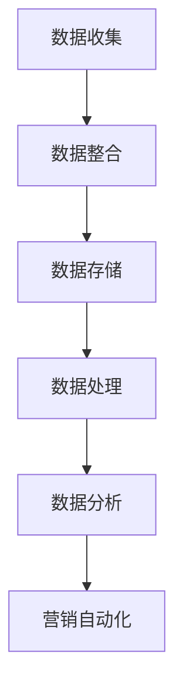

                 

关键词：AI、DMP、数据驱动营销、大数据分析、用户画像、客户关系管理、营销自动化

> 摘要：本文深入探讨了AI DMP（数据管理平台）在数据驱动营销中的应用与实践，通过案例分析，阐述了DMP如何助力企业实现精准营销、提升客户价值。文章将介绍DMP的核心概念、技术架构、算法原理，以及如何在具体项目中落地实施，为企业的数据驱动营销提供理论支持和实践指导。

## 1. 背景介绍

随着互联网的普及和大数据技术的发展，营销领域正经历着深刻的变革。传统营销模式越来越难以满足消费者个性化需求，而数据驱动营销则成为现代企业提升市场竞争力的重要手段。数据管理平台（DMP）作为一种新兴的营销技术，通过整合和分析海量用户数据，为企业提供精准的用户画像和营销策略支持，成为数据驱动营销的重要工具。

### 1.1 数据驱动营销的概念

数据驱动营销（Data-driven Marketing）是一种基于数据分析的现代营销方法，通过收集、整理和分析消费者行为数据，来制定和优化营销策略。其核心思想是以数据为核心，通过数据洞察来指导营销决策，从而提高营销效果和投资回报率。

### 1.2 DMP的基本原理

DMP（Data Management Platform）是一种数据管理技术，用于收集、整合和存储跨渠道的用户数据，为营销人员提供数据驱动的洞察和决策支持。DMP的主要功能包括：

- **数据收集**：从多个渠道（如网站、APP、社交媒体等）收集用户数据，包括行为数据、兴趣数据、地理位置数据等。
- **数据整合**：将来自不同来源的数据进行整合，创建统一的用户画像。
- **数据管理**：对用户数据进行分类、标签化和管理，以便后续的分析和营销使用。
- **数据分析**：利用数据分析和机器学习技术，对用户数据进行深入挖掘，以发现潜在价值和趋势。
- **营销自动化**：通过数据驱动的自动化工具，实现个性化营销和精准投放。

## 2. 核心概念与联系

### 2.1 核心概念

- **用户画像**：通过对用户数据的整合和分析，构建用户的基本属性、兴趣偏好、行为轨迹等多维度的画像。
- **客户关系管理（CRM）**：通过整合用户数据，建立和维护与客户的长期关系，以提高客户满意度和忠诚度。
- **营销自动化**：利用数据和算法，实现营销活动的自动化执行，提高效率和效果。

### 2.2 技术架构


- **数据收集层**：通过各种数据采集工具和API，从多个渠道收集用户数据。
- **数据整合层**：利用数据清洗和归一化技术，将分散的数据整合到一个统一的数据仓库中。
- **数据存储层**：使用分布式数据库和数据湖技术，存储海量用户数据。
- **数据处理与分析层**：利用大数据处理框架（如Hadoop、Spark）和机器学习算法，对用户数据进行分析和挖掘。
- **数据应用层**：通过DMP提供的API和SDK，将分析结果应用到营销自动化工具中，实现精准营销和个性化推荐。

### 2.3 Mermaid 流程图



## 3. 核心算法原理 & 具体操作步骤

### 3.1 算法原理概述

DMP中的核心算法主要包括用户行为分析、用户画像构建和推荐系统等。以下是这些算法的基本原理：

- **用户行为分析**：通过分析用户在网站或APP上的行为轨迹，挖掘用户的兴趣偏好和需求。
- **用户画像构建**：将用户的基本属性、兴趣偏好和行为数据进行整合，构建多维度的用户画像。
- **推荐系统**：利用协同过滤、基于内容的推荐等技术，为用户推荐个性化的商品或服务。

### 3.2 算法步骤详解

#### 3.2.1 用户行为分析

1. **数据收集**：收集用户在网站或APP上的行为数据，如点击、浏览、购买等。
2. **数据预处理**：对行为数据进行清洗、去重和归一化处理。
3. **行为分析**：利用机器学习算法（如决策树、随机森林等），对行为数据进行分类和分析，挖掘用户的兴趣偏好。
4. **行为可视化**：将分析结果以图表或报告的形式展示，帮助营销人员理解用户行为。

#### 3.2.2 用户画像构建

1. **数据整合**：将用户的基本属性数据（如年龄、性别、地域等）和行为数据整合到一个统一的数据源中。
2. **特征工程**：对整合后的数据进行特征提取和工程，如用户活跃度、消费能力等。
3. **用户标签化**：根据特征数据，为用户打上不同的标签，如“高消费能力”、“重度用户”等。
4. **用户画像构建**：将标签数据整合，形成多维度的用户画像。

#### 3.2.3 推荐系统

1. **数据预处理**：收集用户和商品的相关数据，如用户评分、购买记录、商品属性等。
2. **模型训练**：利用协同过滤、基于内容的推荐等技术，训练推荐模型。
3. **推荐结果生成**：根据用户画像和推荐模型，为用户生成个性化的推荐结果。
4. **推荐结果评估**：评估推荐结果的准确性和用户满意度，不断优化推荐算法。

### 3.3 算法优缺点

- **用户行为分析**：优点是可以实时分析用户行为，发现用户需求；缺点是数据量大，计算复杂度高。
- **用户画像构建**：优点是可以全面了解用户，提高营销精准度；缺点是数据整合和处理难度大，容易出现数据噪声。
- **推荐系统**：优点是可以提高用户满意度和购买转化率；缺点是推荐结果容易出现冷启动问题，对用户偏好理解不足。

### 3.4 算法应用领域

- **电子商务**：通过用户行为分析和推荐系统，实现个性化商品推荐和精准营销。
- **金融行业**：通过用户画像和风险分析，实现信用评估和风险控制。
- **广告营销**：通过DMP技术，实现广告投放的精准定位和效果优化。
- **医疗健康**：通过用户行为分析和健康数据，实现个性化健康管理和疾病预防。

## 4. 数学模型和公式 & 详细讲解 & 举例说明

### 4.1 数学模型构建

在DMP中，常用的数学模型包括线性回归、逻辑回归、协同过滤等。以下是这些模型的简要介绍和公式：

#### 4.1.1 线性回归

- **模型公式**：\( y = \beta_0 + \beta_1 x_1 + \beta_2 x_2 + ... + \beta_n x_n \)
- **解释**：线性回归模型通过拟合输入特征和输出结果之间的线性关系，来预测输出结果。

#### 4.1.2 逻辑回归

- **模型公式**：\( P(y=1) = \frac{1}{1 + e^{-(\beta_0 + \beta_1 x_1 + \beta_2 x_2 + ... + \beta_n x_n)}} \)
- **解释**：逻辑回归模型通过拟合输入特征和输出概率之间的非线性关系，来预测输出概率。

#### 4.1.3 协同过滤

- **模型公式**：\( r_{ij} = u_i + v_j + b + \langle u_i, v_j \rangle \)
- **解释**：协同过滤模型通过计算用户和物品之间的相似度，来预测用户对物品的评分。

### 4.2 公式推导过程

以线性回归模型为例，介绍其公式推导过程：

1. **目标函数**：最小化预测值与真实值之间的平方误差，即 \( \min \sum_{i=1}^{n} (y_i - \hat{y}_i)^2 \)。
2. **梯度下降**：对目标函数进行求导，得到梯度方向，即 \( \frac{\partial L}{\partial \beta} \)。
3. **迭代更新**：根据梯度方向更新模型参数，即 \( \beta = \beta - \alpha \frac{\partial L}{\partial \beta} \)，其中 \( \alpha \) 为学习率。

### 4.3 案例分析与讲解

假设我们有一组用户和商品的评分数据，通过线性回归模型预测用户对商品的评分。以下是具体的分析过程：

1. **数据准备**：收集用户和商品的评分数据，并进行预处理。
2. **模型训练**：使用线性回归模型训练数据集，得到模型参数。
3. **模型评估**：使用测试集评估模型性能，计算预测误差。
4. **模型优化**：根据评估结果，调整模型参数，优化模型性能。

## 5. 项目实践：代码实例和详细解释说明

### 5.1 开发环境搭建

在本项目中，我们使用Python作为编程语言，主要依赖以下库：

- **Pandas**：用于数据预处理和操作。
- **NumPy**：用于数学计算。
- **Scikit-learn**：用于机器学习算法。
- **Matplotlib**：用于数据可视化。

### 5.2 源代码详细实现

以下是用户行为分析的代码示例：

```python
import pandas as pd
from sklearn.model_selection import train_test_split
from sklearn.linear_model import LinearRegression
from sklearn.metrics import mean_squared_error

# 数据读取
data = pd.read_csv('user_behavior_data.csv')

# 数据预处理
X = data[['age', 'gender', 'income']]
y = data['rating']

# 数据拆分
X_train, X_test, y_train, y_test = train_test_split(X, y, test_size=0.2, random_state=42)

# 模型训练
model = LinearRegression()
model.fit(X_train, y_train)

# 模型评估
y_pred = model.predict(X_test)
mse = mean_squared_error(y_test, y_pred)
print(f'MSE: {mse}')

# 模型可视化
import matplotlib.pyplot as plt

plt.scatter(y_test, y_pred)
plt.xlabel('True Value')
plt.ylabel('Predicted Value')
plt.show()
```

### 5.3 代码解读与分析

- **数据读取**：使用Pandas库读取用户行为数据。
- **数据预处理**：对用户数据进行特征提取和归一化处理，为模型训练做准备。
- **数据拆分**：将数据集拆分为训练集和测试集，用于模型训练和评估。
- **模型训练**：使用线性回归模型对训练集进行训练。
- **模型评估**：使用测试集评估模型性能，计算预测误差。
- **模型可视化**：绘制预测结果和真实值的散点图，帮助理解模型性能。

### 5.4 运行结果展示

通过以上代码，我们可以得到用户行为分析的结果，包括预测误差和预测结果的散点图。预测误差可以衡量模型的准确性，散点图可以直观地展示模型的预测能力。

## 6. 实际应用场景

### 6.1 电子商务行业

在电子商务行业，DMP技术可以帮助企业实现个性化推荐和精准营销。通过分析用户行为数据，企业可以了解用户的兴趣偏好和购买习惯，从而为用户推荐符合其需求的商品，提高购买转化率和客户满意度。

### 6.2 广告营销行业

在广告营销行业，DMP技术可以帮助广告主实现精准投放和效果优化。通过整合用户数据，广告主可以了解目标受众的特征和行为，从而制定个性化的广告策略，提高广告投放的ROI。

### 6.3 金融行业

在金融行业，DMP技术可以帮助银行和保险公司实现客户关系管理和风险控制。通过分析用户数据，金融机构可以了解客户的金融需求和风险偏好，从而提供个性化的金融服务和风险预警。

### 6.4 医疗健康行业

在医疗健康行业，DMP技术可以帮助医疗机构实现个性化健康管理和疾病预防。通过分析患者数据，医疗机构可以了解患者的健康状态和疾病趋势，从而提供个性化的健康建议和预防措施。

## 7. 未来应用展望

随着人工智能和大数据技术的不断发展，DMP在数据驱动营销中的应用前景将更加广阔。以下是一些未来应用展望：

- **实时数据分析**：利用实时数据分析技术，实现实时监控和响应，提高营销效率和效果。
- **跨渠道整合**：整合线上线下数据，实现跨渠道的数据驱动营销，提高用户覆盖率和营销效果。
- **智能推荐系统**：利用深度学习等技术，构建更加智能的推荐系统，提高推荐准确性和用户体验。
- **隐私保护**：在保障用户隐私的前提下，实现数据的有效利用，提高数据的安全性和合规性。

## 8. 工具和资源推荐

### 8.1 学习资源推荐

- **《机器学习》**：周志华著，清华大学出版社
- **《大数据营销》**：李明凯著，电子工业出版社
- **《数据挖掘：概念与技术》**：赵世响著，机械工业出版社

### 8.2 开发工具推荐

- **Python**：适用于数据处理和机器学习的编程语言。
- **Pandas**：用于数据预处理和操作。
- **Scikit-learn**：用于机器学习算法。
- **TensorFlow**：用于深度学习。

### 8.3 相关论文推荐

- **《Collaborative Filtering for the Web》**：Netflix Prize 论文
- **《Leveraging Social Graph for Advertising》**：Google 专利
- **《Deep Learning for User Behavior Analysis》**：NIPS 2017 论文

## 9. 总结：未来发展趋势与挑战

随着大数据和人工智能技术的不断发展，DMP在数据驱动营销中的应用前景将更加广阔。未来，DMP技术将朝着更加智能化、实时化和个性化的方向发展，为企业的营销策略提供更加精准和高效的支持。然而，面临数据隐私保护和合规性的挑战，DMP技术需要不断优化和完善，以实现数据的有效利用和安全保障。

## 10. 附录：常见问题与解答

### 10.1 什么是DMP？

DMP（Data Management Platform）是一种数据管理技术，用于收集、整合和存储跨渠道的用户数据，为营销人员提供数据驱动的洞察和决策支持。

### 10.2 DMP的核心功能是什么？

DMP的核心功能包括数据收集、数据整合、数据管理、数据分析和营销自动化。

### 10.3 DMP如何实现精准营销？

DMP通过整合和分析海量用户数据，构建用户画像，实现精准的用户定位和个性化营销。

### 10.4 DMP技术面临哪些挑战？

DMP技术面临的主要挑战包括数据隐私保护、合规性、数据质量和实时性等。

### 10.5 DMP适合哪些行业？

DMP技术适用于电子商务、广告营销、金融、医疗健康等多个行业。

## 11. 作者署名

本文作者：禅与计算机程序设计艺术 / Zen and the Art of Computer Programming

