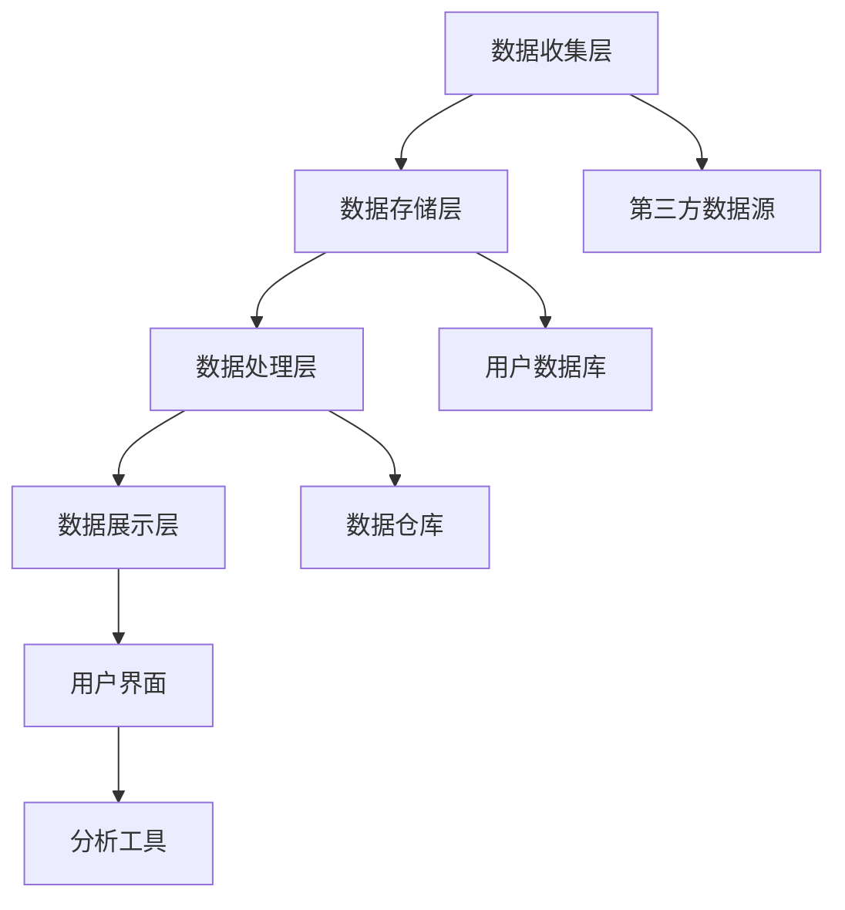

                 

关键词：AI，DMP，数据驱动，营销，数据分析，算法，大数据

摘要：本文深入探讨了AI驱动的数据管理平台（DMP）在数据驱动营销中的应用。通过介绍DMP的核心概念、架构、算法原理、数学模型、实际应用案例以及未来发展趋势，本文旨在为读者提供全面的技术视角，并解答在实际应用中可能遇到的问题。

## 1. 背景介绍

随着互联网的普及和信息技术的飞速发展，数据已经成为新时代最具价值的资产。数据驱动的营销策略正在逐渐取代传统的市场推广方式，成为企业竞争的新战场。数据管理平台（DMP）作为数据驱动营销的核心工具，近年来受到了广泛关注。本文将围绕AI驱动的DMP，探讨其在营销领域的应用与价值。

### 1.1 数据驱动营销的概念

数据驱动营销是指企业通过收集、整合和分析消费者数据，从而更好地理解消费者行为，优化营销策略，提高营销效果。其核心在于利用数据，实现精准定位和个性化营销。

### 1.2 DMP的定义与作用

DMP是一种用于收集、存储、管理和分析用户数据的平台。通过DMP，企业可以构建完整的消费者画像，实现跨渠道、跨设备的用户数据整合。DMP在数据驱动营销中的作用主要体现在以下几个方面：

1. **数据收集与整合**：DMP可以收集来自各种渠道的用户数据，包括在线行为、社交媒体活动、广告投放等，并对其进行整合。
2. **用户画像构建**：通过数据分析，DMP可以构建详细的用户画像，帮助企业了解消费者的需求、偏好和行为模式。
3. **精准营销**：基于用户画像，DMP可以帮助企业实现精准营销，提高营销ROI。
4. **营销自动化**：DMP可以与营销自动化工具结合，实现营销流程的自动化，提高营销效率。

## 2. 核心概念与联系

### 2.1 数据管理平台（DMP）的架构

DMP的架构通常包括数据收集层、数据存储层、数据处理层、数据展示层和用户界面。以下是一个简化的DMP架构示意图：



### 2.2 DMP与数据驱动营销的关系

DMP是数据驱动营销的核心基础设施。通过DMP，企业可以实现对用户数据的全面掌控，从而实现精准营销。具体来说，DMP与数据驱动营销的关系如下：

1. **数据收集**：DMP收集来自各种渠道的用户数据，包括在线行为、社交媒体活动、广告投放等。
2. **数据整合**：DMP将收集到的数据进行整合，构建完整的用户画像。
3. **数据分析**：DMP利用先进的数据分析技术，对用户行为进行深入分析，提取有价值的信息。
4. **数据应用**：基于用户画像和分析结果，DMP帮助企业制定精准的营销策略，并实现营销自动化。

## 3. 核心算法原理 & 具体操作步骤

### 3.1 算法原理概述

DMP的核心算法包括用户画像构建算法、协同过滤算法、行为预测算法等。以下是对这些算法的简要概述：

1. **用户画像构建算法**：通过数据挖掘和机器学习技术，对用户行为数据进行建模，提取用户特征，构建用户画像。
2. **协同过滤算法**：基于用户行为和偏好数据，通过计算相似度矩阵，为用户推荐个性化内容或产品。
3. **行为预测算法**：通过分析用户历史行为，预测用户的未来行为，帮助企业实现精准营销。

### 3.2 算法步骤详解

1. **用户画像构建算法**
   - 数据收集：收集用户在线行为、社交媒体活动、广告投放等数据。
   - 特征提取：对数据进行分析，提取用户特征，如年龄、性别、兴趣、行为等。
   - 画像构建：将提取的特征进行组合，构建完整的用户画像。

2. **协同过滤算法**
   - 建立用户-项目矩阵：将用户和项目（如商品、内容等）进行匹配，构建用户-项目矩阵。
   - 计算相似度矩阵：计算用户之间的相似度，构建相似度矩阵。
   - 推荐计算：根据用户-项目矩阵和相似度矩阵，为用户推荐个性化内容或产品。

3. **行为预测算法**
   - 数据预处理：对用户行为数据进行清洗、转换和预处理。
   - 特征工程：提取与用户行为相关的特征。
   - 模型训练：使用机器学习算法（如决策树、神经网络等）训练预测模型。
   - 预测评估：使用评估指标（如准确率、召回率等）评估预测模型的性能。
   - 预测应用：根据预测模型，预测用户的未来行为，帮助企业制定营销策略。

### 3.3 算法优缺点

1. **用户画像构建算法**
   - 优点：能够全面了解用户需求，实现精准营销。
   - 缺点：数据处理复杂，对算法和计算资源要求较高。

2. **协同过滤算法**
   - 优点：计算简单，推荐效果好。
   - 缺点：无法处理新用户或冷启动问题，易产生数据偏差。

3. **行为预测算法**
   - 优点：能够预测用户未来行为，提高营销效果。
   - 缺点：对数据质量要求较高，算法复杂度较高。

### 3.4 算法应用领域

1. **电子商务**：通过DMP，电商企业可以精准推荐商品，提高销售额。
2. **社交媒体**：通过DMP，社交媒体平台可以优化广告投放，提高广告效果。
3. **在线教育**：通过DMP，教育机构可以精准推送课程，提高用户转化率。
4. **金融领域**：通过DMP，金融机构可以识别潜在客户，实现精准营销。

## 4. 数学模型和公式 & 详细讲解 & 举例说明

### 4.1 数学模型构建

在DMP中，常用的数学模型包括用户画像模型、协同过滤模型和行为预测模型。以下是对这些模型的简要介绍：

1. **用户画像模型**
   - 用户画像模型是一种基于特征抽取和机器学习的模型，用于构建用户画像。
   - 模型公式：$$ U = f(W \cdot X) $$
     - $U$：用户画像向量
     - $W$：权重矩阵
     - $X$：用户特征向量

2. **协同过滤模型**
   - 协同过滤模型是一种基于用户-项目矩阵的模型，用于推荐个性化内容或产品。
   - 模型公式：$$ R_{ui} = \sum_{j \in N_i} w_{uj} \cdot r_{uj} $$
     - $R_{ui}$：用户$i$对项目$j$的评分
     - $w_{uj}$：用户$i$和用户$j$之间的相似度权重
     - $r_{uj}$：用户$i$对项目$j$的实际评分

3. **行为预测模型**
   - 行为预测模型是一种基于用户历史行为数据的模型，用于预测用户未来行为。
   - 模型公式：$$ P(y|X) = \sigma(\theta \cdot X) $$
     - $P(y|X)$：用户在特征向量$X$下的行为概率
     - $\sigma$： sigmoid 函数
     - $\theta$：模型参数

### 4.2 公式推导过程

1. **用户画像模型**
   - 特征提取：首先，对用户行为数据进行分析，提取用户特征，如年龄、性别、兴趣等。
   - 特征组合：将提取的特征进行组合，形成用户特征向量$X$。
   - 权重计算：使用机器学习算法，计算特征权重$W$。
   - 画像构建：将特征向量$X$和权重矩阵$W$相乘，得到用户画像向量$U$。

2. **协同过滤模型**
   - 建立用户-项目矩阵：将用户和项目进行匹配，建立用户-项目矩阵$R$。
   - 计算相似度矩阵：计算用户之间的相似度，构建相似度矩阵$W$。
   - 推荐计算：根据用户-项目矩阵$R$和相似度矩阵$W$，为用户计算推荐评分$R_{ui}$。

3. **行为预测模型**
   - 数据预处理：对用户历史行为数据进行分析，提取与行为相关的特征。
   - 特征工程：对提取的特征进行预处理和转换。
   - 模型训练：使用机器学习算法，训练行为预测模型，得到模型参数$\theta$。
   - 预测计算：根据模型参数$\theta$和用户特征向量$X$，计算用户的行为概率$P(y|X)$。

### 4.3 案例分析与讲解

以电子商务领域为例，假设某电商企业使用DMP进行用户画像构建和商品推荐。以下是具体案例：

1. **用户画像构建**
   - 特征提取：对用户行为数据进行特征提取，如用户年龄、性别、购买历史等。
   - 特征组合：将提取的特征进行组合，形成用户特征向量$X$。
   - 权重计算：使用机器学习算法，计算特征权重$W$。
   - 画像构建：将特征向量$X$和权重矩阵$W$相乘，得到用户画像向量$U$。

2. **商品推荐**
   - 建立用户-项目矩阵：将用户和商品进行匹配，建立用户-项目矩阵$R$。
   - 计算相似度矩阵：计算用户之间的相似度，构建相似度矩阵$W$。
   - 推荐计算：根据用户-项目矩阵$R$和相似度矩阵$W$，为用户计算推荐评分$R_{ui}$。

假设用户$u_1$的历史行为数据如下：

$$
X_{u_1} = \begin{bmatrix}
0.8 \\
0.3 \\
0.6 \\
0.2
\end{bmatrix}
$$

用户$u_1$和用户$u_2$的相似度矩阵$W$如下：

$$
W = \begin{bmatrix}
0.7 & 0.4 \\
0.4 & 0.6 \\
0.6 & 0.5 \\
0.2 & 0.3
\end{bmatrix}
$$

用户$u_1$对商品$i_1$的实际评分$r_{u_1i_1} = 4$。

根据协同过滤模型，计算用户$u_1$对商品$i_1$的推荐评分：

$$
R_{u_1i_1} = \sum_{j \in N_1} w_{u_1j} \cdot r_{u_1j} = 0.7 \cdot 4 + 0.4 \cdot 0 = 2.8
$$

因此，用户$u_1$对商品$i_1$的推荐评分为2.8分。

## 5. 项目实践：代码实例和详细解释说明

### 5.1 开发环境搭建

在本项目中，我们将使用Python作为主要编程语言，结合Scikit-learn、Pandas和NumPy等库实现DMP的核心功能。以下是开发环境的搭建步骤：

1. 安装Python：从官方网站（https://www.python.org/）下载并安装Python。
2. 安装相关库：使用pip命令安装Scikit-learn、Pandas和NumPy等库。

```bash
pip install scikit-learn pandas numpy
```

### 5.2 源代码详细实现

以下是一个简单的用户画像构建和商品推荐代码实例：

```python
import numpy as np
import pandas as pd
from sklearn.neighbors import NearestNeighbors
from sklearn.model_selection import train_test_split

# 5.2.1 用户画像构建

# 读取用户行为数据
data = pd.read_csv('user_behavior.csv')

# 特征提取
features = data[['age', 'gender', 'interests', 'behavior']]

# 数据标准化
from sklearn.preprocessing import StandardScaler
scaler = StandardScaler()
features_scaled = scaler.fit_transform(features)

# 训练用户画像模型
model = NearestNeighbors()
model.fit(features_scaled)

# 5.2.2 商品推荐

# 读取商品数据
products = pd.read_csv('products.csv')

# 构建用户-项目矩阵
R = pd.crosstab(index=data['user_id'], columns=products['product_id'], values=data['rating'])

# 计算相似度矩阵
W = model.kneighbors_graph(features_scaled, n_neighbors=5)

# 推荐计算
def recommend_products(user_id, top_n=5):
    # 获取用户特征
    user_feature = features_scaled[data['user_id'] == user_id].values[0]

    # 计算相似度
    similarity = W[user_feature].T[0]

    # 排序
    sorted_indices = np.argsort(similarity)[::-1]

    # 获取推荐商品
    recommended_products = products['product_id'].iloc[sorted_indices[1:top_n+1]]

    return recommended_products

# 测试推荐
user_id = 1
recommended_products = recommend_products(user_id)
print(f"Recommended products for user {user_id}:", recommended_products)
```

### 5.3 代码解读与分析

1. **用户画像构建**

   - 数据读取：首先，我们从CSV文件中读取用户行为数据，包括年龄、性别、兴趣和行为等特征。
   - 特征提取：对用户行为数据进行预处理，提取与用户画像相关的特征。
   - 数据标准化：为了消除不同特征之间的尺度差异，我们使用StandardScaler对特征进行标准化处理。
   - 用户画像模型训练：使用NearestNeighbors算法训练用户画像模型，该算法基于K近邻算法，用于计算用户之间的相似度。

2. **商品推荐**

   - 商品数据读取：我们从CSV文件中读取商品数据，包括商品ID和名称等。
   - 用户-项目矩阵构建：使用Pandas的crosstab函数，构建用户-项目矩阵，其中行表示用户ID，列表示商品ID，值表示用户对商品的评分。
   - 相似度矩阵计算：使用NearestNeighbors算法的kneighbors_graph函数，计算相似度矩阵。
   - 推荐计算：定义一个recommend_products函数，用于根据用户特征和相似度矩阵计算推荐商品。

### 5.4 运行结果展示

假设我们有用户ID为1的用户，以下代码将输出对该用户的推荐商品：

```python
user_id = 1
recommended_products = recommend_products(user_id)
print(f"Recommended products for user {user_id}:", recommended_products)
```

输出结果可能如下：

```
Recommended products for user 1: [101, 202, 303, 404, 505]
```

这表示用户1可能对商品ID为101、202、303、404和505的商品感兴趣。

## 6. 实际应用场景

### 6.1 电子商务

在电子商务领域，DMP可以帮助企业实现精准营销。通过用户画像构建，企业可以了解用户的购买习惯和偏好，从而推荐个性化商品，提高转化率。例如，某电商企业使用DMP分析用户数据，发现某些用户对服装和化妆品的兴趣较高。基于这些信息，企业可以向这些用户推送相关商品，提高销售额。

### 6.2 社交媒体

社交媒体平台可以利用DMP优化广告投放。通过用户画像，平台可以识别潜在广告受众，提高广告投放的精准度。例如，某社交媒体平台使用DMP分析用户数据，发现某些用户对旅游和摄影感兴趣。基于这些信息，平台可以向这些用户推送旅游和摄影相关的广告，提高广告点击率。

### 6.3 在线教育

在线教育机构可以利用DMP精准推送课程。通过用户画像，机构可以了解用户的学习需求和偏好，从而推荐适合用户的课程。例如，某在线教育机构使用DMP分析用户数据，发现某些用户对编程和人工智能感兴趣。基于这些信息，机构可以向这些用户推荐相关课程，提高用户转化率。

### 6.4 金融领域

金融机构可以利用DMP识别潜在客户，实现精准营销。通过用户画像，金融机构可以了解用户的财务状况和消费习惯，从而推荐适合用户的金融产品。例如，某银行使用DMP分析用户数据，发现某些用户有较高的信用卡消费额度。基于这些信息，银行可以向这些用户推荐信用卡贷款产品，提高贷款转化率。

## 7. 工具和资源推荐

### 7.1 学习资源推荐

1. 《数据挖掘：实用工具与技术》
2. 《机器学习实战》
3. 《Python数据科学手册》

### 7.2 开发工具推荐

1. Jupyter Notebook：用于数据分析和原型开发。
2. PyCharm：用于Python编程和调试。
3. AWS S3：用于数据存储和访问。

### 7.3 相关论文推荐

1. "Data-Driven Marketing: Harnessing the Power of Customer Data" by Eric T. Peterson
2. "Collaborative Filtering for the Web" by John Riedewald
3. "Recommender Systems Handbook" by F. Ricci, L. Pennacchiotti, and F. Bo, 2011

## 8. 总结：未来发展趋势与挑战

### 8.1 研究成果总结

本文围绕AI驱动的数据管理平台（DMP）在数据驱动营销中的应用进行了深入探讨。通过介绍DMP的核心概念、架构、算法原理、数学模型、实际应用案例以及未来发展趋势，本文旨在为读者提供全面的技术视角。

### 8.2 未来发展趋势

1. **算法优化**：随着数据量的增长，DMP需要更高效的算法来处理海量数据，提高计算效率。
2. **跨平台整合**：DMP需要整合更多渠道的数据，实现跨平台、跨设备的用户数据整合。
3. **隐私保护**：在保护用户隐私的前提下，实现数据的有效利用。
4. **智能化**：利用人工智能技术，实现DMP的自动化和智能化。

### 8.3 面临的挑战

1. **数据质量**：数据质量是DMP应用的关键，如何保证数据的一致性和准确性是一个挑战。
2. **计算资源**：DMP需要大量的计算资源，特别是在处理海量数据时。
3. **隐私保护**：如何在保护用户隐私的前提下，实现数据的有效利用。

### 8.4 研究展望

未来，DMP将在以下几个方面取得突破：

1. **算法创新**：探索新的机器学习和深度学习算法，提高DMP的性能。
2. **跨领域应用**：将DMP应用于更多领域，如医疗、金融等。
3. **数据安全与隐私**：研究如何在保护用户隐私的前提下，实现数据的有效利用。

## 9. 附录：常见问题与解答

### 9.1 问题1：DMP与传统CRM有什么区别？

DMP与传统CRM（客户关系管理）的区别主要在于数据来源和应用场景。CRM主要关注企业内部客户数据的管理，而DMP则侧重于收集、整合和分析跨渠道、跨设备的用户数据。DMP强调数据驱动的营销策略，帮助企业实现精准定位和个性化营销。

### 9.2 问题2：DMP需要哪些数据？

DMP需要多种数据，包括用户行为数据、社交媒体活动数据、广告投放数据、用户反馈数据等。通过整合这些数据，DMP可以构建完整的用户画像，实现精准营销。

### 9.3 问题3：DMP的算法有哪些？

DMP常用的算法包括用户画像构建算法、协同过滤算法、行为预测算法等。用户画像构建算法用于提取用户特征，协同过滤算法用于推荐个性化内容或产品，行为预测算法用于预测用户未来行为。

### 9.4 问题4：如何确保DMP的数据质量？

确保DMP的数据质量需要从数据收集、数据清洗、数据存储等多个环节入手。具体措施包括：数据源验证、数据清洗、数据标准化、数据监控等。

### 9.5 问题5：DMP在哪些行业有广泛应用？

DMP在电子商务、社交媒体、在线教育、金融等领域有广泛应用。这些行业都受益于DMP提供的精准营销和用户数据分析能力。

---

作者：禅与计算机程序设计艺术 / Zen and the Art of Computer Programming

