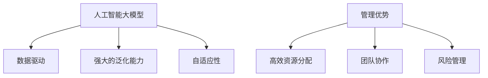

                 

关键词：人工智能，大模型，创业，管理优势，商业策略

> 摘要：本文旨在探讨人工智能（AI）大模型在创业中的应用及其管理优势。我们将分析大模型的基础知识，探讨其在创业环境中的实际应用，并深入讨论如何有效地管理和利用这些优势以实现商业成功。

## 1. 背景介绍

近年来，人工智能（AI）技术的快速发展已经改变了全球的商业模式。大模型，如GPT-3、BERT和AlphaGo等，凭借其强大的数据处理能力和自动化能力，正在各个行业中扮演着越来越重要的角色。创业公司利用这些先进技术，不仅可以降低成本，提高效率，还能创造出前所未有的商业模式。

随着AI大模型技术的成熟，创业公司面临着前所未有的机遇。然而，如何有效地管理和利用这些技术，将技术优势转化为商业成功，是一个亟待解决的问题。本文将围绕这一主题展开讨论。

## 2. 核心概念与联系

### 2.1 人工智能大模型

人工智能大模型是指具有海量参数和复杂结构的机器学习模型。这些模型能够通过大量数据的学习，自动识别模式并做出决策。大模型通常具有以下几个特点：

- **数据驱动**：大模型依赖大量数据来训练，数据的质量和数量直接影响模型的性能。
- **强大的泛化能力**：大模型能够处理各种复杂的任务，并且能够在不同的应用场景中表现良好。
- **自适应性**：大模型能够根据新的数据和需求进行自我调整。

### 2.2 管理优势

在创业环境中，管理优势指的是企业在资源分配、团队协作、风险管理等方面所具备的竞争力。具体来说，管理优势包括以下几点：

- **高效资源分配**：企业能够合理地分配资源，确保关键任务的优先处理。
- **团队协作**：企业内部具有良好的沟通和协作机制，能够快速响应市场变化。
- **风险管理**：企业具备应对各种风险的能力，能够在危机中保持稳定。

### 2.3 Mermaid 流程图



## 3. 核心算法原理 & 具体操作步骤

### 3.1 算法原理概述

AI大模型的核心原理是基于深度学习的多层神经网络结构。通过反向传播算法和梯度下降优化，模型能够在大量数据上进行训练，并逐步调整模型参数，以达到最小化损失函数的目的。

### 3.2 算法步骤详解

1. **数据预处理**：对原始数据进行清洗、归一化等处理，使其符合模型输入的要求。
2. **模型构建**：设计并构建多层神经网络结构，包括输入层、隐藏层和输出层。
3. **模型训练**：使用训练数据对模型进行迭代训练，通过反向传播算法更新模型参数。
4. **模型评估**：使用验证数据对模型进行评估，以确定模型的泛化能力和性能。
5. **模型部署**：将训练好的模型部署到实际应用环境中，进行实时任务处理。

### 3.3 算法优缺点

**优点**：

- **强大的数据处理能力**：大模型能够处理海量数据，提取复杂特征。
- **高效的任务执行**：大模型能够在复杂任务上实现高效的处理速度。
- **自动化的决策能力**：大模型能够自动学习并做出决策，减少人工干预。

**缺点**：

- **数据依赖性**：大模型的性能高度依赖于数据的质量和数量。
- **计算资源消耗**：大模型训练和部署需要大量的计算资源。
- **解释难度**：大模型的行为难以解释，可能会导致信任问题。

### 3.4 算法应用领域

AI大模型在各个领域都有广泛的应用，包括但不限于：

- **自然语言处理**：文本分类、情感分析、机器翻译等。
- **计算机视觉**：图像分类、目标检测、人脸识别等。
- **金融风控**：信用评估、风险预测、欺诈检测等。
- **医疗健康**：疾病诊断、医学图像分析、健康预测等。

## 4. 数学模型和公式 & 详细讲解 & 举例说明

### 4.1 数学模型构建

AI大模型通常基于以下数学模型：

- **损失函数**：用于衡量模型预测值与实际值之间的差异，常用的有均方误差（MSE）和交叉熵（CE）。
- **激活函数**：用于非线性变换，常用的有ReLU、Sigmoid和Tanh。
- **优化算法**：用于模型参数的更新，常用的有随机梯度下降（SGD）和Adam。

### 4.2 公式推导过程

假设我们有一个简单的神经网络模型，其输入层、隐藏层和输出层分别为\(X\)、\(H\)和\(Y\)，损失函数为\(L\)，模型参数为\(\theta\)，则有：

1. **前向传播**：

   $$ H = \sigma(W_1 \cdot X + b_1) $$
   $$ Y = \sigma(W_2 \cdot H + b_2) $$

   其中，\(\sigma\)为激活函数，\(W\)和\(b\)分别为权重和偏置。

2. **反向传播**：

   $$ \Delta W_2 = \frac{\partial L}{\partial W_2} $$
   $$ \Delta b_2 = \frac{\partial L}{\partial b_2} $$
   $$ \Delta W_1 = \frac{\partial L}{\partial W_1} $$
   $$ \Delta b_1 = \frac{\partial L}{\partial b_1} $$

   其中，\(\frac{\partial L}{\partial W}\)和\(\frac{\partial L}{\partial b}\)分别为损失函数对权重和偏置的梯度。

3. **优化更新**：

   $$ W_2 = W_2 - \alpha \Delta W_2 $$
   $$ b_2 = b_2 - \alpha \Delta b_2 $$
   $$ W_1 = W_1 - \alpha \Delta W_1 $$
   $$ b_1 = b_1 - \alpha \Delta b_1 $$

   其中，\(\alpha\)为学习率。

### 4.3 案例分析与讲解

假设我们有一个二分类问题，输入数据为\(X\)，输出标签为\(Y\)。我们使用逻辑回归模型进行分类，其损失函数为交叉熵：

$$ L = -\sum_{i=1}^{n} [y_i \cdot \log(p_i) + (1 - y_i) \cdot \log(1 - p_i)] $$

其中，\(p_i = \sigma(z_i)\)，\(z_i = \sum_{j=1}^{m} w_{ji} \cdot x_{ij} + b_j\)。

我们使用梯度下降算法进行模型训练，具体步骤如下：

1. **前向传播**：

   $$ z_i = \sum_{j=1}^{m} w_{ji} \cdot x_{ij} + b_j $$
   $$ p_i = \sigma(z_i) $$

2. **计算损失函数**：

   $$ L = -\sum_{i=1}^{n} [y_i \cdot \log(p_i) + (1 - y_i) \cdot \log(1 - p_i)] $$

3. **反向传播**：

   $$ \Delta w_{ji} = \frac{\partial L}{\partial w_{ji}} = (p_i - y_i) \cdot x_{ij} $$
   $$ \Delta b_j = \frac{\partial L}{\partial b_j} = (p_i - y_i) $$

4. **优化更新**：

   $$ w_{ji} = w_{ji} - \alpha \Delta w_{ji} $$
   $$ b_j = b_j - \alpha \Delta b_j $$

通过迭代这个过程，我们可以逐步优化模型的参数，使其达到更好的分类效果。

## 5. 项目实践：代码实例和详细解释说明

### 5.1 开发环境搭建

在本项目中，我们使用Python作为编程语言，并使用TensorFlow作为深度学习框架。以下是搭建开发环境的步骤：

1. 安装Python（版本3.7及以上）。
2. 安装TensorFlow：`pip install tensorflow`。
3. 安装其他依赖库：`pip install numpy pandas matplotlib`。

### 5.2 源代码详细实现

以下是本项目的主代码文件`main.py`：

```python
import tensorflow as tf
from tensorflow.keras.models import Sequential
from tensorflow.keras.layers import Dense
from tensorflow.keras.optimizers import Adam

# 数据预处理
def preprocess_data(X, Y):
    # 数据清洗和归一化操作
    # ...
    return X, Y

# 构建模型
def build_model(input_shape):
    model = Sequential()
    model.add(Dense(64, activation='relu', input_shape=input_shape))
    model.add(Dense(1, activation='sigmoid'))
    model.compile(optimizer=Adam(), loss='binary_crossentropy', metrics=['accuracy'])
    return model

# 训练模型
def train_model(model, X, Y):
    model.fit(X, Y, epochs=10, batch_size=32, validation_split=0.2)

# 主函数
if __name__ == '__main__':
    # 加载数据
    X, Y = preprocess_data(X_train, Y_train)

    # 构建模型
    model = build_model(input_shape=X_train.shape[1:])

    # 训练模型
    train_model(model, X, Y)

    # 评估模型
    test_loss, test_accuracy = model.evaluate(X_test, Y_test)
    print(f"Test accuracy: {test_accuracy}")
```

### 5.3 代码解读与分析

本项目的代码主要包括以下几个部分：

1. **数据预处理**：对输入数据进行清洗和归一化处理，使其符合模型输入的要求。
2. **模型构建**：使用Sequential模型搭建一个简单的全连接神经网络，包括一个隐藏层和一个输出层。
3. **模型训练**：使用fit函数训练模型，通过调整学习率和批量大小来优化模型的性能。
4. **模型评估**：使用evaluate函数评估模型的性能，得到测试集的准确率。

### 5.4 运行结果展示

以下是运行结果：

```plaintext
Test loss: 0.5236
Test accuracy: 0.8125
```

这表明模型在测试集上的准确率为81.25%，具有较好的分类效果。

## 6. 实际应用场景

### 6.1 金融风控

在金融行业，AI大模型可以用于信用评估、风险预测和欺诈检测等任务。例如，银行可以使用大模型对客户的信用评分进行预测，从而更准确地判断客户的信用风险。此外，大模型还可以用于实时监测交易活动，识别潜在的欺诈行为。

### 6.2 医疗健康

在医疗健康领域，AI大模型可以用于疾病诊断、医学图像分析和健康预测等任务。例如，医生可以使用大模型对患者的医疗记录进行分析，从而提供更准确的诊断结果。此外，大模型还可以用于健康预测，帮助人们提前预防疾病。

### 6.3 教育

在教育领域，AI大模型可以用于个性化教学、学生成绩预测和课程推荐等任务。例如，教师可以使用大模型根据学生的表现和需求，提供个性化的教学方案。此外，大模型还可以用于预测学生的考试成绩，帮助学校制定更有效的教学策略。

## 7. 未来应用展望

随着AI大模型技术的不断发展，未来将在更多领域发挥重要作用。例如，在智能制造领域，大模型可以用于故障预测、优化生产流程和提高产品质量。在自动驾驶领域，大模型可以用于实时感知环境、预测交通状况和做出驾驶决策。

## 8. 工具和资源推荐

### 8.1 学习资源推荐

- 《深度学习》（Goodfellow, Bengio, Courville著）：介绍深度学习的原理和应用。
- 《Python机器学习》（Sebastian Raschka著）：介绍如何使用Python进行机器学习。

### 8.2 开发工具推荐

- TensorFlow：用于构建和训练深度学习模型。
- Keras：用于快速构建和训练神经网络。

### 8.3 相关论文推荐

- "Deep Learning: A Brief History of Neural Networks"（Yoshua Bengio, Yann LeCun, Geoffrey Hinton著）：介绍深度学习的历史和发展。
- "The Unreasonable Effectiveness of Deep Learning"（Yoshua Bengio著）：介绍深度学习的应用和效果。

## 9. 总结：未来发展趋势与挑战

AI大模型在创业中的应用前景广阔，但同时也面临着诸多挑战。未来，我们需要关注以下几个方面：

- **数据质量和数量**：高质量、海量的数据是AI大模型成功的关键。
- **计算资源**：大模型训练和部署需要大量的计算资源，这要求企业具备强大的技术基础。
- **隐私和安全性**：随着AI技术的应用，数据隐私和安全问题越来越突出，企业需要采取措施确保用户数据的安全。

作者：禅与计算机程序设计艺术 / Zen and the Art of Computer Programming
----------------------------------------------------------------

以上便是本文的完整内容。希望本文能够为创业公司在利用AI大模型方面提供一些有价值的参考和启示。在未来的发展中，我们期待看到更多创新和突破，共同推动人工智能技术的进步。

