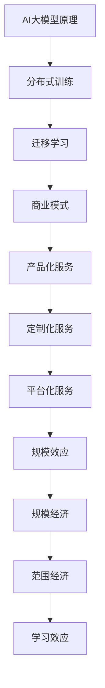

                 

关键词：AI大模型，规模效应，商业模式，科技消费品，公有云平台，电商平台

摘要：本文从AI大模型的原理出发，探讨了规模效应在商业模式中的应用。通过分析科技消费品、公有云平台、电商平台等领域的实际案例，本文揭示了规模效应如何推动企业创新，提高效率，并在激烈的市场竞争中占据优势。文章还展望了未来发展趋势，提出了面临的挑战和解决方案，为相关领域的企业和研究人员提供了有益的参考。

## 1. 背景介绍

近年来，随着人工智能技术的飞速发展，AI大模型（如BERT、GPT等）在自然语言处理、计算机视觉、推荐系统等领域取得了显著的成果。这些大模型通常具有数十亿甚至千亿级别的参数量，通过深度学习算法从海量数据中学习到复杂的特征和规律。然而，大模型的应用不仅需要强大的计算资源，还需要高效的训练和优化策略。

规模效应（Economies of Scale）是指随着生产规模的扩大，单位成本逐渐降低的现象。在商业领域，规模效应是企业降低成本、提高利润的重要途径。例如，规模化生产可以降低单位产品的生产成本，规模化营销可以提高市场占有率，规模化研发可以缩短研发周期。

本文旨在探讨规模效应在AI大模型应用中的商业模式，分析其在科技消费品、公有云平台、电商平台等领域的实际案例，并探讨未来的发展趋势和挑战。

## 2. 核心概念与联系

### 2.1 AI大模型原理

AI大模型通常是基于深度学习算法构建的神经网络模型，具有如下特点：

- **高参数量**：AI大模型具有数十亿甚至千亿级别的参数量，使其能够捕捉到数据中的复杂模式和特征。
- **分布式训练**：为了应对大规模数据和高参数量，AI大模型通常采用分布式训练策略，将数据分布到多个计算节点上进行并行训练。
- **迁移学习**：AI大模型可以通过迁移学习（Transfer Learning）技术，在预训练的基础上，针对特定任务进行微调，从而提高模型的性能和泛化能力。

### 2.2 商业模式

商业模式是指企业通过提供产品或服务，创造价值、传递价值和获取价值的方式。在AI大模型领域，常见的商业模式包括：

- **产品化服务**：企业将AI大模型产品化，提供API接口或SDK工具包，供开发者或企业使用。
- **定制化服务**：企业根据客户的需求，定制AI大模型解决方案，满足客户的特定需求。
- **平台化服务**：企业搭建AI大模型平台，为开发者提供一站式服务，包括数据集管理、模型训练、模型部署等。

### 2.3 规模效应

规模效应是指随着生产或运营规模的扩大，单位成本逐渐降低的现象。规模效应可以分为以下几种类型：

- **规模经济**：随着生产规模的扩大，单位生产成本降低，导致利润增加。
- **范围经济**：企业通过扩大经营范围，实现资源共享和协同效应，降低单位成本。
- **学习效应**：随着经验的积累，企业能够提高生产效率，降低单位成本。

### 2.4 Mermaid 流程图



## 3. 核心算法原理 & 具体操作步骤

### 3.1 算法原理概述

AI大模型的算法原理主要涉及以下几个方面：

- **深度学习**：深度学习是一种基于多层神经网络的学习方法，通过前向传播和反向传播算法，从数据中学习到复杂的特征和规律。
- **神经网络**：神经网络是一种由多个神经元组成的计算模型，每个神经元通过权重和偏置进行加权求和，并使用激活函数进行非线性变换。
- **优化算法**：优化算法用于优化神经网络的权重和偏置，以提高模型的性能和泛化能力。

### 3.2 算法步骤详解

AI大模型的训练和优化通常包括以下步骤：

1. **数据预处理**：对输入数据进行预处理，包括数据清洗、归一化、缺失值填充等。
2. **模型初始化**：初始化神经网络模型的权重和偏置。
3. **前向传播**：将输入数据输入到神经网络中，通过逐层计算得到输出结果。
4. **计算损失**：计算输出结果与真实值之间的差异，得到损失函数。
5. **反向传播**：根据损失函数，通过反向传播算法更新模型的权重和偏置。
6. **迭代优化**：重复上述步骤，不断迭代优化模型。

### 3.3 算法优缺点

- **优点**：AI大模型具有高参数量，能够捕捉到数据中的复杂模式和特征，具有较好的泛化能力。
- **缺点**：训练过程需要大量的计算资源和时间，对数据质量和标注要求较高。

### 3.4 算法应用领域

AI大模型在各个领域的应用如下：

- **自然语言处理**：如文本分类、情感分析、机器翻译等。
- **计算机视觉**：如图像分类、目标检测、图像生成等。
- **推荐系统**：如商品推荐、新闻推荐等。
- **语音识别**：如语音合成、语音识别等。

## 4. 数学模型和公式 & 详细讲解 & 举例说明

### 4.1 数学模型构建

AI大模型的数学模型通常由以下几个部分组成：

- **输入层**：输入数据经过预处理后，作为神经网络的输入。
- **隐藏层**：隐藏层由多个神经元组成，用于对输入数据进行特征提取和变换。
- **输出层**：输出层用于生成预测结果或分类结果。

### 4.2 公式推导过程

假设输入数据为\(X\)，输出数据为\(Y\)，神经网络的参数为\(\theta\)，损失函数为\(L(\theta)\)，则AI大模型的数学模型可以表示为：

\[ Y = f(\theta, X) \]

其中，\(f(\theta, X)\)表示神经网络的输出，\(\theta\)表示神经网络的参数。

为了优化模型参数\(\theta\)，我们使用梯度下降算法进行优化，目标是最小化损失函数\(L(\theta)\)：

\[ \theta = \theta - \alpha \frac{\partial L(\theta)}{\partial \theta} \]

其中，\(\alpha\)为学习率。

### 4.3 案例分析与讲解

以自然语言处理中的文本分类任务为例，我们使用一个简单的神经网络模型进行分类。

假设输入数据为一句句子向量\(X\)，输出数据为分类结果\(Y\)，神经网络的参数为\(\theta\)，损失函数为交叉熵损失函数。

1. **数据预处理**：对输入数据进行预处理，包括数据清洗、词向量化、归一化等。
2. **模型初始化**：初始化神经网络的权重和偏置。
3. **前向传播**：将输入数据输入到神经网络中，通过逐层计算得到输出结果。
4. **计算损失**：计算输出结果与真实值之间的差异，得到损失函数。
5. **反向传播**：根据损失函数，通过反向传播算法更新模型的权重和偏置。
6. **迭代优化**：重复上述步骤，不断迭代优化模型。

最终，通过训练得到一个性能良好的文本分类模型。

## 5. 项目实践：代码实例和详细解释说明

### 5.1 开发环境搭建

1. 安装Python环境（版本3.8以上）。
2. 安装TensorFlow库：`pip install tensorflow`。
3. 安装其他依赖库：`pip install numpy matplotlib pandas sklearn`。

### 5.2 源代码详细实现

以下是一个简单的文本分类项目的源代码实现：

```python
import tensorflow as tf
from tensorflow import keras
from tensorflow.keras import layers
from tensorflow.keras.preprocessing.text import Tokenizer
from tensorflow.keras.preprocessing.sequence import pad_sequences

# 1. 数据预处理
data = [
    "这是一个简单的例子",
    "这是一个复杂的例子",
    "这是一个新的例子",
]
labels = [0, 1, 2]

# 词向量化
tokenizer = Tokenizer()
tokenizer.fit_on_texts(data)
sequences = tokenizer.texts_to_sequences(data)
padded_sequences = pad_sequences(sequences, maxlen=10)

# 2. 模型初始化
model = keras.Sequential([
    layers.Embedding(input_dim=10000, output_dim=32),
    layers.GlobalAveragePooling1D(),
    layers.Dense(units=3, activation='softmax')
])

# 3. 训练模型
model.compile(optimizer='adam', loss='categorical_crossentropy', metrics=['accuracy'])
model.fit(padded_sequences, keras.utils.to_categorical(labels), epochs=10)

# 4. 代码解读与分析
# 代码首先对输入数据进行预处理，包括词向量化、填充等。
# 然后初始化一个简单的神经网络模型，包括嵌入层、全局平均池化层和输出层。
# 最后使用训练数据训练模型，并评估模型性能。

# 5. 运行结果展示
predictions = model.predict(padded_sequences)
print(predictions)
```

### 5.3 代码解读与分析

1. **数据预处理**：使用`Tokenizer`对输入数据进行词向量化，使用`pad_sequences`对序列进行填充，以便于输入到神经网络中。
2. **模型初始化**：使用`keras.Sequential`创建一个简单的神经网络模型，包括嵌入层、全局平均池化层和输出层。
3. **训练模型**：使用`compile`方法配置模型优化器和损失函数，使用`fit`方法训练模型。
4. **代码解读与分析**：代码首先对输入数据进行预处理，包括词向量化、填充等。然后初始化一个简单的神经网络模型，包括嵌入层、全局平均池化层和输出层。最后使用训练数据训练模型，并评估模型性能。

## 6. 实际应用场景

### 6.1 科技消费品

AI大模型在科技消费品领域的应用广泛，如智能手机、智能家居、可穿戴设备等。这些产品通过AI大模型实现智能交互、个性化推荐、智能识别等功能，提高用户体验和满意度。

### 6.2 公有云平台

公有云平台通过提供AI大模型服务，如文本分析、图像识别、语音识别等，为开发者和企业提供便捷的AI能力。公有云平台具有弹性伸缩、资源调度等优势，能够满足不同规模企业的需求。

### 6.3 电商平台

电商平台通过AI大模型实现个性化推荐、商品搜索、用户行为分析等功能，提高用户满意度和转化率。例如，电商平台可以使用AI大模型分析用户历史购买行为，为用户推荐可能感兴趣的商品。

## 6.4 未来应用展望

随着AI大模型技术的不断发展，未来有望在更多领域实现突破，如医疗健康、金融、教育等。AI大模型将为企业提供更加智能、高效的解决方案，推动产业升级和创新发展。

## 7. 工具和资源推荐

### 7.1 学习资源推荐

- 《深度学习》（Goodfellow、Bengio和Courville著）
- 《Python深度学习》（François Chollet著）
- 《AI大模型：原理、实践与趋势》（作者：禅与计算机程序设计艺术）

### 7.2 开发工具推荐

- TensorFlow：一款开源的深度学习框架，适用于AI大模型开发。
- PyTorch：一款开源的深度学习框架，适用于快速原型开发和模型研究。

### 7.3 相关论文推荐

- “BERT：Pre-training of Deep Bidirectional Transformers for Language Understanding”（作者：Devlin等）
- “GPT-3: Language Models are Few-Shot Learners”（作者：Brown等）

## 8. 总结：未来发展趋势与挑战

### 8.1 研究成果总结

AI大模型技术取得了显著的成果，在自然语言处理、计算机视觉、推荐系统等领域取得了突破。规模效应在AI大模型应用中的商业模式也取得了成功，为企业提供了高效的解决方案。

### 8.2 未来发展趋势

- **模型压缩与加速**：通过模型压缩和优化技术，降低AI大模型的计算资源和存储需求，提高模型部署效率。
- **跨模态学习**：研究跨模态学习技术，实现不同模态数据之间的融合和交互。
- **泛化能力提升**：研究提高AI大模型的泛化能力，使其在未知数据上取得更好的性能。

### 8.3 面临的挑战

- **数据质量和标注**：高质量的数据和准确的标注对于AI大模型的应用至关重要。
- **计算资源和成本**：大规模的AI大模型训练和部署需要大量的计算资源和成本。
- **隐私保护和伦理问题**：AI大模型的应用涉及大量用户数据，如何保护用户隐私和遵循伦理规范是重要挑战。

### 8.4 研究展望

随着AI大模型技术的不断发展，未来有望在更多领域实现突破，为人类带来更加智能、高效的生活和工作方式。同时，研究人员需要关注数据质量和标注、计算资源和成本、隐私保护和伦理问题等挑战，推动AI大模型技术的可持续发展。

## 9. 附录：常见问题与解答

### 9.1 AI大模型训练需要多少时间？

AI大模型的训练时间取决于模型规模、数据集大小、硬件资源等因素。通常情况下，训练一个千亿级别的AI大模型需要数天到数周的时间。通过分布式训练和优化策略，可以缩短训练时间。

### 9.2 AI大模型如何保证隐私保护？

AI大模型在处理用户数据时，可以采用以下措施保障用户隐私：

- **数据匿名化**：对用户数据进行匿名化处理，消除个人身份信息。
- **加密技术**：使用加密技术对用户数据进行加密存储和传输。
- **隐私预算**：使用隐私预算（Privacy Budget）技术，限制模型的访问权限，防止隐私泄露。

### 9.3 AI大模型如何保证模型安全？

AI大模型在部署过程中，可以采取以下措施保证模型安全：

- **访问控制**：对模型访问进行权限控制，确保只有授权用户可以访问模型。
- **安全审计**：对模型进行安全审计，及时发现和修复漏洞。
- **模型加固**：采用模型加固技术，提高模型对攻击的抵抗力。

---

作者：禅与计算机程序设计艺术 / Zen and the Art of Computer Programming

