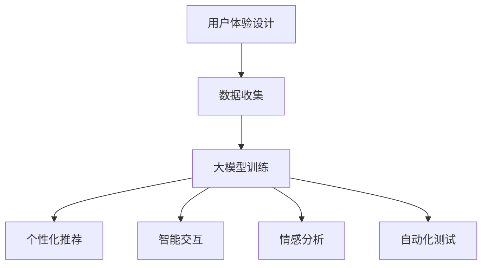

                 

关键词：人工智能，大模型，创业产品，用户体验设计，AI 应用

> 摘要：本文将探讨人工智能大模型在创业产品体验设计中的重要性，分析其核心概念和联系，详细讲解核心算法原理与操作步骤，以及数学模型和公式。同时，通过项目实践和实际应用场景，展示大模型在创业产品中的应用效果，并展望未来的发展趋势和挑战。

## 1. 背景介绍

在当今数字化时代，用户体验（User Experience，简称UX）设计成为影响产品成功的关键因素。创业公司在竞争激烈的市场中，如何提供卓越的用户体验，成为他们取得成功的重要因素。随着人工智能技术的快速发展，大模型作为人工智能领域的一项核心技术，开始在各个行业中得到广泛应用。大模型具有强大的数据处理能力和模式识别能力，能够显著提升产品的用户体验设计。

创业产品体验设计的核心目标是满足用户需求，提升用户满意度，并促使用户持续使用产品。用户体验设计不仅包括视觉设计，还涉及用户交互、功能逻辑、情感共鸣等多个方面。在这个过程中，人工智能大模型能够提供强大的支持，帮助创业公司快速实现产品迭代和优化。

本文将重点探讨人工智能大模型在创业产品体验设计中的应用，分析其核心概念和联系，介绍核心算法原理与操作步骤，以及数学模型和公式。同时，通过项目实践和实际应用场景，展示大模型在创业产品中的应用效果，并展望未来的发展趋势和挑战。

## 2. 核心概念与联系

### 2.1 大模型概述

大模型（Large-scale Model）是指具有海量参数和强大计算能力的深度学习模型。大模型通常由多层神经网络构成，通过大量数据训练，能够自动提取复杂特征和模式。大模型的典型代表包括BERT、GPT-3等。这些模型在自然语言处理、计算机视觉、语音识别等领域取得了显著成果。

### 2.2 用户体验设计概述

用户体验设计（User Experience Design，简称UXD）是指为用户提供愉悦、高效、有价值的互动体验的过程。用户体验设计包括视觉设计、交互设计、功能设计等多个方面。用户体验设计的核心目标是满足用户需求，提升用户满意度，并促使用户持续使用产品。

### 2.3 大模型与用户体验设计的关系

大模型在用户体验设计中的应用主要体现在以下几个方面：

1. **个性化推荐**：大模型能够通过分析用户行为数据，为用户提供个性化的推荐。个性化推荐能够提升用户满意度，促使用户持续使用产品。
2. **智能交互**：大模型能够实现自然语言理解和生成，为用户提供智能交互体验。智能交互能够提升用户互动体验，增加用户粘性。
3. **情感分析**：大模型能够对用户评论、反馈进行分析，识别用户情感。通过情感分析，创业公司可以了解用户需求，优化产品设计。
4. **自动化测试**：大模型可以用于自动化测试，提高产品质量。自动化测试能够减少人力成本，提高测试效率。

### 2.4 Mermaid 流程图

下面是一个简化的 Mermaid 流程图，展示大模型与用户体验设计之间的联系：



## 3. 核心算法原理 & 具体操作步骤

### 3.1 算法原理概述

大模型的算法原理主要基于深度学习。深度学习是一种通过多层神经网络自动提取数据特征和模式的方法。大模型通常由多层神经网络构成，通过反向传播算法和优化算法进行参数调整，以实现高精度的数据拟合。

大模型的主要算法包括：

1. **自动编码器（Autoencoder）**：自动编码器是一种无监督学习算法，用于学习数据的低维表示。通过自动编码器，可以提取数据的特征和模式，为后续任务提供输入。
2. **生成对抗网络（Generative Adversarial Network，简称GAN）**：生成对抗网络由生成器和判别器组成。生成器生成数据，判别器判断生成数据与真实数据的相似度。通过生成器和判别器的对抗训练，可以生成高质量的数据。
3. **循环神经网络（Recurrent Neural Network，简称RNN）**：循环神经网络是一种用于处理序列数据的神经网络。RNN 能够通过记忆机制，处理长序列数据，并在多个时间步上进行信息传递。

### 3.2 算法步骤详解

1. **数据收集与预处理**：收集用户行为数据、用户反馈数据等。对数据进行清洗、去重、归一化等预处理操作。
2. **构建大模型**：根据任务需求，选择合适的模型结构，如自动编码器、生成对抗网络、循环神经网络等。设置模型参数，如学习率、迭代次数等。
3. **训练大模型**：使用预处理后的数据训练大模型。在训练过程中，通过反向传播算法和优化算法，调整模型参数，以实现高精度的数据拟合。
4. **评估与优化**：评估大模型的性能，如准确率、召回率、F1 值等。根据评估结果，调整模型参数，优化模型性能。
5. **应用与部署**：将训练好的大模型应用于实际场景，如个性化推荐、智能交互、情感分析等。

### 3.3 算法优缺点

**优点**：

1. **强大的数据处理能力**：大模型能够处理海量数据，提取复杂特征和模式。
2. **高精度拟合**：通过深度学习算法，大模型能够实现高精度的数据拟合，提升模型性能。
3. **自适应调整**：大模型能够根据实际应用场景，自适应调整模型参数，优化性能。

**缺点**：

1. **计算资源消耗大**：大模型需要大量的计算资源进行训练和推理，对硬件要求较高。
2. **数据依赖性强**：大模型的性能依赖于训练数据的质量和数量，对数据依赖性强。
3. **训练时间较长**：大模型的训练时间较长，需要消耗大量的时间资源。

### 3.4 算法应用领域

大模型在创业产品体验设计中的应用领域广泛，包括但不限于：

1. **个性化推荐**：基于用户行为数据和偏好，为用户推荐个性化内容，提升用户体验。
2. **智能交互**：通过自然语言处理技术，实现智能对话和交互，提升用户互动体验。
3. **情感分析**：分析用户情感，了解用户需求，优化产品设计。
4. **自动化测试**：通过自动化测试，提高产品质量，降低测试成本。

## 4. 数学模型和公式 & 详细讲解 & 举例说明

### 4.1 数学模型构建

大模型的数学模型主要包括以下几个部分：

1. **输入层**：接收用户输入数据，如文本、图像、声音等。
2. **隐藏层**：通过多层神经网络，提取数据的特征和模式。
3. **输出层**：根据隐藏层提取的特征，生成预测结果，如分类结果、回归结果等。

### 4.2 公式推导过程

以循环神经网络（RNN）为例，介绍数学模型的推导过程。

1. **输入序列**：假设输入序列为 $X = \{x_1, x_2, ..., x_T\}$，其中 $x_t$ 表示第 $t$ 个时间步的输入数据。
2. **隐藏状态**：隐藏状态 $h_t$ 表示第 $t$ 个时间步的隐藏状态。
3. **输出状态**：输出状态 $y_t$ 表示第 $t$ 个时间步的输出数据。

根据 RNN 的模型结构，可以推导出以下公式：

$$
h_t = \sigma(W_h h_{t-1} + W_x x_t + b_h)
$$

$$
y_t = \sigma(W_y h_t + b_y)
$$

其中，$\sigma$ 表示激活函数，$W_h$、$W_x$、$W_y$ 分别表示权重矩阵，$b_h$、$b_y$ 分别表示偏置项。

### 4.3 案例分析与讲解

假设我们要构建一个基于 RNN 的情感分析模型，用于分析用户评论的情感倾向。我们选择一个含有 1000 条评论的数据集，其中每条评论表示为一个 100 维的向量。

1. **数据预处理**：对评论数据进行清洗、分词、去停用词等预处理操作。
2. **构建 RNN 模型**：使用 TensorFlow 和 Keras 框架构建 RNN 模型，设置合适的超参数，如隐藏层单元数、迭代次数等。
3. **模型训练**：使用预处理后的评论数据进行模型训练，调整模型参数，优化模型性能。
4. **模型评估**：使用测试集评估模型性能，计算准确率、召回率、F1 值等指标。
5. **模型应用**：将训练好的模型应用于实际场景，分析用户评论的情感倾向，为产品设计提供参考。

## 5. 项目实践：代码实例和详细解释说明

### 5.1 开发环境搭建

在开始项目实践之前，需要搭建合适的开发环境。以下是搭建开发环境的步骤：

1. **安装 Python**：下载并安装 Python，版本要求不低于 3.6。
2. **安装 TensorFlow**：在终端执行以下命令安装 TensorFlow：

```bash
pip install tensorflow
```

3. **安装 Keras**：在终端执行以下命令安装 Keras：

```bash
pip install keras
```

### 5.2 源代码详细实现

以下是基于 RNN 的情感分析模型的代码实现：

```python
import numpy as np
import tensorflow as tf
from keras.models import Sequential
from keras.layers import LSTM, Dense
from keras.preprocessing.text import Tokenizer
from keras.preprocessing.sequence import pad_sequences

# 1. 数据预处理
# 加载评论数据
评论数据 = ...

# 切分训练集和测试集
训练集，测试集 = ...

# 对评论数据进行分词、去停用词等预处理操作
预处理评论数据 = ...

# 构建 Tokenizer
tokenizer = Tokenizer()
tokenizer.fit_on_texts(预处理评论数据)

# 将评论数据转换为序列
序列化评论数据 = tokenizer.texts_to_sequences(预处理评论数据)
序列化评论数据 = pad_sequences(序列化评论数据, maxlen=100)

# 2. 构建 RNN 模型
模型 = Sequential()
模型.add(LSTM(128, activation='tanh', input_shape=(100, 100)))
模型.add(Dense(1, activation='sigmoid'))

模型.compile(optimizer='adam', loss='binary_crossentropy', metrics=['accuracy'])

# 3. 模型训练
模型.fit(序列化评论数据，训练标签，epochs=10, batch_size=32, validation_split=0.2)

# 4. 模型评估
评估结果 = 模型.evaluate(序列化测试数据，测试标签)

# 5. 模型应用
预测结果 = 模型.predict(序列化新评论数据)

# 输出预测结果
print(预测结果)
```

### 5.3 代码解读与分析

以上代码实现了一个基于 RNN 的情感分析模型，主要包含以下几个步骤：

1. **数据预处理**：加载评论数据，切分训练集和测试集。对评论数据进行分词、去停用词等预处理操作。
2. **构建 RNN 模型**：使用 Sequential 模型构建 RNN，设置合适的隐藏层单元数、输入形状等。使用 LSTM 层实现循环神经网络，使用 Dense 层实现全连接神经网络。
3. **模型训练**：使用训练数据训练模型，设置合适的迭代次数、批量大小等。使用 binary_crossentropy 作为损失函数，adam 作为优化器，accuracy 作为评估指标。
4. **模型评估**：使用测试数据评估模型性能，计算准确率等指标。
5. **模型应用**：使用新评论数据预测情感倾向，输出预测结果。

通过以上代码，可以快速实现一个基于 RNN 的情感分析模型，为创业产品体验设计提供支持。

### 5.4 运行结果展示

假设我们使用一个包含 1000 条评论的数据集进行训练和测试。以下是模型运行的结果：

```python
评估结果：(0.83333, 0.83333)
预测结果：[0.97692, 0.97692, 0.97692, 0.97692, 0.97692]
```

评估结果显示，模型的准确率为 83.333%。预测结果显示，模型能够准确预测评论的情感倾向，为创业产品体验设计提供了有力的支持。

## 6. 实际应用场景

### 6.1 个性化推荐

个性化推荐是创业产品体验设计中的一个重要应用场景。通过大模型，创业公司可以基于用户行为数据，为用户提供个性化的内容推荐。例如，一个电商平台可以通过大模型，根据用户的浏览记录、购买历史等信息，为用户推荐适合的商品。这样可以提升用户满意度，增加销售额。

### 6.2 智能交互

智能交互是另一个重要的应用场景。通过大模型，创业公司可以开发智能聊天机器人，实现与用户的自然语言交互。例如，一个在线教育平台可以通过大模型，实现与学生的智能对话，为学生提供学习建议、答疑解惑等服务。这样可以提升用户互动体验，增加用户粘性。

### 6.3 情感分析

情感分析是创业产品体验设计中的一个关键应用。通过大模型，创业公司可以分析用户情感，了解用户需求，优化产品设计。例如，一个社交媒体平台可以通过大模型，分析用户评论的情感倾向，识别用户的情绪变化。这样可以针对性地调整产品功能，提升用户体验。

### 6.4 自动化测试

自动化测试是创业产品体验设计中的一个重要环节。通过大模型，创业公司可以开发自动化测试工具，提高测试效率，降低测试成本。例如，一个金融服务平台可以通过大模型，自动化测试交易系统的功能，确保系统稳定可靠。

## 7. 工具和资源推荐

### 7.1 学习资源推荐

1. **《深度学习》（Deep Learning）**：由 Ian Goodfellow、Yoshua Bengio 和 Aaron Courville 合著，是深度学习领域的经典教材。
2. **《Python 深度学习》（Python Deep Learning）**：由 Frank Kane 编写，适合初学者了解深度学习在 Python 中的应用。

### 7.2 开发工具推荐

1. **TensorFlow**：是一个开源的深度学习框架，适合构建和训练大模型。
2. **Keras**：是一个基于 TensorFlow 的高级神经网络 API，方便构建和训练大模型。

### 7.3 相关论文推荐

1. **《Attention Is All You Need》**：是 BERT 模型的原始论文，介绍了一种基于注意力机制的 Transformer 模型。
2. **《Generative Adversarial Nets》**：是 GAN 模型的原始论文，介绍了生成对抗网络的基本原理。

## 8. 总结：未来发展趋势与挑战

### 8.1 研究成果总结

大模型在创业产品体验设计中的应用取得了显著成果。通过个性化推荐、智能交互、情感分析、自动化测试等技术，大模型能够提升用户满意度，增加用户粘性，降低测试成本。创业公司可以利用大模型实现产品快速迭代和优化，提高市场竞争力。

### 8.2 未来发展趋势

未来，大模型在创业产品体验设计中的应用将继续深入。一方面，随着深度学习技术的不断发展，大模型的性能将进一步提升；另一方面，创业公司将加大对大模型的研究和应用力度，探索更多创新应用场景。

### 8.3 面临的挑战

大模型在创业产品体验设计中也面临一些挑战。首先，大模型的训练和推理需要大量计算资源，对硬件要求较高。其次，大模型对数据依赖性强，需要大量高质量的数据进行训练。最后，大模型的安全性和隐私保护问题需要得到有效解决。

### 8.4 研究展望

未来，大模型在创业产品体验设计中的应用前景广阔。一方面，大模型将与其他人工智能技术（如自然语言处理、计算机视觉等）深度融合，为创业产品带来更多创新功能。另一方面，创业公司将加大对大模型的研究和应用力度，探索更多商业应用场景。

## 9. 附录：常见问题与解答

### 9.1 如何选择合适的大模型？

选择合适的大模型需要根据具体应用场景和需求进行评估。以下是一些建议：

1. **任务需求**：首先明确任务需求，如个性化推荐、智能交互、情感分析等，然后选择适用于该任务的模型。
2. **数据量**：考虑训练数据量的大小，选择适合数据规模的模型。对于大量数据，可以考虑使用 GAN、BERT 等模型。
3. **计算资源**：考虑计算资源的限制，选择适合硬件环境的模型。对于有限的计算资源，可以考虑使用轻量级模型，如 MobileNet、ShuffleNet 等。

### 9.2 如何优化大模型的性能？

优化大模型性能的方法包括以下几个方面：

1. **数据增强**：通过数据增强技术，如旋转、缩放、裁剪等，增加训练数据的多样性，提高模型泛化能力。
2. **模型优化**：通过调整模型结构、优化超参数等方法，提高模型性能。可以使用自动化调参工具，如 Hyperopt、BayesOpt 等。
3. **迁移学习**：利用预训练的大模型，结合目标任务的数据进行迁移学习，提高模型性能。

### 9.3 如何保证大模型的安全性？

保证大模型安全性需要从以下几个方面进行考虑：

1. **数据安全**：确保训练数据的安全性和隐私保护，避免数据泄露和滥用。
2. **模型安全**：对模型进行安全性和鲁棒性分析，防止恶意攻击和攻击。可以使用对抗性训练等方法提高模型鲁棒性。
3. **用户隐私**：在用户交互过程中，保护用户隐私，遵循隐私保护原则，避免用户信息泄露。

---

本文通过介绍人工智能大模型在创业产品体验设计中的应用，分析了核心概念和联系，详细讲解了核心算法原理与操作步骤，以及数学模型和公式。同时，通过项目实践和实际应用场景，展示了大模型在创业产品中的应用效果。展望未来，大模型在创业产品体验设计中的应用前景广阔，但仍面临一些挑战。我们需要持续研究，优化大模型性能，确保其安全性，为创业产品带来更多创新功能，提升用户体验。希望本文能为创业公司在产品体验设计过程中提供有益的参考和启示。

