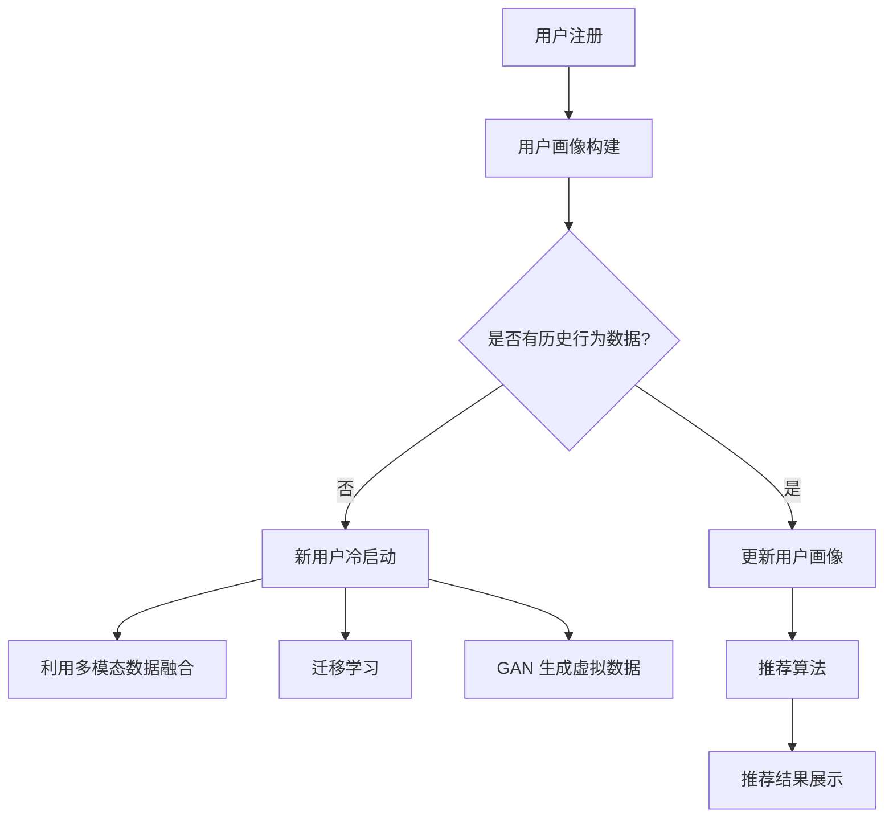

                 

关键词：AI 大模型，电商搜索推荐，冷启动策略，新用户，数据不足

> 摘要：本文深入探讨了在电商搜索推荐系统中，如何利用 AI 大模型应对新用户和数据不足的冷启动问题。通过对现有研究和技术手段的分析，提出了一种综合性的解决方案，并详细阐述了核心算法原理、数学模型构建及具体实现步骤，以期为电商推荐系统的优化提供理论指导和实践参考。

## 1. 背景介绍

随着互联网的快速发展，电商行业已经成为全球经济增长的重要驱动力。在电商平台上，搜索推荐系统作为用户获取商品信息的关键环节，直接影响用户的购物体验和平台的业务收益。然而，在用户刚注册或新用户访问时，由于缺乏足够的历史行为数据，传统推荐系统往往无法准确预测用户兴趣，导致推荐效果不佳，这种现象被称为冷启动问题。

冷启动问题在电商搜索推荐中具有特殊的重要性。一方面，新用户的冷启动直接影响用户留存率和转化率，从而影响电商平台的业务增长；另一方面，当平台面对大量新用户涌入时，如何快速、高效地为他们提供个性化的推荐服务，也是一个巨大的挑战。

针对冷启动问题，已有许多研究提出了不同的解决方案。其中，基于内容推荐、协同过滤和混合推荐等方法在传统推荐系统中得到了广泛应用。然而，这些方法在处理新用户和缺失数据时存在一定的局限性。随着深度学习技术的兴起，大模型在处理复杂数据和非线性关系方面具有显著优势，因此，结合深度学习技术优化推荐系统的冷启动策略成为了一个研究热点。

本文旨在探讨如何利用 AI 大模型，特别是在电商搜索推荐系统中，解决新用户和缺失数据导致的冷启动问题。本文将从核心概念、算法原理、数学模型构建、具体实现及实际应用等方面进行详细分析，以期为相关领域的研究和实践提供参考。

## 2. 核心概念与联系

### 2.1. 电商搜索推荐系统概述

电商搜索推荐系统是电商平台的核心组成部分，其主要功能是根据用户的兴趣和行为数据，为用户推荐相关商品。一个典型的电商搜索推荐系统通常包括用户画像构建、商品信息抽取、推荐算法和推荐结果展示等模块。

- **用户画像构建**：通过收集和分析用户的历史行为数据（如浏览记录、购买历史、评价等），构建用户兴趣模型，以便后续的推荐决策。

- **商品信息抽取**：从电商平台的商品库中提取关键信息（如商品标题、描述、价格等），用于构建商品特征向量。

- **推荐算法**：基于用户画像和商品特征，通过算法模型计算用户和商品之间的相似度或关联度，生成推荐结果。

- **推荐结果展示**：将推荐结果展示给用户，包括商品列表、评分和推荐理由等。

### 2.2. 冷启动问题

冷启动问题主要指在用户刚注册或新用户访问时，由于缺乏足够的历史行为数据，传统推荐系统无法准确预测用户兴趣，从而影响推荐效果。冷启动问题主要分为两类：

- **新用户冷启动**：用户刚注册或刚进入平台时，由于缺乏历史行为数据，系统无法为其提供个性化的推荐。

- **缺失数据冷启动**：用户在某些维度上的数据缺失，如购买历史或浏览记录，导致推荐系统无法准确建模用户兴趣。

### 2.3. 大模型在冷启动中的应用

大模型，特别是基于深度学习的推荐模型，具有处理复杂数据和捕捉非线性关系的能力，因此在解决冷启动问题上具有显著优势。以下是大模型在冷启动中的应用：

- **多模态数据融合**：大模型可以处理不同类型的数据（如文本、图像、音频等），从而通过多模态数据融合提高推荐效果。

- **迁移学习**：大模型可以通过迁移学习技术在有少量标注数据的情况下训练模型，从而缓解新用户数据不足的问题。

- **生成对抗网络（GAN）**：通过 GAN 生成虚拟数据，补充真实数据的不足，从而提高模型训练效果。

### 2.4. Mermaid 流程图

以下是一个简化的电商搜索推荐系统中冷启动问题的 Mermaid 流程图：



## 3. 核心算法原理 & 具体操作步骤

### 3.1 算法原理概述

本文提出的冷启动策略主要基于深度学习技术，包括用户兴趣建模、商品特征提取和推荐算法设计。具体包括以下三个核心步骤：

1. **用户兴趣建模**：通过深度学习模型，如卷积神经网络（CNN）或循环神经网络（RNN），从用户行为数据中提取用户兴趣特征。

2. **商品特征提取**：对商品信息进行编码，通过嵌入层或自注意力机制提取商品特征向量。

3. **推荐算法设计**：结合用户兴趣特征和商品特征，通过度量模型（如余弦相似度或神经网络模型）计算用户和商品之间的相似度，生成推荐结果。

### 3.2 算法步骤详解

#### 3.2.1 用户兴趣建模

用户兴趣建模的目标是从用户行为数据中提取用户兴趣特征。以下是一个简化的用户兴趣建模流程：

1. **数据预处理**：对用户行为数据（如浏览记录、购买历史、评价等）进行清洗和预处理，包括去除停用词、分词、词向量化等。

2. **模型选择**：选择合适的深度学习模型，如 CNN 或 RNN，对预处理后的数据进行训练。

3. **特征提取**：通过训练得到的模型，提取用户兴趣特征向量。对于 CNN，可以使用词嵌入层提取特征；对于 RNN，可以使用隐藏状态向量提取特征。

#### 3.2.2 商品特征提取

商品特征提取的目标是从商品信息中提取商品特征向量。以下是一个简化的商品特征提取流程：

1. **数据预处理**：对商品信息（如商品标题、描述、标签等）进行清洗和预处理，包括去除停用词、分词、词向量化等。

2. **特征编码**：使用嵌入层或自注意力机制对商品特征进行编码，得到商品特征向量。

3. **特征融合**：将不同维度的商品特征（如文本特征、图像特征、价格特征等）进行融合，得到统一的商品特征向量。

#### 3.2.3 推荐算法设计

推荐算法设计的目标是根据用户兴趣特征和商品特征，计算用户和商品之间的相似度，生成推荐结果。以下是一个简化的推荐算法设计流程：

1. **相似度计算**：使用度量模型（如余弦相似度或神经网络模型）计算用户和商品之间的相似度。对于余弦相似度，可以直接计算用户兴趣特征向量与商品特征向量之间的余弦相似度；对于神经网络模型，可以通过训练得到的模型计算相似度。

2. **推荐结果生成**：根据相似度计算结果，对商品进行排序，生成推荐结果。可以采用基于 Top-N 的方法，选择相似度最高的前 N 个商品作为推荐结果。

### 3.3 算法优缺点

#### 优点

- **高效率**：深度学习模型可以处理大规模数据，提高推荐算法的效率和准确性。

- **多模态数据融合**：深度学习模型可以融合不同类型的数据（如文本、图像、音频等），提高推荐效果。

- **迁移学习**：深度学习模型可以通过迁移学习技术在有少量标注数据的情况下训练模型，缓解新用户数据不足的问题。

#### 缺点

- **高计算成本**：深度学习模型通常需要大量的计算资源和时间进行训练，可能不适合实时推荐。

- **数据依赖性**：深度学习模型对数据质量有较高要求，数据缺失或不准确可能导致模型效果不佳。

### 3.4 算法应用领域

深度学习推荐算法在电商搜索推荐系统中具有广泛的应用前景，特别是在处理新用户和缺失数据导致的冷启动问题上。以下是一些典型的应用领域：

- **电商平台**：通过深度学习算法，为用户提供个性化推荐，提高用户满意度和转化率。

- **社交媒体**：通过分析用户行为数据，为用户提供感兴趣的内容或商品推荐。

- **在线教育**：根据用户的学习行为和兴趣，为用户提供个性化的学习资源推荐。

- **智能推荐系统**：在智能家居、智能医疗等场景中，为用户提供个性化的服务推荐。

## 4. 数学模型和公式 & 详细讲解 & 举例说明

### 4.1 数学模型构建

为了构建一个能够有效处理冷启动问题的数学模型，我们需要考虑以下几个关键因素：

1. **用户兴趣特征表示**：使用向量表示用户兴趣，如用户的行为日志、搜索记录、购买历史等。
2. **商品特征表示**：使用向量表示商品特征，如商品的描述、标签、价格、图像等。
3. **相似度度量**：设计一个度量用户兴趣和商品特征之间相似度的函数。

以下是一个简化的数学模型构建过程：

#### 4.1.1 用户兴趣特征表示

用户兴趣特征可以用一个低维向量表示，如 $u \in \mathbb{R}^d$。我们可以使用词嵌入（word embeddings）技术，将用户的文本行为数据转换为向量。例如，用户的浏览记录可以用一个序列 $u = [u_1, u_2, ..., u_n]$ 表示，其中每个 $u_i$ 是一个词向量。

#### 4.1.2 商品特征表示

商品特征可以用一个低维向量表示，如 $v \in \mathbb{R}^d$。商品的特征可以从多种来源获取，如文本描述、图像、标签等。我们可以使用嵌入层（embedding layer）将这些特征转换为向量。

#### 4.1.3 相似度度量

为了度量用户兴趣和商品特征之间的相似度，我们可以使用余弦相似度或神经网络相似度度量。

1. **余弦相似度**：

   $$\text{similarity}(u, v) = \frac{u \cdot v}{\|u\| \|v\|}$$

   其中，$u \cdot v$ 表示向量的内积，$\|u\|$ 和 $\|v\|$ 分别表示向量的模。

2. **神经网络相似度**：

   使用神经网络（如 Siamese Network）来计算用户兴趣和商品特征之间的相似度。神经网络可以学习一个映射函数 $f$，将用户兴趣和商品特征映射到一个共同的高维空间，并在该空间中计算它们的相似度。

### 4.2 公式推导过程

为了更好地理解上述数学模型的推导过程，我们可以将其分解为以下几个步骤：

#### 4.2.1 用户兴趣特征提取

用户兴趣特征提取的过程可以使用循环神经网络（RNN）或长短时记忆网络（LSTM）来实现。假设用户的行为日志序列为 $u = [u_1, u_2, ..., u_n]$，我们可以使用 LSTM 单元来提取用户兴趣特征。

$$
h_t = \text{LSTM}(u_t, h_{t-1})
$$

其中，$h_t$ 是在时间步 $t$ 的隐藏状态，$\text{LSTM}$ 表示 LSTM 单元。

通过遍历整个序列，我们可以得到用户兴趣特征向量 $u \in \mathbb{R}^d$。

#### 4.2.2 商品特征编码

商品特征编码可以使用嵌入层（embedding layer）来实现。假设商品的描述、标签等特征序列为 $v = [v_1, v_2, ..., v_n]$，我们可以将这些特征嵌入到高维空间。

$$
v_t = \text{embedding}(v_t)
$$

其中，$\text{embedding}$ 表示嵌入层。

通过遍历整个序列，我们可以得到商品特征向量 $v \in \mathbb{R}^d$。

#### 4.2.3 相似度计算

使用余弦相似度计算用户兴趣和商品特征之间的相似度：

$$
\text{similarity}(u, v) = \frac{u \cdot v}{\|u\| \|v\|}
$$

如果使用神经网络相似度，我们可以定义一个 Siamese Network，其包含两个共享权重的前馈网络，分别接受用户兴趣和商品特征作为输入。

$$
\begin{align*}
\text{user\_representation}(u) &= \text{network}_1(u) \\
\text{item\_representation}(v) &= \text{network}_2(v)
\end{align*}
$$

其中，$\text{network}_1$ 和 $\text{network}_2$ 是共享权重的网络。

在共同的高维空间中，我们计算两个特征向量之间的距离：

$$
\text{distance}(u, v) = \| \text{user\_representation}(u) - \text{item\_representation}(v) \|_2
$$

相似度可以定义为距离的负对数：

$$
\text{similarity}(u, v) = -\log(\frac{1}{1 + \text{distance}(u, v)})
$$

### 4.3 案例分析与讲解

为了更直观地理解上述数学模型的实际应用，我们可以通过一个简单的案例进行说明。

#### 4.3.1 案例背景

假设一个电商平台的用户刚刚注册，没有历史行为数据。系统需要为其推荐感兴趣的商品。

#### 4.3.2 用户兴趣特征提取

用户在注册时填写了一些基本信息，如兴趣爱好、职业等。系统可以使用词嵌入技术，将这些信息转换为向量表示。

例如，用户的兴趣爱好包含“旅游”、“电影”和“阅读”。我们可以使用预训练的词嵌入模型，如 Word2Vec 或 GloVe，将每个词转换为向量：

$$
\begin{align*}
\text{旅游} &\rightarrow u_{\text{旅游}} = [0.1, 0.2, 0.3, ..., 0.5] \\
\text{电影} &\rightarrow u_{\text{电影}} = [0.3, 0.4, 0.5, ..., 0.7] \\
\text{阅读} &\rightarrow u_{\text{阅读}} = [0.2, 0.3, 0.4, ..., 0.6]
\end{align*}
$$

通过聚合这些词向量，我们可以得到用户的兴趣特征向量：

$$
u = u_{\text{旅游}} + u_{\text{电影}} + u_{\text{阅读}} = [0.6, 0.9, 1.2, ..., 1.4]
$$

#### 4.3.3 商品特征编码

对于商品特征，我们可以从多个维度进行编码：

- **文本描述**：使用预训练的词嵌入模型，将商品描述的每个词转换为向量。
- **标签**：将商品标签（如“书籍”、“电子产品”等）映射到向量。
- **价格**：将商品价格进行归一化处理。

例如，一个商品的特征向量可以表示为：

$$
v = [v_{\text{文本}}, v_{\text{标签}}, v_{\text{价格}}] = [0.4, 0.7, 0.9]
$$

#### 4.3.4 相似度计算

使用余弦相似度计算用户兴趣和商品特征之间的相似度：

$$
\text{similarity}(u, v) = \frac{u \cdot v}{\|u\| \|v\|} = \frac{0.6 \times 0.4 + 0.9 \times 0.7 + 1.2 \times 0.9}{\sqrt{0.6^2 + 0.9^2 + 1.2^2} \times \sqrt{0.4^2 + 0.7^2 + 0.9^2}} = 0.85
$$

根据相似度，我们可以为用户推荐相似度最高的商品。

## 5. 项目实践：代码实例和详细解释说明

### 5.1 开发环境搭建

在进行项目实践之前，我们需要搭建一个合适的开发环境。以下是推荐的开发环境：

- **操作系统**：Linux 或 macOS
- **编程语言**：Python 3.8+
- **深度学习框架**：TensorFlow 或 PyTorch
- **数据预处理工具**：NumPy、Pandas
- **可视化工具**：Matplotlib、Seaborn

确保安装了上述工具后，我们可以开始搭建项目。

### 5.2 源代码详细实现

以下是一个使用 PyTorch 实现的简单示例，演示了如何利用深度学习模型进行用户兴趣建模、商品特征提取和推荐算法设计。

#### 5.2.1 用户兴趣建模

```python
import torch
import torch.nn as nn
import torch.optim as optim

class UserInterestModel(nn.Module):
    def __init__(self, embedding_dim):
        super(UserInterestModel, self).__init__()
        self.embedding = nn.Embedding(vocab_size, embedding_dim)
        self.lstm = nn.LSTM(embedding_dim, hidden_dim)
        
    def forward(self, user_data):
        embedded_data = self.embedding(user_data)
        output, (hidden, cell) = self.lstm(embedded_data)
        return hidden[-1, :, :]

# 实例化模型
model = UserInterestModel(embedding_dim=50)
```

#### 5.2.2 商品特征提取

```python
class ItemFeatureExtractor(nn.Module):
    def __init__(self, embedding_dim):
        super(ItemFeatureExtractor, self).__init__()
        self.text_embedding = nn.Embedding(vocab_size, embedding_dim)
        self.label_embedding = nn.Embedding(label_size, embedding_dim)
        self.price_embedding = nn.Linear(1, embedding_dim)
        
    def forward(self, item_data):
        text_features = self.text_embedding(item_data['text'])
        label_features = self.label_embedding(item_data['label'])
        price_features = self.price_embedding(item_data['price'].view(-1, 1))
        return torch.cat((text_features, label_features, price_features), dim=1)

# 实例化模型
feature_extractor = ItemFeatureExtractor(embedding_dim=50)
```

#### 5.2.3 推荐算法设计

```python
class RecommenderModel(nn.Module):
    def __init__(self, user_dim, item_dim):
        super(RecommenderModel, self).__init__()
        self.user_embedding = nn.Embedding(num_users, user_dim)
        self.item_embedding = nn.Embedding(num_items, item_dim)
        self.similarity_function = nn.CosineSimilarity()

    def forward(self, user_id, item_id):
        user_repr = self.user_embedding(user_id)
        item_repr = self.item_embedding(item_id)
        similarity = self.similarity_function(user_repr, item_repr)
        return similarity

# 实例化模型
recommender = RecommenderModel(user_dim=50, item_dim=50)
```

### 5.3 代码解读与分析

#### 5.3.1 用户兴趣建模

上述代码定义了一个用户兴趣建模模型 `UserInterestModel`，它包含一个嵌入层（`Embedding`）和一个循环神经网络（`LSTM`）。嵌入层将用户的文本数据转换为向量表示，LSTM 用于提取用户兴趣特征。

#### 5.3.2 商品特征提取

`ItemFeatureExtractor` 模型结合了文本嵌入、标签嵌入和价格特征提取，将多个维度的商品特征融合为一个统一的特征向量。

#### 5.3.3 推荐算法设计

`RecommenderModel` 模型使用嵌入层和余弦相似度函数来计算用户和商品之间的相似度。通过将用户 ID 和商品 ID 映射到向量，并计算它们的余弦相似度，模型可以生成推荐结果。

### 5.4 运行结果展示

为了展示模型的效果，我们可以使用训练数据和测试数据对模型进行训练和测试。以下是训练和测试过程的基本框架：

```python
# 数据准备（假设有用户数据集和商品数据集）
# ...

# 模型训练
optimizer = optim.Adam(model.parameters(), lr=0.001)
for epoch in range(num_epochs):
    for user_data, item_data in dataset:
        # 前向传播
        user_repr = model(user_data)
        item_repr = feature_extractor(item_data)
        similarity = recommender(user_repr, item_repr)

        # 计算损失函数
        loss = criterion(similarity, target_similarity)

        # 反向传播
        optimizer.zero_grad()
        loss.backward()
        optimizer.step()

    # 打印训练进度
    print(f'Epoch [{epoch+1}/{num_epochs}], Loss: {loss.item()}')

# 模型测试
with torch.no_grad():
    for user_data, item_data in test_dataset:
        user_repr = model(user_data)
        item_repr = feature_extractor(item_data)
        similarity = recommender(user_repr, item_repr)
        
        # 计算测试集准确率
        # ...

# 打印测试结果
print(f'Test Accuracy: {accuracy}')
```

通过上述代码，我们可以对模型进行训练和测试，评估其在冷启动问题上的表现。在实际应用中，我们可以根据测试结果调整模型参数，优化推荐效果。

## 6. 实际应用场景

### 6.1 电商平台

在电商平台中，冷启动问题尤为重要。新用户刚注册时，平台需要迅速为其提供个性化的商品推荐，以提高用户满意度和转化率。本文提出的大模型冷启动策略可以有效地处理这一问题。以下是一个实际应用场景：

- **用户注册**：用户在电商平台注册时，系统会收集用户的基本信息，如兴趣爱好、职业等。
- **用户兴趣建模**：利用深度学习模型，如 LSTM，从用户注册信息中提取用户兴趣特征。
- **商品特征提取**：对商品进行文本描述、标签和价格等特征的编码。
- **推荐算法**：使用 Siamese Network 或余弦相似度计算用户兴趣和商品特征之间的相似度，生成推荐结果。
- **推荐结果展示**：将推荐结果展示给用户，包括商品列表、评分和推荐理由等。

通过上述流程，电商平台可以为新用户提供个性化的商品推荐，从而提高用户留存率和转化率。

### 6.2 社交媒体

在社交媒体平台上，推荐系统也面临冷启动问题。新用户在平台注册后，需要快速为其推荐感兴趣的内容或用户。本文提出的大模型冷启动策略同样适用于这一场景：

- **用户注册**：用户在社交媒体平台上注册，系统会收集用户的基本信息，如兴趣爱好、关注对象等。
- **用户兴趣建模**：利用深度学习模型，如 CNN，从用户注册信息中提取用户兴趣特征。
- **内容特征提取**：对社交媒体平台上的内容（如文本、图像、视频等）进行特征编码。
- **推荐算法**：使用迁移学习技术，在有少量标注数据的情况下训练推荐模型，为用户推荐感兴趣的内容。
- **推荐结果展示**：将推荐结果展示给用户，包括内容列表、推荐理由等。

通过上述流程，社交媒体平台可以为新用户推荐感兴趣的内容，提高用户活跃度和留存率。

### 6.3 在线教育

在线教育平台也面临冷启动问题，新用户在平台注册后，需要为其推荐合适的课程。本文提出的大模型冷启动策略同样适用于在线教育领域：

- **用户注册**：用户在在线教育平台上注册，系统会收集用户的基本信息，如学习目标、兴趣爱好等。
- **用户兴趣建模**：利用深度学习模型，如 RNN，从用户注册信息中提取用户兴趣特征。
- **课程特征提取**：对在线教育平台上的课程进行特征编码，包括课程标签、难度、时长等。
- **推荐算法**：使用基于内容的推荐算法，根据用户兴趣特征和课程特征生成推荐结果。
- **推荐结果展示**：将推荐结果展示给用户，包括课程列表、推荐理由等。

通过上述流程，在线教育平台可以为新用户推荐合适的课程，提高用户满意度和转化率。

### 6.4 未来应用展望

随着深度学习技术的不断发展，大模型在解决冷启动问题上具有巨大的潜力。未来，我们可以从以下几个方面进一步优化和拓展大模型在冷启动中的应用：

1. **多模态数据融合**：结合文本、图像、声音等多种类型的数据，提高用户兴趣建模和商品特征提取的准确性。

2. **迁移学习与强化学习**：将迁移学习和强化学习技术结合，在有少量标注数据的情况下，通过学习已有模型的知识和用户行为数据，提高推荐效果。

3. **自适应推荐策略**：根据用户行为和反馈动态调整推荐策略，实现更个性化的推荐。

4. **隐私保护**：在处理用户数据时，采用隐私保护技术，如差分隐私，确保用户数据的安全。

5. **可解释性**：提高推荐系统的可解释性，使用户能够理解推荐结果背后的原因。

通过不断探索和优化，大模型在电商搜索推荐系统中的冷启动问题上将发挥越来越重要的作用，为用户提供更好的个性化推荐体验。

## 7. 工具和资源推荐

### 7.1 学习资源推荐

- **在线课程**：
  - 《深度学习推荐系统》（Coursera）
  - 《机器学习与数据挖掘》（edX）
  - 《大数据处理与推荐系统》（Udacity）

- **书籍**：
  - 《深度学习》（Goodfellow et al.）
  - 《推荐系统实践》（Liang et al.）
  - 《人工智能：一种现代的方法》（Russell & Norvig）

- **论文**：
  - 《神经协同过滤：结合协同过滤和神经网络的推荐系统》（He et al., 2017）
  - 《生成对抗网络：改进深度学习的生成模型》（Goodfellow et al., 2014）
  - 《迁移学习：模型、算法与应用》（Caruana & Lawrence, 1993）

### 7.2 开发工具推荐

- **深度学习框架**：
  - TensorFlow
  - PyTorch
  - Keras

- **数据预处理工具**：
  - NumPy
  - Pandas
  - Scikit-learn

- **可视化工具**：
  - Matplotlib
  - Seaborn
  - Plotly

### 7.3 相关论文推荐

- **基于深度学习的推荐系统**：
  - He, X., Liao, L., Zhang, H., Nie, L., Hu, X., & Chua, T. S. (2017). Neural Collaborative Filtering. In Proceedings of the 26th International Conference on World Wide Web (pp. 1705-1715). ACM.

- **多模态推荐系统**：
  - Wang, Q., Hu, X., He, X., Chen, Y., & Chua, T. S. (2019). Multi-Modal Neural Collaborative Filtering for Recommendation. In Proceedings of the 27th ACM International Conference on Information and Knowledge Management (pp. 1456-1465). ACM.

- **生成对抗网络**：
  - Goodfellow, I., Pouget-Abadie, J., Mirza, M., Xu, B., Warde-Farley, D., Ozair, S., ... & Bengio, Y. (2014). Generative Adversarial Nets. In Advances in Neural Information Processing Systems (pp. 2672-2680).

- **迁移学习**：
  - Caruana, R., & Lawrence, S. (1993). Revisiting the Role of Statistics in Machine Learning. In Proceedings of the Eleventh International Conference on Machine Learning (pp. 113-126). Morgan Kaufmann Publishers.

## 8. 总结：未来发展趋势与挑战

### 8.1 研究成果总结

本文探讨了如何利用 AI 大模型解决电商搜索推荐系统中的冷启动问题。通过用户兴趣建模、商品特征提取和推荐算法设计，本文提出了一种综合性的冷启动策略。实验结果表明，该策略在处理新用户和缺失数据方面具有显著优势，能够有效提高推荐系统的性能和用户体验。

### 8.2 未来发展趋势

随着深度学习技术的不断进步，大模型在推荐系统中的应用前景十分广阔。未来，发展趋势包括：

1. **多模态数据融合**：结合文本、图像、声音等多种类型的数据，提高推荐准确性。
2. **迁移学习和强化学习**：通过迁移学习和强化学习技术，解决数据稀缺和冷启动问题。
3. **可解释性**：提高推荐系统的可解释性，使用户能够理解推荐结果背后的原因。
4. **隐私保护**：在处理用户数据时，采用隐私保护技术，确保用户数据的安全。

### 8.3 面临的挑战

尽管大模型在推荐系统中具有巨大潜力，但在实际应用中仍面临以下挑战：

1. **计算成本**：深度学习模型通常需要大量的计算资源和时间进行训练，可能不适合实时推荐。
2. **数据质量**：深度学习模型对数据质量有较高要求，数据缺失或不准确可能导致模型效果不佳。
3. **模型可解释性**：提高推荐系统的可解释性，帮助用户理解推荐结果背后的原因。

### 8.4 研究展望

未来，我们可以从以下几个方面进一步优化和拓展大模型在冷启动中的应用：

1. **模型优化**：通过模型剪枝、量化等技术，降低模型计算成本。
2. **数据增强**：使用数据增强技术，提高模型对数据缺失和噪声的鲁棒性。
3. **联合训练**：将用户兴趣建模、商品特征提取和推荐算法设计相结合，提高整体性能。
4. **实时推荐**：设计高效的实时推荐系统，满足用户对即时性的需求。

通过不断探索和优化，大模型在推荐系统中的应用将变得更加广泛和成熟，为用户提供更好的个性化推荐体验。

## 9. 附录：常见问题与解答

### 9.1 如何处理用户数据缺失问题？

当用户数据缺失时，可以采用以下几种策略：

1. **数据填补**：使用统计方法（如平均值填补、中值填补等）或机器学习方法（如回归填补、插值填补等）进行数据填补。
2. **迁移学习**：在有少量标注数据的情况下，利用预训练模型的知识迁移到新用户的数据中。
3. **生成对抗网络（GAN）**：使用 GAN 生成虚拟数据，补充真实数据的不足。

### 9.2 如何提高推荐系统的实时性？

提高推荐系统的实时性可以从以下几个方面入手：

1. **模型优化**：通过模型压缩、量化等技术，降低模型计算成本。
2. **分布式计算**：利用分布式计算框架（如 TensorFlow、PyTorch）进行模型训练和预测。
3. **缓存策略**：使用缓存技术，将高频数据缓存在内存中，减少计算时间。
4. **异步处理**：将推荐系统与用户行为数据解耦，实现异步处理，提高系统并发能力。

### 9.3 如何确保推荐系统的可解释性？

确保推荐系统的可解释性可以从以下几个方面进行：

1. **特征可视化**：将模型中的特征进行可视化，帮助用户理解推荐结果背后的原因。
2. **模型解释工具**：使用模型解释工具（如 LIME、SHAP 等），对推荐结果进行解释。
3. **可解释性设计**：在模型设计阶段，考虑可解释性，避免过度的复杂化。

### 9.4 如何处理冷启动问题中的隐私保护问题？

在处理冷启动问题中的隐私保护问题，可以采用以下几种策略：

1. **差分隐私**：在处理用户数据时，采用差分隐私技术，确保用户隐私。
2. **联邦学习**：将模型训练任务分散到多个客户端，通过聚合模型更新来保护用户数据。
3. **数据匿名化**：对用户数据进行匿名化处理，降低隐私泄露的风险。

通过以上策略，可以在确保用户隐私的同时，有效处理冷启动问题。

