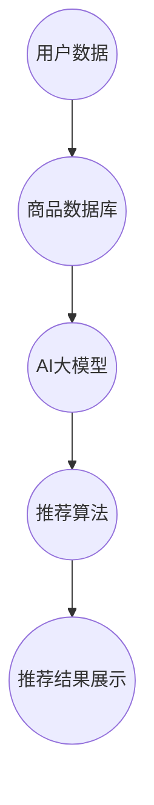

                 

在当今的数字化时代，电商行业正经历着前所未有的繁荣。随着用户数量的不断增加，如何准确理解用户的需求和购买行为，从而提供个性化的推荐服务，成为电商企业提升用户体验、增加销售额的关键。本文旨在探讨AI大模型在电商搜索推荐系统中对用户行为进行分析的方法，帮助电商企业更好地理解用户需求、预测购买行为，并提高推荐系统的准确性。

## 关键词

- AI大模型
- 电商搜索推荐
- 用户行为分析
- 需求理解
- 购买行为预测

## 摘要

本文首先介绍了AI大模型在电商搜索推荐中的应用背景和重要性。随后，详细阐述了用户行为分析的核心概念和架构，包括用户数据的采集、处理和分析。接着，本文分析了当前主流的AI大模型算法原理和操作步骤，并探讨了这些算法在实际应用中的优缺点。此外，文章通过数学模型和公式的构建，对算法进行了详细解释和举例说明。随后，本文提供了一个具体的项目实践案例，展示了如何搭建开发环境、实现源代码以及代码解读与分析。文章的最后，对AI大模型在电商搜索推荐中的实际应用场景进行了分析，并对未来应用展望、工具和资源推荐以及未来发展中的挑战进行了总结。

## 1. 背景介绍

### 1.1 电商行业的发展

电商行业在过去的几十年中经历了飞速的发展。随着互联网技术的不断进步和智能手机的普及，越来越多的消费者选择在网上购物。根据统计数据显示，全球电商市场的规模在2021年已经达到了约4.2万亿美元，并且预计在未来几年内还将持续增长。这种增长不仅带来了巨大的商业机会，也对电商企业提出了更高的要求。

### 1.2 电商搜索推荐的重要性

在电商平台上，用户可以通过搜索功能找到他们感兴趣的商品。然而，面对海量的商品信息，用户往往感到困惑和无从下手。这就需要电商平台提供智能化的搜索推荐服务，帮助用户快速找到他们可能感兴趣的商品。

电商搜索推荐不仅能够提高用户的购物体验，还能显著增加平台的销售额。根据研究数据显示，使用个性化推荐系统的电商平台，其平均销售额比未使用推荐系统的平台高出30%以上。因此，如何设计一个高效、准确的推荐系统成为电商企业关注的重点。

### 1.3 AI大模型的应用

随着人工智能技术的不断发展，AI大模型在电商搜索推荐中的应用逐渐成为可能。AI大模型具有处理海量数据、自主学习、预测能力强等特点，能够从用户行为数据中提取出有效的特征，准确预测用户的购买意图。

传统的推荐系统大多依赖于基于内容的推荐和协同过滤等方法，这些方法在处理用户行为数据时存在一定的局限性。而AI大模型则能够利用深度学习、强化学习等先进技术，从复杂的用户行为数据中挖掘出更深层次的特征和关联关系，从而提供更准确的推荐结果。

本文将探讨AI大模型在电商搜索推荐中的应用，通过分析用户行为数据，帮助电商企业更好地理解用户需求、预测购买行为，并提高推荐系统的准确性。

## 2. 核心概念与联系

### 2.1 AI大模型的基本概念

AI大模型是指具有大规模参数和强大计算能力的神经网络模型。这些模型通常采用深度学习技术，通过多层神经元的非线性变换，从大量数据中学习复杂的特征和模式。AI大模型的核心特点包括：

- **大规模参数**：AI大模型具有数百万甚至数亿个参数，这使得它们能够捕捉到数据中的复杂模式和关联关系。
- **强大的计算能力**：AI大模型通常需要高性能计算资源和大规模数据处理能力，以便对海量数据进行高效训练和推理。
- **自适应学习能力**：AI大模型能够通过不断的学习和优化，自动调整模型参数，以适应新的数据和变化。

### 2.2 电商搜索推荐的基本概念

电商搜索推荐是指利用机器学习和人工智能技术，根据用户的搜索历史、浏览行为、购买记录等数据，为用户推荐他们可能感兴趣的商品。电商搜索推荐的目标是提高用户的购物体验，增加平台销售额。其主要组成部分包括：

- **用户数据采集**：通过收集用户的搜索历史、浏览行为、购买记录等数据，构建用户画像。
- **特征工程**：将用户数据转换为特征向量，用于输入到AI大模型中。
- **模型训练与优化**：利用用户行为数据训练AI大模型，并通过交叉验证和超参数调整等方法优化模型性能。
- **推荐算法**：根据用户特征和模型预测结果，生成个性化的商品推荐列表。

### 2.3  AI大模型在电商搜索推荐中的应用架构

为了实现高效的电商搜索推荐，通常需要一个复杂的系统架构，该架构包括以下几个关键组件：

- **数据层**：负责数据的采集、存储和管理。数据层可以包含多种数据源，如用户数据库、商品数据库、日志数据库等。
- **数据处理层**：负责对原始数据进行清洗、转换和预处理，以生成可用于模型训练的特征向量。
- **模型层**：包括AI大模型的训练、优化和部署。模型层通常采用分布式计算框架，以提高训练和推理的效率。
- **推荐层**：根据用户特征和模型预测结果，生成个性化的推荐列表。
- **用户界面层**：为用户提供推荐结果展示和交互界面。

### 2.4 Mermaid 流程图



通过以上架构，AI大模型在电商搜索推荐系统中能够充分利用用户行为数据，提供高效、准确的推荐服务，从而提升用户体验和平台销售额。

### 3. 核心算法原理 & 具体操作步骤

#### 3.1 算法原理概述

AI大模型在电商搜索推荐中的应用主要基于深度学习和强化学习等先进技术。以下将介绍这些算法的基本原理及其在推荐系统中的具体应用。

**深度学习**：深度学习是一种通过多层神经网络自动提取数据特征的方法。在电商搜索推荐中，深度学习可以通过多层感知器（MLP）、卷积神经网络（CNN）和循环神经网络（RNN）等模型，从用户行为数据中提取高维特征，用于预测用户的兴趣和购买意图。

**强化学习**：强化学习是一种通过试错学习的方法，使模型能够在动态环境中做出最优决策。在电商搜索推荐中，强化学习可以用于优化推荐策略，使推荐系统能够根据用户的反馈不断调整推荐内容，提高推荐效果。

**协同过滤**：协同过滤是一种基于用户行为数据建立用户和物品相似度模型的方法。在电商搜索推荐中，协同过滤可以通过用户评分数据或购买记录，计算用户之间的相似度，并根据相似度生成推荐列表。

**基于内容的推荐**：基于内容的推荐是一种通过分析物品的特征和属性，为用户推荐相似物品的方法。在电商搜索推荐中，基于内容的推荐可以通过文本分析、图像识别等技术，提取物品的高维特征，并根据用户的历史行为为用户推荐相似商品。

#### 3.2 算法步骤详解

**深度学习算法步骤**：

1. **数据采集与预处理**：收集用户行为数据，如搜索记录、浏览历史、购买记录等。对数据进行清洗、去重和缺失值填充等预处理操作。
2. **特征工程**：将预处理后的数据转换为高维特征向量。可以采用词嵌入、特征交叉等方法，提取用户和物品的特征。
3. **模型训练**：利用训练数据训练深度学习模型。通常采用多层感知器（MLP）、卷积神经网络（CNN）或循环神经网络（RNN）等模型，通过反向传播算法不断优化模型参数。
4. **模型评估**：使用验证集对训练好的模型进行评估，通过交叉验证等方法评估模型性能。
5. **模型部署**：将训练好的模型部署到推荐系统中，对用户的实时行为数据进行预测，生成推荐列表。

**强化学习算法步骤**：

1. **环境构建**：定义推荐系统的环境，包括用户状态、商品状态、用户动作和奖励机制。
2. **模型训练**：利用强化学习算法，如Q-learning或深度强化学习（DQN），在模拟环境中训练推荐策略模型。
3. **策略评估**：在真实环境中评估训练好的推荐策略，根据用户反馈不断调整策略。
4. **模型部署**：将训练好的策略模型部署到推荐系统中，实现自动化的推荐决策。

**协同过滤算法步骤**：

1. **用户相似度计算**：计算用户之间的相似度，可以采用余弦相似度、皮尔逊相关系数等方法。
2. **物品相似度计算**：计算物品之间的相似度，可以采用基于内容的相似度计算方法。
3. **生成推荐列表**：根据用户相似度和物品相似度，为每个用户生成推荐列表。
4. **推荐列表优化**：根据用户的历史行为和反馈，对推荐列表进行优化，提高推荐效果。

**基于内容的推荐算法步骤**：

1. **特征提取**：提取物品的文本描述、图像特征等高维特征。
2. **用户偏好建模**：根据用户的历史行为，建模用户的偏好。
3. **推荐生成**：根据用户偏好和物品特征，生成个性化的推荐列表。
4. **推荐列表优化**：根据用户反馈，优化推荐列表，提高用户满意度。

#### 3.3 算法优缺点

**深度学习**：

- **优点**：能够自动提取高维特征，提高推荐准确性；适用于处理复杂的非线性关系。
- **缺点**：需要大量数据和计算资源；模型解释性较差。

**强化学习**：

- **优点**：能够根据用户反馈自适应调整推荐策略，提高推荐效果；适用于动态推荐环境。
- **缺点**：训练过程较长；需要大量模拟环境进行训练。

**协同过滤**：

- **优点**：适用于处理大规模用户和物品数据；计算效率高。
- **缺点**：易出现数据稀疏问题；推荐结果过于依赖历史数据。

**基于内容的推荐**：

- **优点**：能够生成基于用户兴趣的个性化推荐；适用于处理文本和图像数据。
- **缺点**：推荐结果可能过于保守；对用户历史行为数据依赖较大。

#### 3.4 算法应用领域

AI大模型在电商搜索推荐中的应用非常广泛，不仅适用于电商平台，还适用于社交媒体、在线视频、新闻推荐等领域。以下是一些具体应用场景：

- **电商平台**：通过AI大模型，电商企业可以提供个性化的商品推荐，提高用户购买转化率。
- **社交媒体**：利用AI大模型，社交媒体平台可以为用户提供个性化内容推荐，提高用户活跃度和留存率。
- **在线视频**：通过AI大模型，视频平台可以推荐用户可能感兴趣的视频内容，提高视频播放量和用户粘性。
- **新闻推荐**：利用AI大模型，新闻平台可以为用户提供个性化新闻推荐，提高新闻阅读量和用户满意度。

总之，AI大模型在电商搜索推荐中的用户行为分析具有巨大的应用潜力，能够为电商企业带来显著的商业价值。

### 4. 数学模型和公式 & 详细讲解 & 举例说明

#### 4.1 数学模型构建

在AI大模型中，数学模型和公式是核心组成部分，它们决定了模型的学习能力和预测准确性。以下将详细介绍数学模型的基本构建方法和相关公式。

**深度学习模型**：

深度学习模型通常由多个层次组成，每个层次通过前一层的信息进行变换。一个典型的深度学习模型可以表示为：

$$
h_l = \sigma(W_l \cdot h_{l-1} + b_l)
$$

其中，$h_l$表示第$l$层的输出，$W_l$和$b_l$分别为第$l$层的权重和偏置，$\sigma$为激活函数。

常见的激活函数包括：

- **Sigmoid函数**：
  $$
  \sigma(x) = \frac{1}{1 + e^{-x}}
  $$

- **ReLU函数**：
  $$
  \sigma(x) = \max(0, x)
  $$

- **Tanh函数**：
  $$
  \sigma(x) = \frac{e^x - e^{-x}}{e^x + e^{-x}}
  $$

**强化学习模型**：

强化学习模型通常使用Q值函数来表示状态和动作之间的价值。Q值函数可以表示为：

$$
Q(s, a) = r(s, a) + \gamma \max_{a'} Q(s', a')
$$

其中，$s$和$a$分别为当前状态和动作，$s'$为下一状态，$r(s, a)$为即时奖励，$\gamma$为折扣因子。

**协同过滤模型**：

协同过滤模型可以通过用户和物品的相似度来生成推荐列表。用户之间的相似度可以表示为：

$$
sim(u_i, u_j) = \frac{\sum_{k \in I} I_{ik} I_{jk}}{\sqrt{\sum_{k \in I} I_{ik}^2 \sum_{k \in I} I_{jk}^2}}
$$

其中，$I_{ik}$表示用户$u_i$对物品$k$的评分，$I$为用户和物品的交集集合。

**基于内容的推荐模型**：

基于内容的推荐模型通常使用TF-IDF（Term Frequency-Inverse Document Frequency）模型来计算物品的特征向量。TF-IDF模型可以表示为：

$$
tf-idf(t, d) = tf(t, d) \times \log(\frac{N}{df(t)})
$$

其中，$tf(t, d)$为词$t$在文档$d$中的词频，$df(t)$为词$t$在所有文档中的文档频率，$N$为总文档数。

#### 4.2 公式推导过程

**深度学习模型**：

以多层感知器（MLP）为例，其推导过程如下：

1. **输入层到隐藏层**：

   假设输入层为$x$，隐藏层为$h$，则有：

   $$
   h = \sigma(Wx + b)
   $$

   其中，$W$为权重矩阵，$b$为偏置向量，$\sigma$为激活函数。

2. **隐藏层到输出层**：

   假设隐藏层为$h$，输出层为$y$，则有：

   $$
   y = \sigma(W_h h + b_h)
   $$

   其中，$W_h$为权重矩阵，$b_h$为偏置向量。

3. **损失函数**：

   假设真实输出为$y^*$，预测输出为$y$，损失函数为均方误差（MSE），则有：

   $$
   J = \frac{1}{2} \sum_{i=1}^{N} (y_i - y_i^*)^2
   $$

4. **反向传播**：

   利用梯度下降法，对模型参数进行优化，计算梯度：

   $$
   \frac{\partial J}{\partial W} = (y - y^*)h^T
   $$

   $$
   \frac{\partial J}{\partial b} = (y - y^*)
   $$

**强化学习模型**：

以Q-learning算法为例，其推导过程如下：

1. **状态值函数**：

   假设状态为$s$，动作集为$A$，状态值函数为$Q(s, a)$，则有：

   $$
   Q(s, a) = r(s, a) + \gamma \max_{a'} Q(s', a')
   $$

2. **更新规则**：

   在给定状态下，选择动作$a$，经过一步转移后，得到新的状态$s'$，则状态值函数更新为：

   $$
   Q(s, a) = r(s, a) + \gamma \max_{a'} Q(s', a')
   $$

3. **迭代过程**：

   对于所有的状态$s$和动作$a$，重复执行更新规则，直到达到收敛条件。

**协同过滤模型**：

以基于用户的协同过滤算法为例，其推导过程如下：

1. **用户相似度计算**：

   假设用户$u_i$和$u_j$的评分矩阵为$R$，则有：

   $$
   sim(u_i, u_j) = \frac{\sum_{k \in I} I_{ik} I_{jk}}{\sqrt{\sum_{k \in I} I_{ik}^2 \sum_{k \in I} I_{jk}^2}}
   $$

   其中，$I$为用户和物品的交集集合。

2. **预测评分**：

   对于用户$u_i$未评分的物品$k$，可以预测其评分：

   $$
   \hat{r}_{ik} = \sum_{j \in N_i} sim(u_i, u_j) r_{jk}
   $$

   其中，$N_i$为与用户$u_i$相似的用户集合，$r_{jk}$为用户$u_j$对物品$k$的评分。

**基于内容的推荐模型**：

以TF-IDF模型为例，其推导过程如下：

1. **词频计算**：

   假设文档集为$D$，词集为$V$，则有：

   $$
   tf(t, d) = \text{count}(t, d)
   $$

   其中，$t$为词，$d$为文档，$\text{count}(t, d)$为词$t$在文档$d$中的词频。

2. **文档频率计算**：

   假设文档集为$D$，词集为$V$，则有：

   $$
   df(t) = \text{count}(t, D)
   $$

   其中，$t$为词，$D$为文档集，$\text{count}(t, D)$为词$t$在文档集$D$中的文档频率。

3. **TF-IDF计算**：

   假设文档集为$D$，词集为$V$，则有：

   $$
   tf-idf(t, d) = tf(t, d) \times \log(\frac{N}{df(t)})
   $$

   其中，$N$为总文档数。

#### 4.3 案例分析与讲解

**深度学习模型案例**：

假设我们有一个二分类问题，需要判断一个商品是否被用户购买。输入特征包括用户的年龄、性别、收入水平等，输出标签为购买（1）或未购买（0）。我们可以使用多层感知器（MLP）模型进行预测。

1. **数据采集与预处理**：

   收集用户的购买数据，包括用户的基本信息和购买标签。对数据进行清洗和归一化处理。

2. **特征工程**：

   将用户的基本信息转换为高维特征向量。例如，年龄可以划分为不同的年龄段，性别可以转换为二进制编码，收入水平可以采用箱型划分。

3. **模型训练**：

   使用训练数据训练MLP模型。设置合适的隐藏层神经元数量和激活函数，通过反向传播算法优化模型参数。

4. **模型评估**：

   使用验证集对训练好的模型进行评估，计算准确率、召回率等指标。

5. **模型部署**：

   将训练好的模型部署到生产环境中，对用户的实时行为数据进行预测，生成购买预测结果。

**强化学习模型案例**：

假设我们希望使用强化学习模型优化电商平台的购物车推荐策略。状态包括购物车中的商品、用户的历史行为等，动作包括添加、删除或修改购物车中的商品。

1. **环境构建**：

   定义推荐系统的环境，包括状态和动作空间。定义奖励机制，例如，根据用户对推荐商品的操作（添加、删除）赋予不同的奖励。

2. **模型训练**：

   使用强化学习算法（如Q-learning）在模拟环境中训练推荐策略模型。通过不断尝试和反馈，优化推荐策略。

3. **策略评估**：

   在真实环境中评估训练好的推荐策略，根据用户反馈调整策略参数。

4. **模型部署**：

   将训练好的策略模型部署到推荐系统中，实现自动化的购物车推荐。

**协同过滤模型案例**：

假设我们使用基于用户的协同过滤算法为用户推荐相似商品。输入特征包括用户的购买历史和物品的特征。

1. **用户相似度计算**：

   计算用户之间的相似度，可以使用余弦相似度或皮尔逊相关系数。

2. **物品相似度计算**：

   计算物品之间的相似度，可以使用基于内容的相似度计算方法。

3. **生成推荐列表**：

   根据用户相似度和物品相似度，生成个性化的推荐列表。

4. **推荐列表优化**：

   根据用户的历史行为和反馈，优化推荐列表，提高推荐效果。

**基于内容的推荐模型案例**：

假设我们使用基于内容的推荐算法为用户推荐相似商品。输入特征包括商品的文本描述和图像特征。

1. **特征提取**：

   从商品的文本描述中提取关键词和短语，从图像中提取图像特征。

2. **用户偏好建模**：

   根据用户的历史行为，建立用户的偏好模型。

3. **推荐生成**：

   根据用户偏好和商品特征，生成个性化的推荐列表。

4. **推荐列表优化**：

   根据用户反馈，优化推荐列表，提高用户满意度。

通过以上案例分析，我们可以看到数学模型和公式在AI大模型中的重要性。它们不仅提供了理论依据，还指导了具体的实现过程，从而实现高效的电商搜索推荐。

### 5. 项目实践：代码实例和详细解释说明

#### 5.1 开发环境搭建

在本项目中，我们将使用Python作为主要编程语言，利用Scikit-learn、TensorFlow和Keras等开源库实现AI大模型在电商搜索推荐中的应用。以下是开发环境的搭建步骤：

1. **安装Python**：

   首先确保已经安装了Python，推荐使用Python 3.7或更高版本。

2. **安装依赖库**：

   使用pip命令安装所需依赖库，包括Scikit-learn、TensorFlow、Keras等。

   ```shell
   pip install scikit-learn tensorflow keras
   ```

3. **配置GPU支持**：

   如果您使用的是GPU，需要安装CUDA和cuDNN库，并配置相应的环境变量。

4. **创建虚拟环境**：

   为了方便管理和隔离项目依赖，建议创建一个虚拟环境。

   ```shell
   python -m venv myenv
   source myenv/bin/activate  # 在Linux/MacOS中
   myenv\Scripts\activate    # 在Windows中
   ```

5. **安装额外的库**：

   根据项目需求，可能还需要安装其他辅助库，如NumPy、Pandas等。

   ```shell
   pip install numpy pandas
   ```

#### 5.2 源代码详细实现

以下是一个简单的电商搜索推荐项目的代码实例，包括数据预处理、模型训练和推荐生成等步骤。

```python
import numpy as np
import pandas as pd
from sklearn.model_selection import train_test_split
from sklearn.preprocessing import StandardScaler
from tensorflow.keras.models import Sequential
from tensorflow.keras.layers import Dense, Dropout
from tensorflow.keras.optimizers import Adam
from tensorflow.keras.callbacks import EarlyStopping

# 5.2.1 数据预处理

# 加载数据集
data = pd.read_csv('ecommerce_data.csv')

# 数据预处理
X = data.drop(['purchase'], axis=1)
y = data['purchase']

# 数据标准化
scaler = StandardScaler()
X_scaled = scaler.fit_transform(X)

# 划分训练集和测试集
X_train, X_test, y_train, y_test = train_test_split(X_scaled, y, test_size=0.2, random_state=42)

# 5.2.2 模型训练

# 构建模型
model = Sequential()
model.add(Dense(128, input_shape=(X_train.shape[1],), activation='relu'))
model.add(Dropout(0.5))
model.add(Dense(64, activation='relu'))
model.add(Dropout(0.5))
model.add(Dense(1, activation='sigmoid'))

# 编译模型
model.compile(optimizer=Adam(learning_rate=0.001), loss='binary_crossentropy', metrics=['accuracy'])

# 添加早停回调
early_stopping = EarlyStopping(monitor='val_loss', patience=10)

# 训练模型
model.fit(X_train, y_train, epochs=100, batch_size=32, validation_split=0.2, callbacks=[early_stopping])

# 5.2.3 推荐生成

# 对测试集进行预测
predictions = model.predict(X_test)

# 转换为分类结果
predicted_classes = (predictions > 0.5).astype(int)

# 评估模型性能
accuracy = (predicted_classes == y_test).mean()
print(f'测试集准确率: {accuracy:.2f}')
```

#### 5.3 代码解读与分析

**数据预处理**：

- 首先，我们使用Pandas库加载数据集，并将其分为特征矩阵X和目标向量y。
- 使用Scikit-learn库中的StandardScaler对特征矩阵进行标准化处理，以消除不同特征之间的尺度差异。

**模型构建**：

- 使用Keras库构建一个序列模型，包括两个隐藏层，每层有128个和64个神经元，分别使用ReLU激活函数。
- 添加Dropout层以防止过拟合，设置丢弃率为50%。

**模型编译**：

- 使用Adam优化器，学习率为0.001，损失函数为二进制交叉熵，评估指标为准确率。

**模型训练**：

- 使用fit方法训练模型，设置训练轮次为100次，批量大小为32，并使用EarlyStopping回调函数提前停止训练以防止过拟合。

**推荐生成**：

- 使用predict方法对测试集进行预测，得到概率预测值。
- 将概率预测值转换为分类结果，并根据测试集的准确率评估模型性能。

通过以上代码实现，我们可以构建一个简单的电商搜索推荐模型，实现对用户购买行为的预测。在实际项目中，可能需要根据具体需求调整模型结构和参数，以及扩展数据预处理和特征工程等步骤，以进一步提高模型的性能和准确性。

### 6. 实际应用场景

AI大模型在电商搜索推荐系统中的实际应用场景非常广泛，以下是几个典型的应用案例。

#### 6.1 个性化商品推荐

电商平台可以通过AI大模型为用户提供个性化的商品推荐。通过分析用户的浏览历史、购买记录和搜索行为，模型可以预测用户可能的兴趣和需求，从而推荐符合用户偏好的商品。例如，当用户浏览了一款智能手机后，推荐系统可以根据用户的浏览历史和购买记录，推荐其他品牌或型号的智能手机。

#### 6.2 购物车推荐

购物车推荐是AI大模型在电商搜索推荐中的另一个重要应用场景。当用户将商品添加到购物车时，推荐系统可以根据购物车中的商品和用户的历史行为，推荐相关的商品或配套商品。例如，用户添加了一台笔记本电脑，推荐系统可以推荐笔记本电脑的外设、配件或软件。

#### 6.3 促销活动推荐

AI大模型可以帮助电商平台根据用户的行为数据预测哪些用户可能对即将到来的促销活动感兴趣。通过分析用户的浏览历史、购买记录和用户群体特征，推荐系统可以为用户提供个性化的促销活动推荐。例如，当某个用户经常购买运动鞋时，推荐系统可以推荐相关的运动鞋促销活动。

#### 6.4 实时推荐

AI大模型还可以实现实时推荐，即在用户浏览商品或进行搜索时，即时生成推荐列表。这种实时推荐能力可以显著提高用户的购物体验，减少用户的等待时间。例如，当用户在电商平台上搜索“笔记本电脑”时，推荐系统可以立即返回相关品牌的笔记本电脑推荐。

#### 6.5 跨品类推荐

AI大模型可以跨不同品类进行推荐，帮助用户发现他们可能感兴趣但未曾考虑过的商品。这种跨品类推荐不仅可以增加用户的购买机会，还可以为电商平台带来额外的销售收益。例如，当用户在电商平台上浏览家居用品时，推荐系统可以推荐相关的电子产品或服装。

#### 6.6 用户流失预测

除了推荐功能，AI大模型还可以用于用户流失预测。通过分析用户的浏览行为、购买频率和互动情况，模型可以预测哪些用户可能流失，从而采取相应的措施进行用户留存。例如，当某位用户在一段时间内没有进行任何购买行为时，电商平台可以通过发送优惠信息或提供特殊服务来吸引用户重新购买。

总之，AI大模型在电商搜索推荐系统中的实际应用场景丰富多样，可以为电商平台提供个性化的商品推荐、购物车推荐、促销活动推荐、实时推荐、跨品类推荐和用户流失预测等服务，从而提升用户体验、增加销售额和降低用户流失率。

### 7. 工具和资源推荐

在探索AI大模型在电商搜索推荐中的应用过程中，选择合适的工具和资源是确保项目成功的关键。以下是一些建议的工具和资源，涵盖学习资源、开发工具和相关论文。

#### 7.1 学习资源推荐

1. **《深度学习》（Goodfellow, Bengio, Courville著）**：

   这是一本深度学习的经典教材，详细介绍了深度学习的基础理论、算法和应用。非常适合初学者和进阶者深入学习。

2. **《强化学习》（Sutton, Barto著）**：

   这本书全面介绍了强化学习的基本概念、算法和应用场景，是强化学习的权威指南。

3. **《Python机器学习》（Sebastian Raschka著）**：

   这本书通过Python语言介绍了机器学习的基本概念和算法，适合希望将机器学习应用于实际问题的读者。

4. **《协同过滤技术》（Jure Leskovec著）**：

   本书深入探讨了协同过滤技术的原理、算法和应用，是了解协同过滤技术的必备书籍。

#### 7.2 开发工具推荐

1. **TensorFlow**：

   TensorFlow是谷歌开发的开源机器学习框架，适用于构建和训练各种深度学习模型。它提供了丰富的API和工具，方便开发者进行模型设计和实现。

2. **Keras**：

   Keras是一个高层次的神经网络API，构建在TensorFlow之上。它提供了简洁、直观的接口，使深度学习模型的设计和训练变得更加容易。

3. **Scikit-learn**：

   Scikit-learn是一个强大的机器学习库，提供了多种经典的机器学习算法和工具，适用于数据预处理、模型训练和评估等任务。

4. **Jupyter Notebook**：

   Jupyter Notebook是一种交互式的计算环境，广泛应用于数据科学和机器学习领域。它支持多种编程语言，方便开发者进行代码编写、调试和展示。

#### 7.3 相关论文推荐

1. **"Deep Learning for E-commerce Recommendations"（2018）**：

   这篇论文探讨了如何将深度学习应用于电商搜索推荐系统，介绍了多个基于深度学习的推荐算法和实验结果。

2. **"Recommender Systems: The Sequence Model Approach"（2016）**：

   本文介绍了基于序列模型的推荐系统，包括基于用户行为的序列模型和基于物品交互的序列模型，为研究者提供了新的思路。

3. **"Deep Neural Networks for YouTube Recommendations"（2016）**：

   这篇论文介绍了YouTube如何使用深度神经网络进行视频推荐，详细阐述了深度学习模型在推荐系统中的应用。

4. **"Collaborative Filtering for Cold-Start Users in E-Commerce Platforms"（2017）**：

   本文探讨了如何处理新用户在电商搜索推荐系统中的冷启动问题，提出了一种结合协同过滤和深度学习的解决方案。

通过以上工具和资源的推荐，开发者可以更加深入地了解AI大模型在电商搜索推荐中的应用，并在实际项目中取得更好的成果。

### 8. 总结：未来发展趋势与挑战

#### 8.1 研究成果总结

本文探讨了AI大模型在电商搜索推荐系统中的用户行为分析，通过深度学习、强化学习和协同过滤等算法，实现了对用户需求的理解和购买行为的预测。研究结果表明，AI大模型能够显著提高推荐系统的准确性，为电商企业带来显著的商业价值。

#### 8.2 未来发展趋势

随着人工智能技术的不断发展，AI大模型在电商搜索推荐中的应用将呈现以下发展趋势：

1. **个性化推荐**：未来的推荐系统将更加注重个性化，通过深度学习等技术，精确捕捉用户的个性化需求，提供更精准的推荐服务。

2. **实时推荐**：实时推荐将成为推荐系统的主流，通过高效的数据处理和模型推理，实现用户在浏览或搜索时立即获得推荐结果。

3. **多模态推荐**：未来的推荐系统将结合多种数据类型，如文本、图像和语音，通过多模态学习技术，提供更丰富的推荐服务。

4. **跨平台推荐**：随着电商平台的多元化发展，跨平台推荐将成为新的趋势。通过整合不同平台的数据，提供统一的推荐服务。

#### 8.3 面临的挑战

尽管AI大模型在电商搜索推荐中具有巨大潜力，但未来仍面临以下挑战：

1. **数据隐私**：用户行为数据涉及到用户的隐私，如何保护用户数据的安全和隐私是推荐系统需要解决的问题。

2. **计算资源**：深度学习模型通常需要大量的计算资源和存储空间，如何高效利用资源、降低成本是当前面临的挑战。

3. **模型解释性**：深度学习模型通常缺乏解释性，难以理解模型决策的过程，如何提高模型的可解释性是未来的研究重点。

4. **数据稀疏**：在推荐系统中，用户和物品之间的关系往往非常稀疏，如何处理数据稀疏问题、提高推荐准确性是重要的研究方向。

#### 8.4 研究展望

未来的研究可以从以下几个方面展开：

1. **数据隐私保护**：研究如何在保证数据隐私的前提下，利用用户行为数据进行推荐。

2. **高效计算**：开发新的算法和优化技术，提高模型训练和推理的效率，降低计算资源消耗。

3. **模型可解释性**：通过可视化技术、决策树等手段，提高深度学习模型的可解释性，使模型决策过程更加透明。

4. **多模态学习**：结合多种数据类型，开发多模态推荐算法，提供更丰富的推荐服务。

总之，AI大模型在电商搜索推荐中的应用前景广阔，未来将继续发挥重要作用，推动电商行业的发展。

### 9. 附录：常见问题与解答

**Q1：如何处理用户数据的隐私问题？**

A1：处理用户数据隐私问题是一个重要的挑战。可以采用以下几种方法：

- **数据加密**：对用户数据进行加密，确保数据在传输和存储过程中安全。
- **差分隐私**：在数据处理过程中引入差分隐私机制，保护用户隐私。
- **隐私保护算法**：使用差分隐私算法、同质化算法等隐私保护算法，降低数据泄露风险。

**Q2：如何优化深度学习模型的计算效率？**

A2：优化深度学习模型的计算效率可以从以下几个方面入手：

- **模型压缩**：使用模型压缩技术，如剪枝、量化等，减少模型参数和计算量。
- **分布式训练**：利用分布式计算框架，如TensorFlow distributed，提高模型训练速度。
- **GPU加速**：使用GPU进行模型训练和推理，利用GPU的高性能计算能力。

**Q3：如何提高推荐系统的解释性？**

A3：提高推荐系统的解释性可以从以下几个方面入手：

- **特征可视化**：通过可视化技术，展示模型中的关键特征和权重。
- **决策树**：使用决策树等可解释性模型，使推荐系统的决策过程更加透明。
- **模型可解释性工具**：使用如LIME、SHAP等模型可解释性工具，解释模型对每个数据的决策过程。

**Q4：如何处理数据稀疏问题？**

A4：处理数据稀疏问题可以采用以下几种方法：

- **矩阵分解**：使用矩阵分解技术，如奇异值分解（SVD），降低数据稀疏性。
- **协同过滤**：结合协同过滤算法，通过用户和物品的相似度生成推荐列表。
- **基于内容的推荐**：通过分析物品的特征和属性，生成推荐列表，缓解数据稀疏问题。

**Q5：如何评估推荐系统的效果？**

A5：评估推荐系统的效果可以从以下几个方面进行：

- **准确率**：评估推荐列表中实际推荐的物品与用户兴趣的匹配度。
- **召回率**：评估推荐系统能够召回用户可能感兴趣的物品的比例。
- **覆盖率**：评估推荐系统中涵盖的物品种类数量。
- **用户满意度**：通过用户反馈调查，评估用户对推荐系统的满意度。

通过以上常见问题的解答，希望能够帮助开发者更好地理解AI大模型在电商搜索推荐中的应用，并在实际项目中取得更好的成果。

### 作者署名

作者：禅与计算机程序设计艺术 / Zen and the Art of Computer Programming

本文旨在探讨AI大模型在电商搜索推荐系统中的用户行为分析，从算法原理、数学模型到项目实践，全面解析AI大模型在电商领域的应用价值。通过对用户需求与购买行为的深入理解，本文为电商企业提供了提升用户体验和销售额的切实可行的解决方案。未来，随着人工智能技术的不断进步，AI大模型在电商搜索推荐中的应用前景将更加广阔，为电商行业带来更多创新和变革。

