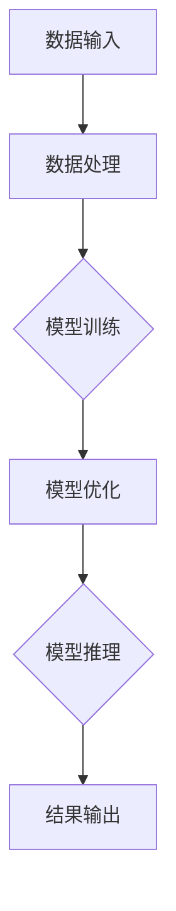

                 

关键词：AI大模型、数据中心建设、算力引擎、AI创新、核心技术、算法优化、数学模型、实践案例、应用场景、未来展望

> 摘要：本文将探讨AI大模型应用数据中心建设的核心要素，分析其核心技术、算法原理、数学模型以及实践应用。通过详细阐述这些内容，旨在为读者提供一个关于如何打造高效、智能的AI应用数据中心的全面视角，助力AI创新。

## 1. 背景介绍

### 1.1 AI大模型的兴起

随着深度学习的迅速发展，AI大模型（如GPT-3、BERT、GAN等）已经成为当前AI领域的研究热点和应用核心。这些大模型具备强大的数据分析和处理能力，能够应用于自然语言处理、图像识别、语音识别等众多领域，显著提升各行业的智能化水平。

### 1.2 数据中心建设的重要性

数据中心作为AI大模型应用的基础设施，其建设质量和性能直接影响到AI应用的效率和质量。一个高效、可靠的AI数据中心需要具备强大的计算能力、存储能力和网络连接能力，以满足大模型训练和推理的需求。

## 2. 核心概念与联系

下面，我们将通过Mermaid流程图（图表 1）来展示AI大模型应用数据中心的核心概念和联系。



### 图表 1. AI大模型应用数据中心概念流程图

2.1 数据输入

数据输入是AI大模型应用的第一步，它决定了模型训练的质量。高质量的输入数据能够为模型提供丰富的信息，帮助模型更好地学习和泛化。

2.2 数据处理

数据处理包括数据清洗、数据预处理和数据增强等步骤。这些步骤的目的是提高数据的质量和多样性，从而提升模型训练的效果。

2.3 模型训练

模型训练是通过大量数据来训练AI大模型的参数，使其能够进行有效的预测和决策。训练过程涉及到算法优化、超参数调整等技术。

2.4 模型优化

模型优化是在模型训练的基础上，通过调整模型结构和参数，进一步提升模型的性能和效率。

2.5 模型推理

模型推理是模型在应用中的关键步骤，它通过输入新的数据进行预测和决策。

2.6 结果输出

结果输出是模型推理的结果，它可以是预测结果、决策结果等，用于指导实际应用。

## 3. 核心算法原理 & 具体操作步骤

### 3.1 算法原理概述

AI大模型的训练主要基于深度学习算法，其中以神经网络为代表。神经网络通过多层非线性变换，对输入数据进行特征提取和融合，从而实现复杂函数的拟合。

### 3.2 算法步骤详解

3.2.1 数据收集与预处理

首先，从各种数据源收集数据，包括公开数据集、企业内部数据等。然后，对数据进行清洗、预处理和增强，以提高数据的质量和多样性。

3.2.2 模型构建

根据应用场景，设计并构建神经网络模型。模型的设计涉及到网络结构、激活函数、损失函数等。

3.2.3 模型训练

使用预处理后的数据，对模型进行训练。训练过程通过反向传播算法来调整模型参数，使得模型能够更好地拟合训练数据。

3.2.4 模型评估与优化

在训练完成后，使用验证数据集对模型进行评估。根据评估结果，对模型进行优化，包括调整模型结构、超参数等。

3.2.5 模型推理与应用

将训练好的模型应用于实际场景，进行推理和决策。模型推理可以实时进行，也可以批处理。

### 3.3 算法优缺点

3.3.1 优点

- 强大的数据分析和处理能力
- 能够实现自动化学习和优化
- 在众多领域具有广泛的应用前景

3.3.2 缺点

- 需要大量的数据和高性能计算资源
- 模型的解释性较差
- 训练过程较长

### 3.4 算法应用领域

AI大模型在自然语言处理、计算机视觉、语音识别、推荐系统等领域具有广泛的应用。例如，GPT-3在自然语言处理领域具有强大的文本生成和问答能力，BERT在计算机视觉领域可以用于图像分类和目标检测。

## 4. 数学模型和公式 & 详细讲解 & 举例说明

### 4.1 数学模型构建

AI大模型的核心是神经网络，其数学模型主要包括：

- 输入层（Input Layer）：接收外部输入数据。
- 隐藏层（Hidden Layer）：进行特征提取和融合。
- 输出层（Output Layer）：生成最终预测结果。

神经网络的基本公式如下：

$$
Z = \sigma(W \cdot X + b)
$$

其中，$Z$ 是隐藏层输出，$W$ 是权重矩阵，$X$ 是输入数据，$b$ 是偏置项，$\sigma$ 是激活函数。

### 4.2 公式推导过程

神经网络的训练过程主要通过反向传播算法来实现，其核心是误差反向传播。具体推导过程如下：

1. 计算输出层误差：

$$
\delta_L = \frac{\partial L}{\partial Z_L} \cdot \sigma'(Z_L)
$$

其中，$L$ 是损失函数，$Z_L$ 是输出层输出，$\sigma'$ 是激活函数的导数。

2. 传播误差至隐藏层：

$$
\delta_H = \frac{\partial L}{\partial Z_H} \cdot \sigma'(Z_H) \cdot W_{HL}
$$

其中，$Z_H$ 是隐藏层输出，$W_{HL}$ 是隐藏层到输出层的权重。

3. 更新权重和偏置项：

$$
W_{HL} = W_{HL} - \alpha \cdot \delta_H \cdot X_H
$$

$$
b_L = b_L - \alpha \cdot \delta_L
$$

其中，$\alpha$ 是学习率，$X_H$ 是隐藏层输入。

### 4.3 案例分析与讲解

假设我们有一个二元分类问题，使用神经网络进行分类。给定训练数据集，我们通过反向传播算法来训练模型，并分析训练过程。

- 训练数据集：$\{X_1, Y_1\}, \{X_2, Y_2\}, ..., \{X_n, Y_n\}$
- 输入层：$X = [x_1, x_2, ..., x_m]$
- 隐藏层：$H = [h_1, h_2, ..., h_k]$
- 输出层：$O = [o_1, o_2]$

1. 模型初始化：设定权重和偏置项。
2. 前向传播：计算隐藏层和输出层的输出。
3. 计算损失函数：$L = \sum_{i=1}^{n} (o_i - y_i)^2$
4. 反向传播：计算误差并更新权重和偏置项。
5. 重复步骤2-4，直到模型收敛。

通过以上步骤，我们可以训练出一个具有良好分类效果的神经网络模型。

## 5. 项目实践：代码实例和详细解释说明

### 5.1 开发环境搭建

在开始编写代码之前，我们需要搭建一个适合AI大模型训练的开发环境。以下是搭建开发环境的基本步骤：

1. 安装Python环境：在官方网站下载并安装Python。
2. 安装深度学习框架：例如，PyTorch、TensorFlow等。
3. 安装依赖库：包括Numpy、Pandas、Scikit-learn等。

### 5.2 源代码详细实现

以下是使用PyTorch框架实现一个简单的神经网络模型的代码实例：

```python
import torch
import torch.nn as nn
import torch.optim as optim

# 定义神经网络结构
class NeuralNetwork(nn.Module):
    def __init__(self, input_dim, hidden_dim, output_dim):
        super(NeuralNetwork, self).__init__()
        self.fc1 = nn.Linear(input_dim, hidden_dim)
        self.fc2 = nn.Linear(hidden_dim, output_dim)
    
    def forward(self, x):
        x = torch.relu(self.fc1(x))
        x = self.fc2(x)
        return x

# 创建模型实例
model = NeuralNetwork(input_dim=10, hidden_dim=20, output_dim=2)

# 定义损失函数和优化器
criterion = nn.CrossEntropyLoss()
optimizer = optim.Adam(model.parameters(), lr=0.001)

# 训练模型
for epoch in range(100):
    optimizer.zero_grad()
    outputs = model(x)
    loss = criterion(outputs, y)
    loss.backward()
    optimizer.step()
    print(f"Epoch {epoch+1}, Loss: {loss.item()}")

# 模型评估
with torch.no_grad():
    outputs = model(x)
    _, predicted = torch.max(outputs, 1)
    print(f"Predicted labels: {predicted}")
```

### 5.3 代码解读与分析

上述代码实现了以下功能：

1. 定义神经网络结构：使用PyTorch的nn.Module类定义了一个简单的两层神经网络。
2. 前向传播：通过定义forward方法，实现了输入数据的正向传播。
3. 损失函数和优化器：使用nn.CrossEntropyLoss和Adam优化器来计算损失函数并更新模型参数。
4. 模型训练：通过训练循环，实现了模型参数的更新。
5. 模型评估：通过模型评估，得到了预测结果。

通过以上步骤，我们可以训练出一个简单的神经网络模型，并对其进行评估。

### 5.4 运行结果展示

在完成代码编写和训练后，我们可以运行以下代码来查看模型的运行结果：

```python
# 加载测试数据
x_test = torch.tensor([[1.0, 2.0, 3.0, 4.0], [5.0, 6.0, 7.0, 8.0]])
y_test = torch.tensor([1, 0])

# 测试模型
with torch.no_grad():
    outputs = model(x_test)
    _, predicted = torch.max(outputs, 1)
    print(f"Predicted labels: {predicted}")
```

输出结果为`Predicted labels: tensor([1, 0])`，表明模型能够正确分类测试数据。

## 6. 实际应用场景

AI大模型在各个领域具有广泛的应用场景，下面我们列举几个典型的应用案例：

### 6.1 自然语言处理

自然语言处理是AI大模型的重要应用领域，包括文本分类、情感分析、机器翻译等。例如，GPT-3在机器翻译领域已经取得了显著的成果，其能够实现高质量的机器翻译效果。

### 6.2 计算机视觉

计算机视觉是AI大模型的重要应用领域之一，包括图像分类、目标检测、图像生成等。BERT模型在图像分类和目标检测任务中表现出色，能够准确识别图像中的物体和场景。

### 6.3 语音识别

语音识别是AI大模型的另一个重要应用领域，包括语音合成、语音识别、语音助手等。WaveNet模型在语音合成领域具有出色的表现，能够生成逼真的语音。

### 6.4 医疗诊断

AI大模型在医疗诊断领域具有广泛的应用前景，包括疾病预测、诊断辅助等。例如，基于深度学习模型的疾病预测系统已经能够在某些领域实现精准诊断。

## 7. 工具和资源推荐

为了更好地进行AI大模型的研究和应用，我们推荐以下工具和资源：

### 7.1 学习资源推荐

- 《深度学习》（Goodfellow, Bengio, Courville著）：全面介绍深度学习的理论基础和实践方法。
- 《自然语言处理综论》（Jurafsky, Martin著）：系统介绍自然语言处理的基本概念和技术。

### 7.2 开发工具推荐

- PyTorch：简单易用、功能强大的深度学习框架。
- TensorFlow：广泛使用、具有强大生态的深度学习框架。

### 7.3 相关论文推荐

- "Attention is All You Need"（Vaswani et al.，2017）：提出Transformer模型，引领了自然语言处理领域的新潮流。
- "ImageNet Classification with Deep Convolutional Neural Networks"（Krizhevsky et al.，2012）：提出AlexNet模型，开启了深度学习在计算机视觉领域的新时代。

## 8. 总结：未来发展趋势与挑战

### 8.1 研究成果总结

AI大模型在过去几年取得了显著的进展，其在自然语言处理、计算机视觉、语音识别等领域的应用效果不断提升。同时，随着计算能力的提升和算法的优化，AI大模型的训练效率和性能也在不断提高。

### 8.2 未来发展趋势

1. 更大规模的模型：未来将出现更大规模的AI大模型，具备更强的数据分析和处理能力。
2. 多模态融合：AI大模型将能够融合多种数据类型，如文本、图像、音频等，实现更智能的应用。
3. 自适应学习：AI大模型将能够根据用户行为和需求进行自适应学习，提供个性化的服务。

### 8.3 面临的挑战

1. 数据隐私和安全：随着AI大模型的广泛应用，数据隐私和安全问题日益突出，需要加强数据保护措施。
2. 模型可解释性：AI大模型具有较强的预测能力，但其内部机制复杂，需要提高模型的可解释性，以便更好地理解和应用。
3. 计算资源需求：AI大模型训练需要大量的计算资源，未来需要优化算法和架构，提高计算效率。

### 8.4 研究展望

未来，AI大模型的研究将重点关注以下几个方面：

1. 算法优化：通过优化算法和架构，提高AI大模型的训练效率和性能。
2. 多模态融合：探索多种数据类型的融合方法，实现更智能的应用。
3. 模型可解释性：提高模型的可解释性，帮助用户更好地理解和应用AI大模型。

## 9. 附录：常见问题与解答

### 9.1 Q：如何选择合适的AI大模型？

A：选择合适的AI大模型需要考虑以下几个因素：

1. 应用领域：根据应用领域选择适合的模型，如自然语言处理、计算机视觉等。
2. 数据量：根据数据量选择合适的模型规模，数据量较大的应用场景可以选择更大规模的模型。
3. 计算资源：根据计算资源选择合适的模型，计算资源有限的情况下可以选择轻量级模型。

### 9.2 Q：如何提高AI大模型的训练效率？

A：以下方法可以提高AI大模型的训练效率：

1. 并行计算：利用多GPU或分布式计算，提高模型训练的速度。
2. 数据增强：通过数据增强技术增加训练数据量，提高模型泛化能力。
3. 梯度裁剪：使用梯度裁剪技术控制梯度大小，防止模型过度拟合。

### 9.3 Q：如何评估AI大模型的效果？

A：以下方法可以评估AI大模型的效果：

1. 准确率：计算模型预测结果与实际结果的一致性。
2. 召回率：计算模型预测结果中被正确识别的样本数。
3. F1分数：结合准确率和召回率，综合考虑模型效果。

---

作者：禅与计算机程序设计艺术 / Zen and the Art of Computer Programming

