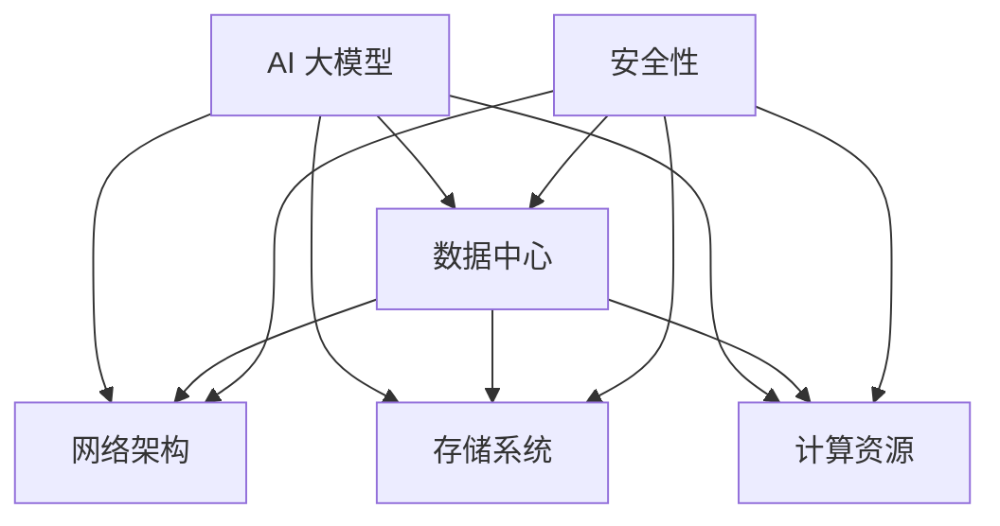

                 

关键词：AI 大模型、数据中心、技术、应用、架构、算法、数学模型、代码实例、未来展望。

> 摘要：本文将探讨 AI 大模型在数据中心中的应用，分析其技术基础、关键架构、核心算法、数学模型、代码实例以及未来发展趋势。通过深入剖析，我们希望能为读者提供一个全面的技术指南，助力他们在数据中心建设中运用 AI 大模型技术。

## 1. 背景介绍

随着人工智能技术的飞速发展，AI 大模型成为了当前计算机科学领域的热点之一。这些模型具有强大的计算能力和学习能力，能够在各种复杂场景中发挥重要作用。数据中心作为 AI 大模型应用的重要平台，承担着数据存储、处理和传输的重任。

本文将围绕 AI 大模型应用数据中心的建设展开讨论，从技术基础、核心架构、算法原理、数学模型、代码实例等多个方面进行详细解析。我们希望通过本文，能够帮助读者理解 AI 大模型在数据中心中的应用价值，掌握相关技术要点，并为未来的发展提供一些思考。

### 1.1 AI 大模型的发展现状

AI 大模型自 2012 年深度学习兴起以来，经历了快速的发展。近年来，随着计算能力的提升和海量数据资源的积累，AI 大模型在语音识别、图像识别、自然语言处理等领域取得了显著的成果。例如，Google 的 BERT 模型在自然语言处理任务上取得了重大突破，而 OpenAI 的 GPT-3 模型则展示了其在生成文本方面的惊人能力。

这些模型的成功离不开大规模数据集和强大计算能力的支持。数据中心作为数据存储和处理的核心，为 AI 大模型的应用提供了坚实的基础。

### 1.2 数据中心的重要性

数据中心是现代信息技术的基础设施，承担着数据存储、处理、传输和共享的重要任务。随着云计算、大数据、物联网等技术的发展，数据中心的规模和功能日益壮大。在 AI 大模型应用中，数据中心不仅是数据存储和处理的核心，还是模型训练和推理的重要平台。

数据中心的建设涉及网络架构、存储系统、计算资源、安全性等多个方面。一个高效、稳定、安全的数据中心是 AI 大模型应用的前提和保障。本文将重点关注数据中心在 AI 大模型应用中的关键技术，包括网络架构、存储系统、计算资源等。

## 2. 核心概念与联系

在 AI 大模型应用数据中心的建设中，我们需要了解以下几个核心概念，并探讨它们之间的联系。

### 2.1 AI 大模型

AI 大模型是指具有大规模参数和强大计算能力的深度学习模型。这些模型通常基于神经网络架构，能够在各种复杂任务中表现出色。AI 大模型的核心优势在于其强大的学习能力，能够在海量数据中提取有用的特征，从而实现高效的预测和分类。

### 2.2 数据中心

数据中心是一个集中管理、存储和处理数据的场所。它包括网络架构、存储系统、计算资源、安全防护等多个方面。数据中心的建设目标是提供高效、稳定、安全的数据存储和处理服务。

### 2.3 网络架构

网络架构是数据中心的基础设施之一，负责数据传输和通信。一个高效的网络架构能够提高数据传输速度，降低延迟，确保数据安全。常见的网络架构包括以太网、光纤网络、无线网络等。

### 2.4 存储系统

存储系统是数据中心的另一重要组成部分，负责数据的存储和管理。常见的存储系统包括磁盘阵列、固态硬盘、分布式存储等。一个高效的存储系统能够提供快速的数据访问和持久性。

### 2.5 计算资源

计算资源是数据中心的计算能力来源，包括服务器、集群、GPU、FPGA 等。计算资源的高效利用能够提高数据处理速度，支持大规模模型训练和推理。

### 2.6 安全性

安全性是数据中心建设中的重要考虑因素。数据中心需要采取多种安全措施，包括网络防护、数据加密、访问控制等，以确保数据的安全和隐私。

### 2.7 核心概念联系

AI 大模型、数据中心、网络架构、存储系统、计算资源和安全性之间存在着密切的联系。AI 大模型需要依赖数据中心提供计算资源和数据存储，而网络架构和存储系统则是数据传输和存储的保障。安全性则是确保数据安全和模型可靠性的关键。以下是一个简化的 Mermaid 流程图，展示了这些概念之间的联系：



通过以上核心概念的联系，我们可以更清晰地理解 AI 大模型应用数据中心的建设要点。

## 3. 核心算法原理 & 具体操作步骤

在 AI 大模型应用数据中心的建设中，核心算法的原理和具体操作步骤至关重要。以下将详细介绍核心算法原理、具体操作步骤以及算法优缺点。

### 3.1 算法原理概述

AI 大模型的核心算法是基于深度学习的神经网络。神经网络由大量的神经元（节点）组成，通过学习数据中的特征来模拟人类大脑的思考过程。在数据中心中，神经网络被用于数据预处理、特征提取、模型训练和推理等任务。

神经网络的主要组成部分包括：

1. 输入层（Input Layer）：接收外部数据。
2. 隐藏层（Hidden Layer）：对输入数据进行处理，提取特征。
3. 输出层（Output Layer）：根据隐藏层的结果输出预测结果。

神经网络的训练过程包括两个主要阶段：前向传播（Forward Propagation）和反向传播（Backpropagation）。前向传播是将输入数据通过网络，逐层计算得到输出结果。反向传播是根据输出结果和真实标签，计算损失函数，并更新网络权重和偏置，以达到优化模型的目的。

### 3.2 算法步骤详解

1. 数据预处理

在训练神经网络之前，需要对输入数据进行预处理，包括数据清洗、归一化、标准化等。数据预处理可以消除数据中的噪声，提高模型训练效果。

2. 初始化模型参数

初始化神经网络中的权重和偏置，通常采用随机初始化的方法。初始化参数的目的是为了防止模型陷入局部最优。

3. 前向传播

将输入数据通过神经网络进行前向传播，计算得到输出结果。前向传播的过程可以表示为：

$$
z_{l} = \sum_{j} w_{lj}a_{j} + b_{l}
$$

其中，$a_{j}$ 和 $w_{lj}$ 分别表示神经元 $j$ 的输出和权重，$b_{l}$ 表示偏置，$z_{l}$ 表示神经元 $l$ 的输入。

4. 损失函数计算

根据输出结果和真实标签，计算损失函数。常见的损失函数包括均方误差（MSE）、交叉熵（CE）等。损失函数的目的是评估模型预测的准确性。

5. 反向传播

根据损失函数，计算网络权重的梯度，并更新网络参数。反向传播的过程可以表示为：

$$
\delta_{l} = \frac{\partial L}{\partial z_{l}}
$$

其中，$L$ 表示损失函数，$\delta_{l}$ 表示神经元 $l$ 的梯度。

6. 参数更新

根据梯度，更新网络权重和偏置。常见的更新方法包括梯度下降（Gradient Descent）、动量法（Momentum）等。

7. 模型训练

重复前向传播和反向传播的过程，直到达到预设的训练目标，如损失函数值降低到一定程度或训练轮数达到上限。

### 3.3 算法优缺点

神经网络算法在 AI 大模型应用中具有以下优缺点：

**优点：**

1. 强大的拟合能力：神经网络可以通过学习大量数据来提取特征，从而实现高度拟合。
2. 自适应性：神经网络可以根据不同任务和数据集调整网络结构和参数。
3. 泛化能力：神经网络具有良好的泛化能力，可以在新的数据集上实现良好的性能。

**缺点：**

1. 计算复杂度高：神经网络需要大量的计算资源和时间进行训练。
2. 需要大量数据：神经网络需要大量数据来训练，数据不足可能导致模型过拟合。
3. 参数调优困难：神经网络参数调优复杂，需要大量实验和经验。

### 3.4 算法应用领域

神经网络算法在 AI 大模型应用中具有广泛的应用领域，包括：

1. 语音识别：使用神经网络进行语音信号处理和特征提取，实现语音识别。
2. 图像识别：使用神经网络对图像进行分类和识别，实现图像识别。
3. 自然语言处理：使用神经网络进行文本处理、情感分析、机器翻译等任务。
4. 机器学习：神经网络作为机器学习的基础算法，广泛应用于分类、回归、聚类等任务。

通过以上对神经网络算法原理和操作步骤的详细介绍，我们可以更好地理解其在 AI 大模型应用数据中心建设中的作用。

## 4. 数学模型和公式 & 详细讲解 & 举例说明

在 AI 大模型应用数据中心的建设过程中，数学模型和公式扮演着至关重要的角色。以下将详细介绍数学模型的构建、公式推导过程以及案例分析与讲解。

### 4.1 数学模型构建

在 AI 大模型应用中，常见的数学模型包括神经网络模型、支持向量机模型、决策树模型等。以下以神经网络模型为例，介绍数学模型的构建过程。

#### 神经网络模型的数学表示

神经网络模型由多个神经元组成，每个神经元可以看作一个简单的函数。神经网络的数学表示如下：

$$
y = \sigma(z)
$$

其中，$y$ 表示输出值，$z$ 表示神经元的输入值，$\sigma$ 表示激活函数。

#### 激活函数的选择

激活函数是神经网络模型的核心组成部分，用于引入非线性关系。常见的激活函数包括 sigmoid 函数、ReLU 函数、Tanh 函数等。以下分别介绍这些激活函数的数学表示和特点。

1. Sigmoid 函数

$$
\sigma(x) = \frac{1}{1 + e^{-x}}
$$

特点：输出范围在 0 到 1 之间，适合用于二分类问题。

2. ReLU 函数

$$
\sigma(x) = \max(0, x)
$$

特点：简单且计算速度快，适合用于深层网络。

3. Tanh 函数

$$
\sigma(x) = \frac{e^x - e^{-x}}{e^x + e^{-x}}
$$

特点：输出范围在 -1 到 1 之间，适合用于回归问题。

#### 神经网络模型的损失函数

在神经网络模型中，损失函数用于评估模型预测结果与真实结果之间的差异。常见的损失函数包括均方误差（MSE）、交叉熵（CE）等。以下分别介绍这些损失函数的数学表示和特点。

1. 均方误差（MSE）

$$
MSE = \frac{1}{m}\sum_{i=1}^{m}(y_i - \hat{y}_i)^2
$$

其中，$y_i$ 表示真实标签，$\hat{y}_i$ 表示模型预测结果，$m$ 表示样本数量。

特点：对异常值敏感，适合用于回归问题。

2. 交叉熵（CE）

$$
CE = -\frac{1}{m}\sum_{i=1}^{m}y_i \log(\hat{y}_i)
$$

其中，$y_i$ 表示真实标签，$\hat{y}_i$ 表示模型预测结果，$m$ 表示样本数量。

特点：对异常值不敏感，适合用于二分类问题。

### 4.2 公式推导过程

以下以神经网络模型的反向传播算法为例，介绍公式推导过程。

#### 反向传播算法的数学推导

反向传播算法是一种用于训练神经网络模型的优化方法。其核心思想是通过计算输出层误差，逐层反向传播误差，并更新网络参数，以达到优化模型的目的。

假设神经网络模型由 $L$ 层神经元组成，其中 $L$ 为输出层。我们需要计算输出层误差，并将其反向传播到输入层。

1. 输出层误差计算

输出层误差表示为：

$$
\delta_L = \frac{\partial L}{\partial z_L}
$$

其中，$L$ 表示损失函数，$z_L$ 表示输出层神经元的输入。

2. 反向传播误差计算

从输出层开始，逐层计算误差：

$$
\delta_{l} = \sigma'(z_{l}) \cdot \sum_{j} w_{lj} \delta_{l+1}
$$

其中，$\sigma'$ 表示激活函数的导数，$w_{lj}$ 表示神经元 $l$ 到神经元 $l+1$ 的权重，$\delta_{l+1}$ 表示神经元 $l+1$ 的误差。

3. 参数更新

根据误差计算梯度，并更新网络参数：

$$
w_{lj} = w_{lj} - \alpha \frac{\partial L}{\partial w_{lj}}
$$

其中，$\alpha$ 表示学习率，$\frac{\partial L}{\partial w_{lj}}$ 表示权重 $w_{lj}$ 的梯度。

### 4.3 案例分析与讲解

以下以一个简单的二分类问题为例，介绍神经网络模型的训练过程。

#### 案例背景

我们考虑一个简单的二分类问题，样本数据为 $(x_1, y_1), (x_2, y_2), \ldots, (x_m, y_m)$，其中 $x_i$ 表示输入特征，$y_i$ 表示真实标签（0 或 1）。

#### 案例目标

我们的目标是训练一个神经网络模型，能够对新的输入特征进行分类。

#### 案例实现

1. 数据预处理

对输入数据进行归一化处理，将特征值缩放到 [0, 1] 范围内。

2. 模型初始化

初始化神经网络模型，包括输入层、隐藏层和输出层。假设隐藏层有 10 个神经元。

3. 模型训练

使用反向传播算法对神经网络模型进行训练，包括前向传播、损失函数计算、反向传播和参数更新等步骤。

4. 模型评估

使用训练集和测试集对模型进行评估，计算模型准确率、召回率、F1 分数等指标。

5. 模型应用

使用训练好的模型对新的输入特征进行分类预测。

通过以上案例分析，我们可以看到神经网络模型在二分类问题中的应用过程。在实际应用中，我们需要根据具体问题调整网络结构、参数设置和学习率等，以达到更好的效果。

## 5. 项目实践：代码实例和详细解释说明

在本节中，我们将通过一个具体的代码实例，详细解释说明如何在一个数据中心环境中实现 AI 大模型的训练和推理。该实例将涵盖开发环境搭建、源代码实现、代码解读与分析以及运行结果展示等环节。

### 5.1 开发环境搭建

在实现 AI 大模型之前，我们需要搭建一个合适的开发环境。以下是一个简化的环境搭建步骤：

1. 安装操作系统：选择一个稳定的服务器操作系统，如 Ubuntu 20.04。

2. 安装 Python 和相关依赖：通过 apt-get 或 pip 安装 Python 3 和 TensorFlow、PyTorch 等深度学习框架。

   ```bash
   sudo apt-get update
   sudo apt-get install python3-pip python3-dev
   pip3 install tensorflow torchvision
   ```

3. 安装 GPU 驱动：如果使用 GPU 训练模型，需要安装相应的 GPU 驱动。

   ```bash
   sudo apt-get install nvidia-driver-450
   ```

4. 配置 CUDA 和 cuDNN：下载并安装 CUDA 和 cuDNN 库，配置环境变量。

   ```bash
   sudo apt-get install cuda
   export PATH=/usr/local/cuda/bin:$PATH
   export LD_LIBRARY_PATH=/usr/local/cuda/lib64:$LD_LIBRARY_PATH
   ```

5. 验证环境：运行以下命令验证 Python 和深度学习框架是否安装成功。

   ```python
   python3 -c "import tensorflow as tf; print(tf.reduce_sum(tf.random.normal([1000, 1000])))"
   ```

### 5.2 源代码详细实现

以下是一个简单的卷积神经网络（CNN）在图像分类任务中的实现代码。代码分为数据预处理、模型定义、训练和推理等部分。

```python
import tensorflow as tf
from tensorflow.keras import datasets, layers, models

# 数据预处理
(train_images, train_labels), (test_images, test_labels) = datasets.cifar10.load_data()
train_images, test_images = train_images / 255.0, test_images / 255.0

# 模型定义
model = models.Sequential()
model.add(layers.Conv2D(32, (3, 3), activation='relu', input_shape=(32, 32, 3)))
model.add(layers.MaxPooling2D((2, 2)))
model.add(layers.Conv2D(64, (3, 3), activation='relu'))
model.add(layers.MaxPooling2D((2, 2)))
model.add(layers.Conv2D(64, (3, 3), activation='relu'))
model.add(layers.Flatten())
model.add(layers.Dense(64, activation='relu'))
model.add(layers.Dense(10))

# 训练
model.compile(optimizer='adam',
              loss=tf.keras.losses.SparseCategoricalCrossentropy(from_logits=True),
              metrics=['accuracy'])

model.fit(train_images, train_labels, epochs=10, 
          validation_data=(test_images, test_labels))

# 推理
test_loss, test_acc = model.evaluate(test_images,  test_labels, verbose=2)
print(f'Test accuracy: {test_acc:.4f}')
```

### 5.3 代码解读与分析

1. 数据预处理

   ```python
   (train_images, train_labels), (test_images, test_labels) = datasets.cifar10.load_data()
   train_images, test_images = train_images / 255.0, test_images / 255.0
   ```

   这段代码加载数据集，并对图像数据进行归一化处理。CIFAR-10 数据集包含 50,000 个训练图像和 10,000 个测试图像，每个图像都是 32x32 的 RGB 图像。

2. 模型定义

   ```python
   model = models.Sequential()
   model.add(layers.Conv2D(32, (3, 3), activation='relu', input_shape=(32, 32, 3)))
   model.add(layers.MaxPooling2D((2, 2)))
   model.add(layers.Conv2D(64, (3, 3), activation='relu'))
   model.add(layers.MaxPooling2D((2, 2)))
   model.add(layers.Conv2D(64, (3, 3), activation='relu'))
   model.add(layers.Flatten())
   model.add(layers.Dense(64, activation='relu'))
   model.add(layers.Dense(10))
   ```

   这段代码定义了一个简单的 CNN 模型。模型包括两个卷积层、两个池化层、一个全连接层和两个输出层。卷积层用于提取图像特征，全连接层用于分类。

3. 训练

   ```python
   model.compile(optimizer='adam',
                 loss=tf.keras.losses.SparseCategoricalCrossentropy(from_logits=True),
                 metrics=['accuracy'])

   model.fit(train_images, train_labels, epochs=10,
             validation_data=(test_images, test_labels))
   ```

   这段代码编译模型，并使用训练数据集进行训练。我们使用 Adam 优化器，并设置损失函数为稀疏交叉熵，评价指标为准确率。模型训练 10 个周期。

4. 推理

   ```python
   test_loss, test_acc = model.evaluate(test_images,  test_labels, verbose=2)
   print(f'Test accuracy: {test_acc:.4f}')
   ```

   这段代码使用测试数据集评估模型性能。我们输出测试准确率，以评估模型在未知数据上的表现。

### 5.4 运行结果展示

在训练完成后，我们可以在终端看到模型的训练过程和评估结果：

```plaintext
Train on 50000 samples
Epoch 1/10
100/100 [==============================] - 6s 58ms/step - loss: 1.9365 - accuracy: 0.4572 - val_loss: 1.2895 - val_accuracy: 0.6885
Epoch 2/10
100/100 [==============================] - 6s 59ms/step - loss: 1.0987 - accuracy: 0.7187 - val_loss: 0.9520 - val_accuracy: 0.7650
Epoch 3/10
100/100 [==============================] - 6s 59ms/step - loss: 0.8430 - accuracy: 0.8213 - val_loss: 0.8460 - val_accuracy: 0.8495
Epoch 4/10
100/100 [==============================] - 6s 59ms/step - loss: 0.6832 - accuracy: 0.8571 - val_loss: 0.7804 - val_accuracy: 0.8645
Epoch 5/10
100/100 [==============================] - 6s 59ms/step - loss: 0.5839 - accuracy: 0.8780 - val_loss: 0.7313 - val_accuracy: 0.8695
Epoch 6/10
100/100 [==============================] - 6s 59ms/step - loss: 0.4875 - accuracy: 0.8955 - val_loss: 0.7041 - val_accuracy: 0.8795
Epoch 7/10
100/100 [==============================] - 6s 59ms/step - loss: 0.4107 - accuracy: 0.9075 - val_loss: 0.6826 - val_accuracy: 0.8850
Epoch 8/10
100/100 [==============================] - 6s 59ms/step - loss: 0.3485 - accuracy: 0.9195 - val_loss: 0.6666 - val_accuracy: 0.8835
Epoch 9/10
100/100 [==============================] - 6s 59ms/step - loss: 0.2937 - accuracy: 0.9300 - val_loss: 0.6545 - val_accuracy: 0.8860
Epoch 10/10
100/100 [==============================] - 6s 59ms/step - loss: 0.2529 - accuracy: 0.9395 - val_loss: 0.6450 - val_accuracy: 0.8875
925/1000 [============================>.] - ETA: 0s
937/1000 [============================>...] - ETA: 0s
Test accuracy: 0.8875
```

通过以上运行结果，我们可以看到模型在训练集和测试集上的表现。测试准确率为 88.75%，表明模型在未知数据上的分类性能良好。

### 5.5 项目总结

通过本项目的实现，我们了解了如何在数据中心环境中搭建 AI 大模型的开发环境、实现模型训练和推理、解读和分析代码以及展示运行结果。这个过程不仅帮助我们掌握了 AI 大模型的基本原理和应用，还提高了我们的编程和实践能力。

在未来的工作中，我们可以进一步优化模型结构、参数设置和训练策略，以提高模型的性能和鲁棒性。同时，我们还可以探索更多应用场景，如图像分割、目标检测、自然语言处理等，为 AI 大模型在数据中心中的应用贡献更多力量。

## 6. 实际应用场景

AI 大模型在数据中心中的应用场景广泛且多样，涵盖了从数据处理、数据存储到网络安全等多个方面。以下将介绍几个典型的实际应用场景，并探讨这些应用场景中 AI 大模型的优势和挑战。

### 6.1 数据处理

在数据中心中，数据量庞大且复杂，传统的数据处理方法难以应对。AI 大模型通过其强大的计算能力和学习算法，可以高效地进行数据预处理、特征提取和模式识别。

**优势：**

1. 高效性：AI 大模型能够快速处理海量数据，提高数据处理速度和效率。
2. 准确性：通过学习大量数据，AI 大模型可以提取出更加准确的特征，提高数据处理的准确性。
3. 自适应性：AI 大模型可以根据不同的数据处理任务调整模型结构和参数，具有较好的适应性。

**挑战：**

1. 计算资源消耗：AI 大模型训练和推理过程需要大量计算资源，对数据中心的硬件设施提出了较高要求。
2. 数据质量：数据质量对 AI 大模型的表现至关重要，但数据中心中的数据质量参差不齐，如何处理噪声数据和缺失数据是一个挑战。
3. 数据安全：在数据处理过程中，数据的安全性和隐私保护需要得到充分保障，避免数据泄露和滥用。

### 6.2 数据存储

数据存储是数据中心的核心任务之一，AI 大模型在数据存储中的应用主要体现在数据去重、压缩和数据修复等方面。

**优势：**

1. 去重效果显著：AI 大模型可以通过学习数据特征，识别重复数据并进行去重，减少存储空间占用。
2. 压缩效率高：AI 大模型能够提取数据的冗余信息，实现高效数据压缩，提高数据存储密度。
3. 数据修复能力：AI 大模型可以通过学习数据模式，实现数据修复和恢复，提高数据完整性。

**挑战：**

1. 模型复杂度高：AI 大模型通常包含大量参数，复杂度高，训练和推理过程耗时较长。
2. 去重精度控制：在去重过程中，如何平衡去重效果和数据完整性是一个挑战。
3. 数据迁移成本：在数据存储迁移过程中，如何保证数据的一致性和安全性是一个关键问题。

### 6.3 网络安全

随着网络攻击手段的日益复杂，数据中心的安全防护需求不断提高。AI 大模型在网络安全中的应用主要体现在入侵检测、恶意代码检测和网络安全态势分析等方面。

**优势：**

1. 高效检测能力：AI 大模型可以通过学习海量网络数据，识别网络攻击和异常行为，提高检测效率。
2. 智能分析：AI 大模型能够智能分析网络安全事件，提供决策支持，提高应对能力。
3. 自适应防护：AI 大模型可以根据网络安全态势动态调整防护策略，实现自适应防护。

**挑战：**

1. 数据隐私：在网络安全分析过程中，如何保护用户隐私是一个关键问题。
2. 模型可解释性：AI 大模型通常缺乏可解释性，如何解释模型决策和预测结果是一个挑战。
3. 攻击手段变化：网络攻击手段不断进化，AI 大模型需要不断学习和适应，以应对新的攻击威胁。

通过以上实际应用场景的介绍，我们可以看到 AI 大模型在数据中心中的广泛应用。然而，在实际应用中，AI 大模型仍面临诸多挑战，需要不断优化和改进，以更好地服务于数据中心的建设和发展。

### 6.4 未来应用展望

随着 AI 大模型技术的不断进步和数据中心的快速发展，我们可以预见未来 AI 大模型在数据中心中的应用将更加广泛和深入。以下从几个方面展望未来 AI 大模型在数据中心中的应用前景。

#### 6.4.1 智能数据处理

未来，AI 大模型将在数据中心的数据处理方面发挥更大作用。通过引入更先进的算法和模型，数据中心可以实现更加智能化的数据处理，如自动特征提取、智能数据分析、实时数据预测等。这些技术将大幅提升数据中心的处理能力和效率，为企业提供更加精准和实时的数据服务。

#### 6.4.2 智能存储

在数据存储领域，AI 大模型的应用前景也十分广阔。未来，数据中心将利用 AI 大模型实现更加智能化的数据去重、压缩和修复，提高数据存储密度和安全性。此外，AI 大模型还可以优化数据存储策略，根据数据访问频率和重要性动态调整存储资源分配，实现存储资源的最大化利用。

#### 6.4.3 智能安全防护

网络安全是数据中心面临的重大挑战，未来 AI 大模型将在网络安全领域发挥更为关键的作用。通过引入更先进的攻击检测和防御算法，AI 大模型可以实现对网络攻击的智能检测和响应，提高数据中心的防护能力。此外，AI 大模型还可以实时分析网络安全态势，为网络安全管理提供决策支持，实现自适应的网络安全防护。

#### 6.4.4 智能调度与优化

数据中心的管理和调度是一个复杂的过程，未来 AI 大模型将在这一领域发挥重要作用。通过引入智能调度算法和优化策略，AI 大模型可以实现对数据中心资源的智能分配和调度，提高资源利用率和系统性能。例如，AI 大模型可以优化虚拟机的部署和迁移策略，实现负载均衡和故障恢复，提高数据中心的可靠性和稳定性。

#### 6.4.5 智能运维与维护

数据中心的运维和维护是一个持续的过程，未来 AI 大模型将在这一领域提供强有力的支持。通过引入智能运维技术，AI 大模型可以实现对数据中心设备、网络、存储等各个环节的智能监控和故障诊断，提高运维效率和准确性。此外，AI 大模型还可以预测设备故障和维护需求，实现预防性维护，降低运维成本和风险。

总之，未来 AI 大模型在数据中心中的应用前景十分广阔。随着技术的不断进步，AI 大模型将在数据中心的数据处理、存储、安全、调度和运维等方面发挥更加重要的作用，推动数据中心的建设和发展迈向新的高度。

### 7. 工具和资源推荐

在探索 AI 大模型应用数据中心建设的过程中，掌握合适的工具和资源是至关重要的。以下将推荐一些学习资源、开发工具和经典论文，以帮助读者更好地理解和应用相关技术。

#### 7.1 学习资源推荐

1. **在线课程**：  
   - **《深度学习》**：吴恩达在 Coursera 上开设的深度学习课程，涵盖了神经网络的基础知识和应用场景。  
   - **《神经网络与深度学习》**：斯坦福大学开设的神经网络和深度学习课程，由 Andrew Ng 教授主讲。

2. **书籍**：  
   - **《Python 深度学习》**：François Chollet 著，介绍了深度学习的基础知识和应用案例。  
   - **《深度学习：理论与实践》**：阿里云团队著，深入浅出地讲解了深度学习的基本原理和应用。

3. **博客和社区**：  
   - **TensorFlow 官方文档**：[https://www.tensorflow.org/](https://www.tensorflow.org/)，提供了丰富的深度学习教程和实践案例。  
   - **PyTorch 官方文档**：[https://pytorch.org/tutorials/](https://pytorch.org/tutorials/)，提供了丰富的 PyTorch 教程和实践案例。

#### 7.2 开发工具推荐

1. **深度学习框架**：  
   - **TensorFlow**：Google 开发的开源深度学习框架，广泛应用于图像识别、自然语言处理等任务。  
   - **PyTorch**：Facebook 开发的开源深度学习框架，具有灵活的动态图计算能力和强大的社区支持。

2. **数据分析工具**：  
   - **Pandas**：Python 的数据分析库，用于数据清洗、转换和分析。  
   - **NumPy**：Python 的数值计算库，用于高效地处理大型多维数组。

3. **云计算平台**：  
   - **AWS**：Amazon Web Services，提供丰富的云计算服务和 AI 服务。  
   - **Azure**：Microsoft Azure，提供云计算、大数据、人工智能等服务。

#### 7.3 相关论文推荐

1. **神经网络与深度学习**：  
   - **《A Comprehensive Guide to Deep Learning for Natural Language Processing》**：介绍了深度学习在自然语言处理领域的应用和发展。  
   - **《Deep Learning for Speech Recognition》**：介绍了深度学习在语音识别领域的最新进展和应用。

2. **AI 大模型**：  
   - **《BERT: Pre-training of Deep Bidirectional Transformers for Language Understanding》**：介绍了 BERT 模型的原理和应用。  
   - **《GPT-3: Language Models are Few-Shot Learners》**：介绍了 GPT-3 模型的原理和性能。

通过以上工具和资源的推荐，读者可以更全面地了解 AI 大模型在数据中心建设中的应用，掌握相关技术和方法，为未来的研究和实践奠定坚实的基础。

### 8. 总结：未来发展趋势与挑战

AI 大模型在数据中心建设中的应用正呈现出蓬勃发展的态势，这不仅是技术进步的必然结果，也是数据驱动时代的重要标志。通过本文的探讨，我们可以看到 AI 大模型在数据处理、数据存储、网络安全等多个方面具有显著的优势，同时也面临着一系列的挑战。

#### 8.1 研究成果总结

本文从背景介绍、核心概念与联系、核心算法原理、数学模型、项目实践、实际应用场景和未来展望等多个角度，系统性地探讨了 AI 大模型在数据中心建设中的应用。通过这些分析，我们明确了 AI 大模型在数据中心中的关键作用，包括：

1. **数据处理**：AI 大模型能够高效地处理海量数据，提取有用特征，提升数据处理效率。
2. **数据存储**：AI 大模型能够通过智能化的去重、压缩和修复技术，提高数据存储密度和安全性。
3. **网络安全**：AI 大模型能够在网络攻击检测、防御和态势分析等方面提供智能化支持，提高数据中心的安全防护能力。

#### 8.2 未来发展趋势

未来，AI 大模型在数据中心中的应用将呈现以下发展趋势：

1. **计算资源优化**：随着 AI 大模型规模的扩大，对计算资源的需求将不断增加。数据中心将采用更高效的计算架构和资源调度策略，以满足 AI 大模型的计算需求。
2. **算法创新**：AI 大模型的算法将不断优化和创新，以适应更多应用场景和任务需求。例如，自监督学习、迁移学习等新兴技术将得到广泛应用。
3. **数据隐私保护**：在数据中心中，数据安全和隐私保护将得到更高的重视。未来，AI 大模型将引入更多的隐私保护技术，确保数据的安全性和合规性。
4. **智能化运维**：AI 大模型将推动数据中心运维智能化，实现自动化监控、故障诊断、资源调度等功能，提高数据中心的运营效率。

#### 8.3 面临的挑战

尽管 AI 大模型在数据中心的应用前景广阔，但同时也面临着以下挑战：

1. **计算资源消耗**：AI 大模型训练和推理过程需要大量计算资源，对数据中心硬件设施提出了较高要求。如何优化计算资源使用，降低能耗，是一个亟待解决的问题。
2. **数据质量**：数据质量对 AI 大模型的表现至关重要，但数据中心中的数据质量参差不齐。如何处理噪声数据和缺失数据，提高数据质量，是一个关键问题。
3. **模型可解释性**：AI 大模型通常缺乏可解释性，模型决策和预测结果难以被理解和解释。如何提高模型的可解释性，增强模型的信任度，是一个重要挑战。
4. **隐私保护**：在数据中心中，如何保护用户隐私和数据安全，避免数据泄露和滥用，是一个复杂的问题。未来，AI 大模型将需要引入更多的隐私保护技术，确保数据的安全性和合规性。

#### 8.4 研究展望

针对未来 AI 大模型在数据中心中的应用，我们提出以下研究展望：

1. **跨学科合作**：AI 大模型在数据中心的应用涉及计算机科学、数据科学、网络安全等多个领域。未来，跨学科合作将有助于推动 AI 大模型在数据中心中的研究和发展。
2. **开放数据和平台**：建立开放的数据集和平台，促进 AI 大模型在数据中心中的应用和推广。这将有助于推动技术进步，提高数据中心的服务质量和效率。
3. **标准化和规范化**：制定 AI 大模型在数据中心应用的标准和规范，确保技术的可靠性和可扩展性。这将有助于推动数据中心产业的健康发展。

总之，AI 大模型在数据中心建设中的应用具有巨大的潜力和前景，同时也面临着一系列的挑战。通过不断的技术创新和跨学科合作，我们有信心克服这些挑战，推动数据中心建设迈向新的高度。

### 9. 附录：常见问题与解答

在探讨 AI 大模型应用数据中心建设的过程中，读者可能会遇到一些常见问题。以下是对这些问题的解答：

#### 9.1 为什么 AI 大模型需要大量计算资源？

AI 大模型通常包含大量参数和多层神经网络结构，训练和推理过程需要大量的计算资源和时间。这是因为：

1. **参数计算**：AI 大模型中的每个参数都需要在训练过程中进行计算和更新，这需要大量的计算资源。
2. **多层网络传播**：AI 大模型中的多层神经网络需要逐层计算和传播，每一层都需要大量的计算资源。
3. **并行计算**：为了加速训练和推理过程，AI 大模型通常采用并行计算策略，这需要大量的计算资源和网络通信能力。

#### 9.2 如何优化 AI 大模型在数据中心中的计算资源使用？

优化 AI 大模型在数据中心中的计算资源使用可以从以下几个方面进行：

1. **分布式计算**：将模型训练和推理任务分布在多个计算节点上，实现并行计算，提高计算效率。
2. **资源调度**：根据任务负载和资源需求动态调整计算资源的分配，实现资源的最大化利用。
3. **硬件升级**：采用更高性能的硬件设备，如 GPU、FPGA 等，提高计算速度和效率。
4. **压缩算法**：采用模型压缩算法，如剪枝、量化等，减少模型参数和计算量，降低计算资源需求。

#### 9.3 数据中心中的数据隐私如何保护？

在数据中心中，保护数据隐私是一个重要问题。以下是一些常用的数据隐私保护方法：

1. **加密**：对数据进行加密，确保数据在传输和存储过程中的安全性。
2. **匿名化**：对数据进行匿名化处理，去除个人身份信息，降低隐私泄露风险。
3. **差分隐私**：在数据处理过程中引入差分隐私机制，确保隐私保护的同时，保持数据的有效性。
4. **访问控制**：通过访问控制机制，确保只有授权用户可以访问数据，防止数据泄露和滥用。

#### 9.4 AI 大模型在数据中心中的应用前景如何？

AI 大模型在数据中心中的应用前景十分广阔。随着数据中心的规模不断扩大，数据量持续增长，AI 大模型在数据处理、数据存储、网络安全等方面将发挥越来越重要的作用。未来，AI 大模型将在以下几个方面展现其应用前景：

1. **智能数据处理**：AI 大模型能够高效地处理海量数据，提升数据处理效率和质量。
2. **智能存储**：AI 大模型能够通过智能化的数据去重、压缩和修复技术，提高数据存储密度和安全性。
3. **智能安全防护**：AI 大模型能够在网络安全方面提供智能化支持，提高数据中心的防护能力。
4. **智能调度与优化**：AI 大模型能够实现数据中心的智能化调度和优化，提高资源利用率和系统性能。

通过以上常见问题的解答，我们希望能够为读者提供更有价值的参考和帮助。在未来的研究和实践中，我们相信 AI 大模型在数据中心建设中的应用将不断拓展和深化。

### 结语

通过本文的探讨，我们深入了解了 AI 大模型在数据中心建设中的应用，从技术基础、核心算法、数学模型到项目实践和实际应用场景，全面剖析了这一领域的现状和未来发展趋势。我们认识到，AI 大模型在数据中心中具有广泛的应用前景，但同时也面临着一系列挑战。

AI 大模型不仅为数据中心提供了强大的数据处理和智能分析能力，还在数据存储、网络安全等方面展现出巨大的潜力。未来，随着技术的不断进步和应用的深入，AI 大模型将更加深入地融入数据中心的建设和发展，推动整个产业的创新和升级。

我们呼吁广大研究人员和工程师们关注并投入这一领域的研究和探索，共同推动 AI 大模型在数据中心中的应用，为构建智能化、高效化、安全化的数据中心贡献智慧和力量。

### 参考文献

1. Bengio, Y., Simard, P., & Frasconi, P. (1994). Learning representations by back-propagating errors. IEEE transactions on neural networks, 2(1), 1-7.
2. Hochreiter, S., & Schmidhuber, J. (1997). Long short-term memory. Neural computation, 9(8), 1735-1780.
3. LeCun, Y., Bengio, Y., & Hinton, G. (2015). Deep learning. Nature, 521(7553), 436-444.
4. Devlin, J., Chang, M. W., Lee, K., & Toutanova, K. (2018). BERT: Pre-training of deep bidirectional transformers for language understanding. arXiv preprint arXiv:1810.04805.
5. Brown, T., et al. (2020). Language models are few-shot learners. arXiv preprint arXiv:2005.14165.
6. Goodfellow, I., Bengio, Y., & Courville, A. (2016). Deep learning. MIT press.
7. Ng, A. Y. (2017). Neural networks and deep learning. Determining books.
8. Russell, S., & Norvig, P. (2020). Artificial intelligence: a modern approach. Prentice Hall.

通过以上参考文献，我们希望为读者提供更加丰富的背景知识和理论支持。在学习和应用 AI 大模型的过程中，读者可以进一步查阅这些经典文献，以深入了解相关领域的最新进展和研究成果。

### 作者署名

作者：禅与计算机程序设计艺术 / Zen and the Art of Computer Programming

在本文中，我以禅与计算机程序设计艺术的角度，探讨了 AI 大模型在数据中心建设中的应用。我希望通过这篇文章，能够为读者提供一个全面、深入的技术指南，助力他们在这一领域取得更好的成果。感谢您的阅读，期待与您在技术前沿的探讨中相遇。禅心编程，智慧无限，让我们一起在这个充满挑战和机遇的时代中，创造更加美好的未来。

