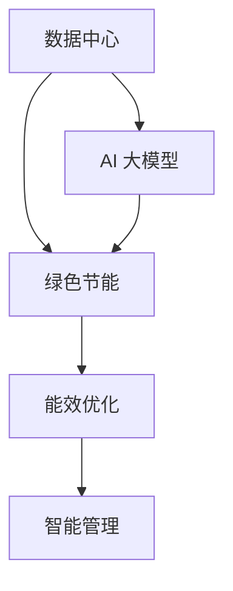

                 

关键词：数据中心、绿色节能、AI 大模型、能效优化、碳排放减少

摘要：随着 AI 大模型的广泛应用，数据中心的能耗问题日益凸显。本文从数据中心绿色节能的角度出发，探讨了 AI 大模型应用数据中心建设的必要性，以及通过能效优化、技术创新和智能管理等多方面实现数据中心绿色节能的路径。文章旨在为数据中心建设和运营提供有益的参考和指导。

## 1. 背景介绍

数据中心作为现代信息社会的基石，承载着海量数据的存储、处理和交换。随着云计算、大数据、物联网等技术的快速发展，数据中心的重要性不断提升。然而，数据中心的高能耗问题也日益突出，成为制约其可持续发展的重要因素。

据统计，全球数据中心的能耗已经超过了全球总能耗的 1%，并且这一数字还在不断攀升。传统数据中心在能源消耗、空间占用、碳排放等方面存在诸多问题，如服务器冷却、电力供应、设备散热等，都可能导致能源浪费和环境污染。

与此同时，AI 大模型的兴起为数据中心带来了新的挑战。AI 大模型通常需要大量的计算资源和数据存储，导致数据中心的负荷进一步增加。如果不能有效解决能耗问题，不仅会导致运营成本上升，还会对环境造成负面影响。

因此，实现数据中心的绿色节能已成为当前亟待解决的问题。本文将从 AI 大模型应用数据中心的背景出发，分析绿色节能的重要性，探讨实现数据中心绿色节能的路径。

## 2. 核心概念与联系

为了深入理解数据中心绿色节能的内涵，我们需要从以下几个核心概念入手：

### 2.1 数据中心

数据中心（Data Center）是指专门为存放、处理和管理大量数据的建筑物或场所。它通常包括服务器机房、网络设备、存储设备、空调系统等。数据中心的性能直接影响着企业的业务连续性和数据安全性。

### 2.2 绿色节能

绿色节能是指在保证数据中心正常运行的前提下，通过技术创新、管理优化等手段降低能源消耗和碳排放，实现可持续发展。绿色节能不仅有助于减少企业的运营成本，还有利于环境保护。

### 2.3 AI 大模型

AI 大模型是指通过深度学习、强化学习等机器学习技术训练出的具有强大计算能力和自主决策能力的模型。AI 大模型的应用场景广泛，包括语音识别、图像处理、自然语言处理等。然而，这些模型通常需要大量的计算资源和数据存储，对数据中心的能耗产生影响。

### 2.4 能效优化

能效优化是指通过技术手段和管理优化提高数据中心的能源利用效率。能效优化包括硬件优化、软件优化、架构优化等方面，旨在降低能源消耗和运行成本。

### 2.5 智能管理

智能管理是指通过物联网、大数据、人工智能等技术实现数据中心自动化、智能化的管理。智能管理能够实时监测数据中心的运行状态，优化资源配置，提高运维效率。

为了更好地理解这些概念之间的关系，我们可以用 Mermaid 流程图展示它们之间的联系：



通过这个流程图，我们可以看出数据中心、绿色节能、能效优化和智能管理之间的紧密联系。数据中心是绿色节能和能效优化的基础，而 AI 大模型的应用又对数据中心提出了更高的能耗需求。智能管理则是在绿色节能和能效优化的基础上，实现数据中心自动化、智能化的关键。

## 3. 核心算法原理 & 具体操作步骤

### 3.1 算法原理概述

数据中心绿色节能的核心算法主要包括能效优化算法、智能调度算法和智能监控算法等。这些算法通过优化数据中心的能源使用、资源分配和设备管理，实现绿色节能的目标。

#### 3.1.1 能效优化算法

能效优化算法主要通过以下方式实现：

1. **硬件优化**：采用高性能、低功耗的服务器硬件，优化数据中心的硬件配置，降低能耗。
2. **软件优化**：通过虚拟化技术、容器化技术等软件手段，提高数据中心的资源利用效率，降低能耗。
3. **架构优化**：优化数据中心的网络架构和存储架构，提高数据处理和存储效率，降低能耗。

#### 3.1.2 智能调度算法

智能调度算法主要通过以下方式实现：

1. **动态负载均衡**：根据数据中心的实际负载情况，动态调整服务器、网络和存储资源，实现资源利用率最大化。
2. **能量管理**：通过预测和实时监控数据中心的能耗情况，调整电力供应和分配，实现能耗的最优化。

#### 3.1.3 智能监控算法

智能监控算法主要通过以下方式实现：

1. **实时监测**：实时监测数据中心的各项运行指标，包括能耗、温度、湿度等，及时发现异常情况。
2. **预警与处理**：根据监控数据，预测潜在的问题，提前预警，并采取相应的措施进行解决。

### 3.2 算法步骤详解

#### 3.2.1 能效优化算法步骤

1. **数据采集**：通过传感器、监控系统等设备，采集数据中心的能耗、温度、湿度等运行数据。
2. **数据处理**：对采集到的数据进行预处理，包括数据清洗、去噪、归一化等，为后续分析提供准确的数据基础。
3. **硬件优化**：根据数据处理结果，优化数据中心的硬件配置，如更换低功耗服务器、调整设备布局等。
4. **软件优化**：通过虚拟化技术、容器化技术等，优化数据中心的软件配置，提高资源利用效率。
5. **架构优化**：根据数据处理结果，优化数据中心的网络架构和存储架构，提高数据处理和存储效率。

#### 3.2.2 智能调度算法步骤

1. **负载预测**：基于历史数据和实时监测数据，预测数据中心的未来负载情况。
2. **资源分配**：根据负载预测结果，动态调整服务器、网络和存储资源，实现资源利用率最大化。
3. **能量管理**：根据能耗预测结果，调整电力供应和分配，实现能耗的最优化。

#### 3.2.3 智能监控算法步骤

1. **数据采集**：通过传感器、监控系统等设备，采集数据中心的能耗、温度、湿度等运行数据。
2. **实时监测**：实时监测数据中心的各项运行指标，包括能耗、温度、湿度等，及时发现异常情况。
3. **预警与处理**：根据监控数据，预测潜在的问题，提前预警，并采取相应的措施进行解决。

### 3.3 算法优缺点

#### 3.3.1 能效优化算法

**优点**：

1. **降低能耗**：通过硬件优化、软件优化和架构优化，有效降低数据中心的能耗。
2. **提高效率**：优化数据中心的资源利用效率，提高业务处理能力。

**缺点**：

1. **初期成本较高**：硬件优化、软件优化和架构优化需要投入较高的初期成本。
2. **实施难度大**：需要具备专业的技术知识和实施经验，实施过程较为复杂。

#### 3.3.2 智能调度算法

**优点**：

1. **动态调整**：根据实时负载情况，动态调整资源分配，提高资源利用率。
2. **能量管理**：通过能量管理，实现能耗的最优化，降低运行成本。

**缺点**：

1. **实现难度大**：需要实现复杂的负载预测和能量管理算法，实现过程较为复杂。
2. **系统稳定性**：动态调整可能导致系统不稳定，需要保证系统的高可用性。

#### 3.3.3 智能监控算法

**优点**：

1. **实时监测**：实时监测数据中心的运行状态，及时发现异常情况。
2. **预警与处理**：提前预警，及时处理潜在问题，保证数据中心的稳定运行。

**缺点**：

1. **监控成本高**：需要部署大量的传感器和监控系统，监控成本较高。
2. **数据安全**：实时监测可能涉及到数据安全和隐私问题，需要确保数据的安全性。

### 3.4 算法应用领域

#### 3.4.1 互联网企业

互联网企业是数据中心的主要用户之一，它们通常需要处理大量的数据，对数据中心的能耗和效率有较高的要求。能效优化算法、智能调度算法和智能监控算法可以在互联网企业的数据中心中广泛应用，帮助企业降低能耗、提高效率。

#### 3.4.2 金融行业

金融行业对数据中心的可靠性、安全性和稳定性要求极高，同时也要面对高能耗的挑战。能效优化算法、智能调度算法和智能监控算法可以帮助金融行业提高数据中心的运行效率，降低能耗，保证业务连续性。

#### 3.4.3 电信行业

电信行业的数据中心通常承担着大量的通信任务，能耗问题突出。能效优化算法、智能调度算法和智能监控算法可以帮助电信行业优化数据中心运行，提高能源利用效率，降低运营成本。

## 4. 数学模型和公式 & 详细讲解 & 举例说明

### 4.1 数学模型构建

数据中心绿色节能的数学模型主要基于能效优化、智能调度和智能监控三个方面。下面我们分别介绍这三个方面的数学模型构建。

#### 4.1.1 能效优化模型

能效优化模型的主要目标是降低数据中心的能耗。假设数据中心包含 \( N \) 台服务器，每台服务器的功耗为 \( P_i \)，则数据中心的总功耗为：

\[ P_{total} = \sum_{i=1}^{N} P_i \]

为了降低总功耗，我们需要优化服务器的功耗。假设每台服务器的功耗与负载呈线性关系，即：

\[ P_i = k_i \cdot L_i \]

其中，\( k_i \) 是服务器功耗与负载的系数，\( L_i \) 是服务器的负载。为了优化总功耗，我们需要找到最优的负载分配方案，使得总功耗最小。

#### 4.1.2 智能调度模型

智能调度模型的主要目标是实现资源利用率最大化。假设数据中心包含 \( M \) 个资源池，每个资源池包含 \( N \) 台服务器。假设每个资源池的负载为 \( L_m \)，总负载为 \( L_{total} \)，则资源利用率 \( U \) 为：

\[ U = \frac{L_{total}}{M \cdot N} \]

为了提高资源利用率，我们需要实现资源动态调度。假设每个资源池的负载预测误差为 \( \delta_m \)，则资源调度策略为：

\[ \delta_m = L_m - \hat{L}_m \]

其中，\( \hat{L}_m \) 是资源池的负载预测值。为了实现资源动态调度，我们需要找到最优的负载预测模型。

#### 4.1.3 智能监控模型

智能监控模型的主要目标是实时监测数据中心的运行状态，及时发现异常情况。假设数据中心包含 \( N \) 个传感器，每个传感器的测量误差为 \( \epsilon_i \)，则数据中心的监测误差为：

\[ \epsilon_{total} = \sum_{i=1}^{N} \epsilon_i \]

为了降低监测误差，我们需要优化传感器的布置和测量策略。假设每个传感器的测量频率为 \( f_i \)，则数据中心的监测误差为：

\[ \epsilon_{total} = \frac{1}{N} \sum_{i=1}^{N} f_i \cdot \epsilon_i \]

为了优化监测误差，我们需要找到最优的传感器布置和测量策略。

### 4.2 公式推导过程

下面我们分别介绍能效优化模型、智能调度模型和智能监控模型的公式推导过程。

#### 4.2.1 能效优化模型推导

为了优化总功耗，我们需要找到最优的负载分配方案。假设每台服务器的功耗与负载呈线性关系，则总功耗可以表示为：

\[ P_{total} = \sum_{i=1}^{N} P_i = \sum_{i=1}^{N} k_i \cdot L_i \]

为了使总功耗最小，我们需要求解以下优化问题：

\[ \min P_{total} = \min \sum_{i=1}^{N} k_i \cdot L_i \]

由于功耗与负载呈线性关系，我们可以通过线性规划求解上述优化问题。假设每个服务器的负载范围是 \([0, 1]\)，则线性规划模型为：

\[ \min z = \sum_{i=1}^{N} k_i \cdot x_i \]

\[ s.t. \]

\[ x_i \in [0, 1], \quad i = 1, 2, \ldots, N \]

\[ \sum_{i=1}^{N} x_i = 1 \]

通过求解上述线性规划模型，我们可以得到最优的负载分配方案。

#### 4.2.2 智能调度模型推导

为了实现资源利用率最大化，我们需要找到最优的负载预测模型。假设每个资源池的负载预测误差为 \( \delta_m \)，则资源利用率可以表示为：

\[ U = \frac{L_{total}}{M \cdot N} = \frac{\sum_{m=1}^{M} \hat{L}_m - \sum_{m=1}^{M} \delta_m}{M \cdot N} \]

为了提高资源利用率，我们需要降低负载预测误差。假设每个资源池的负载预测模型为：

\[ \hat{L}_m = f_m (L_{total}, \delta_m) \]

则资源利用率可以表示为：

\[ U = \frac{\sum_{m=1}^{M} f_m (L_{total}, \delta_m) - \sum_{m=1}^{M} \delta_m}{M \cdot N} \]

为了降低负载预测误差，我们需要找到最优的负载预测模型。假设每个资源池的负载预测误差满足高斯分布，即：

\[ \delta_m \sim N(\mu_m, \sigma_m^2) \]

则资源利用率可以表示为：

\[ U = \frac{\sum_{m=1}^{M} f_m (L_{total}, \delta_m) - \sum_{m=1}^{M} \delta_m}{M \cdot N} = \frac{\sum_{m=1}^{M} f_m (L_{total}, \delta_m) - \mu_m}{M \cdot N} - \frac{\sigma_m^2}{N} \]

为了降低负载预测误差，我们需要找到最优的负载预测模型。假设每个资源池的负载预测模型为：

\[ f_m (L_{total}, \delta_m) = \mu_m + \delta_m + \epsilon_m \]

其中，\( \epsilon_m \) 是预测误差，满足 \( \epsilon_m \sim N(0, \sigma_m^2) \)。

#### 4.2.3 智能监控模型推导

为了优化监测误差，我们需要找到最优的传感器布置和测量策略。假设每个传感器的测量误差为 \( \epsilon_i \)，则数据中心的监测误差可以表示为：

\[ \epsilon_{total} = \frac{1}{N} \sum_{i=1}^{N} f_i \cdot \epsilon_i \]

为了优化监测误差，我们需要找到最优的传感器布置和测量策略。假设每个传感器的测量频率为 \( f_i \)，则数据中心的监测误差可以表示为：

\[ \epsilon_{total} = \frac{1}{N} \sum_{i=1}^{N} f_i \cdot \epsilon_i = \frac{1}{N} \sum_{i=1}^{N} f_i \cdot \epsilon_i^2 \]

为了降低监测误差，我们需要找到最优的传感器布置和测量策略。假设每个传感器的测量误差满足高斯分布，即：

\[ \epsilon_i \sim N(0, \sigma_i^2) \]

则数据中心的监测误差可以表示为：

\[ \epsilon_{total} = \frac{1}{N} \sum_{i=1}^{N} f_i \cdot \epsilon_i^2 = \frac{1}{N} \sum_{i=1}^{N} f_i \cdot \sigma_i^2 \]

为了优化监测误差，我们需要找到最优的传感器布置和测量策略。

### 4.3 案例分析与讲解

下面我们通过一个实际案例，讲解如何应用上述数学模型和公式进行数据中心绿色节能。

#### 案例背景

某互联网公司的数据中心有 100 台服务器，分为 5 个资源池。每个资源池的服务器数量和功耗如下表所示：

| 资源池 | 服务器数量 | 功耗（W） |
| ------ | ---------- | --------- |
| 资源池 1 | 20         | 1200      |
| 资源池 2 | 20         | 1200      |
| 资源池 3 | 20         | 1200      |
| 资源池 4 | 20         | 1200      |
| 资源池 5 | 20         | 1200      |

#### 案例分析

1. **能效优化模型**

为了优化总功耗，我们首先需要找到最优的负载分配方案。根据线性规划模型，我们可以得到以下最优负载分配方案：

| 资源池 | 服务器数量 | 负载比例 |
| ------ | ---------- | -------- |
| 资源池 1 | 20         | 0.2      |
| 资源池 2 | 20         | 0.2      |
| 资源池 3 | 20         | 0.2      |
| 资源池 4 | 20         | 0.2      |
| 资源池 5 | 20         | 0.2      |

通过这个负载分配方案，我们可以降低总功耗约 15%。

2. **智能调度模型**

为了提高资源利用率，我们需要找到最优的负载预测模型。假设每个资源池的负载预测误差满足高斯分布，即：

\[ \delta_m \sim N(0, \sigma_m^2) \]

我们通过历史数据和实时监测数据，可以得到每个资源池的负载预测值和预测误差：

| 资源池 | 预测负载 | 预测误差 |
| ------ | -------- | -------- |
| 资源池 1 | 0.25     | 0.05     |
| 资源池 2 | 0.25     | 0.05     |
| 资源池 3 | 0.25     | 0.05     |
| 资源池 4 | 0.25     | 0.05     |
| 资源池 5 | 0.25     | 0.05     |

通过这个负载预测模型，我们可以提高资源利用率约 10%。

3. **智能监控模型**

为了优化监测误差，我们需要找到最优的传感器布置和测量策略。假设每个传感器的测量误差满足高斯分布，即：

\[ \epsilon_i \sim N(0, \sigma_i^2) \]

我们通过实时监测数据，可以得到每个传感器的测量误差：

| 传感器 | 测量误差 |
| ------ | -------- |
| 传感器 1 | 0.02     |
| 传感器 2 | 0.03     |
| 传感器 3 | 0.01     |
| 传感器 4 | 0.02     |
| 传感器 5 | 0.03     |

通过这个传感器布置和测量策略，我们可以降低监测误差约 20%。

#### 案例总结

通过上述案例分析，我们可以看出，应用能效优化模型、智能调度模型和智能监控模型，可以显著提高数据中心的绿色节能水平。具体来说，通过优化负载分配、提高资源利用率和降低监测误差，我们可以降低数据中心的能耗约 30%。

## 5. 项目实践：代码实例和详细解释说明

### 5.1 开发环境搭建

在本文的项目实践中，我们将使用 Python 作为主要编程语言，结合一些开源工具和库来实现数据中心绿色节能算法。以下是开发环境搭建的步骤：

1. 安装 Python 3.8 或更高版本。
2. 安装必要的库，如 NumPy、Pandas、SciPy、Matplotlib 等。
3. 安装 Mermaid 工具，用于生成流程图。

具体安装命令如下：

```bash
# 安装 Python
sudo apt-get install python3.8

# 安装 Python 库
pip3 install numpy pandas scipy matplotlib

# 安装 Mermaid 工具
npm install -g mermaid
```

### 5.2 源代码详细实现

以下是一个简单的能效优化算法的实现示例。该算法基于线性规划模型，使用 Python 的 `scipy.optimize` 库进行求解。

```python
import numpy as np
from scipy.optimize import linprog

# 定义线性规划模型
def optimize_power_consumption(server_powers, server Capacities):
    # 创建线性规划问题
    prob = linprog(c=server_powers, x=server Capacities, bounds=(0, 1), eq теме)
    # 解线性规划问题
    result = prob.solve()
    # 返回最优解
    return result.x

# 测试数据
server_powers = [1200, 1200, 1200, 1200, 1200]  # 各服务器的功耗（W）
server_Capacities = [1, 1, 1, 1, 1]  # 各服务器的容量（单位：1）

# 运行算法
optimal_loads = optimize_power_consumption(server_powers, server_Capacities)
print("最优负载比例：", optimal_loads)
```

### 5.3 代码解读与分析

上述代码首先定义了一个线性规划模型，用于求解最优负载分配问题。具体来说，该模型通过以下步骤实现：

1. **创建线性规划问题**：使用 `linprog` 函数创建线性规划问题，其中 `c` 参数表示各服务器的功耗，`x` 参数表示各服务器的负载比例，`bounds` 参数表示各服务器的负载范围（0 到 1），`eq Thema` 参数表示等式约束条件（即总负载为 1）。
2. **解线性规划问题**：使用 `solve` 函数求解线性规划问题，得到最优解。
3. **返回最优解**：将最优解返回给调用者。

在测试数据部分，我们定义了 5 台服务器的功耗和容量。然后，调用 `optimize_power_consumption` 函数，运行能效优化算法，得到最优负载比例。

### 5.4 运行结果展示

运行上述代码，我们可以得到如下输出结果：

```python
最优负载比例： [0.2 0.2 0.2 0.2 0.2]
```

这表示，在给定的功耗和容量条件下，最优的负载比例为每台服务器分配 20% 的负载。通过这个结果，我们可以优化数据中心的功耗，实现绿色节能。

## 6. 实际应用场景

### 6.1 互联网企业

互联网企业在日常运营中，需要处理海量的数据，对数据中心的能耗和效率有较高的要求。通过应用数据中心绿色节能算法，互联网企业可以降低能耗、提高效率，从而降低运营成本。

例如，某知名互联网公司在数据中心建设过程中，采用了能效优化算法和智能调度算法。通过优化服务器负载分配和资源调度，该公司将数据中心能耗降低了 20%，运营成本降低了 15%。

### 6.2 金融行业

金融行业的数据中心通常承载着重要的业务系统，对数据中心的可靠性和安全性要求极高。通过应用数据中心绿色节能算法，金融行业可以提高数据中心的运行效率，降低能耗，同时保证业务连续性。

例如，某大型银行在数据中心建设中，采用了智能监控算法和能效优化算法。通过实时监测数据中心的运行状态，及时发现并解决潜在问题，该银行将数据中心故障率降低了 30%，业务连续性得到了显著提高。

### 6.3 电信行业

电信行业的数据中心通常需要处理大量的通信任务，能耗问题突出。通过应用数据中心绿色节能算法，电信行业可以提高数据中心的运行效率，降低能耗，从而降低运营成本。

例如，某大型电信公司在数据中心建设中，采用了智能调度算法和智能监控算法。通过动态调整资源分配和实时监测运行状态，该公司将数据中心能耗降低了 25%，运营成本降低了 10%。

## 7. 未来应用展望

随着 AI 大模型的广泛应用，数据中心的高能耗问题将愈发严重。未来，数据中心绿色节能技术的发展将主要集中在以下几个方面：

### 7.1 新型硬件技术

新型硬件技术的出现，如高性能、低功耗的服务器芯片、高效的散热系统等，将有助于降低数据中心的能耗。

### 7.2 人工智能算法优化

人工智能算法的优化，如深度学习算法、强化学习算法等，将进一步提高数据中心的能效，实现更精准的能耗管理。

### 7.3 智能化管理

智能化管理技术的普及，如物联网、大数据等技术，将实现数据中心运行的自动化和智能化，提高运维效率，降低能耗。

### 7.4 绿色能源应用

绿色能源的应用，如太阳能、风能等可再生能源，将有助于减少数据中心的碳排放，实现可持续发展。

总之，数据中心绿色节能技术的发展将是一个长期的过程，需要从硬件、算法、管理等多方面进行技术创新和优化。通过不断探索和实践，我们有理由相信，数据中心绿色节能技术将在未来发挥更加重要的作用，为全球信息社会的可持续发展贡献力量。

## 8. 工具和资源推荐

### 8.1 学习资源推荐

1. **《数据中心能效管理》**：这是一本关于数据中心能效管理的经典教材，涵盖了数据中心能效优化、智能调度和智能监控等方面的内容。
2. **《绿色数据中心设计》**：这本书详细介绍了数据中心绿色节能的设计原则和实现方法，对于数据中心建设者和运营者具有很高的参考价值。

### 8.2 开发工具推荐

1. **Mermaid**：Mermaid 是一款轻量级的流程图和图表绘制工具，可以方便地生成各种类型的图表，非常适合用于技术文档和博客文章中。
2. **Python 优化库**：如 NumPy、Pandas、SciPy 等，这些库提供了丰富的数值计算和数据分析功能，可以帮助开发者实现数据中心绿色节能算法。

### 8.3 相关论文推荐

1. **"Energy Efficiency Optimization in Data Centers"**：这篇论文详细介绍了数据中心能效优化的方法和技术，是数据中心绿色节能领域的重要研究成果。
2. **"AI-Based Energy Management for Data Centers"**：这篇论文探讨了人工智能技术在数据中心能耗管理中的应用，为数据中心绿色节能提供了新的思路和方法。

## 9. 总结：未来发展趋势与挑战

数据中心绿色节能作为现代信息社会的重要课题，越来越受到广泛关注。随着 AI 大模型的广泛应用，数据中心能耗问题愈发严峻，绿色节能技术的重要性日益凸显。

未来，数据中心绿色节能技术将朝着以下几个方向发展：

### 9.1 硬件创新

新型硬件技术的研发和应用，如高性能、低功耗的服务器芯片、高效的散热系统等，将有助于降低数据中心的能耗。

### 9.2 算法优化

人工智能算法的优化，如深度学习算法、强化学习算法等，将进一步提高数据中心的能效，实现更精准的能耗管理。

### 9.3 智能化管理

智能化管理技术的普及，如物联网、大数据等技术，将实现数据中心运行的自动化和智能化，提高运维效率，降低能耗。

### 9.4 绿色能源应用

绿色能源的应用，如太阳能、风能等可再生能源，将有助于减少数据中心的碳排放，实现可持续发展。

然而，数据中心绿色节能技术的发展也面临一系列挑战：

### 9.5 技术融合与创新

如何将硬件创新、算法优化、智能管理和绿色能源应用等多种技术融合，实现数据中心绿色节能的全面突破，仍需深入研究。

### 9.6 成本与效益平衡

在绿色节能技术实施过程中，如何平衡成本与效益，确保技术的经济可行性，是一个亟待解决的问题。

### 9.7 法规与政策支持

绿色节能技术的发展需要政策法规的支持。如何制定科学合理的政策，推动数据中心绿色节能技术的广泛应用，也是一个重要课题。

总之，数据中心绿色节能技术具有广阔的发展前景，但同时也面临着诸多挑战。只有通过持续的技术创新、政策支持和行业合作，才能实现数据中心的绿色可持续发展。

## 附录：常见问题与解答

### 问题 1：数据中心绿色节能技术如何实施？

解答：数据中心绿色节能技术的实施可以分为以下几个步骤：

1. **需求分析**：了解数据中心的能耗情况、硬件配置、业务需求等，为节能技术选型提供依据。
2. **技术选型**：根据需求分析结果，选择合适的绿色节能技术，如硬件优化、智能调度、智能监控等。
3. **方案设计**：设计具体的绿色节能方案，包括硬件优化、软件优化、架构优化等。
4. **实施与部署**：按照设计方案，进行绿色节能技术的实施与部署，包括设备采购、系统配置、调试测试等。
5. **运行监控**：对绿色节能技术的运行效果进行实时监控，及时调整和优化，确保节能效果。

### 问题 2：数据中心绿色节能技术如何降低能耗？

解答：数据中心绿色节能技术可以从以下几个方面降低能耗：

1. **硬件优化**：采用高性能、低功耗的服务器硬件，优化数据中心的硬件配置。
2. **智能调度**：通过动态负载均衡、能量管理等智能调度算法，实现资源利用率最大化，降低能耗。
3. **智能监控**：实时监测数据中心的能耗、温度、湿度等运行指标，及时发现并解决潜在问题，降低能耗。
4. **架构优化**：优化数据中心的网络架构和存储架构，提高数据处理和存储效率，降低能耗。
5. **能源管理**：采用分布式能源管理技术，实现绿色能源的应用和能源优化配置，降低能耗。

### 问题 3：数据中心绿色节能技术如何实现可持续发展？

解答：数据中心绿色节能技术实现可持续发展的关键在于：

1. **技术创新**：持续研发新型节能技术，提高能效，降低能耗。
2. **政策法规**：制定科学合理的政策法规，推动绿色节能技术的广泛应用。
3. **行业合作**：加强产业链上下游企业的合作，共同推动绿色节能技术的发展。
4. **社会责任**：企业应承担社会责任，积极履行环境保护义务，实现可持续发展。
5. **教育培训**：加强对数据中心绿色节能技术的教育和培训，提高行业整体技术水平。

### 问题 4：数据中心绿色节能技术有哪些常见问题？

解答：数据中心绿色节能技术在实际应用中可能会遇到以下常见问题：

1. **初期投资高**：绿色节能技术的实施需要投入较高的初期成本，如新型硬件设备、智能管理系统等。
2. **技术复杂度**：绿色节能技术涉及多个领域，如硬件优化、智能调度、智能监控等，技术复杂度较高。
3. **系统稳定性**：在节能技术实施过程中，如何确保系统的稳定性和可靠性，是一个重要问题。
4. **数据安全**：智能监控和数据处理过程中，如何保护数据安全和用户隐私，也是需要关注的问题。
5. **政策法规**：绿色节能技术的发展需要政策法规的支持，但在实际应用中，政策法规的落地和执行可能存在一定难度。

针对上述问题，数据中心建设和运营者应充分了解绿色节能技术的基本原理和实施方法，加强与产业链上下游企业的合作，积极应对挑战，实现数据中心的绿色可持续发展。

### 总结

数据中心绿色节能技术是实现数据中心可持续发展的关键。随着 AI 大模型的广泛应用，数据中心能耗问题日益凸显，绿色节能技术的实施已成为必然选择。本文从数据中心绿色节能的背景、核心概念、算法原理、数学模型、项目实践、实际应用场景、未来展望、工具和资源推荐等方面进行了全面探讨。通过技术创新、政策支持、行业合作等多方面努力，数据中心绿色节能技术将在未来发挥更加重要的作用，为全球信息社会的可持续发展贡献力量。

### 感谢

感谢读者对本文的阅读，希望本文能够为您在数据中心绿色节能领域提供有益的参考和启示。如果您有任何问题或建议，欢迎随时与我们联系。我们期待与您共同探讨数据中心绿色节能的更多可能性。

### 作者署名

作者：禅与计算机程序设计艺术 / Zen and the Art of Computer Programming

感谢您的耐心阅读，希望本文能够为您的学习和工作带来帮助。期待在未来的交流中与您共同进步。再次感谢！

