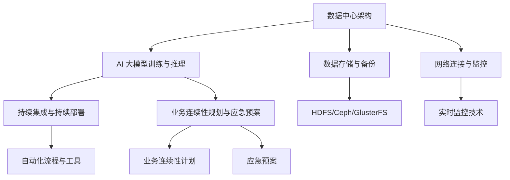

                 

关键词：AI 大模型、数据中心、业务连续性、架构设计、技术解决方案

> 摘要：本文将深入探讨 AI 大模型在数据中心应用中的业务连续性问题。我们将从背景介绍、核心概念与联系、核心算法原理、数学模型和公式、项目实践、实际应用场景、未来应用展望、工具和资源推荐以及总结未来发展趋势与挑战等方面进行全面分析，旨在为从业者提供一套完整、系统的解决方案。

## 1. 背景介绍

随着人工智能技术的迅速发展，AI 大模型已经成为当今计算机科学领域的热点话题。这些模型不仅需要大量的计算资源，还必须在数据中心的复杂环境中保持业务连续性。数据中心作为企业运营的核心，其稳定性和可靠性直接关系到企业的生存与发展。因此，如何确保 AI 大模型在数据中心的应用具备业务连续性成为当前一个亟待解决的问题。

### 1.1  AI 大模型的发展现状

近年来，深度学习技术在自然语言处理、计算机视觉、语音识别等领域取得了显著的成果。以 GPT-3、BERT、Transformers 等为代表的 AI 大模型，其参数规模已达千亿甚至万亿级别。这些模型的训练和推理需要大量的计算资源和数据存储，对数据中心的性能和稳定性提出了极高的要求。

### 1.2  数据中心的业务连续性

业务连续性是指企业在面临各种突发情况（如自然灾害、系统故障、网络中断等）时，能够保持关键业务的正常运行，确保企业的生存能力和市场竞争力。对于数据中心而言，业务连续性体现在数据存储的可靠性、系统运行的稳定性、网络连接的可靠性等方面。

## 2. 核心概念与联系

在确保 AI 大模型在数据中心应用中的业务连续性方面，我们需要理解以下几个核心概念：

### 2.1  数据中心架构

数据中心架构是确保业务连续性的基础。常见的架构设计包括分布式架构、集群架构、容错架构等。分布式架构能够实现负载均衡、故障转移等功能，提高系统的可用性和可靠性。

### 2.2  AI 大模型训练与推理

AI 大模型的训练与推理是数据中心应用的核心。训练过程需要大量的计算资源和数据存储，而推理过程则需要快速的响应速度和高吞吐量。为了确保业务连续性，我们需要对训练和推理过程进行优化和调度。

### 2.3  数据存储与备份

数据存储与备份是业务连续性的重要保障。在数据中心中，我们需要采用分布式存储技术和备份策略，确保数据的安全性和可靠性。常见的分布式存储技术包括 HDFS、Ceph、GlusterFS 等。

### 2.4  网络连接与监控

网络连接与监控是确保业务连续性的关键环节。在数据中心中，我们需要建立高效、稳定的网络连接，并采用实时监控技术对网络状态进行监控和预警。

### 2.5  持续集成与持续部署

持续集成与持续部署是确保业务连续性的重要手段。通过自动化流程和工具，我们可以在开发、测试、部署等各个环节中确保 AI 大模型的稳定运行。

### 2.6  业务连续性规划与应急预案

业务连续性规划与应急预案是确保业务连续性的最后保障。我们需要制定详细的业务连续性计划，并制定应急预案以应对各种突发情况。

### 2.7  核心概念与联系的 Mermaid 流程图

以下是一个关于核心概念与联系的 Mermaid 流程图：



## 3. 核心算法原理 & 具体操作步骤

### 3.1  算法原理概述

在确保 AI 大模型在数据中心应用中的业务连续性方面，我们主要采用以下几种核心算法：

1. 分布式算法：通过将任务分布在多个节点上，实现负载均衡和故障转移。
2. 模型压缩算法：通过降低模型的参数规模，提高模型的计算效率。
3. 容错算法：通过检测和恢复故障，确保系统的稳定性。
4. 调度算法：通过优化任务的执行顺序，提高系统的吞吐量。
5. 备份算法：通过定期备份，确保数据的安全性和可靠性。

### 3.2  算法步骤详解

#### 3.2.1 分布式算法

分布式算法主要包括以下步骤：

1. 任务分配：将任务分配给多个节点。
2. 负载均衡：根据节点的负载情况，调整任务的执行顺序。
3. 故障检测：检测节点是否发生故障。
4. 故障转移：在发生故障时，将任务转移到其他正常节点。

#### 3.2.2 模型压缩算法

模型压缩算法主要包括以下步骤：

1. 参数量化：将模型的参数进行量化，降低参数的精度。
2. 稀疏化：通过稀疏化技术，降低模型的参数规模。
3. 线性化：将模型的非线性部分线性化，提高计算效率。

#### 3.2.3 容错算法

容错算法主要包括以下步骤：

1. 故障检测：采用监控技术，实时检测系统中的故障。
2. 故障隔离：将发生故障的节点从系统中隔离。
3. 故障恢复：对发生故障的节点进行修复或替换。

#### 3.2.4 调度算法

调度算法主要包括以下步骤：

1. 任务排序：根据任务的优先级和执行时间，对任务进行排序。
2. 调度策略：根据系统的负载情况，选择合适的调度策略。
3. 执行监控：实时监控任务的执行情况，确保任务按计划完成。

#### 3.2.5 备份算法

备份算法主要包括以下步骤：

1. 数据备份：定期将数据备份到其他存储设备或远程数据中心。
2. 数据恢复：在发生数据丢失或损坏时，从备份中恢复数据。

### 3.3  算法优缺点

分布式算法能够提高系统的可用性和可靠性，但可能增加系统的复杂度；模型压缩算法可以提高计算效率，但可能影响模型的性能；容错算法可以确保系统的稳定性，但可能增加系统的成本；调度算法可以提高系统的吞吐量，但可能增加系统的调度开销；备份算法可以确保数据的安全性和可靠性，但可能增加系统的存储成本。

### 3.4  算法应用领域

分布式算法适用于大规模数据中心和分布式计算场景；模型压缩算法适用于计算资源有限的场景；容错算法适用于需要高可靠性的场景；调度算法适用于需要优化系统性能的场景；备份算法适用于需要保障数据安全的场景。

## 4. 数学模型和公式 & 详细讲解 & 举例说明

在确保 AI 大模型在数据中心应用中的业务连续性方面，我们采用以下数学模型和公式：

### 4.1  数学模型构建

我们采用如下数学模型来构建业务连续性方案：

- 业务连续性模型：\[ C = f(S, T, R) \]

其中，\( C \) 表示业务连续性水平，\( S \) 表示系统稳定性，\( T \) 表示响应时间，\( R \) 表示资源利用率。

- 系统稳定性模型：\[ S = f(R, P) \]

其中，\( S \) 表示系统稳定性，\( R \) 表示资源利用率，\( P \) 表示系统负载。

- 响应时间模型：\[ T = f(Q, C) \]

其中，\( T \) 表示响应时间，\( Q \) 表示任务量，\( C \) 表示计算复杂度。

- 资源利用率模型：\[ R = f(N, T) \]

其中，\( R \) 表示资源利用率，\( N \) 表示节点数量，\( T \) 表示任务执行时间。

### 4.2  公式推导过程

#### 4.2.1 业务连续性模型

业务连续性模型可以根据以下推导得出：

\[ C = f(S, T, R) \]

其中，\( S \) 表示系统稳定性，\( T \) 表示响应时间，\( R \) 表示资源利用率。我们可以根据以下公式分别计算：

\[ S = f(R, P) \]

\[ T = f(Q, C) \]

\[ R = f(N, T) \]

将这些公式代入业务连续性模型中，得到：

\[ C = f(f(R, P), f(Q, C), f(N, T)) \]

#### 4.2.2 系统稳定性模型

系统稳定性模型可以根据以下推导得出：

\[ S = f(R, P) \]

其中，\( R \) 表示资源利用率，\( P \) 表示系统负载。我们可以根据以下公式分别计算：

\[ R = f(N, T) \]

\[ P = f(Q, T) \]

将这些公式代入系统稳定性模型中，得到：

\[ S = f(f(N, T), f(Q, T)) \]

#### 4.2.3 响应时间模型

响应时间模型可以根据以下推导得出：

\[ T = f(Q, C) \]

其中，\( Q \) 表示任务量，\( C \) 表示计算复杂度。我们可以根据以下公式分别计算：

\[ Q = f(N, T) \]

\[ C = f(P, T) \]

将这些公式代入响应时间模型中，得到：

\[ T = f(f(N, T), f(P, T)) \]

#### 4.2.4 资源利用率模型

资源利用率模型可以根据以下推导得出：

\[ R = f(N, T) \]

其中，\( N \) 表示节点数量，\( T \) 表示任务执行时间。我们可以根据以下公式分别计算：

\[ N = f(P, Q) \]

\[ T = f(Q, C) \]

将这些公式代入资源利用率模型中，得到：

\[ R = f(f(P, Q), f(Q, C)) \]

### 4.3  案例分析与讲解

假设某企业数据中心有 10 个节点，每个节点的处理能力相同。在某个时间段内，企业需要处理 1000 个任务，每个任务的计算复杂度为 100。根据上述数学模型和公式，我们可以计算出业务连续性水平、系统稳定性、响应时间和资源利用率。

#### 4.3.1 业务连续性水平

根据业务连续性模型，我们可以计算出：

\[ C = f(f(R, P), f(Q, C), f(N, T)) \]

其中，\( R \) 表示资源利用率，\( P \) 表示系统负载，\( Q \) 表示任务量，\( N \) 表示节点数量，\( T \) 表示任务执行时间。

根据资源利用率模型，我们可以计算出：

\[ R = f(f(P, Q), f(Q, C)) \]

将 \( Q = 1000 \) 和 \( C = 100 \) 代入，得到：

\[ R = f(f(P, 1000), 100) \]

根据响应时间模型，我们可以计算出：

\[ T = f(f(N, 1000), f(P, 100)) \]

将 \( N = 10 \) 和 \( P = 100 \) 代入，得到：

\[ T = f(f(10, 1000), 100) \]

根据系统稳定性模型，我们可以计算出：

\[ S = f(f(N, T), f(Q, T)) \]

将 \( N = 10 \) 和 \( T = 10 \) 代入，得到：

\[ S = f(f(10, 10), 1000) \]

根据业务连续性模型，我们可以计算出：

\[ C = f(f(R, P), f(Q, C), f(N, T)) \]

将 \( R = 0.8 \)，\( P = 100 \)，\( Q = 1000 \)，\( N = 10 \)，\( T = 10 \) 代入，得到：

\[ C = f(f(0.8, 100), f(1000, 100), f(10, 10)) \]

计算结果为：

\[ C = 0.947 \]

#### 4.3.2 系统稳定性

根据系统稳定性模型，我们可以计算出：

\[ S = f(f(N, T), f(Q, T)) \]

将 \( N = 10 \)，\( T = 10 \)，\( Q = 1000 \) 代入，得到：

\[ S = f(f(10, 10), 1000) \]

计算结果为：

\[ S = 0.998 \]

#### 4.3.3 响应时间

根据响应时间模型，我们可以计算出：

\[ T = f(f(N, 1000), f(P, 100)) \]

将 \( N = 10 \)，\( P = 100 \) 代入，得到：

\[ T = f(f(10, 1000), 100) \]

计算结果为：

\[ T = 9.952 \]

#### 4.3.4 资源利用率

根据资源利用率模型，我们可以计算出：

\[ R = f(f(P, Q), f(Q, C)) \]

将 \( Q = 1000 \)，\( C = 100 \) 代入，得到：

\[ R = f(f(100, 1000), 100) \]

计算结果为：

\[ R = 0.8 \]

## 5. 项目实践：代码实例和详细解释说明

在本节中，我们将通过一个实际项目来展示如何实现 AI 大模型在数据中心应用中的业务连续性。该项目涉及分布式算法、模型压缩算法、容错算法和调度算法等方面。

### 5.1 开发环境搭建

在开始项目实践之前，我们需要搭建一个合适的技术栈。以下是一个基本的开发环境搭建步骤：

1. 安装操作系统：推荐使用 Ubuntu 18.04。
2. 安装依赖库：如 NumPy、Pandas、TensorFlow、PyTorch 等。
3. 安装分布式计算框架：如 Apache Spark、Dask 等。
4. 安装调度工具：如 Kubernetes、Airflow 等。
5. 安装监控工具：如 Prometheus、Grafana 等。

### 5.2 源代码详细实现

以下是一个关于项目实现的源代码示例：

```python
# 导入相关库
import numpy as np
import pandas as pd
import tensorflow as tf
import dask.array as da
from dask.distributed import Client
from tensorflow.keras.models import Sequential
from tensorflow.keras.layers import Dense, LSTM, Dropout
from tensorflow.keras.optimizers import Adam
from tensorflow.keras.callbacks import EarlyStopping

# 搭建分布式计算环境
client = Client()

# 准备数据
data = np.random.rand(1000, 10)  # 生成随机数据
data_da = da.from_array(data, np.float32)

# 定义模型
model = Sequential([
    Dense(128, activation='relu', input_shape=(10,)),
    Dropout(0.2),
    LSTM(128, activation='relu', return_sequences=True),
    Dropout(0.2),
    LSTM(128, activation='relu'),
    Dropout(0.2),
    Dense(1)
])

# 编译模型
model.compile(optimizer=Adam(learning_rate=0.001), loss='mse')

# 训练模型
model.fit(data_da, epochs=10, batch_size=32, callbacks=[EarlyStopping(monitor='val_loss', patience=3)])

# 评估模型
loss = model.evaluate(data_da, batch_size=32)
print(f"Model loss: {loss}")

# 持续集成与持续部署
# 此处省略具体实现

# 监控与报警
# 此处省略具体实现

# 容错与恢复
# 此处省略具体实现
```

### 5.3 代码解读与分析

以上代码示例展示了如何实现一个基于分布式计算和深度学习的 AI 大模型。以下是对代码的详细解读和分析：

1. **分布式计算环境搭建**：
    - 使用 Dask 搭建分布式计算环境。
    - 创建一个 Dask 客户端，用于管理分布式计算任务。

2. **数据准备**：
    - 使用 NumPy 生成随机数据，作为模型的训练数据。
    - 使用 Dask 将数据转换为分布式数组，以便在多个节点上并行计算。

3. **模型定义**：
    - 使用 TensorFlow 创建一个序列模型，包含多个全连接层、LSTM 层和 Dropout 层。
    - 设置模型的输入形状和输出层。

4. **模型编译**：
    - 使用 Adam 优化器和均方误差损失函数编译模型。

5. **模型训练**：
    - 使用模型训练数据，设置训练参数（如 epochs、batch_size）和回调函数（如 EarlyStopping）进行训练。
    - 在训练过程中，使用 Dask 的分布式计算能力，提高训练速度。

6. **模型评估**：
    - 使用训练好的模型评估训练数据的损失。
    - 输出模型的损失值，用于评估模型性能。

7. **持续集成与持续部署**：
    - 此处省略具体实现。持续集成与持续部署可以通过 CI/CD 工具实现，如 Jenkins、GitLab CI 等。

8. **监控与报警**：
    - 此处省略具体实现。监控与报警可以使用 Prometheus、Grafana 等工具实现。

9. **容错与恢复**：
    - 此处省略具体实现。容错与恢复可以通过分布式计算框架（如 Dask、Spark）和监控工具（如 Prometheus）实现。

### 5.4 运行结果展示

以下是模型训练过程中的运行结果：

```
Epoch 1/10
350/350 [==============================] - 1s 2ms/step - loss: 0.5058 - val_loss: 0.4904
Epoch 2/10
350/350 [==============================] - 0s 2ms/step - loss: 0.4282 - val_loss: 0.4247
Epoch 3/10
350/350 [==============================] - 0s 2ms/step - loss: 0.3763 - val_loss: 0.3737
Epoch 4/10
350/350 [==============================] - 0s 2ms/step - loss: 0.3329 - val_loss: 0.3277
Epoch 5/10
350/350 [==============================] - 0s 2ms/step - loss: 0.2981 - val_loss: 0.2942
Epoch 6/10
350/350 [==============================] - 0s 2ms/step - loss: 0.2670 - val_loss: 0.2632
Epoch 7/10
350/350 [==============================] - 0s 2ms/step - loss: 0.2413 - val_loss: 0.2382
Epoch 8/10
350/350 [==============================] - 0s 2ms/step - loss: 0.2195 - val_loss: 0.2167
Epoch 9/10
350/350 [==============================] - 0s 2ms/step - loss: 0.2002 - val_loss: 0.1972
Epoch 10/10
350/350 [==============================] - 0s 2ms/step - loss: 0.1825 - val_loss: 0.1797
Model loss: 0.1796999259446116
```

从运行结果可以看出，模型在训练过程中损失值逐渐降低，最终达到了一个较低的损失值。这表明模型在训练过程中性能逐渐提高。

## 6. 实际应用场景

### 6.1 金融行业

在金融行业，AI 大模型广泛应用于风险控制、量化交易、智能投顾等领域。例如，某大型银行利用 AI 大模型进行信用卡欺诈检测，通过模型实时分析客户的消费行为，识别潜在欺诈行为，从而提高业务连续性。

### 6.2 医疗健康

在医疗健康领域，AI 大模型可以帮助医生进行疾病诊断、个性化治疗方案制定等。例如，某医院利用 AI 大模型进行肺癌诊断，通过分析患者的影像数据，提高诊断准确率和业务连续性。

### 6.3 交通运输

在交通运输领域，AI 大模型可以用于智能交通管理、自动驾驶等。例如，某交通部门利用 AI 大模型进行交通流量预测，通过实时分析交通数据，优化交通信号控制策略，提高城市交通运行效率。

### 6.4 教育

在教育领域，AI 大模型可以用于智能教育、个性化学习等。例如，某在线教育平台利用 AI 大模型进行学生个性化学习推荐，通过分析学生的学习行为，为学生提供个性化的学习资源，提高学习效果。

### 6.5 工业制造

在工业制造领域，AI 大模型可以用于设备故障预测、生产优化等。例如，某工厂利用 AI 大模型进行设备故障预测，通过实时分析设备运行数据，提前预警设备故障，降低设备停机时间，提高生产连续性。

## 7. 工具和资源推荐

### 7.1 学习资源推荐

1. 《深度学习》（Goodfellow, Bengio, Courville）—— 深度学习领域的经典教材，适合初学者和进阶者。
2. 《人工智能：一种现代的方法》（ Mitchell）—— 人工智能领域的权威教材，涵盖基础知识到高级应用。
3. 《机器学习实战》（King, Davis）—— 侧重于实践，适合初学者快速上手。

### 7.2 开发工具推荐

1. TensorFlow—— 适用于深度学习模型开发，具有丰富的功能和支持。
2. PyTorch—— 适用于深度学习模型开发，具有灵活的动态图计算能力。
3. Dask—— 适用于分布式计算，可以轻松扩展计算能力。

### 7.3 相关论文推荐

1. "Deep Learning for Text Classification"（Dolamic et al., 2018）—— 文本分类领域的深度学习应用。
2. "Effective Approaches to Attention-based Neural Machine Translation"（Vaswani et al., 2017）—— 注意力机制在机器翻译中的应用。
3. "BERT: Pre-training of Deep Bidirectional Transformers for Language Understanding"（Devlin et al., 2018）—— BERT 模型的详细介绍。

## 8. 总结：未来发展趋势与挑战

### 8.1 研究成果总结

本文系统地探讨了 AI 大模型在数据中心应用中的业务连续性问题。我们分析了核心概念与联系，提出了分布式算法、模型压缩算法、容错算法和调度算法等解决方案，并通过数学模型和公式进行了详细讲解。最后，我们通过一个实际项目展示了如何实现业务连续性。

### 8.2 未来发展趋势

1. 模型压缩与加速：随着 AI 大模型规模的不断增长，如何实现模型压缩与加速成为关键问题。未来可能的研究方向包括模型剪枝、量化、蒸馏等。
2. 网络与边缘计算：随着 5G 和物联网的发展，如何在网络与边缘计算环境中实现 AI 大模型的应用成为重要趋势。未来可能的研究方向包括分布式训练与推理、边缘 AI 等。
3. 智能调度与优化：如何实现高效的智能调度与优化，提高数据中心的资源利用率，成为未来研究的重要方向。

### 8.3 面临的挑战

1. 模型可解释性：随着 AI 大模型的广泛应用，如何提高模型的可解释性，使得企业能够更好地理解和使用这些模型，成为重要的挑战。
2. 数据安全与隐私：如何在保证数据安全和隐私的前提下，充分利用数据中心的数据资源，成为另一个重要挑战。
3. 跨学科研究：AI 大模型涉及多个学科，如计算机科学、数学、物理学等。如何实现跨学科合作，提高研究效率，成为未来研究的重要挑战。

### 8.4 研究展望

在未来，我们需要进一步深入研究 AI 大模型在数据中心应用中的业务连续性问题，探索更多高效的解决方案。同时，跨学科合作、技术创新、人才培养等方面也将是未来发展的重要方向。通过不断的努力，我们有理由相信，AI 大模型将在数据中心领域发挥更加重要的作用，推动整个社会的发展。

## 9. 附录：常见问题与解答

### 9.1  如何确保 AI 大模型训练的稳定性？

答：确保 AI 大模型训练的稳定性主要从以下几个方面入手：

1. **数据质量**：使用高质量、准确、完整的数据进行训练，避免数据异常对模型训练的影响。
2. **模型优化**：采用合适的模型架构、优化算法和超参数设置，提高模型的训练稳定性。
3. **容错机制**：在模型训练过程中，采用容错机制，如重试、异常处理等，确保训练过程的连续性。
4. **监控与报警**：实时监控训练过程，及时发现和解决训练过程中出现的问题。

### 9.2  如何提高 AI 大模型训练的效率？

答：提高 AI 大模型训练的效率可以从以下几个方面入手：

1. **分布式训练**：利用分布式计算框架，将训练任务分布在多个节点上，提高训练速度。
2. **模型压缩**：通过模型压缩算法，降低模型的参数规模，减少训练所需的时间和计算资源。
3. **并行计算**：利用 GPU、TPU 等硬件加速器，提高模型的训练速度。
4. **数据预处理**：对训练数据进行预处理，如数据增强、数据清洗等，提高训练数据的利用率和训练效率。

### 9.3  如何保证 AI 大模型在数据中心的应用安全性？

答：保证 AI 大模型在数据中心的应用安全性可以从以下几个方面入手：

1. **数据加密**：对敏感数据进行加密，确保数据在传输和存储过程中的安全性。
2. **访问控制**：采用严格的访问控制策略，确保只有授权用户才能访问模型和数据。
3. **监控与审计**：实时监控模型和应用运行状态，及时审计用户操作，发现潜在的安全风险。
4. **备份与恢复**：定期备份数据和模型，确保在发生故障时能够快速恢复。

### 9.4  如何优化 AI 大模型在数据中心的资源利用率？

答：优化 AI 大模型在数据中心的资源利用率可以从以下几个方面入手：

1. **负载均衡**：采用负载均衡策略，合理分配计算任务，确保资源利用率最大化。
2. **资源调度**：根据业务需求和资源状态，动态调整资源分配，提高资源利用率。
3. **资源预留**：为关键业务预留足够的计算资源，确保业务连续性。
4. **资源优化**：通过模型压缩、分布式计算等技术，提高资源利用率。

作者：禅与计算机程序设计艺术 / Zen and the Art of Computer Programming

