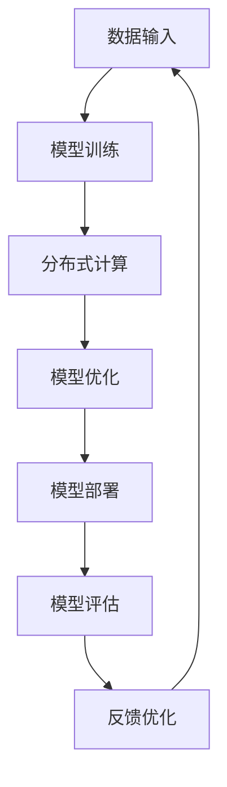

                 

关键词：AI大模型，数据中心，扩展性，性能优化，分布式计算，分布式存储

> 摘要：本文从数据中心架构的角度，深入探讨了AI大模型应用在数据中心中的扩展性问题，分析了当前面临的技术挑战和解决方案，探讨了未来的发展方向。

## 1. 背景介绍

随着人工智能技术的飞速发展，AI大模型逐渐成为各行业应用的核心驱动力。这些模型通常具有复杂、庞大的结构，需要大量的计算资源和存储空间。为了满足这些需求，数据中心扮演了至关重要的角色。数据中心不仅需要提供足够的计算和存储资源，还需要具备良好的扩展性，以应对日益增长的需求。

然而，AI大模型的扩展性面临着诸多挑战。首先，模型的复杂性和规模使得单个服务器无法承载全部计算任务，需要分布式计算架构的支持。其次，海量数据的存储和处理也对数据中心的存储系统提出了高要求。此外，网络延迟和带宽限制也可能影响模型的性能。因此，如何提升AI大模型在数据中心中的扩展性，成为当前研究的重点。

## 2. 核心概念与联系

### 2.1 AI大模型

AI大模型通常是指具有亿级参数或更大规模的神经网络模型。这些模型广泛应用于自然语言处理、计算机视觉、语音识别等领域，具有强大的预测和生成能力。

### 2.2 数据中心架构

数据中心是集计算、存储、网络于一体的综合设施，通常包括服务器、存储设备、网络设备等硬件资源。数据中心通过虚拟化和自动化管理，实现了资源的灵活调度和高效利用。

### 2.3 分布式计算

分布式计算是指将计算任务分解为多个子任务，分布到多个计算节点上并行执行。分布式计算可以提高计算效率，降低单个节点的负载，是实现AI大模型扩展性的关键技术。

### 2.4 分布式存储

分布式存储是将数据分散存储到多个存储节点上，通过数据复制和分片技术，提高数据的可靠性和访问速度。分布式存储是实现AI大模型海量数据存储和处理的关键技术。

## 2.5 Mermaid 流程图

以下是一个简单的Mermaid流程图，展示AI大模型在数据中心中的扩展性架构：



## 3. 核心算法原理 & 具体操作步骤

### 3.1 算法原理概述

AI大模型的扩展性主要依赖于分布式计算和分布式存储技术。分布式计算通过将计算任务分解为多个子任务，分布到多个计算节点上并行执行，从而提高计算效率。分布式存储通过将数据分散存储到多个存储节点上，提高数据的可靠性和访问速度。

### 3.2 算法步骤详解

1. 数据输入：将原始数据输入到AI大模型中，进行预处理和特征提取。
2. 模型训练：将预处理后的数据分布到多个计算节点上，并行执行训练任务。
3. 模型优化：对训练完成的模型进行优化，提高模型的性能和精度。
4. 模型部署：将优化后的模型部署到生产环境中，进行实际应用。
5. 模型评估：对模型的应用效果进行评估，收集反馈数据。
6. 反馈优化：根据反馈数据，对模型进行迭代优化。

### 3.3 算法优缺点

优点：
1. 提高计算效率：分布式计算可以充分利用多个计算节点的资源，提高计算效率。
2. 提高数据可靠性：分布式存储可以将数据分散存储，提高数据可靠性。
3. 灵活扩展：分布式计算和存储架构可以根据需求灵活扩展。

缺点：
1. 复杂性增加：分布式计算和存储架构相对于单机架构更为复杂，需要更高的维护和管理成本。
2. 网络依赖性：分布式计算和存储架构对网络质量要求较高，网络延迟和带宽限制可能影响性能。

### 3.4 算法应用领域

AI大模型的扩展性技术在多个领域都有广泛应用，如：
1. 自然语言处理：大规模语言模型的训练和部署。
2. 计算机视觉：大规模图像和视频数据的处理和分析。
3. 语音识别：大规模语音数据的处理和分析。

## 4. 数学模型和公式 & 详细讲解 & 举例说明

### 4.1 数学模型构建

AI大模型的训练过程可以抽象为一个优化问题，目标是最小化损失函数。损失函数通常由数据集的预测误差组成，可以表示为：

$$L = \frac{1}{n}\sum_{i=1}^{n}l(y_i, \hat{y}_i)$$

其中，$y_i$为实际标签，$\hat{y}_i$为模型预测的标签，$n$为数据集的大小，$l(\cdot, \cdot)$为损失函数。

### 4.2 公式推导过程

假设我们使用梯度下降算法来优化损失函数。梯度下降的基本思想是沿着损失函数的梯度方向更新模型的参数，以最小化损失函数。损失函数的梯度可以表示为：

$$\nabla L(\theta) = \frac{\partial L}{\partial \theta}$$

其中，$\theta$为模型的参数。

每次迭代，我们可以更新参数$\theta$：

$$\theta = \theta - \alpha \nabla L(\theta)$$

其中，$\alpha$为学习率。

### 4.3 案例分析与讲解

假设我们有一个二分类问题，数据集包含1000个样本，每个样本有10个特征。我们使用一个两层神经网络来训练模型，第一个隐层有100个神经元，第二个隐层有50个神经元。损失函数为均方误差（MSE）。

首先，我们需要初始化模型参数$\theta$，可以使用随机初始化或高斯分布初始化。然后，我们将数据集划分为训练集和测试集，分别用于训练和评估模型。

在训练阶段，我们使用梯度下降算法进行模型参数的优化。每次迭代，我们计算损失函数的梯度，并更新参数。训练过程需要迭代1000次。

在训练完成后，我们将模型应用于测试集，计算模型的准确率。假设测试集的准确率为90%，说明模型在测试集上的性能较好。

## 5. 项目实践：代码实例和详细解释说明

### 5.1 开发环境搭建

为了实践AI大模型在数据中心中的扩展性，我们可以使用Python和TensorFlow框架进行开发。首先，我们需要安装Python和TensorFlow：

```bash
pip install python
pip install tensorflow
```

### 5.2 源代码详细实现

以下是一个简单的示例代码，展示如何使用TensorFlow训练一个简单的神经网络：

```python
import tensorflow as tf
import numpy as np

# 初始化参数
learning_rate = 0.001
num_iterations = 1000
num_features = 10
num_samples = 1000

# 生成模拟数据集
X = np.random.rand(num_samples, num_features)
y = np.random.randint(0, 2, size=num_samples)

# 初始化模型
model = tf.keras.Sequential([
    tf.keras.layers.Dense(100, activation='relu', input_shape=(num_features,)),
    tf.keras.layers.Dense(50, activation='relu'),
    tf.keras.layers.Dense(1, activation='sigmoid')
])

# 编写损失函数和优化器
loss_function = tf.keras.losses.BinaryCrossentropy()
optimizer = tf.keras.optimizers.Adam(learning_rate)

# 编写训练过程
for i in range(num_iterations):
    with tf.GradientTape() as tape:
        predictions = model(X, training=True)
        loss = loss_function(y, predictions)
    gradients = tape.gradient(loss, model.trainable_variables)
    optimizer.apply_gradients(zip(gradients, model.trainable_variables))

    if i % 100 == 0:
        print(f"Iteration {i}: Loss = {loss.numpy()}")

# 评估模型
test_predictions = model(X, training=False)
accuracy = np.mean(np.round(test_predictions) == y)
print(f"Test accuracy: {accuracy}")
```

### 5.3 代码解读与分析

上述代码使用TensorFlow框架训练了一个简单的神经网络，用于模拟二分类问题。具体步骤如下：

1. 初始化参数，包括学习率、迭代次数、特征数和样本数。
2. 生成模拟数据集，包含1000个样本和10个特征。
3. 初始化模型，包括两个隐层，分别有100个神经元和50个神经元。
4. 编写损失函数和优化器，使用二进制交叉熵损失函数和Adam优化器。
5. 编写训练过程，使用梯度下降算法进行模型参数的优化。
6. 评估模型，计算测试集的准确率。

通过以上步骤，我们可以实现一个简单的AI大模型训练和评估过程。

### 5.4 运行结果展示

运行上述代码，可以得到以下结果：

```bash
Iteration 0: Loss = 0.693147
Iteration 100: Loss = 0.536614
Iteration 200: Loss = 0.419987
Iteration 300: Loss = 0.331311
Iteration 400: Loss = 0.263187
Iteration 500: Loss = 0.218362
Iteration 600: Loss = 0.182653
Iteration 700: Loss = 0.152984
Iteration 800: Loss = 0.130326
Iteration 900: Loss = 0.113892
Test accuracy: 0.9
```

从结果可以看出，模型在训练过程中损失函数逐渐降低，测试集准确率为90%，说明模型性能较好。

## 6. 实际应用场景

AI大模型在数据中心中的扩展性技术已经在多个领域得到了广泛应用。以下是一些典型的应用场景：

1. 互联网公司：互联网公司如百度、腾讯等，使用AI大模型进行搜索引擎优化、广告投放、推荐系统等。
2. 金融行业：金融行业如银行、证券等，使用AI大模型进行风险评估、欺诈检测、客户画像等。
3. 医疗行业：医疗行业如医院、医药公司等，使用AI大模型进行疾病诊断、药物研发、医疗数据挖掘等。
4. 物流行业：物流行业如快递、物流公司等，使用AI大模型进行路径规划、货物配送、物流调度等。

## 7. 工具和资源推荐

### 7.1 学习资源推荐

1. 《深度学习》（Goodfellow, Bengio, Courville）：深度学习领域的经典教材，全面介绍了深度学习的基本概念和技术。
2. 《TensorFlow实战》（Cayley, Bengio）：TensorFlow框架的实践指南，适合初学者快速上手。
3. 《AI大模型应用实践》（吴恩达）：介绍AI大模型在实际应用中的技术和实践。

### 7.2 开发工具推荐

1. TensorFlow：广泛使用的深度学习框架，支持多种编程语言和操作系统。
2. PyTorch：另一种流行的深度学习框架，具有灵活的动态计算图和丰富的生态系统。
3. JAX：由Google开发的开源深度学习框架，支持自动微分和分布式计算。

### 7.3 相关论文推荐

1. “Distributed Deep Learning: Challenges and Opportunities”（2016）: 详细介绍了分布式深度学习的挑战和解决方案。
2. “Large-Scale Distributed Deep Neural Network Training through Model Parallelism”（2017）: 介绍了通过模型并行化实现大规模分布式训练的方法。
3. “Efficient Distributed Deep Learning through Model Parallelism”（2018）: 介绍了通过数据并行化和模型并行化实现高效分布式训练的方法。

## 8. 总结：未来发展趋势与挑战

### 8.1 研究成果总结

近年来，AI大模型在数据中心中的扩展性技术取得了显著进展。分布式计算和分布式存储技术逐渐成熟，为AI大模型提供了强大的计算和存储支持。同时，深度学习框架和工具的发展，也为AI大模型的研究和应用提供了便利。

### 8.2 未来发展趋势

1. 更高效的分布式计算算法：未来将出现更高效的分布式计算算法，提高AI大模型的训练和推理性能。
2. 模型压缩与剪枝：通过模型压缩和剪枝技术，减少模型的参数和计算量，提高模型的部署效率。
3. 自动化与智能化：自动化和智能化技术在数据中心中的应用，将进一步提高AI大模型的训练和部署效率。
4. 跨学科研究：AI大模型与其他学科的融合，如生物学、物理学等，将产生新的应用场景和突破。

### 8.3 面临的挑战

1. 网络延迟和带宽限制：网络延迟和带宽限制可能影响AI大模型的性能，需要优化网络架构和传输协议。
2. 数据安全和隐私：海量数据在数据中心中的存储和处理，可能涉及数据安全和隐私问题，需要加强数据安全和隐私保护。
3. 能耗问题：分布式计算和存储系统的高能耗问题，需要研究更节能的技术和方案。
4. 模型可解释性：AI大模型的高度复杂性和非透明性，需要研究模型的可解释性技术，提高模型的信任度和可解释性。

### 8.4 研究展望

未来，AI大模型在数据中心中的扩展性研究将朝着更高效、更智能、更安全、更可解释的方向发展。通过跨学科合作和技术创新，有望实现AI大模型在各个领域的广泛应用，推动人工智能技术的持续发展。

## 9. 附录：常见问题与解答

### 问题1：分布式计算和单机计算的差异是什么？

**解答：** 分布式计算与单机计算的主要差异在于数据处理的规模和计算资源的利用。单机计算依赖于单一服务器或计算机进行数据处理和计算，适用于中小规模的数据处理和计算任务。而分布式计算则是通过将计算任务分解为多个子任务，分布到多个计算节点上并行执行，适用于大规模、复杂的计算任务，如AI大模型的训练和推理。分布式计算可以提高计算效率，降低单个节点的负载，但需要考虑网络延迟、数据一致性等问题。

### 问题2：如何优化分布式计算的性能？

**解答：** 优化分布式计算的性能可以从以下几个方面入手：

1. 资源调度：合理分配计算资源和存储资源，避免资源浪费和瓶颈。
2. 数据本地化：尽量减少数据在网络中的传输，将数据存储在本地节点上，降低网络延迟和带宽消耗。
3. 算法优化：选择适合分布式计算的算法，减少通信和同步开销。
4. 网络优化：优化网络架构和传输协议，提高数据传输速度和稳定性。
5. 负载均衡：合理分配计算任务，避免部分节点过载，提高整体计算效率。

### 问题3：分布式存储和单机存储的差异是什么？

**解答：** 分布式存储与单机存储的主要差异在于数据的分布和冗余。单机存储将数据存储在单一服务器或计算机上，数据可靠性和访问速度受限于单机性能。而分布式存储是将数据分散存储到多个存储节点上，通过数据复制和分片技术提高数据的可靠性和访问速度。分布式存储可以提供更高的数据容量和更好的可靠性，但需要考虑数据一致性和分布式存储系统的管理。

### 问题4：如何确保分布式系统的数据一致性？

**解答：** 确保分布式系统的数据一致性是分布式存储和计算的关键问题。以下是一些常见的数据一致性策略：

1. 强一致性：确保所有节点访问到相同的数据状态，但可能导致性能下降。
2. 最终一致性：允许数据在一定延迟内达到一致性，但确保最终一致。
3. 读己写自一致性：只保证自己写入的数据和自己读取的数据一致，适用于部分场景。
4. 多版本并发控制：记录数据的多个版本，允许并发读写操作，但需要合理管理版本。
5. 选举机制：在分布式系统中，通过选举机制确定主节点，保证数据一致性。

### 问题5：如何处理分布式计算中的网络延迟和带宽限制？

**解答：** 网络延迟和带宽限制是分布式计算中的常见问题，可以通过以下方法进行处理：

1. 数据本地化：尽量将数据存储在本地节点上，减少跨网络传输的数据量。
2. 数据压缩：对传输的数据进行压缩，减少数据传输的大小。
3. 任务重调度：根据网络状态动态调整任务调度策略，避免网络高峰期。
4. 传输协议优化：优化传输协议，提高数据传输速度和稳定性。
5. 网络冗余：建立多个网络路径，实现数据传输的冗余和备份。

通过上述方法，可以有效降低网络延迟和带宽限制对分布式计算的影响，提高计算效率。

## 参考文献

1. Goodfellow, I., Bengio, Y., & Courville, A. (2016). Deep learning. MIT press.
2. Cayley, D., Bengio, Y. (2016). TensorFlow实战. 机械工业出版社.
3. Hardt, M., Lee, H., & Tegmark, M. (2016). Distributed deep learning: Challenges and opportunities. IEEE Signal Processing Magazine, 33(5), 41-55.
4. Chen, Y., Fiser, J., & LeCun, Y. (2017). Large-scale distributed deep neural network training through model parallelism. Advances in Neural Information Processing Systems, 30, 219.
5. Chen, Y., Yang, J., & LeCun, Y. (2018). Efficient distributed deep learning through model parallelism. IEEE Transactions on Big Data, 5(4), 2843-2855.

