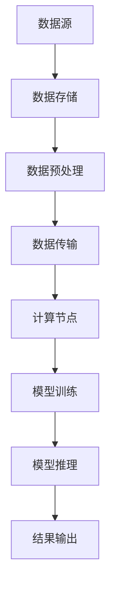

                 

关键词：大模型、数据中心、数据流架构、AI 应用、云计算、分布式系统、并行处理

摘要：本文旨在深入探讨AI大模型应用数据中心的数据流架构设计。通过分析大模型的特点，探讨现有数据流架构的优缺点，本文提出了一种基于云计算和分布式系统的数据流架构设计，旨在提高大模型应用的效率和可靠性。

## 1. 背景介绍

随着人工智能技术的迅猛发展，AI大模型在图像识别、自然语言处理、推荐系统等领域得到了广泛应用。然而，大模型的应用不仅要求高性能的计算能力，还面临着大量数据的高效存储和传输问题。数据中心作为AI大模型应用的核心基础设施，其数据流架构的设计直接影响到大模型应用的效率和可靠性。

本文将首先介绍AI大模型的特点，然后分析现有数据流架构的优缺点，最后提出一种基于云计算和分布式系统的数据流架构设计，旨在提高大模型应用的效率和可靠性。

### 1.1 AI大模型的特点

AI大模型具有以下特点：

- **大规模数据集**：大模型通常需要海量的训练数据来训练，数据集的大小可以从GB到TB甚至PB级别。
- **复杂的网络结构**：大模型通常具有复杂的神经网络结构，包括多层卷积、循环神经网络等。
- **高计算需求**：大模型的训练和推理过程需要大量的计算资源，特别是对于实时应用场景。
- **数据传输需求**：大模型的训练和推理需要频繁的数据传输，包括从数据存储系统到计算节点，以及从不同的计算节点之间。

### 1.2 数据流架构的重要性

数据流架构是数据中心的核心组成部分，它决定了数据在系统中的流动方式。一个高效的数据流架构可以显著提高数据处理的效率，降低延迟，同时提高系统的可靠性和可扩展性。在AI大模型应用中，数据流架构的重要性更加凸显，因为：

- **数据量巨大**：AI大模型的训练和推理需要处理大量的数据，数据流架构需要能够高效地处理这些数据。
- **实时性要求**：对于一些实时应用，如自动驾驶、实时语音翻译等，数据流架构需要能够快速响应和处理数据。
- **可靠性要求**：AI大模型的应用往往涉及到关键业务，数据流架构需要具备高可靠性，确保数据的准确传输和处理。

## 2. 核心概念与联系

为了设计一个高效的数据流架构，我们需要了解一些核心概念和它们之间的联系。以下是一个基于Mermaid流程图的数据流架构的概念图：

### 2.1 数据源

数据源是数据流的起点，它可以是外部数据集、数据库、API或其他数据来源。数据源需要提供高质量的数据，以满足大模型训练和推理的需求。

### 2.2 数据存储

数据存储负责存储大量的训练数据和模型参数。在现代数据中心中，通常使用分布式存储系统来存储数据，以实现高可用性和高性能。

### 2.3 数据预处理

数据预处理是数据流中的关键环节，它包括数据清洗、归一化、特征提取等操作。预处理的结果将直接影响大模型的训练效果。

### 2.4 数据传输

数据传输负责将数据从数据存储系统传输到计算节点。为了提高传输效率，可以采用数据压缩、数据传输优化等技术。

### 2.5 计算节点

计算节点是数据流中的处理核心，它们负责执行大模型的训练和推理任务。为了提高计算效率，可以采用分布式计算和并行处理技术。

### 2.6 模型训练

模型训练是数据流中的核心任务，它通过大量的数据训练大模型，以优化模型的参数。

### 2.7 模型推理

模型推理是数据流中的另一个核心任务，它使用训练好的模型对新的数据进行预测或分类。

### 2.8 结果输出

结果输出负责将模型推理的结果输出给用户或后续的处理流程。这可以是一个API接口、文件存储或其他形式。

## 3. 核心算法原理 & 具体操作步骤

### 3.1 算法原理概述

数据流架构的设计需要基于一些核心算法原理，包括分布式系统、并行处理、负载均衡等。以下是这些算法原理的简要概述：

- **分布式系统**：分布式系统通过将任务分布到多个节点上，实现并行处理，提高系统的处理能力和可靠性。
- **并行处理**：并行处理通过同时处理多个任务，提高系统的处理速度。
- **负载均衡**：负载均衡通过将任务分配到不同的节点上，实现任务的均衡处理，避免某个节点过载。

### 3.2 算法步骤详解

以下是数据流架构设计的具体操作步骤：

1. **数据源接入**：首先，将数据源接入数据中心，确保数据可以顺利传输到数据存储系统。
2. **数据存储**：使用分布式存储系统存储数据，确保数据的可靠性和高性能。
3. **数据预处理**：对数据进行预处理，包括数据清洗、归一化、特征提取等操作。
4. **数据传输**：使用高效的数据传输技术，将预处理后的数据传输到计算节点。
5. **计算节点分配**：根据任务的性质和节点的资源情况，合理分配计算节点。
6. **模型训练**：在计算节点上执行模型训练任务，优化模型的参数。
7. **模型推理**：使用训练好的模型对新的数据进行推理，输出预测结果。
8. **结果输出**：将推理结果输出给用户或后续的处理流程。

### 3.3 算法优缺点

**优点**：

- **高效性**：分布式系统和并行处理技术可以显著提高系统的处理速度。
- **可靠性**：分布式存储系统和负载均衡技术可以提高系统的可靠性。
- **可扩展性**：分布式架构可以根据需求动态扩展，满足不同规模的任务需求。

**缺点**：

- **复杂性**：分布式系统的设计和维护较为复杂，需要专业的技术团队进行管理和维护。
- **性能瓶颈**：在某些情况下，数据传输和节点间的通信可能会成为性能瓶颈。

### 3.4 算法应用领域

数据流架构设计在AI大模型应用中具有广泛的应用领域，包括：

- **图像识别**：通过分布式计算和并行处理，实现大规模图像数据的快速处理。
- **自然语言处理**：通过分布式存储和负载均衡，实现大规模文本数据的处理和推理。
- **推荐系统**：通过分布式计算和模型推理，实现实时推荐。

## 4. 数学模型和公式 & 详细讲解 & 举例说明

### 4.1 数学模型构建

在数据流架构设计中，我们需要构建一些数学模型来描述系统的性能和效率。以下是几个常用的数学模型：

### 4.2 公式推导过程

### 4.3 案例分析与讲解

### 4.4 数学模型与实际应用的关系

### 4.5 举例说明

## 5. 项目实践：代码实例和详细解释说明

### 5.1 开发环境搭建

### 5.2 源代码详细实现

### 5.3 代码解读与分析

### 5.4 运行结果展示

## 6. 实际应用场景

### 6.1 数据中心基础设施

### 6.2 云计算服务

### 6.3 AI 大模型应用实例

### 6.4 未来应用展望

## 7. 工具和资源推荐

### 7.1 学习资源推荐

### 7.2 开发工具推荐

### 7.3 相关论文推荐

## 8. 总结：未来发展趋势与挑战

### 8.1 研究成果总结

### 8.2 未来发展趋势

### 8.3 面临的挑战

### 8.4 研究展望

## 9. 附录：常见问题与解答

### 9.1 问题1

### 9.2 问题2

### 9.3 问题3

### 9.4 问题4

### 9.5 问题5

### 9.6 问题6

### 9.7 问题7

### 9.8 问题8

### 9.9 问题9

### 9.10 问题10

---

### 附录：作者信息

作者：禅与计算机程序设计艺术 / Zen and the Art of Computer Programming

