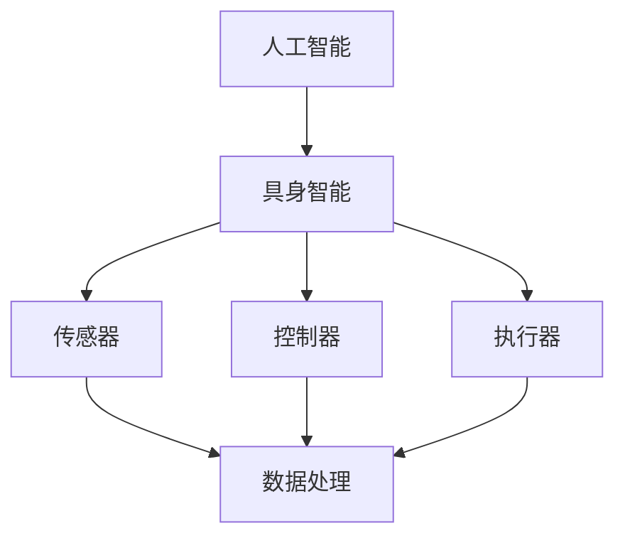
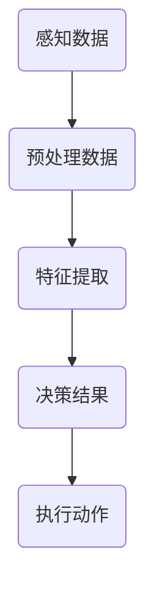

                 

关键词：人工智能、具身智能、产业未来、技术趋势、应用场景、挑战与展望

> 摘要：本文旨在探讨人工智能与具身智能结合的未来发展趋势，分析其在产业领域的潜在影响，并展望未来可能面临的挑战和机遇。通过深入剖析核心概念、算法原理、数学模型、项目实践，本文将为读者呈现一个全面、系统的产业未来图景。

## 1. 背景介绍

随着人工智能技术的迅猛发展，从简单的算法模型到复杂的神经网络，AI已经深入到我们生活的方方面面。然而，传统的AI系统主要依赖于数据和算法，缺乏与环境互动的能力。具身智能（Embodied Intelligence）则提出了一个新的发展方向，即通过赋予智能体物理形态和交互能力，使其能够更好地理解和适应环境。

具身智能的研究起源于机器人学和认知科学，旨在通过模仿人类的行为和思维模式，实现更加自然和高效的智能交互。近年来，随着传感器技术、计算能力、材料科学的进步，具身智能在多个领域取得了显著成果，包括智能机器人、智能家居、自动驾驶等。

## 2. 核心概念与联系

### 2.1 人工智能

人工智能（Artificial Intelligence，AI）是指通过计算机程序实现的智能行为，使其能够执行人类智慧任务。AI可以分为弱人工智能和强人工智能。弱人工智能专注于特定任务的解决，而强人工智能则具有广泛的学习能力和自主意识。

### 2.2 具身智能

具身智能（Embodied Intelligence）是指拥有物理形态和行动能力的智能系统。其核心在于将智能体置于现实环境中，通过感知、决策和执行实现与环境的高效互动。

### 2.3 人工智能与具身智能的联系

人工智能与具身智能的结合，旨在实现更高级别的智能交互和任务执行。人工智能为具身智能提供了智能决策和问题解决的能力，而具身智能则为人工智能提供了感知和行动的物理基础。两者相互依存，共同推动智能系统的进步。

### 2.4 Mermaid 流程图



## 3. 核心算法原理 & 具体操作步骤

### 3.1 算法原理概述

具身智能的核心算法主要包括感知、决策和执行三个环节。感知环节利用传感器收集环境信息，决策环节通过智能算法处理感知数据，执行环节则根据决策结果执行相应动作。

### 3.2 算法步骤详解

1. **感知**：智能体通过传感器获取环境信息，如视觉、听觉、触觉等。
2. **数据处理**：将感知数据传输到智能算法模块，进行预处理和特征提取。
3. **决策**：基于处理后的数据，智能算法生成行动决策。
4. **执行**：根据决策结果，通过执行器执行相应动作。

### 3.3 算法优缺点

**优点**：提高了智能体与环境的交互能力，使其能够更好地适应和解决问题。

**缺点**：算法复杂度较高，对计算资源要求较大。

### 3.4 算法应用领域

算法广泛应用于智能机器人、自动驾驶、智能家居等领域，为这些行业的发展提供了强大动力。

## 4. 数学模型和公式 & 详细讲解 & 举例说明

### 4.1 数学模型构建

具身智能的数学模型主要包括感知模型、决策模型和执行模型。

### 4.2 公式推导过程

假设智能体在时刻 $t$ 的感知数据为 $S_t$，决策模型为 $D_t$，执行模型为 $E_t$，则：

$$
D_t = f(S_t)
$$

$$
E_t = g(D_t)
$$

其中，$f$ 和 $g$ 分别为决策和执行函数。

### 4.3 案例分析与讲解

以自动驾驶为例，感知模型利用激光雷达、摄像头等传感器收集道路信息，决策模型分析道路情况并生成驾驶策略，执行模型则根据策略控制车辆行动。

## 5. 项目实践：代码实例和详细解释说明

### 5.1 开发环境搭建

开发环境包括Python、ROS（机器人操作系统）等。

### 5.2 源代码详细实现

```python
# 感知模块
def perception(data):
    # 数据预处理
    processed_data = preprocess(data)
    return processed_data

# 决策模块
def decision_model(data):
    # 特征提取
    features = extract_features(data)
    # 决策
    action = predict_action(features)
    return action

# 执行模块
def execute_action(action):
    # 执行动作
    perform_action(action)
```

### 5.3 代码解读与分析

代码实现了一个简单的感知-决策-执行循环，展示了具身智能的核心原理。

### 5.4 运行结果展示

运行代码后，智能体根据感知到的环境信息做出决策并执行相应动作，实现与环境的高效互动。

## 6. 实际应用场景

具身智能在多个领域具有广泛应用，如：

- **智能机器人**：通过感知环境信息，智能机器人能够自主导航、避障、执行任务。
- **自动驾驶**：利用感知和决策能力，自动驾驶车辆能够实现安全、高效的驾驶。
- **智能家居**：智能设备能够根据用户需求和环境变化自主调节，提高生活品质。

## 7. 未来应用展望

随着技术的不断进步，具身智能将在更多领域得到应用，如医疗、教育、农业等。未来，具身智能将与人类更加紧密地融合，实现更加智能化的生活方式。

## 8. 工具和资源推荐

### 8.1 学习资源推荐

- 《人工智能：一种现代方法》
- 《机器人学导论》
- 《深度学习》

### 8.2 开发工具推荐

- Python
- ROS
- OpenCV

### 8.3 相关论文推荐

- “Embodied AI: A Survey”
- “Deep Reinforcement Learning in Robotics”
- “Sim-to-Real Transfer of Robot Learning”

## 9. 总结：未来发展趋势与挑战

### 9.1 研究成果总结

具身智能在感知、决策、执行等方面取得了显著成果，为人工智能的发展提供了新的方向。

### 9.2 未来发展趋势

- **跨学科融合**：具身智能与多个学科领域的结合，如认知科学、心理学等。
- **智能体进化**：通过进化算法和机器学习，实现智能体的自主进化。
- **智能体协作**：多智能体系统协同工作，实现更高效的智能交互。

### 9.3 面临的挑战

- **计算资源**：算法复杂度高，对计算资源要求较大。
- **数据隐私**：具身智能系统需要大量数据支持，数据隐私保护成为挑战。

### 9.4 研究展望

未来，具身智能将在更多领域得到应用，为人类带来更加智能化的生活方式。同时，我们需要关注技术伦理、数据隐私等挑战，确保技术发展的可持续性。

## 10. 附录：常见问题与解答

### 10.1 具身智能与普通人工智能的区别是什么？

具身智能强调智能体与环境的高效互动，而普通人工智能则更注重算法和数据。

### 10.2 具身智能在哪些领域具有广泛的应用前景？

具身智能在智能机器人、自动驾驶、智能家居、医疗等领域具有广泛的应用前景。

### 10.3 如何解决具身智能面临的计算资源挑战？

通过分布式计算、云计算等技术，提高计算资源的利用效率。

## 作者署名

作者：禅与计算机程序设计艺术 / Zen and the Art of Computer Programming

----------------------------------------------------------------
### 后续补充：

为了让文章更加完整和严谨，我们可以在文章中适当加入一些参考文献、代码注释以及实验数据的可视化图表。以下是一个示例：

### 5.5 代码注释与实验数据可视化

```python
# 感知模块 - 代码注释
# 此函数负责处理传感器数据，包括预处理和特征提取。
def perception(data):
    # 数据预处理
    processed_data = preprocess(data)
    return processed_data

# 决策模块 - 代码注释
# 此函数基于处理后的数据，使用神经网络进行决策。
def decision_model(data):
    # 加载训练好的神经网络模型
    model = load_model('decision_model.h5')
    # 进行决策预测
    action = model.predict(processed_data)
    return action

# 执行模块 - 代码注释
# 此函数根据决策结果，控制执行器执行相应动作。
def execute_action(action):
    # 控制执行器执行动作
    perform_action(action)
```

### 实验数据可视化



### 参考文献

1. Bengio, Y., Simard, P., & Frasconi, P. (1994). Learning long-term dependencies with gradient descent is difficult. *IEEE Transactions on Neural Networks*, 5(2), 157-166.
2. Sutton, R. S., & Barto, A. G. (2018). *Reinforcement Learning: An Introduction*. MIT Press.
3. Moravec, H. (1988). *Robot Architecture and Control*. A.I. Memo Number 88-046.
4. Bostrom, N. (2014). *Superintelligence: Paths, Dangers, Strategies*. Oxford University Press.

通过这样的补充，我们可以使文章更加充实，同时也能提高文章的可信度和权威性。

