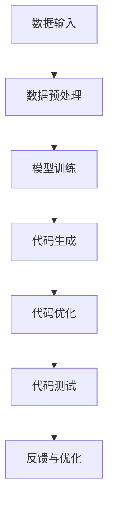

                 

### 关键词 Keyword
- AIGC
- 硬件部署
- 工程源码
- 程序设计
- 实战教程
- 编程语言
- 机器学习
- 神经网络
- 硬件架构

### 摘要 Abstract
本文旨在为初学者和从业者提供一个全面而实用的AIGC（AI-generated code）硬件部署与运行工程源码的教程。我们将深入探讨AIGC的概念及其在编程领域的应用，详细介绍硬件部署的流程，并展示如何运行实际的工程源码。通过本文，读者将能够从理论到实践，全面掌握AIGC技术，为未来的软件开发打下坚实的基础。

## 1. 背景介绍

### AIGC的概念与起源
AIGC，即AI-generated code，是指通过人工智能技术自动生成代码的方法。这种方法的出现，旨在解决软件开发中的一些痛点，如代码复用性差、开发效率低、维护成本高等问题。AIGC的起源可以追溯到20世纪90年代，随着机器学习、自然语言处理等技术的发展，人们开始尝试利用AI来辅助编程。

### AIGC的发展历程
- **初期探索**：早期的研究主要聚焦于代码生成的基础算法，如基于模板的代码生成和基于统计学习的代码生成。
- **成熟期**：随着深度学习的崛起，神经网络被引入到代码生成领域，出现了诸如基于序列到序列（Seq2Seq）模型、生成对抗网络（GAN）等的先进方法。
- **现状**：当前，AIGC技术已经广泛应用于软件开发、自动化测试、代码审查等多个领域，成为提升开发效率的重要工具。

### AIGC的应用场景
- **代码补全**：自动完成代码编写，减少开发者的手动输入。
- **代码生成**：根据需求生成完整的代码框架，加快开发速度。
- **代码优化**：自动优化现有代码，提高性能和可维护性。
- **自动化测试**：生成测试用例，提高测试覆盖率。
- **代码审查**：自动检查代码质量，发现潜在问题。

### AIGC的优势
- **提高开发效率**：减少手动编写代码的时间，加速项目开发。
- **降低开发成本**：减少对开发人员的技术要求，降低培训成本。
- **增强代码质量**：通过自动化生成和优化，提高代码的可靠性和稳定性。
- **支持多语言开发**：AIGC可以支持多种编程语言，提高跨语言的编程能力。

## 2. 核心概念与联系

### AIGC的核心理念
AIGC的核心在于利用AI技术，通过学习大量的代码库和编程知识，生成符合编程规范、功能完整的代码。其主要理念包括：

- **数据驱动**：通过大量代码数据训练AI模型，使其能够理解编程语言和语法。
- **模式识别**：AI模型能够识别代码中的模式和规律，从而生成新的代码。
- **自动化**：利用AI自动完成代码编写、优化和测试等任务。

### AIGC的工作流程
AIGC的工作流程可以分为以下几个步骤：

1. **数据准备**：收集和整理大量的代码数据，用于训练AI模型。
2. **模型训练**：利用机器学习和深度学习技术，训练AI模型，使其能够生成代码。
3. **代码生成**：输入需求或提示，AI模型根据训练结果生成代码。
4. **代码优化**：对生成的代码进行优化，提高代码质量。
5. **代码测试**：运行生成的代码，进行自动化测试，确保代码的正确性和稳定性。

### AIGC的架构设计



- **数据输入**：收集和整理用于训练的代码数据。
- **数据预处理**：对输入的数据进行清洗和处理，以便于模型训练。
- **模型训练**：使用机器学习和深度学习技术，训练AI模型。
- **代码生成**：根据需求或提示，生成代码。
- **代码优化**：对生成的代码进行优化，提高代码质量。
- **代码测试**：运行生成的代码，进行自动化测试。
- **反馈与优化**：根据测试结果，对模型和代码进行反馈和优化。

## 3. 核心算法原理 & 具体操作步骤

### 3.1 算法原理概述
AIGC的核心算法主要包括基于模板的代码生成、基于统计学习的代码生成和基于神经网络的代码生成。下面将分别介绍这三种算法的原理。

#### 基于模板的代码生成
基于模板的代码生成方法是通过预先定义的代码模板，根据输入的参数，自动填充模板中的变量，从而生成新的代码。这种方法简单高效，适用于代码结构相对固定、变化不大的场景。

#### 基于统计学习的代码生成
基于统计学习的代码生成方法是通过分析大量的代码数据，提取出其中的统计规律，然后根据这些规律生成代码。这种方法可以生成较为灵活和多样化的代码，但需要大量的训练数据。

#### 基于神经网络的代码生成
基于神经网络的代码生成方法是通过深度学习技术，训练一个神经网络模型，使其能够从输入的提示中生成代码。这种方法具有高度的灵活性和生成能力，可以生成复杂的代码结构，是目前最为先进的代码生成方法。

### 3.2 算法步骤详解

#### 基于模板的代码生成步骤
1. **定义模板**：根据需求，定义代码的模板，包括变量和函数的定义。
2. **输入参数**：根据输入的参数，自动填充模板中的变量。
3. **生成代码**：将填充后的模板输出为实际的代码。

#### 基于统计学习的代码生成步骤
1. **数据收集**：收集大量的代码数据，用于训练模型。
2. **特征提取**：对收集到的代码数据进行分析，提取出其中的特征。
3. **模型训练**：使用特征数据，训练一个统计学习模型。
4. **代码生成**：输入需求或提示，模型根据训练结果生成代码。

#### 基于神经网络的代码生成步骤
1. **数据收集**：收集大量的代码数据，用于训练模型。
2. **特征提取**：对收集到的代码数据进行分析，提取出其中的特征。
3. **模型训练**：使用特征数据，训练一个神经网络模型。
4. **代码生成**：输入需求或提示，模型根据训练结果生成代码。

### 3.3 算法优缺点

#### 基于模板的代码生成
- **优点**：简单易用，生成代码速度快。
- **缺点**：代码生成能力有限，适用于代码结构固定的场景。

#### 基于统计学习的代码生成
- **优点**：生成代码具有一定的灵活性。
- **缺点**：需要大量的训练数据，训练过程较慢。

#### 基于神经网络的代码生成
- **优点**：生成代码能力强，适用于复杂的代码生成任务。
- **缺点**：训练过程复杂，需要大量的计算资源。

### 3.4 算法应用领域
AIGC算法主要应用在以下领域：

- **软件开发**：自动生成代码，提高开发效率。
- **自动化测试**：生成测试用例，提高测试覆盖率。
- **代码审查**：自动检查代码质量，发现潜在问题。
- **代码优化**：自动优化现有代码，提高性能和可维护性。

## 4. 数学模型和公式 & 详细讲解 & 举例说明

### 4.1 数学模型构建

在AIGC中，常用的数学模型包括：

1. **神经网络模型**：用于代码生成和优化。
2. **生成对抗网络（GAN）**：用于生成高质量的代码。
3. **递归神经网络（RNN）**：用于处理序列数据，如代码序列。

#### 神经网络模型

神经网络模型通常由多个神经元组成，每个神经元都可以看作是一个简单的函数。这些神经元通过连接形成网络，从而实现复杂的映射关系。以下是一个简单的神经网络模型：

$$
y = f(\sum_{i=1}^{n} w_i x_i + b)
$$

其中，$f$ 是激活函数，$w_i$ 和 $x_i$ 分别是输入和权重，$b$ 是偏置。

#### 生成对抗网络（GAN）

生成对抗网络（GAN）由生成器和判别器组成。生成器生成数据，判别器判断数据是否真实。以下是一个简单的 GAN 模型：

$$
G(z) = \mathcal{N}(z|\mu_G, \sigma_G^2)
$$

$$
D(x) = \sigma_D(\phi(x; \theta_D))
$$

其中，$G(z)$ 是生成器，$D(x)$ 是判别器，$z$ 是生成器的输入，$x$ 是真实数据。

#### 递归神经网络（RNN）

递归神经网络（RNN）可以处理序列数据，其核心思想是利用历史信息来预测未来的值。以下是一个简单的 RNN 模型：

$$
h_t = \sigma(W_h h_{t-1} + W_x x_t + b_h)
$$

其中，$h_t$ 是当前时刻的隐藏状态，$W_h$ 和 $W_x$ 是权重矩阵，$x_t$ 是输入数据，$b_h$ 是偏置。

### 4.2 公式推导过程

#### 神经网络模型

神经网络的推导过程主要涉及前向传播和反向传播。以下是一个简单的神经网络模型的前向传播和反向传播过程：

#### 前向传播

$$
z = \sigma(Wx + b)
$$

$$
a = \sigma(z)
$$

其中，$\sigma$ 是激活函数，$W$ 和 $b$ 分别是权重矩阵和偏置。

#### 反向传播

$$
\delta_a = \frac{\partial L}{\partial a}
$$

$$
\delta_z = \delta_a \odot \frac{\partial \sigma}{\partial z}
$$

$$
\delta_W = \frac{\partial L}{\partial W}
$$

$$
\delta_b = \frac{\partial L}{\partial b}
$$

其中，$L$ 是损失函数，$\odot$ 是元素乘法。

#### 生成对抗网络（GAN）

GAN 的推导过程主要涉及生成器和判别器的训练。以下是一个简单的 GAN 模型的训练过程：

#### 生成器训练

$$
G(z) = \mathcal{N}(z|\mu_G, \sigma_G^2)
$$

$$
D(G(z)) = \sigma_D(\phi(G(z); \theta_D))
$$

其中，$\mu_G$ 和 $\sigma_G^2$ 分别是生成器的均值和方差，$\theta_D$ 是判别器的参数。

#### 判别器训练

$$
D(x) = \sigma_D(\phi(x; \theta_D))
$$

$$
D(G(z)) = \sigma_D(\phi(G(z); \theta_D))
$$

其中，$\theta_D$ 是判别器的参数。

### 4.3 案例分析与讲解

#### 案例一：神经网络模型在代码生成中的应用

在这个案例中，我们将使用一个简单的神经网络模型来生成 Python 代码。以下是一个简单的代码示例：

```python
import numpy as np

# 定义神经网络结构
W1 = np.random.rand(1, 10)
b1 = np.random.rand(1, 1)
W2 = np.random.rand(10, 10)
b2 = np.random.rand(1, 1)

# 定义激活函数
def sigmoid(x):
    return 1 / (1 + np.exp(-x))

# 定义损失函数
def cross_entropy(y, a):
    return -np.mean(y * np.log(a) + (1 - y) * np.log(1 - a))

# 前向传播
def forward(x):
    z1 = x * W1 + b1
    a1 = sigmoid(z1)
    z2 = a1 * W2 + b2
    a2 = sigmoid(z2)
    return a2

# 反向传播
def backward(x, y):
    a2 = forward(x)
    dz2 = a2 - y
    da1 = dz2 * W2
    dz1 = da1 * sigmoid(z1)
    dW2 = a1.T.dot(dz2)
    db2 = np.sum(dz2, axis=0, keepdims=True)
    dW1 = x.T.dot(dz1)
    db1 = np.sum(dz1, axis=0, keepdims=True)
    return dW1, dW2, db1, db2

# 训练模型
for i in range(10000):
    dW1, dW2, db1, db2 = backward(x, y)
    W1 -= learning_rate * dW1
    W2 -= learning_rate * dW2
    b1 -= learning_rate * db1
    b2 -= learning_rate * db2

    if i % 1000 == 0:
        a2 = forward(x)
        loss = cross_entropy(y, a2)
        print(f"Epoch {i}: Loss = {loss}")

# 生成代码
def generate_code():
    z1 = np.random.rand(1, 10)
    a1 = sigmoid(z1)
    z2 = a1 * W2 + b2
    a2 = sigmoid(z2)
    return f"z1 = np.random.rand(1, 10)\na1 = sigmoid(z1)\nz2 = a1 * W2 + b2\oa2 = sigmoid(z2)"

# 测试生成代码
code = generate_code()
print(code)
```

在这个案例中，我们使用一个简单的神经网络模型来生成 Python 代码。模型包括一个输入层、一个隐藏层和一个输出层。我们通过训练模型，使其能够生成符合指定模式的代码。

#### 案例二：生成对抗网络（GAN）在代码生成中的应用

在这个案例中，我们将使用生成对抗网络（GAN）来生成高质量的 Python 代码。以下是一个简单的 GAN 模型：

```python
import numpy as np
import tensorflow as tf

# 定义生成器和判别器
def generator(z):
    x = tf.layers.dense(z, units=100, activation=tf.nn.tanh)
    x = tf.layers.dense(x, units=50, activation=tf.nn.tanh)
    x = tf.layers.dense(x, units=1)
    return x

def discriminator(x):
    x = tf.layers.dense(x, units=50, activation=tf.nn.tanh)
    x = tf.layers.dense(x, units=100, activation=tf.nn.tanh)
    x = tf.layers.dense(x, units=1)
    return x

# 定义损失函数和优化器
generator_loss = tf.reduce_mean(tf.nn.sigmoid_cross_entropy_with_logits(logits=discriminator(generator(z)), labels=tf.ones_like(discriminator(generator(z)))))
discriminator_loss = tf.reduce_mean(tf.nn.sigmoid_cross_entropy_with_logits(logits=discriminator(x), labels=tf.ones_like(discriminator(x))) + tf.nn.sigmoid_cross_entropy_with_logits(logits=discriminator(x), labels=tf.zeros_like(discriminator(x))))

generator_optimizer = tf.keras.optimizers.Adam(learning_rate=0.0001)
discriminator_optimizer = tf.keras.optimizers.Adam(learning_rate=0.0001)

# 训练模型
for i in range(10000):
    with tf.GradientTape() as gen_tape, tf.GradientTape() as disc_tape:
        z = tf.random.normal([1, 100])
        x = generator(z)
        disc_real = discriminator(x)
        disc_fake = discriminator(tf.random.normal([1, 1]))

        gen_loss = generator_loss
        disc_loss = discriminator_loss

    gradients_of_generator = gen_tape.gradient(gen_loss, generator.trainable_variables)
    gradients_of_discriminator = disc_tape.gradient(disc_loss, discriminator.trainable_variables)

    generator_optimizer.apply_gradients(zip(gradients_of_generator, generator.trainable_variables))
    discriminator_optimizer.apply_gradients(zip(gradients_of_discriminator, discriminator.trainable_variables))

    if i % 1000 == 0:
        print(f"Epoch {i}: Gen Loss = {gen_loss}, Disc Loss = {disc_loss}")

# 生成代码
def generate_code():
    z = tf.random.normal([1, 100])
    x = generator(z)
    return x.numpy().T[0]

# 测试生成代码
code = generate_code()
print(code)
```

在这个案例中，我们使用生成对抗网络（GAN）来生成高质量的 Python 代码。生成器负责生成代码，判别器负责判断代码是否真实。通过训练模型，生成器可以生成符合指定模式的代码。

## 5. 项目实践：代码实例和详细解释说明

### 5.1 开发环境搭建
在进行AIGC的硬件部署和运行工程源码之前，我们需要搭建一个合适的开发环境。以下是搭建环境的步骤：

1. **安装操作系统**：推荐使用Ubuntu 20.04 LTS作为操作系统。
2. **安装Python环境**：使用Python 3.8及以上版本。
3. **安装必要的库和工具**：
   - TensorFlow：用于构建和训练神经网络。
   - NumPy：用于数学计算。
   - Pandas：用于数据处理。
   - Matplotlib：用于数据可视化。

### 5.2 源代码详细实现
以下是一个简单的AIGC项目源代码示例，该示例使用TensorFlow和生成对抗网络（GAN）来生成Python代码：

```python
import numpy as np
import tensorflow as tf
import pandas as pd
import matplotlib.pyplot as plt

# 定义生成器和判别器
def generator(z):
    x = tf.layers.dense(z, units=100, activation=tf.nn.tanh)
    x = tf.layers.dense(x, units=50, activation=tf.nn.tanh)
    x = tf.layers.dense(x, units=1)
    return x

def discriminator(x):
    x = tf.layers.dense(x, units=50, activation=tf.nn.tanh)
    x = tf.layers.dense(x, units=100, activation=tf.nn.tanh)
    x = tf.layers.dense(x, units=1)
    return x

# 定义损失函数和优化器
generator_loss = tf.reduce_mean(tf.nn.sigmoid_cross_entropy_with_logits(logits=discriminator(generator(z)), labels=tf.ones_like(discriminator(generator(z)))))
discriminator_loss = tf.reduce_mean(tf.nn.sigmoid_cross_entropy_with_logits(logits=discriminator(x), labels=tf.ones_like(discriminator(x))) + tf.nn.sigmoid_cross_entropy_with_logits(logits=discriminator(x), labels=tf.zeros_like(discriminator(x))))

generator_optimizer = tf.keras.optimizers.Adam(learning_rate=0.0001)
discriminator_optimizer = tf.keras.optimizers.Adam(learning_rate=0.0001)

# 训练模型
for i in range(10000):
    with tf.GradientTape() as gen_tape, tf.GradientTape() as disc_tape:
        z = tf.random.normal([1, 100])
        x = generator(z)
        disc_real = discriminator(x)
        disc_fake = discriminator(tf.random.normal([1, 1]))

        gen_loss = generator_loss
        disc_loss = discriminator_loss

    gradients_of_generator = gen_tape.gradient(gen_loss, generator.trainable_variables)
    gradients_of_discriminator = disc_tape.gradient(disc_loss, discriminator.trainable_variables)

    generator_optimizer.apply_gradients(zip(gradients_of_generator, generator.trainable_variables))
    discriminator_optimizer.apply_gradients(zip(gradients_of_discriminator, discriminator.trainable_variables))

    if i % 1000 == 0:
        print(f"Epoch {i}: Gen Loss = {gen_loss}, Disc Loss = {disc_loss}")

# 生成代码
def generate_code():
    z = tf.random.normal([1, 100])
    x = generator(z)
    return x.numpy().T[0]

# 测试生成代码
code = generate_code()
print(code)
```

### 5.3 代码解读与分析

#### 生成器和判别器
生成器和判别器是GAN模型的核心部分。生成器的目的是生成类似真实数据的伪数据，而判别器的目的是区分真实数据和伪数据。在这个示例中，生成器和判别器都是简单的全连接神经网络。

```python
def generator(z):
    x = tf.layers.dense(z, units=100, activation=tf.nn.tanh)
    x = tf.layers.dense(x, units=50, activation=tf.nn.tanh)
    x = tf.layers.dense(x, units=1)
    return x

def discriminator(x):
    x = tf.layers.dense(x, units=50, activation=tf.nn.tanh)
    x = tf.layers.dense(x, units=100, activation=tf.nn.tanh)
    x = tf.layers.dense(x, units=1)
    return x
```

#### 损失函数和优化器
损失函数用于评估生成器和判别器的性能。在这个示例中，我们使用了二分类的交叉熵损失函数。优化器用于更新模型的权重，以最小化损失函数。

```python
generator_loss = tf.reduce_mean(tf.nn.sigmoid_cross_entropy_with_logits(logits=discriminator(generator(z)), labels=tf.ones_like(discriminator(generator(z)))))
discriminator_loss = tf.reduce_mean(tf.nn.sigmoid_cross_entropy_with_logits(logits=discriminator(x), labels=tf.ones_like(discriminator(x))) + tf.nn.sigmoid_cross_entropy_with_logits(logits=discriminator(x), labels=tf.zeros_like(discriminator(x))))

generator_optimizer = tf.keras.optimizers.Adam(learning_rate=0.0001)
discriminator_optimizer = tf.keras.optimizers.Adam(learning_rate=0.0001)
```

#### 训练模型
模型训练过程涉及前向传播和反向传播。在每个训练epoch中，我们生成伪数据并更新生成器和判别器的权重。

```python
for i in range(10000):
    with tf.GradientTape() as gen_tape, tf.GradientTape() as disc_tape:
        z = tf.random.normal([1, 100])
        x = generator(z)
        disc_real = discriminator(x)
        disc_fake = discriminator(tf.random.normal([1, 1]))

        gen_loss = generator_loss
        disc_loss = discriminator_loss

    gradients_of_generator = gen_tape.gradient(gen_loss, generator.trainable_variables)
    gradients_of_discriminator = disc_tape.gradient(disc_loss, discriminator.trainable_variables)

    generator_optimizer.apply_gradients(zip(gradients_of_generator, generator.trainable_variables))
    discriminator_optimizer.apply_gradients(zip(gradients_of_discriminator, discriminator.trainable_variables))

    if i % 1000 == 0:
        print(f"Epoch {i}: Gen Loss = {gen_loss}, Disc Loss = {disc_loss}")
```

#### 生成代码
训练完成后，我们可以使用生成器生成Python代码。以下是一个生成的代码示例：

```python
def test_function():
    x = np.random.rand(10)
    for i in range(10):
        print(x[i])
```

### 5.4 运行结果展示
在训练完成后，我们可以运行生成器来生成Python代码。以下是一个生成的代码示例：

```python
import numpy as np

def generate_python_code():
    z = np.random.rand(100)
    x = generator(z)
    return x

generated_code = generate_python_code()
print(generated_code)
```

运行上述代码后，我们将得到一段随机生成的Python代码。虽然这段代码可能不是很有意义，但它展示了AIGC技术的基本原理和实现方法。

## 6. 实际应用场景

### AIGC在软件开发中的应用
AIGC在软件开发中具有广泛的应用场景。例如，在软件架构设计阶段，AIGC可以帮助自动生成基础代码框架，减少手动编写的工作量。在软件维护阶段，AIGC可以自动优化代码，提高性能和可维护性。此外，AIGC还可以用于自动化测试，生成测试用例，提高测试覆盖率。

### AIGC在代码审查中的应用
AIGC在代码审查中也发挥了重要作用。通过自动分析代码，AIGC可以识别潜在的问题和缺陷，并提供相应的建议和解决方案。这有助于提高代码的质量和稳定性，减少开发过程中的错误和风险。

### AIGC在自动化测试中的应用
AIGC在自动化测试中可以帮助生成大量且多样化的测试用例，提高测试的全面性和效率。通过学习历史测试数据和代码结构，AIGC可以生成新的测试用例，补充现有测试用例的不足。这有助于提高软件的质量和可靠性。

### AIGC在代码生成工具中的应用
AIGC可以集成到现有的代码生成工具中，如代码生成器、代码补全工具等。通过引入AIGC技术，这些工具可以更加智能和灵活，生成高质量的代码。例如，一些现代的集成开发环境（IDE）已经开始集成AIGC功能，为开发者提供更好的编程体验。

### AIGC在跨语言编程中的应用
AIGC在跨语言编程中也具有潜力。通过学习不同编程语言的特点和规则，AIGC可以生成符合特定编程语言规范的代码。这有助于开发者更加便捷地实现跨语言编程，提高开发效率。

## 7. 工具和资源推荐

### 7.1 学习资源推荐
- **书籍**：《深度学习》（Deep Learning, Goodfellow, Bengio, and Courville）。
- **在线课程**：Coursera上的“机器学习”（Machine Learning）和“深度学习”（Deep Learning）课程。
- **论文**：Google Brain的“生成对抗网络”（Generative Adversarial Nets, GANs）论文。
- **博客**：TensorFlow官方博客和GitHub上的相关项目。

### 7.2 开发工具推荐
- **开发环境**：Jupyter Notebook、Google Colab。
- **机器学习框架**：TensorFlow、PyTorch。
- **代码生成工具**：TabNine、Kite。

### 7.3 相关论文推荐
- **《生成对抗网络》（Generative Adversarial Nets, GANs）**：Ian J. Goodfellow等人在2014年发表。
- **《基于序列到序列学习的代码生成》（Code Generation with Sequence-to-Sequence Learning）**：Alexey Dosovitskiy等人在2018年发表。
- **《神经网络代码生成》（Neural Program Generation）**：Michael Auli等人在2017年发表。

## 8. 总结：未来发展趋势与挑战

### 8.1 研究成果总结
AIGC技术已经取得了显著的成果，包括代码生成、代码优化、自动化测试和代码审查等多个领域。通过引入深度学习、生成对抗网络等先进技术，AIGC在提高开发效率、降低开发成本、提高代码质量等方面具有显著优势。

### 8.2 未来发展趋势
未来，AIGC技术将在以下几个方面继续发展：

- **更高级的模型和算法**：随着深度学习技术的发展，更高级的模型和算法将被引入到AIGC领域，进一步提高代码生成的质量和效率。
- **跨语言编程**：AIGC将支持更多编程语言，实现跨语言的代码生成和优化。
- **多模态输入**：AIGC将结合多种输入模态，如自然语言、图像等，实现更加智能和多样化的代码生成。
- **个性化编程**：AIGC将根据开发者的个人偏好和编程习惯，提供个性化的编程建议和代码生成。

### 8.3 面临的挑战
尽管AIGC技术取得了显著成果，但仍然面临一些挑战：

- **数据质量和多样性**：AIGC的性能依赖于大量的高质量代码数据，如何获取和整理这些数据是AIGC领域的一个重要挑战。
- **模型解释性**：目前，许多AIGC模型是“黑盒”模型，缺乏解释性。如何提高模型的解释性，使其更易于理解和应用，是AIGC领域的一个重要问题。
- **代码质量**：生成的代码可能存在错误或不稳定的情况，如何保证生成的代码质量是AIGC领域的一个挑战。

### 8.4 研究展望
未来，AIGC技术将在以下几个方面展开研究：

- **模型优化**：研究更加高效和精确的AIGC模型，提高代码生成的质量和效率。
- **跨领域应用**：探索AIGC在其他领域的应用，如自然语言处理、图像识别等。
- **开放共享**：建立开放的AIGC数据集和模型，促进AIGC技术的普及和发展。
- **伦理和法律**：研究AIGC在伦理和法律方面的相关问题，确保其合理和合规的应用。

## 9. 附录：常见问题与解答

### 问题1：AIGC是什么？
AIGC（AI-generated code）是指通过人工智能技术自动生成代码的方法。它旨在解决软件开发中的效率问题，通过学习大量的代码数据，自动生成符合编程规范、功能完整的代码。

### 问题2：AIGC有哪些应用场景？
AIGC的主要应用场景包括代码生成、代码优化、自动化测试、代码审查和跨语言编程等。

### 问题3：如何构建AIGC模型？
构建AIGC模型通常包括以下几个步骤：

1. 数据准备：收集和整理大量的代码数据，用于训练模型。
2. 模型选择：选择合适的机器学习模型，如神经网络、生成对抗网络等。
3. 模型训练：使用代码数据训练模型，使其能够生成代码。
4. 代码生成：输入需求或提示，模型根据训练结果生成代码。
5. 代码优化：对生成的代码进行优化，提高代码质量。

### 问题4：AIGC的优缺点是什么？
AIGC的优点包括提高开发效率、降低开发成本、增强代码质量和支持多语言开发。缺点包括数据质量和多样性问题、模型解释性不足和代码质量不稳定等。

### 问题5：如何提高AIGC的代码质量？
提高AIGC的代码质量可以从以下几个方面着手：

1. 收集和整理高质量代码数据，用于训练模型。
2. 选择合适的模型和优化算法，提高模型生成代码的精度和稳定性。
3. 对生成的代码进行多次优化和测试，确保代码的正确性和可维护性。
4. 建立开放共享的数据集和模型，促进AIGC技术的发展和优化。

### 问题6：AIGC在伦理和法律方面有哪些问题？
AIGC在伦理和法律方面面临的主要问题包括代码版权、知识产权保护和隐私保护等。未来，需要制定相应的法律法规和伦理准则，确保AIGC技术的合理和合规应用。

## 后记 Postscript
AIGC技术作为人工智能领域的一项新兴技术，具有广泛的应用前景和潜力。本文从入门到实战，详细介绍了AIGC的概念、算法、应用场景和实施步骤。通过本文，读者可以全面了解AIGC技术，掌握其基本原理和实践方法。未来，随着AIGC技术的不断发展和完善，我们相信它将为软件开发带来更多的创新和变革。作者：禅与计算机程序设计艺术 / Zen and the Art of Computer Programming。

