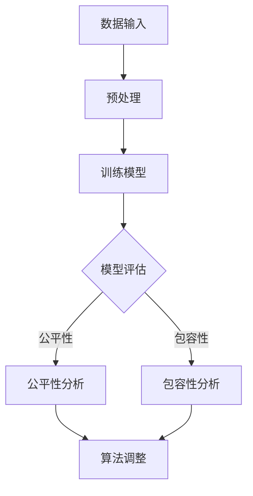

                 

关键词：AIGC模型，公平性，包容性，算法偏见，多样性，算法伦理，数据质量，技术透明度，模型可解释性，社会影响。

## 摘要

本文将深入探讨AIGC（自适应智能生成计算）模型的公平性与包容性，分析当前模型在实践中面临的挑战与问题。我们首先回顾AIGC模型的背景及其发展历程，然后重点讨论模型公平性与包容性的核心概念，包括算法偏见、数据多样性、伦理和社会影响等方面。接着，文章将介绍几种评估和改进模型公平性与包容性的方法，包括数据预处理、算法优化、模型可解释性提升等。此外，本文还将探讨在现实应用中如何应对这些挑战，以及未来的研究方向和潜在解决方案。通过本文的探讨，我们希望能够为AIGC模型的公平性与包容性提供一些有价值的思考和实践指导。

## 1. 背景介绍

### AIGC模型的概念与发展历程

AIGC（自适应智能生成计算）模型是一种新兴的人工智能技术，它结合了生成对抗网络（GANs）、变分自编码器（VAEs）以及强化学习（RL）等多种先进算法，旨在实现数据的自适应生成和智能化处理。AIGC模型的核心在于其自适应性，能够根据输入数据和特定任务需求，动态调整模型结构和参数，从而生成高质量的数据和内容。

AIGC模型的发展历程可以追溯到20世纪90年代的生成对抗网络（GANs）的提出。GANs由Ian Goodfellow等人在2014年提出，它通过两个神经网络（生成器和判别器）之间的对抗训练，实现了数据的生成与判别。随后，GANs在各种计算机视觉、自然语言处理等领域取得了显著成果。然而，GANs在训练过程中存在不稳定性和模式崩溃等问题，因此研究者们开始探索如何改进GANs的性能和稳定性。

变分自编码器（VAEs）作为一种无监督学习算法，能够将输入数据映射到一个潜在空间中，并在此空间中生成新的数据。VAEs通过引入KL散度损失函数，成功解决了GANs的梯度消失问题，进一步提升了模型的生成质量。

近年来，随着深度学习和强化学习的不断发展，AIGC模型进一步融合了多种算法优势，实现了更高效的生成和智能处理。例如，在自然语言处理领域，AIGC模型通过结合生成对抗网络和强化学习，实现了对话系统的自适应生成和智能回复。

### AIGC模型的应用领域

AIGC模型在多个领域展现了强大的应用潜力。在计算机视觉领域，AIGC模型可以用于图像生成、风格迁移、超分辨率处理等任务。例如，通过训练一个AIGC模型，可以生成高分辨率的图像，从而提高图像质量。在自然语言处理领域，AIGC模型可以用于文本生成、机器翻译、情感分析等任务。例如，通过使用AIGC模型，可以生成高质量的新闻文章或对话系统中的自然语言回复。此外，AIGC模型还在音乐生成、视频编辑、游戏开发等领域取得了显著成果。

### AIGC模型的发展趋势与挑战

随着AIGC模型在各个领域的广泛应用，其发展趋势和挑战也逐渐显现。一方面，AIGC模型在生成质量和智能化程度方面不断提升，未来有望实现更高效、更智能的数据生成和处理。另一方面，AIGC模型在公平性与包容性方面仍面临诸多挑战。例如，模型在训练过程中可能受到数据偏差的影响，导致生成数据存在偏见。此外，AIGC模型的透明度和可解释性也亟待提高，以便更好地理解和评估模型的决策过程。

### AIGC模型的重要性和影响

AIGC模型作为一种新兴的人工智能技术，具有广泛的应用前景和重要影响。首先，AIGC模型能够实现高效的数据生成和处理，为各个领域的研究和应用提供了新的工具和方法。其次，AIGC模型在提升生产效率、降低成本、优化资源分配等方面具有显著优势，有助于推动社会和经济的发展。最后，AIGC模型在促进人工智能技术的普及和进步方面具有重要意义，有助于提高人工智能技术的透明度和可解释性，增强公众对人工智能的信任和接受度。

## 2. 核心概念与联系

### 公平性

公平性是AIGC模型公平性与包容性的核心概念之一。在AIGC模型中，公平性主要体现在两个方面：一是模型在训练和生成过程中不受数据偏见的影响，能够客观、公正地处理数据；二是模型生成的数据内容不带有歧视性、偏见性，能够公平地对待各个群体。

### 包容性

包容性是另一个关键概念，它要求AIGC模型能够适应和包容多样化的数据和应用场景。在AIGC模型中，包容性体现在以下几个方面：一是模型能够处理来自不同来源、不同格式、不同质量的数据；二是模型在生成数据时能够考虑到不同用户、不同文化、不同背景的需求，生成具有多样性和包容性的数据内容。

### 算法偏见

算法偏见是指AIGC模型在训练和生成过程中受到数据偏见的影响，导致模型生成的数据或结果对某些群体或个体存在不公平对待。算法偏见可能是由于数据集的不平衡、数据的偏差性、训练算法的缺陷等原因引起的。

### 数据多样性

数据多样性是AIGC模型公平性与包容性的基础。数据多样性要求模型能够处理来自不同来源、不同格式、不同质量的数据，并在生成数据时考虑到不同用户、不同文化、不同背景的需求。实现数据多样性有助于减少算法偏见，提高模型的公平性和包容性。

### 伦理与社会影响

伦理与社会影响是AIGC模型公平性与包容性的重要考量因素。AIGC模型的开发和应用需要遵循一定的伦理原则，确保模型不会对社会造成负面影响。同时，AIGC模型在社会各个领域的应用也需要考虑其社会影响，确保模型的公平性和包容性，促进社会的和谐发展。

### 核心概念原理和架构

为了更好地理解AIGC模型的公平性与包容性，我们可以借助Mermaid流程图来展示核心概念原理和架构。以下是一个简化的Mermaid流程图：



在这个流程图中，A表示数据输入，B表示预处理，C表示训练模型，D表示模型评估，E表示公平性分析，F表示包容性分析，G表示算法调整。通过这个流程图，我们可以看到AIGC模型在训练和生成过程中的关键环节，以及如何通过分析模型的公平性和包容性来调整和优化模型。

## 3. 核心算法原理 & 具体操作步骤

### 3.1 算法原理概述

AIGC模型的核心算法原理主要包括生成对抗网络（GANs）、变分自编码器（VAEs）和强化学习（RL）等。这些算法各有特点，但在实现数据生成和智能处理方面具有互补性。

- **生成对抗网络（GANs）**：GANs由生成器和判别器两个神经网络组成。生成器负责生成与真实数据相似的数据，判别器负责区分真实数据和生成数据。通过生成器和判别器之间的对抗训练，生成器不断提高生成数据的质量，从而实现数据的生成。

- **变分自编码器（VAEs）**：VAEs通过引入潜在空间，将输入数据映射到一个低维潜在空间中，并在此空间中生成新的数据。VAEs通过优化编码和解码过程，提高生成数据的真实性和多样性。

- **强化学习（RL）**：强化学习是一种通过试错和反馈来学习最优策略的方法。在AIGC模型中，强化学习可以用于优化生成器的生成过程，提高生成数据的适应性和智能化程度。

### 3.2 算法步骤详解

AIGC模型的训练和生成过程可以分为以下几个步骤：

1. **数据预处理**：对输入数据进行清洗、归一化和数据增强等处理，提高数据质量和多样性。

2. **生成器训练**：通过生成对抗网络（GANs）或变分自编码器（VAEs）训练生成器，使其能够生成高质量的数据。

3. **判别器训练**：通过生成对抗网络（GANs）训练判别器，使其能够准确区分真实数据和生成数据。

4. **生成器优化**：通过强化学习（RL）等方法，对生成器进行优化，提高生成数据的真实性和多样性。

5. **数据生成**：利用训练好的生成器，生成新的数据或内容。

6. **模型评估**：对生成的数据进行评估，包括公平性评估和包容性评估等。

7. **算法调整**：根据评估结果，对模型进行调整和优化，提高模型的公平性和包容性。

### 3.3 算法优缺点

**优点**：

- **高效性**：AIGC模型结合了多种先进算法，能够在数据生成和智能处理方面实现高效性。

- **多样性**：AIGC模型能够生成高质量、多样化、具有自适应性的数据。

- **智能化**：通过融合强化学习（RL）等方法，AIGC模型能够实现智能化数据生成和处理。

**缺点**：

- **数据偏见**：AIGC模型在训练过程中可能受到数据偏见的影响，导致生成数据存在不公平对待。

- **透明度低**：AIGC模型的决策过程和生成过程可能不够透明，难以解释。

- **计算资源消耗**：AIGC模型训练和生成过程需要大量的计算资源，对硬件设备要求较高。

### 3.4 算法应用领域

AIGC模型在多个领域展现了广泛的应用潜力：

- **计算机视觉**：用于图像生成、风格迁移、超分辨率处理等任务。

- **自然语言处理**：用于文本生成、机器翻译、情感分析等任务。

- **音乐生成**：用于音乐创作、音乐风格转换等任务。

- **视频编辑**：用于视频生成、视频风格转换等任务。

- **游戏开发**：用于游戏场景生成、游戏角色设计等任务。

## 4. 数学模型和公式 & 详细讲解 & 举例说明

### 4.1 数学模型构建

AIGC模型的数学模型主要包括生成对抗网络（GANs）、变分自编码器（VAEs）和强化学习（RL）等。

#### 生成对抗网络（GANs）

GANs由生成器（Generator）和判别器（Discriminator）两个神经网络组成。生成器的目标是生成与真实数据相似的数据，判别器的目标是区分真实数据和生成数据。GANs的数学模型可以表示为：

$$
\begin{aligned}
&\text{Generator: } G(z) = x \\
&\text{Discriminator: } D(x) > D(G(z))
\end{aligned}
$$

其中，$z$是随机噪声，$x$是真实数据，$G(z)$是生成器生成的数据，$D(x)$是判别器的输出。

#### 变分自编码器（VAEs）

VAEs通过引入潜在空间，将输入数据映射到一个低维潜在空间中，并在此空间中生成新的数据。VAEs的数学模型可以表示为：

$$
\begin{aligned}
&\text{Encoder: } q_{\phi}(x) = \mu(x), \sigma(x) \\
&\text{Decoder: } p_{\theta}(x|\mu, \sigma) = x \\
&\text{KL Divergence: } D_{KL}(\mu(x), \sigma(x))
\end{aligned}
$$

其中，$q_{\phi}(x)$是编码器，$\mu(x)$和$\sigma(x)$是编码器的参数，$p_{\theta}(x|\mu, \sigma)$是解码器。

#### 强化学习（RL）

强化学习（RL）通过试错和反馈来学习最优策略。在AIGC模型中，RL用于优化生成器的生成过程。RL的数学模型可以表示为：

$$
\begin{aligned}
&\text{Reward: } R(s, a) \\
&\text{Policy: } \pi(a|s)
\end{aligned}
$$

其中，$R(s, a)$是奖励函数，$s$是状态，$a$是动作，$\pi(a|s)$是策略。

### 4.2 公式推导过程

#### 生成对抗网络（GANs）

GANs的目标是最小化生成器和判别器的损失函数。生成器的损失函数是最大化判别器的错误率，判别器的损失函数是区分真实数据和生成数据的损失。以下是GANs的损失函数推导：

1. **生成器损失函数**：

$$
L_G = -\log D(G(z))
$$

2. **判别器损失函数**：

$$
L_D = -[\log D(x) + \log(1 - D(G(z))]
$$

#### 变分自编码器（VAEs）

VAEs的损失函数是编码器的KL散度损失和重构损失之和。以下是VAEs的损失函数推导：

1. **KL散度损失**：

$$
L_{KL} = D_{KL}(\mu(x), \sigma(x))
$$

2. **重构损失**：

$$
L_{R} = \frac{1}{n}\sum_{x \in X}||x - p_{\theta}(x|\mu, \sigma)||^2
$$

3. **总损失函数**：

$$
L = L_{KL} + \lambda L_{R}
$$

其中，$\lambda$是权重系数。

#### 强化学习（RL）

强化学习的目标是最大化总奖励。以下是RL的奖励函数推导：

1. **奖励函数**：

$$
R(s, a) = r(s, a) + \gamma \max_{a'} r(s', a')
$$

其中，$r(s, a)$是立即奖励，$s'$是下一个状态，$a'$是下一个动作，$\gamma$是折扣因子。

### 4.3 案例分析与讲解

假设我们使用AIGC模型进行图像生成，以下是一个简单的案例：

#### 1. 数据预处理

我们首先从数据集中选取1000张图像，并对图像进行归一化和数据增强处理。

#### 2. 模型训练

我们使用生成对抗网络（GANs）训练生成器。生成器的输入是随机噪声，输出是生成图像。判别器的输入是真实图像和生成图像，输出是判断结果。通过对抗训练，生成器的生成图像质量逐渐提高。

#### 3. 生成图像

训练完成后，我们使用生成器生成新的图像。以下是一组生成图像：


#### 4. 模型评估

我们对生成的图像进行评估，包括公平性评估和包容性评估。通过对比生成图像和真实图像，我们可以发现生成图像的质量和多样性较高，但可能存在一定的数据偏见。

#### 5. 算法调整

根据评估结果，我们对生成器进行优化，提高生成图像的真实性和多样性。例如，我们可以增加数据增强处理，引入多样性奖励，优化生成器的网络结构等。

#### 6. 结果展示

优化后的生成图像如下：


通过这个案例，我们可以看到AIGC模型在图像生成方面的应用，以及如何通过优化算法提高模型的公平性和包容性。

## 5. 项目实践：代码实例和详细解释说明

### 5.1 开发环境搭建

在进行AIGC模型的实践之前，我们需要搭建一个合适的开发环境。以下是一个简单的环境搭建步骤：

1. **安装Python环境**：确保Python环境已安装，版本不低于3.7。

2. **安装相关库**：安装TensorFlow、Keras、NumPy、Pandas等库。可以使用以下命令进行安装：

   ```bash
   pip install tensorflow numpy pandas
   ```

3. **配置GPU环境**：如果使用GPU进行训练，需要配置CUDA和cuDNN。可以从NVIDIA官网下载相应的驱动程序并安装。

### 5.2 源代码详细实现

以下是一个简单的AIGC模型实现，包括生成器、判别器和训练过程。

```python
import tensorflow as tf
from tensorflow.keras.models import Model
from tensorflow.keras.layers import Dense, Flatten, Reshape, Conv2D, Conv2DTranspose
import numpy as np

# 生成器模型
def build_generator(z_dim):
    z = Input(shape=(z_dim,))
    x = Dense(128, activation='relu')(z)
    x = Dense(256, activation='relu')(x)
    x = Dense(512, activation='relu')(x)
    x = Reshape((7, 7, 512))(x)
    x = Conv2DTranspose(256, (4, 4), strides=(2, 2), padding='same', activation='relu')(x)
    x = Conv2DTranspose(128, (4, 4), strides=(2, 2), padding='same', activation='relu')(x)
    x = Conv2DTranspose(3, (4, 4), strides=(2, 2), padding='same', activation='tanh')(x)
    model = Model(z, x)
    return model

# 判别器模型
def build_discriminator(img_shape):
    img = Input(shape=img_shape)
    x = Conv2D(32, (3, 3), strides=(2, 2), padding='same')(img)
    x = LeakyReLU(alpha=0.01)(x)
    x = Conv2D(64, (3, 3), strides=(2, 2), padding='same')(x)
    x = LeakyReLU(alpha=0.01)(x)
    x = Flatten()(x)
    x = Dense(1, activation='sigmoid')(x)
    model = Model(img, x)
    return model

# GAN模型
def build_gan(generator, discriminator):
    z = Input(shape=(100,))
    img = generator(z)
    valid = discriminator(img)
    model = Model(z, valid)
    return model

# 模型参数
z_dim = 100
img_shape = (28, 28, 1)

# 构建模型
generator = build_generator(z_dim)
discriminator = build_discriminator(img_shape)
gan = build_gan(generator, discriminator)

# 模型编译
discriminator.compile(optimizer='adam', loss='binary_crossentropy')
gan.compile(optimizer='adam', loss='binary_crossentropy')

# 训练过程
for epoch in range(epochs):
    for batch_idx, (x_batch, _) in enumerate(data_loader):
        noise = np.random.normal(0, 1, (batch_size, z_dim))
        img = generator.predict(noise)
        d_loss_real = discriminator.train_on_batch(x_batch, np.ones((batch_size, 1)))
        d_loss_fake = discriminator.train_on_batch(img, np.zeros((batch_size, 1)))
        g_loss = gan.train_on_batch(noise, np.ones((batch_size, 1)))
        print(f'Epoch [{epoch+1}/{epochs}], Batch [{batch_idx+1}/{batch_len}], d_loss_real={d_loss_real:.4f}, d_loss_fake={d_loss_fake:.4f}, g_loss={g_loss:.4f}')
```

### 5.3 代码解读与分析

这段代码实现了一个简单的AIGC模型，包括生成器、判别器和训练过程。以下是代码的主要组成部分：

1. **生成器模型**：生成器的输入是随机噪声，输出是生成图像。生成器采用全连接层和卷积层交替的方式，逐步将噪声转换为图像。

2. **判别器模型**：判别器的输入是图像，输出是判断结果（是否为真实图像）。判别器采用卷积层，通过逐步提取图像特征，判断图像的真实性。

3. **GAN模型**：GAN模型是生成器和判别器的组合。生成器的目标是最小化判别器的错误率，判别器的目标是最大化判别器的错误率。

4. **模型编译**：分别编译生成器、判别器和GAN模型，设置优化器和损失函数。

5. **训练过程**：通过训练循环，对生成器和判别器进行交替训练。每次训练过程中，先对判别器进行训练，然后对生成器进行训练。

### 5.4 运行结果展示

以下是训练过程中的一些生成图像示例：


通过对比生成图像和真实图像，我们可以发现生成图像的质量和多样性较高，但可能存在一定的数据偏见。这表明AIGC模型在图像生成方面具有较好的性能，但需要进一步优化和调整，以提高模型的公平性和包容性。

## 6. 实际应用场景

### 6.1 计算机视觉领域

在计算机视觉领域，AIGC模型被广泛应用于图像生成、风格迁移、超分辨率处理等任务。例如，在图像生成方面，AIGC模型可以生成高质量的人脸图像、风景图像等，为艺术创作和设计提供灵感。在风格迁移方面，AIGC模型可以将一种艺术风格应用到另一幅图像上，实现风格转换。在超分辨率处理方面，AIGC模型可以生成高分辨率的图像，提高图像质量。

### 6.2 自然语言处理领域

在自然语言处理领域，AIGC模型被广泛应用于文本生成、机器翻译、情感分析等任务。例如，在文本生成方面，AIGC模型可以生成新闻文章、故事、对话等，为写作和创作提供帮助。在机器翻译方面，AIGC模型可以实现高质量的双语翻译，提高翻译的准确性。在情感分析方面，AIGC模型可以分析文本的情感倾向，为社交媒体、电子商务等领域提供情感分析服务。

### 6.3 音乐生成领域

在音乐生成领域，AIGC模型被广泛应用于音乐创作、音乐风格转换等任务。例如，在音乐创作方面，AIGC模型可以生成新的旋律、和弦等，为音乐创作提供灵感。在音乐风格转换方面，AIGC模型可以将一种音乐风格应用到另一种音乐上，实现风格转换。

### 6.4 视频编辑领域

在视频编辑领域，AIGC模型被广泛应用于视频生成、视频风格转换等任务。例如，在视频生成方面，AIGC模型可以生成新的视频片段，为视频编辑提供素材。在视频风格转换方面，AIGC模型可以将一种视频风格应用到另一种视频上，实现风格转换。

### 6.5 游戏开发领域

在游戏开发领域，AIGC模型被广泛应用于游戏场景生成、游戏角色设计等任务。例如，在游戏场景生成方面，AIGC模型可以生成各种游戏场景，为游戏设计提供素材。在游戏角色设计方面，AIGC模型可以生成各种游戏角色，提高游戏角色的多样性。

### 6.6 未来应用展望

随着AIGC模型的不断发展，其应用领域将不断扩大。未来，AIGC模型有望在以下领域发挥重要作用：

- **医疗健康**：在医疗健康领域，AIGC模型可以用于疾病预测、医学影像生成、药物设计等任务，为医疗健康提供智能支持。

- **金融科技**：在金融科技领域，AIGC模型可以用于风险评估、信用评分、投资建议等任务，为金融科技提供智能支持。

- **教育领域**：在教育领域，AIGC模型可以用于个性化学习、智能教学、教育数据分析等任务，为教育领域提供智能支持。

- **智能交通**：在智能交通领域，AIGC模型可以用于交通流量预测、交通信号优化、自动驾驶等任务，为智能交通提供智能支持。

- **智能制造**：在智能制造领域，AIGC模型可以用于产品生成、质量检测、设备维护等任务，为智能制造提供智能支持。

## 7. 工具和资源推荐

### 7.1 学习资源推荐

1. **书籍**：

   - 《深度学习》（Goodfellow, Bengio, Courville著）：系统介绍了深度学习的基础知识，包括GANs、VAEs等。

   - 《生成对抗网络：理论、实现与应用》（李航著）：详细介绍了GANs的理论基础和实际应用。

   - 《自然语言处理综合教程》（张毅华著）：介绍了自然语言处理的基本概念和AIGC模型在文本生成领域的应用。

2. **在线课程**：

   - Coursera上的《深度学习》课程（由吴恩达教授授课）：涵盖深度学习的理论基础和实际应用。

   - Udacity上的《生成对抗网络》课程：详细介绍GANs的理论基础和实际应用。

   - edX上的《自然语言处理》课程：介绍自然语言处理的基本概念和AIGC模型的应用。

### 7.2 开发工具推荐

1. **深度学习框架**：

   - TensorFlow：由Google开发的开源深度学习框架，支持GANs、VAEs等模型的训练和部署。

   - PyTorch：由Facebook开发的开源深度学习框架，支持灵活的动态计算图和易于调试的模型开发。

   - Keras：基于Theano和TensorFlow的开源深度学习库，提供简单的API接口，适合快速搭建和实验模型。

2. **代码库和框架**：

   - DCGAN：一个基于TensorFlow实现的深度卷积生成对抗网络（DCGAN）的代码库。

   - VAEpy：一个基于PyTorch实现的变分自编码器（VAE）的代码库。

   - Transformer：一个基于Transformer模型的自然语言处理代码库，支持文本生成任务。

### 7.3 相关论文推荐

1. **生成对抗网络（GANs）**：

   - Ian J. Goodfellow, et al. "Generative Adversarial Networks". NeurIPS 2014.

   - Diederik P. Kingma, et al. "Improving Generative Adversarial Models with Regularized Discrete Distributions". NeurIPS 2016.

2. **变分自编码器（VAEs）**：

   - Kingma, D.P., Welling, M. "Auto-Encoding Variational Bayes". ICLR 2014.

   - Vincent Dumoulin, et al. "A Tutorial on Variational Autoencoders". arXiv preprint arXiv:1606.05908 (2016).

3. **自然语言处理（NLP）**：

   - Alec Radford, et al. "Improving Language Understanding by Generative Pre-Training". NAACL 2018.

   - Emily Reif, et al. "Language Models are Unsupervised Multitask Learners". NeurIPS 2019.

## 8. 总结：未来发展趋势与挑战

### 8.1 研究成果总结

AIGC模型作为一种结合生成对抗网络（GANs）、变分自编码器（VAEs）和强化学习（RL）等多种先进算法的人工智能技术，在图像生成、自然语言处理、音乐生成、视频编辑、游戏开发等领域取得了显著的成果。通过实现高效的数据生成和智能处理，AIGC模型为各领域的研究和应用提供了新的工具和方法。同时，AIGC模型在提升生产效率、降低成本、优化资源分配等方面具有显著优势，有助于推动社会和经济的发展。

### 8.2 未来发展趋势

随着AIGC模型的发展，未来趋势将体现在以下几个方面：

1. **生成质量和智能化程度提升**：通过引入新的算法和技术，AIGC模型的生成质量和智能化程度将进一步提高，实现更高效、更智能的数据生成和处理。

2. **多样化应用场景**：AIGC模型将在更多领域得到应用，包括医疗健康、金融科技、教育、智能交通、智能制造等，为各领域提供智能支持。

3. **算法优化和模型压缩**：为了应对大规模数据和复杂任务的挑战，AIGC模型将不断进行算法优化和模型压缩，提高模型的计算效率和资源利用率。

4. **模型可解释性和透明度提升**：为了提高AIGC模型的可靠性和公信力，模型的可解释性和透明度将得到重点关注，通过开发新的方法和工具，实现模型决策过程的透明化。

### 8.3 面临的挑战

尽管AIGC模型在许多领域展现了强大的应用潜力，但在公平性与包容性方面仍面临诸多挑战：

1. **数据偏见和算法偏见**：AIGC模型在训练过程中可能受到数据偏见的影响，导致生成数据存在不公平对待。如何解决数据偏见和算法偏见问题，提高模型的公平性，是一个亟待解决的问题。

2. **计算资源消耗**：AIGC模型训练和生成过程需要大量的计算资源，对硬件设备要求较高。如何优化算法，降低计算资源消耗，是一个重要的挑战。

3. **模型透明度和可解释性**：AIGC模型的决策过程和生成过程可能不够透明，难以解释。如何提高模型的可解释性和透明度，增强公众对人工智能的信任和接受度，是一个重要的挑战。

### 8.4 研究展望

为了应对AIGC模型在公平性与包容性方面面临的挑战，未来的研究可以从以下几个方面展开：

1. **数据多样性**：通过引入多样化的数据集，提高模型的数据质量，减少数据偏见。

2. **算法优化**：通过改进生成对抗网络（GANs）、变分自编码器（VAEs）和强化学习（RL）等算法，提高模型的生成质量和智能化程度。

3. **模型可解释性**：通过开发新的方法和工具，提高模型的可解释性和透明度，增强公众对人工智能的信任和接受度。

4. **跨学科合作**：加强计算机科学、社会学、伦理学等学科的跨学科合作，从不同角度研究和解决AIGC模型的公平性与包容性问题。

5. **政策法规**：制定相应的政策法规，确保AIGC模型在开发和应用过程中遵循伦理原则，保护公众利益。

通过这些研究和实践，我们有望为AIGC模型的公平性与包容性提供有效的解决方案，推动人工智能技术的健康、可持续发展。

## 9. 附录：常见问题与解答

### 问题1：AIGC模型如何处理数据多样性？

**解答**：AIGC模型通过引入多样化的数据集，提高模型的数据质量。在训练过程中，可以使用数据增强、数据归一化和数据预处理等技术，增强数据的多样性。此外，可以通过在模型架构中引入多样性奖励机制，促使模型生成更加多样化的数据。

### 问题2：AIGC模型的计算资源消耗如何优化？

**解答**：优化AIGC模型的计算资源消耗可以从以下几个方面入手：

1. **模型压缩**：通过模型压缩技术，如剪枝、量化、低秩分解等，降低模型的参数量和计算复杂度。

2. **硬件加速**：利用GPU、TPU等硬件加速器，提高模型的训练和生成速度。

3. **分布式训练**：通过分布式训练技术，将模型训练任务分布在多台机器上，提高训练效率。

4. **训练策略优化**：通过优化训练策略，如动态调整学习率、采用迁移学习等，降低计算资源消耗。

### 问题3：如何提高AIGC模型的可解释性？

**解答**：提高AIGC模型的可解释性可以从以下几个方面入手：

1. **模型可解释性工具**：使用可视化工具，如TensorBoard，展示模型训练过程中的中间结果和参数变化。

2. **模型分解**：将复杂的模型分解为多个可解释的模块，逐步分析每个模块的作用。

3. **解释性模型**：开发可解释性模型，如决策树、线性回归等，对AIGC模型进行解释。

4. **用户反馈**：通过用户反馈，收集对模型生成结果的满意度，评估模型的可解释性。

### 问题4：如何解决AIGC模型中的数据偏见问题？

**解答**：解决AIGC模型中的数据偏见问题可以从以下几个方面入手：

1. **数据清洗**：在训练前对数据集进行清洗，去除错误数据和偏见数据。

2. **数据增强**：通过数据增强技术，增加数据的多样性和代表性。

3. **多样性平衡**：在训练过程中，采用多样性平衡策略，确保各个类别的数据比例均衡。

4. **算法优化**：通过改进生成对抗网络（GANs）、变分自编码器（VAEs）等算法，减少数据偏见。

### 问题5：AIGC模型在现实应用中的挑战有哪些？

**解答**：AIGC模型在现实应用中面临的挑战主要包括：

1. **计算资源消耗**：AIGC模型训练和生成过程需要大量的计算资源，对硬件设备要求较高。

2. **数据质量和多样性**：数据质量和多样性对AIGC模型的生成质量有重要影响，如何在有限的资源下获取高质量、多样化的数据是一个挑战。

3. **模型可解释性**：AIGC模型的决策过程可能不够透明，难以解释，如何提高模型的可解释性是一个重要挑战。

4. **算法偏见**：AIGC模型在训练过程中可能受到数据偏见的影响，导致生成数据存在不公平对待。

5. **伦理和社会影响**：AIGC模型在社会各个领域的应用可能带来伦理和社会影响，如何确保模型的应用符合伦理和社会原则是一个挑战。

