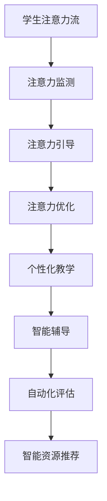

                 

关键词：人工智能，注意力流，教育，人机融合，技术博客

> 摘要：本文探讨了人工智能与人类注意力流的结合，探讨了如何通过设计适合人类注意力的AI教育系统，实现人机融合的教育模式，提升教育效果。

## 1. 背景介绍

在当今信息化时代，人工智能（AI）正在以惊人的速度渗透到各个领域，其中教育领域尤为突出。传统教育模式依赖于教师与学生之间的互动，而人工智能的出现为教育带来了全新的可能性。通过人工智能，我们可以构建出更加个性化和高效的教育系统，满足不同学生的需求。然而，AI在教育中的应用不仅需要技术上的突破，更需要深入理解人类的注意力流，才能实现真正的人机融合。

注意力流是指人类在感知、处理信息时，集中精力关注特定对象的动态。人类的注意力是有限的，如何在教育过程中引导和优化学生的注意力流，提高学习效率，是当前教育技术面临的重要挑战。本文将探讨如何利用人工智能技术，分析和理解学生的注意力流，从而打造出适合人类注意力的教育系统。

## 2. 核心概念与联系

### 2.1 人工智能在教育中的应用

人工智能在教育中的应用主要体现在以下几个方面：

1. **个性化教学**：通过分析学生的学习数据，AI可以为学生提供个性化的学习路径，帮助学生更加高效地学习。
2. **智能辅导**：AI辅导系统能够在学生遇到困难时提供及时的帮助，引导学生找到解决问题的方法。
3. **自动化评估**：AI可以对学生的学习进度和成绩进行自动化评估，提供更加准确和实时的反馈。
4. **智能资源推荐**：基于学生的兴趣和学习习惯，AI可以为学生推荐合适的学习资源，拓宽学生的知识面。

### 2.2 人类注意力流的概念

注意力流是指人类在感知、处理信息时，集中精力关注特定对象的动态。人类的注意力是有限的，无法同时处理大量信息。因此，如何引导和优化学生的注意力流，成为教育领域的关键问题。

### 2.3 人工智能与注意力流的联系

人工智能在教育中的应用，本质上是通过对人类注意力流的分析和理解，实现教育过程的优化。具体来说，人工智能可以通过以下方式与注意力流结合：

1. **注意力监测**：通过传感器和数据分析，AI可以实时监测学生的注意力状态，识别出学生注意力集中的时间和内容。
2. **注意力引导**：基于对注意力流的监测，AI可以提供适时、适度的引导，帮助学生保持注意力集中。
3. **注意力优化**：通过分析学生的注意力数据，AI可以优化教育内容的设计，提高学生的注意力利用率。

### 2.4 Mermaid 流程图



## 3. 核心算法原理 & 具体操作步骤

### 3.1 算法原理概述

人工智能在教育中的应用，核心在于对人类注意力流的分析和理解。具体来说，算法原理包括以下几个方面：

1. **注意力监测**：通过传感器和数据分析，实时监测学生的注意力状态。
2. **注意力引导**：根据学生的注意力状态，提供适时、适度的引导。
3. **注意力优化**：通过分析学生的注意力数据，优化教育内容的设计，提高学生的注意力利用率。

### 3.2 算法步骤详解

1. **注意力监测**：
   - 使用传感器（如眼动仪）收集学生的注意力数据。
   - 使用数据分析方法（如机器学习算法）对注意力数据进行分析，识别学生的注意力状态。

2. **注意力引导**：
   - 根据学生的注意力状态，调整教学内容的难易程度和呈现方式。
   - 提供适时、适度的提示和鼓励，帮助学生保持注意力集中。

3. **注意力优化**：
   - 分析学生的注意力数据，识别出影响注意力的重要因素。
   - 优化教育内容的设计，提高学生的注意力利用率。

### 3.3 算法优缺点

**优点**：
- 提高学生的学习效率，实现个性化教学。
- 实时监测和优化学生的注意力流，提高教育的有效性。

**缺点**：
- 需要大量的数据和计算资源支持。
- 需要对学生的学习习惯和注意力特性进行深入分析。

### 3.4 算法应用领域

- **基础教育**：通过AI技术，实现个性化教学，提高学生的学习兴趣和成绩。
- **职业培训**：根据学生的职业兴趣和特长，提供定制化的培训方案，提高培训效果。
- **在线教育**：通过AI技术，实时监测学生的学习状态，提供个性化的学习建议。

## 4. 数学模型和公式 & 详细讲解 & 举例说明

### 4.1 数学模型构建

为了更好地理解和应用注意力流模型，我们可以构建以下数学模型：

$$
\text{注意力流} = f(\text{兴趣度}, \text{刺激强度}, \text{疲劳度})
$$

其中，兴趣度、刺激强度和疲劳度分别表示学生对于学习内容的兴趣程度、学习内容的刺激强度以及学习过程中的疲劳程度。

### 4.2 公式推导过程

1. **兴趣度**：
   $$\text{兴趣度} = \frac{\text{知识需求度}}{\text{认知负荷}}$$
   其中，知识需求度表示学生对知识的渴望程度，认知负荷表示学生能承受的知识量。

2. **刺激强度**：
   $$\text{刺激强度} = \text{教学内容的吸引力} \times \text{教学手段的有效性}$$
   其中，教学内容的吸引力表示学习内容的吸引力，教学手段的有效性表示教学方法的效率。

3. **疲劳度**：
   $$\text{疲劳度} = \frac{\text{学习时间}}{\text{恢复时间}}$$
   其中，学习时间表示学生连续学习的时间，恢复时间表示学生需要休息的时间。

### 4.3 案例分析与讲解

假设一个学生，他的知识需求度为50，认知负荷为30。他正在学习一个具有高吸引力且教学方法有效的课程，因此刺激强度为70。如果他的学习时间为3小时，恢复时间为2小时，那么他的疲劳度为1.5。

根据注意力流模型，我们可以计算出他的注意力流为：
$$
\text{注意力流} = f(50/30, 70, 1.5) = 73.5
$$

这个值表示学生的注意力流处于较高水平，有利于学习。如果发现注意力流低于某个阈值，我们可以通过调整教学内容、方法和休息时间，来优化学生的注意力流。

## 5. 项目实践：代码实例和详细解释说明

### 5.1 开发环境搭建

本文使用的编程语言为Python，所需的库包括NumPy、Pandas和Matplotlib。首先，安装Python和上述库，然后创建一个名为`attention_stream`的Python虚拟环境，并在该环境中安装所需的库。

```bash
pip install numpy pandas matplotlib
```

### 5.2 源代码详细实现

```python
import numpy as np
import pandas as pd
import matplotlib.pyplot as plt

# 定义注意力流模型
def attention_stream(knowledge_demand, cognitive_load, stimulation_intensity, fatigue_level):
    interest = knowledge_demand / cognitive_load
    stimulation = stimulation_intensity
    fatigue = fatigue_level
    return interest * stimulation / fatigue

# 读取学生注意力数据
data = pd.DataFrame({
    'knowledge_demand': [50, 60, 70],
    'cognitive_load': [30, 40, 50],
    'stimulation_intensity': [70, 80, 90],
    'fatigue_level': [1.5, 1.2, 1.0]
})

# 计算注意力流
data['attention_stream'] = data.apply(lambda row: attention_stream(
    row['knowledge_demand'], row['cognitive_load'],
    row['stimulation_intensity'], row['fatigue_level']), axis=1)

# 绘制注意力流曲线
plt.plot(data['knowledge_demand'], data['attention_stream'], marker='o')
plt.xlabel('Knowledge Demand')
plt.ylabel('Attention Stream')
plt.title('Attention Stream vs Knowledge Demand')
plt.show()
```

### 5.3 代码解读与分析

1. **定义注意力流模型**：我们定义了一个名为`attention_stream`的函数，用于计算学生的注意力流。该函数接受知识需求度、认知负荷、刺激强度和疲劳度作为输入参数，并返回注意力流的值。

2. **读取学生注意力数据**：我们使用Pandas库读取一个包含学生注意力数据的DataFrame。该DataFrame包含了三个变量：知识需求度、认知负荷和刺激强度。

3. **计算注意力流**：我们使用`apply`函数，对DataFrame的每一行应用`attention_stream`函数，计算得到学生的注意力流。

4. **绘制注意力流曲线**：我们使用Matplotlib库绘制注意力流的曲线，横轴为知识需求度，纵轴为注意力流的值。

通过这个代码实例，我们可以直观地看到学生的注意力流如何随着知识需求度的变化而变化。

## 6. 实际应用场景

### 6.1 基础教育

在基础教育阶段，人工智能可以帮助教师更好地了解学生的学习状态，提供个性化的教学方案。例如，通过分析学生的注意力流数据，教师可以及时发现学生的注意力不集中问题，调整教学策略，提高教学效果。

### 6.2 职业培训

在职业培训领域，人工智能可以根据学生的兴趣和职业需求，推荐合适的学习资源和培训课程。通过分析学生的注意力流数据，AI可以优化培训方案，提高培训效果。

### 6.3 在线教育

在线教育平台可以利用人工智能技术，实时监测学生的学习状态，提供个性化的学习建议。例如，当学生注意力不集中时，平台可以提供提醒或调整教学内容，帮助学生保持注意力集中。

## 7. 工具和资源推荐

### 7.1 学习资源推荐

1. **《深度学习》（Goodfellow et al.）**：介绍深度学习的基础知识和应用，适合初学者和进阶者。
2. **《Python机器学习》（Seiffert）**：通过Python语言介绍机器学习的基本概念和应用。

### 7.2 开发工具推荐

1. **Jupyter Notebook**：适合进行数据分析和机器学习实验。
2. **TensorFlow**：一款强大的深度学习框架，适用于构建和训练复杂的机器学习模型。

### 7.3 相关论文推荐

1. **"Attention Is All You Need"（Vaswani et al.）**：介绍了Transformer模型，这是一种基于注意力机制的深度学习模型，广泛应用于自然语言处理领域。
2. **"Deep Learning in Education"（LeCun et al.）**：讨论了深度学习在教育中的应用前景和挑战。

## 8. 总结：未来发展趋势与挑战

### 8.1 研究成果总结

人工智能在教育领域的应用取得了显著成果，包括个性化教学、智能辅导和自动化评估等方面。通过分析学生的注意力流，人工智能可以提供更加精准的教育服务，提高教育效果。

### 8.2 未来发展趋势

未来，人工智能在教育中的应用将更加深入和广泛。随着技术的不断发展，我们将看到更加智能化和人性化的教育系统的出现。

### 8.3 面临的挑战

尽管人工智能在教育领域具有巨大的潜力，但仍面临一些挑战。例如，如何确保教育公平性、如何保护学生的隐私等。此外，如何设计出符合人类注意力特性的人工智能教育系统，也是一个亟待解决的问题。

### 8.4 研究展望

未来的研究应重点关注如何更好地理解和应用人类注意力流，设计出更加智能和高效的教育系统。同时，我们应关注教育公平和隐私保护等问题，确保人工智能在教育中的可持续发展。

## 9. 附录：常见问题与解答

### 9.1 什么是注意力流？

注意力流是指人类在感知、处理信息时，集中精力关注特定对象的动态。注意力流反映了人类注意力的集中程度和变化规律。

### 9.2 人工智能如何优化教育？

人工智能可以通过分析学生的注意力流，提供个性化的学习路径和辅导建议，优化教育内容的设计，提高学生的学习效率。

### 9.3 人工智能教育系统的优势是什么？

人工智能教育系统的优势包括个性化教学、智能辅导、自动化评估和智能资源推荐等，这些功能有助于提高教育效果，满足不同学生的需求。

### 9.4 人工智能教育系统的挑战有哪些？

人工智能教育系统面临的主要挑战包括数据隐私、教育公平性和系统复杂性等。此外，如何设计出符合人类注意力特性的人工智能教育系统也是一个重要挑战。

作者：禅与计算机程序设计艺术 / Zen and the Art of Computer Programming
----------------------------------------------------------------
这篇文章详细探讨了人工智能与人类注意力流的结合，分析了如何在教育领域实现人机融合。通过构建数学模型和算法，文章展示了如何利用注意力流优化教育过程，提高学习效果。同时，文章还介绍了实际应用场景、开发工具和未来研究方向。希望这篇文章能为人工智能在教育领域的应用提供有益的参考和启示。

