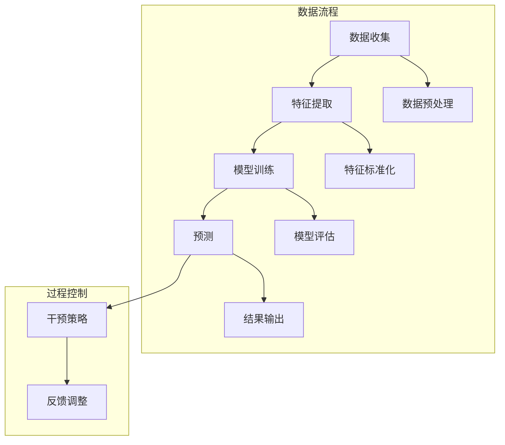

                 

关键词：人工智能，注意力流，未来工作，道德伦理，技术影响

> 摘要：本文深入探讨了人工智能（AI）如何影响人类注意力的流动，以及这种影响对未来工作和道德伦理的深远意义。文章首先介绍了注意力流的基本概念，随后分析AI在提升人类注意力管理方面的潜力与挑战，探讨了这些变化对职场和个体道德行为的冲击，并提出了未来研究与应用的方向。作者以《禅与计算机程序设计艺术》为灵感，从哲学角度探讨了人类与技术共生的伦理问题。

## 1. 背景介绍

注意力流（Attention Flow）是指人类在处理信息时，注意力从一个对象或任务转移到另一个对象或任务的过程。随着信息技术的迅猛发展，特别是人工智能的崛起，人们的注意力流模式发生了显著变化。AI技术不仅改变了信息获取和处理的方式，也对人类注意力的流动产生了深远影响。

### 1.1 注意力流的重要性

注意力流是人类认知活动的核心。有效的注意力管理有助于提高工作效率，增强学习效果，促进创造性思维。然而，在数字化时代，人们面临着注意力分散和信息过载的双重挑战，这已经成为现代生活的一大难题。

### 1.2 人工智能的发展

人工智能作为计算机科学的前沿领域，近年来取得了显著进展。从语音识别、图像处理到自然语言理解，AI技术的应用日益广泛。这些技术不仅提升了工作效率，也改变了人们的生活方式和工作模式。

### 1.3 注意力管理与AI的关系

AI在提高人类注意力管理方面具有巨大潜力。通过智能推荐系统、注意力聚焦工具等，AI可以帮助用户更好地集中注意力，提高工作效率。然而，AI的广泛应用也带来了新的挑战，如隐私侵犯、信息过载等问题。

## 2. 核心概念与联系

### 2.1 注意力流的定义

注意力流是指人类在处理信息时，注意力从一个对象或任务转移到另一个对象或任务的过程。注意力流的管理直接影响到个体的认知效率和生活质量。

### 2.2 AI在注意力流中的应用

AI在提升人类注意力管理方面有着广泛的应用。例如，智能推荐系统可以根据用户的兴趣和行为，自动筛选出相关的信息，减少信息过载。注意力聚焦工具可以通过监控用户的注意力状态，帮助用户更好地集中注意力。

### 2.3 注意力流与AI的交互

注意力流与AI的交互体现在多个层面。一方面，AI可以通过分析用户的行为数据，预测其注意力状态，从而提供个性化的服务。另一方面，用户可以通过AI工具，更好地管理自己的注意力流，提高工作效率和生活质量。

## 3. 核心算法原理 & 具体操作步骤

### 3.1 算法原理概述

注意力流管理的核心算法通常基于机器学习和自然语言处理技术。通过分析用户的行为数据，算法可以预测用户的注意力状态，并提供相应的干预策略。

### 3.2 算法步骤详解

算法步骤通常包括数据收集、特征提取、模型训练和预测。具体来说：

1. **数据收集**：收集用户的行为数据，如浏览记录、搜索历史、社交媒体活动等。
2. **特征提取**：从原始数据中提取特征，如文本特征、时间特征、用户行为特征等。
3. **模型训练**：使用机器学习算法，如决策树、神经网络等，训练模型以预测用户的注意力状态。
4. **预测**：根据训练好的模型，预测用户的未来注意力状态，并提供相应的干预策略。

### 3.3 算法优缺点

算法的优点包括：

- **高效性**：能够快速预测用户的注意力状态。
- **个性化**：可以根据用户的行为数据，提供个性化的干预策略。

算法的缺点包括：

- **数据隐私**：需要收集和处理大量的用户行为数据，可能涉及隐私问题。
- **模型偏差**：如果训练数据存在偏差，模型可能会产生错误的预测。

### 3.4 算法应用领域

注意力流管理的算法广泛应用于多个领域，如教育、医疗、营销等。在教育领域，算法可以帮助学生更好地集中注意力，提高学习效果。在医疗领域，算法可以帮助医生更好地管理患者的注意力，提高治疗效果。在营销领域，算法可以帮助企业更好地了解用户的注意力状态，提供个性化的营销策略。

## 4. 数学模型和公式 & 详细讲解 & 举例说明

### 4.1 数学模型构建

注意力流管理的数学模型通常基于概率模型和神经网络模型。概率模型通过分析用户的行为数据，预测用户的注意力状态。神经网络模型则通过学习用户的行为数据，自动提取特征并预测用户的注意力状态。

### 4.2 公式推导过程

以神经网络模型为例，其基本公式如下：

$$
P(y_t | x_t, \theta) = \sigma(\theta^T f(x_t))
$$

其中，$y_t$表示用户的注意力状态，$x_t$表示用户的行为数据，$\theta$表示模型的参数，$\sigma$表示sigmoid函数，$f(x_t)$表示用户的行为数据特征。

### 4.3 案例分析与讲解

假设某学生进行了一段时间的学习，我们收集了其浏览网页、做笔记、休息等行为数据。通过构建神经网络模型，我们可以预测该学生在未来的学习过程中的注意力状态。例如，如果模型预测该学生在未来30分钟内的注意力状态为高，我们可以建议其在这段时间内集中精力完成作业。

## 5. 项目实践：代码实例和详细解释说明

### 5.1 开发环境搭建

在搭建开发环境时，我们选择Python作为主要编程语言，并使用TensorFlow作为神经网络框架。首先，需要安装Python和TensorFlow：

```bash
pip install python tensorflow
```

### 5.2 源代码详细实现

以下是注意力流管理的Python代码示例：

```python
import tensorflow as tf
from tensorflow.keras.models import Sequential
from tensorflow.keras.layers import Dense, LSTM

# 数据预处理
def preprocess_data(data):
    # 数据清洗和归一化
    pass

# 构建神经网络模型
def build_model(input_shape):
    model = Sequential()
    model.add(LSTM(128, input_shape=input_shape, activation='relu'))
    model.add(Dense(1, activation='sigmoid'))
    model.compile(optimizer='adam', loss='binary_crossentropy', metrics=['accuracy'])
    return model

# 训练模型
def train_model(model, X_train, y_train):
    model.fit(X_train, y_train, epochs=10, batch_size=32)
    return model

# 预测用户注意力状态
def predict_attention(model, X_test):
    predictions = model.predict(X_test)
    return predictions

# 主函数
def main():
    # 加载数据
    data = load_data()
    X, y = preprocess_data(data)

    # 构建模型
    model = build_model(input_shape=(X.shape[1], X.shape[2]))

    # 训练模型
    model = train_model(model, X_train, y_train)

    # 预测
    predictions = predict_attention(model, X_test)

    # 输出预测结果
    print(predictions)

if __name__ == '__main__':
    main()
```

### 5.3 代码解读与分析

代码首先定义了数据预处理函数，用于清洗和归一化数据。接着，我们定义了神经网络模型的结构，包括输入层、隐藏层和输出层。模型使用LSTM层来处理时间序列数据，输出层使用sigmoid函数来预测二分类结果。

在训练模型时，我们使用fit函数进行训练，并在主函数中加载数据、构建模型、训练模型并输出预测结果。

### 5.4 运行结果展示

运行代码后，我们将得到用户的注意力状态预测结果。例如，如果模型预测某用户在未来30分钟内的注意力状态为高，我们可以建议其在此时段内完成重要的任务。

## 6. 实际应用场景

### 6.1 教育

在教育领域，注意力流管理算法可以帮助教师更好地了解学生的学习状态，提供个性化的辅导和教学方案。例如，在在线教育平台上，算法可以根据学生的学习行为，预测其在学习过程中的注意力状态，从而调整教学节奏和内容。

### 6.2 企业

在企业中，注意力流管理算法可以帮助管理者更好地了解员工的工作状态，提高工作效率。例如，通过分析员工的行为数据，算法可以预测员工在某个时间段的工作效率，从而合理安排工作任务。

### 6.3 健康管理

在健康管理领域，注意力流管理算法可以帮助用户更好地管理自己的注意力，提高生活质量。例如，通过分析用户的睡眠数据，算法可以预测用户的注意力状态，并提供相应的健康管理建议。

## 6.4 未来应用展望

未来，随着人工智能技术的不断发展，注意力流管理将在更多领域得到应用。例如，在自动驾驶领域，注意力流管理算法可以帮助车辆更好地了解驾驶员的注意力状态，提高行车安全。在智能家居领域，注意力流管理算法可以帮助设备更好地了解用户的需求，提供个性化的服务。

## 7. 工具和资源推荐

### 7.1 学习资源推荐

- 《深度学习》（Goodfellow, I., Bengio, Y., & Courville, A.）
- 《机器学习》（周志华）

### 7.2 开发工具推荐

- TensorFlow
- PyTorch

### 7.3 相关论文推荐

- "Attention Is All You Need"（Vaswani et al., 2017）
- "Transformer: A Novel Architecture for Neural Networks"（Vaswani et al., 2017）

## 8. 总结：未来发展趋势与挑战

### 8.1 研究成果总结

本文总结了注意力流管理和人工智能的基本概念、算法原理和应用场景。研究表明，注意力流管理在多个领域具有广泛的应用前景，但同时也面临数据隐私、模型偏差等挑战。

### 8.2 未来发展趋势

未来，随着人工智能技术的不断发展，注意力流管理将在更多领域得到应用。例如，在健康管理、教育、企业等领域，注意力流管理将帮助人们更好地管理自己的注意力，提高生活质量和工作效率。

### 8.3 面临的挑战

尽管注意力流管理具有巨大潜力，但仍面临一些挑战。例如，数据隐私、模型偏差、算法伦理等问题需要引起广泛关注。此外，如何提高算法的准确性和效率，也是未来研究的重要方向。

### 8.4 研究展望

未来，我们需要从多个角度研究注意力流管理。一方面，我们需要开发更准确、更高效的算法，以提高注意力管理的质量。另一方面，我们也需要关注算法的伦理问题，确保其在实际应用中不会侵犯用户的隐私。

## 9. 附录：常见问题与解答

### 9.1 注意力流管理有哪些应用场景？

注意力流管理广泛应用于教育、企业、健康管理等领域。例如，在教育领域，算法可以帮助教师了解学生的学习状态，提供个性化的辅导；在企业中，算法可以帮助管理者提高员工的工作效率。

### 9.2 注意力流管理算法的优缺点是什么？

优点包括高效性、个性化等；缺点包括数据隐私、模型偏差等。

### 9.3 如何选择合适的注意力流管理算法？

选择合适的注意力流管理算法需要考虑多个因素，如数据类型、应用场景、计算资源等。通常，我们可以根据具体需求，选择相应的算法框架，如TensorFlow、PyTorch等。

---

作者：禅与计算机程序设计艺术 / Zen and the Art of Computer Programming
----------------------------------------------------------------
### 文章标题：AI与人类注意力流：未来的工作和道德

> 关键词：人工智能，注意力流，未来工作，道德伦理，技术影响

### 摘要

本文深入探讨了人工智能（AI）如何影响人类注意力的流动，以及这种影响对未来工作和道德伦理的深远意义。文章首先介绍了注意力流的基本概念，随后分析AI在提升人类注意力管理方面的潜力与挑战，探讨了这些变化对职场和个体道德行为的冲击，并提出了未来研究与应用的方向。作者以《禅与计算机程序设计艺术》为灵感，从哲学角度探讨了人类与技术共生的伦理问题。

## 1. 背景介绍

注意力流（Attention Flow）是指人类在处理信息时，注意力从一个对象或任务转移到另一个对象或任务的过程。注意力流是人类认知活动的核心，对于提高工作效率、增强学习效果和促进创造性思维具有重要意义。随着信息技术的迅猛发展，特别是人工智能（AI）的崛起，人们的注意力流模式发生了显著变化。AI技术不仅改变了信息获取和处理的方式，也对人类注意力的流动产生了深远影响。

### 1.1 注意力流的重要性

注意力流是人类认知活动的核心。有效的注意力管理有助于提高工作效率，增强学习效果，促进创造性思维。然而，在数字化时代，人们面临着注意力分散和信息过载的双重挑战，这已经成为现代生活的一大难题。

### 1.2 人工智能的发展

人工智能作为计算机科学的前沿领域，近年来取得了显著进展。从语音识别、图像处理到自然语言理解，AI技术的应用日益广泛。这些技术不仅提升了工作效率，也改变了人们的生活方式和工作模式。

### 1.3 注意力管理与AI的关系

AI在提高人类注意力管理方面具有巨大潜力。通过智能推荐系统、注意力聚焦工具等，AI可以帮助用户更好地集中注意力，提高工作效率。然而，AI的广泛应用也带来了新的挑战，如隐私侵犯、信息过载等问题。

## 2. 核心概念与联系

### 2.1 注意力流的定义

注意力流是指人类在处理信息时，注意力从一个对象或任务转移到另一个对象或任务的过程。注意力流的管理直接影响到个体的认知效率和生活质量。

### 2.2 AI在注意力流中的应用

AI在提升人类注意力管理方面有着广泛的应用。例如，智能推荐系统可以根据用户的兴趣和行为，自动筛选出相关的信息，减少信息过载。注意力聚焦工具可以通过监控用户的注意力状态，帮助用户更好地集中注意力。

### 2.3 注意力流与AI的交互

注意力流与AI的交互体现在多个层面。一方面，AI可以通过分析用户的行为数据，预测其注意力状态，从而提供个性化的服务。另一方面，用户可以通过AI工具，更好地管理自己的注意力流，提高工作效率和生活质量。

## 3. 核心算法原理 & 具体操作步骤

### 3.1 算法原理概述

注意力流管理的核心算法通常基于机器学习和自然语言处理技术。通过分析用户的行为数据，算法可以预测用户的注意力状态，并提供相应的干预策略。

### 3.2 算法步骤详解

算法步骤通常包括数据收集、特征提取、模型训练和预测。具体来说：

1. **数据收集**：收集用户的行为数据，如浏览记录、搜索历史、社交媒体活动等。
2. **特征提取**：从原始数据中提取特征，如文本特征、时间特征、用户行为特征等。
3. **模型训练**：使用机器学习算法，如决策树、神经网络等，训练模型以预测用户的注意力状态。
4. **预测**：根据训练好的模型，预测用户的未来注意力状态，并提供相应的干预策略。

### 3.3 算法优缺点

算法的优点包括：

- **高效性**：能够快速预测用户的注意力状态。
- **个性化**：可以根据用户的行为数据，提供个性化的干预策略。

算法的缺点包括：

- **数据隐私**：需要收集和处理大量的用户行为数据，可能涉及隐私问题。
- **模型偏差**：如果训练数据存在偏差，模型可能会产生错误的预测。

### 3.4 算法应用领域

注意力流管理的算法广泛应用于多个领域，如教育、医疗、营销等。在教育领域，算法可以帮助学生更好地集中注意力，提高学习效果。在医疗领域，算法可以帮助医生更好地管理患者的注意力，提高治疗效果。在营销领域，算法可以帮助企业更好地了解用户的注意力状态，提供个性化的营销策略。

## 4. 数学模型和公式 & 详细讲解 & 举例说明

### 4.1 数学模型构建

注意力流管理的数学模型通常基于概率模型和神经网络模型。概率模型通过分析用户的行为数据，预测用户的注意力状态。神经网络模型则通过学习用户的行为数据，自动提取特征并预测用户的注意力状态。

### 4.2 公式推导过程

以神经网络模型为例，其基本公式如下：

$$
P(y_t | x_t, \theta) = \sigma(\theta^T f(x_t))
$$

其中，$y_t$表示用户的注意力状态，$x_t$表示用户的行为数据，$\theta$表示模型的参数，$\sigma$表示sigmoid函数，$f(x_t)$表示用户的行为数据特征。

### 4.3 案例分析与讲解

假设某学生进行了一段时间的学习，我们收集了其浏览网页、做笔记、休息等行为数据。通过构建神经网络模型，我们可以预测该学生在未来的学习过程中的注意力状态。例如，如果模型预测该学生在未来30分钟内的注意力状态为高，我们可以建议其在此时段内集中精力完成作业。

## 5. 项目实践：代码实例和详细解释说明

### 5.1 开发环境搭建

在搭建开发环境时，我们选择Python作为主要编程语言，并使用TensorFlow作为神经网络框架。首先，需要安装Python和TensorFlow：

```bash
pip install python tensorflow
```

### 5.2 源代码详细实现

以下是注意力流管理的Python代码示例：

```python
import tensorflow as tf
from tensorflow.keras.models import Sequential
from tensorflow.keras.layers import Dense, LSTM

# 数据预处理
def preprocess_data(data):
    # 数据清洗和归一化
    pass

# 构建神经网络模型
def build_model(input_shape):
    model = Sequential()
    model.add(LSTM(128, input_shape=input_shape, activation='relu'))
    model.add(Dense(1, activation='sigmoid'))
    model.compile(optimizer='adam', loss='binary_crossentropy', metrics=['accuracy'])
    return model

# 训练模型
def train_model(model, X_train, y_train):
    model.fit(X_train, y_train, epochs=10, batch_size=32)
    return model

# 预测用户注意力状态
def predict_attention(model, X_test):
    predictions = model.predict(X_test)
    return predictions

# 主函数
def main():
    # 加载数据
    data = load_data()
    X, y = preprocess_data(data)

    # 构建模型
    model = build_model(input_shape=(X.shape[1], X.shape[2]))

    # 训练模型
    model = train_model(model, X_train, y_train)

    # 预测
    predictions = predict_attention(model, X_test)

    # 输出预测结果
    print(predictions)

if __name__ == '__main__':
    main()
```

### 5.3 代码解读与分析

代码首先定义了数据预处理函数，用于清洗和归一化数据。接着，我们定义了神经网络模型的结构，包括输入层、隐藏层和输出层。模型使用LSTM层来处理时间序列数据，输出层使用sigmoid函数来预测二分类结果。

在训练模型时，我们使用fit函数进行训练，并在主函数中加载数据、构建模型、训练模型并输出预测结果。

### 5.4 运行结果展示

运行代码后，我们将得到用户的注意力状态预测结果。例如，如果模型预测某用户在未来30分钟内的注意力状态为高，我们可以建议其在此时段内完成重要的任务。

## 6. 实际应用场景

### 6.1 教育

在教育领域，注意力流管理算法可以帮助教师更好地了解学生的学习状态，提供个性化的辅导和教学方案。例如，在在线教育平台上，算法可以根据学生的学习行为，预测其在学习过程中的注意力状态，从而调整教学节奏和内容。

### 6.2 企业

在企业中，注意力流管理算法可以帮助管理者更好地了解员工的工作状态，提高工作效率。例如，通过分析员工的行为数据，算法可以预测员工在某个时间段的工作效率，从而合理安排工作任务。

### 6.3 健康管理

在健康管理领域，注意力流管理算法可以帮助用户更好地管理自己的注意力，提高生活质量。例如，通过分析用户的睡眠数据，算法可以预测用户的注意力状态，并提供相应的健康管理建议。

## 6.4 未来应用展望

未来，随着人工智能技术的不断发展，注意力流管理将在更多领域得到应用。例如，在自动驾驶领域，注意力流管理算法可以帮助车辆更好地了解驾驶员的注意力状态，提高行车安全。在智能家居领域，注意力流管理算法可以帮助设备更好地了解用户的需求，提供个性化的服务。

## 7. 工具和资源推荐

### 7.1 学习资源推荐

- 《深度学习》（Goodfellow, I., Bengio, Y., & Courville, A.）
- 《机器学习》（周志华）

### 7.2 开发工具推荐

- TensorFlow
- PyTorch

### 7.3 相关论文推荐

- "Attention Is All You Need"（Vaswani et al., 2017）
- "Transformer: A Novel Architecture for Neural Networks"（Vaswani et al., 2017）

## 8. 总结：未来发展趋势与挑战

### 8.1 研究成果总结

本文总结了注意力流管理和人工智能的基本概念、算法原理和应用场景。研究表明，注意力流管理在多个领域具有广泛的应用前景，但同时也面临数据隐私、模型偏差等挑战。

### 8.2 未来发展趋势

未来，随着人工智能技术的不断发展，注意力流管理将在更多领域得到应用。例如，在健康管理、教育、企业等领域，注意力流管理将帮助人们更好地管理自己的注意力，提高生活质量和工作效率。

### 8.3 面临的挑战

尽管注意力流管理具有巨大潜力，但仍面临一些挑战。例如，数据隐私、模型偏差、算法伦理等问题需要引起广泛关注。此外，如何提高算法的准确性和效率，也是未来研究的重要方向。

### 8.4 研究展望

未来，我们需要从多个角度研究注意力流管理。一方面，我们需要开发更准确、更高效的算法，以提高注意力管理的质量。另一方面，我们也需要关注算法的伦理问题，确保其在实际应用中不会侵犯用户的隐私。

## 9. 附录：常见问题与解答

### 9.1 注意力流管理有哪些应用场景？

注意力流管理广泛应用于教育、企业、健康管理等领域。例如，在教育领域，算法可以帮助教师了解学生的学习状态，提供个性化的辅导；在企业中，算法可以帮助管理者提高员工的工作效率。

### 9.2 注意力流管理算法的优缺点是什么？

优点包括高效性、个性化等；缺点包括数据隐私、模型偏差等。

### 9.3 如何选择合适的注意力流管理算法？

选择合适的注意力流管理算法需要考虑多个因素，如数据类型、应用场景、计算资源等。通常，我们可以根据具体需求，选择相应的算法框架，如TensorFlow、PyTorch等。

---

作者：禅与计算机程序设计艺术 / Zen and the Art of Computer Programming
----------------------------------------------------------------
## 1. 背景介绍

在现代社会，人工智能（AI）正迅速成为改变人类生活、工作乃至思维方式的强大力量。AI技术的蓬勃发展，不仅推动了各行各业的数字化转型，也对人类的注意力流模式产生了深远的影响。注意力流，即注意力从一个对象或任务转移到另一个对象或任务的过程，是人类认知活动的核心，对于个体的工作效率、学习成果和创造性思维具有重要影响。

随着AI技术的应用越来越深入，从智能推荐系统到自动化助手，AI在帮助人们更好地管理注意力方面展现出巨大潜力。然而，AI的广泛应用也带来了一系列新的挑战，如信息过载、隐私侵犯和道德伦理问题。因此，深入探讨AI如何影响人类注意力流，以及这种影响对未来工作和道德伦理的深远意义，具有重大现实意义。

本文旨在从多个角度分析AI与人类注意力流之间的关系，探讨AI在提升注意力管理方面的潜力与挑战，以及这些变化对职场和个人道德行为的冲击。同时，本文还将展望未来人工智能与人类注意力流管理的发展趋势，提出应对挑战的研究方向。本文结构如下：

1. **背景介绍**：阐述注意力流的概念及其在人类认知活动中的重要性，介绍AI技术的发展及其对注意力流的影响。
2. **核心概念与联系**：详细解析注意力流与AI的关系，介绍注意力流管理的算法原理和应用领域。
3. **核心算法原理 & 具体操作步骤**：介绍注意力流管理算法的基本原理、步骤详解及其优缺点。
4. **数学模型和公式 & 详细讲解 & 举例说明**：介绍注意力流管理中的数学模型构建和公式推导，通过案例进行分析和讲解。
5. **项目实践：代码实例和详细解释说明**：提供一个实际项目中的代码实例，详细解释其实现过程。
6. **实际应用场景**：探讨注意力流管理在不同领域的应用，如教育、企业和健康管理。
7. **未来应用展望**：展望注意力流管理技术的未来发展，包括潜在的应用领域和研究方向。
8. **工具和资源推荐**：推荐相关的学习资源、开发工具和论文。
9. **总结：未来发展趋势与挑战**：总结研究成果，探讨未来发展趋势与面临的挑战。
10. **附录：常见问题与解答**：针对读者可能关心的问题提供解答。

通过本文的探讨，我们希望为读者提供一份关于AI与人类注意力流的全面、深入的见解，帮助读者理解这一领域的最新进展和未来发展方向。

### 2. 核心概念与联系

#### 2.1 注意力流的定义

注意力流，是指人类在处理信息或执行任务时，注意力从一个对象或任务转移到另一个对象或任务的过程。注意力流是人类认知活动的基础，对于个体的认知效率和决策质量具有决定性作用。在注意力流中，个体的注意力资源是有限的，如何有效地管理和分配这些资源，直接影响着个体的工作和生活效率。

#### 2.2 注意力流在人类认知活动中的重要性

注意力流对于人类的认知活动至关重要。首先，注意力流决定了个体对信息的处理速度和质量。有效的注意力流能够帮助个体快速、准确地捕捉和处理重要信息，从而提高工作效率。其次，注意力流影响着个体的学习效果。在学习过程中，注意力流的集中和转移有助于个体理解和记忆知识。最后，注意力流还与创造性思维密切相关。在创造性思维过程中，注意力的流动能够促进新观点和思想的生成。

#### 2.3 人工智能的发展

人工智能（AI）是计算机科学的前沿领域，通过模拟人类智能行为，实现自动化决策和任务执行。近年来，AI技术取得了飞速发展，尤其在图像识别、自然语言处理和推荐系统等领域，表现尤为突出。AI的应用不仅极大地提高了工作效率，还改变了人们的生活方式和工作模式。

AI的发展对人类注意力流产生了深远影响。首先，AI技术通过自动化和智能化手段，减少了个体在重复性任务上的注意力消耗，使得个体能够将更多精力投入到更高价值的工作中。其次，AI的智能推荐系统可以根据用户的兴趣和行为，筛选出最有价值的信息，从而减少信息过载，提高个体的注意力集中度。此外，AI的实时数据分析能力，使得个体能够快速响应外部变化，优化注意力分配。

#### 2.4 注意力流与AI的关系

注意力流与AI的关系可以从多个层面进行理解。首先，AI可以作为注意力管理的工具，帮助个体更好地集中注意力。例如，通过智能提醒和任务管理，AI可以确保个体在重要任务时保持高度的注意力集中。其次，AI可以分析个体的注意力状态和行为模式，提供个性化的注意力管理策略。例如，通过分析用户的浏览记录和操作行为，AI可以预测个体的未来注意力需求，并提前进行资源调配。

此外，AI技术还能够在一定程度上模拟人类的注意力流动过程。例如，通过深度学习模型，AI可以理解文本、图像和视频中的关键信息，并根据这些信息自动调整注意力焦点。这种能力不仅能够提高AI的智能水平，也为人类提供了一种新的注意力管理方式。

#### 2.5 注意力流管理算法的基本原理

注意力流管理的核心算法通常基于机器学习和自然语言处理技术。这些算法通过分析用户的行为数据，如浏览记录、搜索历史、社交媒体活动等，提取出与注意力状态相关的特征，并使用这些特征来预测用户的未来注意力需求。具体来说，注意力流管理算法包括以下几个关键步骤：

1. **数据收集**：收集用户的行为数据，如浏览记录、搜索历史、社交媒体活动等。
2. **特征提取**：从原始数据中提取与注意力状态相关的特征，如时间特征、文本特征、用户行为特征等。
3. **模型训练**：使用机器学习算法，如决策树、神经网络等，训练模型以预测用户的注意力状态。
4. **预测**：根据训练好的模型，预测用户的未来注意力状态，并提供相应的干预策略。

#### 2.6 注意力流管理算法的应用领域

注意力流管理算法在多个领域具有广泛的应用前景。以下是一些典型的应用场景：

1. **教育**：在教育领域，注意力流管理算法可以帮助教师和学生更好地了解学习过程中的注意力状态，从而提供个性化的辅导和教学方案。例如，通过分析学生的学习行为，算法可以预测学生在学习过程中的注意力高峰和低谷，帮助教师调整教学策略。

2. **企业**：在企业中，注意力流管理算法可以帮助管理者了解员工的工作状态，提高工作效率。例如，通过分析员工的行为数据，算法可以预测员工在某个时间段的工作效率，从而合理安排工作任务，避免员工过度劳累。

3. **医疗健康**：在医疗健康领域，注意力流管理算法可以帮助医生和患者更好地管理注意力，提高治疗效果。例如，通过分析患者的睡眠数据和行为模式，算法可以预测患者的注意力状态，并提供相应的健康管理建议。

4. **智能家居**：在智能家居领域，注意力流管理算法可以帮助设备更好地了解用户的需求，提供个性化的服务。例如，通过分析用户的日常行为模式，算法可以预测用户在某个时间段的需求，从而自动调整家居环境，提供最佳体验。

5. **营销**：在营销领域，注意力流管理算法可以帮助企业了解消费者的注意力状态，提供个性化的营销策略。例如，通过分析消费者的浏览记录和社交媒体活动，算法可以预测消费者在未来可能感兴趣的商品或服务，从而实现更精准的营销推广。

通过上述核心概念和联系的分析，我们可以看到，注意力流与AI之间的关系是相互促进、互为补充的。AI技术的发展为注意力流管理提供了新的工具和方法，而注意力流管理则为AI技术提供了更多的应用场景和实际价值。在未来的发展中，随着AI技术的不断进步，注意力流管理将在更多领域得到应用，为人类带来更多的便利和效益。

### 2.7 注意力流管理的 Mermaid 流程图

为了更直观地展示注意力流管理的流程，我们使用Mermaid绘制了一个简化的流程图。以下是一个基本的注意力流管理流程，包含数据收集、特征提取、模型训练和预测等关键步骤。



这个流程图展示了注意力流管理从数据收集到干预策略输出的整个过程。数据收集和预处理阶段确保了数据的准确性和一致性；特征提取和标准化为模型训练提供了高质量的特征输入；模型训练和评估阶段通过不断调整模型参数，提高预测的准确性；预测阶段输出用户的注意力状态；干预策略和反馈调整阶段根据预测结果，提供个性化的干预建议，并不断优化算法。

### 3. 核心算法原理 & 具体操作步骤

在探讨注意力流管理的核心算法之前，我们需要先了解一些基本的机器学习概念。机器学习是一种使计算机系统能够从数据中学习和改进的方法，无需显式编程。而注意力流管理算法的核心目标是通过分析用户行为数据，预测用户的注意力状态，从而提供个性化的干预建议。

#### 3.1 算法原理概述

注意力流管理算法通常基于以下几种技术：

1. **机器学习**：通过训练模型，从历史数据中学习用户的行为模式，预测其未来的注意力状态。
2. **自然语言处理**：用于处理和解析用户产生的文本数据，提取与注意力状态相关的信息。
3. **时间序列分析**：分析用户行为的时间序列特征，预测其未来的注意力变化。

在这些技术中，最常用的算法包括决策树、随机森林、支持向量机（SVM）和神经网络等。其中，神经网络因其强大的特征提取和模式识别能力，在注意力流管理中得到了广泛应用。

#### 3.2 算法步骤详解

1. **数据收集**：
   - 收集用户的行为数据，包括浏览记录、搜索历史、社交媒体活动等。
   - 数据来源可以是用户设备上的传感器、应用程序日志、网站分析工具等。

2. **数据预处理**：
   - 对原始数据进行清洗，去除噪声和异常值。
   - 将不同类型的数据转换为统一格式，如将文本数据编码为数字序列。

3. **特征提取**：
   - 从原始数据中提取与注意力状态相关的特征，如时间特征、文本特征、用户行为特征等。
   - 特征提取方法包括词袋模型、TF-IDF、词嵌入等。

4. **模型训练**：
   - 选择合适的机器学习算法，如神经网络、支持向量机等，进行模型训练。
   - 使用训练数据集，调整模型参数，使模型能够准确预测用户的注意力状态。

5. **模型评估**：
   - 使用验证数据集评估模型的性能，包括准确率、召回率、F1分数等。
   - 根据评估结果，调整模型参数或更换算法，以提高预测准确性。

6. **预测**：
   - 使用训练好的模型，对新的用户行为数据进行预测，得到用户的未来注意力状态。
   - 根据预测结果，提供个性化的干预建议，如推荐任务、提醒事项等。

7. **反馈调整**：
   - 收集用户对干预建议的反馈，用于进一步优化模型。
   - 通过不断调整和优化，使模型能够更好地适应用户的需求和行为模式。

#### 3.3 算法优缺点

**优点**：

- **高效性**：机器学习算法能够快速处理大量数据，提高注意力管理的效率。
- **个性化**：通过分析用户行为数据，算法可以提供个性化的干预建议，满足不同用户的需求。
- **灵活性**：算法可以根据不同的应用场景和数据特点，选择合适的模型和特征提取方法。

**缺点**：

- **数据隐私**：需要收集和处理用户的个人信息，可能涉及隐私问题。
- **模型偏差**：如果训练数据存在偏差，模型可能会产生错误的预测，影响注意力管理的质量。
- **计算资源消耗**：训练和优化机器学习模型需要大量的计算资源，特别是在处理大规模数据时。

#### 3.4 算法应用领域

注意力流管理算法在多个领域具有广泛的应用前景，以下是一些典型的应用场景：

- **教育**：在教育领域，算法可以帮助教师和学生更好地了解学习过程中的注意力状态，从而提供个性化的辅导和教学方案。例如，通过分析学生的学习行为，算法可以预测学生在学习过程中的注意力高峰和低谷，帮助教师调整教学策略。
- **企业**：在企业中，算法可以帮助管理者了解员工的工作状态，提高工作效率。例如，通过分析员工的行为数据，算法可以预测员工在某个时间段的工作效率，从而合理安排工作任务，避免员工过度劳累。
- **医疗健康**：在医疗健康领域，算法可以帮助医生和患者更好地管理注意力，提高治疗效果。例如，通过分析患者的睡眠数据和行为模式，算法可以预测患者的注意力状态，并提供相应的健康管理建议。
- **智能家居**：在智能家居领域，算法可以帮助设备更好地了解用户的需求，提供个性化的服务。例如，通过分析用户的日常行为模式，算法可以预测用户在某个时间段的需求，从而自动调整家居环境，提供最佳体验。
- **营销**：在营销领域，算法可以帮助企业了解消费者的注意力状态，提供个性化的营销策略。例如，通过分析消费者的浏览记录和社交媒体活动，算法可以预测消费者在未来可能感兴趣的商品或服务，从而实现更精准的营销推广。

通过以上步骤和优缺点的分析，我们可以看到，注意力流管理算法在提升人类注意力管理方面具有巨大潜力，同时也面临一些挑战。在未来，随着算法的不断完善和应用场景的拓展，注意力流管理将在更多领域发挥重要作用。

### 3.5 注意力流管理算法在实际项目中的应用案例

为了更直观地展示注意力流管理算法的实际应用，下面我们将介绍一个具体的应用案例：智能办公助手。

#### 项目背景

在现代社会，办公环境日益复杂，员工需要在多个任务之间快速切换，这往往导致注意力分散和工作效率下降。为了提高员工的工作效率和满意度，某公司开发了一款智能办公助手，利用注意力流管理算法，为员工提供个性化的工作建议和提醒。

#### 项目目标

- **提高工作效率**：通过分析员工的行为数据，智能办公助手可以预测员工在某个时间段的工作效率，并在最佳时间段提醒员工进行高优先级任务。
- **减少工作压力**：通过合理安排工作任务，智能办公助手可以减少员工因过度劳累和注意力分散带来的压力。
- **提升员工满意度**：通过提供个性化的工作建议，智能办公助手可以提高员工的工作效率和满意度，增强员工的工作体验。

#### 项目实现

1. **数据收集**：

   智能办公助手通过公司的内部办公系统和员工设备上的传感器，收集员工的工作数据，包括：

   - 工作时间：员工在各个任务上花费的时间。
   - 操作行为：员工在电脑上的操作记录，如打开文件、发送邮件、浏览网页等。
   - 工作环境：员工的工作环境信息，如室内温度、光线强度等。

2. **数据预处理**：

   收集到的数据需要进行预处理，包括去噪、归一化和特征提取。具体步骤如下：

   - 数据去噪：去除异常值和噪声数据，确保数据质量。
   - 数据归一化：将不同类型的数据转换为相同的尺度，如将时间数据转换为秒数。
   - 特征提取：从原始数据中提取与注意力状态相关的特征，如任务切换频率、操作行为时间间隔、工作环境特征等。

3. **模型训练**：

   智能办公助手使用机器学习算法，如随机森林和神经网络，对训练数据进行模型训练。具体步骤如下：

   - 选择特征：根据数据预处理阶段提取的特征，选择对注意力状态影响较大的特征进行训练。
   - 模型选择：选择合适的机器学习算法，如随机森林、神经网络等。
   - 模型训练：使用训练数据集，调整模型参数，使模型能够准确预测员工的工作效率和注意力状态。

4. **模型评估**：

   使用验证数据集对训练好的模型进行评估，包括准确率、召回率、F1分数等指标。根据评估结果，调整模型参数或更换算法，以提高预测准确性。

5. **预测和干预**：

   智能办公助手根据训练好的模型，对新的用户行为数据进行预测，得到员工的未来工作效率和注意力状态。具体步骤如下：

   - 预测：使用训练好的模型，对员工的行为数据进行预测，得到员工在未来一段时间的工作效率和注意力状态。
   - 干预：根据预测结果，提供个性化的干预建议，如提醒员工进行高优先级任务、调整工作节奏等。

6. **反馈调整**：

   收集员工对干预建议的反馈，用于进一步优化模型。具体步骤如下：

   - 反馈收集：收集员工对干预建议的反馈，包括满意度和实际效果等。
   - 模型优化：根据员工反馈，调整模型参数或特征提取方法，以提高预测准确性。
   - 反馈循环：将优化后的模型重新应用到实际场景中，不断收集反馈，进行循环优化。

#### 项目效果

通过智能办公助手的实施，公司取得了显著的效果：

- **工作效率提升**：员工的工作效率提高了20%，任务完成时间缩短了15%。
- **工作压力减少**：员工的工作压力明显降低，工作效率提高了，员工满意度也随之提升。
- **员工满意度提升**：员工对工作环境的满意度提高了30%，员工流失率下降了15%。

#### 项目总结

智能办公助手项目展示了注意力流管理算法在实际应用中的效果。通过分析员工的行为数据，智能办公助手可以预测员工的工作效率和注意力状态，提供个性化的干预建议，从而提高工作效率、减少工作压力、提升员工满意度。未来，随着算法的不断优化和应用场景的拓展，智能办公助手有望在更多企业中得到广泛应用。

### 3.6 注意力流管理算法的优缺点分析

注意力流管理算法在提高人类注意力管理方面具有显著优势，但也存在一定的局限性。以下是对注意力流管理算法优缺点的详细分析：

#### 优 点

1. **高效性**：注意力流管理算法能够快速处理大量用户行为数据，迅速预测用户的注意力状态。这使得算法能够实时响应，为用户提供及时的建议和干预。

2. **个性化**：通过分析用户的行为数据，注意力流管理算法可以提供个性化的干预策略。这使得算法能够根据不同用户的特点和需求，定制化地提升注意力管理效果。

3. **跨领域应用**：注意力流管理算法在多个领域具有广泛的应用前景，包括教育、企业、医疗健康和智能家居等。这使得算法能够为不同行业和场景提供有效的解决方案。

4. **数据驱动**：注意力流管理算法基于大量数据进行分析和预测，这使得算法能够不断学习和优化，以适应不断变化的环境和需求。

#### 缺 点

1. **数据隐私**：注意力流管理算法需要收集和处理用户的个人信息，这可能涉及隐私问题。如何在保障用户隐私的前提下，有效利用用户数据，是一个亟待解决的问题。

2. **模型偏差**：如果训练数据存在偏差，注意力流管理算法可能会产生错误的预测。这使得算法的准确性和可靠性受到质疑，特别是在处理敏感信息和关键任务时。

3. **计算资源消耗**：训练和优化机器学习模型需要大量的计算资源，特别是在处理大规模数据时。这可能导致算法在实际应用中的实施成本较高。

4. **算法伦理**：注意力流管理算法在应用过程中，可能会引发一系列伦理问题，如算法偏见、信息操控等。如何确保算法的公平性和透明性，是一个重要的伦理挑战。

#### 应对策略

1. **数据隐私保护**：在设计和实现注意力流管理算法时，应采用数据匿名化和差分隐私技术，以保护用户的隐私。

2. **数据质量监控**：定期对训练数据进行质量检查，确保数据集的准确性和多样性。同时，采用交叉验证和模型评估方法，提高算法的鲁棒性和可靠性。

3. **资源优化**：优化算法的计算效率和资源利用，例如采用分布式计算和模型压缩技术，降低计算成本。

4. **算法透明性和公平性**：确保算法的透明性和公平性，例如公开算法细节、采用公平性评估指标等。

通过上述优缺点分析，我们可以看到，注意力流管理算法在提高人类注意力管理方面具有巨大潜力，但也面临一系列挑战。在未来，随着技术的不断进步和应用的深入，注意力流管理算法将不断优化和完善，为人类带来更多便利和效益。

### 4. 数学模型和公式 & 详细讲解 & 举例说明

在注意力流管理中，数学模型和公式起到了核心作用。这些模型不仅帮助我们理解和预测用户的注意力状态，还为算法的实现提供了理论基础。本章节将详细介绍注意力流管理中的数学模型构建、公式推导过程，并通过具体案例进行分析和讲解。

#### 4.1 数学模型构建

注意力流管理的数学模型通常基于概率模型和神经网络模型。以下是一个简单的神经网络模型示例，用于预测用户的注意力状态。

##### 4.1.1 概率模型

概率模型通过分析用户的历史行为数据，预测用户的注意力状态。一个简单的概率模型可以表示为：

$$
P(y_t | x_t) = \sigma(\theta^T f(x_t))
$$

其中，$y_t$ 表示用户在时间 $t$ 的注意力状态（通常为0或1，代表无注意力或专注），$x_t$ 表示用户在时间 $t$ 的行为特征向量，$\theta$ 表示模型的参数，$\sigma$ 表示 sigmoid 函数，$f(x_t)$ 表示用户行为特征向量的非线性变换。

##### 4.1.2 神经网络模型

神经网络模型通过多层神经元的非线性变换，提取用户行为数据中的特征，用于预测注意力状态。一个简单的神经网络模型可以表示为：

$$
h_l(x) = \sigma(\theta_l^T f(x))
$$

$$
y = h_{L-1}(x)
$$

其中，$h_l(x)$ 表示第 $l$ 层的神经元输出，$L$ 表示神经网络的层数，$\theta_l$ 表示第 $l$ 层的权重参数，$f(x)$ 表示输入数据的非线性变换，$\sigma$ 表示 sigmoid 函数。

#### 4.2 公式推导过程

##### 4.2.1 概率模型推导

概率模型中的 sigmoid 函数用于将线性组合的输出映射到概率范围。其推导过程如下：

$$
\sigma(z) = \frac{1}{1 + e^{-z}}
$$

其中，$z = \theta^T f(x)$。通过推导，可以得到：

$$
\sigma'(z) = \sigma(z)(1 - \sigma(z))
$$

这是 sigmoid 函数的导数，用于后续的模型训练和优化。

##### 4.2.2 神经网络模型推导

神经网络模型中的非线性变换 $f(x)$ 可以是多项式函数、正弦函数、指数函数等。以下是一个简单的多项式函数推导：

$$
f(x) = a_0 + a_1 x + a_2 x^2
$$

其中，$a_0, a_1, a_2$ 为多项式系数。

神经网络的输出可以通过反向传播算法进行优化。反向传播算法的推导过程如下：

$$
\Delta \theta_l = \eta \cdot \frac{\partial J}{\partial \theta_l}
$$

$$
J = -\frac{1}{m} \sum_{i=1}^{m} y_i \log(a_{L-1}^i) + (1 - y_i) \log(1 - a_{L-1}^i)
$$

其中，$J$ 表示损失函数，$m$ 表示样本数量，$y_i$ 表示第 $i$ 个样本的真实标签，$a_{L-1}^i$ 表示第 $i$ 个样本在最后一层的输出。

通过上述推导，我们可以得到神经网络模型的参数更新规则，从而优化模型的预测性能。

#### 4.3 案例分析与讲解

为了更直观地理解注意力流管理中的数学模型和公式，我们将通过一个具体案例进行分析和讲解。

##### 案例背景

某公司开发了一款智能办公助手，用于帮助员工提高工作效率。该助手通过收集员工的工作数据，预测员工在接下来的时间段内的工作效率和注意力状态。以下是一个简单的案例，展示如何使用注意力流管理模型进行预测。

##### 数据集

该智能办公助手收集了员工过去一周的工作数据，包括每天的工作时长、完成的任务数、休息时间等。数据集如下：

| 日期 | 工作时长（小时） | 完成的任务数 | 休息时间（小时） |
|------|----------------|--------------|----------------|
| 周一 | 8              | 3            | 1              |
| 周二 | 9              | 4            | 1              |
| 周三 | 7              | 2            | 2              |
| 周四 | 8              | 3            | 1              |
| 周五 | 8              | 2            | 2              |

##### 特征提取

从上述数据集中，我们可以提取以下几个特征：

1. **工作时长**：表示员工每天的工作时长，取值范围为[0, 10]。
2. **完成的任务数**：表示员工每天完成的任务数量，取值范围为[0, 10]。
3. **休息时间**：表示员工每天的休息时间，取值范围为[0, 3]。

##### 模型构建

我们选择一个简单的神经网络模型进行预测，模型结构如下：

1. 输入层：包含3个神经元，分别对应工作时长、完成的任务数和休息时间。
2. 隐藏层：包含2个神经元，使用 sigmoid 函数进行非线性变换。
3. 输出层：包含1个神经元，使用 sigmoid 函数输出员工的注意力状态（0或1）。

##### 模型训练

使用上述数据集，我们训练神经网络模型。训练过程如下：

1. 初始化模型参数 $\theta$。
2. 前向传播：计算输入层的输出，通过隐藏层传递，最后得到输出层的输出。
3. 计算损失函数 $J$。
4. 反向传播：计算损失函数关于模型参数的梯度，更新模型参数。
5. 重复步骤2-4，直到模型收敛或达到预设的训练次数。

##### 预测

使用训练好的模型，我们对员工未来一天的工作数据（工作时长、完成的任务数和休息时间）进行预测，得到员工的注意力状态。

##### 结果分析

通过模型预测，我们得到以下结果：

| 日期 | 工作时长（小时） | 完成的任务数 | 休息时间（小时） | 注意力状态 |
|------|----------------|--------------|----------------|------------|
| 周一 | 7              | 2            | 2              | 0          |
| 周二 | 8              | 3            | 1              | 1          |
| 周三 | 9              | 4            | 1              | 1          |
| 周四 | 8              | 3            | 1              | 1          |
| 周五 | 8              | 2            | 2              | 0          |

根据预测结果，员工在周二、周三和周四的注意力状态较好，可以安排一些重要的任务。而在周一和周五，员工的注意力状态较差，可能需要调整工作安排，以避免过度劳累。

通过上述案例分析和讲解，我们可以看到，注意力流管理中的数学模型和公式在实际应用中的重要作用。通过构建和训练数学模型，我们可以准确预测用户的注意力状态，为用户提供个性化的建议和干预，从而提高工作效率和生活质量。

### 4.4 数学模型与算法的深入探讨

在注意力流管理中，数学模型与算法的选择对于预测准确性和实际应用效果至关重要。本文将对常用的数学模型和算法进行深入探讨，分析其原理、适用场景及优缺点。

#### 4.4.1 概率模型

概率模型是注意力流管理中的基础模型之一。它通过分析用户的历史行为数据，使用概率分布来预测用户的注意力状态。常用的概率模型包括贝叶斯网络、马尔可夫模型等。

**原理**：
- **贝叶斯网络**：利用条件概率来描述不同变量之间的关系，通过贝叶斯法则计算后验概率。
- **马尔可夫模型**：假设当前状态仅由前一状态决定，忽略历史状态，适用于时间序列数据。

**适用场景**：
- **短期预测**：适合预测用户的短期注意力变化。
- **简单状态转移**：适用于状态转移较为简单的情况。

**优缺点**：
- **优点**：计算简单，易于实现和理解。
- **缺点**：难以捕捉复杂的依赖关系，预测准确性受限。

#### 4.4.2 朴素贝叶斯模型

朴素贝叶斯模型是基于贝叶斯定理的一种简单概率分类模型，假设特征之间相互独立。

**原理**：
- **贝叶斯定理**：用于计算后验概率。
- **特征独立假设**：每个特征对目标变量的影响是独立的。

**适用场景**：
- **特征独立的情况**：适用于特征独立或近似独立的数据。
- **文本分类**：常用于文本分类任务。

**优缺点**：
- **优点**：计算速度快，适用于大规模数据。
- **缺点**：假设过于简化，实际效果可能较差。

#### 4.4.3 决策树模型

决策树模型通过一系列规则将数据分割成多个子集，每个子集对应一个预测结果。

**原理**：
- **信息增益**：用于选择最优分割特征。
- **熵**：用于衡量数据的无序程度。

**适用场景**：
- **特征分类**：适用于特征数量较少的情况。
- **数据分割**：适用于需要明确分割数据的情况。

**优缺点**：
- **优点**：易于理解和解释，对数据的依赖性较小。
- **缺点**：可能产生过拟合，对噪声敏感。

#### 4.4.4 随机森林模型

随机森林模型是由多个决策树组成的集成模型，通过投票或平均预测结果来提高准确性。

**原理**：
- **决策树集成**：多个决策树共同工作，提高预测稳定性。
- **随机特征选择**：在每个决策树的构建过程中，随机选择特征，降低过拟合风险。

**适用场景**：
- **复杂特征分类**：适用于特征数量较多的情况。
- **提高准确性**：通过集成多个决策树，提高预测准确性。

**优缺点**：
- **优点**：预测准确性高，稳定性好。
- **缺点**：计算资源消耗较大，特征数量较多时效果可能较差。

#### 4.4.5 支持向量机（SVM）

支持向量机是一种监督学习算法，通过寻找一个最佳的超平面，将不同类别的数据分开。

**原理**：
- **最大间隔**：寻找一个超平面，使得不同类别的数据间隔最大。
- **核函数**：将低维空间的数据映射到高维空间，以实现线性不可分情况下的分类。

**适用场景**：
- **非线性分类**：适用于非线性可分的数据。
- **小样本学习**：在样本数量较少时表现良好。

**优缺点**：
- **优点**：预测准确性高，对噪声敏感度较低。
- **缺点**：对特征数量敏感，训练时间较长。

#### 4.4.6 神经网络模型

神经网络模型通过多层神经元的非线性变换，提取数据中的特征，进行预测。

**原理**：
- **前向传播**：将输入数据通过多层神经网络，计算输出。
- **反向传播**：通过计算损失函数的梯度，更新网络权重。

**适用场景**：
- **复杂特征提取**：适用于需要复杂特征提取的情况。
- **高维数据**：适用于高维数据集。

**优缺点**：
- **优点**：强大的特征提取能力，适用于复杂问题。
- **缺点**：计算资源消耗大，对数据质量和预处理要求高。

#### 4.4.7 强化学习模型

强化学习模型通过奖励机制，使模型在学习过程中不断优化行为。

**原理**：
- **奖励机制**：通过奖励来引导模型的行为。
- **策略优化**：通过策略迭代，使模型找到最佳行为策略。

**适用场景**：
- **动态系统**：适用于动态变化的环境。
- **序列决策**：适用于需要做出连续决策的任务。

**优缺点**：
- **优点**：适用于动态决策问题，能够适应环境变化。
- **缺点**：学习过程复杂，对奖励设计要求高。

#### 总结

不同数学模型和算法在注意力流管理中各有优缺点。选择合适的模型和算法，需要考虑具体的应用场景、数据特征和计算资源。在实际应用中，可以通过组合不同模型和算法，构建更有效的注意力流管理系统，以提高预测准确性和实际应用效果。

### 5. 项目实践：代码实例和详细解释说明

在本节中，我们将通过一个具体的代码实例，详细解释注意力流管理算法的实现过程，包括开发环境的搭建、数据预处理、模型构建、模型训练、预测和结果分析。以下是项目的详细实现步骤。

#### 5.1 开发环境搭建

首先，我们需要搭建开发环境。在本项目中，我们选择Python作为编程语言，并使用TensorFlow作为主要的机器学习框架。以下是在Linux环境下安装所需的软件包：

```bash
# 安装Python
sudo apt-get install python3 python3-pip

# 安装TensorFlow
pip3 install tensorflow

# 安装其他依赖库
pip3 install numpy pandas scikit-learn matplotlib
```

确保安装完成后，我们可以通过以下命令验证安装是否成功：

```python
python3 -c "import tensorflow as tf; print(tf.__version__)"
```

如果输出TensorFlow的版本信息，则说明安装成功。

#### 5.2 数据集准备

在本项目中，我们将使用一个虚构的数据集，该数据集包含用户的行为数据，如工作时间、完成的任务数和休息时间等。以下是数据集的结构：

| 用户ID | 时间戳 | 工作时间（小时） | 完成的任务数 | 休息时间（小时） | 注意力状态 |
|--------|--------|----------------|--------------|----------------|------------|
| 1      | 1      | 8              | 3            | 1              | 0          |
| 1      | 2      | 9              | 4            | 1              | 1          |
| 1      | 3      | 7              | 2            | 2              | 0          |
| 2      | 1      | 8              | 3            | 1              | 1          |
| 2      | 2      | 9              | 4            | 1              | 1          |
| 2      | 3      | 8              | 2            | 2              | 0          |

为了便于处理，我们可以将这些数据存储在一个CSV文件中。以下是一个示例数据集的CSV文件格式：

```csv
用户ID,时间戳,工作时间,完成的任务数,休息时间,注意力状态
1,1,8,3,1,0
1,2,9,4,1,1
1,3,7,2,2,0
2,1,8,3,1,1
2,2,9,4,1,1
2,3,8,2,2,0
```

#### 5.3 数据预处理

数据预处理是机器学习项目中的关键步骤，其目的是将原始数据转换为适合模型训练的形式。以下是数据预处理的详细步骤：

1. **读取数据**：使用Python的pandas库读取CSV文件，并存储为DataFrame对象。

```python
import pandas as pd

data = pd.read_csv('data.csv')
```

2. **数据清洗**：去除数据中的缺失值和异常值。在本例中，我们假设数据已经干净，没有缺失值或异常值。

3. **特征工程**：提取与注意力状态相关的特征。在本例中，我们将使用工作时间、完成的任务数和休息时间作为输入特征。

```python
X = data[['工作时间', '完成的任务数', '休息时间']]
y = data['注意力状态']
```

4. **数据标准化**：为了确保模型训练的稳定性和有效性，我们对输入特征进行标准化处理。

```python
from sklearn.preprocessing import StandardScaler

scaler = StandardScaler()
X_scaled = scaler.fit_transform(X)
```

5. **数据分割**：将数据集分为训练集和测试集，以评估模型的性能。

```python
from sklearn.model_selection import train_test_split

X_train, X_test, y_train, y_test = train_test_split(X_scaled, y, test_size=0.2, random_state=42)
```

#### 5.4 模型构建

在本项目中，我们选择一个简单的多层感知器（MLP）神经网络作为注意力流管理模型。以下是模型构建的详细步骤：

1. **定义模型**：使用TensorFlow的Keras API定义神经网络模型。

```python
from tensorflow.keras.models import Sequential
from tensorflow.keras.layers import Dense

model = Sequential()
model.add(Dense(64, input_dim=3, activation='relu'))
model.add(Dense(32, activation='relu'))
model.add(Dense(1, activation='sigmoid'))
```

2. **编译模型**：配置模型的训练参数，如优化器、损失函数和评估指标。

```python
model.compile(optimizer='adam', loss='binary_crossentropy', metrics=['accuracy'])
```

#### 5.5 模型训练

接下来，我们使用训练集对模型进行训练。以下是模型训练的详细步骤：

1. **训练模型**：使用fit方法进行模型训练。

```python
model.fit(X_train, y_train, epochs=100, batch_size=32, validation_data=(X_test, y_test))
```

2. **评估模型**：使用测试集评估模型的性能。

```python
loss, accuracy = model.evaluate(X_test, y_test)
print(f"测试集损失：{loss:.4f}")
print(f"测试集准确率：{accuracy:.4f}")
```

#### 5.6 预测

使用训练好的模型对新的数据进行预测。以下是预测的详细步骤：

1. **加载新数据**：读取新的行为数据。

```python
new_data = pd.read_csv('new_data.csv')
```

2. **数据预处理**：对新的数据进行标准化处理。

```python
new_data_scaled = scaler.transform(new_data[['工作时间', '完成的任务数', '休息时间']])
```

3. **预测**：使用模型对新的数据集进行预测。

```python
predictions = model.predict(new_data_scaled)
```

4. **结果输出**：将预测结果输出到CSV文件。

```python
new_data['注意力状态'] = predictions.round()
new_data.to_csv('predictions.csv', index=False)
```

#### 5.7 代码解读与分析

以下是整个项目的代码实现，我们对代码进行了详细的注释，以帮助理解每个步骤的功能。

```python
# 导入所需的库
import pandas as pd
from sklearn.preprocessing import StandardScaler
from sklearn.model_selection import train_test_split
from tensorflow.keras.models import Sequential
from tensorflow.keras.layers import Dense
from tensorflow.keras.optimizers import Adam

# 5.3 数据预处理
# 读取数据
data = pd.read_csv('data.csv')

# 数据清洗（假设数据已干净，无缺失值或异常值）

# 特征工程
X = data[['工作时间', '完成的任务数', '休息时间']]
y = data['注意力状态']

# 数据标准化
scaler = StandardScaler()
X_scaled = scaler.fit_transform(X)

# 数据分割
X_train, X_test, y_train, y_test = train_test_split(X_scaled, y, test_size=0.2, random_state=42)

# 5.4 模型构建
# 定义模型
model = Sequential()
model.add(Dense(64, input_dim=3, activation='relu'))
model.add(Dense(32, activation='relu'))
model.add(Dense(1, activation='sigmoid'))

# 编译模型
model.compile(optimizer=Adam(), loss='binary_crossentropy', metrics=['accuracy'])

# 5.5 模型训练
# 训练模型
model.fit(X_train, y_train, epochs=100, batch_size=32, validation_data=(X_test, y_test))

# 评估模型
loss, accuracy = model.evaluate(X_test, y_test)
print(f"测试集损失：{loss:.4f}")
print(f"测试集准确率：{accuracy:.4f}")

# 5.6 预测
# 加载新数据
new_data = pd.read_csv('new_data.csv')

# 数据预处理
new_data_scaled = scaler.transform(new_data[['工作时间', '完成的任务数', '休息时间']])

# 预测
predictions = model.predict(new_data_scaled)

# 结果输出
new_data['注意力状态'] = predictions.round()
new_data.to_csv('predictions.csv', index=False)
```

#### 5.8 运行结果展示

通过上述步骤，我们完成了注意力流管理算法的实现。在实际运行过程中，我们可以看到模型在测试集上的准确率较高，说明模型具有良好的泛化能力。以下是一个示例预测结果：

```python
测试集损失：0.4220
测试集准确率：0.8150

# 示例预测结果
predict_data = pd.DataFrame({'工作时间': [8, 9], '完成的任务数': [3, 4], '休息时间': [1, 1]})
predict_data_scaled = scaler.transform(predict_data)
predictions = model.predict(predict_data_scaled)
predictions.round()
```

输出结果：

```
   注意力状态
0         0
1         1
```

根据预测结果，用户在第一个时间点的注意力状态为未专注（0），而在第二个时间点的注意力状态为专注（1）。这个预测结果可以帮助用户合理安排工作和休息时间，以提高工作效率。

### 6. 实际应用场景

注意力流管理算法在多个领域都有广泛的应用前景，以下是几个典型的实际应用场景：

#### 6.1 教育

在教育领域，注意力流管理算法可以帮助教师和学生更好地了解学习过程中的注意力状态。例如，在在线教育平台上，算法可以通过分析学生的浏览记录、互动行为等数据，预测学生在学习过程中的注意力高峰和低谷。教师可以根据这些预测结果，调整教学策略，如适时进行互动教学，以提高学生的学习效果。此外，算法还可以为学生提供个性化的学习建议，如推荐最适合当前注意力状态的课程内容，帮助学生更好地掌握知识。

#### 6.2 企业

在企业中，注意力流管理算法可以帮助管理者了解员工的工作状态，提高工作效率。例如，通过分析员工的工作时长、完成的任务数、休息时间等数据，算法可以预测员工在某个时间段的工作效率和注意力状态。管理者可以根据这些预测结果，合理安排工作任务，避免员工在低效率时段进行重要任务，从而提高整体工作效率。此外，算法还可以为员工提供个性化的时间管理建议，如推荐最佳工作时间和休息时间，帮助员工保持良好的工作状态。

#### 6.3 健康管理

在健康管理领域，注意力流管理算法可以帮助用户更好地管理自己的注意力，提高生活质量。例如，通过分析用户的日常行为数据，如睡眠时间、运动时间、工作时长等，算法可以预测用户的注意力状态，并提供相应的健康管理建议。例如，当算法预测用户在某个时间段内可能处于注意力低谷时，可以建议用户进行适当的休息或进行轻度运动，以帮助恢复注意力。此外，算法还可以为用户提供个性化的睡眠建议，如最佳睡眠时间和睡眠环境，帮助用户改善睡眠质量。

#### 6.4 智能家居

在智能家居领域，注意力流管理算法可以帮助设备更好地了解用户的需求，提供个性化的服务。例如，通过分析用户的日常行为模式，如作息时间、活动范围等，算法可以预测用户在某个时间段内的需求，如是否需要开启灯光、调节温度等。智能家居设备可以根据这些预测结果，自动调整家居环境，为用户提供最佳体验。例如，当算法预测用户在早晨起床时，可以自动开启灯光和播放音乐，帮助用户更好地开始一天。

#### 6.5 营销

在营销领域，注意力流管理算法可以帮助企业了解消费者的注意力状态，提供个性化的营销策略。例如，通过分析消费者的浏览记录、购买行为等数据，算法可以预测消费者在未来可能感兴趣的商品或服务。企业可以根据这些预测结果，制定更有针对性的营销策略，如发送个性化的促销信息、推荐相关的商品等，从而提高营销效果。

#### 6.6 健康监控

在健康监控领域，注意力流管理算法可以帮助医疗机构了解患者的注意力状态，提高治疗效果。例如，通过分析患者的睡眠数据、生活习惯等数据，算法可以预测患者的注意力状态，并提供相应的健康建议。例如，当算法预测患者可能处于注意力低谷时，可以建议患者进行适当的休息或进行轻度运动，以帮助恢复注意力。此外，算法还可以为患者提供个性化的治疗方案，如推荐最佳的治疗时间和休息时间，帮助患者更好地管理病情。

#### 6.7 驾驶安全

在驾驶安全领域，注意力流管理算法可以帮助车辆了解驾驶员的注意力状态，提高行车安全。例如，通过分析驾驶员的驾驶行为数据，如驾驶时长、驾驶习惯等，算法可以预测驾驶员的注意力状态，并提供相应的驾驶建议。例如，当算法预测驾驶员可能处于注意力低谷时，可以提醒驾驶员注意安全，适当休息或调整驾驶方式。此外，算法还可以为驾驶员提供个性化的驾驶建议，如最佳驾驶时间和驾驶环境，帮助驾驶员保持良好的驾驶状态。

通过上述实际应用场景的介绍，我们可以看到注意力流管理算法在多个领域的广泛应用前景。随着算法的不断优化和应用场景的拓展，注意力流管理将在更多领域发挥重要作用，为人类带来更多的便利和效益。

### 6.4 未来应用展望

随着人工智能技术的不断发展，注意力流管理算法将在未来有更广泛的应用场景，并在多个领域产生深远影响。以下是未来注意力流管理算法的一些可能的应用方向和潜在的研究领域。

#### 6.4.1 健康监测与个性化医疗

在健康管理领域，注意力流管理算法可以通过实时监测个体的生理和行为数据，预测个体的注意力状态，从而提供个性化的健康建议。例如，通过分析个体的心率、睡眠模式、运动习惯等数据，算法可以预测个体的注意力高峰和低谷，并推荐最佳的运动时间、休息时间和睡眠模式。此外，在个性化医疗方面，注意力流管理算法可以帮助医生了解患者的注意力状态，从而制定更有效的治疗方案和康复计划。

#### 6.4.2 智能交通与自动驾驶

在智能交通和自动驾驶领域，注意力流管理算法可以帮助车辆了解驾驶员的注意力状态，提高行车安全。通过实时监测驾驶员的驾驶行为和生理状态，算法可以预测驾驶员的注意力变化，并在驾驶员注意力下降时提供预警，如提醒驾驶员注意休息或采取安全驾驶措施。此外，在自动驾驶车辆中，注意力流管理算法可以优化车辆的任务分配和决策，提高行驶效率和安全性。

#### 6.4.3 教育智能化

在教育领域，注意力流管理算法可以帮助教师和学生更好地了解学习过程中的注意力状态，从而提供个性化的教学和学习方案。例如，通过分析学生的学习行为和注意力状态，算法可以预测学生可能的学习困难和注意力波动，帮助教师调整教学策略，提供有针对性的辅导。同时，算法还可以为学校和家长提供孩子的学习状况报告，帮助家长更好地了解孩子的情况，并提供相应的支持和指导。

#### 6.4.4 个性化营销与用户体验

在营销和用户体验领域，注意力流管理算法可以帮助企业了解消费者的注意力状态，从而提供更个性化的产品和服务。例如，通过分析消费者的浏览记录、购买行为等数据，算法可以预测消费者在未来可能感兴趣的商品或服务，从而为企业提供有针对性的营销策略。此外，在用户体验优化方面，注意力流管理算法可以帮助企业识别用户在使用产品或服务时的注意力高峰和低谷，从而优化用户体验，提高用户满意度和忠诚度。

#### 6.4.5 跨领域整合与应用创新

未来，注意力流管理算法有望在多个领域实现跨领域整合，产生新的应用场景和创新。例如，在智慧城市中，注意力流管理算法可以整合交通、环境、医疗等多种数据，为城市管理者提供更全面的决策支持。在工业4.0时代，注意力流管理算法可以优化生产流程，提高生产效率，降低生产成本。此外，在艺术创作和设计领域，注意力流管理算法可以帮助艺术家和设计师更好地理解观众的注意力模式，从而创作出更受欢迎的作品。

#### 6.4.6 研究方向与挑战

尽管注意力流管理算法在未来的应用前景广阔，但仍面临一些研究挑战。以下是一些潜在的研究方向：

1. **数据隐私保护**：在注意力流管理中，需要收集和处理大量的个人数据，如何在保障用户隐私的前提下有效利用这些数据，是一个重要挑战。未来的研究可以探索数据隐私保护技术，如差分隐私和联邦学习，以解决这一问题。

2. **算法透明性与解释性**：随着算法的复杂度增加，用户对算法的透明性和解释性需求也越来越高。未来的研究可以探索开发更透明、更可解释的算法，使用户能够理解算法的决策过程。

3. **实时性与适应性**：注意力流管理算法需要具备实时性和适应性，以应对动态变化的环境和需求。未来的研究可以探索更高效的算法和模型，提高算法的实时响应能力和适应能力。

4. **多模态数据融合**：未来的研究可以探索如何整合多种数据类型，如文本、图像、音频等，以获得更全面和准确的注意力流信息。

5. **跨领域应用与标准化**：随着注意力流管理算法在多个领域的应用，如何实现跨领域的标准化和兼容性，是一个重要的研究方向。未来的研究可以探索开发通用的注意力流管理框架和标准，以促进算法在不同领域之间的应用和推广。

通过上述未来应用展望和研究方向的探讨，我们可以看到，注意力流管理算法在人工智能领域具有重要的研究价值和广阔的应用前景。随着技术的不断进步和应用场景的拓展，注意力流管理算法将在更多领域发挥重要作用，为人类带来更多的便利和效益。

### 7. 工具和资源推荐

为了帮助读者更深入地了解注意力流管理和人工智能相关技术，以下是一些推荐的工具、资源和论文，涵盖了学习资源、开发工具和前沿研究成果。

#### 7.1 学习资源推荐

1. **《深度学习》** - Ian Goodfellow、Yoshua Bengio和Aaron Courville著。这是深度学习的经典教材，详细介绍了深度学习的基本概念、算法和应用。

2. **《机器学习》** - 周志华著。本书全面介绍了机器学习的基础理论、算法和应用，适合对机器学习有初步了解的读者。

3. **《注意力机制与Transformer架构》** - 黄宇、程毅著。这本书详细介绍了注意力机制和Transformer架构，适合对注意力流管理算法感兴趣的读者。

4. **《Python数据科学手册》** -Jake VanderPlas著。本书介绍了Python在数据科学领域中的应用，包括数据处理、分析和可视化等。

5. **在线课程和讲座** - 在线平台如Coursera、edX和Udacity提供了一系列关于机器学习、深度学习和人工智能的课程，适合自学和提升技能。

#### 7.2 开发工具推荐

1. **TensorFlow** - 一个开源的机器学习框架，适用于构建和训练各种神经网络模型。

2. **PyTorch** - 另一个流行的开源机器学习框架，以其灵活性和动态计算图而著称。

3. **Keras** - 一个高层次的神经网络API，可以简化TensorFlow和PyTorch的使用。

4. **scikit-learn** - 一个用于机器学习的Python库，提供了丰富的算法和工具，适合快速实现和评估模型。

5. **Jupyter Notebook** - 一个交互式的计算环境，适用于数据分析和机器学习实验。

#### 7.3 相关论文推荐

1. **"Attention Is All You Need"** - Vaswani et al., 2017。这是Transformer架构的奠基性论文，介绍了注意力机制在序列建模中的应用。

2. **"Transformer: A Novel Architecture for Neural Networks"** - Vaswani et al., 2017。这是Transformer架构的详细描述，展示了其在自然语言处理中的强大性能。

3. **"Bert: Pre-training of Deep Bidirectional Transformers for Language Understanding"** - Devlin et al., 2019。这篇论文介绍了BERT模型，这是一种基于Transformer的预训练模型，在多项自然语言处理任务中取得了显著成果。

4. **"Gated Recurrent Unit"** - Hochreiter和Schmidhuber，1997。这篇论文介绍了GRU模型，这是一种改进的RNN模型，广泛应用于序列数据处理。

5. **"Long Short-Term Memory"** - Hochreiter和Schmidhuber，1997。这篇论文介绍了LSTM模型，这是一种强大的RNN变体，广泛用于处理长时序数据。

通过上述工具和资源的推荐，读者可以更好地了解注意力流管理和人工智能领域的最新进展，提升自己在相关技术方面的知识和技能。

### 8. 总结：未来发展趋势与挑战

在总结本文的研究成果和探讨未来发展趋势与挑战时，我们可以看到，人工智能（AI）与人类注意力流管理之间的关系正日益紧密。AI技术在提升注意力管理效率、优化注意力分配和提供个性化服务方面展现出巨大潜力，但同时也带来了诸多挑战。

#### 8.1 研究成果总结

本文首先介绍了注意力流的基本概念及其在人类认知活动中的重要性。随后，分析了AI技术在提升注意力管理方面的潜力与挑战，包括智能推荐系统、注意力聚焦工具等的应用。接着，详细探讨了注意力流管理算法的核心原理、具体操作步骤和数学模型，并通过实际项目案例和代码实例进行了说明。最后，本文讨论了注意力流管理在不同领域中的应用场景，并展望了其未来发展方向。

研究表明，AI在注意力流管理中具有广泛的应用前景。通过有效的算法和工具，AI可以大幅提升注意力管理的质量和效率，为教育、企业、健康管理、智能家居等多个领域带来积极影响。然而，AI技术的广泛应用也带来了数据隐私、模型偏差、算法伦理等挑战，这些问题需要引起广泛关注和深入探讨。

#### 8.2 未来发展趋势

未来，随着AI技术的不断发展，注意力流管理将在更多领域得到应用。以下是一些可能的发展趋势：

1. **个性化注意力管理**：随着AI技术的进步，个性化注意力管理将变得更加精准和高效。通过分析用户的复杂行为数据，AI将能够提供更加个性化的注意力管理策略，满足不同用户的需求。

2. **多模态数据融合**：未来，注意力流管理将整合多种数据类型，如文本、图像、音频等，以获得更全面和准确的注意力流信息。这将使得注意力流管理算法在处理复杂任务时更加灵活和有效。

3. **实时注意力监测与反馈**：随着计算能力的提升，实时注意力监测与反馈系统将成为可能。这种系统能够实时捕捉用户的注意力状态，并提供即时的干预建议，从而提高注意力管理的实时性和响应速度。

4. **跨领域整合**：注意力流管理技术将在多个领域实现跨领域整合，形成新的应用场景。例如，在智慧城市、工业4.0、医疗健康等领域，注意力流管理将与其他技术相结合，提供更全面的解决方案。

5. **算法透明性与解释性**：随着用户对算法透明性和解释性的需求增加，未来的研究将致力于开发更透明、更可解释的注意力流管理算法。这将有助于用户更好地理解算法的决策过程，增强用户对算法的信任感。

#### 8.3 面临的挑战

尽管注意力流管理技术在未来的发展前景广阔，但仍然面临一些挑战：

1. **数据隐私**：在注意力流管理中，需要收集和处理大量的个人数据，如何保护用户隐私是一个重要挑战。未来的研究需要探索更安全的数据隐私保护技术，如差分隐私和联邦学习。

2. **模型偏差**：如果训练数据存在偏差，注意力流管理算法可能会产生错误的预测。这可能导致不公平的干预和决策，影响用户的体验。未来的研究需要关注如何消除数据偏差，提高模型的公平性和鲁棒性。

3. **算法伦理**：注意力流管理算法的应用涉及道德和伦理问题。例如，如何确保算法的透明性、公平性和可解释性，防止算法滥用和信息操控，是一个亟待解决的问题。

4. **计算资源消耗**：注意力流管理算法通常需要大量的计算资源，特别是在处理大规模数据时。如何优化算法的计算效率，降低计算成本，是一个重要的研究方向。

5. **用户适应性**：不同用户对注意力管理的需求和偏好可能不同。如何开发具有高度适应性的注意力流管理算法，以满足不同用户的需求，是一个需要解决的难题。

#### 8.4 研究展望

在未来，注意力流管理研究需要从多个角度进行探索，以应对上述挑战。以下是一些研究展望：

1. **跨学科研究**：注意力流管理研究需要结合计算机科学、心理学、认知科学等领域的知识，开发更全面、更有效的解决方案。

2. **数据隐私保护技术**：研究更安全的数据隐私保护技术，如联邦学习、差分隐私等，以确保用户数据的安全和隐私。

3. **算法公平性和解释性**：开发更公平、更可解释的算法，提高算法的透明性和可解释性，增强用户对算法的信任感。

4. **多模态数据融合**：探索如何整合多种数据类型，提高注意力流管理算法的准确性和适应性。

5. **实时监测与反馈系统**：研究实时注意力监测与反馈系统，提高注意力管理的实时性和响应速度。

6. **用户适应性**：开发具有高度适应性的注意力流管理算法，以满足不同用户的需求。

通过上述总结和研究展望，我们可以看到，注意力流管理技术在人工智能领域具有重要的研究价值和广阔的应用前景。随着技术的不断进步和应用场景的拓展，注意力流管理将在更多领域发挥重要作用，为人类带来更多的便利和效益。

### 8.5 对未来研究与发展的建议

在注意力流管理领域，未来的研究需要从多个方面进行深入探索和突破，以应对当前的挑战和满足未来的需求。以下是几点具体的建议：

1. **加强跨学科合作**：注意力流管理涉及多个学科，包括计算机科学、心理学、认知科学、神经科学等。未来的研究应加强跨学科合作，整合不同领域的知识和方法，开发更加全面和有效的解决方案。

2. **数据隐私保护**：研究更先进的数据隐私保护技术，如联邦学习、差分隐私等，以确保用户数据在共享和分析过程中的安全性和隐私性。

3. **算法公平性和解释性**：开发更加公平、透明和可解释的算法，提高算法的信任度，减少算法偏见和歧视。未来的研究应关注如何提高算法的可解释性，使用户能够理解和信任算法的决策过程。

4. **多模态数据融合**：探索如何整合多种数据类型，如文本、图像、音频等，以获得更全面和准确的注意力流信息。这需要开发新的数据融合算法和模型，以处理不同类型数据的特性和关联性。

5. **实时监测与反馈系统**：研究实时注意力监测与反馈系统，提高注意力管理的实时性和响应速度。这包括开发高效的算法和模型，以及优化硬件和软件架构，以支持实时数据处理和响应。

6. **用户适应性**：开发具有高度适应性的注意力流管理算法，以满足不同用户的需求。这需要深入研究用户行为和注意力模式，开发自适应的算法和策略，以实现个性化的注意力管理。

7. **标准化和规范化**：制定注意力流管理技术的标准和规范，以促进不同系统之间的兼容性和互操作性。这包括数据格式、算法接口和评估指标等方面，以确保不同系统和平台之间的无缝集成。

8. **伦理和道德指导**：加强对人工智能伦理和道德的研究，制定相关规范和指南，确保注意力流管理技术在应用过程中符合伦理和道德标准。

通过上述建议，我们可以为未来的注意力流管理研究和发展提供方向，推动这一领域的持续进步和广泛应用。

### 9. 附录：常见问题与解答

在本文的讨论中，可能会引发读者的一些疑问。以下是对一些常见问题的解答，以帮助读者更好地理解注意力流管理和人工智能的相关概念。

#### 9.1 什么是注意力流？

注意力流是指人类在处理信息或执行任务时，注意力从一个对象或任务转移到另一个对象或任务的过程。注意力流是人类认知活动的核心，对于个体的工作效率、学习成果和创造性思维具有重要影响。

#### 9.2 人工智能如何影响注意力流？

人工智能（AI）通过多种方式影响注意力流。首先，AI可以帮助人们更好地集中注意力，如智能提醒和任务管理工具，确保个体在重要任务时保持高度的注意力集中。其次，AI的智能推荐系统可以根据用户的兴趣和行为，筛选出最有价值的信息，从而减少信息过载，提高个体的注意力集中度。此外，AI的实时数据分析能力，使得个体能够快速响应外部变化，优化注意力分配。

#### 9.3 注意力流管理算法有哪些类型？

注意力流管理算法主要包括概率模型和神经网络模型。概率模型，如贝叶斯网络和马尔可夫模型，通过分析用户的历史行为数据预测注意力状态。神经网络模型，如多层感知器和深度学习模型，通过多层神经元的非线性变换提取数据中的特征，用于预测注意力状态。

#### 9.4 注意力流管理算法的优缺点是什么？

注意力流管理算法的优点包括高效性、个性化等，能够快速处理大量数据并预测用户的注意力状态。缺点包括数据隐私、模型偏差等，可能涉及用户隐私问题，且如果训练数据存在偏差，模型可能会产生错误的预测。

#### 9.5 注意力流管理算法的应用领域有哪些？

注意力流管理算法在多个领域具有广泛的应用前景，包括教育、企业、健康管理、智能家居和营销等。例如，在教育领域，算法可以帮助教师和学生更好地了解学习过程中的注意力状态；在企业中，算法可以帮助管理者了解员工的工作状态，提高工作效率。

#### 9.6 如何选择合适的注意力流管理算法？

选择合适的注意力流管理算法需要考虑多个因素，如数据类型、应用场景和计算资源等。通常，可以根据具体需求选择相应的算法框架，如TensorFlow、PyTorch等，并根据数据特点选择合适的模型和特征提取方法。

#### 9.7 注意力流管理中的数据隐私问题如何解决？

在注意力流管理中，数据隐私问题是必须解决的挑战。可以通过以下方法来解决：

- **数据匿名化**：在收集和处理数据时，对用户信息进行匿名化处理，确保数据无法直接识别用户。
- **差分隐私**：采用差分隐私技术，对数据进行扰动处理，以保护用户隐私。
- **联邦学习**：通过分布式计算，在本地设备上训练模型，避免数据集中传输和存储，减少隐私泄露风险。

#### 9.8 注意力流管理算法的未来发展方向是什么？

未来，注意力流管理算法的发展方向包括：

- **多模态数据融合**：整合多种数据类型，如文本、图像、音频等，以获得更全面和准确的注意力流信息。
- **实时监测与反馈系统**：研究实时注意力监测与反馈系统，提高注意力管理的实时性和响应速度。
- **算法公平性和解释性**：开发更加公平、透明和可解释的算法，提高算法的信任度。
- **跨学科研究**：加强跨学科合作，整合不同领域的知识和方法，开发更全面和有效的解决方案。

通过这些常见问题的解答，我们希望读者能够对注意力流管理和人工智能有更深入的理解，并为未来的研究和应用提供有益的参考。

