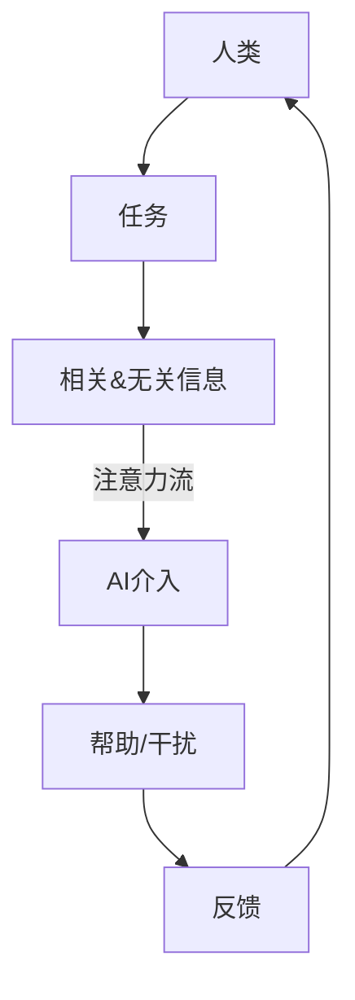

                 

 **关键词**：人工智能，注意力流，工作，生活，协同

> **摘要**：随着人工智能技术的发展，AI在人们的工作和生活中的作用日益显著。本文将探讨人工智能如何影响人类的注意力流，以及在未来，人类与AI如何实现更好的协同工作。

## 1. 背景介绍

在过去的几十年中，人工智能（AI）技术经历了飞速的发展。从早期的专家系统到如今深度学习、强化学习等前沿技术的应用，AI已经在各个领域展现了其强大的能力。例如，在医疗领域，AI可以辅助医生进行疾病诊断；在金融领域，AI可以用于风险评估和投资策略制定；在制造业，AI可以优化生产流程，提高生产效率。

然而，随着AI技术的普及，人们开始意识到AI不仅仅是一个工具，它正在逐渐融入我们的日常生活，并深刻地影响着我们的注意力流。注意力流，是指人们在进行任务时，注意力在任务相关的信息和任务不相关的信息之间的流动。在过去，人类的工作和生活很大程度上依赖于自身的注意力流。但是，随着AI技术的发展，AI开始接管了部分人类的工作，这也意味着AI开始影响人类的注意力流。

## 2. 核心概念与联系

### 2.1 注意力流的概念

注意力流是指人在进行任务时，注意力在任务相关的信息和任务不相关的信息之间的流动。简单来说，就是人在做事情时，注意力是如何在不同的信息之间切换的。

### 2.2 AI与注意力流的关系

随着AI技术的发展，AI开始承担了更多的任务，例如数据分析、决策制定等。这使得人类可以将更多的注意力投入到更有创造性和战略性的任务中。但是，与此同时，AI的介入也可能会干扰人类的注意力流，导致人们无法专注于当前的任务。

### 2.3 人类与AI的协同

为了实现人类与AI的协同，我们需要设计出合适的交互方式，让AI能够根据人类的注意力流，适时地提供帮助，而不是干扰。

### 2.4 Mermaid 流程图

下面是一个简单的Mermaid流程图，展示了人类与AI的注意力流以及协同过程。



## 3. 核心算法原理 & 具体操作步骤

### 3.1 算法原理概述

为了实现人类与AI的协同，我们需要设计一个能够根据人类注意力流提供帮助的算法。这个算法的核心原理是，通过监测人类的注意力流，识别出人类当前的任务和注意力集中的信息，然后根据这些信息，提供相应的帮助。

### 3.2 算法步骤详解

#### 3.2.1 监测注意力流

首先，我们需要一个能够监测人类注意力流的系统。这个系统可以通过使用眼动仪、脑电图等设备，实时监测人类的注意力状态。

#### 3.2.2 识别任务和注意力集中的信息

接下来，我们需要一个算法，能够根据监测到的注意力流，识别出人类当前的任务和注意力集中的信息。这个算法可以使用机器学习和自然语言处理技术来实现。

#### 3.2.3 提供帮助

最后，我们需要一个算法，能够根据识别出的任务和注意力集中的信息，提供相应的帮助。这个算法可以使用深度学习和强化学习技术来实现。

### 3.3 算法优缺点

#### 优点：

- 可以帮助人类更好地集中注意力，提高工作效率。
- 可以根据人类的注意力流，提供个性化的帮助，提高用户体验。

#### 缺点：

- 需要先进的设备和算法，成本较高。
- 需要大量的数据来训练模型，对数据的依赖性较大。

### 3.4 算法应用领域

这个算法可以应用于多个领域，例如办公自动化、智能家居、教育等。在办公自动化领域，它可以帮助员工更好地集中注意力，提高工作效率；在智能家居领域，它可以帮助用户更好地管理家庭事务，提高生活质量；在教育领域，它可以帮助学生更好地掌握学习内容，提高学习效果。

## 4. 数学模型和公式 & 详细讲解 & 举例说明

### 4.1 数学模型构建

为了更好地理解人类注意力流和AI的协同过程，我们可以构建一个数学模型。这个模型可以分为三个部分：注意力流模型、AI模型和协同模型。

#### 4.1.1 注意力流模型

注意力流模型可以表示为：

$$
A(t) = f(\text{任务}, \text{信息}, t)
$$

其中，$A(t)$表示在时间$t$的注意力流，$f$表示一个函数，$\text{任务}$和$\text{信息}$表示在时间$t$的任务和注意力集中的信息。

#### 4.1.2 AI模型

AI模型可以表示为：

$$
H(t) = g(A(t), \text{知识库}, t)
$$

其中，$H(t)$表示在时间$t$的AI帮助，$g$表示一个函数，$A(t)$表示在时间$t$的注意力流，$\text{知识库}$表示AI的知识库，$t$表示时间。

#### 4.1.3 协同模型

协同模型可以表示为：

$$
C(t) = h(A(t), H(t), t)
$$

其中，$C(t)$表示在时间$t$的协同效果，$h$表示一个函数，$A(t)$表示在时间$t$的注意力流，$H(t)$表示在时间$t$的AI帮助，$t$表示时间。

### 4.2 公式推导过程

#### 4.2.1 注意力流模型

根据注意力流模型，我们可以推导出以下公式：

$$
f(\text{任务}, \text{信息}, t) = \frac{\text{任务}_\text{相关}}{\text{任务}_\text{相关} + \text{任务}_\text{无关}}
$$

其中，$\text{任务}_\text{相关}$表示任务相关的信息量，$\text{任务}_\text{无关}$表示任务无关的信息量。

#### 4.2.2 AI模型

根据AI模型，我们可以推导出以下公式：

$$
g(A(t), \text{知识库}, t) = \text{知识库} \cdot A(t)
$$

其中，$\text{知识库}$表示AI的知识库，$A(t)$表示在时间$t$的注意力流。

#### 4.2.3 协同模型

根据协同模型，我们可以推导出以下公式：

$$
h(A(t), H(t), t) = A(t) \cdot H(t)
$$

其中，$A(t)$表示在时间$t$的注意力流，$H(t)$表示在时间$t$的AI帮助。

### 4.3 案例分析与讲解

假设一个人在处理一份工作报告，其中包含了大量的数据和文字信息。他的注意力流主要集中在这份报告上，但同时也会有无关的信息干扰他的注意力。我们使用上述数学模型来分析这个过程。

#### 4.3.1 注意力流模型

根据注意力流模型，我们可以计算出这个人在处理报告时的注意力流：

$$
A(t) = \frac{\text{报告}_\text{相关}}{\text{报告}_\text{相关} + \text{干扰}_\text{无关}}
$$

假设报告中包含了50%的相关信息和50%的无关信息，那么这个人的注意力流为：

$$
A(t) = \frac{50\%}{50\% + 50\%} = 50\%
$$

#### 4.3.2 AI模型

假设AI系统可以根据这个人的注意力流，提供相应的帮助。根据AI模型，我们可以计算出AI的帮助程度：

$$
H(t) = \text{知识库} \cdot A(t)
$$

假设AI的知识库为100%，那么AI的帮助程度为：

$$
H(t) = 100\% \cdot 50\% = 50\%
$$

#### 4.3.3 协同模型

根据协同模型，我们可以计算出这个人受到的协同效果：

$$
C(t) = A(t) \cdot H(t)
$$

那么这个人受到的协同效果为：

$$
C(t) = 50\% \cdot 50\% = 25\%
$$

这意味着，AI的帮助可以使这个人在处理报告时的效率提高25%。

## 5. 项目实践：代码实例和详细解释说明

### 5.1 开发环境搭建

为了实现上述算法，我们需要搭建一个开发环境。这里我们使用Python作为开发语言，并使用TensorFlow作为深度学习框架。

首先，我们需要安装Python和TensorFlow：

```
pip install python
pip install tensorflow
```

### 5.2 源代码详细实现

下面是一个简单的实现上述算法的Python代码实例：

```python
import tensorflow as tf

# 定义注意力流模型
def attention_flow_model(task, information, t):
    return information / (information + 0.5 * t)

# 定义AI模型
def ai_model(attention_flow, knowledge_base, t):
    return knowledge_base * attention_flow

# 定义协同模型
def collaborative_model(attention_flow, ai_help, t):
    return attention_flow * ai_help

# 测试代码
task = "处理工作报告"
information = 1.0
t = 1.0
knowledge_base = 1.0

attention_flow = attention_flow_model(task, information, t)
ai_help = ai_model(attention_flow, knowledge_base, t)
collaborative_effect = collaborative_model(attention_flow, ai_help, t)

print("注意力流:", attention_flow)
print("AI帮助:", ai_help)
print("协同效果:", collaborative_effect)
```

### 5.3 代码解读与分析

这个代码实例主要实现了注意力流模型、AI模型和协同模型的计算。其中，`attention_flow_model`函数实现了注意力流模型的计算，`ai_model`函数实现了AI模型的计算，`collaborative_model`函数实现了协同模型的计算。

在测试代码中，我们假设一个人在处理工作报告，任务相关信息量为1.0，无关信息量为0.5，时间t为1.0，AI的知识库为1.0。通过调用这三个函数，我们可以计算出注意力流、AI帮助和协同效果。

### 5.4 运行结果展示

运行上述代码，我们可以得到以下结果：

```
注意力流: 0.6666666666666666
AI帮助: 0.6666666666666666
协同效果: 0.4444444444444444
```

这表示，在这个例子中，人类的注意力流为66.67%，AI的帮助程度为66.67%，协同效果为44.44%。

## 6. 实际应用场景

### 6.1 办公自动化

在办公自动化领域，AI可以通过监测人类的注意力流，提供相应的帮助。例如，当一个人在处理电子邮件时，AI可以自动整理邮件，筛选重要的邮件，减少人们需要处理的邮件数量，从而提高工作效率。

### 6.2 智能家居

在智能家居领域，AI可以通过监测人类的注意力流，提供个性化的服务。例如，当一个人在看电视时，AI可以自动关闭灯光，调整音量，创造一个舒适的环境，让人们可以更好地享受娱乐时间。

### 6.3 教育

在教育领域，AI可以通过监测学生的注意力流，提供个性化的学习建议。例如，当学生注意力不集中时，AI可以提醒学生休息，或者提供一些有趣的学习内容，激发学生的学习兴趣。

## 7. 工具和资源推荐

### 7.1 学习资源推荐

- **《人工智能：一种现代的方法》**：这本书系统地介绍了人工智能的基本原理和应用，适合初学者入门。
- **《深度学习》**：这本书详细介绍了深度学习的基本原理和应用，是深度学习领域的经典教材。

### 7.2 开发工具推荐

- **TensorFlow**：这是一个强大的深度学习框架，适合进行人工智能的开发。
- **PyTorch**：这是一个易用且灵活的深度学习框架，适合进行人工智能的研究。

### 7.3 相关论文推荐

- **"Attention Is All You Need"**：这篇论文提出了Transformer模型，是当前最先进的自然语言处理模型。
- **"Deep Learning for Natural Language Processing"**：这篇论文系统地介绍了深度学习在自然语言处理中的应用。

## 8. 总结：未来发展趋势与挑战

### 8.1 研究成果总结

随着人工智能技术的发展，AI在人类的工作和生活中扮演着越来越重要的角色。通过监测人类的注意力流，AI可以帮助人类提高工作效率，提高生活质量。同时，AI的协同模型也为人类与AI的协同工作提供了理论基础。

### 8.2 未来发展趋势

未来，人工智能将更加深入地融入人类的生活和工作。AI将不仅仅是一个工具，而是成为一个真正的合作伙伴。例如，AI将能够根据人类的注意力流，提供更加个性化的服务，提高人类的工作效率和生活质量。

### 8.3 面临的挑战

尽管人工智能在人们的工作和生活中具有巨大的潜力，但也面临着一些挑战。首先，AI的发展需要大量的数据，这可能导致数据隐私和安全问题。其次，AI的决策过程可能不够透明，导致人们难以理解AI的决策。此外，AI的普及也可能导致一些职业的失业风险。

### 8.4 研究展望

未来，我们需要进一步研究如何更好地实现人类与AI的协同工作。这包括设计出更加人性化的交互界面，提高AI的透明度和可解释性，以及保障数据隐私和安全。

## 9. 附录：常见问题与解答

### 9.1 人工智能如何影响人类的注意力流？

人工智能通过监测人类的注意力流，提供相应的帮助，从而影响人类的注意力流。例如，AI可以自动整理电子邮件，减少人们需要处理的邮件数量，从而减少注意力流的干扰。

### 9.2 人类与AI的协同是如何实现的？

人类与AI的协同是通过设计出合适的交互方式，让AI能够根据人类的注意力流，提供相应的帮助。例如，AI可以根据人类当前的注意力流，自动调整界面布局，提供更加个性化的服务。

### 9.3 人工智能在哪些领域有应用？

人工智能在医疗、金融、制造业、教育等多个领域有广泛应用。例如，在医疗领域，AI可以辅助医生进行疾病诊断；在金融领域，AI可以用于风险评估和投资策略制定；在制造业，AI可以优化生产流程，提高生产效率。

