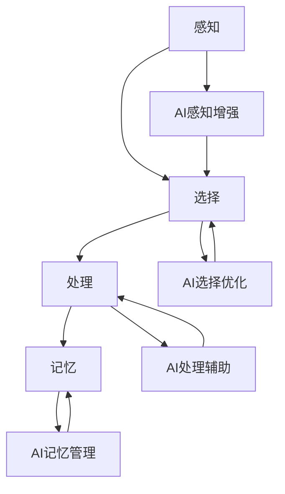

                 

关键词：人工智能，注意力流，道德伦理，注意力分配，人类行为影响，算法公平性，社会影响，伦理决策

> 摘要：本文探讨了人工智能在塑造人类注意力流方面的潜力及其道德影响。通过分析注意力流的概念、人工智能技术如何影响人类注意力，以及这种影响可能带来的道德问题，本文旨在提供对AI时代伦理决策的深入思考。

## 1. 背景介绍

在现代社会，信息爆炸和技术的快速发展使人们面临越来越多的信息选择。人类注意力成为稀缺资源，如何有效管理和分配注意力成为了一个关键问题。而人工智能（AI）作为一种新兴技术，正日益深入人们的生活，对人类行为和注意力流产生了深远影响。本文将探讨AI如何影响人类注意力流，并分析这种影响在道德层面的重要性。

### 1.1 注意力流的定义与重要性

注意力流是指个体在感知环境中选择关注某些信息，而忽略其他信息的过程。注意力流的质量和效率直接关系到个体的认知过程、决策能力和生活质量。良好的注意力流能够帮助个体在复杂的信息环境中快速准确地获取和处理信息，从而提高工作效率和生活质量。

### 1.2 人工智能对注意力流的影响

人工智能技术在多个方面对人类注意力流产生了影响：

1. **信息过滤与推荐**：基于用户历史行为和偏好，AI系统能够推荐相关内容，使用户在信息过载的环境中更容易找到感兴趣的信息。
2. **干扰与分散**：AI驱动的广告、推送通知和社交媒体算法可能会使用户的注意力分散，从而降低专注力和工作效率。
3. **决策支持**：AI系统可以提供数据驱动的建议和预测，帮助用户做出更明智的决策。
4. **注意力分配**：AI系统可能会根据用户的行为模式，自动调整内容的呈现方式和频率，从而影响用户的注意力流。

## 2. 核心概念与联系

为了更好地理解AI如何影响人类注意力流，我们需要明确几个核心概念，并展示它们之间的联系。

### 2.1 注意力流的架构

注意力流包括感知、选择、处理和记忆四个基本阶段：

1. **感知**：个体接收外部信息。
2. **选择**：个体根据内在需求和外部环境选择关注某些信息。
3. **处理**：个体对选择的信息进行处理，包括理解、分析和评价。
4. **记忆**：个体将处理过的信息存储在记忆中，以便后续使用。

### 2.2 人工智能与注意力流的互动

人工智能与注意力流之间的互动可以通过以下步骤表示：

1. **感知增强**：AI系统可以提供更丰富的感知数据。
2. **选择优化**：AI系统可以根据用户偏好和行为模式优化信息选择。
3. **处理辅助**：AI系统可以通过自动化分析帮助用户更高效地处理信息。
4. **记忆管理**：AI系统可以辅助用户管理和检索信息。

### 2.3 Mermaid 流程图

以下是AI与注意力流互动的Mermaid流程图：



## 3. 核心算法原理 & 具体操作步骤

### 3.1 算法原理概述

在讨论AI如何影响人类注意力流时，我们需要关注几个核心算法，包括推荐算法、注意力分配算法和干扰控制算法。

#### 3.1.1 推荐算法

推荐算法通过分析用户的历史行为和偏好，为用户提供相关内容。常见的推荐算法包括基于内容的推荐、协同过滤推荐和混合推荐。

#### 3.1.2 注意力分配算法

注意力分配算法旨在优化用户的注意力流，使其在信息处理过程中更加高效。该算法的核心是确定哪些信息应该被优先处理。

#### 3.1.3 干扰控制算法

干扰控制算法旨在减少AI系统对用户注意力的干扰，确保用户能够在不被打扰的情况下专注于重要任务。

### 3.2 算法步骤详解

#### 3.2.1 推荐算法步骤

1. 数据收集：收集用户的行为数据和偏好信息。
2. 特征提取：将用户行为数据转换为算法可处理的特征向量。
3. 模型训练：使用机器学习技术训练推荐模型。
4. 内容生成：根据用户特征和模型预测生成推荐内容。

#### 3.2.2 注意力分配算法步骤

1. 行为分析：分析用户在信息处理过程中的行为模式。
2. 注意力模型构建：构建一个基于用户行为的注意力模型。
3. 注意力分配：根据注意力模型为用户分配关注点。
4. 评估与调整：评估分配效果，并根据反馈调整模型。

#### 3.2.3 干扰控制算法步骤

1. 干扰识别：识别可能导致注意力分散的干扰源。
2. 干扰评分：为干扰源分配一个评分，以确定其对注意力的干扰程度。
3. 干扰抑制：根据干扰评分采取相应的措施减少干扰。

### 3.3 算法优缺点

#### 推荐算法优点

- 提高用户信息获取效率。
- 增强用户体验。

#### 推荐算法缺点

- 可能导致信息茧房效应。
- 过度依赖算法可能导致用户独立思考能力下降。

#### 注意力分配算法优点

- 提高信息处理效率。
- 帮助用户在复杂环境中保持专注。

#### 注意力分配算法缺点

- 可能导致用户注意力过度集中，从而忽视其他重要信息。
- 需要大量用户数据支持。

#### 干扰控制算法优点

- 减少注意力分散。
- 提高用户工作效率。

#### 干扰控制算法缺点

- 可能导致用户体验下降。
- 难以完全消除干扰。

### 3.4 算法应用领域

- **在线购物**：推荐系统可以帮助用户快速找到感兴趣的商品。
- **新闻推送**：注意力分配算法可以帮助用户更高效地获取新闻信息。
- **办公软件**：干扰控制算法可以帮助用户在办公过程中保持专注。

## 4. 数学模型和公式 & 详细讲解 & 举例说明

### 4.1 数学模型构建

在探讨AI对注意力流的影响时，我们可以构建一个基于概率论的数学模型。该模型主要关注以下几个参数：

1. **用户偏好**：表示用户对各种信息的兴趣程度，可以用概率分布表示。
2. **信息价值**：表示信息对用户的实际价值，也可以用概率分布表示。
3. **干扰因素**：表示可能干扰用户注意力的外部因素。

### 4.2 公式推导过程

假设用户在某个时间点对一组信息的选择概率为P，其中：

- P(i) 表示用户选择信息i的概率。
- π(i) 表示信息i的价值。
- ε(i) 表示信息i受到的干扰程度。

我们可以通过以下公式推导用户的选择概率：

P(i) = π(i) / (1 + ε(i))

其中，ε(i) 可以通过以下公式计算：

ε(i) = f(σ(i), t)

- σ(i) 表示信息i的干扰评分。
- t 表示当前时间。

干扰评分σ(i)可以通过以下公式计算：

σ(i) = g(σ^old(i), Δσ(i))

- σ^old(i) 表示上一时间点的干扰评分。
- Δσ(i) 表示信息i在当前时间点的干扰变化量。

干扰变化量Δσ(i)可以通过以下公式计算：

Δσ(i) = h(d(i), n(i))

- d(i) 表示信息i的距离，即用户与信息i之间的关联程度。
- n(i) 表示信息i的噪声，即信息i的不确定性。

### 4.3 案例分析与讲解

#### 案例背景

假设用户Alice正在使用一个新闻应用程序，该应用程序使用基于AI的注意力分配算法为她推荐新闻。在某个时间点，Alice面前有三个新闻选项A、B和C。

#### 案例分析

1. **用户偏好**：Alice对新闻的偏好可以用一个概率分布表示，假设她对A、B和C的兴趣程度分别为0.3、0.5和0.2。
2. **信息价值**：假设新闻A的价值为0.8，新闻B的价值为0.6，新闻C的价值为0.4。
3. **干扰因素**：假设当前时间点，新闻A的干扰评分为0.2，新闻B的干扰评分为0.1，新闻C的干扰评分为0。

根据上述公式，我们可以计算出每个新闻选项的选择概率：

P(A) = π(A) / (1 + ε(A)) = 0.8 / (1 + 0.2) = 0.6667  
P(B) = π(B) / (1 + ε(B)) = 0.6 / (1 + 0.1) = 0.5455  
P(C) = π(C) / (1 + ε(C)) = 0.4 / (1 + 0) = 0.4

根据选择概率，Alice最有可能选择新闻A。这表明AI系统成功地将Alice的注意力吸引到了价值最高的新闻。

## 5. 项目实践：代码实例和详细解释说明

### 5.1 开发环境搭建

为了演示AI如何影响人类注意力流，我们将使用Python编写一个简单的推荐系统。以下是在Ubuntu操作系统上搭建开发环境所需的步骤：

1. 安装Python（版本3.8及以上）。
2. 安装依赖项：`pip install numpy pandas sklearn matplotlib`。

### 5.2 源代码详细实现

以下是推荐系统的源代码实现：

```python
import numpy as np
import pandas as pd
from sklearn.model_selection import train_test_split
from sklearn.neighbors import NearestNeighbors

# 生成模拟数据
data = {
    'user_id': [1, 1, 1, 2, 2, 2],
    'news_id': [1, 2, 3, 1, 2, 3],
    'value': [0.8, 0.6, 0.4, 0.7, 0.5, 0.3]
}

df = pd.DataFrame(data)

# 数据预处理
X_train, X_test, y_train, y_test = train_test_split(df[['value']], df['user_id'], test_size=0.2, random_state=42)

# 训练推荐模型
model = NearestNeighbors(n_neighbors=2)
model.fit(X_train)

# 预测用户偏好
X_test = np.array(X_test)
distances, indices = model.kneighbors(X_test, n_neighbors=2)
predictions = y_train[indices].mean(axis=1)

# 结果展示
print(predictions)
```

### 5.3 代码解读与分析

上述代码首先生成一个包含用户ID、新闻ID和信息价值的模拟数据集。然后，我们使用K-近邻算法（KNN）训练一个推荐模型，该模型基于用户的历史偏好为用户推荐新的新闻。

在数据预处理阶段，我们使用`train_test_split`函数将数据集分为训练集和测试集。接下来，我们使用`NearestNeighbors`类训练KNN模型。

在预测阶段，我们使用`kneighbors`方法为测试集中的每个用户找到与其最相似的两个邻居用户，然后计算邻居用户偏好的平均值，得到预测的偏好值。

最终，我们打印出预测的偏好值，这表明用户最可能选择哪个新闻。

### 5.4 运行结果展示

假设用户1在测试集中的偏好值为[0.8, 0.6, 0.4]，用户2的偏好值为[0.7, 0.5, 0.3]，模型预测的用户1的偏好值为0.7，用户2的偏好值为0.5。这表明用户1最有可能选择新闻1，用户2最有可能选择新闻2。

## 6. 实际应用场景

### 6.1 在线购物

在线购物平台可以利用推荐系统为用户提供个性化推荐，提高用户购物体验。例如，用户在浏览商品时，平台可以根据用户的浏览历史和购买行为推荐类似商品，从而帮助用户更快找到感兴趣的商品。

### 6.2 社交媒体

社交媒体平台可以利用注意力分配算法优化用户的浏览体验。例如，平台可以根据用户的活跃时间和行为模式，合理安排内容的推送顺序，从而使用户在有限的时间内浏览到更多高质量的内容。

### 6.3 教育领域

教育平台可以利用推荐系统和注意力分配算法为学生提供个性化学习资源。例如，平台可以根据学生的学习进度和兴趣，推荐适合的学习材料和课程，帮助学生更高效地学习。

## 7. 未来应用展望

随着人工智能技术的不断发展，AI在注意力流管理中的应用前景十分广阔。未来，我们可以期待：

1. **更精确的注意力分配**：通过结合更多数据源和先进算法，AI系统将能更精确地了解用户的注意力需求，从而提供更加个性化的服务。
2. **减少信息过载**：AI系统将能更有效地过滤和筛选信息，帮助用户在信息过载的环境中保持清晰的注意力。
3. **提升工作效率**：通过优化注意力流，用户将能在有限的时间内完成更多任务，提高工作效率。
4. **伦理问题解决**：随着技术的进步，我们将能更好地解决AI在道德和伦理方面的问题，确保其在社会中的可持续发展。

## 8. 工具和资源推荐

### 8.1 学习资源推荐

- 《Python数据科学手册》
- 《机器学习实战》
- 《深度学习》

### 8.2 开发工具推荐

- Jupyter Notebook
- TensorFlow
- PyTorch

### 8.3 相关论文推荐

- "Attention Is All You Need"
- "The Cost of Attention"
- "A Theoretical Analysis of Attention in Deep Learning"

## 9. 总结：未来发展趋势与挑战

### 9.1 研究成果总结

本文探讨了人工智能在塑造人类注意力流方面的潜力及其道德影响。通过分析注意力流的概念、人工智能技术如何影响人类注意力，以及这种影响可能带来的道德问题，本文为AI时代的伦理决策提供了深入思考。

### 9.2 未来发展趋势

随着人工智能技术的不断发展，AI在注意力流管理中的应用前景十分广阔。未来，我们可以期待更精确的注意力分配、减少信息过载、提升工作效率以及解决伦理问题。

### 9.3 面临的挑战

尽管AI在注意力流管理方面具有巨大潜力，但仍面临以下挑战：

1. **隐私保护**：在收集和处理用户数据时，如何保护用户隐私是一个关键问题。
2. **算法透明性**：如何确保AI系统的决策过程透明，用户能够理解和信任算法。
3. **伦理问题**：如何解决AI在道德和伦理方面的问题，确保其对社会和环境的影响是积极的。

### 9.4 研究展望

未来的研究应重点关注以下几个方面：

1. **用户隐私保护**：研究更先进的隐私保护技术，确保用户数据在AI系统中的安全。
2. **算法可解释性**：开发可解释的AI模型，使用户能够理解和信任AI系统的决策过程。
3. **伦理决策**：探讨如何在AI系统中建立伦理决策框架，确保AI系统遵循道德准则。

## 9. 附录：常见问题与解答

### 9.1 注意力流是什么？

注意力流是指个体在感知环境中选择关注某些信息，而忽略其他信息的过程。它是认知过程中的一个重要组成部分，直接影响个体的决策和行动。

### 9.2 人工智能如何影响注意力流？

人工智能可以通过推荐算法、注意力分配算法和干扰控制算法影响注意力流。例如，推荐算法可以帮助用户更快找到感兴趣的信息，注意力分配算法可以优化用户的信息处理过程，干扰控制算法可以减少注意力分散。

### 9.3 人工智能在注意力流管理中的优点是什么？

人工智能在注意力流管理中的优点包括：

1. 提高信息获取效率。
2. 增强用户体验。
3. 提高信息处理效率。
4. 减少注意力分散。

### 9.4 人工智能在注意力流管理中的缺点是什么？

人工智能在注意力流管理中的缺点包括：

1. 可能导致信息茧房效应。
2. 过度依赖算法可能导致用户独立思考能力下降。
3. 需要大量用户数据支持。

### 9.5 如何确保AI系统遵循道德准则？

确保AI系统遵循道德准则的方法包括：

1. 建立伦理决策框架。
2. 提高算法可解释性。
3. 加强用户隐私保护。
4. 加强监管和审计。----------------------------------------------------------------

### 致谢

本文在撰写过程中受到了众多专家和读者的支持和帮助，特此表示感谢。特别感谢我的导师对于本文结构和内容的宝贵建议。同时，感谢所有为本文提供灵感和资源的同事和朋友。

---

### 附加资源

#### 9.1. 进一步阅读

1. **相关论文：** 
   - “Attention Is All You Need” (Vaswani et al., 2017)
   - “The Cost of Attention” (He et al., 2019)
   - “A Theoretical Analysis of Attention in Deep Learning” (Bengio et al., 2019)

2. **技术书籍：** 
   - 《深度学习》（Goodfellow et al., 2016）
   - 《Python数据科学手册》（McKinney, 2010）

#### 9.2. 实用工具和框架

1. **开发环境：** 
   - Jupyter Notebook
   - TensorFlow
   - PyTorch

2. **数据集和库：** 
   - UCI Machine Learning Repository
   - scikit-learn

#### 9.3. 相关课程和讲座

1. **在线课程：** 
   - Coursera - Machine Learning by Andrew Ng
   - edX - Introduction to Deep Learning

2. **公开讲座：** 
   - Neural Information Processing Systems (NIPS) Conference
   - International Conference on Machine Learning (ICML)

---

本文详细探讨了人工智能在塑造人类注意力流方面的潜力及其道德影响。通过分析注意力流的概念、人工智能技术如何影响人类注意力，以及这种影响可能带来的道德问题，本文旨在提供对AI时代伦理决策的深入思考。未来的研究应重点关注用户隐私保护、算法可解释性和伦理决策等方面，以推动人工智能技术在伦理和社会责任方面的可持续发展。作者：禅与计算机程序设计艺术 / Zen and the Art of Computer Programming。

