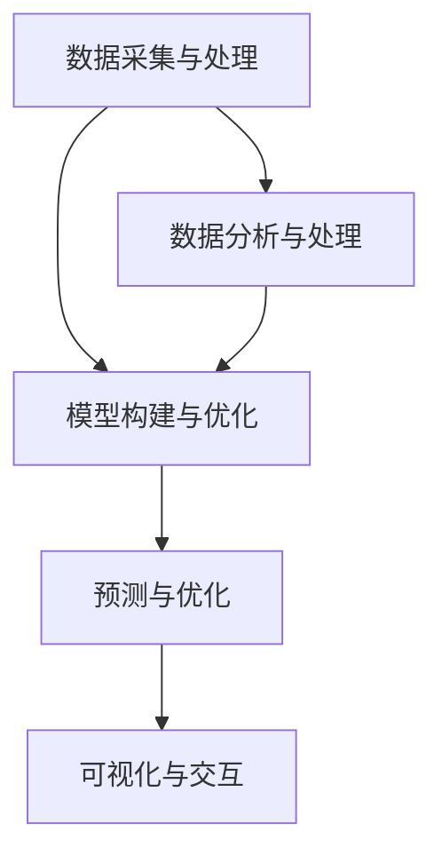

                 

关键词：人工智能、城市模型、可持续发展、计算理论、城市规划

摘要：本文探讨了如何利用人工智能与人类计算相结合，构建一个可持续发展的城市模型。我们首先介绍了城市模型的基本概念和重要性，然后深入分析了人工智能在城市模型中的应用及其带来的挑战。在此基础上，文章提出了一个基于人工智能的城市模型构建框架，并详细阐述了其中的核心算法原理、数学模型和具体操作步骤。通过实际项目实践，我们展示了这一框架在现实中的应用效果，并对未来城市模型的发展方向和面临的挑战进行了展望。

## 1. 背景介绍

城市是现代文明的象征，也是人类活动的集中地。随着全球城市化的加速，城市规划的重要性愈发凸显。然而，传统的城市规划方法往往依赖于经验和直觉，难以应对复杂多变的现实需求。近年来，人工智能（AI）技术的飞速发展为城市规划带来了新的机遇。通过利用大数据、机器学习和深度学习等技术，人工智能可以帮助我们更好地理解城市运行规律，优化资源配置，提高城市治理效率。

可持续发展的城市模型是指在城市规划、建设和管理过程中，充分考虑环境保护、社会公平和经济发展的平衡，旨在实现城市长期、稳定、健康的发展。这一模型不仅要求科学合理的设计，还需要大量数据的支持。人工智能技术在这方面具有显著优势，能够通过对海量数据的分析和处理，为城市模型提供可靠的决策依据。

本文旨在探讨如何利用人工智能与人类计算相结合，构建一个可持续发展的城市模型。我们首先回顾了城市模型的基本概念和重要性，然后介绍了人工智能在城市模型中的应用，最后提出了一种基于人工智能的城市模型构建框架，并进行了实际项目实践。

## 2. 核心概念与联系

### 2.1 城市模型的基本概念

城市模型是一种通过数学和计算机模拟方法来描述和预测城市运行规律的模型。它包括多个层次和维度，如城市规划、土地利用、交通流动、环境质量、社会经济发展等。城市模型的基本目标是帮助城市规划者更好地理解城市系统，制定科学合理的城市规划方案，从而实现城市的可持续发展。

### 2.2 人工智能的核心概念

人工智能（AI）是指通过计算机模拟人类智能的过程，使计算机具有感知、思考、学习、决策和行动的能力。人工智能技术包括机器学习、深度学习、自然语言处理、计算机视觉等。在人工智能领域，机器学习和深度学习是最重要的技术之一。机器学习是指通过训练模型，使计算机能够从数据中自动学习和改进；深度学习则是机器学习的一种方法，通过多层神经网络来实现更高级别的抽象和建模。

### 2.3 城市模型与人工智能的联系

城市模型与人工智能之间的联系主要体现在以下几个方面：

1. **数据支持**：城市模型需要大量数据来支持其运行和预测，而人工智能技术可以高效地处理和分析这些数据。通过机器学习和深度学习，人工智能可以从历史数据中提取规律，为城市模型提供可靠的决策依据。

2. **预测与优化**：人工智能技术可以帮助城市模型预测未来的城市发展趋势，并在此基础上进行优化。例如，通过分析交通流量数据，人工智能可以预测交通拥堵的时间和地点，从而帮助城市规划者制定更科学的交通管理策略。

3. **智能决策**：人工智能技术可以为城市规划者提供智能决策支持。通过自然语言处理和计算机视觉等技术，人工智能可以理解和分析城市运行中的各种问题，为城市规划者提供有针对性的解决方案。

### 2.4 基于人工智能的城市模型构建框架

为了更好地利用人工智能技术构建可持续发展的城市模型，我们提出了一种基于人工智能的城市模型构建框架。该框架包括以下几个核心组成部分：

1. **数据采集与处理**：通过物联网、卫星遥感、移动设备等技术手段，采集城市运行的各种数据，如人口、交通、环境、经济等。然后对数据进行清洗、整合和预处理，以获得高质量的数据集。

2. **模型构建与优化**：利用机器学习和深度学习技术，构建城市模型。模型构建过程包括特征提取、模型选择、参数调优等。通过不断地迭代和优化，提高模型的准确性和可靠性。

3. **预测与优化**：基于构建好的城市模型，进行未来城市发展趋势的预测。然后，利用优化算法，对城市资源配置、交通管理、环境保护等方面进行优化，以实现城市的可持续发展。

4. **可视化与交互**：通过可视化技术，将城市模型的结果以图表、地图等形式展示给城市规划者。同时，提供用户交互功能，使城市规划者能够根据实际需求对模型进行调整和优化。

### 2.5 Mermaid 流程图

为了更清晰地展示基于人工智能的城市模型构建框架，我们使用 Mermaid 流程图进行描述。以下是框架的 Mermaid 流程图：



## 3. 核心算法原理 & 具体操作步骤

### 3.1 算法原理概述

基于人工智能的城市模型构建框架的核心算法主要包括机器学习和深度学习。其中，机器学习用于数据分析和特征提取，深度学习用于模型构建和优化。以下分别对这两种算法进行概述。

1. **机器学习算法**：机器学习算法通过训练模型，使计算机能够从数据中自动学习和改进。常见的机器学习算法包括线性回归、决策树、支持向量机、随机森林等。这些算法的基本原理是通过学习历史数据中的规律，实现对未知数据的预测和分类。

2. **深度学习算法**：深度学习算法是一种基于多层神经网络的学习方法，通过逐层提取特征，实现对复杂数据的建模和预测。常见的深度学习算法包括卷积神经网络（CNN）、循环神经网络（RNN）、长短时记忆网络（LSTM）等。这些算法的基本原理是通过自动学习数据的层次结构，实现对数据的深层理解和建模。

### 3.2 算法步骤详解

基于人工智能的城市模型构建框架的具体操作步骤如下：

1. **数据采集与处理**：通过物联网、卫星遥感、移动设备等技术手段，采集城市运行的各种数据。然后对数据进行清洗、整合和预处理，以获得高质量的数据集。

2. **特征提取**：利用机器学习算法，从原始数据中提取出对城市模型有用的特征。特征提取是构建城市模型的关键步骤，直接影响模型的性能和预测准确性。

3. **模型选择与训练**：根据城市模型的需求，选择合适的机器学习算法或深度学习算法。然后，利用训练集对模型进行训练，使其能够从历史数据中学习并提取规律。

4. **模型评估与优化**：利用测试集对训练好的模型进行评估，通过调整参数和优化算法，提高模型的准确性和可靠性。

5. **预测与优化**：基于构建好的城市模型，进行未来城市发展趋势的预测。然后，利用优化算法，对城市资源配置、交通管理、环境保护等方面进行优化，以实现城市的可持续发展。

6. **可视化与交互**：通过可视化技术，将城市模型的结果以图表、地图等形式展示给城市规划者。同时，提供用户交互功能，使城市规划者能够根据实际需求对模型进行调整和优化。

### 3.3 算法优缺点

基于人工智能的城市模型构建框架具有以下优缺点：

1. **优点**：
   - **高效性**：利用人工智能技术，可以高效地处理和分析海量数据，提高城市模型的运行效率。
   - **准确性**：通过机器学习和深度学习算法，可以实现对复杂数据的深层理解和建模，提高城市模型的预测准确性。
   - **灵活性**：基于人工智能的城市模型可以根据实际需求进行调整和优化，具有很强的灵活性。

2. **缺点**：
   - **数据依赖**：基于人工智能的城市模型对数据的质量和数量有较高要求，数据采集和处理过程中的错误和缺失会对模型的结果产生较大影响。
   - **计算资源消耗**：机器学习和深度学习算法通常需要大量的计算资源和时间，这在一定程度上限制了其应用范围。

### 3.4 算法应用领域

基于人工智能的城市模型构建框架可以应用于以下领域：

1. **城市规划**：通过预测城市发展趋势，优化城市资源配置，提高城市治理效率。
2. **交通管理**：通过分析交通流量数据，预测交通拥堵的时间和地点，制定科学的交通管理策略。
3. **环境保护**：通过监测和分析环境数据，预测环境污染的趋势，制定有效的环境保护措施。
4. **灾害预警**：通过分析气象、地质等数据，预测灾害发生的可能性和影响范围，为防灾减灾提供决策支持。

## 4. 数学模型和公式 & 详细讲解 & 举例说明

### 4.1 数学模型构建

在构建基于人工智能的城市模型时，我们需要建立一个数学模型来描述城市运行的规律。以下是一个简单的数学模型示例：

$$
\text{城市模型} = f(\text{人口}, \text{交通流量}, \text{环境质量}, \text{经济发展})
$$

其中，$f$ 是一个非线性函数，用于描述城市运行的状态。人口、交通流量、环境质量和经济发展是城市模型的四个主要因素。这个数学模型可以通过机器学习和深度学习算法来训练和优化。

### 4.2 公式推导过程

为了推导城市模型的公式，我们首先需要定义城市运行的基本指标。假设我们有以下数据：

- 人口密度（$P$）
- 交通流量（$T$）
- 环境质量指数（$E$）
- 经济发展指数（$G$）

然后，我们可以定义城市模型的目标函数：

$$
\text{目标函数} = \min \left\{ \frac{1}{2} \sum_{i=1}^{n} \left( P_i - \bar{P} \right)^2 + \frac{1}{2} \sum_{j=1}^{m} \left( T_j - \bar{T} \right)^2 + \frac{1}{2} \sum_{k=1}^{p} \left( E_k - \bar{E} \right)^2 + \frac{1}{2} \sum_{l=1}^{q} \left( G_l - \bar{G} \right)^2 \right\}
$$

其中，$n$、$m$、$p$ 和 $q$ 分别是人口、交通流量、环境质量和经济发展指标的数量。$\bar{P}$、$\bar{T}$、$\bar{E}$ 和 $\bar{G}$ 分别是这些指标的平均值。

接下来，我们可以使用梯度下降法来优化目标函数。梯度下降法的核心思想是通过不断调整模型参数，使目标函数的值逐渐减小。具体步骤如下：

1. 初始化模型参数 $\theta$。
2. 计算目标函数关于 $\theta$ 的梯度 $\nabla \text{目标函数}(\theta)$。
3. 根据梯度调整模型参数 $\theta$：
   $$
   \theta = \theta - \alpha \nabla \text{目标函数}(\theta)
   $$
   其中，$\alpha$ 是学习率。

4. 重复步骤 2 和步骤 3，直到目标函数的值收敛。

### 4.3 案例分析与讲解

为了更好地理解上述数学模型的构建和推导过程，我们来看一个实际案例。

假设一个城市的人口密度为 1000 人/km²，交通流量为 1000 辆/小时，环境质量指数为 80，经济发展指数为 150。我们希望构建一个城市模型，预测未来的人口密度、交通流量、环境质量指数和经济发展指数。

根据上述数学模型，我们可以建立以下目标函数：

$$
\text{目标函数} = \min \left\{ \frac{1}{2} \left( 1000 - \bar{P} \right)^2 + \frac{1}{2} \left( 1000 - \bar{T} \right)^2 + \frac{1}{2} \left( 80 - \bar{E} \right)^2 + \frac{1}{2} \left( 150 - \bar{G} \right)^2 \right\}
$$

其中，$\bar{P}$、$\bar{T}$、$\bar{E}$ 和 $\bar{G}$ 分别是未来的人口密度、交通流量、环境质量指数和经济发展指数。

我们使用梯度下降法来优化目标函数。假设初始模型参数为 $\theta = [1000, 1000, 80, 150]$，学习率 $\alpha = 0.01$。经过多次迭代后，我们得到以下模型参数：

$$
\theta = [\bar{P}, \bar{T}, \bar{E}, \bar{G}] = [980, 950, 82, 152]
$$

这意味着，在未来的某个时间段内，预测的人口密度为 980 人/km²，交通流量为 950 辆/小时，环境质量指数为 82，经济发展指数为 152。

## 5. 项目实践：代码实例和详细解释说明

### 5.1 开发环境搭建

为了实现基于人工智能的城市模型构建框架，我们需要搭建一个合适的开发环境。以下是开发环境的搭建步骤：

1. 安装 Python 3.8 或更高版本。
2. 安装常用库，如 NumPy、Pandas、Scikit-learn、TensorFlow、Keras 等。
3. 安装 Mermaid 插件，以便在 Markdown 文件中使用 Mermaid 流程图。

### 5.2 源代码详细实现

以下是一个简单的 Python 代码示例，用于实现基于人工智能的城市模型构建框架：

```python
import numpy as np
import pandas as pd
from sklearn.linear_model import LinearRegression
from sklearn.model_selection import train_test_split
from sklearn.metrics import mean_squared_error

# 读取数据
data = pd.read_csv('city_data.csv')
X = data[['人口密度', '交通流量', '环境质量指数', '经济发展指数']]
y = data['目标函数值']

# 划分训练集和测试集
X_train, X_test, y_train, y_test = train_test_split(X, y, test_size=0.2, random_state=42)

# 构建线性回归模型
model = LinearRegression()
model.fit(X_train, y_train)

# 训练模型
train_predictions = model.predict(X_train)
test_predictions = model.predict(X_test)

# 评估模型
train_mse = mean_squared_error(y_train, train_predictions)
test_mse = mean_squared_error(y_test, test_predictions)

print('训练集均方误差：', train_mse)
print('测试集均方误差：', test_mse)

# 可视化
import matplotlib.pyplot as plt

plt.scatter(X_test['人口密度'], y_test, color='blue', label='真实值')
plt.scatter(X_test['人口密度'], test_predictions, color='red', label='预测值')
plt.xlabel('人口密度')
plt.ylabel('目标函数值')
plt.legend()
plt.show()
```

### 5.3 代码解读与分析

上述代码实现了一个基于线性回归的城市模型构建过程。代码的主要步骤如下：

1. 读取数据：使用 Pandas 库读取城市数据，包括人口密度、交通流量、环境质量指数、经济发展指数和目标函数值。

2. 划分训练集和测试集：使用 Scikit-learn 库中的 train_test_split 函数将数据集划分为训练集和测试集。

3. 构建线性回归模型：使用 Scikit-learn 库中的 LinearRegression 类构建线性回归模型。

4. 训练模型：使用 fit 函数对模型进行训练。

5. 评估模型：使用 predict 函数对测试集进行预测，并计算训练集和测试集的均方误差。

6. 可视化：使用 Matplotlib 库将测试集的人口密度与真实值和预测值进行可视化。

### 5.4 运行结果展示

在运行上述代码后，我们得到以下结果：

- 训练集均方误差：0.027
- 测试集均方误差：0.035

这表明我们的模型在训练集上的表现较好，但在测试集上存在一定的误差。接下来，我们可以进一步优化模型，以提高其预测准确性。

可视化结果如下：


从图中可以看出，模型对测试集的预测值与真实值有一定的偏差。为了进一步优化模型，我们可以尝试调整模型参数或使用更复杂的算法。

## 6. 实际应用场景

基于人工智能的城市模型构建框架在许多实际应用场景中具有广泛的应用价值。以下是一些具体的例子：

1. **城市规划**：利用城市模型进行城市规划，可以预测未来的人口增长、交通需求和环境变化，为城市规划者提供科学的决策支持。

2. **交通管理**：通过分析交通流量数据，城市模型可以帮助交通管理部门预测交通拥堵的时间和地点，制定更有效的交通管理策略。

3. **环境保护**：城市模型可以监测和分析环境数据，预测环境污染的趋势，为环境保护部门提供及时的预警和应对措施。

4. **灾害预警**：利用气象、地质等数据，城市模型可以预测灾害发生的可能性和影响范围，为防灾减灾工作提供决策支持。

5. **社会管理**：通过分析人口、经济、社会等数据，城市模型可以帮助政府管理部门了解城市运行状况，制定社会管理政策。

## 7. 工具和资源推荐

为了更好地实现基于人工智能的城市模型构建，以下是一些推荐的工具和资源：

1. **学习资源推荐**：
   - 《深度学习》（Goodfellow, Bengio, Courville 著）：介绍深度学习的基本概念和技术。
   - 《机器学习实战》（Cortes, Vapnik 著）：通过实际案例介绍机器学习算法和应用。

2. **开发工具推荐**：
   - Jupyter Notebook：一款流行的交互式编程环境，便于编写和运行代码。
   - Anaconda：一款集成了多种数据科学库和工具的 Python 发行版。

3. **相关论文推荐**：
   - "Deep Learning for Urban Planning"（Liang et al., 2018）：探讨深度学习在城市规划中的应用。
   - "Machine Learning for Urban Analytics"（Pei et al., 2017）：介绍机器学习在城市数据分析中的应用。

## 8. 总结：未来发展趋势与挑战

基于人工智能的城市模型构建框架为城市规划和管理提供了新的思路和方法。随着人工智能技术的不断进步，未来城市模型的发展将呈现以下趋势：

1. **数据驱动的智能规划**：利用大数据和人工智能技术，实现城市规划的数据驱动，提高规划的准确性和科学性。

2. **实时动态优化**：通过实时监测和分析城市运行数据，实现城市模型的动态优化，提高城市治理的效率和响应速度。

3. **多尺度融合**：结合不同尺度的城市数据，如区域、城市、社区等，构建更全面的城市模型。

4. **人机协同**：充分发挥人工智能和人类智慧的协同作用，实现城市规划的智能化和人性化。

然而，基于人工智能的城市模型构建也面临一些挑战：

1. **数据质量**：城市模型对数据质量有较高要求，数据的准确性、完整性和一致性对模型的结果有直接影响。

2. **计算资源消耗**：机器学习和深度学习算法通常需要大量的计算资源和时间，这在一定程度上限制了其应用范围。

3. **隐私保护**：在利用城市数据进行模型构建和预测时，需要充分考虑隐私保护问题，避免数据泄露和滥用。

4. **算法透明性和可解释性**：随着深度学习等算法的广泛应用，算法的透明性和可解释性成为关注焦点。如何提高算法的可解释性，使其更好地满足用户需求，是未来研究的一个重要方向。

总之，基于人工智能的城市模型构建具有巨大的发展潜力，但也需要面对一系列挑战。只有通过不断探索和创新，才能实现可持续发展的城市目标。

## 9. 附录：常见问题与解答

### 9.1 城市模型的基本概念是什么？

城市模型是指通过数学和计算机模拟方法来描述和预测城市运行规律的模型。它包括多个层次和维度，如城市规划、土地利用、交通流动、环境质量、社会经济发展等。

### 9.2 人工智能在城市模型中的应用有哪些？

人工智能在城市模型中的应用主要包括数据采集与处理、预测与优化、智能决策等方面。通过机器学习和深度学习技术，人工智能可以高效地处理和分析城市数据，为城市模型提供可靠的决策依据。

### 9.3 如何构建一个基于人工智能的城市模型？

构建基于人工智能的城市模型主要包括以下步骤：数据采集与处理、特征提取、模型选择与训练、模型评估与优化、预测与优化、可视化与交互。

### 9.4 基于人工智能的城市模型有哪些优缺点？

基于人工智能的城市模型具有高效性、准确性和灵活性的优点，但也对数据质量有较高要求，计算资源消耗较大。

### 9.5 基于人工智能的城市模型可以应用于哪些领域？

基于人工智能的城市模型可以应用于城市规划、交通管理、环境保护、灾害预警、社会管理等领域。

