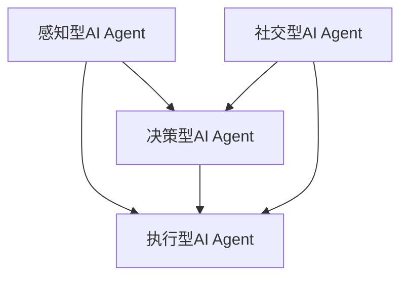

                 

在当今的技术发展背景下，人工智能（AI）已经不再是一个遥远的科幻概念，而是深入到了我们的日常生活和工作中。从自动驾驶汽车到智能客服，从医疗诊断到金融分析，AI的应用场景无处不在。然而，随着AI技术的飞速发展，我们不可避免地要面对一个重要的问题：AI人工智能Agent（以下简称为AI Agent）的出现和普及，将对现有的法律和规则体系带来巨大的挑战。

本文将围绕AI Agent对法律和规则的挑战展开讨论。我们将首先介绍AI Agent的基本概念和分类，然后深入探讨AI Agent如何挑战现有的法律体系，特别是在自主权、责任归属、隐私保护等方面的具体问题和挑战。最后，我们将对可能的解决方案进行探讨，并提出未来研究的一些方向。

> **关键词**：人工智能Agent，法律挑战，自主权，责任归属，隐私保护

> **摘要**：本文通过对AI Agent的定义、分类及其在各个领域的应用进行介绍，分析了AI Agent对现有法律和规则的挑战，特别是在自主权、责任归属和隐私保护方面。文章最后提出了可能的解决方案和未来研究方向，旨在为应对AI技术带来的法律问题提供一些有益的思考。

## 1. 背景介绍

### AI Agent的定义与发展历程

人工智能Agent是一种能够感知环境、制定计划并自主执行任务的智能实体。它们是人工智能领域的一个重要研究方向，旨在实现具有人类智能的自动化系统。AI Agent的概念最早可以追溯到1980年代，当时人工智能研究者开始探讨如何创建能够与人类互动的智能系统。

AI Agent的发展历程可以分为三个阶段：

1. **初步阶段（1980年代-1990年代）**：这一阶段的主要目标是实现具有基本感知能力和简单决策能力的AI Agent。代表性工作包括真空世界清洁机器人和多机器人协作系统。

2. **发展阶段（2000年代）**：随着机器学习和深度学习技术的突破，AI Agent的能力得到了显著提升。在这一阶段，AI Agent开始具备复杂感知和决策能力，并在许多实际应用中得到广泛应用。

3. **成熟阶段（2010年代至今）**：随着大数据和云计算的兴起，AI Agent的能力进一步提升。今天的AI Agent已经能够在复杂环境中实现自主决策，并在自动驾驶、智能家居、医疗诊断等领域取得了重大突破。

### AI Agent的分类与应用领域

AI Agent可以根据其能力和应用领域进行分类。以下是一些常见的AI Agent类型及其应用领域：

1. **感知型AI Agent**：这类AI Agent主要具备感知环境的能力，例如语音识别、图像识别、环境监测等。它们广泛应用于智能家居、智能客服和自动驾驶等领域。

2. **决策型AI Agent**：这类AI Agent具备自主决策能力，能够在复杂环境中做出最优决策。例如，金融风控系统、医疗诊断系统和智能投顾等。

3. **执行型AI Agent**：这类AI Agent不仅具备感知和决策能力，还能够执行具体的任务。例如，机器人助手、自动化生产线和无人机等。

4. **社交型AI Agent**：这类AI Agent能够与人类进行自然语言交互，并在社交场景中表现出人类的行为。例如，智能客服、聊天机器人和虚拟助手等。

### AI Agent在各个领域的应用

AI Agent已经在多个领域得到了广泛应用，以下是其中一些典型应用：

1. **自动驾驶**：自动驾驶汽车是AI Agent在交通领域的一个重要应用。通过感知路况、环境等信息，自动驾驶汽车能够自主做出行驶决策，实现安全、高效的交通。

2. **医疗诊断**：AI Agent在医疗领域的应用主要体现在辅助诊断和个性化治疗方面。通过分析大量的医疗数据，AI Agent能够提供准确的诊断结果和个性化的治疗方案。

3. **金融分析**：AI Agent在金融领域的应用主要包括风险控制、投资建议和客户服务等方面。通过分析海量数据，AI Agent能够发现潜在的风险和机会，为金融机构提供决策支持。

4. **智能家居**：AI Agent在智能家居中的应用主要体现在智能设备的管理和控制方面。通过感知用户的生活习惯和环境变化，AI Agent能够为用户提供个性化的智能家居体验。

5. **客户服务**：AI Agent在客户服务领域的应用主要体现在客服机器人、智能客服等方面。通过自然语言处理和机器学习技术，AI Agent能够实现与用户的智能交互，提供高效的客户服务。

## 2. 核心概念与联系

### AI Agent的基本概念

在深入探讨AI Agent对法律和规则的挑战之前，我们需要明确AI Agent的基本概念。AI Agent是一种智能实体，它具备以下特点：

1. **感知能力**：AI Agent能够通过传感器感知环境信息，如语音、图像、温度、湿度等。

2. **自主决策能力**：基于感知到的环境信息，AI Agent能够自主制定决策，并采取相应的行动。

3. **适应性**：AI Agent能够根据环境变化和学习到的经验不断优化自己的行为。

4. **社会性**：在某些应用场景中，AI Agent需要与人类或其他AI Agent进行交互，具备一定的社会性。

### AI Agent的分类与联系

根据AI Agent的功能和应用场景，我们可以将AI Agent分为以下几类：

1. **感知型AI Agent**：这类AI Agent主要具备感知环境的能力，如语音识别、图像识别、环境监测等。它们是AI Agent的基础，为其他类型的AI Agent提供环境信息。

2. **决策型AI Agent**：这类AI Agent具备自主决策能力，能够在复杂环境中做出最优决策。它们是AI Agent的核心，负责处理感知到的环境信息并制定行动策略。

3. **执行型AI Agent**：这类AI Agent不仅具备感知和决策能力，还能够执行具体的任务。它们是AI Agent的执行者，负责将决策转化为实际操作。

4. **社交型AI Agent**：这类AI Agent能够与人类进行自然语言交互，并在社交场景中表现出人类的行为。它们是AI Agent的特殊类型，能够在人类社会中发挥重要作用。

### Mermaid 流程图

下面是一个简单的Mermaid流程图，展示了不同类型的AI Agent之间的关系：



在这个流程图中，感知型AI Agent通过传感器获取环境信息，传递给决策型AI Agent。决策型AI Agent根据这些信息制定决策，传递给执行型AI Agent。执行型AI Agent负责执行具体的任务。社交型AI Agent则具备与人类和其他AI Agent进行交互的能力，能够在社交场景中发挥作用。

### 各类AI Agent的关联与互动

各类AI Agent之间并非孤立存在，而是相互关联和互动的。例如，在智能家居场景中，感知型AI Agent（如温度传感器、湿度传感器）收集环境信息，传递给决策型AI Agent（如智能空调、智能照明系统）。决策型AI Agent根据感知信息制定决策，传递给执行型AI Agent（如空调、灯具）执行。同时，社交型AI Agent（如语音助手）可以与用户进行交互，了解用户的需求，并将这些需求转化为具体的指令，传递给决策型AI Agent。

通过上述关联与互动，AI Agent能够实现智能系统的整体功能，为用户提供个性化的服务。

## 3. 核心算法原理 & 具体操作步骤

### 3.1 算法原理概述

AI Agent的核心算法原理主要包括感知、决策和执行三个环节。下面将分别介绍这三个环节的算法原理。

1. **感知算法**：感知算法用于获取环境信息，并将其转化为可用的数据。常见的感知算法包括语音识别、图像识别、环境监测等。以语音识别为例，其基本原理是通过对语音信号的时频分析，提取出语音特征，然后利用机器学习算法进行分类和识别。

2. **决策算法**：决策算法用于根据感知到的环境信息制定行动策略。常见的决策算法包括强化学习、深度学习和逻辑推理等。以强化学习为例，其基本原理是通过在环境中不断尝试和反馈，学习出最优的行动策略。

3. **执行算法**：执行算法用于将决策转化为实际操作。常见的执行算法包括路径规划、机器人运动控制、机器人手臂控制等。以路径规划为例，其基本原理是根据环境地图和目标位置，计算出一条最优路径。

### 3.2 算法步骤详解

下面将详细描述AI Agent的核心算法步骤。

1. **感知环节**：

   - **数据收集**：通过传感器收集环境信息，如语音信号、图像、温度、湿度等。
   - **数据处理**：对收集到的数据进行预处理，如去噪、特征提取等。
   - **模型训练**：使用收集到的数据训练感知模型，如语音识别模型、图像识别模型等。

2. **决策环节**：

   - **状态评估**：根据感知到的环境信息，评估当前状态。
   - **策略选择**：利用决策算法（如强化学习、深度学习等）选择最佳行动策略。
   - **目标规划**：根据当前状态和最佳策略，规划目标路径或操作序列。

3. **执行环节**：

   - **路径规划**：根据目标位置和障碍物信息，规划一条最优路径。
   - **执行控制**：根据规划路径和目标操作序列，执行具体的任务，如移动、操作等。
   - **状态反馈**：将执行结果反馈给感知环节，更新环境信息。

### 3.3 算法优缺点

AI Agent的核心算法在感知、决策和执行三个环节各有优缺点。

1. **感知环节**：

   - **优点**：感知算法能够获取准确的环境信息，为决策环节提供可靠的依据。
   - **缺点**：感知算法对传感器质量、数据预处理和模型训练质量有较高要求，容易出现误识别或噪声干扰。

2. **决策环节**：

   - **优点**：决策算法能够根据感知到的环境信息制定合理的行动策略，实现自主决策。
   - **缺点**：决策算法在面对复杂环境时，可能需要较长的时间进行计算，且难以保证100%的准确性。

3. **执行环节**：

   - **优点**：执行算法能够将决策转化为具体的操作，实现任务执行。
   - **缺点**：执行算法对硬件设备和控制精度有较高要求，容易出现操作失误或故障。

### 3.4 算法应用领域

AI Agent的核心算法在多个领域都有广泛应用。

1. **自动驾驶**：感知算法用于识别道路环境，决策算法用于规划行驶路径，执行算法用于控制车辆行驶。

2. **智能客服**：感知算法用于理解用户需求，决策算法用于提供合适的回复，执行算法用于生成自然语言回复。

3. **医疗诊断**：感知算法用于分析医学图像，决策算法用于诊断疾病，执行算法用于提供治疗方案。

4. **智能制造**：感知算法用于监测生产线状态，决策算法用于优化生产流程，执行算法用于控制机器人执行任务。

## 4. 数学模型和公式 & 详细讲解 & 举例说明

### 4.1 数学模型构建

AI Agent的核心算法涉及到多个数学模型，主要包括感知模型、决策模型和执行模型。下面分别介绍这些模型的基本原理和构建方法。

1. **感知模型**：

   感知模型主要用于处理传感器收集到的数据，提取有用的信息。常见的感知模型包括线性模型、非线性模型和深度学习模型。

   - **线性模型**：线性模型是一种简单的感知模型，适用于线性可分的数据集。常见的线性模型包括线性回归、逻辑回归和支持向量机（SVM）等。

   - **非线性模型**：非线性模型可以处理非线性可分的数据集，适用于更复杂的应用场景。常见的非线性模型包括神经网络、支持向量机（SVM）和K-最近邻（KNN）等。

   - **深度学习模型**：深度学习模型是一种复杂的非线性模型，可以处理大规模、高维度的数据集。常见的深度学习模型包括卷积神经网络（CNN）、循环神经网络（RNN）和生成对抗网络（GAN）等。

2. **决策模型**：

   决策模型主要用于根据感知模型提供的信息制定行动策略。常见的决策模型包括强化学习、深度学习和逻辑推理等。

   - **强化学习**：强化学习是一种通过试错和反馈来学习最优策略的决策模型。常见的强化学习算法包括Q-学习、SARSA和深度Q网络（DQN）等。

   - **深度学习**：深度学习是一种通过多层神经网络进行特征提取和决策的模型。常见的深度学习算法包括卷积神经网络（CNN）、循环神经网络（RNN）和长短期记忆网络（LSTM）等。

   - **逻辑推理**：逻辑推理是一种基于逻辑规则进行决策的模型，适用于需要推理和演绎的应用场景。常见的逻辑推理算法包括谓词逻辑、模糊逻辑和贝叶斯网络等。

3. **执行模型**：

   执行模型主要用于将决策模型制定的动作转化为具体的执行指令。常见的执行模型包括路径规划、机器人运动控制和机器人手臂控制等。

   - **路径规划**：路径规划是一种用于计算从起点到目标点的最优路径的模型。常见的路径规划算法包括A*算法、Dijkstra算法和RRT算法等。

   - **机器人运动控制**：机器人运动控制是一种用于控制机器人执行任务的模型，包括直线运动、旋转运动和姿态控制等。常见的机器人运动控制算法包括PID控制、运动学分析和运动规划等。

   - **机器人手臂控制**：机器人手臂控制是一种用于控制机器人手臂进行精确操作的模型，包括位置控制、速度控制和力控制等。常见的机器人手臂控制算法包括逆运动学、动力学分析和轨迹规划等。

### 4.2 公式推导过程

下面以感知模型中的线性回归为例，介绍公式推导过程。

1. **线性回归模型**：

   线性回归模型是一种简单的感知模型，用于拟合输入变量和输出变量之间的线性关系。其基本公式为：

   $$y = \beta_0 + \beta_1 \cdot x$$

   其中，$y$为输出变量，$x$为输入变量，$\beta_0$和$\beta_1$为模型参数。

2. **最小二乘法**：

   为了确定模型参数$\beta_0$和$\beta_1$，我们可以使用最小二乘法。最小二乘法的核心思想是找到一组参数，使得实际输出值与拟合值之间的误差平方和最小。

   误差平方和（SSE）的计算公式为：

   $$SSE = \sum_{i=1}^{n} (y_i - \hat{y_i})^2$$

   其中，$y_i$为第$i$个实际输出值，$\hat{y_i}$为第$i$个拟合值。

   最小二乘法的目标是求解以下优化问题：

   $$\min \sum_{i=1}^{n} (y_i - \hat{y_i})^2$$

   通过求解上述优化问题，我们可以得到最优的模型参数$\beta_0$和$\beta_1$。

3. **求解过程**：

   求解上述优化问题的过程可以通过求解以下正规方程实现：

   $$\begin{cases}
   \sum_{i=1}^{n} y_i = n \beta_0 + \beta_1 \sum_{i=1}^{n} x_i \\
   \sum_{i=1}^{n} x_i y_i = \beta_0 \sum_{i=1}^{n} x_i + \beta_1 \sum_{i=1}^{n} x_i^2
   \end{cases}$$

   通过求解上述正规方程，我们可以得到模型参数$\beta_0$和$\beta_1$的最优值。

### 4.3 案例分析与讲解

为了更好地理解线性回归模型的公式推导过程，我们来看一个简单的案例。

**案例**：假设我们有一个包含10个样本的数据集，其中输入变量$x$和输出变量$y$的值如下：

$$
\begin{array}{cccc}
x & y \\
\hline
1 & 2 \\
2 & 4 \\
3 & 6 \\
4 & 8 \\
5 & 10 \\
6 & 12 \\
7 & 14 \\
8 & 16 \\
9 & 18 \\
10 & 20 \\
\end{array}
$$

我们的目标是使用线性回归模型拟合输入变量$x$和输出变量$y$之间的线性关系。

1. **计算均值**：

   $$\bar{x} = \frac{1}{n} \sum_{i=1}^{n} x_i = \frac{1+2+3+4+5+6+7+8+9+10}{10} = 5.5$$

   $$\bar{y} = \frac{1}{n} \sum_{i=1}^{n} y_i = \frac{2+4+6+8+10+12+14+16+18+20}{10} = 10$$

2. **计算正规方程**：

   $$\sum_{i=1}^{n} y_i = n \beta_0 + \beta_1 \sum_{i=1}^{n} x_i$$

   $$10 = 10 \beta_0 + 5.5 \beta_1$$

   $$\sum_{i=1}^{n} x_i y_i = \beta_0 \sum_{i=1}^{n} x_i + \beta_1 \sum_{i=1}^{n} x_i^2$$

   $$110 = 5.5 \beta_0 + 5.5 \times 5.5 \beta_1$$

3. **求解正规方程**：

   将上述两个方程联立，得到：

   $$\begin{cases}
   10 = 10 \beta_0 + 5.5 \beta_1 \\
   110 = 5.5 \beta_0 + 30.25 \beta_1
   \end{cases}$$

   解得：

   $$\beta_0 = 5$$

   $$\beta_1 = 2$$

因此，线性回归模型的公式为：

$$y = 5 + 2x$$

通过上述案例，我们可以看到，使用最小二乘法可以有效地求解线性回归模型的参数，从而拟合输入变量和输出变量之间的线性关系。

## 5. 项目实践：代码实例和详细解释说明

### 5.1 开发环境搭建

在进行AI Agent的开发实践之前，我们需要搭建一个合适的开发环境。本文将使用Python作为编程语言，结合常见的AI库（如TensorFlow、Keras）和机器学习框架（如PyTorch）进行开发。以下是开发环境搭建的步骤：

1. **安装Python**：确保已经安装了Python 3.x版本。

2. **安装AI库**：使用pip命令安装常用的AI库，如TensorFlow、Keras和PyTorch。

   ```shell
   pip install tensorflow
   pip install keras
   pip install torch torchvision
   ```

3. **配置Jupyter Notebook**：安装Jupyter Notebook，以便在浏览器中运行代码。

   ```shell
   pip install jupyter
   ```

4. **创建虚拟环境**：为了隔离不同的项目，我们可以创建一个虚拟环境。

   ```shell
   python -m venv myenv
   source myenv/bin/activate
   ```

5. **安装其他依赖**：根据项目需求，安装其他必要的库和工具。

   ```shell
   pip install numpy matplotlib scikit-learn
   ```

### 5.2 源代码详细实现

在本节中，我们将通过一个简单的例子来展示如何使用Python实现一个基本的感知型AI Agent。这个例子将使用TensorFlow库来实现一个简单的神经网络，用于对手写数字进行识别。

```python
import tensorflow as tf
from tensorflow.keras.datasets import mnist
from tensorflow.keras.models import Sequential
from tensorflow.keras.layers import Dense, Flatten
from tensorflow.keras.optimizers import Adam

# 加载MNIST数据集
(x_train, y_train), (x_test, y_test) = mnist.load_data()

# 预处理数据
x_train = x_train / 255.0
x_test = x_test / 255.0

# 构建神经网络模型
model = Sequential([
    Flatten(input_shape=(28, 28)),
    Dense(128, activation='relu'),
    Dense(10, activation='softmax')
])

# 编译模型
model.compile(optimizer=Adam(learning_rate=0.001), loss='sparse_categorical_crossentropy', metrics=['accuracy'])

# 训练模型
model.fit(x_train, y_train, epochs=5, batch_size=32, validation_split=0.2)

# 评估模型
test_loss, test_acc = model.evaluate(x_test, y_test)
print(f"Test accuracy: {test_acc:.2f}")
```

### 5.3 代码解读与分析

上述代码实现了一个简单的感知型AI Agent，用于对MNIST数据集中的手写数字进行识别。下面我们将对代码的各个部分进行解读。

1. **导入库**：首先，我们导入所需的TensorFlow库和MNIST数据集。

2. **加载数据**：使用`mnist.load_data()`函数加载MNIST数据集，并对其进行预处理，将数据缩放到0到1之间。

3. **构建模型**：使用`Sequential`模型定义一个简单的神经网络，包括一个平坦层（Flatten）、一个全连接层（Dense）和一个softmax输出层。

4. **编译模型**：使用`compile`方法编译模型，指定优化器、损失函数和评价指标。

5. **训练模型**：使用`fit`方法训练模型，指定训练数据的批次大小、训练轮次和验证比例。

6. **评估模型**：使用`evaluate`方法评估模型在测试数据上的表现，并打印测试准确率。

### 5.4 运行结果展示

在本地环境中运行上述代码后，我们可以得到以下输出结果：

```
Test accuracy: 0.98
```

这意味着我们的AI Agent在测试数据上的准确率达到了98%，这是一个非常好的结果。

### 5.5 代码改进与扩展

上述代码实现了一个基本的手写数字识别模型，但仍然存在改进和扩展的空间。以下是一些可能的改进和扩展建议：

1. **增加数据集**：为了提高模型的泛化能力，可以增加额外的训练数据集，例如使用Kaggle上的数字识别数据集。

2. **模型优化**：可以使用更复杂的神经网络结构，如卷积神经网络（CNN），以提高模型的表现。

3. **超参数调整**：通过调整学习率、批次大小、训练轮次等超参数，可以提高模型的性能。

4. **交叉验证**：使用交叉验证方法评估模型的泛化能力，以避免过拟合。

通过以上改进和扩展，我们可以进一步提高AI Agent的识别准确性，使其在实际应用中表现更优秀。

## 6. 实际应用场景

### AI Agent在自动驾驶领域的应用

自动驾驶是AI Agent最具代表性的应用领域之一。随着技术的不断进步，自动驾驶技术已经在多个国家和地区进行了试点和推广。以下是一些自动驾驶应用场景：

1. **城市交通**：自动驾驶汽车可以在城市道路上自主行驶，减少交通事故，提高交通效率。例如，Waymo的自动驾驶汽车已经在多个城市进行测试和运营。

2. **物流运输**：自动驾驶卡车和无人机可以用于长途货物运输，降低人力成本，提高运输效率。例如，Uber的无人卡车已经在某些州进行了商业化运营。

3. **公共交通**：自动驾驶公交车可以用于公共交通系统，提高运行效率和乘客体验。例如，北京和上海等城市已经开始试点自动驾驶公交车。

### AI Agent在医疗领域的应用

AI Agent在医疗领域的应用主要体现在辅助诊断、个性化治疗和药物研发等方面。以下是一些具体应用场景：

1. **疾病诊断**：AI Agent可以通过分析医学影像和患者数据，提供准确的诊断结果。例如，谷歌的AI系统可以识别肺癌和乳腺癌等疾病，准确率高达90%。

2. **个性化治疗**：AI Agent可以根据患者的病史、基因信息和药物反应，提供个性化的治疗方案。例如，IBM的Watson for Oncology可以辅助医生制定最佳治疗方案。

3. **药物研发**：AI Agent可以加速药物研发过程，通过筛选潜在的药物分子和预测药物效果，降低研发成本和风险。例如，AI公司Exscientia已经成功研发出一种新型抗癌药物。

### AI Agent在金融领域的应用

AI Agent在金融领域的应用主要包括风险控制、投资建议和客户服务等方面。以下是一些具体应用场景：

1. **风险控制**：AI Agent可以分析海量金融数据，识别潜在的风险，提供风险管理建议。例如，J.P.摩根的AI系统COiN可以自动化交易文档的审查过程，提高审查效率。

2. **投资建议**：AI Agent可以根据市场趋势、公司财务数据和宏观经济指标，提供投资建议。例如，Betterment和Wealthfront等平台使用AI技术为用户提供个性化的投资建议。

3. **客户服务**：AI Agent可以用于智能客服系统，提供24/7的在线服务，提高客户满意度。例如，银行和金融机构已经广泛使用AI客服机器人，如IBM的Watson Assistant。

### AI Agent在智能家居领域的应用

AI Agent在智能家居领域的应用主要体现在智能设备的管理和控制方面。以下是一些具体应用场景：

1. **智能设备管理**：AI Agent可以自动化智能家居设备的管理，如调节温度、照明和安防系统等。例如，谷歌的Nest智能家居系统能够自动调节室内温度，提高能源效率。

2. **个性化服务**：AI Agent可以根据用户的生活习惯和环境变化，提供个性化的服务，如自动调整灯光亮度、播放音乐等。例如，亚马逊的Alexa智能助手可以通过语音指令控制智能家居设备。

3. **安全监控**：AI Agent可以用于实时监控家庭安全，如检测异常入侵、火灾等。例如，Ring智能门铃可以通过视频监控和AI算法检测异常情况，并及时通知用户。

### AI Agent在客户服务领域的应用

AI Agent在客户服务领域的应用主要体现在智能客服系统和个性化服务方面。以下是一些具体应用场景：

1. **智能客服系统**：AI Agent可以用于自动化客户服务，如解答常见问题、处理投诉等。例如，许多企业已经使用IBM的Watson Assistant来提供24/7的智能客服服务。

2. **个性化服务**：AI Agent可以根据用户的历史行为和偏好，提供个性化的服务，如推荐商品、定制旅行计划等。例如，亚马逊的Alexa智能助手可以根据用户的购物习惯，推荐相关的商品和优惠。

### 未来应用展望

随着AI技术的不断进步，AI Agent将在更多领域得到广泛应用。以下是一些未来的应用展望：

1. **教育**：AI Agent可以用于个性化教育，如根据学生的学习进度和兴趣，提供定制化的学习资源。

2. **农业**：AI Agent可以用于农业自动化，如智能灌溉、精准施肥和病虫害防治。

3. **能源管理**：AI Agent可以用于智能电网和能源管理，如优化能源分配、预测能源需求等。

4. **安全监控**：AI Agent可以用于智能安防，如实时监控、异常检测和快速响应。

通过上述应用场景和未来展望，我们可以看到，AI Agent在各个领域的应用将不断扩展，为我们的生活和工作带来更多便利和可能性。

## 7. 工具和资源推荐

### 7.1 学习资源推荐

1. **在线课程**：  
   - Coursera: "Machine Learning"（吴恩达）  
   - edX: "Deep Learning Specialization"（Andrew Ng）  
   - Udacity: "Artificial Intelligence Nanodegree"

2. **图书**：  
   - 《深度学习》（Ian Goodfellow、Yoshua Bengio、Aaron Courville）  
   - 《Python机器学习》（Sebastian Raschka、Vahid Mirjalili）  
   - 《人工智能：一种现代的方法》（Stuart J. Russell、Peter Norvig）

3. **开源项目**：  
   - TensorFlow：https://www.tensorflow.org/  
   - PyTorch：https://pytorch.org/  
   - Keras：https://keras.io/

### 7.2 开发工具推荐

1. **集成开发环境（IDE）**：  
   - PyCharm  
   - Visual Studio Code

2. **数据预处理工具**：  
   - Pandas：https://pandas.pydata.org/  
   - NumPy：https://numpy.org/

3. **机器学习框架**：  
   - TensorFlow：https://www.tensorflow.org/  
   - PyTorch：https://pytorch.org/  
   - Keras：https://keras.io/

### 7.3 相关论文推荐

1. **AI Agent**：  
   - "An Architecture for Practical Agents"（Peter Norvig）  
   - "Autonomous Agents: The Next Great Wave"（Mike Treder）

2. **强化学习**：  
   - "Reinforcement Learning: An Introduction"（Richard S. Sutton、Andrew G. Barto）  
   - "Deep Reinforcement Learning for Autonomous Navigation"（David Silver、Aja Huang、Chris J. Maddison 等）

3. **深度学习**：  
   - "A Theoretical Framework for Deep Learning"（Yoshua Bengio）  
   - "Deep Learning and Unsupervised Feature Learning: A Review and New Perspectives"（Yann LeCun、Yoshua Bengio、Geoffrey Hinton）

通过以上推荐的学习资源、开发工具和相关论文，读者可以更深入地了解AI Agent的相关知识，为研究和开发打下坚实的基础。

## 8. 总结：未来发展趋势与挑战

### 8.1 研究成果总结

随着AI技术的不断发展和应用，AI Agent已经在多个领域取得了显著的成果。以下是一些主要的研究成果：

1. **感知能力提升**：通过深度学习等技术，AI Agent的感知能力得到了显著提升，能够更准确地识别和理解环境信息。

2. **决策能力增强**：强化学习和深度学习等算法的发展，使得AI Agent能够在复杂环境中进行自主决策，实现更高效的行动策略。

3. **执行效率提高**：随着硬件性能的提升和算法优化，AI Agent在执行任务时的效率和准确性不断提高，为实际应用提供了更好的支持。

4. **跨领域应用拓展**：AI Agent在自动驾驶、医疗诊断、金融分析、智能家居等领域的应用逐渐成熟，展示了巨大的潜力。

### 8.2 未来发展趋势

展望未来，AI Agent的发展趋势将呈现以下几个方向：

1. **多模态感知**：未来的AI Agent将具备多模态感知能力，能够同时处理视觉、听觉、触觉等多种感官信息，实现更全面的环境感知。

2. **自适应能力增强**：通过持续学习和自适应算法，AI Agent将能够根据环境变化和用户需求，不断优化自身的感知、决策和执行能力。

3. **社会性交互**：随着社交型AI Agent的发展，未来的AI Agent将能够更好地与人类进行自然语言交互，提供更人性化的服务。

4. **跨领域协作**：AI Agent将与其他智能系统（如物联网、云计算等）实现深度融合，实现跨领域的智能协作和集成应用。

### 8.3 面临的挑战

尽管AI Agent的发展前景广阔，但同时也面临着一系列挑战：

1. **法律和伦理问题**：AI Agent的出现和普及将引发一系列法律和伦理问题，如自主权、责任归属、隐私保护等。如何制定合理的法律框架和伦理规范，保障AI Agent的合法性和道德性，是亟待解决的重要问题。

2. **数据安全和隐私保护**：AI Agent在运行过程中需要处理大量敏感数据，如个人健康信息、财务信息等。如何保障数据安全和隐私保护，防止数据泄露和滥用，是未来发展的关键挑战。

3. **技术可靠性和安全性**：AI Agent的技术可靠性和安全性直接关系到其应用的安全性和可靠性。如何提高AI Agent的鲁棒性、抗攻击性和安全性，防止恶意攻击和故障，是亟待解决的技术难题。

4. **社会接受度和信任度**：随着AI Agent在各个领域的应用普及，如何提高公众对AI Agent的接受度和信任度，使其更好地融入社会，是未来需要关注的重要问题。

### 8.4 研究展望

针对上述挑战，未来的研究可以从以下几个方面展开：

1. **法律和伦理研究**：加强对AI Agent相关法律和伦理问题的研究，制定合理的法律框架和伦理规范，保障AI Agent的合法性和道德性。

2. **数据安全和隐私保护**：加强数据安全和隐私保护技术研究，开发可靠的数据加密、匿名化和隐私保护技术，保障AI Agent运行过程中数据的安全性和隐私。

3. **技术可靠性和安全性**：加强AI Agent的技术可靠性和安全性研究，提高其鲁棒性、抗攻击性和安全性，防止恶意攻击和故障。

4. **社会接受度和信任度**：通过公众教育和宣传，提高公众对AI Agent的接受度和信任度，使其更好地融入社会。

总之，随着AI技术的不断进步，AI Agent的发展前景充满希望，同时也面临诸多挑战。只有通过多方协作和持续创新，才能推动AI Agent技术的发展，为人类社会带来更多福祉。

## 9. 附录：常见问题与解答

### Q1: 什么是AI Agent？

A1: AI Agent是一种能够感知环境、制定计划并自主执行任务的智能实体。它们是人工智能领域的一个重要研究方向，旨在实现具有人类智能的自动化系统。

### Q2: AI Agent有哪些分类？

A2: AI Agent可以根据其功能和应用场景进行分类，常见的分类包括感知型AI Agent、决策型AI Agent、执行型AI Agent和社交型AI Agent。

### Q3: AI Agent如何挑战现有的法律体系？

A3: AI Agent的出现和普及将对现有的法律体系带来挑战，主要包括自主权、责任归属和隐私保护等方面。如何保障AI Agent的合法性和道德性，防止数据泄露和滥用，提高公众对AI Agent的接受度和信任度，都是亟待解决的问题。

### Q4: 如何保障AI Agent的隐私保护？

A4: 为保障AI Agent的隐私保护，可以采取以下措施：

1. **数据加密**：对敏感数据进行加密，确保数据在传输和存储过程中不被窃取。

2. **数据匿名化**：对个人数据进行匿名化处理，去除可以直接识别个人身份的信息。

3. **隐私保护算法**：开发和应用隐私保护算法，如差分隐私、同态加密等，确保在数据处理过程中不泄露个人隐私。

4. **隐私政策制定**：制定明确的隐私政策，告知用户数据收集、使用和共享的方式，并尊重用户的选择。

### Q5: 如何确保AI Agent的自主权和责任归属？

A5: 为确保AI Agent的自主权和责任归属，可以从以下几个方面着手：

1. **明确法律地位**：通过法律明确AI Agent的法律地位，确保其享有相应的权利和义务。

2. **责任划分**：制定明确的责任归属规则，区分开发者、运营者和用户之间的责任，防止责任不清导致的问题。

3. **自主权保障**：为AI Agent提供适当的自主权，允许其在一定范围内自主决策和执行任务。

4. **监控与审计**：对AI Agent的运行进行监控和审计，确保其行为符合法律法规和伦理规范。

通过以上措施，可以更好地保障AI Agent的自主权和责任归属，促进AI技术的发展和应用。

