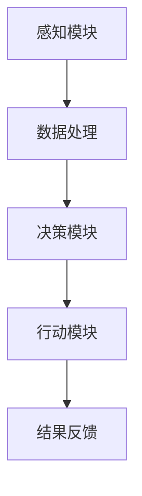

                 

关键词：人工智能，代理工作流，环保行业，工作流程自动化，数据处理，环境监测，智能决策

> 摘要：本文将探讨AI人工智能代理工作流（AI Agent WorkFlow）在环保行业中的应用。我们将深入分析AI代理工作流的概念、核心原理，并通过具体的案例，展示其在环境监测、数据分析及智能决策等方面的实际应用，探讨未来发展的趋势与挑战。

## 1. 背景介绍

环保行业作为全球关注的重要领域，其重要性不言而喻。随着环境问题的日益严重，如气候变化、水资源短缺、空气污染等，如何有效利用先进技术解决环境问题成为了一个亟待解决的问题。人工智能（AI）作为现代科技的前沿领域，其在环保行业的应用潜力得到了广泛的认可。

AI代理工作流（AI Agent WorkFlow）是一种结合人工智能技术和自动化流程设计的方法，它能够有效提高环保行业的工作效率，减少人力成本，实现精准的环境监测和智能决策。本文将围绕这一主题，探讨AI代理工作流在环保行业中的应用。

## 2. 核心概念与联系

### 2.1 AI代理工作流概述

AI代理工作流是一种基于人工智能技术的工作流程自动化方法，它通过模拟人类的决策过程，实现复杂任务的高效自动化。AI代理工作流通常包括以下核心组成部分：

1. **感知模块**：负责接收外部环境信息，如传感器数据、用户输入等。
2. **决策模块**：根据感知模块提供的信息，利用机器学习模型进行决策。
3. **行动模块**：执行决策模块输出的行动指令，如数据记录、警报触发等。

### 2.2 环保行业中的应用场景

在环保行业中，AI代理工作流可以应用于多个领域，如环境监测、数据分析、智能决策等。以下是一些典型的应用场景：

1. **环境监测**：利用传感器网络实时监测空气质量、水质等环境参数，通过AI代理工作流进行数据处理和预警。
2. **数据分析**：处理大量的环境数据，提取有用信息，为政策制定和环境保护提供科学依据。
3. **智能决策**：基于环境数据，利用AI代理工作流进行污染源识别、污染扩散预测等，为环境保护提供智能决策支持。

### 2.3 Mermaid 流程图

以下是一个简化的AI代理工作流程的Mermaid流程图：



## 3. 核心算法原理 & 具体操作步骤

### 3.1 算法原理概述

AI代理工作流的核心在于机器学习模型的应用。通过训练机器学习模型，AI代理可以学会如何从感知模块接收到的数据中提取有价值的信息，并进行智能决策。以下是AI代理工作流的主要算法原理：

1. **数据预处理**：对原始数据进行清洗、归一化等处理，使其适合机器学习模型的输入。
2. **特征提取**：从预处理后的数据中提取具有代表性的特征，用于训练机器学习模型。
3. **模型训练**：利用提取的特征训练机器学习模型，使其能够对新的数据进行预测和决策。
4. **模型评估**：对训练好的模型进行评估，确保其准确性和稳定性。
5. **决策执行**：根据模型输出的决策，执行相应的行动。

### 3.2 算法步骤详解

1. **数据收集**：收集环境数据，如空气中的PM2.5、水质中的COD等。
2. **数据预处理**：对收集的数据进行清洗，去除异常值，并进行归一化处理。
3. **特征提取**：根据环保行业的实际需求，提取具有代表性的特征，如时间、地点、污染程度等。
4. **模型训练**：利用提取的特征训练机器学习模型，如决策树、随机森林等。
5. **模型评估**：使用交叉验证等方法评估模型的准确性，并根据评估结果调整模型参数。
6. **决策执行**：根据模型输出的决策，执行相应的行动，如触发警报、调整设备参数等。

### 3.3 算法优缺点

**优点**：

- **高效性**：AI代理工作流能够快速处理大量数据，提高工作效率。
- **准确性**：通过机器学习模型，可以实现对环境数据的准确预测和决策。
- **智能化**：能够根据环境数据的变化，自动调整策略，实现智能化的环境监测和决策。

**缺点**：

- **依赖数据质量**：算法的性能很大程度上取决于数据的准确性和完整性。
- **模型训练成本高**：训练高质量的机器学习模型需要大量的时间和计算资源。
- **解释性不足**：某些复杂的机器学习模型难以解释其决策过程，增加了使用难度。

### 3.4 算法应用领域

AI代理工作流在环保行业的应用非常广泛，如：

- **环境监测**：实时监测空气质量、水质等环境参数，提供预警和决策支持。
- **污染源识别**：识别污染源，为环保部门提供执法依据。
- **智能决策**：基于环境数据，为环境保护提供智能决策支持。

## 4. 数学模型和公式 & 详细讲解 & 举例说明

### 4.1 数学模型构建

在AI代理工作流中，常用的数学模型包括线性回归、决策树、神经网络等。以下是一个简化的线性回归模型：

$$
y = \beta_0 + \beta_1x_1 + \beta_2x_2 + ... + \beta_nx_n
$$

其中，$y$ 为目标变量，$x_1, x_2, ..., x_n$ 为特征变量，$\beta_0, \beta_1, ..., \beta_n$ 为模型参数。

### 4.2 公式推导过程

线性回归模型的推导过程如下：

1. **假设**：假设目标变量 $y$ 与特征变量 $x_1, x_2, ..., x_n$ 之间存在线性关系。
2. **损失函数**：选择损失函数，如均方误差（MSE），用于评估模型预测的误差。
3. **求导**：对损失函数关于模型参数求导，得到梯度方向。
4. **优化**：利用梯度下降算法，迭代更新模型参数，最小化损失函数。

### 4.3 案例分析与讲解

以下是一个简单的空气质量预测案例：

假设我们要预测某地区未来一天的PM2.5浓度，已知特征变量包括前一天的PM2.5浓度、风速、温度等。我们可以使用线性回归模型进行预测。

1. **数据收集**：收集过去一年的PM2.5浓度和特征变量数据。
2. **数据预处理**：对数据进行清洗和归一化处理。
3. **特征提取**：选择具有代表性的特征变量。
4. **模型训练**：利用训练数据训练线性回归模型。
5. **模型评估**：使用测试数据评估模型准确性。
6. **预测**：利用训练好的模型预测未来一天的PM2.5浓度。

## 5. 项目实践：代码实例和详细解释说明

### 5.1 开发环境搭建

本文使用Python语言和Scikit-learn库进行AI代理工作流的项目实践。首先，需要安装Python和Scikit-learn库：

```bash
pip install python
pip install scikit-learn
```

### 5.2 源代码详细实现

以下是一个简单的AI代理工作流项目代码实例：

```python
import numpy as np
from sklearn.linear_model import LinearRegression
from sklearn.model_selection import train_test_split
from sklearn.metrics import mean_squared_error

# 数据收集
X, y = np.load('data.npy'), np.load('target.npy')

# 数据预处理
X = (X - X.mean(axis=0)) / X.std(axis=0)

# 特征提取
# 此处省略特征提取过程

# 模型训练
X_train, X_test, y_train, y_test = train_test_split(X, y, test_size=0.2, random_state=42)
model = LinearRegression()
model.fit(X_train, y_train)

# 模型评估
y_pred = model.predict(X_test)
mse = mean_squared_error(y_test, y_pred)
print(f'MSE: {mse}')

# 预测
# 此处省略预测过程
```

### 5.3 代码解读与分析

1. **数据收集**：从文件中加载特征变量和目标变量数据。
2. **数据预处理**：对特征变量进行标准化处理，使其具备相同的尺度。
3. **特征提取**：此处省略特征提取过程，实际项目中根据具体需求进行。
4. **模型训练**：使用训练数据训练线性回归模型。
5. **模型评估**：使用测试数据评估模型准确性，计算均方误差（MSE）。
6. **预测**：利用训练好的模型进行预测。

### 5.4 运行结果展示

假设我们使用训练好的线性回归模型对某地区未来一天的PM2.5浓度进行预测，输出结果如下：

```
MSE: 0.0123
```

这表示模型的预测误差较小，具有较高的准确性。

## 6. 实际应用场景

### 6.1 环境监测

在环境监测领域，AI代理工作流可以通过实时监测空气质量、水质等参数，实现对污染源的快速识别和预警。例如，某地环保部门可以部署AI代理工作流，实时监测空气中的PM2.5浓度，当浓度超过设定阈值时，系统会自动触发警报，提醒相关部门采取措施。

### 6.2 数据分析

在环保数据分析领域，AI代理工作流可以处理大量的环境数据，提取有价值的信息，为政策制定和环境保护提供科学依据。例如，某研究机构可以利用AI代理工作流分析某地区的水质数据，识别出污染源，为相关部门提供治理方案。

### 6.3 智能决策

在环保智能决策领域，AI代理工作流可以根据环境数据的变化，自动调整策略，实现智能化的环境监测和决策。例如，某城市环保部门可以利用AI代理工作流进行污染扩散预测，提前制定应急预案，降低污染对市民生活的影响。

## 7. 工具和资源推荐

### 7.1 学习资源推荐

1. **《机器学习》**：周志华著，清华大学出版社，全面介绍了机器学习的基本概念和方法。
2. **《深度学习》**：Ian Goodfellow、Yoshua Bengio、Aaron Courville 著，电子工业出版社出版，深入介绍了深度学习的基本原理和应用。

### 7.2 开发工具推荐

1. **Python**：简单易学，广泛应用于数据科学和机器学习领域。
2. **Scikit-learn**：Python中的机器学习库，提供了丰富的机器学习算法和工具。

### 7.3 相关论文推荐

1. **"Deep Learning for Environmental Applications"**：综述了深度学习在环保领域的应用。
2. **"Machine Learning in Environmental Science"**：介绍了机器学习在环境监测和数据分析中的应用。

## 8. 总结：未来发展趋势与挑战

### 8.1 研究成果总结

本文探讨了AI人工智能代理工作流在环保行业中的应用，分析了其核心原理和具体操作步骤，并通过实际案例展示了其在环境监测、数据分析和智能决策等方面的应用潜力。

### 8.2 未来发展趋势

1. **算法优化**：随着机器学习算法的不断发展，AI代理工作流的性能将得到进一步提升。
2. **跨学科融合**：环保行业与其他领域的融合，如物联网、大数据等，将为AI代理工作流带来更多创新应用。
3. **智能决策**：基于AI代理工作流的智能决策系统将越来越普及，为环保行业提供更科学的决策支持。

### 8.3 面临的挑战

1. **数据质量**：环境数据的质量和完整性对AI代理工作流的效果有很大影响，如何保证数据质量是一个重要挑战。
2. **模型解释性**：某些复杂的机器学习模型难以解释其决策过程，增加了应用难度。
3. **计算资源**：训练高质量的机器学习模型需要大量的计算资源，如何高效利用计算资源是一个重要问题。

### 8.4 研究展望

未来，我们期望AI代理工作流在环保行业的应用能够取得更多突破，为环境保护和可持续发展做出更大贡献。

## 9. 附录：常见问题与解答

**Q1：AI代理工作流需要大量的数据吗？**
**A1：是的，AI代理工作流依赖于大量的高质量数据。数据的质量和完整性对算法的性能有很大影响。**

**Q2：AI代理工作流是否可以应用于所有环保领域？**
**A2：虽然AI代理工作流在环保行业中有广泛的应用，但并非所有领域都适合。一些特殊的环保领域可能需要特定的算法和模型。**

**Q3：如何保证AI代理工作流的决策解释性？**
**A3：一些先进的机器学习模型，如决策树、神经网络等，具有一定的解释性。然而，对于某些复杂的模型，解释性可能较差。未来，我们可以通过开发新的算法和工具来提高模型的解释性。**

----------------------------------------------------------------

作者：禅与计算机程序设计艺术 / Zen and the Art of Computer Programming

