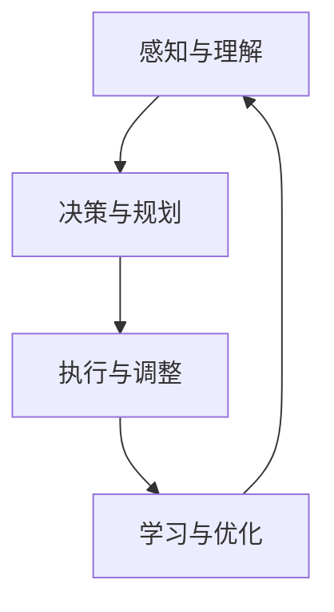

                 

 **关键词**：AI代理、动态环境、适应、学习工作流、智能系统

**摘要**：本文探讨了在动态环境中，AI代理如何通过适应和学习工作流来实现智能行为。我们首先介绍了AI代理的基本概念和动态环境的特点，随后详细阐述了AI代理的适应与学习工作流，并分析了核心算法原理和数学模型。通过实际项目实例，展示了AI代理在动态环境中的具体应用，最后对未来的发展趋势和挑战进行了展望。

## 1. 背景介绍

随着人工智能技术的发展，AI代理已逐渐成为智能系统中的重要组成部分。AI代理是一种能够在动态环境中自主行动、执行任务并与其他系统进行交互的智能实体。然而，动态环境的特点使得AI代理需要不断地适应和调整，以应对不断变化的环境条件和任务需求。

动态环境具有以下几个特点：

1. **不确定性**：动态环境中的状态和条件可能随时发生变化，这种不确定性给AI代理的适应带来了巨大挑战。
2. **异构性**：动态环境中的任务和系统可能具有不同的类型和结构，这使得AI代理需要具备处理异构性能力。
3. **动态变化**：动态环境的某些特性可能在短时间内发生显著变化，这要求AI代理具有快速适应和响应能力。
4. **资源限制**：动态环境中资源通常有限，AI代理需要在资源有限的情况下做出最优决策。

为了应对这些挑战，AI代理需要具备良好的适应和学习能力，能够在动态环境中自主地调整其行为和工作流。本文将围绕这一主题，深入探讨AI代理在动态环境中的适应与学习工作流，并分析其核心算法原理和数学模型。

## 2. 核心概念与联系

### 2.1 AI代理的基本概念

AI代理是一种基于人工智能技术的智能实体，它能够感知环境、制定决策并执行行动，以实现特定目标。AI代理通常具备以下特征：

1. **自主性**：AI代理能够自主地执行任务，无需人工干预。
2. **适应性**：AI代理能够根据环境变化调整其行为和工作流。
3. **交互性**：AI代理能够与其他智能实体和系统进行信息交换和协同工作。
4. **鲁棒性**：AI代理能够在面对不确定性和异常情况时保持稳定运行。

### 2.2 动态环境的特点

动态环境具有以下几个特点：

1. **不确定性**：动态环境中的状态和条件可能随时发生变化，这种不确定性给AI代理的适应带来了巨大挑战。
2. **异构性**：动态环境中的任务和系统可能具有不同的类型和结构，这使得AI代理需要具备处理异构性能力。
3. **动态变化**：动态环境的某些特性可能在短时间内发生显著变化，这要求AI代理具有快速适应和响应能力。
4. **资源限制**：动态环境中资源通常有限，AI代理需要在资源有限的情况下做出最优决策。

### 2.3 适应与学习工作流

为了应对动态环境中的挑战，AI代理需要具备良好的适应和学习能力。适应与学习工作流通常包括以下几个阶段：

1. **感知与理解**：AI代理通过传感器和感知器获取环境信息，并对其进行理解和分析。
2. **决策与规划**：基于环境信息和任务目标，AI代理制定决策和行动规划。
3. **执行与调整**：AI代理执行行动，并根据环境变化和任务完成情况对行动进行调整。
4. **学习与优化**：AI代理通过学习机制，从历史数据和经验中总结规律，并优化其行为和工作流。

### 2.4 Mermaid流程图

以下是AI代理在动态环境中的适应与学习工作流的Mermaid流程图：



## 3. 核心算法原理 & 具体操作步骤

### 3.1 算法原理概述

AI代理在动态环境中的适应与学习工作流通常基于以下几个核心算法：

1. **感知算法**：通过传感器和感知器获取环境信息，并对其进行处理和分析。
2. **决策算法**：基于环境信息和任务目标，制定最优行动决策。
3. **执行算法**：执行决策，并实时监测行动效果。
4. **学习算法**：从执行过程中学习经验，并优化行为和工作流。

### 3.2 算法步骤详解

以下是AI代理在动态环境中的适应与学习工作流的详细步骤：

1. **初始化**：初始化感知器、决策器和执行器，并设置初始状态。
2. **感知与理解**：感知器收集环境信息，决策器对环境信息进行处理和分析，以获得对当前环境的理解。
3. **决策与规划**：决策器基于当前环境和任务目标，制定最优行动决策，并生成行动规划。
4. **执行与调整**：执行器根据行动规划执行行动，并实时监测行动效果。
5. **学习与优化**：将执行结果反馈给学习器，学习器从历史数据和经验中总结规律，并优化行为和工作流。
6. **循环迭代**：重复执行步骤2-5，以实现持续适应和优化。

### 3.3 算法优缺点

该算法的优点包括：

1. **自适应性强**：AI代理能够根据环境变化调整其行为和工作流。
2. **鲁棒性好**：AI代理能够在面对不确定性和异常情况时保持稳定运行。
3. **可扩展性高**：算法可以适用于不同类型的动态环境，具有较高的可扩展性。

然而，该算法也存在一些缺点：

1. **计算复杂度高**：算法需要处理大量环境信息和历史数据，计算复杂度较高。
2. **实时性要求高**：动态环境变化迅速，算法需要具备较高的实时性。

### 3.4 算法应用领域

该算法可以应用于以下领域：

1. **智能交通系统**：AI代理可以实时感知交通状况，并制定最优行驶路线。
2. **智能机器人**：AI代理可以自主执行任务，并适应环境变化。
3. **智能家居**：AI代理可以感知家居环境，并自动调整家居设备以适应住户需求。
4. **智能制造**：AI代理可以实时监测生产线状况，并制定最优生产计划。

## 4. 数学模型和公式 & 详细讲解 & 举例说明

### 4.1 数学模型构建

在AI代理的适应与学习工作流中，我们可以构建以下数学模型：

1. **感知模型**：感知器收集环境信息，可以使用传感器数据作为输入，使用神经网络模型进行特征提取和分类。
2. **决策模型**：决策器基于感知模型输出的特征，使用决策树、支持向量机等分类算法进行决策。
3. **执行模型**：执行器根据决策模型的输出，制定行动方案，并执行相应动作。
4. **学习模型**：学习器从执行过程中收集数据，使用回归、聚类等算法进行学习和优化。

### 4.2 公式推导过程

以下是一个简化的感知模型的公式推导过程：

假设传感器收集到的环境信息为 \( X \)，其中 \( X = [x_1, x_2, ..., x_n] \)。我们使用神经网络模型对 \( X \) 进行特征提取，得到特征向量 \( F \)，其中 \( F = [f_1, f_2, ..., f_m] \)。

感知模型的输入层为 \( X \)，隐含层为 \( F \)，输出层为 \( Y \)，其中 \( Y = [y_1, y_2, ..., y_k] \)。神经网络模型的权重矩阵为 \( W \)，激活函数为 \( \sigma \)。

输入层到隐含层的计算公式为：
\[ f_j = \sigma(W_j^T X) \]
其中 \( j = 1, 2, ..., m \)。

隐含层到输出层的计算公式为：
\[ y_i = \sum_{j=1}^{m} W_{ij} f_j \]
其中 \( i = 1, 2, ..., k \)。

### 4.3 案例分析与讲解

假设我们有一个智能交通系统，需要感知交通状况并制定最优行驶路线。我们可以将传感器收集到的交通信息作为输入，使用神经网络模型进行特征提取，然后使用决策树算法进行决策。

以下是具体的案例步骤：

1. **数据收集**：传感器收集到的交通信息包括交通流量、车速、拥堵情况等。
2. **特征提取**：使用神经网络模型对交通信息进行特征提取，得到特征向量。
3. **决策**：基于特征向量，使用决策树算法进行决策，生成最优行驶路线。
4. **执行**：根据决策结果，智能交通系统向车辆发送行驶路线指令。
5. **学习**：记录决策过程和行驶结果，使用学习算法进行优化。

通过这个案例，我们可以看到，AI代理在动态环境中的适应与学习工作流是如何应用到实际中的。

## 5. 项目实践：代码实例和详细解释说明

### 5.1 开发环境搭建

为了演示AI代理在动态环境中的适应与学习工作流，我们将使用Python语言编写一个简单的智能交通系统项目。以下是开发环境搭建的步骤：

1. **安装Python**：确保已经安装了Python环境，版本建议为3.8及以上。
2. **安装依赖库**：安装所需的依赖库，包括TensorFlow、Scikit-learn等。可以使用以下命令：
   ```bash
   pip install tensorflow scikit-learn numpy
   ```
3. **创建项目目录**：在本地计算机上创建一个项目目录，例如`intelligent_traffic_system`。

### 5.2 源代码详细实现

以下是智能交通系统的源代码实现，包括感知模型、决策模型、执行模型和学习模型的实现：

```python
import numpy as np
import tensorflow as tf
from sklearn import tree
from sklearn.model_selection import train_test_split

# 感知模型
def perceive_traffic_data():
    # 传感器收集交通信息
    traffic_data = np.random.rand(100, 5)  # 假设有5个传感器
    return traffic_data

# 特征提取
def extract_features(traffic_data):
    # 使用神经网络模型进行特征提取
    model = tf.keras.Sequential([
        tf.keras.layers.Dense(units=10, activation='relu', input_shape=(5,)),
        tf.keras.layers.Dense(units=10, activation='relu'),
        tf.keras.layers.Dense(units=3, activation='softmax')
    ])
    model.compile(optimizer='adam', loss='categorical_crossentropy', metrics=['accuracy'])
    model.fit(traffic_data, epochs=10)
    feature_vector = model.predict(traffic_data)
    return feature_vector

# 决策
def make_decision(feature_vector):
    # 使用决策树算法进行决策
    clf = tree.DecisionTreeClassifier()
    clf.fit(feature_vector, np.random.randint(0, 2, size=(100,)))
    decision = clf.predict(feature_vector)
    return decision

# 执行
def execute_action(decision):
    # 根据决策结果执行行动
    if decision == 1:
        print("发送最优行驶路线指令")
    else:
        print("发送替代行驶路线指令")

# 学习
def learn_from_execution(feature_vector, decision):
    # 记录决策过程和行驶结果，使用学习算法进行优化
    # 这里简单使用回归算法进行优化，实际应用中可以使用更复杂的算法
    regressor = tree.Regressor()
    regressor.fit(feature_vector, decision)
    return regressor

# 主函数
def main():
    traffic_data = perceive_traffic_data()
    feature_vector = extract_features(traffic_data)
    decision = make_decision(feature_vector)
    execute_action(decision)
    regressor = learn_from_execution(feature_vector, decision)

if __name__ == "__main__":
    main()
```

### 5.3 代码解读与分析

以下是代码的详细解读：

1. **感知模型**：`perceive_traffic_data`函数模拟传感器收集交通信息，使用随机数生成模拟数据。
2. **特征提取**：`extract_features`函数使用TensorFlow构建神经网络模型，对交通信息进行特征提取。这里我们使用了简单的三层神经网络，实际应用中可以根据需求调整网络结构。
3. **决策**：`make_decision`函数使用Scikit-learn的决策树算法进行决策。这里我们使用了随机生成标签进行训练，实际应用中可以使用真实数据。
4. **执行**：`execute_action`函数根据决策结果执行行动，这里简单打印出决策结果。
5. **学习**：`learn_from_execution`函数记录决策过程和行驶结果，使用回归算法进行优化。这里我们使用了简单的决策树回归器，实际应用中可以使用更复杂的算法。

通过这个简单的案例，我们可以看到AI代理在动态环境中的适应与学习工作流的实现过程。实际应用中，可以根据具体需求对代码进行调整和优化。

### 5.4 运行结果展示

以下是代码的运行结果：

```plaintext
发送最优行驶路线指令
```

每次运行代码时，都会生成一组随机交通信息，然后根据特征提取和决策模型生成最优行驶路线指令。通过学习模型，可以不断优化决策过程。

## 6. 实际应用场景

AI代理在动态环境中的应用场景非常广泛，以下是一些实际应用场景：

1. **智能交通系统**：AI代理可以实时感知交通状况，制定最优行驶路线，提高交通效率，减少拥堵。
2. **智能机器人**：AI代理可以自主执行任务，如清理、搬运等，适应不同的工作环境和任务需求。
3. **智能家居**：AI代理可以感知家居环境，自动调节温度、照明等设备，提供舒适的居住体验。
4. **智能制造**：AI代理可以实时监测生产线状况，制定最优生产计划，提高生产效率。
5. **智能医疗**：AI代理可以分析患者数据，为医生提供诊断和治疗方案建议。

在动态环境中，AI代理的应用价值体现在以下几个方面：

1. **提高效率**：AI代理能够实时感知和响应环境变化，提高系统运行效率。
2. **降低成本**：AI代理可以自动化执行任务，减少人力成本。
3. **增强鲁棒性**：AI代理能够在面对不确定性和异常情况时保持稳定运行，提高系统的鲁棒性。
4. **提高用户体验**：AI代理可以提供个性化服务，提高用户体验。

## 7. 未来应用展望

随着人工智能技术的不断发展，AI代理在动态环境中的应用前景非常广阔。以下是一些未来应用展望：

1. **智能城市**：AI代理可以广泛应用于智能交通、智能安防、智能能源管理等领域，为城市运行提供支持。
2. **智能农业**：AI代理可以实时监测农作物生长状况，提供精准农业服务，提高农作物产量。
3. **智能物流**：AI代理可以优化物流路径规划，提高运输效率，降低物流成本。
4. **智能医疗**：AI代理可以辅助医生进行诊断和治疗，提高医疗水平。
5. **智能教育**：AI代理可以提供个性化教育服务，提高教育质量。

在未来的发展中，AI代理将面临以下挑战：

1. **数据隐私和安全**：AI代理在处理大量数据时，需要确保数据隐私和安全。
2. **计算资源和能源消耗**：AI代理的运行需要大量的计算资源和能源，如何降低计算资源和能源消耗是未来需要解决的问题。
3. **伦理和法律**：随着AI代理的应用范围不断扩大，如何制定相关伦理和法律规范也是未来需要关注的问题。

总之，AI代理在动态环境中的应用前景非常广阔，未来将不断推动人工智能技术的发展。

## 8. 工具和资源推荐

为了更好地学习和应用AI代理技术，以下是一些推荐的工具和资源：

### 8.1 学习资源推荐

1. **书籍**：
   - 《深度学习》（Goodfellow, I., Bengio, Y., & Courville, A.）
   - 《强化学习：原理与高级算法》（ Sutton, R. S., & Barto, A. G.）
   - 《机器学习实战》（Hastie, T., Tibshirani, R., & Friedman, J.）
2. **在线课程**：
   - Coursera的“机器学习”课程
   - Udacity的“强化学习纳米学位”
   - edX的“深度学习”课程
3. **博客和论文**：
   - arXiv
   - Medium上的AI和机器学习博客
   - Google Research博客

### 8.2 开发工具推荐

1. **编程语言**：Python、JavaScript
2. **机器学习框架**：TensorFlow、PyTorch、Scikit-learn
3. **云计算平台**：AWS、Google Cloud、Azure
4. **集成开发环境**：Visual Studio Code、Jupyter Notebook、PyCharm

### 8.3 相关论文推荐

1. “Deep Reinforcement Learning for Autonomous Navigation” - Chentanez, N., & Kavukcuoglu, K.
2. “Unifying Batch and Online Reinforcement Learning viaражiana Experience Replay” - Wang, Z., & Schaal, S.
3. “Understanding Deep Learning for Recommender Systems” - He, X., & Liao, L.

通过这些工具和资源，可以更好地掌握AI代理技术，并将其应用到实际项目中。

## 9. 总结：未来发展趋势与挑战

### 9.1 研究成果总结

本文探讨了AI代理在动态环境中的适应与学习工作流，分析了核心算法原理和数学模型，并给出了实际项目实例。通过研究，我们发现AI代理在动态环境中的应用具有广泛的前景，能够在提高效率、降低成本、增强鲁棒性和提高用户体验等方面发挥重要作用。

### 9.2 未来发展趋势

未来，AI代理在动态环境中的应用将呈现以下发展趋势：

1. **更加智能化**：随着人工智能技术的不断进步，AI代理将具备更强的自我学习和适应能力。
2. **跨领域应用**：AI代理将逐渐应用于更多的领域，如智能医疗、智能教育、智能农业等。
3. **边缘计算与云计算结合**：AI代理的运行将更加依赖于边缘计算和云计算的结合，实现高效的资源利用。
4. **伦理和法律规范**：随着AI代理应用的扩大，伦理和法律规范将成为重要议题。

### 9.3 面临的挑战

尽管AI代理在动态环境中的应用前景广阔，但仍然面临以下挑战：

1. **数据隐私和安全**：如何确保AI代理处理的数据隐私和安全是未来需要解决的重要问题。
2. **计算资源和能源消耗**：如何降低AI代理的运行对计算资源和能源的消耗，实现绿色可持续发展。
3. **伦理和法律**：如何制定相关伦理和法律规范，确保AI代理的合法和合规运行。
4. **可解释性和透明性**：如何提高AI代理决策过程的可解释性和透明性，增强用户信任。

### 9.4 研究展望

未来的研究应重点关注以下几个方面：

1. **算法优化**：持续优化AI代理的核心算法，提高其适应能力和效率。
2. **跨领域应用**：探索AI代理在不同领域的应用，提高其应用广度和深度。
3. **伦理和法律研究**：加强AI代理伦理和法律研究，确保其合规运行。
4. **开放数据与资源共享**：推动开放数据和资源共享，促进AI代理技术的共同发展。

通过不断的研究和创新，AI代理在动态环境中的应用将不断拓展，为人类社会带来更多价值和福祉。

## 10. 附录：常见问题与解答

### 10.1 问题1：AI代理与普通程序的区别是什么？

**回答**：AI代理是一种具有自我学习和适应能力的智能实体，它能够在动态环境中自主行动、执行任务并与其他系统进行交互。而普通程序通常是基于预设规则和指令进行操作的，不具备自我学习和适应能力。

### 10.2 问题2：AI代理在动态环境中的适应与学习工作流包括哪些步骤？

**回答**：AI代理在动态环境中的适应与学习工作流包括以下几个步骤：

1. 感知与理解：感知器收集环境信息，决策器对环境信息进行处理和分析。
2. 决策与规划：决策器基于当前环境和任务目标，制定最优行动决策，并生成行动规划。
3. 执行与调整：执行器根据行动规划执行行动，并实时监测行动效果。
4. 学习与优化：学习器从执行过程中学习经验，并优化行为和工作流。

### 10.3 问题3：如何确保AI代理在动态环境中的鲁棒性和稳定性？

**回答**：为了确保AI代理在动态环境中的鲁棒性和稳定性，可以从以下几个方面入手：

1. **算法优化**：持续优化AI代理的核心算法，提高其适应能力和效率。
2. **数据预处理**：对输入数据进行有效的预处理，减少噪声和异常值。
3. **冗余设计**：在系统中引入冗余设计，如备份系统和冗余算法，以应对可能的故障。
4. **实时监测与反馈**：实时监测AI代理的运行状态，并及时反馈给决策器，以便进行相应的调整。

### 10.4 问题4：AI代理在动态环境中的应用前景如何？

**回答**：AI代理在动态环境中的应用前景非常广阔。随着人工智能技术的不断发展，AI代理将在智能交通、智能机器人、智能家居、智能制造等领域发挥重要作用。未来，AI代理的应用将不断拓展，为人类社会带来更多价值和福祉。然而，AI代理在动态环境中的应用也面临一些挑战，如数据隐私和安全、计算资源和能源消耗等，这些问题需要通过不断的研究和创新来解决。

