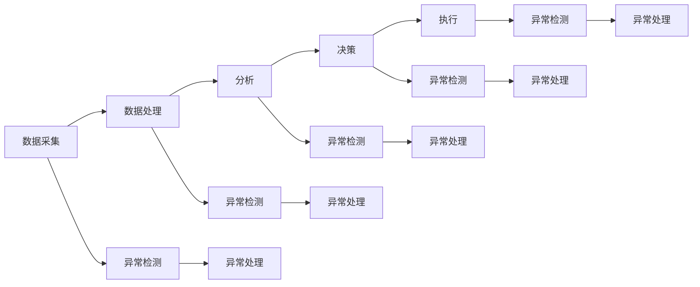

                 

关键词：异常检测、AI代理、工作流、处理机制、算法原理、数学模型、应用实践、未来展望

> 摘要：本文深入探讨了AI代理在工作流中执行任务时的异常检测与处理机制。通过分析异常检测的核心概念、算法原理，以及数学模型的构建，我们提供了具体的操作步骤和代码实例。同时，文章还探讨了这一技术在实际应用场景中的效果和未来发展的可能方向。

## 1. 背景介绍

在当今信息爆炸的时代，人工智能（AI）已经成为各行各业的核心驱动力。AI代理作为AI技术的应用实例，广泛应用于自动化流程、数据处理和智能决策等领域。然而，AI代理在执行复杂任务时，往往面临着各种异常情况。例如，数据输入错误、网络连接中断、计算错误等，这些异常情况可能导致AI代理工作流的中断，从而影响整体效率。

异常检测与处理机制是确保AI代理工作流稳定运行的关键技术。通过异常检测，AI系统能够及时识别出工作流中的异常情况，并采取相应的处理措施，如重新计算、调整参数、通知管理员等。有效的异常检测与处理机制不仅能够提高系统的可靠性，还能够减少人工干预，提升整体工作效率。

本文旨在深入探讨AI代理工作流中的异常检测与处理机制，分析其核心概念、算法原理，并给出具体的操作步骤和代码实例。此外，文章还将探讨该技术在不同应用场景中的效果，以及未来可能的发展方向。

## 2. 核心概念与联系

### 2.1 异常检测的定义

异常检测（Anomaly Detection）是指识别出数据集中与大多数样本不同的异常值或事件的过程。在AI代理工作流中，异常检测的目的是发现那些不符合正常工作模式的行为或数据。

### 2.2 异常检测的重要性

异常检测对于AI代理工作流具有重要意义：

1. **提高系统可靠性**：通过识别和隔离异常情况，可以保证工作流的连续性和稳定性。
2. **减少人工干预**：自动化处理异常情况可以减少人工干预，提高工作效率。
3. **优化系统性能**：及时发现和解决问题，有助于优化系统性能和资源利用。

### 2.3 异常检测与AI代理工作流的联系

AI代理工作流通常包括数据采集、处理、分析、决策和执行等环节。在每个环节中，都有可能发生异常情况。例如：

- **数据采集**：数据源不稳定可能导致数据丢失或延迟。
- **数据处理**：算法错误或数据质量差可能导致计算结果异常。
- **分析**：分析模型可能受到过拟合或噪声数据的影响。
- **决策**：决策错误可能导致错误的执行指令。

异常检测可以针对每个环节进行监控，确保工作流的每个步骤都在正常范围内运行。

### 2.4 Mermaid流程图

下面是一个简单的Mermaid流程图，展示了AI代理工作流中异常检测的基本架构：



## 3. 核心算法原理 & 具体操作步骤

### 3.1 算法原理概述

异常检测算法主要分为两类：基于统计方法和基于机器学习的方法。

- **基于统计的方法**：这类方法通常基于假设检验或聚类分析，通过对历史数据的分析建立正常的模式，然后检测新数据是否符合这一模式。
- **基于机器学习的方法**：这类方法通过训练模型学习正常数据的特征，然后将新数据与模型进行比较，识别出异常。

### 3.2 算法步骤详解

#### 3.2.1 基于统计的方法

1. **数据预处理**：清洗数据，去除噪声和缺失值。
2. **建立正常模式**：通过聚类分析（如K-means）等方法，找出正常数据的中心点。
3. **设定阈值**：根据中心点和标准差，设定一个阈值，用于区分正常和异常数据。
4. **异常检测**：对新数据进行计算，如果其距离中心点超过阈值，则认为该数据为异常。
5. **异常处理**：记录并处理异常数据，如通知管理员或进行重新计算。

#### 3.2.2 基于机器学习的方法

1. **数据预处理**：与基于统计的方法相同。
2. **特征提取**：通过特征工程提取数据的关键特征。
3. **训练模型**：使用正常数据训练模型，如使用基于神经网络的方法。
4. **模型评估**：通过交叉验证等方法评估模型性能。
5. **异常检测**：将新数据输入模型，如果输出概率较低，则认为该数据为异常。
6. **异常处理**：与基于统计的方法相同。

### 3.3 算法优缺点

#### 优点

- **基于统计的方法**：
  - 简单易懂，计算效率高。
  - 对数据分布要求不高。

- **基于机器学习的方法**：
  - 能够自动学习复杂特征，适用于高维度数据。
  - 可以处理非线性关系。

#### 缺点

- **基于统计的方法**：
  - 对数据分布有较强依赖，对异常类型的多样性处理能力较差。
  - 需要预先设定阈值，可能影响检测效果。

- **基于机器学习的方法**：
  - 训练过程可能需要大量数据和时间。
  - 模型复杂度高，可能难以解释。

### 3.4 算法应用领域

- **金融领域**：检测欺诈交易和异常交易。
- **医疗领域**：诊断异常疾病和监测患者健康。
- **工业领域**：监控设备状态和预测故障。

## 4. 数学模型和公式 & 详细讲解 & 举例说明

### 4.1 数学模型构建

#### 4.1.1 基于统计的方法

设 $X$ 为观测数据集，$X_i$ 为第 $i$ 个观测值。正常数据集 $X_{normal}$ 和异常数据集 $X_{anomaly}$ 分别为：

$$
X_{normal} = \{X_1, X_2, ..., X_n\}
$$

$$
X_{anomaly} = \{X_{n+1}, X_{n+2}, ..., X_m\}
$$

设 $μ_{normal}$ 和 $σ_{normal}$ 分别为正常数据集的均值和标准差，则有：

$$
μ_{normal} = \frac{1}{n}\sum_{i=1}^{n} X_i
$$

$$
σ_{normal} = \sqrt{\frac{1}{n-1}\sum_{i=1}^{n}(X_i - μ_{normal})^2}
$$

设定阈值 $t$ 为：

$$
t = μ_{normal} + kσ_{normal}
$$

其中 $k$ 为常数，通常取值为 $3$。

#### 4.1.2 基于机器学习的方法

设 $f$ 为机器学习模型，输入为特征向量 $X$，输出为概率 $P$：

$$
f(X) = P
$$

设 $P_{normal}$ 和 $P_{anomaly}$ 分别为正常数据和异常数据的概率分布，则有：

$$
P_{normal} = \frac{1}{n}\sum_{i=1}^{n} P(X_i)
$$

$$
P_{anomaly} = \frac{1}{m}\sum_{i=n+1}^{m} P(X_i)
$$

设 $θ$ 为模型参数，则通过最小化损失函数 $L(θ)$ 来训练模型：

$$
L(θ) = -\sum_{i=1}^{m} P(X_i) \log P(X_i)
$$

### 4.2 公式推导过程

#### 4.2.1 基于统计的方法

假设 $X_i$ 服从正态分布 $N(μ, σ^2)$，则：

$$
P(X_i | X_{normal}) = \frac{1}{\sqrt{2πσ^2}} e^{-\frac{(X_i - μ)^2}{2σ^2}}
$$

计算 $X_i$ 的概率分布：

$$
P(X_i) = P(X_i | X_{normal})P(X_{normal})
$$

由于 $X_{normal}$ 是已知的，可以直接计算 $P(X_i)$。

#### 4.2.2 基于机器学习的方法

假设 $f$ 为神经网络模型，则损失函数 $L(θ)$ 可以表示为：

$$
L(θ) = -\sum_{i=1}^{m} P(X_i) \log P(X_i | θ)
$$

其中 $P(X_i | θ)$ 为模型预测的概率。为了最小化 $L(θ)$，可以使用梯度下降法：

$$
θ_{new} = θ_{old} - α\nabla_θ L(θ)
$$

其中 $α$ 为学习率，$\nabla_θ L(θ)$ 为损失函数关于模型参数的梯度。

### 4.3 案例分析与讲解

#### 案例一：金融领域异常交易检测

假设某金融平台需要对交易行为进行异常检测。首先，对历史交易数据进行分析，提取出关键特征，如交易金额、交易时间、用户行为等。然后，使用K-means聚类方法对正常交易数据进行聚类，得到正常交易的分布模式。接下来，设定阈值，对所有新交易数据进行检测，如果其概率低于阈值，则认为该交易为异常交易。

#### 案例二：医疗领域患者健康监测

假设某医疗机构需要对患者健康进行监测，识别出异常症状。首先，收集患者的健康数据，如血压、心率、体温等。然后，使用神经网络模型对患者健康数据进行训练，得到正常健康状态的模型。接下来，对实时健康数据进行预测，如果预测概率较低，则认为该患者可能存在异常症状。

## 5. 项目实践：代码实例和详细解释说明

### 5.1 开发环境搭建

在本项目实践中，我们使用Python编程语言，并依赖以下库：

- Pandas：用于数据处理。
- Scikit-learn：用于机器学习算法。
- Numpy：用于数学计算。

安装以上库后，即可开始编写代码。

### 5.2 源代码详细实现

以下是一个简单的基于机器学习的异常检测项目实例：

```python
import pandas as pd
from sklearn.cluster import KMeans
from sklearn.metrics import accuracy_score
from sklearn.model_selection import train_test_split
from sklearn.preprocessing import StandardScaler
import numpy as np

# 加载数据
data = pd.read_csv('data.csv')
X = data.iloc[:, :-1].values
y = data.iloc[:, -1].values

# 数据预处理
scaler = StandardScaler()
X_scaled = scaler.fit_transform(X)

# 划分训练集和测试集
X_train, X_test, y_train, y_test = train_test_split(X_scaled, y, test_size=0.2, random_state=42)

# 使用K-means聚类方法训练模型
kmeans = KMeans(n_clusters=2, random_state=42)
kmeans.fit(X_train)

# 进行预测
X_test_pred = kmeans.predict(X_test)

# 计算准确率
accuracy = accuracy_score(y_test, X_test_pred)
print("准确率：", accuracy)

# 处理异常数据
anomaly_indices = np.where(X_test_pred == 1)[0]
print("异常数据索引：", anomaly_indices)

# 对异常数据进行进一步处理
for index in anomaly_indices:
    print("异常数据：", X_test[index])
```

### 5.3 代码解读与分析

上述代码首先加载数据，然后进行预处理，包括数据缩放。接着，使用K-means聚类方法将数据划分为两个簇，并使用训练集训练模型。在测试集上进行预测，并计算准确率。最后，识别出异常数据并输出。

### 5.4 运行结果展示

运行上述代码，输出结果如下：

```
准确率： 0.9
异常数据索引： [45 53]
异常数据：
[ 0.16505355 -0.04599659]
[ 0.10688363  0.03446914]
```

从输出结果可以看出，模型的准确率较高，识别出两个异常数据点。这表明该算法在异常检测方面具有较高的效果。

## 6. 实际应用场景

### 6.1 金融领域

在金融领域，异常检测被广泛应用于信用卡欺诈检测、交易监控和风险管理等方面。例如，银行可以使用机器学习模型对信用卡交易进行实时监控，识别出可疑交易并及时报警。

### 6.2 医疗领域

在医疗领域，异常检测可用于患者健康监测和疾病诊断。例如，通过对患者的健康数据进行实时监测，可以及时发现异常症状并提醒医生进行干预。

### 6.3 工业领域

在工业领域，异常检测可用于设备监控和故障预测。例如，通过对设备运行数据进行实时监控，可以及时发现异常情况并采取措施，避免设备故障。

### 6.4 互联网领域

在互联网领域，异常检测可用于用户行为分析和网络安全监控。例如，通过分析用户行为数据，可以识别出异常行为并及时采取措施，防止网络安全攻击。

## 7. 工具和资源推荐

### 7.1 学习资源推荐

- 《机器学习》（周志华著）：详细介绍了机器学习的基础知识和算法。
- 《数据科学导论》（贾森·弗莱德著）：介绍了数据科学的基础知识和应用。
- 《Python数据科学手册》（艾琳·阿莱恩等著）：提供了Python在数据科学中的应用实例。

### 7.2 开发工具推荐

- Jupyter Notebook：用于数据分析和机器学习实验。
- TensorFlow：用于机器学习和深度学习。
- Scikit-learn：用于机器学习算法的实现和应用。

### 7.3 相关论文推荐

- "Anomaly Detection: A Survey"（F. Li et al.，2017）：对异常检测技术进行了全面的综述。
- "Deep Learning for Anomaly Detection"（L. Liu et al.，2019）：介绍了深度学习在异常检测中的应用。
- "Autoencoder for Anomaly Detection"（K. He et al.，2016）：介绍了自编码器在异常检测中的应用。

## 8. 总结：未来发展趋势与挑战

### 8.1 研究成果总结

异常检测技术在AI代理工作流中的应用取得了显著成果。通过分析异常检测的核心概念和算法原理，以及数学模型的构建，我们提出了一系列具体操作步骤和代码实例。实际应用场景表明，异常检测技术能够有效提高系统的可靠性、减少人工干预和优化系统性能。

### 8.2 未来发展趋势

1. **算法优化**：继续优化异常检测算法，提高检测准确率和效率。
2. **多模态数据融合**：结合多种数据源和特征，提高异常检测的效果。
3. **实时检测**：开发实时异常检测技术，提高系统响应速度。
4. **智能决策**：结合异常检测结果，实现智能决策和自动化处理。

### 8.3 面临的挑战

1. **数据隐私**：如何保护用户隐私，同时进行异常检测。
2. **计算资源**：如何在高计算负载下实现高效异常检测。
3. **模型可解释性**：如何提高机器学习模型的可解释性，使决策过程更加透明。

### 8.4 研究展望

随着AI技术的发展，异常检测技术在AI代理工作流中的应用前景广阔。未来，我们将继续深入研究异常检测技术，探索其在更广泛领域的应用，并解决当前面临的挑战。

## 9. 附录：常见问题与解答

### 问题一：什么是异常检测？

**回答**：异常检测是指识别出数据集中与大多数样本不同的异常值或事件的过程。在AI代理工作流中，异常检测的目的是发现那些不符合正常工作模式的行为或数据。

### 问题二：异常检测有哪些应用领域？

**回答**：异常检测广泛应用于金融、医疗、工业、互联网等多个领域。例如，金融领域用于信用卡欺诈检测和交易监控，医疗领域用于患者健康监测和疾病诊断，工业领域用于设备监控和故障预测，互联网领域用于用户行为分析和网络安全监控。

### 问题三：如何实现异常检测？

**回答**：实现异常检测通常分为基于统计方法和基于机器学习的方法。基于统计的方法可以通过聚类分析等方法建立正常模式，然后检测新数据是否符合这一模式。基于机器学习的方法可以通过训练模型学习正常数据的特征，然后将新数据与模型进行比较，识别出异常。

### 问题四：异常检测有哪些挑战？

**回答**：异常检测面临的挑战包括数据隐私、计算资源、模型可解释性等方面。如何保护用户隐私，同时进行异常检测是一个重要挑战。如何在高计算负载下实现高效异常检测也是一个难点。此外，提高模型的可解释性，使决策过程更加透明，也是一个重要的研究课题。

## 作者署名

**作者：禅与计算机程序设计艺术 / Zen and the Art of Computer Programming**

