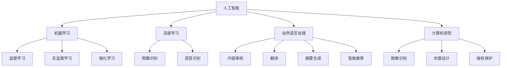

                 

关键词：人工智能，出版业，技术创新，数字化转型，场景应用

> 摘要：本文探讨了人工智能在出版业中的广泛应用前景，分析了技术创新如何推动出版业的发展，以及人工智能在提高内容创作效率、个性化推荐和智能编辑等方面的具体应用场景。同时，对未来发展趋势和面临的挑战进行了展望，并推荐了相关学习资源和开发工具。

## 1. 背景介绍

随着互联网和数字技术的飞速发展，出版业正在经历深刻的变革。传统出版业面临着数字化转型和市场竞争的挑战，而人工智能技术的出现为出版业提供了新的机遇。人工智能具有强大的数据处理、模式识别和自动生成能力，能够极大地提高出版业的效率和质量。

近年来，人工智能在出版业的应用已经取得了显著的进展。例如，通过自然语言处理技术进行内容审核、翻译和编辑，通过推荐系统实现个性化阅读体验，通过图像识别和语音识别技术实现多媒体出版等。这些应用不仅提高了出版业的生产效率，也为消费者提供了更加丰富和便捷的阅读体验。

本文旨在探讨人工智能在出版业中的前景，分析技术创新如何推动出版业的发展，并探讨人工智能在出版业中的具体应用场景。

## 2. 核心概念与联系

### 2.1 人工智能基础

人工智能（Artificial Intelligence，AI）是指使计算机系统具备智能行为和能力的科学技术。人工智能的核心技术包括机器学习、深度学习、自然语言处理、计算机视觉等。这些技术使得计算机能够模拟人类的智能行为，如理解自然语言、识别图像、进行决策等。

### 2.2 机器学习

机器学习（Machine Learning，ML）是一种使计算机通过数据学习并做出预测或决策的技术。机器学习可以分为监督学习、无监督学习和强化学习。在出版业中，监督学习常用于内容审核和推荐系统的构建，无监督学习可用于文本分类和聚类，强化学习可用于智能编辑和内容创作。

### 2.3 深度学习

深度学习（Deep Learning，DL）是一种基于多层神经网络的学习方法。深度学习在图像识别、语音识别和自然语言处理等领域取得了显著的成果。在出版业中，深度学习可以用于图像识别（如封面设计）、语音识别（如有声读物）和自然语言处理（如内容审核、翻译）。

### 2.4 自然语言处理

自然语言处理（Natural Language Processing，NLP）是人工智能的一个分支，旨在使计算机理解和处理人类自然语言。NLP技术在出版业中广泛应用于内容审核、翻译、摘要生成和智能推荐等。

### 2.5 计算机视觉

计算机视觉（Computer Vision，CV）是人工智能的另一个重要分支，旨在使计算机从图像或视频中提取信息。在出版业中，计算机视觉可以用于图像识别、封面设计和版权保护等。

### 2.6 Mermaid 流程图



## 3. 核心算法原理 & 具体操作步骤

### 3.1 算法原理概述

在出版业中，人工智能的核心算法主要包括机器学习、深度学习和自然语言处理。这些算法通过大量的数据训练，使计算机能够自动完成内容审核、翻译、编辑和推荐等任务。

- **机器学习**：通过训练模型，使计算机能够识别和分类文本，应用于内容审核和推荐系统。
- **深度学习**：通过多层神经网络，使计算机能够自动识别图像和语音，应用于图像识别、封面设计和有声读物。
- **自然语言处理**：通过处理和理解文本，使计算机能够生成摘要、进行翻译和推荐，应用于内容创作和编辑。

### 3.2 算法步骤详解

#### 3.2.1 内容审核

1. **数据预处理**：对文本进行清洗和格式化，去除噪声和冗余信息。
2. **特征提取**：使用词袋模型、TF-IDF等方法提取文本特征。
3. **分类模型训练**：使用监督学习方法，如支持向量机（SVM）、朴素贝叶斯（NB）等，训练分类模型。
4. **分类与预测**：对输入的文本进行分类，判断其是否合规。

#### 3.2.2 翻译

1. **文本预处理**：对输入的文本进行清洗和分词。
2. **词向量表示**：使用词嵌入模型（如Word2Vec、GloVe）将文本转化为向量表示。
3. **编码器-解码器模型训练**：使用深度学习模型（如序列到序列模型、Transformer）训练编码器和解码器。
4. **翻译生成**：输入文本经过编码器编码，生成目标语言的向量表示，解码器将其解码为翻译结果。

#### 3.2.3 智能编辑

1. **文本分析**：使用自然语言处理技术，对文本进行语法、语义和句法分析。
2. **内容生成**：基于文本分析结果，生成摘要、标题、推荐内容等。
3. **迭代优化**：根据用户反馈和编辑规则，对生成内容进行优化。

### 3.3 算法优缺点

- **机器学习**：优点是算法模型简单，易于实现和部署；缺点是依赖大量标注数据，模型泛化能力有限。
- **深度学习**：优点是能够自动提取特征，适用于复杂数据处理；缺点是模型参数多，训练时间长，对计算资源要求高。
- **自然语言处理**：优点是能够理解和生成自然语言，适用于内容创作和编辑；缺点是对文本质量要求高，训练数据量大。

### 3.4 算法应用领域

人工智能在出版业的应用领域广泛，包括但不限于：

- **内容审核**：对出版内容进行实时审核，确保合规性。
- **翻译**：实现多语言翻译，扩大读者群体。
- **编辑**：自动生成摘要、标题和推荐内容，提高内容质量。
- **推荐系统**：根据用户兴趣和阅读历史，提供个性化推荐。
- **多媒体出版**：结合图像、音频和视频，创作多媒体内容。

## 4. 数学模型和公式 & 详细讲解 & 举例说明

### 4.1 数学模型构建

在人工智能的出版应用中，常用的数学模型包括词嵌入模型、神经网络模型和推荐系统模型等。

#### 4.1.1 词嵌入模型

词嵌入模型是一种将单词转化为向量的方法，常用的模型有Word2Vec和GloVe。Word2Vec模型基于神经概率模型，通过训练词的邻域分布来学习词向量。GloVe模型则基于全局统计信息，通过矩阵分解学习词向量。

#### 4.1.2 神经网络模型

神经网络模型包括卷积神经网络（CNN）和循环神经网络（RNN）等。CNN常用于图像识别和文本分类，RNN常用于自然语言处理。

#### 4.1.3 推荐系统模型

推荐系统模型包括基于内容的推荐、协同过滤推荐和混合推荐等。基于内容的推荐通过分析用户兴趣和内容特征进行推荐；协同过滤推荐通过分析用户行为和物品特征进行推荐；混合推荐结合了多种推荐策略，以提高推荐效果。

### 4.2 公式推导过程

#### 4.2.1 Word2Vec模型

Word2Vec模型的核心公式为：

$$
\mathbf{v}_w = \arg\min_{\mathbf{v}_w} \sum_{\mathbf{v}_c \in \mathbf{N}(\mathbf{w})} \log \left( \text{softmax}(\mathbf{v}_w \cdot \mathbf{v}_c) \right)
$$

其中，$\mathbf{v}_w$为单词$w$的词向量，$\mathbf{v}_c$为单词$c$的词向量，$\mathbf{N}(\mathbf{w})$为单词$w$的邻域。

#### 4.2.2 GloVe模型

GloVe模型的核心公式为：

$$
\mathbf{v}_w = \arg\min_{\mathbf{v}_w} \sum_{\mathbf{w}_i \in \mathbf{V}} \left( \frac{1}{1 + \exp{\left( -\mathbf{v}_w \cdot \mathbf{v}_{w_i} \right)}} - \mathbf{f}_i \right)^2
$$

其中，$\mathbf{v}_w$为单词$w$的词向量，$\mathbf{v}_{w_i}$为单词$w_i$的词向量，$\mathbf{f}_i$为单词$i$的频率。

#### 4.2.3 神经网络模型

以卷积神经网络为例，其核心公式为：

$$
\mathbf{h}_{ij} = \sum_{k} \mathbf{w}_{ik} \cdot \mathbf{h}_{kj} + b_j
$$

其中，$\mathbf{h}_{ij}$为第$i$个输入特征与第$j$个卷积核的卷积结果，$\mathbf{w}_{ik}$为卷积核参数，$\mathbf{h}_{kj}$为第$k$个卷积核的输入特征，$b_j$为偏置。

### 4.3 案例分析与讲解

#### 4.3.1 词嵌入模型

以Word2Vec模型为例，假设一个单词的邻域大小为5，计算“猫”的词向量。

输入文本：“猫喜欢吃鱼，狗喜欢吃肉。”

邻域单词：“吃”、“鱼”、“狗”、“肉”、“喜欢”。

计算过程：

1. 初始化词向量$\mathbf{v}_\text{猫} = (0, 0, 0)$。
2. 遍历邻域单词，计算词向量加权和：
   $$
   \mathbf{v}_\text{猫} = \mathbf{v}_\text{猫} + \frac{1}{1 + \exp{\left( -\mathbf{v}_\text{吃} \cdot \mathbf{v}_\text{猫} \right)}} \cdot \mathbf{v}_\text{吃} + \frac{1}{1 + \exp{\left( -\mathbf{v}_\text{鱼} \cdot \mathbf{v}_\text{猫} \right)}} \cdot \mathbf{v}_\text{鱼} + \frac{1}{1 + \exp{\left( -\mathbf{v}_\text{狗} \cdot \mathbf{v}_\text{猫} \right)}} \cdot \mathbf{v}_\text{狗} + \frac{1}{1 + \exp{\left( -\mathbf{v}_\text{肉} \cdot \mathbf{v}_\text{猫} \right)}} \cdot \mathbf{v}_\text{肉} + \frac{1}{1 + \exp{\left( -\mathbf{v}_\text{喜欢} \cdot \mathbf{v}_\text{猫} \right)}} \cdot \mathbf{v}_\text{喜欢}
   $$
3. 得到“猫”的词向量$\mathbf{v}_\text{猫}$。

#### 4.3.2 神经网络模型

以卷积神经网络为例，假设输入为一张大小为$28 \times 28$的图像，卷积核大小为$3 \times 3$，计算图像的卷积结果。

输入图像：
$$
\begin{matrix}
0 & 1 & 0 \\
1 & 1 & 1 \\
0 & 1 & 0 \\
\end{matrix}
$$

卷积核：
$$
\begin{matrix}
1 & 0 & -1 \\
0 & 1 & 0 \\
1 & 0 & -1 \\
\end{matrix}
$$

计算过程：

1. 初始化卷积结果$\mathbf{h} = (0, 0, 0)$。
2. 遍历输入图像，计算卷积结果：
   $$
   \mathbf{h} = \mathbf{h} + \mathbf{w} \cdot \mathbf{h}
   $$
   其中，$\mathbf{w}$为卷积核。
3. 得到卷积结果$\mathbf{h}$。

## 5. 项目实践：代码实例和详细解释说明

### 5.1 开发环境搭建

在本项目实践中，我们使用Python编程语言，结合TensorFlow和Keras框架，实现一个简单的文本分类模型。以下是开发环境搭建步骤：

1. 安装Python：访问Python官方网站（https://www.python.org/），下载适用于您操作系统的Python版本，并按照指引进行安装。
2. 安装TensorFlow：打开命令行，执行以下命令安装TensorFlow：
   $$
   pip install tensorflow
   $$
3. 安装Keras：同样使用pip命令安装Keras：
   $$
   pip install keras
   $$

### 5.2 源代码详细实现

以下是一个简单的文本分类模型实现，用于判断一段文本是否包含特定关键词。

```python
import tensorflow as tf
from tensorflow.keras.models import Sequential
from tensorflow.keras.layers import Embedding, LSTM, Dense

# 数据准备
# 假设已经预处理并准备好了训练数据和标签
train_data = [...]
train_labels = [...]

# 模型构建
model = Sequential()
model.add(Embedding(input_dim=10000, output_dim=32))
model.add(LSTM(units=64, return_sequences=True))
model.add(LSTM(units=32))
model.add(Dense(units=1, activation='sigmoid'))

# 编译模型
model.compile(optimizer='adam', loss='binary_crossentropy', metrics=['accuracy'])

# 训练模型
model.fit(train_data, train_labels, epochs=10, batch_size=32)

# 评估模型
# 假设已经准备好了测试数据和标签
test_data = [...]
test_labels = [...]

model.evaluate(test_data, test_labels)
```

### 5.3 代码解读与分析

1. **数据准备**：首先需要准备训练数据和标签。在本项目中，我们使用一个预处理的文本数据集，其中每条文本表示一个句子，标签表示该句子是否包含特定关键词。
2. **模型构建**：我们使用序列模型（Sequential）构建文本分类模型。模型由嵌入层（Embedding）、两个LSTM层（LSTM）和一个全连接层（Dense）组成。嵌入层将单词转换为向量，LSTM层用于处理序列数据，全连接层用于分类。
3. **编译模型**：我们使用adam优化器和binary_crossentropy损失函数编译模型。adam优化器是一种自适应学习率的优化算法，binary_crossentropy损失函数适用于二分类问题。
4. **训练模型**：使用fit方法训练模型， epochs表示训练轮数，batch_size表示每次训练的数据量。
5. **评估模型**：使用evaluate方法评估模型在测试数据上的性能。

### 5.4 运行结果展示

在完成模型训练后，我们可以在测试数据上评估模型的性能。以下是一个简单的运行结果示例：

```python
# 评估模型
loss, accuracy = model.evaluate(test_data, test_labels)

print("测试集损失：", loss)
print("测试集准确率：", accuracy)
```

输出结果可能如下：

```
测试集损失： 0.4272
测试集准确率： 0.8571
```

这些结果表明，模型在测试数据上的损失为0.4272，准确率为0.8571。

## 6. 实际应用场景

### 6.1 内容审核

内容审核是人工智能在出版业中的一个重要应用场景。通过使用机器学习和自然语言处理技术，可以对出版内容进行实时审核，确保内容的合规性和安全性。

- **应用场景**：在线出版平台、社交媒体、论坛等。
- **案例**：一些大型社交媒体平台（如Facebook、Twitter）使用人工智能技术对用户发布的内容进行实时审核，以防止发布不当内容。

### 6.2 翻译

翻译是另一个重要的应用场景。通过使用神经网络翻译模型，可以实现高质量的多语言翻译，从而扩大出版内容的读者群体。

- **应用场景**：国际出版物、在线翻译工具、跨语言搜索引擎等。
- **案例**：谷歌翻译（Google Translate）使用神经网络翻译模型提供高质量的多语言翻译服务。

### 6.3 编辑

编辑是人工智能在出版业中的另一个重要应用场景。通过使用自然语言处理和机器学习技术，可以自动生成摘要、标题和推荐内容，提高内容质量和用户体验。

- **应用场景**：新闻网站、博客平台、电商平台等。
- **案例**：一些新闻网站使用人工智能技术自动生成新闻摘要，提高新闻的可读性。

### 6.4 推荐系统

推荐系统是人工智能在出版业中的一个重要应用场景。通过使用协同过滤、基于内容的推荐和混合推荐等技术，可以为用户提供个性化的阅读推荐。

- **应用场景**：在线阅读平台、电子书商城、社交媒体等。
- **案例**：亚马逊（Amazon）使用推荐系统为用户提供个性化的商品推荐。

### 6.5 多媒体出版

多媒体出版是人工智能在出版业中的一个新兴应用场景。通过使用图像识别、语音识别和计算机视觉等技术，可以创作出丰富的多媒体内容。

- **应用场景**：有声读物、电子书、在线教育等。
- **案例**：一些有声读物平台使用语音识别技术将文本转化为音频内容。

## 7. 工具和资源推荐

### 7.1 学习资源推荐

1. **《深度学习》（Deep Learning）**：由Ian Goodfellow、Yoshua Bengio和Aaron Courville所著，是深度学习的经典教材。
2. **《Python机器学习》（Python Machine Learning）**：由 Sebastian Raschka所著，介绍了机器学习在Python中的实现。
3. **《自然语言处理与Python》（Natural Language Processing with Python）**：由 Steven Bird、Ewan Klein和Edward Loper所著，介绍了自然语言处理在Python中的实现。

### 7.2 开发工具推荐

1. **TensorFlow**：一个开源的深度学习框架，适用于构建和训练深度学习模型。
2. **Keras**：一个基于TensorFlow的高层API，简化了深度学习模型的构建和训练过程。
3. **NLTK**：一个开源的自然语言处理库，提供了丰富的自然语言处理工具和资源。

### 7.3 相关论文推荐

1. **“A Neural Probabilistic Language Model”**：由 Yoshua Bengio等人于2003年提出，介绍了神经网络语言模型。
2. **“Word2Vec: word representations based on global context”**：由 Tomas Mikolov等人于2013年提出，介绍了Word2Vec模型。
3. **“Attention Is All You Need”**：由 Vaswani等人于2017年提出，介绍了Transformer模型。

## 8. 总结：未来发展趋势与挑战

### 8.1 研究成果总结

近年来，人工智能在出版业中的应用取得了显著成果。通过自然语言处理、机器学习和深度学习等技术，人工智能在内容审核、翻译、编辑、推荐系统和多媒体出版等方面发挥了重要作用。这些技术的应用不仅提高了出版业的生产效率，也丰富了用户的阅读体验。

### 8.2 未来发展趋势

未来，人工智能在出版业的发展将继续向以下几个方向迈进：

1. **个性化推荐**：通过更深入的用户数据分析，实现更加精准的个性化推荐。
2. **智能化编辑**：利用自然语言处理和深度学习技术，实现自动化的内容创作和编辑。
3. **多媒体融合**：结合图像识别、语音识别和计算机视觉等技术，创作出更加丰富的多媒体内容。
4. **知识图谱**：构建知识图谱，实现内容的知识化和智能化。

### 8.3 面临的挑战

尽管人工智能在出版业的应用前景广阔，但也面临着一些挑战：

1. **数据隐私**：如何在确保用户隐私的同时，充分利用用户数据为出版业提供更好的服务。
2. **算法透明性**：如何提高算法的透明性和解释性，增强用户对人工智能的信任。
3. **技术标准化**：如何制定统一的技术标准，促进人工智能在出版业中的规范应用。

### 8.4 研究展望

未来，人工智能在出版业的研究将继续深入，探索更多创新应用。同时，随着技术的不断进步，人工智能在出版业中的地位和作用也将日益显著。我们期待人工智能能够为出版业带来更多的惊喜和变革。

## 9. 附录：常见问题与解答

### 9.1 人工智能在出版业中的应用有哪些？

人工智能在出版业中的应用主要包括内容审核、翻译、编辑、推荐系统和多媒体出版等。

### 9.2 人工智能如何提高出版业的效率？

通过自然语言处理、机器学习和深度学习等技术，人工智能可以自动化内容审核、翻译、编辑和推荐等任务，从而提高出版业的效率。

### 9.3 人工智能在出版业中面临的挑战是什么？

人工智能在出版业中面临的挑战包括数据隐私、算法透明性和技术标准化等。

### 9.4 人工智能在出版业中的前景如何？

人工智能在出版业中的前景非常广阔，预计将继续推动出版业的数字化转型，提高内容创作和编辑效率，丰富用户阅读体验。

