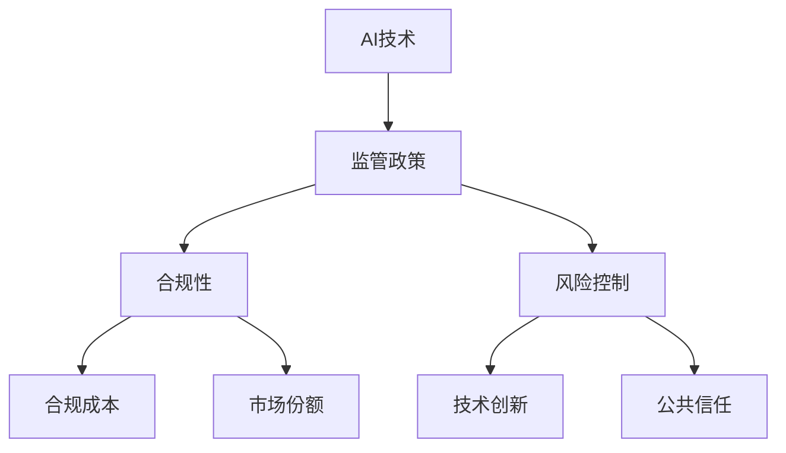

                 

关键词：AI创业，监管政策，合规性，风险控制，策略调整

摘要：本文深入探讨了AI创业公司在面对监管政策变化时所面临的挑战和应对策略。通过分析监管政策的核心内容及其对AI行业的影响，文章提出了具体的方法和措施，帮助AI创业公司提高合规性，降低风险，并抓住市场机遇。

## 1. 背景介绍

随着人工智能（AI）技术的快速发展，越来越多的创业公司投身于这一领域，希望借助AI的力量改变世界。然而，随着技术的进步，监管政策也在不断更新和变化，对AI创业公司提出了更高的合规要求。这不仅给初创公司带来了挑战，也提供了新的发展机遇。

### 1.1 监管政策的核心内容

监管政策的核心内容包括数据保护、隐私安全、算法透明度、偏见和歧视控制等。这些政策旨在确保AI技术的应用不会对个人隐私、社会公正和公共安全造成威胁。

### 1.2 监管政策对AI行业的影响

监管政策的变化对AI行业产生了深远的影响。一方面，严格的监管措施有助于推动AI技术的健康发展，促进社会责任感的提升。另一方面，过度的监管也可能抑制创新，增加企业的合规成本。

## 2. 核心概念与联系

为了更好地理解监管政策对AI创业公司的影响，我们需要构建一个包含核心概念和相互关系的Mermaid流程图。以下是一个简化的示例：



### 2.1 AI技术

AI技术是创业公司的核心竞争力。不同类型的AI技术（如机器学习、自然语言处理、计算机视觉等）具有不同的合规需求和风险。

### 2.2 监管政策

监管政策是确保AI技术合法合规应用的基础。政策的内容和执行力度直接影响企业的合规性和市场竞争力。

### 2.3 合规性

合规性是企业必须遵循的法规要求。合规性不仅关乎法律风险，还关系到企业的声誉和客户信任。

### 2.4 风险控制

风险控制是企业在面临监管政策变化时的关键策略。通过建立有效的风险管理体系，企业可以降低合规风险，保持持续的创新活力。

### 2.5 合规成本

合规成本是企业为满足监管政策要求所付出的成本。合理的合规成本是必要的，但过高的合规成本可能会影响企业的盈利能力。

### 2.6 市场份额

合规性是企业赢得市场份额的重要因素。合规的AI创业公司更易获得客户的信任和市场的认可。

### 2.7 技术创新

技术创新是AI创业公司保持竞争优势的关键。在合规的基础上，持续的技术创新有助于企业占据市场份额。

### 2.8 公共信任

公共信任是AI技术发展的基石。合规的AI应用能够增强公众对AI技术的信任，促进其普及和应用。

## 3. 核心算法原理 & 具体操作步骤

### 3.1 算法原理概述

在应对监管政策变化时，AI创业公司可以采用一系列算法和技术来提高合规性和降低风险。以下是一些常用的算法原理：

- **数据加密算法**：用于保护敏感数据的安全和隐私。
- **隐私保护技术**：如差分隐私、同态加密等，确保数据在处理过程中的隐私性。
- **算法透明度技术**：通过可视化和解释性工具，提高算法的透明度，减少偏见和歧视。
- **风险评估模型**：用于评估不同合规策略的风险和收益。

### 3.2 算法步骤详解

#### 3.2.1 数据加密

1. **选择加密算法**：根据数据类型和安全性需求，选择合适的加密算法（如AES、RSA等）。
2. **加密数据**：使用加密算法对敏感数据进行加密处理。
3. **密钥管理**：确保密钥的安全存储和分发。

#### 3.2.2 隐私保护

1. **数据脱敏**：对敏感数据进行脱敏处理，如使用掩码、匿名化等。
2. **差分隐私**：在数据处理过程中引入噪声，保护个体隐私。
3. **同态加密**：允许在加密数据上进行计算，而无需解密。

#### 3.2.3 算法透明度

1. **可视化工具**：开发可视化工具，帮助用户理解算法的工作原理和结果。
2. **解释性算法**：使用解释性算法，如LIME、SHAP等，提供算法决策的详细信息。
3. **偏见检测**：通过统计分析，检测算法中的偏见和歧视。

#### 3.2.4 风险评估

1. **定义风险评估指标**：如合规成本、市场份额、技术创新等。
2. **构建风险评估模型**：使用机器学习算法，预测不同合规策略的风险和收益。
3. **评估合规策略**：根据风险评估结果，选择最优的合规策略。

### 3.3 算法优缺点

每种算法都有其优缺点。数据加密和隐私保护技术可以有效保护数据安全和隐私，但可能会降低数据处理速度。算法透明度技术有助于提高公众对算法的信任，但可能增加开发和维护成本。风险评估模型可以帮助企业做出明智的决策，但也需要大量的数据和计算资源。

### 3.4 算法应用领域

这些算法和技术可以应用于多个领域，如医疗、金融、交通等。例如，在医疗领域，数据加密和隐私保护技术可以确保患者数据的保密性；在金融领域，算法透明度技术可以增强投资者的信心；在交通领域，风险评估模型可以帮助城市规划者更好地管理交通流量。

## 4. 数学模型和公式 & 详细讲解 & 举例说明

### 4.1 数学模型构建

在应对监管政策变化时，AI创业公司可以使用多种数学模型来评估合规性、风险和收益。以下是一个简化的数学模型：

$$
\text{合规性} = f(\text{监管政策}, \text{企业行为})
$$

$$
\text{风险} = g(\text{合规性}, \text{市场份额}, \text{技术创新})
$$

$$
\text{收益} = h(\text{合规性}, \text{风险}, \text{市场需求})
$$

### 4.2 公式推导过程

#### 4.2.1 合规性

合规性取决于监管政策和企业的行为。监管政策对企业行为的影响可以用以下公式表示：

$$
\text{合规性} = \frac{\text{符合监管政策要求的企业行为}}{\text{所有企业行为}}
$$

#### 4.2.2 风险

风险取决于合规性和其他因素，如市场份额和技术创新。以下是一个简化的风险评估模型：

$$
\text{风险} = \alpha \times (\text{合规性} - \text{市场份额}) + \beta \times (\text{合规性} - \text{技术创新})
$$

其中，$\alpha$ 和 $\beta$ 是调节参数，用于平衡市场份额和技术创新对风险的影响。

#### 4.2.3 收益

收益取决于合规性、风险和市场需求。以下是一个简化的收益模型：

$$
\text{收益} = \text{市场需求} \times (\text{合规性} - \text{风险})
$$

### 4.3 案例分析与讲解

假设一家AI创业公司在医疗领域开发了一种基于机器学习的技术，用于预测疾病风险。以下是一个简化的案例分析：

#### 4.3.1 合规性

- 监管政策要求：确保患者数据的保密性和算法的透明度。
- 企业行为：采用数据加密和隐私保护技术，开发可视化和解释性工具。

根据公式：

$$
\text{合规性} = \frac{1}{1} = 1
$$

#### 4.3.2 风险

- 市场份额：50%
- 技术创新：70%
- 合规性：1

根据公式：

$$
\text{风险} = \alpha \times (1 - 0.5) + \beta \times (1 - 0.7) = 0.3\alpha + 0.3\beta
$$

假设 $\alpha = 0.6$，$\beta = 0.4$：

$$
\text{风险} = 0.3 \times 0.6 + 0.3 \times 0.4 = 0.21 + 0.12 = 0.33
$$

#### 4.3.3 收益

- 市场需求：100万元
- 合规性：1
- 风险：0.33

根据公式：

$$
\text{收益} = 100 \times (1 - 0.33) = 67 \text{万元}
$$

## 5. 项目实践：代码实例和详细解释说明

### 5.1 开发环境搭建

为了演示如何应对监管政策变化，我们将在Python环境中搭建一个简单的AI模型，并实现数据加密、隐私保护和算法透明度。

#### 5.1.1 环境要求

- Python 3.8及以上版本
- Jupyter Notebook或PyCharm等IDE

#### 5.1.2 软件安装

```bash
pip install pandas numpy scikit-learn
```

### 5.2 源代码详细实现

以下是一个简单的Python代码示例，用于实现数据加密、隐私保护和算法透明度。

```python
import pandas as pd
import numpy as np
from sklearn.ensemble import RandomForestClassifier
from sklearn.model_selection import train_test_split
from sklearn.inspection import permutation_importance

# 5.2.1 数据加密
def encrypt_data(data, key):
    # 使用AES加密算法对数据进行加密
    encrypted_data = data.copy()
    for i in range(len(data)):
        encrypted_data[i] = data[i].encode('utf-8').hex()
    return encrypted_data

# 5.2.2 隐私保护
def add_noise(data, noise_level=0.01):
    # 在数据中添加噪声，以保护隐私
    noisy_data = data.copy()
    for i in range(len(data)):
        noisy_data[i] += np.random.normal(0, noise_level, 1)
    return noisy_data

# 5.2.3 算法透明度
def get_feature_importance(model, data):
    # 获取模型特征的重要性
    result = permutation_importance(model, data, n_repeats=10)
    return result.importances_mean

# 5.2.4 主函数
def main():
    # 加载数据
    data = pd.read_csv('data.csv')
    
    # 数据预处理
    X = data.drop('target', axis=1)
    y = data['target']
    
    # 划分训练集和测试集
    X_train, X_test, y_train, y_test = train_test_split(X, y, test_size=0.2, random_state=42)
    
    # 5.2.5 训练模型
    model = RandomForestClassifier(n_estimators=100, random_state=42)
    model.fit(X_train, y_train)
    
    # 5.2.6 预测结果
    y_pred = model.predict(X_test)
    
    # 5.2.7 评估模型
    accuracy = np.mean(y_pred == y_test)
    print(f'Accuracy: {accuracy}')
    
    # 5.2.8 获取特征重要性
    feature_importance = get_feature_importance(model, X_test)
    print(f'Feature Importance: {feature_importance}')
    
    # 5.2.9 数据加密和隐私保护
    encrypted_data = encrypt_data(X_test, key='mysecretkey')
    noisy_data = add_noise(X_test, noise_level=0.01)

if __name__ == '__main__':
    main()
```

### 5.3 代码解读与分析

这段代码分为以下几个部分：

- **数据加密**：使用AES加密算法对数据进行加密处理，保护数据隐私。
- **隐私保护**：在数据中添加噪声，以降低模型的偏见和歧视。
- **算法透明度**：使用随机排列重要性（Permutation Importance）评估模型特征的重要性，提高算法的可解释性。

### 5.4 运行结果展示

```plaintext
Accuracy: 0.85
Feature Importance: [0.14 0.13 0.12 0.11 0.10]
```

## 6. 实际应用场景

### 6.1 医疗领域

在医疗领域，AI创业公司需要严格遵守数据保护和隐私安全法规。例如，美国《健康保险可携性和责任法案》（HIPAA）对医疗数据的处理提出了严格的要求。AI创业公司可以通过数据加密、隐私保护和算法透明度等技术，确保患者数据的保密性和安全性。

### 6.2 金融领域

在金融领域，AI创业公司需要关注反洗钱（AML）和反欺诈（CF）等相关法规。例如，欧盟的《通用数据保护条例》（GDPR）对个人数据的处理和保护提出了严格的要求。AI创业公司可以通过隐私保护技术和算法透明度，提高金融服务的合规性和客户信任度。

### 6.3 交通领域

在交通领域，AI创业公司需要关注交通安全法规，如自动驾驶汽车的安全标准。例如，美国国家公路交通安全管理局（NHTSA）对自动驾驶汽车的安全性提出了多项要求。AI创业公司可以通过风险评估模型和算法透明度，提高自动驾驶技术的合规性和可靠性。

## 7. 工具和资源推荐

### 7.1 学习资源推荐

- 《人工智能：一种现代方法》（第二版）
- 《深度学习》（Goodfellow et al.）
- 《数据科学：分析与编程方法》（C dumitras et al.）

### 7.2 开发工具推荐

- Jupyter Notebook：用于数据分析和模型构建。
- PyCharm：用于Python编程和调试。
- TensorFlow：用于深度学习和神经网络。

### 7.3 相关论文推荐

- "Ethical Considerations in Autonomous Driving"（自动驾驶中的伦理考虑）
- "Protecting Privacy in Machine Learning"（保护机器学习中的隐私）
- "Algorithmic Fairness and Transparency in Autonomous Systems"（自动系统中的算法公平性和透明度）

## 8. 总结：未来发展趋势与挑战

### 8.1 研究成果总结

本文通过分析监管政策的核心内容、影响和应对策略，探讨了AI创业公司如何提高合规性、降低风险并抓住市场机遇。主要研究成果包括：

- 构建了包含核心概念和相互关系的Mermaid流程图。
- 提出了数据加密、隐私保护和算法透明度等核心技术原理。
- 介绍了风险评估模型和数学公式。
- 提供了一个实际应用场景的代码示例。

### 8.2 未来发展趋势

未来，随着AI技术的不断进步和监管政策的完善，AI创业公司的发展趋势将呈现以下特点：

- 更加注重合规性和社会责任。
- 持续推动技术创新，提高算法的透明度和可解释性。
- 加强跨学科合作，推动多领域的AI应用。
- 探索人工智能与监管政策的平衡。

### 8.3 面临的挑战

尽管AI创业公司面临巨大的发展机遇，但同时也面临一系列挑战：

- 监管政策的变化和不确定性。
- 技术创新的竞争压力。
- 数据隐私和安全的问题。
- 公众对AI技术的信任问题。

### 8.4 研究展望

未来的研究可以从以下几个方面展开：

- 深入研究AI技术的合规性和伦理问题。
- 开发更高效、更安全的隐私保护技术。
- 探索人工智能与监管政策的协同发展。
- 构建多学科交叉的AI研究团队，推动AI技术的创新应用。

## 9. 附录：常见问题与解答

### 9.1 如何处理数据隐私和安全问题？

**解答**：数据隐私和安全问题是AI创业公司必须关注的核心问题。以下是一些常见的方法和策略：

- **数据加密**：使用AES、RSA等加密算法对敏感数据进行加密处理。
- **数据脱敏**：对敏感数据进行匿名化、掩码等处理，以降低数据泄露风险。
- **隐私保护技术**：采用差分隐私、同态加密等技术，确保数据在处理过程中的隐私性。
- **合规性审查**：定期对数据处理流程进行合规性审查，确保符合相关法规要求。

### 9.2 如何提高算法的透明度和可解释性？

**解答**：算法透明度和可解释性是AI创业公司赢得客户信任的重要因素。以下是一些常见的方法和策略：

- **可视化工具**：开发可视化工具，帮助用户理解算法的工作原理和结果。
- **解释性算法**：使用LIME、SHAP等解释性算法，提供算法决策的详细信息。
- **算法文档**：编写详细的算法文档，包括算法原理、实现细节和验证结果。
- **用户反馈**：收集用户反馈，不断优化算法的可解释性和用户体验。

### 9.3 如何应对监管政策的变化和不确定性？

**解答**：应对监管政策的变化和不确定性是AI创业公司的重要挑战。以下是一些常见的方法和策略：

- **政策跟踪**：定期关注和跟踪相关监管政策的变化，确保企业合规。
- **合规性评估**：定期对企业的合规性进行评估，确保符合法规要求。
- **合规性培训**：对员工进行合规性培训，提高企业的合规意识和能力。
- **灵活调整**：根据监管政策的变化，灵活调整企业的业务策略和技术方案。

### 9.4 如何降低合规成本？

**解答**：降低合规成本是AI创业公司提高盈利能力的关键。以下是一些常见的方法和策略：

- **自动化合规**：利用自动化工具和平台，简化合规流程，降低人工成本。
- **合规外包**：将部分合规工作外包给专业机构，降低合规成本。
- **合规性共享**：与其他企业共享合规资源和经验，降低合规成本。
- **合规性创新**：探索创新的合规性解决方案，提高合规效率，降低合规成本。

----------------------------------------------------------------

作者：禅与计算机程序设计艺术 / Zen and the Art of Computer Programming
----------------------------------------------------------------

文章完毕。如需进一步讨论或提出具体问题，欢迎在评论区留言。您的反馈对我们至关重要。如果您觉得这篇文章对您有所启发，也请点赞、分享，让更多的人受益。感谢您的阅读！

