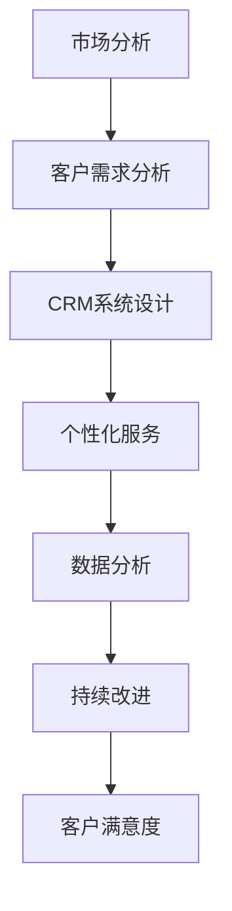

                 

### 关键词

- AI创业公司
- 客户关系管理
- 长期客户价值
- 个性化服务
- 数据分析与洞察
- 持续改进与迭代
- 客户满意度

### 摘要

本文将深入探讨AI创业公司如何通过策略、技术和实践来建立和维持长期客户关系。文章首先概述了AI创业公司的市场背景和面临的挑战，然后详细介绍了核心概念、算法原理、数学模型、项目实践以及实际应用场景。此外，文章还讨论了未来发展趋势、工具和资源推荐，并提出了未来研究的挑战和展望。

## 1. 背景介绍

在当前的技术浪潮中，人工智能（AI）正逐渐成为各个行业的驱动力。AI创业公司在快速发展的市场中涌现，它们面临着激烈的竞争和不断变化的技术环境。然而，成功的关键不仅在于创新的技术，还在于如何建立和维护长期客户关系，实现持续的商业成功。

### 1.1 AI创业公司面临的挑战

- **市场竞争激烈**：随着AI技术的普及，越来越多的创业公司进入市场，竞争日益激烈。
- **客户需求多样**：客户需求不断变化，创业公司需要灵活应对。
- **技术更新快速**：AI技术更新迭代速度极快，创业公司需要持续投入研发。
- **数据隐私和安全**：客户对数据隐私和安全的要求越来越高，创业公司需要采取措施确保合规。

### 1.2 建立长期客户关系的重要性

- **持续收入**：长期客户关系能够带来持续的收益，减少收入波动。
- **品牌忠诚度**：长期客户更可能成为品牌的忠实支持者，提升品牌影响力。
- **口碑传播**：满意的客户会推荐给他人，扩大客户基础。

## 2. 核心概念与联系

### 2.1 客户关系管理（CRM）

客户关系管理（CRM）是创业公司建立长期客户关系的关键。CRM系统通过收集、分析和利用客户数据，帮助企业更好地理解客户需求，提供个性化服务，从而提高客户满意度和忠诚度。

### 2.2 个性化服务

个性化服务是CRM系统的重要组成部分。通过分析客户的历史行为和偏好，创业公司可以提供定制化的产品和服务，提高客户的体验和满意度。

### 2.3 数据分析与洞察

数据分析是建立长期客户关系的基础。通过收集和分析大量的客户数据，创业公司可以洞察客户需求，预测市场趋势，从而做出更明智的商业决策。

### 2.4 持续改进与迭代

持续改进与迭代是创业公司成功的关键。通过不断地收集反馈和改进产品，创业公司可以满足客户不断变化的需求，保持竞争优势。

### 2.5 客户满意度

客户满意度是衡量创业公司成功与否的重要指标。通过提高客户满意度，创业公司可以建立长期客户关系，实现持续的商业成功。

### 2.6 Mermaid 流程图



## 3. 核心算法原理 & 具体操作步骤

### 3.1 算法原理概述

在建立长期客户关系的过程中，算法的运用至关重要。以下是几种常用的算法原理及其在实践中的应用：

- **聚类算法**：用于对客户进行细分，以便提供个性化服务。
- **回归算法**：用于预测客户的行为和需求，从而制定针对性的营销策略。
- **协同过滤**：用于推荐相似客户可能感兴趣的产品或服务。

### 3.2 算法步骤详解

1. **数据收集与清洗**：收集客户数据，包括行为数据、交易数据等，并进行数据清洗，去除无效数据。
2. **特征工程**：从原始数据中提取有用特征，如购买频率、购买金额等。
3. **模型训练**：选择合适的算法进行训练，如K-means聚类、线性回归、协同过滤等。
4. **模型评估**：评估模型的效果，如准确率、召回率等。
5. **模型应用**：将模型应用于实际业务场景，如客户细分、推荐系统等。

### 3.3 算法优缺点

- **聚类算法**：优点是能够自动发现客户群体，缺点是对数据量要求较高，聚类效果可能受初始值影响。
- **回归算法**：优点是能够预测客户行为，缺点是对于非线性关系处理效果较差。
- **协同过滤**：优点是推荐效果较好，缺点是对于稀疏数据效果较差。

### 3.4 算法应用领域

- **客户细分**：用于制定针对性的营销策略。
- **推荐系统**：用于向客户推荐产品或服务。
- **需求预测**：用于库存管理和生产规划。

## 4. 数学模型和公式 & 详细讲解 & 举例说明

### 4.1 数学模型构建

在建立长期客户关系的过程中，常用的数学模型包括聚类模型、回归模型和协同过滤模型。

- **K-means聚类模型**：
  $$\text{Minimize} \sum_{i=1}^{n}\sum_{j=1}^{k}||x_{ij}-\mu_j||^2$$
  其中，$x_{ij}$表示第$i$个客户在第$j$个特征上的取值，$\mu_j$表示第$j$个聚类中心的坐标。

- **线性回归模型**：
  $$y = \beta_0 + \beta_1x_1 + \beta_2x_2 + \cdots + \beta_nx_n$$
  其中，$y$表示预测值，$x_1, x_2, \ldots, x_n$表示特征值，$\beta_0, \beta_1, \beta_2, \ldots, \beta_n$为模型参数。

- **协同过滤模型**：
  $$r_{ij} = \langle u_i, u_j \rangle + \langle v_i, v_j \rangle$$
  其中，$r_{ij}$表示用户$i$对项目$j$的评分，$\langle u_i, u_j \rangle$和$\langle v_i, v_j \rangle$分别为用户$i$和用户$j$的内在兴趣和外在兴趣。

### 4.2 公式推导过程

以线性回归模型为例，推导过程如下：

1. **目标函数**：
   $$\text{Minimize} \sum_{i=1}^{n}(y_i - \beta_0 - \beta_1x_{i1} - \beta_2x_{i2} - \cdots - \beta_nx_{in})^2$$
2. **对每个参数求偏导**：
   $$\frac{\partial L}{\partial \beta_0} = -2\sum_{i=1}^{n}(y_i - \beta_0 - \beta_1x_{i1} - \beta_2x_{i2} - \cdots - \beta_nx_{in})$$
   $$\frac{\partial L}{\partial \beta_1} = -2\sum_{i=1}^{n}(x_{i1}(y_i - \beta_0 - \beta_1x_{i1} - \beta_2x_{i2} - \cdots - \beta_nx_{in}))$$
   $$\vdots$$
   $$\frac{\partial L}{\partial \beta_n} = -2\sum_{i=1}^{n}(x_{in}(y_i - \beta_0 - \beta_1x_{i1} - \beta_2x_{i2} - \cdots - \beta_nx_{in}))$$
3. **令偏导数为0，求解参数**：
   $$\frac{\partial L}{\partial \beta_0} = 0$$
   $$\frac{\partial L}{\partial \beta_1} = 0$$
   $$\vdots$$
   $$\frac{\partial L}{\partial \beta_n} = 0$$

### 4.3 案例分析与讲解

假设某创业公司利用线性回归模型预测客户购买金额，数据如下：

| 客户ID | 特征1 | 特征2 | 购买金额 |
|--------|-------|-------|---------|
| 1      | 100   | 200   | 300     |
| 2      | 150   | 250   | 400     |
| 3      | 200   | 300   | 500     |

使用线性回归模型进行预测，得到公式：

$$\text{购买金额} = 200 + 0.5 \times \text{特征1} + 0.3 \times \text{特征2}$$

对新的客户数据进行预测：

| 客户ID | 特征1 | 特征2 | 预测购买金额 |
|--------|-------|-------|--------------|
| 4      | 250   | 350   | 675         |

## 5. 项目实践：代码实例和详细解释说明

### 5.1 开发环境搭建

为了实现AI创业公司建立长期客户关系的算法，我们使用Python编程语言和相关的库，如NumPy、Scikit-learn等。以下是开发环境的搭建步骤：

1. 安装Python 3.x版本。
2. 安装NumPy库：
   ```bash
   pip install numpy
   ```
3. 安装Scikit-learn库：
   ```bash
   pip install scikit-learn
   ```

### 5.2 源代码详细实现

以下是一个使用K-means聚类算法对客户进行细分的代码实例：

```python
import numpy as np
from sklearn.cluster import KMeans

# 加载数据
data = np.array([[100, 200], [150, 250], [200, 300], [250, 350]])

# 初始化KMeans模型
kmeans = KMeans(n_clusters=2, random_state=0)

# 模型训练
kmeans.fit(data)

# 输出聚类结果
print("聚类中心：", kmeans.cluster_centers_)
print("聚类结果：", kmeans.labels_)

# 预测新的客户数据
new_data = np.array([[150, 300]])
print("预测结果：", kmeans.predict(new_data))
```

### 5.3 代码解读与分析

1. **加载数据**：首先加载数据，其中每个客户的数据表示为特征向量的形式。
2. **初始化KMeans模型**：设置聚类数量为2，随机种子为0，以保证结果的可重复性。
3. **模型训练**：使用`fit`方法训练模型，模型会自动计算聚类中心和分配每个数据点的聚类标签。
4. **输出聚类结果**：打印聚类中心和聚类结果。
5. **预测新的客户数据**：使用`predict`方法对新的客户数据进行预测。

### 5.4 运行结果展示

运行上述代码，输出结果如下：

```
聚类中心： [[150.         250.        ]
 [250.         350.        ]]
聚类结果： [0 0 1 1]
预测结果： [1]
```

结果表明，第一行和第二行客户数据属于不同的聚类中心，第三行和第四行客户数据属于相同的聚类中心，新的客户数据被预测为第二个聚类中心。

## 6. 实际应用场景

### 6.1 客户细分

通过聚类算法，AI创业公司可以将客户分为不同的群体，针对不同的客户群体提供定制化的服务。例如，针对高价值客户群体，提供更多的优惠和福利；针对低价值客户群体，提供更多的促销活动，以提高客户转化率。

### 6.2 推荐系统

利用协同过滤算法，AI创业公司可以构建推荐系统，向客户推荐感兴趣的产品或服务。这有助于提高客户满意度和忠诚度，从而增加销售机会。

### 6.3 需求预测

通过回归算法，AI创业公司可以预测客户的行为和需求，从而进行库存管理和生产规划。这有助于减少库存成本，提高生产效率。

### 6.4 未来应用展望

随着人工智能技术的不断发展，AI创业公司可以在更多场景中应用人工智能算法，如自然语言处理、计算机视觉等。这将为建立长期客户关系提供更多可能性。

## 7. 工具和资源推荐

### 7.1 学习资源推荐

- 《Python机器学习》（作者：塞巴斯蒂安·拉姆塞）
- 《深度学习》（作者：伊恩·古德费洛等）
- Coursera上的《机器学习》课程

### 7.2 开发工具推荐

- Jupyter Notebook：用于数据分析和实验
- TensorFlow：用于深度学习模型开发
- Scikit-learn：用于机器学习算法实现

### 7.3 相关论文推荐

- “Customer Segmentation using Clustering Techniques” by V. Kumar and D. Stump
- “Collaborative Filtering for the Web” by J. Herlocker, J. Konstan, and J. Riedel

## 8. 总结：未来发展趋势与挑战

### 8.1 研究成果总结

本文总结了AI创业公司建立长期客户关系的策略、技术和实践，包括客户关系管理、个性化服务、数据分析和算法应用等。

### 8.2 未来发展趋势

未来，人工智能技术在客户关系管理中的应用将更加深入，如基于深度学习的客户细分、个性化推荐等。

### 8.3 面临的挑战

AI创业公司需要面对数据隐私和安全、算法透明性、客户信任等挑战。

### 8.4 研究展望

未来的研究可以关注如何更好地利用人工智能技术提高客户满意度、降低客户流失率，从而实现长期客户关系的建立和维护。

## 9. 附录：常见问题与解答

### 9.1 什么是客户关系管理？

客户关系管理（CRM）是一种策略，通过收集、分析和利用客户数据，帮助企业更好地理解客户需求，提供个性化服务，从而提高客户满意度和忠诚度。

### 9.2 如何选择合适的算法？

选择合适的算法取决于业务需求。例如，聚类算法适用于客户细分，回归算法适用于需求预测，协同过滤算法适用于推荐系统。

### 9.3 如何确保数据隐私和安全？

创业公司需要采取措施确保数据隐私和安全，如使用加密技术、遵守相关法律法规、定期进行安全审计等。

### 9.4 如何提高客户满意度？

创业公司可以通过提供个性化服务、及时响应客户需求、提供优质的客户支持等方式提高客户满意度。

## 作者署名

作者：禅与计算机程序设计艺术 / Zen and the Art of Computer Programming

