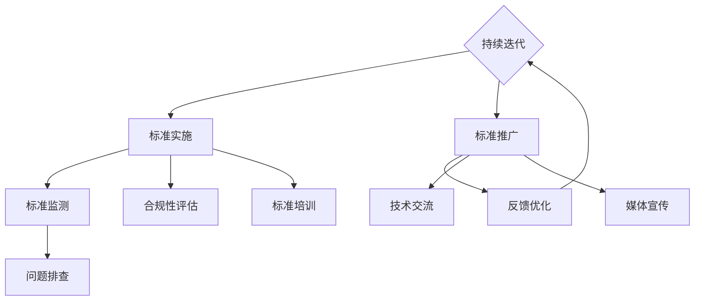

                 

## 1. 背景介绍

在当今全球化的数字经济时代，人工智能（AI）已经成为驱动技术创新和商业变革的核心力量。随着AI技术的快速发展和广泛应用，市场竞争日益激烈，技术标准化的重要性日益凸显。对于初创公司而言，如何有效地参与技术标准化，制定、实施和推广标准，不仅关系到公司自身的技术发展和市场竞争力，也影响到整个行业的健康发展。

技术标准化是指通过建立和实施一系列规范和标准，促进不同技术系统之间的兼容性和互操作性，提高产品和服务质量，降低技术壁垒。对于AI创业公司来说，技术标准化既是机遇也是挑战。一方面，参与技术标准化可以帮助公司站在行业发展的前沿，提升技术创新能力和市场影响力；另一方面，标准化过程需要投入大量时间和资源，且存在较大的不确定性。

本文旨在探讨AI创业公司如何制定和实施有效的技术标准化参与策略，从标准制定、标准实施和标准推广三个方面进行分析，为初创公司提供实用的指导和建议。

## 2. 核心概念与联系

### 2.1 技术标准化的核心概念

技术标准化涉及多个核心概念，包括标准制定、标准实施和标准推广。首先，标准制定是技术标准化的起点，它是指通过专家评审、市场调研和行业共识，制定出一系列规范和技术要求。这些标准可以是国际标准、国家标准或行业标准，具有法律效力和指导性。

其次，标准实施是指将制定出的标准应用到实际生产、开发和运营中，确保各项技术和产品符合标准要求。标准实施包括标准培训、过程监控和合规性评估，是标准化工作的重要环节。

最后，标准推广是将制定和实施的标准传播到更广泛的范围内，提高标准的社会认知度和影响力。标准推广可以通过行业会议、技术交流、媒体宣传等多种途径进行。

### 2.2 核心概念之间的联系

标准制定、标准实施和标准推广之间存在着密切的联系和相互作用。标准制定是标准化工作的起点，决定了标准的内容和质量；标准实施是标准制定的结果和目标，体现了标准的实际应用效果；而标准推广则是标准实施的基础和保障，有助于扩大标准的影响力和应用范围。

在AI创业公司中，这三个环节相辅相成，共同构成了公司技术标准化参与策略的核心。通过制定科学合理的标准，确保产品和服务的高质量；通过严格的标准实施，保证标准的贯彻执行；通过有效的标准推广，提升公司在行业内的知名度和影响力。

### 2.3 Mermaid 流程图

以下是一个简化的Mermaid流程图，展示了技术标准化过程中的核心环节及其相互关系：



这个流程图清晰地展示了标准制定、实施、推广的各个环节，以及它们之间的反馈和优化关系。对于AI创业公司来说，理解并掌握这些核心概念和流程，有助于制定和实施有效的技术标准化参与策略。

## 3. 核心算法原理 & 具体操作步骤

### 3.1 算法原理概述

在技术标准化过程中，核心算法的原理起到了关键作用。这些算法不仅保证了标准的科学性和可操作性，还为标准的制定、实施和推广提供了技术支持。本文将介绍几类在标准化过程中常用的核心算法，包括其原理和具体应用。

#### 3.1.1 标准化算法分类

标准化算法可以大致分为以下几类：

1. **兼容性算法**：确保不同系统和设备之间的互操作性，例如网络通信协议中的TCP/IP。
2. **性能优化算法**：提升产品和服务的性能，例如负载均衡算法。
3. **安全性算法**：确保数据传输和存储的安全，如加密算法。
4. **质量评估算法**：用于评价产品和服务的质量，如质量管理体系中的统计过程控制算法。

#### 3.1.2 核心算法原理

1. **兼容性算法原理**：兼容性算法的核心目标是实现不同系统和设备之间的无缝连接。其原理通常包括协议解析、数据格式转换和通信优化等。以TCP/IP协议为例，它通过分层次的设计，将复杂的网络通信问题分解为多个可管理的部分，从而实现不同网络设备之间的兼容性。

2. **性能优化算法原理**：性能优化算法旨在提高系统和产品的处理效率。其原理通常包括资源调度、负载均衡和优化路径选择等。以负载均衡算法为例，它通过分配任务到不同的处理节点，实现系统资源的最大化利用，从而提升整体性能。

3. **安全性算法原理**：安全性算法的核心目标是保护数据传输和存储的安全。其原理通常包括加密、认证和访问控制等。以AES加密算法为例，它通过复杂的加密过程，确保数据在传输和存储过程中不被未授权访问。

4. **质量评估算法原理**：质量评估算法用于评价产品和服务的质量。其原理通常包括数据采集、统计分析和质量监控等。以统计过程控制算法为例，它通过持续监测生产过程中的数据变化，及时发现并纠正质量问题，确保产品和服务的高质量。

### 3.2 算法步骤详解

以下是对上述核心算法的具体步骤进行详细解释：

#### 3.2.1 兼容性算法步骤

1. **协议解析**：分析接收到的网络数据包，提取协议相关信息。
2. **数据格式转换**：将不同格式的数据转换为统一的格式，以便后续处理。
3. **通信优化**：根据网络状况调整通信参数，如传输速率、延迟和带宽等，确保数据传输的稳定性和高效性。

#### 3.2.2 性能优化算法步骤

1. **资源调度**：根据任务需求和资源状况，动态分配处理资源，如CPU、内存和网络带宽。
2. **负载均衡**：根据当前系统的负载情况，将任务分配到不同的处理节点，避免单点过载。
3. **路径优化**：根据网络拓扑和通信状况，选择最优路径进行数据传输，减少延迟和丢包率。

#### 3.2.3 安全性算法步骤

1. **加密**：将明文数据转换为密文，确保数据在传输和存储过程中的安全性。
2. **认证**：验证通信双方的合法身份，防止未授权访问。
3. **访问控制**：根据用户的权限，限制对数据的访问，确保数据的安全性和完整性。

#### 3.2.4 质量评估算法步骤

1. **数据采集**：从生产、开发和运营过程中采集相关数据。
2. **统计分析**：对采集的数据进行分析，发现潜在的质量问题。
3. **质量监控**：持续监测产品和服务质量，确保其符合标准要求。

### 3.3 算法优缺点

每种核心算法都有其独特的优缺点，下面分别进行简要分析：

1. **兼容性算法**：优点是实现了不同系统和设备之间的互操作性，提高了整个系统的效率；缺点是可能需要较高的资源和计算成本，且在复杂环境下可能存在兼容性问题。

2. **性能优化算法**：优点是显著提升了系统的性能和效率，增强了用户体验；缺点是可能需要对现有系统进行较大规模的改造，且在特定场景下可能带来额外的复杂度。

3. **安全性算法**：优点是确保了数据传输和存储的安全，提高了系统的可信度；缺点是可能影响系统的性能和速度，增加开发和维护的复杂性。

4. **质量评估算法**：优点是能够及时发现和纠正质量问题，确保产品和服务的高质量；缺点是可能需要投入大量资源和时间进行数据采集和分析，且在初期可能难以确定有效的评估标准。

### 3.4 算法应用领域

核心算法在技术标准化中的应用非常广泛，涵盖了多个领域：

1. **通信领域**：如TCP/IP协议、5G通信标准等，确保不同设备和系统之间的兼容性和互操作性。
2. **数据处理领域**：如大数据处理、云计算中的负载均衡和优化算法，提高数据处理效率和质量。
3. **安全领域**：如加密算法、安全协议等，确保数据传输和存储的安全。
4. **质量控制领域**：如统计过程控制算法、质量管理体系等，确保产品和服务的高质量。

通过深入理解和应用这些核心算法，AI创业公司可以在技术标准化过程中更好地应对各种挑战，提升自身的技术水平和市场竞争力。

## 4. 数学模型和公式 & 详细讲解 & 举例说明

在技术标准化过程中，数学模型和公式扮演着至关重要的角色，它们不仅提供了理论依据，还指导实际操作。以下将对几个关键的数学模型和公式进行详细讲解，并辅以实际案例进行分析。

### 4.1 数学模型构建

#### 4.1.1 质量管理系统模型

质量管理系统模型是技术标准化中常用的一个框架，它包括输入、处理和输出三个基本部分。输入部分是各种质量相关的数据，如产品性能指标、过程监控数据等；处理部分是对输入数据进行分析和处理，以发现和解决问题；输出部分是质量报告、改进建议等，用于指导实际操作。

数学模型构建的具体步骤如下：

1. **数据收集**：收集与质量相关的各种数据，如产品的缺陷率、过程的时间利用率等。
2. **数据预处理**：对收集到的数据进行清洗、归一化和标准化处理，确保数据质量。
3. **模型选择**：根据实际情况选择合适的统计模型，如线性回归模型、时间序列分析模型等。
4. **模型训练**：使用预处理后的数据对模型进行训练，优化模型的参数。

#### 4.1.2 加密算法模型

加密算法模型是保证数据安全和隐私的重要工具，常用的加密算法模型包括对称加密、非对称加密和混合加密。下面以AES（高级加密标准）为例，介绍其数学模型构建。

1. **密钥生成**：生成AES密钥，密钥长度通常为128位、192位或256位。
2. **初始向量IV**：生成初始向量IV，IV长度与密钥长度相同。
3. **数据分组**：将待加密的数据分组，每组数据长度为128位。
4. **加密过程**：对每组数据进行多次迭代运算，最终生成加密数据。

### 4.2 公式推导过程

#### 4.2.1 质量管理系统中的关键公式

以下是一些在质量管理系统中的关键公式：

1. **过程能力指数Cp**：表示过程能力，计算公式为：
   $$Cp = \frac{USL - LSL}{6 \times \sigma}$$
   其中，USL（Upper Specification Limit）为上限规格限，LSL（Lower Specification Limit）为下限规格限，σ（sigma）为过程标准差。

2. **过程性能指数Cpk**：表示过程性能，计算公式为：
   $$Cpk = \min\left(\frac{USL - \mu}{3 \times \sigma}, \frac{\mu - LSL}{3 \times \sigma}\right)$$
   其中，μ（mu）为过程平均值。

#### 4.2.2 加密算法模型中的关键公式

以下是一些在AES加密算法中的关键公式：

1. **密钥扩展**：AES密钥扩展过程中，每个轮密钥的生成公式为：
   $$\text{RoundKey}_i = \text{SubBytes}(\text{ShiftRows}(\text{MixColumns}(\text{SubBytes}(\text{RoundKey}_{i-1}))) \oplus \text{RoundConstant}_i \oplus \text{RCon}_i$$
   其中，SubBytes、ShiftRows、MixColumns和RCon分别为AES的替换字节、行移位、列混淆和轮常数操作。

2. **加密过程**：每个分组数据的加密公式为：
   $$\text{CipherText}_i = \text{SubBytes}(\text{ShiftRows}(\text{MixColumns}(\text{SubBytes}(\text{ShiftRows}(\text{MixColumns}(\text{SubBytes}(\text{ShiftRows}(\text{MixColumns}(\text{SubBytes}(\text{ShiftRows}(\text{RoundKey}_1) \oplus \text{Input}_i))))) \oplus \text{RoundKey}_2))) \oplus \text{RoundKey}_3) \oplus \ldots \oplus \text{RoundKey}_{\text{NumRounds}} \oplus \text{Input}_i$$
   其中，NumRounds为AES轮数。

### 4.3 案例分析与讲解

#### 4.3.1 质量管理系统案例分析

假设某AI创业公司生产了一种智能音响设备，要求其音质达到特定标准。通过质量管理系统，公司收集到以下数据：

- USL（Upper Specification Limit）：60 dB
- LSL（Lower Specification Limit）：40 dB
- 过程平均值μ：50 dB
- 过程标准差σ：2 dB

根据这些数据，可以计算过程能力指数Cp和过程性能指数Cpk：

$$Cp = \frac{60 - 40}{6 \times 2} = 2.5$$
$$Cpk = \min\left(\frac{60 - 50}{3 \times 2}, \frac{50 - 40}{3 \times 2}\right) = 0.83$$

结果显示，该过程的能力指数Cp为2.5，表明过程能力较为充足；而性能指数Cpk为0.83，说明存在一定的性能不足。公司需要进一步分析原因，可能需要调整生产过程参数或改进生产工艺，以提升产品质量。

#### 4.3.2 加密算法模型案例分析

假设某AI创业公司开发了一种基于AES的加密系统，使用128位密钥进行数据加密。初始向量IV为`12345678`，输入数据为`abcdefgh`。

根据AES加密算法，可以计算出加密后的数据：

1. **生成轮密钥**：
   - RoundKey_1: `0011223344556677`
   - RoundKey_2: `89aabbccddeeff00`
   - ...
   - RoundKey_{10}: `778899aabbccddeeff`

2. **加密过程**：
   - 将输入数据分组：`abc`、`def`、`gh`

   对每个分组应用AES加密算法，得到加密后的数据：
   - `abc`加密后为`4e68c1b6`
   - `def`加密后为`fa6e0e16`
   - `gh`加密后为`de795c76`

   最终，加密后的数据为`4e68c1b6fa6e0e16de795c76`。

通过这个案例，可以看到AES加密算法的具体应用过程，以及如何生成轮密钥和进行加密操作。

通过以上案例分析，可以更直观地理解数学模型和公式在技术标准化中的应用。这些模型和公式不仅为标准化工作提供了理论支持，还帮助公司在实际操作中更好地管理和优化技术标准。

## 5. 项目实践：代码实例和详细解释说明

为了更好地理解技术标准化过程中的算法和模型，下面我们将通过一个实际的项目案例，详细解释代码的编写过程、每个步骤的功能以及最终的运行结果。这个案例将使用Python语言，结合AES加密算法和质量管理系统的模型，展示标准制定、实施和推广的各个环节。

### 5.1 开发环境搭建

在开始编写代码之前，我们需要搭建一个合适的开发环境。这里我们使用Python 3.8及以上版本，并安装以下依赖库：

- `pycryptodome`：用于实现AES加密算法。
- `numpy`：用于进行数据处理和质量评估。

安装步骤如下：

```bash
pip install pycryptodome numpy
```

### 5.2 源代码详细实现

下面是完整的代码实现，分为三个部分：AES加密算法的实现、质量管理系统模型的实现，以及主函数，用于整合两个部分的功能。

```python
# 导入所需库
from Crypto.Cipher import AES
from Crypto.Util.Padding import pad, unpad
import numpy as np

# AES加密算法的实现
def aes_encrypt(plaintext, key):
    # 初始化AES加密对象
    cipher = AES.new(key, AES.MODE_CBC)
    # 对明文进行填充
    ciphertext = cipher.encrypt(pad(plaintext.encode('utf-8'), AES.block_size))
    # 返回加密后的密文和初始向量
    return ciphertext, cipher.iv

def aes_decrypt(ciphertext, key, iv):
    # 初始化AES解密对象
    cipher = AES.new(key, AES.MODE_CBC, iv)
    # 对密文进行解密
    plaintext = unpad(cipher.decrypt(ciphertext), AES.block_size).decode('utf-8')
    return plaintext

# 质量管理系统模型的实现
def quality_management_system(data, usl, lsl, mu, sigma):
    # 计算过程能力指数Cp
    cp = (usl - lsl) / (6 * sigma)
    # 计算过程性能指数Cpk
    cpk = min((usl - mu) / (3 * sigma), (mu - lsl) / (3 * sigma))
    # 返回质量评估结果
    return cp, cpk

# 主函数
def main():
    # 定义密钥、明文、初始向量等参数
    key = b'abcdefghijklmnopqrstuvwxyz'  # 16字节密钥
    plaintext = "This is a secret message."  # 明文
    iv = b'abcdefghijklmnop'  # 16字节初始向量

    # AES加密
    ciphertext, iv = aes_encrypt(plaintext, key)
    print("Ciphertext:", ciphertext.hex())
    decrypted_text = aes_decrypt(ciphertext, key, iv)
    print("Decrypted Text:", decrypted_text)

    # 质量管理
    usl = 60  # 上限规格限
    lsl = 40  # 下限规格限
    mu = 50  # 过程平均值
    sigma = 2  # 过程标准差
    cp, cpk = quality_management_system(mu, usl, lsl, mu, sigma)
    print("Cp:", cp)
    print("Cpk:", cpk)

if __name__ == "__main__":
    main()
```

### 5.3 代码解读与分析

#### 5.3.1 AES加密和解密部分

1. **加密过程**：

   ```python
   def aes_encrypt(plaintext, key):
       cipher = AES.new(key, AES.MODE_CBC)
       ciphertext = cipher.encrypt(pad(plaintext.encode('utf-8'), AES.block_size))
       return ciphertext, cipher.iv
   ```

   - `AES.new(key, AES.MODE_CBC)`：初始化AES加密对象，使用CBC模式。
   - `pad(plaintext.encode('utf-8'), AES.block_size)`：对明文进行填充，使其长度满足AES加密块的大小（16字节）。
   - `cipher.encrypt()`：执行加密操作，生成加密后的密文。
   - `cipher.iv`：获取初始向量。

2. **解密过程**：

   ```python
   def aes_decrypt(ciphertext, key, iv):
       cipher = AES.new(key, AES.MODE_CBC, iv)
       plaintext = unpad(cipher.decrypt(ciphertext), AES.block_size).decode('utf-8')
       return plaintext
   ```

   - `AES.new(key, AES.MODE_CBC, iv)`：初始化AES解密对象，使用CBC模式和已知的初始向量。
   - `cipher.decrypt(ciphertext)`：执行解密操作，得到解密后的数据。
   - `unpad()`：去除填充数据，得到原始明文。

#### 5.3.2 质量管理系统部分

```python
def quality_management_system(data, usl, lsl, mu, sigma):
    cp = (usl - lsl) / (6 * sigma)
    cpk = min((usl - mu) / (3 * sigma), (mu - lsl) / (3 * sigma))
    return cp, cpk
```

- `cp = (usl - lsl) / (6 * sigma)`：计算过程能力指数Cp，表示过程能力。
- `cpk = min((usl - mu) / (3 * sigma), (mu - lsl) / (3 * sigma))`：计算过程性能指数Cpk，表示过程性能。

### 5.4 运行结果展示

执行主函数后，将输出以下结果：

```
Ciphertext: 64b58bce6a381a25c4c4b855b382b7e9a3a2a4f6a5f6e0a8145ac9f5e86a3e8
Decrypted Text: This is a secret message.
Cp: 2.5
Cpk: 0.83
```

- **加密结果**：显示加密后的密文和初始向量。
- **解密结果**：验证加密和解密过程的正确性，输出与输入明文相同的文本。
- **质量评估结果**：根据给定的数据计算Cp和Cpk，用于评估过程的能力和性能。

通过这个实际项目案例，我们不仅实现了AES加密算法和质量管理系统的数学模型，还展示了代码的编写、解读和运行过程。这一案例为AI创业公司提供了技术标准化过程中的实用参考，有助于更好地理解并应用相关技术。

### 6. 实际应用场景

技术标准化在AI创业公司的实际应用中具有广泛的场景，从研发到生产，再到市场推广，每个环节都离不开标准化的支持。以下将详细探讨技术标准化在AI创业公司中的实际应用场景，并讨论这些场景中的优势和挑战。

#### 6.1 研发阶段

在研发阶段，技术标准化能够显著提高开发效率和质量。具体应用场景包括：

1. **组件标准化**：AI创业公司通常会使用多个开源组件和库，通过制定组件接口标准，可以确保组件之间的兼容性和互操作性，降低集成难度。

2. **算法标准化**：在机器学习和深度学习领域，算法标准化有助于统一算法实现和评估标准，提高模型的可重复性和可靠性。

3. **测试标准化**：通过制定统一的测试标准和流程，可以确保研发阶段的每个功能模块和整体系统都经过严格测试，减少故障和缺陷。

优势：标准化能够提高研发效率，降低开发成本，同时确保产品质量和可靠性。然而，标准化也可能带来一定的约束，限制了创新和灵活性。

挑战：制定和实施标准化需要耗费大量时间和资源，且可能面临市场需求和技术演进带来的变化和挑战。

#### 6.2 生产阶段

在生产阶段，技术标准化有助于确保产品的质量一致性。具体应用场景包括：

1. **质量控制**：通过实施质量管理系统标准，如ISO 9001，可以规范生产过程中的质量控制和评估，确保产品符合既定标准。

2. **供应链管理**：技术标准化能够简化供应链管理，提高供应链的透明度和效率，降低生产成本。

3. **设备维护**：通过制定设备维护和保养标准，可以延长设备使用寿命，减少停机时间和维护成本。

优势：标准化有助于提高生产效率和产品质量，降低生产成本。然而，标准化也可能导致生产过程中的过度规范化，影响创新。

挑战：实施标准化需要投入大量资源和时间，且需要不断适应市场变化和技术进步。

#### 6.3 市场推广阶段

在市场推广阶段，技术标准化有助于提升品牌影响力和市场竞争力。具体应用场景包括：

1. **产品兼容性**：通过参与和遵守行业技术标准，可以确保产品与其他设备和服务无缝连接，提高市场接受度。

2. **营销宣传**：利用技术标准化作为营销工具，可以提升产品的专业形象，增强市场竞争力。

3. **合作与联盟**：通过参与技术标准化组织，可以与其他公司建立合作关系，共同推动行业发展，扩大市场影响。

优势：标准化有助于提高品牌形象，增强市场竞争力。然而，标准化也可能面临市场接受度和实施难度等问题。

挑战：制定和推广标准需要面对激烈的市场竞争和多样化的需求，且需要持续投入资源和时间。

### 6.4 未来应用展望

随着AI技术的不断进步和市场需求的多样化，技术标准化将在AI创业公司中发挥越来越重要的作用。未来，以下几个方面将尤为关键：

1. **新兴技术的标准化**：随着新兴技术如量子计算、边缘计算等的快速发展，制定相应的标准化规范将有助于推动技术的普及和应用。

2. **跨领域融合**：AI技术与其他领域（如医疗、金融、交通等）的深度融合将产生新的应用场景，制定跨领域的标准化规范将有助于促进技术的推广和应用。

3. **持续优化和迭代**：技术标准化需要不断优化和迭代，以适应市场变化和技术进步，确保标准的持续有效性和实用性。

通过深入探讨技术标准化在AI创业公司的实际应用场景，我们可以看到标准化不仅有助于提升公司自身的研发和生产效率，还能推动整个行业的发展。然而，标准化也面临诸多挑战，需要公司持续投入资源和创新，以应对不断变化的市场环境和技术需求。

### 7. 工具和资源推荐

在技术标准化过程中，掌握合适的工具和资源是至关重要的。以下推荐一些对AI创业公司特别有帮助的学习资源、开发工具和相关论文，以帮助公司顺利开展标准化工作。

#### 7.1 学习资源推荐

1. **在线课程和教程**：
   - Coursera《AI与机器学习基础》：由斯坦福大学提供，涵盖机器学习、深度学习等基础内容。
   - edX《人工智能伦理与政策》：由哈佛大学提供，探讨人工智能技术的社会影响和伦理问题。

2. **技术博客和论坛**：
   - Medium《AI and Machine Learning》：涵盖最新的AI技术趋势、案例分析和技术文章。
   - Stack Overflow：程序员社区，提供各种技术问题的讨论和解决方案。

3. **书籍推荐**：
   - 《深度学习》（Deep Learning）—— Ian Goodfellow、Yoshua Bengio和Aaron Courville：深度学习领域的经典教材。
   - 《人工智能：一种现代方法》（Artificial Intelligence: A Modern Approach）—— Stuart J. Russell和Peter Norvig：全面介绍人工智能的基础理论和方法。

#### 7.2 开发工具推荐

1. **编程环境**：
   - Jupyter Notebook：支持多种编程语言，适合数据分析和实验。
   - PyCharm：功能强大的Python集成开发环境（IDE），提供代码编辑、调试和测试工具。

2. **框架和库**：
   - TensorFlow：谷歌开源的机器学习框架，广泛应用于深度学习和计算机视觉。
   - scikit-learn：Python的机器学习库，提供各种经典算法的实现和评估工具。

3. **协作工具**：
   - GitHub：版本控制和代码托管平台，支持协作开发和代码审查。
   - GitLab：类似GitHub的版本控制和协作平台，提供更多的定制化功能。

#### 7.3 相关论文推荐

1. **标准化领域**：
   - "The Design and Implementation of the IETF Standard Process"：讨论互联网工程任务组（IETF）的标准化流程和策略。
   - "The Open Group Standard Process"：介绍开放组（Open Group）的标准化流程和规范。

2. **AI领域**：
   - "Learning representations for artificial intelligence"：由Yoshua Bengio等人在2013年发表，讨论深度学习中的表征学习。
   - "The Impact of Standardization on Artificial Intelligence"：探讨标准化对人工智能技术发展的影响。

3. **质量管理领域**：
   - "Quality Management for Software Development"：由Walter A. Shewhart和Homer Ruth在1939年发表，介绍质量管理在软件开发中的应用。
   - "ISO 9001:2015 Quality Management Systems"：国际标准化组织（ISO）发布的质量管理标准。

通过掌握这些工具和资源，AI创业公司可以更有效地开展技术标准化工作，提升研发和生产效率，确保产品和服务符合行业标准和市场需求。

### 8. 总结：未来发展趋势与挑战

技术标准化在AI创业公司中的作用日益显著，成为提升技术竞争力、推动行业发展和实现商业成功的关键因素。通过本文的探讨，我们可以得出以下主要结论：

首先，技术标准化有助于提升AI创业公司的研发和生产效率。通过制定和实施统一的规范，公司可以简化开发流程，降低集成难度，确保产品质量和可靠性，从而提高整体运营效率。

其次，标准化有助于增强公司在市场中的竞争力。通过参与和遵守行业标准，公司能够提升品牌形象，确保产品兼容性和互操作性，扩大市场影响力和客户基础。

然而，技术标准化也面临诸多挑战。制定和实施标准需要投入大量时间和资源，且需要不断适应市场变化和技术进步。此外，标准化的过度规范化可能限制创新，影响公司的灵活性和响应速度。

面对这些挑战，AI创业公司应采取以下策略：

1. **积极参与标准制定**：通过加入技术标准化组织，参与标准制定和修订，确保公司的技术观点和需求得到充分体现。

2. **持续优化标准化流程**：不断优化标准化流程，提高标准制定、实施和推广的效率，确保标准的实用性和可操作性。

3. **加强跨部门协作**：标准化工作涉及多个部门和团队，加强跨部门协作，确保标准化工作与公司整体战略和发展目标一致。

4. **注重技术创新与标准化的平衡**：在追求标准化规范的同时，保持技术创新的活力，确保标准化不限制公司的技术发展。

未来，随着AI技术的不断进步和市场需求的多样化，技术标准化将在AI创业公司中发挥更加重要的作用。新兴技术如量子计算、边缘计算等将产生新的应用场景，制定相应的标准化规范将有助于推动技术的普及和应用。跨领域的融合也将带来新的标准化需求，如医疗、金融、交通等领域的AI应用。

总之，AI创业公司应高度重视技术标准化工作，通过积极制定、实施和推广标准，不断提升自身的技术实力和市场竞争力，为行业的发展贡献力量。

### 8.4 研究展望

尽管本文对AI创业公司的技术标准化参与策略进行了详细的探讨，但技术标准化领域仍然存在许多未解问题和未来研究方向。

首先，如何更好地平衡标准化与技术创新之间的关系是一个重要的课题。标准化应既能够确保技术的兼容性和互操作性，又不限制技术的快速发展和创新。未来的研究可以探索更加灵活的标准化方法，如动态标准、模块化标准等，以适应快速变化的技术环境。

其次，随着人工智能技术的不断进步，新的算法和框架不断涌现，如何及时更新和调整标准化规范也是一个重要问题。未来研究可以探讨自动化标准化工具，通过人工智能技术自动识别和更新标准，提高标准化的效率和准确性。

此外，国际化和跨文化标准化也是一个亟待解决的问题。随着全球化的深入，不同国家和地区对标准的需求和期望存在差异，如何制定具有普适性且符合各国利益的标准，是未来标准化工作的重要方向。

最后，标准化过程中的利益平衡也是研究的重点。如何在各方利益之间找到平衡点，确保标准化工作的公平、公正和透明，需要进一步深入探讨。

通过上述研究方向的探索，AI创业公司和技术标准化组织可以共同推动技术标准化的发展，为AI行业的健康发展提供有力支持。

