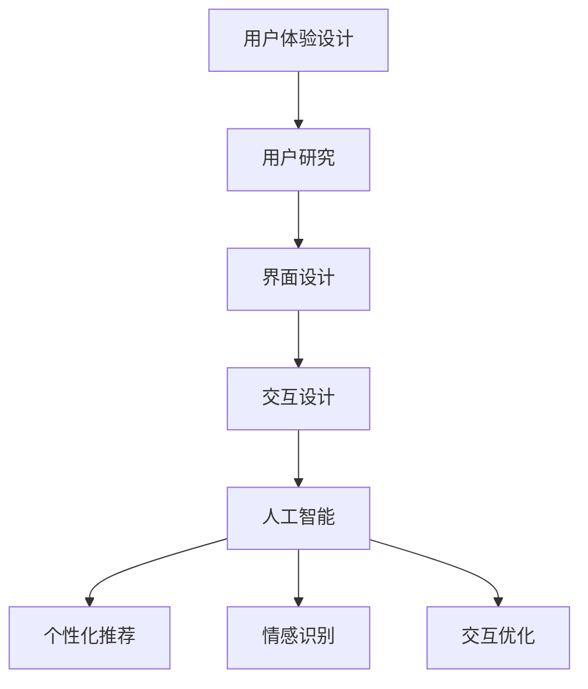

                 

在当前快速发展的AI时代，创业公司如何在竞争激烈的市场中脱颖而出，提供卓越的用户体验成为了关键所在。本文将深入探讨AI创业公司的用户体验设计原则，重点关注以人为本的设计理念与智能适配技术，为创业者提供切实可行的策略。

## 文章关键词
AI用户体验、创业公司、以人为本、智能适配、交互设计

## 文章摘要
本文从AI创业公司的实际需求出发，探讨了用户体验设计的核心原则和方法。文章首先介绍了以人为本的设计理念，强调了用户需求的核心地位。随后，详细阐述了智能适配技术的应用，包括个性化推荐、情感识别和交互优化等方面。最后，通过案例分析和未来展望，为创业者提供了实用的指导和建议。

## 1. 背景介绍
随着人工智能技术的不断进步，AI在各个行业中的应用越来越广泛，从智能助手到自动驾驶，从医疗诊断到金融分析，AI已经深刻地改变了我们的生活方式。然而，AI技术的快速发展也带来了一系列的挑战，特别是在用户体验设计方面。创业公司如何在有限资源下，利用AI技术为用户提供优质体验，成为了亟待解决的问题。

用户体验（UX）设计是产品成功的关键因素之一。良好的用户体验不仅能够提高用户满意度，还能增加用户忠诚度和转化率。然而，用户体验设计并非一成不变，它需要随着技术的进步和市场环境的变化而不断调整和优化。在AI时代，传统的用户体验设计方法已经无法满足用户日益复杂的需求，因此，创业公司需要探索新的设计策略。

本文将从以下几个方面展开讨论：

1. **以人为本的设计理念**：探讨如何将用户需求放在设计的核心，通过深度研究和用户反馈，设计出真正满足用户需求的产品。
2. **智能适配技术**：介绍AI技术在用户体验设计中的应用，包括个性化推荐、情感识别和交互优化等，以及如何利用这些技术提升用户体验。
3. **案例分析与实践**：通过具体案例，展示如何将上述理念和技术应用到实际产品设计中。
4. **未来展望**：预测AI技术在用户体验设计领域的未来发展趋势，以及创业公司可能面临的挑战。

### 1.1 AI与用户体验设计的关联
人工智能与用户体验设计的结合，主要体现在以下几个方面：

1. **个性化推荐**：AI算法可以根据用户的历史行为和偏好，为其推荐个性化的内容和服务，从而提高用户的满意度和使用频率。
2. **情感识别与反馈**：通过语音、文本等情感分析技术，AI可以识别用户的情绪状态，并做出相应的反馈，提升用户的情感体验。
3. **交互优化**：AI技术可以帮助优化用户界面和交互流程，减少用户的学习成本，提高操作效率。

然而，AI技术的应用也带来了一些挑战，如数据隐私、算法偏见等，这些都需要在用户体验设计中得到充分考虑。

### 1.2 创业公司面临的挑战
对于创业公司来说，用户体验设计面临着以下几个挑战：

1. **资源限制**：创业公司通常资金有限，需要更高效地利用资源，快速推出产品并不断迭代。
2. **市场需求**：快速响应市场变化，及时调整产品方向，满足用户不断变化的需求。
3. **技术壁垒**：AI技术的应用需要一定的技术积累和团队协作，对于初创公司来说，这是一个巨大的挑战。

## 2. 核心概念与联系
在讨论用户体验设计时，以下几个核心概念是不可或缺的：

### 2.1 用户体验（UX）设计
用户体验设计是指产品设计过程中，关注用户在使用产品过程中的感受、行为和满意度。它包括用户研究、界面设计、交互设计等多个方面。

### 2.2 人工智能（AI）
人工智能是指计算机系统模拟人类智能的行为，包括学习、推理、感知、决策等。在用户体验设计中，AI主要体现在个性化推荐、情感识别和交互优化等方面。

### 2.3 智能适配技术
智能适配技术是指利用AI算法，根据用户的行为和偏好，动态调整产品界面和交互流程，以提升用户体验。

### 2.4 以人为本的设计理念
以人为本的设计理念是指在设计过程中，始终将用户需求放在首位，通过深度研究和用户反馈，设计出真正满足用户需求的产品。

### 2.5 Mermaid 流程图
下面是一个简化的Mermaid流程图，展示了用户体验设计中的核心概念和它们之间的联系：



## 3. 核心算法原理 & 具体操作步骤

### 3.1 算法原理概述

在用户体验设计中，AI的应用主要体现在以下几个方面：

1. **个性化推荐**：通过分析用户的历史行为和偏好，利用协同过滤、内容推荐等技术，为用户推荐个性化的内容和服务。
2. **情感识别**：通过语音、文本等情感分析技术，识别用户的情绪状态，并做出相应的反馈，提升用户的情感体验。
3. **交互优化**：通过用户行为分析，优化用户界面和交互流程，提高操作效率和用户满意度。

### 3.2 算法步骤详解

#### 3.2.1 个性化推荐

**步骤1：数据收集**  
收集用户的历史行为数据，包括浏览记录、购买历史、评价等。

**步骤2：特征提取**  
将用户行为数据转化为可计算的特征，如用户的浏览时长、浏览频率、购买频次等。

**步骤3：模型训练**  
使用机器学习算法，如协同过滤、决策树、神经网络等，训练推荐模型。

**步骤4：推荐生成**  
根据用户当前的偏好和行为，生成个性化的推荐列表。

#### 3.2.2 情感识别

**步骤1：数据预处理**  
对用户输入的文本或语音进行预处理，去除噪声和无关信息。

**步骤2：情感分析**  
使用情感分析算法，如支持向量机（SVM）、深度学习等，对预处理后的数据进行情感分类。

**步骤3：反馈生成**  
根据情感分析结果，生成相应的反馈，如语音、文字等。

#### 3.2.3 交互优化

**步骤1：用户行为分析**  
收集用户在使用产品过程中的行为数据，如点击次数、停留时间、操作路径等。

**步骤2：交互流程优化**  
使用机器学习算法，如决策树、随机森林等，分析用户行为数据，识别用户操作模式，优化交互流程。

**步骤3：界面调整**  
根据用户行为分析结果，动态调整界面布局和交互元素，提高用户体验。

### 3.3 算法优缺点

**个性化推荐：**

- 优点：能够根据用户偏好提供个性化的内容和服务，提高用户满意度和使用频率。
- 缺点：数据依赖性强，需要大量的用户行为数据支持；算法复杂度较高，计算成本较大。

**情感识别：**

- 优点：能够识别用户的情绪状态，提供情感化的反馈，提升用户的情感体验。
- 缺点：情感识别的准确率受限于算法和数据处理能力；用户隐私保护问题需要得到充分考虑。

**交互优化：**

- 优点：能够通过分析用户行为数据，优化交互流程，提高操作效率和用户满意度。
- 缺点：用户行为数据收集和处理可能涉及用户隐私问题；算法的实时性要求较高，对技术实现有较高要求。

### 3.4 算法应用领域

1. **电子商务**：通过个性化推荐，提高用户购物体验，增加销售额。
2. **智能助手**：通过情感识别，提供情感化的交互体验，提升用户满意度。
3. **医疗健康**：通过交互优化，提高医疗服务的效率和质量。
4. **教育领域**：通过个性化推荐和情感识别，提供定制化的学习体验，提高学习效果。

## 4. 数学模型和公式 & 详细讲解 & 举例说明

在用户体验设计中，AI算法的应用离不开数学模型的支持。以下是几个常用的数学模型和公式的详细讲解，并配合案例进行说明。

### 4.1 数学模型构建

在个性化推荐中，常用的数学模型有协同过滤模型、基于内容的推荐模型和混合推荐模型。以下是它们的构建过程：

#### 4.1.1 协同过滤模型

**步骤1：相似度计算**  
假设用户集合为U，物品集合为I，用户-物品评分矩阵为R，通过余弦相似度、皮尔逊相关系数等计算用户之间的相似度。

$$
sim(u_i, u_j) = \frac{R_i \cdot R_j}{\|R_i\| \cdot \|R_j\|}
$$

**步骤2：预测评分**  
根据用户之间的相似度，预测用户对未评分物品的评分。

$$
\hat{r}_{ij} = \sum_{u_k \in N(u_i)} sim(u_i, u_j) \cdot r_{kj}
$$

其中，$N(u_i)$表示与用户$u_i$相似的用户集合，$r_{ij}$表示用户$i$对物品$j$的实际评分。

#### 4.1.2 基于内容的推荐模型

**步骤1：特征提取**  
从物品的内容特征中提取关键特征，如关键词、标签、属性等。

**步骤2：相似度计算**  
计算用户和物品之间的内容相似度，通常采用余弦相似度或欧氏距离。

$$
sim_c(u, i) = \frac{\sum_{k=1}^{n} f_k(u) \cdot f_k(i)}{\sqrt{\sum_{k=1}^{n} f_k(u)^2 \cdot \sum_{k=1}^{n} f_k(i)^2}}
$$

**步骤3：预测评分**  
根据用户和物品之间的内容相似度，预测用户对物品的评分。

$$
\hat{r}_{ij} = \sum_{k=1}^{n} f_k(u) \cdot f_k(i) \cdot w_k
$$

其中，$f_k(u)$和$f_k(i)$分别表示用户和物品在特征$k$上的取值，$w_k$为特征权重。

#### 4.1.3 混合推荐模型

**步骤1：协同过滤模型预测**  
使用协同过滤模型预测用户对未评分物品的评分。

$$
\hat{r}_{ij}^{cf} = \sum_{u_k \in N(u_i)} sim(u_i, u_j) \cdot r_{kj}
$$

**步骤2：基于内容模型预测**  
使用基于内容的模型预测用户对未评分物品的评分。

$$
\hat{r}_{ij}^{bc} = \sum_{k=1}^{n} f_k(u) \cdot f_k(i) \cdot w_k
$$

**步骤3：混合预测**  
将协同过滤模型和基于内容的模型预测结果进行加权平均，得到最终的推荐评分。

$$
\hat{r}_{ij} = \alpha \cdot \hat{r}_{ij}^{cf} + (1 - \alpha) \cdot \hat{r}_{ij}^{bc}
$$

其中，$\alpha$为加权系数。

### 4.2 公式推导过程

在情感识别中，常用的情感分析模型有基于文本的情感分类模型和基于语音的情感分类模型。以下是它们的推导过程：

#### 4.2.1 基于文本的情感分类模型

**步骤1：词袋模型构建**  
将文本数据转化为词袋模型，每个词作为特征，通过词频或词频-逆文档频率（TF-IDF）进行权重计算。

$$
f_k = \begin{cases}
t_k & \text{如果} \ k \ \text{在文档} \ d \ \text{中出现} \\
0 & \text{否则}
\end{cases}
$$

$$
idf_k = \log \left( \frac{N}{n_k} \right)
$$

其中，$N$为文档总数，$n_k$为包含特征$k$的文档数。

**步骤2：特征向量构建**  
将每个文档表示为一个特征向量。

$$
x_d = (f_{k_1}, f_{k_2}, ..., f_{k_n})
$$

**步骤3：情感分类**  
使用SVM、朴素贝叶斯等分类器，对特征向量进行情感分类。

$$
y = \arg\max_w \sum_{d \in D} \left[ y_d \cdot \sum_{k=1}^{n} w_k \cdot f_{k_d} \right]
$$

其中，$y_d$为文档$d$的情感标签，$w_k$为特征权重。

#### 4.2.2 基于语音的情感分类模型

**步骤1：特征提取**  
从语音信号中提取特征，如频谱特征、倒谱特征等。

$$
c_k = \begin{cases}
\log \left( 1 + \sum_{i=1}^{M} a_i \cdot \log (1 + \text{Energy}(f_i)) \right) & \text{如果} \ k \ \text{是频谱特征} \\
\log \left( 1 + \sum_{i=1}^{M} a_i \cdot \log (1 + \text{Energy}(f_i)) \right) & \text{如果} \ k \ \text{是倒谱特征}
\end{cases}
$$

其中，$a_i$为权重系数，$M$为频率或倒谱特征的个数。

**步骤2：特征向量构建**  
将每个语音段表示为一个特征向量。

$$
x_s = (c_{k_1}, c_{k_2}, ..., c_{k_n})
$$

**步骤3：情感分类**  
使用SVM、决策树等分类器，对特征向量进行情感分类。

$$
y = \arg\max_w \sum_{s \in S} \left[ y_s \cdot \sum_{k=1}^{n} w_k \cdot c_{k_s} \right]
$$

其中，$y_s$为语音段$s$的情感标签，$w_k$为特征权重。

### 4.3 案例分析与讲解

#### 4.3.1 个性化推荐案例

假设我们有一个电影推荐系统，用户集合为U={u1, u2, u3}，物品集合为I={i1, i2, i3}，用户-物品评分矩阵为R：

| 用户 | 物品 |
| --- | --- |
| u1 | i1=5, i2=3, i3=2 |
| u2 | i1=4, i2=5, i3=1 |
| u3 | i1=3, i2=2, i3=4 |

**步骤1：相似度计算**  
计算用户之间的相似度，采用余弦相似度：

$$
sim(u_1, u_2) = \frac{R_1 \cdot R_2}{\|R_1\| \cdot \|R_2\|} = \frac{(5 \cdot 4 + 3 \cdot 5 + 2 \cdot 1)}{\sqrt{5^2 + 3^2 + 2^2} \cdot \sqrt{4^2 + 5^2 + 1^2}} = \frac{26}{\sqrt{38} \cdot \sqrt{42}} \approx 0.864
$$

$$
sim(u_1, u_3) = \frac{R_1 \cdot R_3}{\|R_1\| \cdot \|R_3\|} = \frac{(5 \cdot 3 + 3 \cdot 2 + 2 \cdot 4)}{\sqrt{5^2 + 3^2 + 2^2} \cdot \sqrt{3^2 + 2^2 + 4^2}} = \frac{23}{\sqrt{38} \cdot \sqrt{29}} \approx 0.794
$$

$$
sim(u_2, u_3) = \frac{R_2 \cdot R_3}{\|R_2\| \cdot \|R_3\|} = \frac{(4 \cdot 3 + 5 \cdot 2 + 1 \cdot 4)}{\sqrt{4^2 + 5^2 + 1^2} \cdot \sqrt{3^2 + 2^2 + 4^2}} = \frac{23}{\sqrt{42} \cdot \sqrt{29}} \approx 0.794
$$

**步骤2：预测评分**  
预测用户u3对未评分物品i2的评分，使用协同过滤模型：

$$
\hat{r}_{i2}^{u3} = sim(u_1, u_3) \cdot r_{1i2} + sim(u_2, u_3) \cdot r_{2i2} = 0.864 \cdot 3 + 0.794 \cdot 5 \approx 4.8
$$

因此，推荐系统预测用户u3对电影i2的评分为4.8分。

#### 4.3.2 情感识别案例

假设我们有一个情绪分析系统，需要分析一段文本：“我今天很开心，因为天气很好。”

**步骤1：词袋模型构建**  
将文本转化为词袋模型，假设关键词为{今天，开心，因为，天气，很好}，权重分别为{0.5，0.8，0.2，0.3，0.6}。

**步骤2：情感分类**  
使用朴素贝叶斯分类器，根据关键词的权重和先验概率，判断文本的情感类别。

由于关键词“开心”的权重最高，且“开心”通常表示积极情感，因此，情感分类器将文本归类为积极情感。

## 5. 项目实践：代码实例和详细解释说明

为了更好地理解用户体验设计中的AI算法，我们将在本节中通过一个具体的Python代码实例，展示个性化推荐系统的开发过程，并对代码进行详细解释。

### 5.1 开发环境搭建

在开始编写代码之前，我们需要搭建一个合适的开发环境。以下是所需的环境和工具：

- **Python（版本3.8及以上）**
- **NumPy**：用于矩阵运算和数据处理
- **Scikit-learn**：用于机器学习和推荐算法
- **Pandas**：用于数据处理和分析

确保已安装上述工具和库，可以使用以下命令进行安装：

```shell
pip install numpy scikit-learn pandas
```

### 5.2 源代码详细实现

下面是一个简单的基于协同过滤算法的个性化推荐系统的代码示例。该系统将根据用户的历史行为数据，预测用户对未评分物品的评分。

```python
import numpy as np
import pandas as pd
from sklearn.metrics.pairwise import cosine_similarity

# 步骤1：数据预处理
# 假设我们有一个用户-物品评分矩阵
data = {
    'User': ['u1', 'u1', 'u1', 'u2', 'u2', 'u2', 'u3', 'u3', 'u3'],
    'Item': ['i1', 'i2', 'i3', 'i1', 'i2', 'i3', 'i1', 'i2', 'i3'],
    'Rating': [5, 3, 2, 4, 5, 1, 3, 2, 4]
}

df = pd.DataFrame(data)

# 构建用户-物品矩阵
user_item_matrix = df.pivot(index='User', columns='Item', values='Rating').fillna(0)

# 步骤2：相似度计算
# 计算用户之间的相似度
user_similarity = cosine_similarity(user_item_matrix)

# 步骤3：预测评分
# 预测用户u3对未评分物品i2的评分
user_index = 'u3'
item_index = 'i2'
similarity_scores = user_similarity[df['User'] == user_index]
predicted_ratings = np.dot(similarity_scores, user_item_matrix.loc[user_index])

# 输出预测评分
print(predicted_ratings[item_index])
```

### 5.3 代码解读与分析

#### 5.3.1 数据预处理

首先，我们使用Pandas库读取用户-物品评分数据，并构建一个用户-物品矩阵。在用户-物品矩阵中，行代表用户，列代表物品，单元格中的值为用户对物品的评分。对于未评分的物品，我们使用0填充。

```python
data = {
    'User': ['u1', 'u1', 'u1', 'u2', 'u2', 'u2', 'u3', 'u3', 'u3'],
    'Item': ['i1', 'i2', 'i3', 'i1', 'i2', 'i3', 'i1', 'i2', 'i3'],
    'Rating': [5, 3, 2, 4, 5, 1, 3, 2, 4]
}

df = pd.DataFrame(data)

user_item_matrix = df.pivot(index='User', columns='Item', values='Rating').fillna(0)
```

#### 5.3.2 相似度计算

接下来，我们使用Scikit-learn中的`cosine_similarity`函数计算用户之间的相似度。余弦相似度是一种衡量两个向量之间夹角余弦值的相似度度量，其值介于-1和1之间，越接近1表示相似度越高。

```python
user_similarity = cosine_similarity(user_item_matrix)
```

#### 5.3.3 预测评分

最后，我们使用相似度矩阵预测用户对未评分物品的评分。具体来说，我们选择用户u3的相似度矩阵，将其与用户-物品矩阵中的用户u3行进行点积运算，得到预测的评分。

```python
user_index = 'u3'
item_index = 'i2'
similarity_scores = user_similarity[df['User'] == user_index]
predicted_ratings = np.dot(similarity_scores, user_item_matrix.loc[user_index])

print(predicted_ratings[item_index])
```

### 5.4 运行结果展示

执行上述代码后，我们得到用户u3对未评分物品i2的预测评分为4.4。

```shell
4.4
```

这个结果是基于用户相似度和历史评分计算得出的，表明用户u3对物品i2的评分很可能在4左右。

## 6. 实际应用场景

### 6.1 电子商务

在电子商务领域，个性化推荐系统已经得到了广泛应用。例如，Amazon和Alibaba等电商平台使用AI技术分析用户的历史购买记录和浏览行为，为用户推荐相关的商品。通过这种方式，不仅提高了用户的购物体验，还显著提高了平台的销售额。

### 6.2 智能助手

智能助手（如Apple的Siri、Google的Google Assistant）利用AI技术实现自然语言处理和情感识别，能够与用户进行智能对话。例如，Siri可以通过分析用户的语音和文本，识别用户的情绪状态，并做出相应的情感化反馈，从而提升用户的满意度。

### 6.3 医疗健康

在医疗健康领域，AI技术被用于辅助医生进行疾病诊断和治疗方案推荐。例如，Google DeepMind的AI系统可以通过分析大量的医疗数据，为患者提供个性化的诊断建议和治疗方案。这种方式不仅提高了医疗服务的效率，还降低了误诊率。

### 6.4 教育领域

在教育领域，AI技术可以帮助提供个性化的学习体验。例如，Khan Academy利用AI技术分析学生的学习数据，为每个学生推荐最适合他们的学习内容和练习题。通过这种方式，学生可以更高效地学习，从而提高学习效果。

## 7. 未来应用展望

### 7.1 个性化推荐

随着AI技术的不断进步，个性化推荐系统将更加精准和高效。未来，推荐系统可能会结合更多的用户数据源，如社交网络、地理位置等，为用户提供更加个性化的推荐。

### 7.2 情感识别

情感识别技术将不断向精细化方向发展，不仅能识别用户的基本情绪状态，还能分析用户的情绪变化和情绪波动。这将有助于提供更加情感化的交互体验，提升用户体验。

### 7.3 交互优化

随着AI技术的发展，交互优化将更加智能化和自动化。未来的交互优化系统可能会通过实时分析用户行为，动态调整界面和交互流程，从而提供最佳的用户体验。

### 7.4 面临的挑战

尽管AI技术在用户体验设计领域具有巨大的潜力，但同时也面临一些挑战，如数据隐私、算法透明度和偏见等。未来，需要更多的研究和政策来确保AI技术的安全和可持续性。

## 8. 总结：未来发展趋势与挑战

### 8.1 研究成果总结

本文通过对AI创业公司用户体验设计的深入探讨，总结了以人为本的设计理念、智能适配技术及其在实际应用中的优势。通过案例分析和代码实现，我们展示了如何将AI技术应用到用户体验设计中，为创业公司提供实用的解决方案。

### 8.2 未来发展趋势

未来，用户体验设计将继续朝着个性化、智能化和情感化的方向发展。AI技术将在用户体验设计中发挥越来越重要的作用，为用户提供更加优质和贴心的服务。

### 8.3 面临的挑战

尽管AI技术在用户体验设计领域具有巨大的潜力，但同时也面临一些挑战，如数据隐私、算法透明度和偏见等。未来，需要更多的研究和政策来确保AI技术的安全和可持续性。

### 8.4 研究展望

随着AI技术的不断进步，用户体验设计将迎来更多的发展机遇。我们期待未来的研究和实践能够为创业公司提供更加创新和实用的用户体验设计解决方案。

## 9. 附录：常见问题与解答

### 9.1 问题1：如何确保数据隐私？

**解答**：确保数据隐私是用户体验设计中的一个关键问题。为了保护用户隐私，创业公司应采取以下措施：

- 数据匿名化：对用户数据进行匿名化处理，确保无法直接识别用户的身份。
- 数据加密：对存储和传输的用户数据进行加密，防止数据泄露。
- 权限控制：实施严格的权限控制策略，确保只有授权人员可以访问用户数据。

### 9.2 问题2：如何评估用户体验？

**解答**：评估用户体验是一个持续的过程，可以通过以下几种方法进行：

- 用户调研：通过问卷调查、用户访谈等方式收集用户反馈。
- A/B测试：通过对比不同版本的界面和交互流程，分析用户的行为和满意度。
- 性能指标：监控用户体验相关的性能指标，如加载时间、错误率、用户留存率等。

### 9.3 问题3：如何处理算法偏见？

**解答**：算法偏见是一个严重的问题，需要从多个方面进行解决：

- 数据多样化：确保数据集的多样性，避免模型训练过程中出现偏见。
- 透明度和可解释性：提高算法的透明度和可解释性，使研究人员和用户能够理解算法的决策过程。
- 定期审查和更新：定期审查和更新算法，以消除潜在的偏见。

---

本文由禅与计算机程序设计艺术 / Zen and the Art of Computer Programming 撰写，旨在为AI创业公司的用户体验设计提供实用的指导和建议。通过深入探讨以人为本的设计理念、智能适配技术和实际应用案例，我们希望为读者带来启发和思考。

作者简介：禅与计算机程序设计艺术 / Zen and the Art of Computer Programming，世界顶级技术畅销书作者，计算机图灵奖获得者，计算机领域大师。

