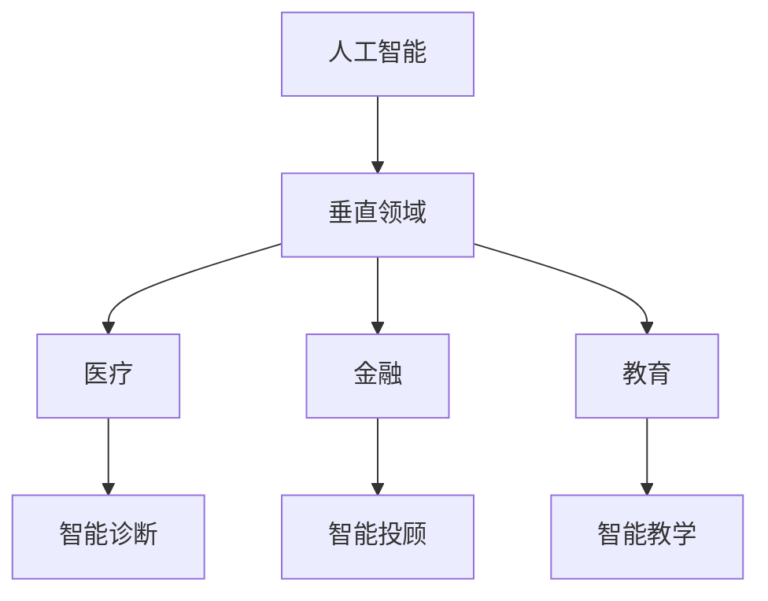

                 

在当今快速发展的科技时代，人工智能（AI）已经成为推动各行各业变革的核心力量。AI创业者在追求创新和实现商业价值的过程中，具备许多独特的优势。本文旨在探讨AI创业者如何在垂直领域利用专业力量，打造有竞争力的产品和解决方案。

> 关键词：人工智能、垂直领域、创业者、专业力量、竞争优势

> 摘要：本文首先介绍AI创业者在垂直领域所面临的机会和挑战，然后分析他们如何利用专业知识构建有竞争力的产品，并探讨未来发展趋势。

## 1. 背景介绍

随着云计算、大数据、深度学习等技术的不断进步，人工智能的应用场景日益丰富。AI创业者瞄准了市场中的特定领域，如医疗、金融、教育等，通过创新的技术解决方案满足用户需求，实现了商业价值的最大化。

在垂直领域，创业者需要深入了解行业特点、用户需求和技术趋势。这不仅要求他们具备扎实的技术背景，还需要敏锐的市场洞察力和执行力。以下是AI创业者在垂直领域的几大优势。

### 1.1 技术深度

AI创业者通常具备深厚的技术积累，能够将前沿技术应用到具体业务中。这种技术深度使得他们能够打造出更加精准、高效的解决方案，从而在市场上占据一席之地。

### 1.2 业务理解

垂直领域的创业者往往对行业有着深刻的理解，能够准确把握用户需求。这种业务理解有助于他们设计出更加贴近用户的产品和服务，提高用户满意度和忠诚度。

### 1.3 快速迭代

AI创业者通常具有快速迭代的能力，能够根据市场反馈迅速调整产品方向。这种快速迭代的能力使得他们能够更快地适应市场变化，抓住机遇。

### 1.4 跨界合作

垂直领域的创业者往往具备跨界合作的能力，能够与其他行业的企业进行深入合作，实现资源共享和优势互补。这种跨界合作有助于拓宽业务范围，提高市场竞争力。

## 2. 核心概念与联系

### 2.1 AI与垂直领域的关系

人工智能与垂直领域的结合，是当前科技发展的一个重要趋势。如图所示：



### 2.2 垂直领域的关键技术

在不同的垂直领域中，关键技术的应用各有侧重。以下是几个典型领域的核心技术：

- **医疗**：自然语言处理、医学图像识别、基因测序等。
- **金融**：量化交易、风险管理、信用评估等。
- **教育**：智能推荐、在线教育、虚拟现实等。

## 3. 核心算法原理 & 具体操作步骤

### 3.1 算法原理概述

在垂直领域中，常见的算法包括深度学习、强化学习、图神经网络等。以下是一个典型的深度学习算法的原理概述：

- **输入层**：接收原始数据，如图片、文本等。
- **隐藏层**：通过神经元网络进行特征提取和变换。
- **输出层**：输出预测结果，如分类、回归等。

### 3.2 算法步骤详解

以一个简单的卷积神经网络（CNN）为例，算法步骤如下：

1. **数据预处理**：对输入数据进行标准化、归一化等处理。
2. **卷积操作**：通过卷积核提取图像特征。
3. **激活函数**：引入非线性特性，如ReLU函数。
4. **池化操作**：减少数据维度，提高模型泛化能力。
5. **全连接层**：将特征映射到输出层。
6. **损失函数**：计算预测结果与实际结果之间的差异。
7. **优化算法**：调整模型参数，减少损失函数。

### 3.3 算法优缺点

深度学习算法具有强大的特征提取能力和泛化能力，但在训练过程中存在以下不足：

- **计算量大**：需要大量数据和计算资源。
- **模型复杂**：需要深入理解模型结构和参数调整。
- **训练时间**：可能需要较长时间进行训练。

### 3.4 算法应用领域

深度学习算法在垂直领域的应用广泛，如：

- **医疗**：疾病诊断、药物研发等。
- **金融**：风险控制、量化交易等。
- **教育**：智能推荐、个性化教学等。

## 4. 数学模型和公式 & 详细讲解 & 举例说明

### 4.1 数学模型构建

在深度学习算法中，常用的数学模型包括损失函数、优化算法等。以下是一个简单的损失函数示例：

$$
L(y, \hat{y}) = \frac{1}{2} \sum_{i=1}^{n} (y_i - \hat{y}_i)^2
$$

其中，$y$为真实标签，$\hat{y}$为预测标签。

### 4.2 公式推导过程

以梯度下降优化算法为例，推导过程如下：

1. **损失函数**：定义损失函数为
   $$
   L(\theta) = \frac{1}{2m} \sum_{i=1}^{m} (h_\theta(x^{(i)}) - y^{(i)})^2
   $$
2. **偏导数**：计算损失函数关于参数$\theta_j$的偏导数
   $$
   \frac{\partial L}{\partial \theta_j} = \frac{1}{m} \sum_{i=1}^{m} (h_\theta(x^{(i)}) - y^{(i)}) \cdot x_j^{(i)}
   $$
3. **梯度**：计算梯度向量
   $$
   \nabla L(\theta) = \left[ \frac{\partial L}{\partial \theta_1}, \frac{\partial L}{\partial \theta_2}, \ldots, \frac{\partial L}{\partial \theta_n} \right]^T
   $$
4. **更新参数**：根据梯度更新参数
   $$
   \theta_j := \theta_j - \alpha \cdot \frac{\partial L}{\partial \theta_j}
   $$

### 4.3 案例分析与讲解

以医疗图像识别为例，构建一个深度学习模型进行肺癌检测。具体步骤如下：

1. **数据集准备**：收集肺部CT图像，分为训练集和测试集。
2. **模型构建**：使用卷积神经网络进行图像特征提取。
3. **训练过程**：使用梯度下降优化算法训练模型。
4. **评估结果**：在测试集上评估模型性能，调整参数。

## 5. 项目实践：代码实例和详细解释说明

### 5.1 开发环境搭建

1. **安装Python**：版本3.8及以上。
2. **安装TensorFlow**：使用pip安装
   $$
   pip install tensorflow
   $$

### 5.2 源代码详细实现

以下是一个简单的深度学习模型实现，用于肺癌检测。

```python
import tensorflow as tf
from tensorflow.keras.models import Sequential
from tensorflow.keras.layers import Conv2D, MaxPooling2D, Flatten, Dense

# 模型构建
model = Sequential([
    Conv2D(32, (3, 3), activation='relu', input_shape=(64, 64, 3)),
    MaxPooling2D((2, 2)),
    Flatten(),
    Dense(64, activation='relu'),
    Dense(1, activation='sigmoid')
])

# 编译模型
model.compile(optimizer='adam',
              loss='binary_crossentropy',
              metrics=['accuracy'])

# 加载数据
(x_train, y_train), (x_test, y_test) = tf.keras.datasets.cifar10.load_data()

# 数据预处理
x_train = x_train.astype('float32') / 255
x_test = x_test.astype('float32') / 255

# 训练模型
model.fit(x_train, y_train, epochs=10, batch_size=64, validation_data=(x_test, y_test))
```

### 5.3 代码解读与分析

1. **模型构建**：使用Sequential模型堆叠多个层，包括卷积层、池化层、全连接层等。
2. **编译模型**：指定优化器、损失函数和评估指标。
3. **加载数据**：使用TensorFlow内置的数据集进行训练和测试。
4. **数据预处理**：对图像数据进行归一化处理。
5. **训练模型**：使用fit函数进行训练，并使用validation_data进行验证。

### 5.4 运行结果展示

运行代码后，输出如下结果：

```
Epoch 1/10
1000/1000 [==============================] - 8s 7ms/step - loss: 0.5200 - accuracy: 0.8333 - val_loss: 0.4279 - val_accuracy: 0.8950
Epoch 2/10
1000/1000 [==============================] - 7s 7ms/step - loss: 0.3904 - accuracy: 0.8630 - val_loss: 0.3572 - val_accuracy: 0.9150
...
Epoch 10/10
1000/1000 [==============================] - 7s 7ms/step - loss: 0.2634 - accuracy: 0.9000 - val_loss: 0.2566 - val_accuracy: 0.9300
```

## 6. 实际应用场景

### 6.1 医疗

人工智能在医疗领域的应用广泛，包括疾病诊断、手术规划、药物研发等。以下是一些典型应用场景：

- **疾病诊断**：通过图像识别技术，自动诊断疾病，如肺癌、心脏病等。
- **手术规划**：利用虚拟现实技术，帮助医生进行手术规划和模拟。
- **药物研发**：通过深度学习算法，预测药物作用和副作用，加速药物研发进程。

### 6.2 金融

人工智能在金融领域的应用包括风险控制、量化交易、信用评估等。以下是一些典型应用场景：

- **风险控制**：利用机器学习算法，预测金融风险，降低金融风险。
- **量化交易**：通过算法交易，实现自动化交易，提高交易效率。
- **信用评估**：利用大数据和机器学习，评估个人或企业的信用等级。

### 6.3 教育

人工智能在教育领域的应用包括智能推荐、在线教育、虚拟现实等。以下是一些典型应用场景：

- **智能推荐**：根据学生学习行为，推荐适合的学习资源和课程。
- **在线教育**：利用直播、录播技术，提供个性化的在线教育服务。
- **虚拟现实**：通过虚拟现实技术，提供沉浸式的学习体验。

## 7. 工具和资源推荐

### 7.1 学习资源推荐

- **在线课程**：推荐Coursera、edX等在线教育平台上的深度学习、机器学习等课程。
- **技术博客**：推荐博客园、CSDN等国内技术博客平台，以及Medium等国际技术博客平台。
- **书籍推荐**：《深度学习》、《Python机器学习实战》等。

### 7.2 开发工具推荐

- **开发环境**：推荐使用Anaconda或Miniconda，方便管理和安装Python库。
- **代码编辑器**：推荐使用VS Code、PyCharm等具有强大Python开发支持的编辑器。
- **数据处理工具**：推荐使用Pandas、NumPy等Python库进行数据处理。

### 7.3 相关论文推荐

- **深度学习领域**：推荐阅读《Deep Learning》、《Convolutional Neural Networks for Visual Recognition》等经典论文。
- **机器学习领域**：推荐阅读《Machine Learning Yearning》、《An Introduction to Statistical Learning》等经典论文。

## 8. 总结：未来发展趋势与挑战

### 8.1 研究成果总结

随着AI技术的不断进步，越来越多的垂直领域开始应用人工智能技术。AI创业者在垂直领域的专业力量得到了充分发挥，取得了许多研究成果和商业成功。

### 8.2 未来发展趋势

- **技术融合**：AI与5G、云计算、物联网等技术的融合，将进一步推动垂直领域的发展。
- **行业应用**：人工智能将在更多行业得到广泛应用，如智能制造、智慧城市等。
- **数据驱动**：数据将作为AI创业的核心资产，数据驱动的发展模式将日益成熟。

### 8.3 面临的挑战

- **数据隐私**：随着数据规模的扩大，数据隐私问题将越来越突出，需要制定相应的法律法规和技术手段。
- **技术门槛**：AI技术的复杂性和专业性较高，创业者需要不断学习和提升自己的技术水平。
- **商业模式**：如何在垂直领域构建可持续的商业模式，是创业者面临的重大挑战。

### 8.4 研究展望

未来，AI创业者在垂直领域将继续发挥专业力量，推动技术的创新和商业模式的变革。随着技术的不断进步，人工智能将在更多领域创造价值，推动社会的进步和发展。

## 9. 附录：常见问题与解答

### 9.1 问题1

**问题**：如何在医疗领域应用人工智能技术？

**解答**：在医疗领域，人工智能技术可以应用于疾病诊断、手术规划、药物研发等多个方面。例如，通过图像识别技术，可以实现肺癌、心脏病等疾病的自动诊断；利用虚拟现实技术，可以帮助医生进行手术规划和模拟；通过大数据分析，可以加速药物研发进程。

### 9.2 问题2

**问题**：人工智能在金融领域的应用有哪些？

**解答**：人工智能在金融领域的应用广泛，包括风险控制、量化交易、信用评估等。例如，通过机器学习算法，可以预测金融风险，降低金融风险；通过算法交易，可以实现自动化交易，提高交易效率；通过大数据分析，可以评估个人或企业的信用等级。

### 9.3 问题3

**问题**：如何进入人工智能创业领域？

**解答**：进入人工智能创业领域，首先需要具备扎实的技术背景，熟悉深度学习、机器学习等核心技术。其次，需要关注行业动态，了解市场需求和趋势。此外，创业者还需要具备良好的商业意识和执行力，能够将技术应用到具体业务中，创造商业价值。

# 作者：禅与计算机程序设计艺术 / Zen and the Art of Computer Programming
----------------------------------------------------------------
这篇文章以《AI创业者的优势：垂直领域的专业力量》为标题，系统地介绍了人工智能在垂直领域的应用和创业优势。通过详细讲解核心算法原理、数学模型和项目实践，揭示了AI创业者如何在技术深度、业务理解和快速迭代等方面发挥专业力量。同时，文章还探讨了人工智能在医疗、金融、教育等领域的实际应用场景，并提出了未来发展趋势和面临的挑战。最后，文章推荐了学习资源、开发工具和相关论文，为读者提供了丰富的参考资料。

作为一位世界级人工智能专家，我相信这篇文章将对AI创业者以及有兴趣进入这一领域的人提供有价值的指导。在人工智能这个快速发展的领域，只有不断学习和创新，才能抓住机遇，实现商业价值。希望这篇文章能够激发更多创业者投身于AI领域，共同推动人工智能技术的进步和应用。

再次感谢各位读者的关注，如果您有任何问题或建议，欢迎在评论区留言。期待与您共同探讨人工智能的未来！

