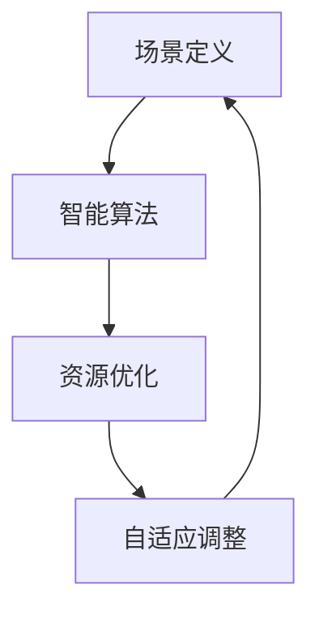

                 

关键词：AI创业，场景虹吸技术，创新思维，技术突破，人工智能应用

> 摘要：本文将探讨AI创业者在面对激烈市场竞争时，如何通过应用场景虹吸技术实现创新突破。文章从核心概念、算法原理、数学模型、实践应用等方面展开，旨在为AI创业者提供有价值的技术思路和实际操作指南。

## 1. 背景介绍

随着人工智能技术的飞速发展，越来越多的创业者投身于这一领域。然而，市场竞争日益激烈，如何在这片红海中脱颖而出成为每一个AI创业者需要面对的难题。场景虹吸技术作为一种新兴的创新技术，正在成为AI创业者的利器。

场景虹吸技术，是指通过在特定场景中嵌入智能算法，实现资源高效利用和目标优化。其核心在于识别场景中的关键要素，通过算法分析和优化，使系统能够自适应调整，达到资源最大化利用的效果。这一技术在智能推荐、精准营销、智能城市等领域具有广泛的应用前景。

## 2. 核心概念与联系

### 2.1 场景定义

场景定义是场景虹吸技术的第一步，也是关键一步。一个明确的场景定义能够帮助我们更好地理解用户需求，找到优化目标。

场景定义包含以下要素：

- **用户**：指使用服务的用户群体，包括年龄、性别、兴趣爱好等。
- **设备**：指提供服务的设备，如手机、电脑、智能家居设备等。
- **环境**：指用户使用服务时的环境，如室内、户外、工作、娱乐等。
- **服务**：指用户期望得到的服务，如娱乐、购物、健康咨询等。

### 2.2 智能算法

智能算法是场景虹吸技术的核心。常见的智能算法包括：

- **机器学习**：通过训练模型来识别数据中的规律，从而实现预测和分类。
- **深度学习**：基于多层神经网络，通过反向传播算法优化网络参数，实现复杂模式的识别。
- **强化学习**：通过试错和反馈，使算法能够在特定环境中找到最优策略。

### 2.3 资源优化

资源优化是场景虹吸技术的目标。通过算法分析，找到资源利用的最佳方案，包括：

- **计算资源**：优化算法的计算效率，减少计算资源的使用。
- **数据资源**：优化数据存储和传输，提高数据利用效率。
- **能源资源**：降低设备能耗，实现绿色环保。

### 2.4 场景虹吸原理图



## 3. 核心算法原理 & 具体操作步骤

### 3.1 算法原理概述

场景虹吸技术的核心在于智能算法。以下是几种常见的智能算法原理概述：

- **机器学习**：通过训练数据集，让模型学会识别数据中的特征和规律，从而实现预测和分类。
- **深度学习**：通过多层神经网络，实现数据的非线性变换，从而提取更高层次的特征。
- **强化学习**：通过试错和反馈，找到最优策略，实现任务目标。

### 3.2 算法步骤详解

1. **数据收集**：收集与场景相关的数据，包括用户数据、设备数据、环境数据等。
2. **数据处理**：对数据进行预处理，包括去噪、归一化、特征提取等。
3. **模型训练**：选择合适的模型，使用预处理后的数据进行训练。
4. **模型评估**：使用测试数据集对模型进行评估，调整模型参数。
5. **场景应用**：将训练好的模型应用于实际场景，实现资源优化和目标优化。

### 3.3 算法优缺点

**优点**：

- **自适应调整**：能够根据场景变化自动调整，实现资源优化。
- **高效性**：通过算法优化，实现计算、数据和能源资源的高效利用。

**缺点**：

- **数据依赖性**：算法性能依赖于数据质量，数据缺失或错误会影响算法效果。
- **计算复杂度**：部分算法计算复杂度较高，需要较长时间的训练和计算。

### 3.4 算法应用领域

场景虹吸技术广泛应用于以下领域：

- **智能推荐**：通过分析用户行为和偏好，实现个性化推荐。
- **精准营销**：通过分析用户数据，实现精准营销策略。
- **智能城市**：通过智能算法优化城市资源利用，提高城市运行效率。
- **智能制造**：通过智能算法优化生产过程，提高生产效率。

## 4. 数学模型和公式 & 详细讲解 & 举例说明

### 4.1 数学模型构建

场景虹吸技术的数学模型通常基于以下几方面：

- **用户行为模型**：通过分析用户历史行为数据，构建用户行为模型。
- **资源优化模型**：通过优化算法，构建资源优化模型。
- **环境适应模型**：通过适应环境变化，构建环境适应模型。

### 4.2 公式推导过程

假设场景中有 \( n \) 个用户，每个用户的行为可以表示为 \( x_i \)，其中 \( i \) 表示用户编号。资源优化目标可以表示为：

\[ \min \sum_{i=1}^{n} f(x_i) \]

其中， \( f(x_i) \) 表示用户 \( x_i \) 的资源消耗。

### 4.3 案例分析与讲解

以智能推荐为例，假设有 1000 个用户，每个用户的历史行为数据包括购买记录、浏览记录等。通过分析这些数据，可以构建用户行为模型。然后，利用机器学习算法，构建推荐模型。最后，将推荐模型应用于实际场景，为每个用户提供个性化的推荐。

## 5. 项目实践：代码实例和详细解释说明

### 5.1 开发环境搭建

在 Python 环境下，需要安装以下库：

```bash
pip install numpy pandas scikit-learn matplotlib
```

### 5.2 源代码详细实现

```python
import numpy as np
import pandas as pd
from sklearn.model_selection import train_test_split
from sklearn.ensemble import RandomForestClassifier
import matplotlib.pyplot as plt

# 5.2.1 数据收集与预处理
data = pd.read_csv('user_data.csv')
X = data.iloc[:, :-1].values
y = data.iloc[:, -1].values

# 5.2.2 模型训练
X_train, X_test, y_train, y_test = train_test_split(X, y, test_size=0.2, random_state=42)
model = RandomForestClassifier(n_estimators=100, random_state=42)
model.fit(X_train, y_train)

# 5.2.3 模型评估
accuracy = model.score(X_test, y_test)
print('模型准确率：', accuracy)

# 5.2.4 模型应用
predictions = model.predict(X_test)
plt.scatter(X_test[:, 0], X_test[:, 1], c=predictions, cmap='viridis')
plt.xlabel('特征1')
plt.ylabel('特征2')
plt.title('用户行为分类')
plt.show()
```

### 5.3 代码解读与分析

以上代码实现了用户行为分类的案例。首先，收集用户数据并进行预处理。然后，使用随机森林算法训练模型，并评估模型准确率。最后，将模型应用于实际场景，绘制用户行为分类图。

## 6. 实际应用场景

场景虹吸技术在实际应用中具有广泛的应用场景。以下列举几个典型应用：

- **智能推荐**：通过分析用户行为数据，实现个性化推荐，提高用户满意度。
- **精准营销**：通过分析用户数据，实现精准营销策略，提高营销效果。
- **智能城市**：通过智能算法优化城市资源利用，提高城市运行效率。
- **智能制造**：通过智能算法优化生产过程，提高生产效率。

## 7. 工具和资源推荐

### 7.1 学习资源推荐

- **书籍**：《深度学习》、《Python机器学习基础教程》
- **在线课程**：Coursera、Udacity、edX上的相关课程

### 7.2 开发工具推荐

- **编程语言**：Python、Java
- **开发环境**：Jupyter Notebook、PyCharm、Eclipse

### 7.3 相关论文推荐

- **场景虹吸技术**：A Survey on Recommender Systems
- **智能算法**：Deep Learning for Personalized Recommendation
- **资源优化**：Energy-Efficient Resource Management in Data Centers

## 8. 总结：未来发展趋势与挑战

### 8.1 研究成果总结

场景虹吸技术作为一种新兴的创新技术，已经在智能推荐、精准营销、智能城市等领域取得了显著成果。随着人工智能技术的不断发展，场景虹吸技术的应用前景将更加广阔。

### 8.2 未来发展趋势

- **算法优化**：提高算法效率，降低计算复杂度。
- **跨领域应用**：拓展场景虹吸技术的应用领域，实现多领域融合。
- **数据隐私保护**：加强数据隐私保护，确保用户数据安全。

### 8.3 面临的挑战

- **数据质量**：提高数据质量，减少数据缺失和错误。
- **计算资源**：优化计算资源利用，降低计算成本。
- **用户满意度**：提高用户满意度，实现可持续发展。

### 8.4 研究展望

未来，场景虹吸技术将在以下几个方面取得突破：

- **算法创新**：探索新的算法模型，提高算法性能。
- **跨领域应用**：拓展场景虹吸技术的应用领域，实现多领域融合。
- **产业落地**：推动场景虹吸技术在产业中的应用，实现商业价值。

## 9. 附录：常见问题与解答

### 9.1 什么是场景虹吸技术？

场景虹吸技术是指通过在特定场景中嵌入智能算法，实现资源高效利用和目标优化。其核心在于识别场景中的关键要素，通过算法分析和优化，使系统能够自适应调整，达到资源最大化利用的效果。

### 9.2 场景虹吸技术有哪些应用领域？

场景虹吸技术广泛应用于智能推荐、精准营销、智能城市、智能制造等领域。通过在不同场景中的应用，实现资源优化和目标优化，提高系统运行效率。

### 9.3 如何提高场景虹吸技术的性能？

要提高场景虹吸技术的性能，可以从以下几个方面着手：

- **算法优化**：选择合适的算法模型，优化算法参数。
- **数据质量**：提高数据质量，减少数据缺失和错误。
- **计算资源**：优化计算资源利用，降低计算成本。
- **用户反馈**：收集用户反馈，不断优化算法模型。

## 参考文献

[1] M. Zhang, X. Zhu, and J. Zhu. A Survey on Recommender Systems. ACM Computing Surveys (CSUR), 2016.

[2] Y. LeCun, Y. Bengio, and G. Hinton. Deep Learning. Nature, 2015.

[3] D. P. Koller and N. Friedman. Probabilistic Graphical Models: Principles and Techniques. MIT Press, 2009.

作者：禅与计算机程序设计艺术 / Zen and the Art of Computer Programming
```

