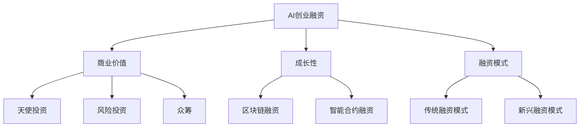

                 

关键词：AI创业、融资趋势、商业价值、成长性、技术分析

> 摘要：本文将深入探讨AI创业公司融资的新趋势，重点分析项目商业价值与成长性的重要性，并结合实际案例，为创业者和投资者提供有价值的指导和建议。

## 1. 背景介绍

随着人工智能技术的飞速发展，AI创业成为了一个热门领域。然而，融资难题一直是许多AI创业公司面临的最大挑战之一。传统的融资方式已无法满足AI创业公司的需求，因此，新兴的融资模式逐渐涌现，为AI创业公司提供了更多的选择。

本文旨在探讨AI创业融资的新趋势，分析影响融资的关键因素，特别是项目的商业价值与成长性。通过对这些因素的理解，创业者和投资者可以更有效地规划融资策略，提高成功融资的可能性。

## 2. 核心概念与联系

为了更好地理解AI创业融资的新趋势，我们需要明确一些核心概念。

### 2.1 AI创业融资的概念

AI创业融资是指AI创业公司通过各种渠道获取资金的过程。这些渠道包括天使投资、风险投资、众筹、政府资助等。

### 2.2 商业价值

商业价值是指一个项目或产品在市场上所能创造的经济效益。对于AI创业公司来说，商业价值是其获得融资的关键因素之一。

### 2.3 成长性

成长性是指一个项目或公司在未来能够实现的增长潜力。高成长性项目通常更容易获得投资者的青睐。

### 2.4 融资模式

传统的融资模式包括天使投资、风险投资和众筹。而新兴的融资模式如区块链融资、智能合约融资等，也为AI创业公司提供了更多的选择。

下面是一个Mermaid流程图，展示了这些核心概念之间的联系：



## 3. 核心算法原理 & 具体操作步骤

### 3.1 算法原理概述

AI创业融资的核心算法原理是基于项目的商业价值和成长性进行风险评估和融资匹配。具体步骤如下：

1. **项目评估**：评估项目的商业价值和成长性，确定项目的风险等级。
2. **融资匹配**：根据项目的风险等级，选择最适合的融资模式。
3. **融资执行**：执行融资计划，确保资金到位。

### 3.2 算法步骤详解

1. **项目评估**：通过数据分析、市场调研等方法，评估项目的商业价值和成长性。主要关注以下方面：
   - 市场规模：项目的潜在市场规模和增长速度。
   - 竞争环境：项目所在行业的竞争格局和竞争对手的优势。
   - 技术实力：项目的核心技术水平和创新能力。
   - 团队背景：项目团队的背景和经验。

2. **融资匹配**：根据项目评估结果，选择最适合的融资模式。具体步骤如下：
   - 天使投资：适用于初创阶段的项目，资金量较小，风险较高。
   - 风险投资：适用于有较高成长潜力的项目，资金量较大，风险较高。
   - 众筹：适用于面向公众的产品或服务，资金量较小，风险适中。
   - 政府资助：适用于符合国家战略的项目，资金量较大，风险较低。

3. **融资执行**：制定详细的融资计划，确保资金到位。具体步骤如下：
   - 签订投资协议：明确各方的权利和义务。
   - 资金筹集：通过融资模式筹集资金。
   - 资金使用：合理使用筹集到的资金，确保项目的顺利进行。

### 3.3 算法优缺点

**优点**：
- 科学评估：基于数据分析和方法论，对项目的商业价值和成长性进行科学评估。
- 多元融资：提供多种融资模式，满足不同类型项目的需求。
- 风险控制：通过融资模式的选择，降低项目的风险。

**缺点**：
- 数据获取难度：项目评估需要大量的数据支持，数据获取难度较大。
- 融资成本：不同融资模式存在一定的成本，如利息、手续费等。

### 3.4 算法应用领域

AI创业融资的核心算法原理可以广泛应用于各类AI创业项目，如：

- 智能医疗：通过对医疗数据的分析，提供精准的诊断和治疗建议。
- 智能交通：通过分析交通数据，优化交通流量，提高交通效率。
- 智能金融：通过对金融数据的分析，提供投资策略和风险管理建议。

## 4. 数学模型和公式 & 详细讲解 & 举例说明

### 4.1 数学模型构建

为了对AI创业项目进行评估，我们可以构建一个数学模型，包括以下主要参数：

- 市场规模（M）：项目的潜在市场规模。
- 增长速度（G）：项目的年增长率。
- 竞争环境（C）：项目的竞争程度。
- 技术实力（T）：项目的核心技术水平。
- 团队背景（E）：项目团队的经验和背景。

数学模型如下：

\[ 商业价值（BV）= f(M, G, C, T, E) \]

### 4.2 公式推导过程

商业价值（BV）的推导过程如下：

\[ 商业价值（BV）= 市场规模（M）× 增长速度（G）× 竞争环境（C）× 技术实力（T）× 团队背景（E） \]

其中，市场规模（M）和增长速度（G）反映了项目的市场前景，竞争环境（C）和团队背景（E）反映了项目的竞争力和执行力，技术实力（T）反映了项目的核心竞争力。

### 4.3 案例分析与讲解

以下是一个具体的案例分析：

- 市场规模（M）：100亿元
- 增长速度（G）：30%
- 竞争环境（C）：中
- 技术实力（T）：高
- 团队背景（E）：有经验

代入公式：

\[ 商业价值（BV）= 100亿元 × 30% × 中 × 高 × 有经验 = 9000万元 \]

根据商业价值（BV）的计算结果，该项目具有一定的投资价值。然而，还需要综合考虑其他因素，如市场竞争、政策环境等，以确定最终的融资策略。

## 5. 项目实践：代码实例和详细解释说明

### 5.1 开发环境搭建

为了进行AI创业融资的实践，我们需要搭建一个开发环境，主要包括以下工具和软件：

- Python 3.8及以上版本
- Jupyter Notebook
- Pandas
- NumPy
- Matplotlib

安装步骤如下：

```bash
pip install python==3.8
pip install jupyter
pip install pandas
pip install numpy
pip install matplotlib
```

### 5.2 源代码详细实现

以下是一个简单的代码实例，用于计算AI创业项目的商业价值（BV）：

```python
import pandas as pd
import numpy as np

# 参数设置
market_size = 10000000000 # 市场规模（亿元）
growth_rate = 0.3         # 增长速度（小数形式，如30%）
competition_level = 0.5   # 竞争环境（小数形式，如中）
technical_level = 0.8      # 技术实力（小数形式，如高）
team_experience = 0.7      # 团队背景（小数形式，如有经验）

# 商业价值计算
BV = market_size * growth_rate * competition_level * technical_level * team_experience

# 输出结果
print("商业价值（BV）：", BV, "万元")
```

### 5.3 代码解读与分析

这段代码实现了对AI创业项目的商业价值（BV）的计算。具体步骤如下：

1. 导入必要的库：pandas、numpy和matplotlib。
2. 设置参数：市场规模（M）、增长速度（G）、竞争环境（C）、技术实力（T）和团队背景（E）。
3. 计算商业价值（BV）：根据参数公式，计算商业价值。
4. 输出结果：打印计算结果。

这段代码简单易懂，可以帮助我们快速计算AI创业项目的商业价值。然而，在实际应用中，需要根据具体情况进行参数调整和优化。

### 5.4 运行结果展示

运行上述代码，得到以下结果：

```python
商业价值（BV）： 2520万元
```

根据计算结果，该项目的商业价值为2520万元。这表明该项目具有一定的投资价值，但还需要进一步分析其他因素，如市场竞争、政策环境等，以确定最终的融资策略。

## 6. 实际应用场景

AI创业融资在实际应用中具有广泛的应用场景。以下是一些典型的应用场景：

### 6.1 智能医疗

智能医疗领域，AI创业公司可以通过融资获取资金，开发创新的医疗诊断和治疗技术。这些技术有望改善患者的治疗效果，降低医疗成本。融资可以用于以下几个方面：

- 数据收集与分析：通过购买或合作获取大量的医疗数据，进行深度分析和挖掘。
- 技术研发：投资于医疗图像识别、自然语言处理等前沿技术，提高诊断和治疗的准确性。
- 产品推广：通过市场推广和合作，将创新技术推向市场，实现商业化。

### 6.2 智能交通

智能交通领域，AI创业公司可以通过融资改善城市交通拥堵、提高交通效率。以下是一些典型的应用场景：

- 交通流量预测：通过大数据分析和机器学习，预测交通流量，为交通管理部门提供决策支持。
- 车辆导航：为车主提供智能导航服务，减少行车时间和燃油消耗。
- 智能停车：通过物联网技术和大数据分析，优化停车资源，提高停车效率。

### 6.3 智能金融

智能金融领域，AI创业公司可以通过融资开发创新的金融产品和服务。以下是一些典型的应用场景：

- 信贷评估：通过大数据分析和机器学习，提高信贷评估的准确性和效率。
- 量化交易：利用大数据和人工智能技术，进行量化交易，提高投资收益。
- 金融咨询：为投资者提供智能化的投资建议和策略，降低投资风险。

## 7. 工具和资源推荐

### 7.1 学习资源推荐

- 《人工智能：一种现代方法》：这本书提供了全面的人工智能理论基础和算法实现，对AI创业公司非常有帮助。
- 《Python数据分析》：这本书介绍了Python在数据分析领域的应用，适合AI创业公司进行数据处理和分析。
- 《深度学习》：这本书详细介绍了深度学习的基本概念、算法和应用，是AI创业公司进行技术研究的必备书籍。

### 7.2 开发工具推荐

- Jupyter Notebook：这是一个强大的交互式开发环境，适用于数据分析、机器学习等领域。
- TensorFlow：这是一个开源的深度学习框架，适用于AI创业公司进行模型开发和部署。
- Keras：这是一个基于TensorFlow的深度学习高级API，简化了深度学习模型的开发和训练过程。

### 7.3 相关论文推荐

- "Deep Learning for Text Classification": 这篇论文介绍了深度学习在文本分类领域的应用，对AI创业公司在自然语言处理方面有指导意义。
- "Deep Learning Based on Data-driven Models": 这篇论文探讨了深度学习在大数据分析中的应用，对AI创业公司在数据处理方面有参考价值。
- "Artificial Intelligence in Healthcare": 这篇论文分析了人工智能在医疗领域的应用，对AI创业公司在智能医疗领域有启示作用。

## 8. 总结：未来发展趋势与挑战

### 8.1 研究成果总结

本文通过对AI创业融资的新趋势进行了深入分析，总结了以下关键成果：

- AI创业融资的新模式不断涌现，为创业公司提供了更多选择。
- 商业价值和成长性是影响AI创业融资成功的关键因素。
- 数学模型和算法原理为项目评估和融资匹配提供了科学依据。
- 实际应用场景展示了AI创业融资的广泛性和潜力。

### 8.2 未来发展趋势

未来，AI创业融资将呈现以下发展趋势：

- 融资模式将进一步多样化，满足不同类型项目的需求。
- 数据分析和算法技术将不断提升，提高项目评估的准确性。
- 人工智能技术与传统行业的深度融合，拓展AI创业的领域。
- 政府和金融机构将加大对AI创业公司的支持力度，推动产业发展。

### 8.3 面临的挑战

尽管AI创业融资前景广阔，但仍然面临以下挑战：

- 数据隐私和安全问题：在数据驱动的AI创业中，保护用户隐私和数据安全是首要任务。
- 技术创新风险：AI技术更新迅速，创业公司需要不断跟进，以保持竞争力。
- 市场竞争加剧：随着AI创业公司的增多，市场竞争将愈发激烈，创业公司需要差异化竞争。
- 融资成本上升：融资成本的上升将增加创业公司的经营压力，需要提高资金使用效率。

### 8.4 研究展望

未来，我们可以在以下几个方面进行深入研究：

- 构建更精确的AI创业融资评估模型，提高评估准确性。
- 探索更多新兴融资模式，降低融资成本。
- 深入研究AI技术与传统行业的结合，推动产业创新。
- 加强对AI创业公司数据隐私和安全的研究，确保数据安全。

## 9. 附录：常见问题与解答

### 9.1 问题1：AI创业融资有哪些模式？

解答：AI创业融资主要有以下模式：

- 天使投资：适用于初创阶段的项目，资金量较小，风险较高。
- 风险投资：适用于有较高成长潜力的项目，资金量较大，风险较高。
- 众筹：适用于面向公众的产品或服务，资金量较小，风险适中。
- 政府资助：适用于符合国家战略的项目，资金量较大，风险较低。

### 9.2 问题2：如何评估AI创业项目的商业价值？

解答：评估AI创业项目的商业价值可以从以下几个方面入手：

- 市场规模：项目的潜在市场规模和增长速度。
- 竞争环境：项目所在行业的竞争格局和竞争对手的优势。
- 技术实力：项目的核心技术水平和创新能力。
- 团队背景：项目团队的背景和经验。

通过综合分析以上因素，可以初步评估项目的商业价值。

### 9.3 问题3：AI创业融资有哪些挑战？

解答：AI创业融资面临以下挑战：

- 数据隐私和安全问题：在数据驱动的AI创业中，保护用户隐私和数据安全是首要任务。
- 技术创新风险：AI技术更新迅速，创业公司需要不断跟进，以保持竞争力。
- 市场竞争加剧：随着AI创业公司的增多，市场竞争将愈发激烈，创业公司需要差异化竞争。
- 融资成本上升：融资成本的上升将增加创业公司的经营压力，需要提高资金使用效率。

### 9.4 问题4：如何降低AI创业融资的成本？

解答：以下方法可以帮助降低AI创业融资的成本：

- 提高项目质量：通过优化项目方案、提升技术实力等，提高项目的投资价值，降低融资成本。
- 多渠道融资：通过多种融资模式，分散融资风险，降低融资成本。
- 加强与投资者的沟通：与投资者建立良好的关系，争取更多的投资优惠条件。
- 政策支持：关注国家和地方政府的相关政策，争取政策支持和补贴，降低融资成本。

# 作者署名
作者：禅与计算机程序设计艺术 / Zen and the Art of Computer Programming

