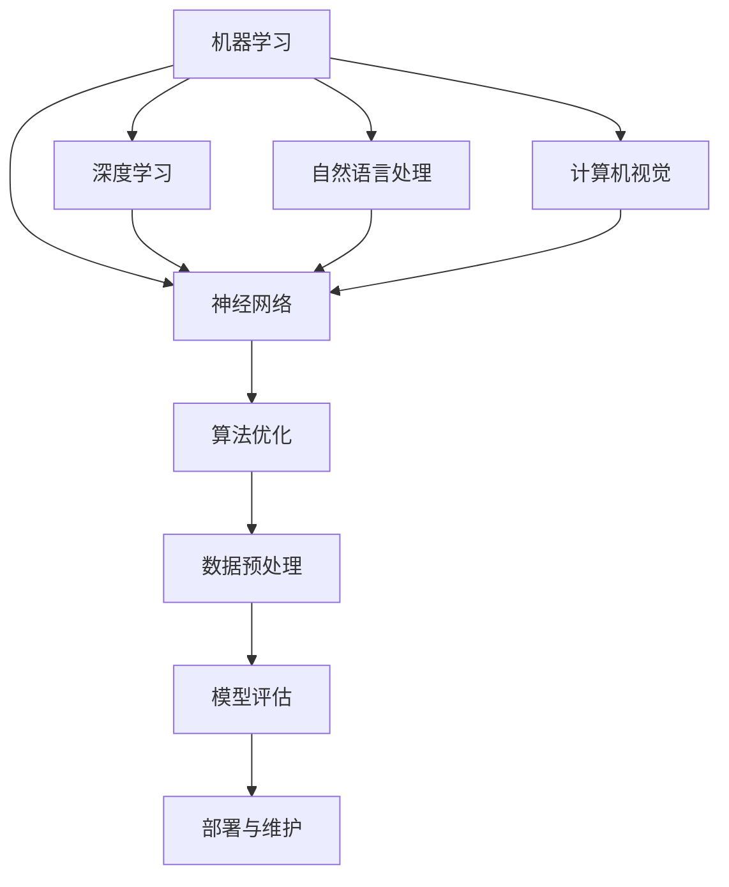

                 

关键词：人工智能、创业、多学科支持、跨学科合作、创新、技术融合

> 摘要：本文将探讨在人工智能（AI）创业过程中，多学科支持的重要性。从跨学科合作的角度出发，文章将阐述如何通过整合不同领域的专业知识，为AI项目提供全面的技术支持，并分析这种支持在推动创业成功中的关键作用。

## 1. 背景介绍

人工智能作为现代科技的前沿领域，近年来取得了飞速发展。AI技术的应用已经渗透到各个行业，包括医疗、金融、教育、制造等，成为推动社会进步的重要力量。随着AI技术的不断成熟，越来越多的创业者将目光投向了这个领域，试图通过创新的技术解决现实问题，实现商业价值。

然而，AI创业并非易事。它不仅需要深厚的技术积累，还要求创业者具备多方面的知识体系。在AI创业的过程中，多学科支持的重要性愈发凸显。本文将从以下几个方面进行探讨：

1. **核心概念与联系**：介绍AI创业中涉及的主要概念，并绘制流程图，展示各学科之间的相互关系。
2. **核心算法原理 & 具体操作步骤**：详细阐述AI算法的基本原理和操作步骤，分析其优缺点及应用领域。
3. **数学模型和公式 & 举例说明**：构建数学模型，推导公式，并通过实际案例进行分析。
4. **项目实践：代码实例和详细解释说明**：提供实际代码实例，详细解读并分析代码。
5. **实际应用场景**：探讨AI技术在现实中的应用场景，以及未来的应用展望。
6. **工具和资源推荐**：推荐学习资源和开发工具，以及相关论文。
7. **总结与展望**：总结研究成果，展望未来的发展趋势和面临的挑战。

## 2. 核心概念与联系

在AI创业中，涉及的核心概念包括但不限于：机器学习、深度学习、神经网络、自然语言处理、计算机视觉等。这些概念并非孤立存在，而是相互联系、相互支持的。下面是一个Mermaid流程图，展示了这些概念之间的联系：



从流程图中可以看出，机器学习、深度学习、神经网络、自然语言处理和计算机视觉是AI创业中的核心技术，它们共同构成了AI技术体系。这些技术相互关联，共同推动AI项目的进展。

### 3. 核心算法原理 & 具体操作步骤

#### 3.1 算法原理概述

在AI创业中，算法是核心。以下是一些常见的核心算法原理：

- **机器学习算法**：通过训练模型来学习数据特征，进而对未知数据进行预测或分类。
- **深度学习算法**：基于多层神经网络，通过反向传播算法优化网络参数。
- **神经网络算法**：模拟人脑神经元之间的连接，实现数据的非线性变换和特征提取。
- **自然语言处理算法**：通过文本处理、语义分析和语言生成等步骤，实现对自然语言的理解和生成。
- **计算机视觉算法**：通过图像处理、目标检测、图像分类等技术，实现对图像的理解和分析。

#### 3.2 算法步骤详解

以深度学习算法为例，其基本步骤如下：

1. **数据收集与预处理**：收集大量标注数据，并进行数据清洗、归一化等预处理操作。
2. **模型设计**：设计神经网络结构，包括输入层、隐藏层和输出层。
3. **模型训练**：通过反向传播算法，根据训练数据优化网络参数。
4. **模型评估**：使用验证集和测试集评估模型性能，包括准确率、召回率、F1值等指标。
5. **模型部署**：将训练好的模型部署到实际应用场景中，进行实时预测或分类。

#### 3.3 算法优缺点

每种算法都有其优缺点。以下是对几种核心算法的优缺点的简要分析：

- **机器学习算法**：优点是通用性强、适用范围广；缺点是模型复杂度高、训练时间较长。
- **深度学习算法**：优点是模型效果更好、适用范围更广；缺点是计算资源需求高、模型解释性较差。
- **神经网络算法**：优点是能处理复杂非线性问题；缺点是模型参数过多、过拟合风险较高。
- **自然语言处理算法**：优点是能处理自然语言文本；缺点是模型复杂度高、数据处理难度大。
- **计算机视觉算法**：优点是能处理图像数据；缺点是数据处理复杂、计算资源需求高。

#### 3.4 算法应用领域

这些算法在各个领域都有广泛的应用。例如：

- **机器学习算法**：在金融、医疗、制造等领域有广泛应用，如信用评分、疾病诊断、质量控制等。
- **深度学习算法**：在图像识别、语音识别、自然语言处理等领域有广泛应用，如人脸识别、语音助手、智能客服等。
- **神经网络算法**：在神经网络算法在推荐系统、游戏开发、语音合成等领域有广泛应用，如商品推荐、游戏AI、语音合成等。
- **自然语言处理算法**：在智能客服、文本分析、社交媒体分析等领域有广泛应用，如智能客服、文本分类、情感分析等。
- **计算机视觉算法**：在自动驾驶、机器人、图像处理等领域有广泛应用，如自动驾驶、机器人导航、图像增强等。

## 4. 数学模型和公式 & 详细讲解 & 举例说明

在AI创业中，数学模型和公式是核心组成部分。以下是一个典型的数学模型构建过程和公式推导：

### 4.1 数学模型构建

假设我们想要构建一个用于图像分类的神经网络模型。首先，我们需要定义输入层、隐藏层和输出层的节点数量，以及每个节点之间的连接权重。假设输入层有100个节点，隐藏层有100个节点，输出层有10个节点。我们可以定义如下的数学模型：

输入层节点：\[ x_1, x_2, ..., x_{100} \]  
隐藏层节点：\[ h_1, h_2, ..., h_{100} \]  
输出层节点：\[ y_1, y_2, ..., y_{10} \]  
权重矩阵：\[ W_{ij} \]（其中 \(i\) 表示输入层节点，\(j\) 表示隐藏层节点）  
偏置矩阵：\[ b_j \]（其中 \(j\) 表示隐藏层节点）  
权重矩阵：\[ U_{ji} \]（其中 \(i\) 表示隐藏层节点，\(j\) 表示输出层节点）  
偏置矩阵：\[ c_j \]（其中 \(j\) 表示输出层节点）

### 4.2 公式推导过程

接下来，我们推导隐藏层节点的激活函数和输出层节点的激活函数。

隐藏层节点的激活函数：

\[ h_j = \sigma(W_{ij}x_i + b_j) \]

其中，\( \sigma \) 表示激活函数，通常采用 Sigmoid 函数或ReLU函数。

输出层节点的激活函数：

\[ y_j = \sigma(U_{ji}h_i + c_j) \]

其中，\( \sigma \) 表示激活函数，通常采用 Softmax 函数。

### 4.3 案例分析与讲解

假设我们有一个包含1000个图像数据的训练集，每个图像数据包含100个像素值。我们使用上述数学模型进行图像分类，分类任务为判断图像是否包含特定目标。

首先，我们将图像数据输入到神经网络模型中，经过输入层节点处理，得到隐藏层节点的输出。然后，将隐藏层节点的输出传递到输出层节点，得到输出层节点的输出。

经过多次迭代训练，我们调整权重矩阵 \( W_{ij} \)、偏置矩阵 \( b_j \)、权重矩阵 \( U_{ji} \) 和偏置矩阵 \( c_j \)，使得输出层节点的输出与实际标签之间误差最小。

在训练完成后，我们可以使用测试集对模型进行评估，计算准确率、召回率、F1值等指标，以评估模型性能。

## 5. 项目实践：代码实例和详细解释说明

在本节中，我们将提供一个简单的深度学习项目实例，展示如何搭建环境、编写代码、实现算法，并进行代码解读与分析。

### 5.1 开发环境搭建

为了实现本实例，我们需要搭建一个深度学习开发环境。以下是搭建环境的步骤：

1. 安装Python（推荐版本3.8以上）。
2. 安装深度学习框架（如TensorFlow、PyTorch等）。
3. 安装必要的依赖库（如NumPy、Pandas、Matplotlib等）。

以下是一个Python环境搭建的示例代码：

```python
!pip install python
!pip install tensorflow
!pip install numpy
!pip install pandas
!pip install matplotlib
```

### 5.2 源代码详细实现

以下是一个简单的深度学习项目实例，使用TensorFlow框架实现一个用于图像分类的卷积神经网络（CNN）模型。

```python
import tensorflow as tf
from tensorflow.keras import layers
import matplotlib.pyplot as plt

# 数据预处理
(x_train, y_train), (x_test, y_test) = tf.keras.datasets.cifar10.load_data()
x_train, x_test = x_train / 255.0, x_test / 255.0

# 构建模型
model = tf.keras.Sequential([
    layers.Conv2D(32, (3, 3), activation='relu', input_shape=(32, 32, 3)),
    layers.MaxPooling2D(pool_size=(2, 2)),
    layers.Conv2D(64, (3, 3), activation='relu'),
    layers.MaxPooling2D(pool_size=(2, 2)),
    layers.Conv2D(64, (3, 3), activation='relu'),
    layers.Flatten(),
    layers.Dense(64, activation='relu'),
    layers.Dense(10, activation='softmax')
])

# 编译模型
model.compile(optimizer='adam',
              loss=tf.keras.losses.SparseCategoricalCrossentropy(from_logits=True),
              metrics=['accuracy'])

# 训练模型
model.fit(x_train, y_train, epochs=10)

# 评估模型
test_loss, test_acc = model.evaluate(x_test,  y_test, verbose=2)
print(f'\nTest accuracy: {test_acc:.4f}')

# 可视化结果
plt.figure(figsize=(8, 8))
for i in range(25):
    plt.subplot(5, 5, i + 1)
    plt.imshow(x_test[i], cmap=plt.cm.binary)
    plt.xticks([])
    plt.yticks([])
    plt.grid(False)
    plt.xlabel(class_names[np.argmax(model.predict(x_test[i]))])
plt.show()
```

### 5.3 代码解读与分析

下面是对上述代码的解读与分析：

1. **数据预处理**：
   - 加载CIFAR-10数据集，并进行归一化处理。
   - 归一化是为了将图像数据的像素值缩放到[0, 1]之间，提高模型训练的收敛速度。

2. **构建模型**：
   - 使用TensorFlow的Keras API构建卷积神经网络模型。
   - 模型包括三个卷积层，一个池化层，一个全连接层。
   - 每个卷积层后跟一个最大池化层，用于提取图像特征。
   - 最后的全连接层用于分类，输出10个概率值，表示图像属于10个类别的概率。

3. **编译模型**：
   - 使用Adam优化器和稀疏分类交叉熵损失函数。
   - 稀疏分类交叉熵损失函数适用于多分类问题。

4. **训练模型**：
   - 使用训练数据进行模型训练，迭代10次。
   - 模型在训练过程中不断调整权重和偏置，以最小化损失函数。

5. **评估模型**：
   - 使用测试集评估模型性能，计算准确率。
   - 测试集的准确率反映了模型在实际应用中的性能。

6. **可视化结果**：
   - 使用Matplotlib库可视化模型在测试集上的预测结果。
   - 图中展示了部分测试图像及其对应的预测类别。

## 6. 实际应用场景

AI技术在实际应用场景中具有广泛的应用，以下是一些常见的应用场景：

### 6.1 医疗

在医疗领域，AI技术可以用于疾病诊断、治疗方案推荐、医疗设备监控等。例如，利用深度学习算法对医学图像进行分析，可以辅助医生进行疾病诊断，提高诊断准确率。此外，AI还可以用于个性化治疗方案的推荐，根据患者的病情和基因信息，为其提供最佳治疗方案。

### 6.2 金融

在金融领域，AI技术可以用于风险管理、欺诈检测、投资策略优化等。例如，通过机器学习算法对大量金融数据进行分析，可以识别潜在的风险，提前预警。同时，AI还可以用于自动化交易系统，根据市场趋势和交易规则，实现自动化投资。

### 6.3 教育

在教育领域，AI技术可以用于个性化学习、智能辅导、学习效果评估等。例如，利用自然语言处理技术，可以对学生的作文进行自动评分，提供即时反馈。同时，AI还可以根据学生的学习进度和知识掌握情况，为学生推荐合适的学习资源和辅导方案。

### 6.4 制造

在制造业中，AI技术可以用于生产优化、设备维护、质量检测等。例如，利用计算机视觉技术，可以对生产线上的产品进行质量检测，识别缺陷。同时，AI还可以根据设备的运行数据，预测设备故障，提前进行维护，减少停机时间。

### 6.5 交通

在交通领域，AI技术可以用于智能交通管理、自动驾驶、交通预测等。例如，通过分析交通流量数据，AI系统可以优化交通信号灯的切换，提高道路通行效率。同时，自动驾驶技术可以减少交通事故，提高交通安全。

## 7. 工具和资源推荐

在AI创业过程中，选择合适的工具和资源对于项目的成功至关重要。以下是一些推荐的学习资源和开发工具：

### 7.1 学习资源推荐

- **在线课程**：Coursera、edX、Udacity等平台提供了丰富的AI课程，包括深度学习、机器学习、自然语言处理等。
- **书籍**：《深度学习》（Goodfellow等）、《Python机器学习》（Sebastian Raschka）、《统计学习方法》（李航）等经典教材。
- **博客和社区**：Reddit的AI板块、Medium上的机器学习相关文章、Stack Overflow等技术社区。

### 7.2 开发工具推荐

- **深度学习框架**：TensorFlow、PyTorch、Keras等。
- **数据处理工具**：Pandas、NumPy、SciPy等。
- **可视化工具**：Matplotlib、Seaborn、Plotly等。
- **版本控制**：Git、GitHub等。

### 7.3 相关论文推荐

- **经典论文**：《A Theoretical Framework for Back-Propagating Neural Networks》（Backpropagation）、《Improving Neural Networks by Finding Correlated Features》（Dropout）等。
- **前沿论文**：ACL、ICML、NeurIPS、ICLR等顶级会议的论文。

## 8. 总结：未来发展趋势与挑战

### 8.1 研究成果总结

AI技术在过去几十年取得了显著成果，从最初的符号推理到基于数据的机器学习，再到近年来的深度学习和端到端学习，AI技术逐渐实现了从理论研究到实际应用的跨越。同时，随着计算能力的提升和数据量的增加，AI技术在各个领域的应用场景不断拓展，为社会发展带来了巨大的价值。

### 8.2 未来发展趋势

未来，AI技术将继续向以下几个方向发展：

1. **泛在AI**：随着边缘计算的兴起，AI技术将逐渐从云端走向边缘，实现更高效的计算和更低的延迟。
2. **AI与行业融合**：AI技术将进一步与各个行业深度融合，推动行业变革，实现智能化升级。
3. **强化学习**：强化学习技术将在游戏、自动驾驶、机器人等领域得到更广泛的应用，提高AI的决策能力。
4. **联邦学习**：联邦学习技术将解决数据隐私问题，实现多方数据的安全共享和联合建模。
5. **人机协作**：AI与人类的协同工作将越来越普遍，提高生产效率和质量。

### 8.3 面临的挑战

尽管AI技术发展迅速，但仍面临一些挑战：

1. **数据隐私和安全**：如何在保证数据隐私和安全的前提下，充分利用海量数据，是当前亟待解决的问题。
2. **算法公平性和透明性**：如何确保AI算法的公平性和透明性，避免歧视和偏见，是一个重要的伦理问题。
3. **计算资源需求**：随着模型复杂度的增加，对计算资源的需求也将大幅提升，如何高效利用计算资源是一个挑战。
4. **人才短缺**：AI领域的人才需求巨大，但当前的人才储备难以满足需求，培养和吸引人才是关键。

### 8.4 研究展望

展望未来，AI技术将不断突破现有瓶颈，实现更广泛、更深入的应用。同时，跨学科合作将发挥重要作用，将AI技术与各个领域的专业知识相结合，推动AI技术的持续发展。在这个充满机遇和挑战的时代，AI创业者和研究者需要不断创新，为人类社会带来更多价值。

## 9. 附录：常见问题与解答

### Q1. 如何选择合适的深度学习框架？

A1. 选择深度学习框架时，需要考虑以下因素：

- **项目需求**：如果项目需要快速开发和部署，可以选择Keras；如果需要更多底层控制，可以选择PyTorch或TensorFlow。
- **社区支持**：选择具有活跃社区和丰富文档的框架，有助于解决问题和获取资源。
- **资源可用性**：考虑现有的计算资源和数据资源，选择适合的框架。

### Q2. 如何提高深度学习模型的泛化能力？

A2. 提高深度学习模型的泛化能力可以从以下几个方面着手：

- **数据增强**：通过旋转、缩放、裁剪等数据增强方法，增加模型的鲁棒性。
- **正则化**：使用L1、L2正则化或Dropout等方法，防止过拟合。
- **早期停止**：在验证集上评估模型性能，当验证集性能不再提高时停止训练，防止过拟合。
- **集成学习**：使用多个模型进行集成，提高整体模型的性能。

### Q3. 如何处理深度学习中的过拟合问题？

A3. 过拟合是深度学习中常见的问题，可以通过以下方法处理：

- **数据增强**：增加训练数据的多样性，提高模型的泛化能力。
- **正则化**：在模型训练过程中加入L1、L2正则化项，限制模型参数的大小。
- **Dropout**：在训练过程中随机丢弃一部分神经元，防止模型过拟合。
- **集成学习**：使用多个模型进行集成，提高整体模型的泛化能力。
- **交叉验证**：使用交叉验证方法评估模型性能，选择性能较好的模型。

### Q4. 如何评估深度学习模型的性能？

A4. 评估深度学习模型的性能可以从以下几个方面进行：

- **准确率**：模型在测试集上的预测正确的样本数与总样本数之比。
- **召回率**：模型在测试集上预测正确的正样本数与实际正样本数之比。
- **F1值**：准确率和召回率的调和平均，用于综合评估模型的性能。
- **ROC曲线和AUC值**：ROC曲线反映了模型在不同阈值下的准确率和召回率，AUC值反映了模型的分类能力。

### Q5. 深度学习模型如何进行部署？

A5. 深度学习模型的部署可以分为以下几个步骤：

- **模型训练**：在训练集上训练模型，得到训练好的模型参数。
- **模型评估**：使用验证集或测试集评估模型性能，确保模型达到预期效果。
- **模型保存**：将训练好的模型参数保存到文件中，以便后续部署。
- **部署到生产环境**：将模型部署到服务器或边缘设备，提供实时预测服务。
- **监控与维护**：对部署后的模型进行监控，定期更新模型，确保模型性能稳定。

### Q6. 深度学习中的超参数有哪些？

A6. 深度学习中的超参数包括：

- **学习率**：优化算法用于更新模型参数的步长。
- **批次大小**：每次训练中用于更新模型参数的样本数量。
- **迭代次数**：模型训练的次数。
- **正则化强度**：正则化项在损失函数中的权重。
- **Dropout概率**：Dropout操作中被丢弃的神经元比例。
- **优化器**：用于更新模型参数的优化算法，如SGD、Adam等。

### Q7. 如何处理深度学习中的稀疏数据？

A7. 处理深度学习中的稀疏数据可以从以下几个方面进行：

- **数据预处理**：对稀疏数据进行填充或插值，提高数据的密度。
- **稀疏编码**：使用稀疏编码方法对数据进行编码，提取稀疏特征。
- **稀疏神经网络**：设计稀疏神经网络结构，减少模型参数的数量。
- **稀疏优化算法**：使用稀疏优化算法，如稀疏梯度下降、稀疏随机梯度下降等，加快模型训练。

### Q8. 深度学习中的转移学习是什么？

A8. 转移学习是一种利用预训练模型来提高新任务性能的技术。具体来说，预训练模型已经在大量数据上进行了训练，已经具备了较好的特征提取能力。在新任务中，我们可以利用预训练模型，只对少量数据进行微调，提高新任务的性能。转移学习可以显著减少训练数据的需求，提高模型在小数据集上的性能。

### Q9. 深度学习中的对抗攻击是什么？

A9. 对抗攻击是一种攻击深度学习模型的方法，通过构造对抗性样本，使模型产生错误的预测。对抗性样本通常是对正常样本进行微小的扰动，但这些扰动对人类视觉是不可见的。对抗攻击揭示了深度学习模型的一些弱点，如对扰动敏感、不透明等。对抗攻击的研究对于提高模型的安全性和鲁棒性具有重要意义。

### Q10. 深度学习中的生成对抗网络（GAN）是什么？

A10. 生成对抗网络（GAN）是一种基于对抗性训练的深度学习模型，由生成器和判别器两个神经网络组成。生成器试图生成与真实数据相似的数据，判别器则试图区分生成数据和真实数据。通过不断训练生成器和判别器，生成器逐渐学会生成更真实的数据。GAN在图像生成、图像修复、图像增强等领域有广泛应用。

## 作者署名

作者：禅与计算机程序设计艺术 / Zen and the Art of Computer Programming

