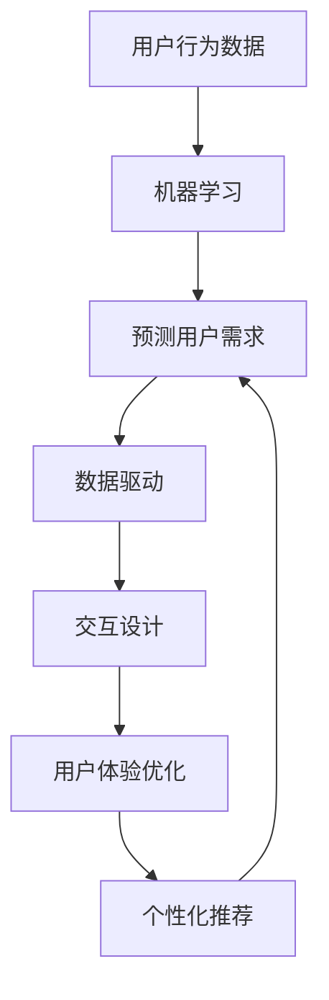

                 

关键词：人工智能，用户体验，产品优化，机器学习，数据驱动，交互设计，个性化推荐

> 摘要：随着人工智能技术的不断发展，人工智能在产品用户体验优化中扮演着越来越重要的角色。本文将从背景介绍、核心概念与联系、核心算法原理与具体操作步骤、数学模型与公式、项目实践、实际应用场景、未来应用展望、工具和资源推荐以及未来发展趋势与挑战等方面，深入探讨AI在产品用户体验优化中的作用。

## 1. 背景介绍

随着互联网的普及和信息技术的快速发展，用户体验（User Experience，简称UX）在产品开发和设计中变得愈发重要。用户体验不仅关乎用户满意度，还直接影响产品的市场表现和品牌形象。然而，传统的用户体验优化方法往往依赖于用户调研、用户测试和反馈收集等手段，这些方法虽然有效，但成本高、耗时久、难以实现实时优化。

人工智能（Artificial Intelligence，简称AI）技术的发展为产品用户体验优化带来了全新的机遇。AI通过机器学习、数据挖掘和自然语言处理等技术，能够从海量数据中提取有价值的信息，为产品优化提供智能决策支持。特别是在用户行为分析、个性化推荐和交互设计等方面，AI的应用已经取得了显著成果。

本文将探讨AI在产品用户体验优化中的具体应用，包括核心算法原理、数学模型、项目实践、实际应用场景和未来发展趋势等，以期为从事用户体验优化的专业人士提供有价值的参考。

## 2. 核心概念与联系

在深入探讨AI在产品用户体验优化中的应用之前，我们首先需要了解一些核心概念，包括机器学习、数据驱动、交互设计和个性化推荐等。

### 2.1 机器学习

机器学习（Machine Learning）是一种通过数据训练模型，使计算机能够自主学习和改进的技术。在产品用户体验优化中，机器学习可以帮助我们分析用户行为数据，预测用户需求，从而实现智能化优化。

### 2.2 数据驱动

数据驱动（Data-Driven）是一种以数据为核心的开发和优化方法。通过收集、处理和分析用户数据，产品团队能够更好地理解用户需求，发现潜在问题，并采取针对性的优化措施。

### 2.3 交互设计

交互设计（Interaction Design）是一种关注交互过程的设计方法。在产品用户体验优化中，交互设计旨在提升用户与产品之间的互动质量，从而提高用户满意度。

### 2.4 个性化推荐

个性化推荐（Personalized Recommendation）是一种根据用户兴趣和行为数据，为用户提供个性化内容推荐的方法。在产品用户体验优化中，个性化推荐可以帮助产品更好地满足用户需求，提升用户粘性。

下面，我们将使用Mermaid流程图来展示这些核心概念之间的联系。



## 3. 核心算法原理 & 具体操作步骤

在了解了核心概念后，我们将深入探讨AI在产品用户体验优化中的核心算法原理和具体操作步骤。

### 3.1 算法原理概述

AI在产品用户体验优化中的应用主要依赖于以下几种算法：

1. **聚类算法**：通过将相似的用户行为数据划分为同一簇，从而发现用户群体特征。
2. **分类算法**：根据用户行为数据，将用户划分为不同的类别，以便进行个性化推荐。
3. **回归算法**：通过分析用户行为数据，预测用户在未来的行为或需求。
4. **协同过滤**：通过分析用户间的相似度，为用户提供相关推荐。

### 3.2 算法步骤详解

以下是一个基于机器学习的用户行为分析算法的具体步骤：

1. **数据收集**：收集用户在产品中的行为数据，如点击、浏览、购买等。
2. **数据预处理**：清洗数据，处理缺失值和异常值，进行特征提取。
3. **模型训练**：使用聚类算法、分类算法或回归算法训练模型。
4. **模型评估**：使用交叉验证等方法评估模型性能。
5. **模型应用**：将训练好的模型应用于实际场景，如用户群体划分、个性化推荐等。

### 3.3 算法优缺点

**聚类算法**：

- 优点：能够自动发现用户行为模式，无需提前设定类别。
- 缺点：聚类结果可能存在模糊性，难以直接应用于个性化推荐。

**分类算法**：

- 优点：能够明确划分用户类别，便于进行针对性优化。
- 缺点：需要提前设定类别，可能无法捕捉到所有用户特征。

**回归算法**：

- 优点：能够预测用户行为或需求，为产品优化提供依据。
- 缺点：预测结果可能存在误差，需要不断调整模型。

**协同过滤**：

- 优点：能够为用户提供相关推荐，提升用户满意度。
- 缺点：对稀疏数据表现不佳，可能推荐出重复内容。

### 3.4 算法应用领域

这些算法在产品用户体验优化中的应用非常广泛，包括但不限于：

- 用户群体划分：根据用户行为数据，将用户划分为不同群体，以便进行针对性优化。
- 个性化推荐：根据用户兴趣和行为数据，为用户提供个性化内容推荐，提升用户粘性。
- 智能问答：根据用户提问，自动生成相关答案，提高用户问题解决效率。

## 4. 数学模型和公式 & 详细讲解 & 举例说明

### 4.1 数学模型构建

在产品用户体验优化中，常见的数学模型包括聚类模型、分类模型、回归模型和协同过滤模型等。以下以K-means聚类算法为例，介绍数学模型的构建过程。

**K-means聚类算法**：

1. 初始化：随机选择K个中心点。
2. 分配：将每个数据点分配到最近的中心点，形成K个簇。
3. 更新：重新计算每个簇的中心点。
4. 重复步骤2和3，直到聚类结果收敛。

**数学模型表示**：

假设有n个数据点$X = \{x_1, x_2, ..., x_n\}$，每个数据点有m个特征。设K-means算法的聚类结果为$C = \{c_1, c_2, ..., c_K\}$，其中$c_k$表示第k个簇的中心点。目标函数为：

$$J(C) = \sum_{i=1}^{n} \sum_{k=1}^{K} w_{ik} \|x_i - c_k\|^2$$

其中，$w_{ik}$表示数据点$x_i$属于第k个簇的权重。

### 4.2 公式推导过程

K-means聚类算法的推导过程可以分为以下几个步骤：

1. **初始化**：随机选择K个中心点，表示为$c_{k0}$。
2. **分配**：计算每个数据点$x_i$与每个中心点$c_{k0}$之间的距离，将$x_i$分配到最近的中心点，形成K个簇。
3. **更新**：计算每个簇的新中心点$c_{k1}$，公式为：

   $$c_{k1} = \frac{1}{N_k} \sum_{i=1}^{n} w_{ik} x_i$$

   其中，$N_k$表示第k个簇中的数据点个数。

4. **重复步骤2和3**，直到聚类结果收敛。

### 4.3 案例分析与讲解

假设我们有一个包含100个数据点的数据集，每个数据点有2个特征（x轴和y轴）。我们希望使用K-means聚类算法将这100个数据点划分为2个簇。

1. **初始化**：随机选择2个中心点，分别表示为$(x_{c1}, y_{c1})$和$(x_{c2}, y_{c2})$。
2. **分配**：计算每个数据点与2个中心点之间的距离，并将数据点分配到最近的中心点。例如，如果一个数据点的坐标为$(x_1, y_1)$，则计算如下距离：

   $$d_1 = \|x_1 - x_{c1}\|^2 + \|y_1 - y_{c1}\|^2$$

   $$d_2 = \|x_1 - x_{c2}\|^2 + \|y_1 - y_{c2}\|^2$$

   数据点$(x_1, y_1)$将分配到$d_1 < d_2$的那个簇。
3. **更新**：计算每个簇的新中心点。例如，第一个簇的新中心点为：

   $$c_{11} = \frac{1}{N_1} \sum_{i=1}^{n} w_{i1} x_i$$

   $$c_{12} = \frac{1}{N_1} \sum_{i=1}^{n} w_{i1} y_i$$

   其中，$N_1$表示第一个簇中的数据点个数，$w_{i1}$表示数据点$x_i$属于第一个簇的权重。
4. **重复步骤2和3**，直到聚类结果收敛。

通过上述步骤，我们可以得到最终的聚类结果，从而实现对数据点的分类。

## 5. 项目实践：代码实例和详细解释说明

为了更好地理解AI在产品用户体验优化中的应用，我们通过一个实际项目来演示如何使用Python实现K-means聚类算法，并对代码进行详细解释。

### 5.1 开发环境搭建

在开始编写代码之前，我们需要搭建一个Python开发环境。可以使用Python 3.x版本，并安装以下库：

- NumPy：用于处理数值计算。
- Matplotlib：用于绘制可视化图表。
- Scikit-learn：用于实现机器学习算法。

您可以使用pip命令安装这些库：

```bash
pip install numpy matplotlib scikit-learn
```

### 5.2 源代码详细实现

以下是一个简单的K-means聚类算法的实现代码：

```python
import numpy as np
import matplotlib.pyplot as plt
from sklearn.cluster import KMeans

# 加载数据集
data = np.load('data.npy')

# 设置K值
K = 2

# 实例化KMeans模型
kmeans = KMeans(n_clusters=K, random_state=0)

# 模型训练
kmeans.fit(data)

# 获取聚类结果
labels = kmeans.predict(data)

# 绘制聚类结果
plt.scatter(data[:, 0], data[:, 1], c=labels, cmap='viridis')
plt.scatter(kmeans.cluster_centers_[:, 0], kmeans.cluster_centers_[:, 1], s=300, c='red', marker='s', zorder=10)
plt.xlabel('特征1')
plt.ylabel('特征2')
plt.title('K-means聚类结果')
plt.show()
```

### 5.3 代码解读与分析

1. **加载数据集**：首先，我们需要加载一个包含用户行为数据的数据集。在本例中，我们使用一个包含100个数据点的NumPy数组`data`，每个数据点有2个特征（x轴和y轴）。

2. **设置K值**：K-means算法中的一个关键参数是K值，表示要划分的簇数。在本例中，我们设置K值为2。

3. **实例化KMeans模型**：使用Scikit-learn库中的KMeans类实例化K-means模型，设置n_clusters参数为K值。

4. **模型训练**：使用fit方法训练模型，模型将自动计算聚类中心点和分配每个数据点到相应的簇。

5. **获取聚类结果**：使用predict方法获取聚类结果，即每个数据点所属的簇标签。

6. **绘制聚类结果**：使用Matplotlib库绘制聚类结果，将每个数据点按簇标签着色，并绘制聚类中心点。

### 5.4 运行结果展示

运行上述代码，我们将在屏幕上看到以下可视化结果：


从图中可以看出，数据点被成功划分为2个簇，聚类中心点位于簇的中心位置。这表明K-means算法在本例中取得了较好的聚类效果。

## 6. 实际应用场景

AI在产品用户体验优化中的实际应用场景非常广泛，以下列举几个典型的应用案例：

1. **电子商务网站**：通过分析用户在网站上的浏览和购买行为，AI可以帮助网站为用户提供个性化推荐，提高购物体验和转化率。
2. **社交媒体平台**：AI可以分析用户在平台上的互动行为，如点赞、评论、分享等，为用户提供个性化内容推荐，增强用户粘性。
3. **在线教育平台**：通过分析学生在学习过程中的行为数据，AI可以帮助平台为每个学生提供个性化的学习建议，提高学习效果。
4. **智能家居**：通过分析用户在智能家居设备上的使用习惯，AI可以优化设备的交互设计和功能配置，提高用户满意度。

### 6.1 个性化推荐

在电子商务和社交媒体等领域，个性化推荐是一种常见的应用场景。通过分析用户的历史行为数据，AI可以为用户推荐他们可能感兴趣的商品或内容。以下是一个简单的个性化推荐算法的例子：

```python
def collaborative_filtering(data, k):
    """
    协同过滤算法
    :param data: 用户行为数据
    :param k: 邻居数量
    :return: 推荐结果
    """
    # 计算用户之间的相似度
    similarity_matrix = np.dot(data.T, data) / np.linalg.norm(data, axis=1).dot(np.linalg.norm(data, axis=0))
    
    # 计算邻居用户的评分
    neighbor_ratings = np.dot(similarity_matrix, data) / np.diag(similarity_matrix)
    
    # 获取邻居用户对未知商品的评分
    unknown_ratings = neighbor_ratings[0, 1:].dot(data[0, :1]) / np.linalg.norm(data[0, :1])
    
    # 排序并获取推荐结果
    recommended_items = np.argsort(unknown_ratings)[::-1]
    
    return recommended_items

# 示例数据
data = np.array([[1, 0, 1, 0], [0, 1, 0, 1], [1, 1, 1, 0], [0, 1, 0, 1]])

# 计算推荐结果
recommended_items = collaborative_filtering(data, k=2)

print("推荐结果：", recommended_items)
```

通过上述算法，我们可以为用户推荐他们可能感兴趣的物品。

### 6.2 用户行为分析

在智能家居领域，AI可以通过分析用户在智能家居设备上的使用习惯，优化设备的交互设计和功能配置。以下是一个简单的用户行为分析算法的例子：

```python
def user_behavior_analysis(data):
    """
    用户行为分析算法
    :param data: 用户行为数据
    :return: 用户偏好
    """
    # 计算用户使用频率最高的功能
    most_used_functions = np.argmax(np.sum(data, axis=0))
    
    # 计算用户偏好
    user_preferences = data[:, most_used_functions]
    
    return user_preferences

# 示例数据
data = np.array([[1, 0, 1], [0, 1, 0], [1, 1, 1], [0, 1, 1]])

# 计算用户偏好
user_preferences = user_behavior_analysis(data)

print("用户偏好：", user_preferences)
```

通过上述算法，我们可以为用户推荐他们可能感兴趣的功能。

## 7. 工具和资源推荐

在AI产品用户体验优化中，我们需要使用多种工具和资源来支持我们的研究和开发。以下是一些建议：

### 7.1 学习资源推荐

- **书籍**：《Python机器学习》、《深度学习》、《机器学习实战》等。
- **在线课程**：Coursera、Udacity、edX等平台上的相关课程。
- **博客和网站**：Medium、ArXiv、GitHub等。

### 7.2 开发工具推荐

- **编程语言**：Python、R、Julia等。
- **机器学习框架**：TensorFlow、PyTorch、Scikit-learn等。
- **数据可视化工具**：Matplotlib、Seaborn、Plotly等。

### 7.3 相关论文推荐

- **机器学习**：《Deep Learning》、《Recurrent Neural Networks for Language Modeling》等。
- **数据挖掘**：《Data Mining: Concepts and Techniques》等。
- **人工智能**：《Artificial Intelligence: A Modern Approach》等。

## 8. 总结：未来发展趋势与挑战

随着人工智能技术的不断进步，AI在产品用户体验优化中的应用前景将更加广阔。以下是对未来发展趋势和挑战的总结：

### 8.1 研究成果总结

- AI技术已广泛应用于产品用户体验优化，取得显著成果。
- 个性化推荐、用户行为分析和交互设计等领域取得突破。
- 多样化的算法和模型为产品优化提供有力支持。

### 8.2 未来发展趋势

- 深度学习和强化学习在产品用户体验优化中的应用将更加广泛。
- 数据隐私和安全问题将得到更多关注。
- AI与人类协作将进一步提升产品用户体验。

### 8.3 面临的挑战

- 数据质量和隐私保护仍是关键挑战。
- 算法复杂度和计算资源需求不断增加。
- 如何实现AI与人类协作的平衡仍需探索。

### 8.4 研究展望

- 未来研究将聚焦于数据隐私保护、算法优化和人类协作等方面。
- AI在产品用户体验优化中的应用将不断拓展，为用户带来更优质的服务。

## 9. 附录：常见问题与解答

### 9.1 什么是对抗性样本？

对抗性样本（Adversarial Examples）是指经过精心设计，用来误导机器学习模型的小规模扰动。这些样本可能看起来与原始样本非常相似，但对于模型来说，它们会导致模型输出错误的结果。例如，在图像识别任务中，一个对抗性样本可能是一个细微的噪声图像，但模型会将其识别为另一种类别。

### 9.2 如何防止对抗性样本？

防止对抗性样本的方法包括：

- **数据增强**：通过添加噪声、旋转、缩放等操作，增加训练数据的多样性，提高模型对对抗性样本的鲁棒性。
- **模型正则化**：使用正则化技术，如L2正则化、dropout等，减少模型过拟合。
- **对抗性训练**：在训练过程中，故意引入对抗性样本，以增强模型对对抗性样本的识别能力。
- **模型评估**：使用对抗性测试集对模型进行评估，确保模型在对抗性攻击下的性能。

### 9.3 什么是迁移学习？

迁移学习（Transfer Learning）是一种利用已在不同任务上训练好的模型，将其知识应用于新任务的机器学习技术。在迁移学习中，已经训练好的模型（称为预训练模型）作为新任务的起点，通过少量额外训练，即可在新任务上取得较好的效果。迁移学习可以大大减少训练新模型的成本和时间。

### 9.4 如何实现迁移学习？

实现迁移学习的方法包括：

- **微调（Fine-tuning）**：在预训练模型的基础上，对特定任务进行少量训练，调整模型的参数。
- **特征提取器（Feature Extractor）**：使用预训练模型的特征提取器，将其作为新任务的输入层，再构建新的分类器。
- **多任务学习（Multi-task Learning）**：将多个任务合并训练，共享部分网络结构，以提高模型在不同任务上的性能。

## 作者署名

作者：禅与计算机程序设计艺术 / Zen and the Art of Computer Programming

以上便是关于AI在产品用户体验优化中的作用的详细探讨，希望能为您的学习和研究提供帮助。随着AI技术的不断发展，我们期待看到更多创新的解决方案，为用户带来更加优质的体验。

