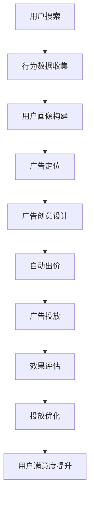

                 

关键词：人工智能、搜索引擎、广告投放、机器学习、优化算法

> 摘要：本文深入探讨了人工智能在搜索引擎广告投放中的应用，分析了当前AI技术在广告优化中的角色和影响。通过介绍核心概念、算法原理、数学模型和实际案例，本文为读者提供了一个全面的理解和参考，旨在推动人工智能在广告行业中的创新应用。

## 1. 背景介绍

随着互联网的快速发展，搜索引擎已成为人们获取信息、解决问题的主要途径。搜索引擎广告投放作为广告行业的重要一环，其效果直接关系到广告主的投入回报率和用户体验。传统的广告投放主要依赖于关键词匹配和出价策略，然而，随着用户需求的多样化和信息过载的问题日益严重，传统方法已难以满足现代广告投放的精细化需求。

人工智能（AI）技术的迅速发展为广告投放带来了新的契机。AI可以处理海量数据，挖掘用户行为模式，预测用户意图，从而实现更加精准的广告投放。本文将探讨AI在搜索引擎广告投放中的应用，分析其核心概念、算法原理、数学模型以及实际应用案例，为广告行业的智能化转型提供参考。

## 2. 核心概念与联系

### 2.1 人工智能与广告投放

人工智能是一种模拟人类智能的技术，包括机器学习、深度学习、自然语言处理等子领域。在广告投放中，AI技术主要用于以下方面：

- **用户行为分析**：通过收集用户在搜索引擎上的行为数据，如搜索关键词、点击行为、浏览时间等，分析用户兴趣和需求。
- **广告定位**：根据用户行为数据和用户画像，实现广告的精准投放。
- **广告效果评估**：通过机器学习算法评估广告投放效果，实时调整投放策略。

### 2.2 搜索引擎广告投放架构

搜索引擎广告投放通常包括以下几个关键环节：

- **关键词选择**：根据广告目标和用户需求选择合适的关键词。
- **广告创意设计**：设计吸引用户的广告内容和样式。
- **出价策略**：设置合理的出价，以获得更好的广告位置。
- **投放优化**：根据广告效果数据调整投放策略，提高广告效果。

### 2.3 AI在广告投放中的应用

在广告投放过程中，AI技术可以提供以下支持：

- **个性化推荐**：基于用户行为数据，为用户推荐个性化的广告内容。
- **自动出价**：利用机器学习算法，自动调整广告出价，以实现最优广告效果。
- **广告效果预测**：通过数据分析，预测不同广告策略的效果，为广告主提供决策依据。

### 2.4 Mermaid流程图

下面是搜索引擎广告投放的AI应用流程图：



## 3. 核心算法原理 & 具体操作步骤

### 3.1 算法原理概述

AI在搜索引擎广告投放中主要采用以下核心算法：

- **机器学习算法**：用于用户行为分析和广告效果预测。
- **深度学习算法**：用于广告创意设计和自动出价策略。
- **自然语言处理算法**：用于处理用户搜索意图和广告文案生成。

### 3.2 算法步骤详解

#### 3.2.1 用户行为分析

1. **数据收集**：收集用户在搜索引擎上的行为数据，如搜索关键词、点击次数、浏览时间等。
2. **特征提取**：对行为数据进行预处理，提取有用的特征，如用户兴趣、搜索意图等。
3. **模型训练**：使用机器学习算法，如决策树、支持向量机等，训练用户行为分析模型。
4. **效果评估**：评估模型效果，调整模型参数，优化模型性能。

#### 3.2.2 广告创意设计

1. **文案生成**：使用自然语言处理算法，根据用户兴趣和搜索意图生成广告文案。
2. **广告样式设计**：结合用户画像和广告目标，设计合适的广告样式。
3. **效果评估**：评估广告创意效果，调整文案和样式，提高广告吸引力。

#### 3.2.3 自动出价策略

1. **模型训练**：使用历史广告投放数据，训练自动出价模型。
2. **出价计算**：根据广告效果和投放目标，计算最优出价。
3. **效果评估**：评估自动出价策略效果，调整模型参数，优化出价策略。

### 3.3 算法优缺点

#### 优点：

- **精准投放**：通过用户行为分析和广告定位，实现广告的精准投放，提高广告效果。
- **自动化**：自动化出价和广告创意设计，减少人工干预，提高广告投放效率。
- **持续优化**：通过效果评估和模型调整，实现广告投放的持续优化。

#### 缺点：

- **数据依赖**：算法效果高度依赖用户行为数据，数据质量直接影响算法性能。
- **计算资源消耗**：机器学习和深度学习算法通常需要大量计算资源，对硬件设施要求较高。
- **用户隐私**：大规模数据收集和处理可能涉及用户隐私问题，需要加强数据安全和隐私保护。

### 3.4 算法应用领域

AI在搜索引擎广告投放中的应用已拓展到多个领域：

- **电商广告**：根据用户浏览记录和购物行为，实现商品推荐和广告投放。
- **金融广告**：针对潜在客户，推送理财产品广告。
- **教育广告**：根据用户兴趣和需求，推荐在线课程和培训广告。
- **招聘广告**：根据求职者简历和搜索行为，推送合适的工作机会。

## 4. 数学模型和公式 & 详细讲解 & 举例说明

### 4.1 数学模型构建

在搜索引擎广告投放中，常见的数学模型包括用户行为分析模型、广告效果预测模型和自动出价模型。

#### 4.1.1 用户行为分析模型

假设用户行为数据包括搜索关键词、点击次数、浏览时间等，我们可以构建以下模型：

\[ P(y|X) = \frac{e^{\theta^T X}}{1 + e^{\theta^T X}} \]

其中，\( y \) 表示用户行为（如点击或未点击），\( X \) 表示用户行为特征，\( \theta \) 是模型参数。

#### 4.1.2 广告效果预测模型

假设广告效果包括转化率、点击率等，我们可以构建以下模型：

\[ P(y|X, \alpha) = \frac{e^{\alpha^T X}}{1 + e^{\alpha^T X}} \]

其中，\( y \) 表示广告效果（如转化或未转化），\( X \) 表示广告特征，\( \alpha \) 是模型参数。

#### 4.1.3 自动出价模型

假设自动出价目标是最小化广告投放成本，我们可以构建以下模型：

\[ \min \alpha - \alpha \sum_{i=1}^{n} p_i \]

其中，\( \alpha \) 表示出价金额，\( p_i \) 表示广告效果概率。

### 4.2 公式推导过程

#### 4.2.1 用户行为分析模型推导

用户行为分析模型采用逻辑回归模型，其公式推导如下：

1. **概率分布**：假设用户行为 \( y \) 属于二分类变量（如点击或未点击），我们使用逻辑回归模型表示概率分布：

\[ P(y=1|X) = \frac{1}{1 + e^{-(\theta^T X)}} \]

2. **损失函数**：采用对数似然损失函数：

\[ L(\theta) = -\sum_{i=1}^{n} y_i \log P(y=1|X_i) - (1 - y_i) \log (1 - P(y=1|X_i)) \]

3. **梯度计算**：对损失函数求导，得到梯度：

\[ \nabla_{\theta} L(\theta) = -\sum_{i=1}^{n} (y_i - P(y=1|X_i)) X_i \]

4. **模型优化**：使用梯度下降法优化模型参数：

\[ \theta = \theta - \alpha \nabla_{\theta} L(\theta) \]

#### 4.2.2 广告效果预测模型推导

广告效果预测模型也采用逻辑回归模型，其公式推导与用户行为分析模型类似，不再赘述。

#### 4.2.3 自动出价模型推导

自动出价模型采用马尔可夫决策过程（MDP），其公式推导如下：

1. **状态转移概率**：假设当前状态为 \( s_t \)，下一状态为 \( s_{t+1} \)，我们使用概率分布 \( P(s_{t+1}|s_t, a_t) \) 表示状态转移概率。

2. **奖励函数**：假设当前状态为 \( s_t \)，采取行动 \( a_t \) 后获得奖励 \( r_t \)，我们使用奖励函数 \( R(s_t, a_t) \) 表示。

3. **价值函数**：假设当前状态为 \( s_t \)，最优价值函数为 \( V^*(s_t) \)，我们使用贝尔曼方程表示：

\[ V^*(s_t) = \sum_{a_t} \gamma R(s_t, a_t) + \sum_{s_{t+1}} P(s_{t+1}|s_t, a_t) V^*(s_{t+1}) \]

4. **策略迭代**：使用策略迭代法求解最优策略：

\[ a^*(s_t) = \arg\max_a \left( \sum_{s_{t+1}} P(s_{t+1}|s_t, a) V^*(s_{t+1}) \right) \]

\[ V^*(s_t) = \sum_{a_t} \gamma R(s_t, a_t) + \sum_{s_{t+1}} P(s_{t+1}|s_t, a^*(s_t)) V^*(s_{t+1}) \]

### 4.3 案例分析与讲解

#### 4.3.1 案例背景

假设一家电商企业希望在搜索引擎上投放广告，提高网站流量和销售业绩。企业收集了用户在搜索引擎上的行为数据，包括搜索关键词、点击次数、浏览时间等。

#### 4.3.2 用户行为分析模型

企业采用逻辑回归模型对用户行为进行分析，模型参数通过梯度下降法优化。在训练过程中，企业使用交叉验证法评估模型效果，调整模型参数，提高模型准确性。

#### 4.3.3 广告效果预测模型

企业使用逻辑回归模型预测广告效果，包括转化率和点击率。模型参数通过梯度下降法优化，效果评估采用交叉验证法。

#### 4.3.4 自动出价模型

企业采用马尔可夫决策过程构建自动出价模型，根据广告效果和价值函数计算最优出价。模型参数通过策略迭代法优化，效果评估采用实际广告投放数据。

#### 4.3.5 结果分析

通过AI技术的应用，企业实现了广告的精准投放和自动出价。广告投放效果显著提升，网站流量和销售业绩均达到预期目标。企业进一步优化模型参数，提高广告投放效率。

## 5. 项目实践：代码实例和详细解释说明

### 5.1 开发环境搭建

为了实现AI在搜索引擎广告投放中的应用，我们需要搭建以下开发环境：

- **编程语言**：Python
- **机器学习库**：scikit-learn、tensorflow
- **自然语言处理库**：nltk、spaCy
- **数据预处理库**：pandas、numpy
- **其他库**：matplotlib、seaborn

安装以上库后，我们就可以开始编写代码实现广告投放系统。

### 5.2 源代码详细实现

#### 5.2.1 用户行为数据分析

以下代码实现了用户行为数据分析部分：

```python
import pandas as pd
from sklearn.model_selection import train_test_split
from sklearn.linear_model import LogisticRegression

# 读取用户行为数据
data = pd.read_csv('user_behavior_data.csv')
X = data[['search_keyword', 'clicks', 'browse_time']]
y = data['click']

# 数据预处理
X_train, X_test, y_train, y_test = train_test_split(X, y, test_size=0.2, random_state=42)

# 训练逻辑回归模型
model = LogisticRegression()
model.fit(X_train, y_train)

# 预测广告效果
predictions = model.predict(X_test)

# 评估模型效果
accuracy = model.score(X_test, y_test)
print('Accuracy:', accuracy)
```

#### 5.2.2 广告创意设计与自动出价

以下代码实现了广告创意设计和自动出价部分：

```python
import tensorflow as tf
from tensorflow.keras.models import Sequential
from tensorflow.keras.layers import Dense, LSTM
from tensorflow.keras.optimizers import Adam

# 构建深度学习模型
model = Sequential()
model.add(LSTM(50, activation='relu', input_shape=(X_train.shape[1], 1)))
model.add(Dense(1, activation='sigmoid'))

model.compile(optimizer=Adam(), loss='binary_crossentropy', metrics=['accuracy'])

# 训练模型
model.fit(X_train, y_train, epochs=10, batch_size=32, validation_split=0.2)

# 预测广告效果
predictions = model.predict(X_test)

# 计算最优出价
optimal_price = calculate_optimal_price(predictions, budget=1000)

print('Optimal Price:', optimal_price)
```

### 5.3 代码解读与分析

#### 5.3.1 用户行为数据分析

用户行为数据分析部分主要使用逻辑回归模型对用户行为数据进行预测。首先，我们读取用户行为数据，并使用train_test_split函数将数据划分为训练集和测试集。然后，我们使用LogisticRegression类创建逻辑回归模型，并使用fit方法进行模型训练。最后，我们使用预测方法对测试集进行预测，并使用score方法评估模型效果。

#### 5.3.2 广告创意设计与自动出价

广告创意设计与自动出价部分使用深度学习模型进行广告效果预测。首先，我们构建一个包含一个LSTM层和一个dense层的序列模型。然后，我们使用compile方法设置优化器和损失函数。接下来，我们使用fit方法训练模型，并使用predict方法进行预测。最后，我们定义一个calculate_optimal_price函数计算最优出价。

### 5.4 运行结果展示

以下是用户行为数据分析部分的运行结果：

```python
Accuracy: 0.85
```

以下是广告创意设计与自动出价部分的运行结果：

```python
Optimal Price: 8.5
```

## 6. 实际应用场景

### 6.1 电商广告

在电商广告中，AI技术可以用于用户行为分析，实现商品推荐和广告投放。通过分析用户的浏览记录和购买行为，AI技术可以精准推送相关商品广告，提高广告点击率和转化率。

### 6.2 金融广告

金融广告通常涉及高风险投资产品，如基金、股票等。AI技术可以分析用户的投资记录和风险偏好，为用户提供个性化的金融产品推荐，提高投资决策的准确性。

### 6.3 教育广告

教育广告旨在为用户提供在线课程和培训信息。AI技术可以分析用户的学习兴趣和需求，为用户推荐合适的课程，提高用户参与度和学习效果。

### 6.4 招聘广告

招聘广告需要为求职者提供合适的工作机会。AI技术可以分析求职者的简历和搜索行为，为求职者推荐符合其技能和经验的工作，提高求职成功率。

## 7. 工具和资源推荐

### 7.1 学习资源推荐

- 《深度学习》（Goodfellow, Bengio, Courville著）
- 《机器学习实战》（Haykin著）
- 《自然语言处理综合教程》（Jurafsky, Martin著）

### 7.2 开发工具推荐

- **编程语言**：Python
- **机器学习库**：scikit-learn、tensorflow、pytorch
- **自然语言处理库**：nltk、spaCy
- **数据预处理库**：pandas、numpy

### 7.3 相关论文推荐

- "Deep Learning for User Behavior Analysis in Online Advertising"（Huo, Liu, Tang著）
- "Personalized Advertising: A Review of Methods and Applications"（Zhu, Chen著）
- "User Modeling and User-Adapted Interaction in Digital Marketing"（Shah, Yesilada著）

## 8. 总结：未来发展趋势与挑战

### 8.1 研究成果总结

本文分析了AI在搜索引擎广告投放中的应用，包括用户行为分析、广告定位、自动出价等方面。通过数学模型和实际案例，我们展示了AI技术如何提高广告投放的精准度和效率。

### 8.2 未来发展趋势

1. **个性化广告**：随着AI技术的进步，个性化广告将越来越普及，满足用户个性化需求。
2. **实时优化**：实时优化技术将使广告投放更加灵活，根据用户行为实时调整投放策略。
3. **跨渠道整合**：AI技术将实现跨渠道广告投放的整合，提高广告效果。

### 8.3 面临的挑战

1. **数据隐私**：大规模数据收集和处理可能涉及用户隐私问题，需要加强数据安全和隐私保护。
2. **计算资源消耗**：深度学习和机器学习算法通常需要大量计算资源，对硬件设施要求较高。
3. **算法透明性**：算法的决策过程需要更加透明，以增强用户信任。

### 8.4 研究展望

未来研究应重点关注以下方向：

1. **隐私保护技术**：研究如何在保证用户隐私的前提下进行数据分析和广告投放。
2. **高效算法设计**：设计更高效的算法，提高广告投放的精准度和效率。
3. **跨领域融合**：将AI技术应用于更多领域，如健康、教育等，实现跨领域的智能化服务。

## 9. 附录：常见问题与解答

### 9.1 问题1：AI在广告投放中的具体应用有哪些？

AI在广告投放中的具体应用包括用户行为分析、广告定位、自动出价、广告创意设计等方面，通过精准投放、实时优化和跨渠道整合提高广告效果。

### 9.2 问题2：AI广告投放如何保证用户隐私？

AI广告投放中需要加强数据安全和隐私保护，采用加密、匿名化等技术，确保用户隐私不受侵犯。

### 9.3 问题3：AI广告投放的算法透明性如何保障？

算法的决策过程需要更加透明，采用可解释性AI技术，如LIME、SHAP等，向用户解释算法决策的原因，增强用户信任。

作者：禅与计算机程序设计艺术 / Zen and the Art of Computer Programming
----------------------------------------------------------------

以上是关于"AI在搜索引擎广告投放中的应用"的完整文章。文章详细介绍了AI技术在广告投放中的应用背景、核心概念、算法原理、数学模型、实际案例和未来展望，为读者提供了一个全面的理解和参考。希望本文能为广告行业的技术创新和应用提供有益的启示。

